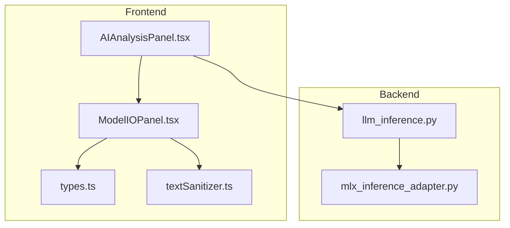
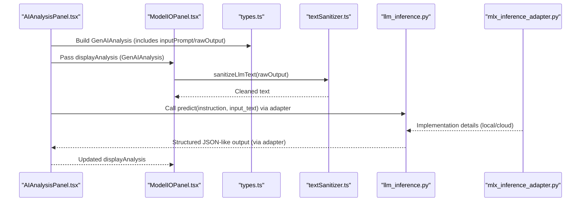
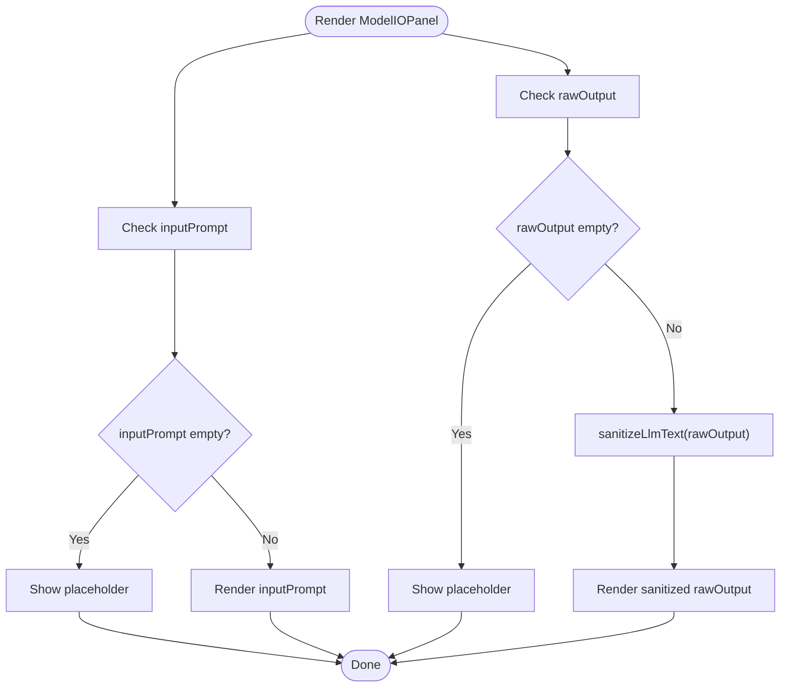
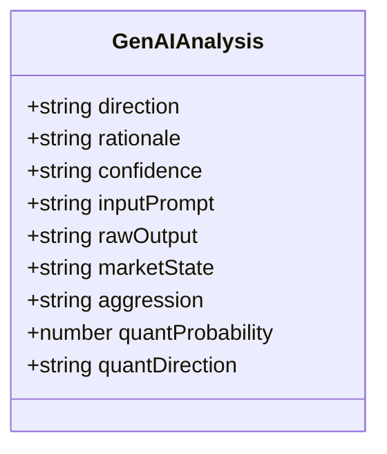
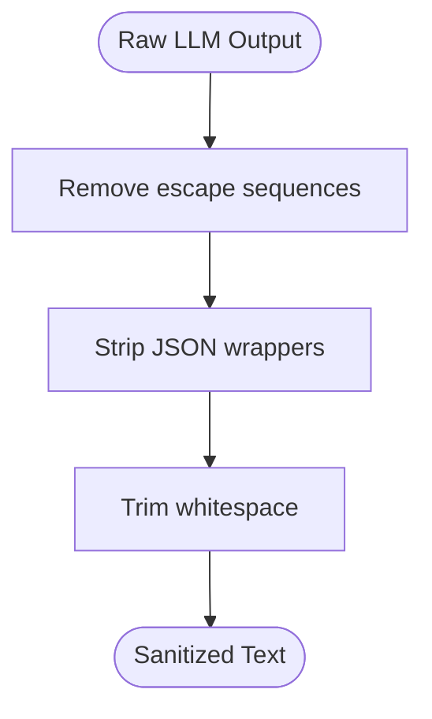
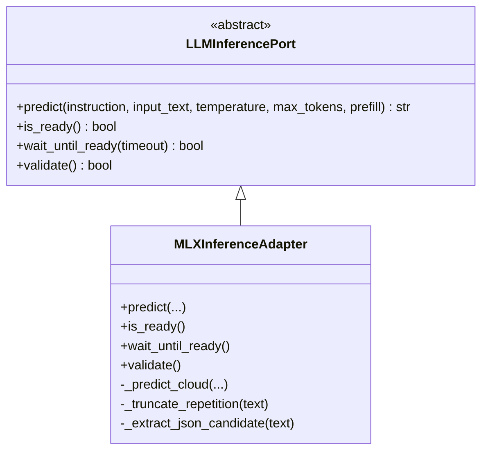
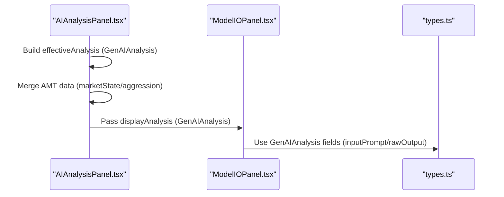
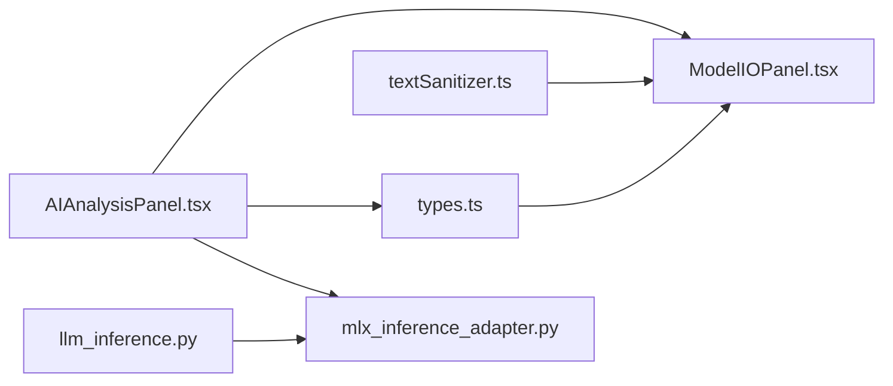

# Model I/O Panel

<cite>
**Referenced Files in This Document**
- [ModelIOPanel.tsx](file://frontend/components/ai/ModelIOPanel.tsx)
- [AIAnalysisPanel.tsx](file://frontend/components/AIAnalysisPanel.tsx)
- [types.ts](file://frontend/types.ts)
- [textSanitizer.ts](file://frontend/utils/textSanitizer.ts)
- [llm_inference.py](file://backend/app/domain/ports/llm_inference.py)
- [mlx_inference_adapter.py](file://backend/app/infrastructure/adapters/mlx_inference_adapter.py)
</cite>

## Table of Contents
1. [Introduction](#introduction)
2. [Project Structure](#project-structure)
3. [Core Components](#core-components)
4. [Architecture Overview](#architecture-overview)
5. [Detailed Component Analysis](#detailed-component-analysis)
6. [Dependency Analysis](#dependency-analysis)
7. [Performance Considerations](#performance-considerations)
8. [Troubleshooting Guide](#troubleshooting-guide)
9. [Conclusion](#conclusion)
10. [Appendices](#appendices)

## Introduction
The Model I/O Panel is a transparency and debugging UI component that displays the raw inputs and outputs of the AI inference system. It enables both technical and non-technical users to observe the reasoning process behind AI-driven decisions by showing:
- The prompt sent to the model (inputPrompt)
- The raw model output (rawOutput)
- Confidence and direction metadata (confidence, direction)
- Optional contextual fields (marketState, aggression, quantProbability, quantDirection)

By surfacing the “Model I/O” flow, the panel supports model interpretability, debugging, and education. It complements higher-level panels (e.g., AI Analysis Panel) by focusing on the raw inference data and sanitization pipeline.

## Project Structure
The Model I/O Panel lives in the frontend under the AI components and integrates with shared types and utilities. The backend provides the inference port and adapter that produce the data displayed by the panel.

**Diagram sources**
- [AIAnalysisPanel.tsx:1-120](file://frontend/components/AIAnalysisPanel.tsx#L1-L120)
- [ModelIOPanel.tsx:1-36](file://frontend/components/ai/ModelIOPanel.tsx#L1-L36)
- [types.ts:40-50](file://frontend/types.ts#L40-L50)
- [textSanitizer.ts:17-32](file://frontend/utils/textSanitizer.ts#L17-L32)
- [llm_inference.py:10-42](file://backend/app/domain/ports/llm_inference.py#L10-L42)
- [mlx_inference_adapter.py:184-266](file://backend/app/infrastructure/adapters/mlx_inference_adapter.py#L184-L266)

**Section sources**
- [ModelIOPanel.tsx:1-36](file://frontend/components/ai/ModelIOPanel.tsx#L1-L36)
- [AIAnalysisPanel.tsx:1-120](file://frontend/components/AIAnalysisPanel.tsx#L1-L120)
- [types.ts:40-50](file://frontend/types.ts#L40-L50)
- [textSanitizer.ts:1-51](file://frontend/utils/textSanitizer.ts#L1-L51)
- [llm_inference.py:10-42](file://backend/app/domain/ports/llm_inference.py#L10-L42)
- [mlx_inference_adapter.py:184-266](file://backend/app/infrastructure/adapters/mlx_inference_adapter.py#L184-L266)

## Core Components
- Model I/O Panel (UI): Displays inputPrompt and rawOutput with sanitized formatting and monospace typography for readability.
- Types: Defines GenAIAnalysis, including optional fields inputPrompt and rawOutput used by the panel.
- Text Sanitizer: Cleans escaped characters and JSON artifacts from raw LLM output before display.
- AI Analysis Panel: Orchestrates the effective analysis object and passes GenAIAnalysis to child panels, including Model I/O.
- Backend Inference Port and Adapter: Provides the predict() method and readiness checks that feed the GenAIAnalysis object.

Key responsibilities:
- Model I/O Panel: Render raw inputs and outputs with minimal transformation.
- AI Analysis Panel: Construct effective analysis and pass sanitized data to child panels.
- Text Sanitizer: Normalize escaping and JSON wrappers for safe UI rendering.
- Backend Adapter: Produce structured JSON-compatible outputs and handle fallback/cloud inference.

**Section sources**
- [ModelIOPanel.tsx:9-31](file://frontend/components/ai/ModelIOPanel.tsx#L9-L31)
- [types.ts:40-50](file://frontend/types.ts#L40-L50)
- [textSanitizer.ts:17-32](file://frontend/utils/textSanitizer.ts#L17-L32)
- [AIAnalysisPanel.tsx:38-60](file://frontend/components/AIAnalysisPanel.tsx#L38-L60)
- [llm_inference.py:13-27](file://backend/app/domain/ports/llm_inference.py#L13-L27)
- [mlx_inference_adapter.py:184-266](file://backend/app/infrastructure/adapters/mlx_inference_adapter.py#L184-L266)

## Architecture Overview
The Model I/O Panel participates in a layered architecture:
- Frontend UI (React) renders the panel and consumes GenAIAnalysis.
- Utilities sanitize raw LLM text for display.
- Backend inference port defines the contract for model inference.
- Backend adapter implements inference using local MLX runtime or cloud fallback.

**Diagram sources**
- [AIAnalysisPanel.tsx:38-60](file://frontend/components/AIAnalysisPanel.tsx#L38-L60)
- [ModelIOPanel.tsx:16-27](file://frontend/components/ai/ModelIOPanel.tsx#L16-L27)
- [types.ts:40-50](file://frontend/types.ts#L40-L50)
- [textSanitizer.ts:17-32](file://frontend/utils/textSanitizer.ts#L17-L32)
- [llm_inference.py:13-27](file://backend/app/domain/ports/llm_inference.py#L13-L27)
- [mlx_inference_adapter.py:184-266](file://backend/app/infrastructure/adapters/mlx_inference_adapter.py#L184-L266)

## Detailed Component Analysis

### Model I/O Panel (UI)
Purpose:
- Display raw AI model inputs and outputs for transparency and debugging.
- Provide monospace, preformatted text rendering for precise inspection of prompts and outputs.
- Gracefully handle missing data with placeholder messages.

Implementation highlights:
- Props: expects displayAnalysis of type GenAIAnalysis.
- Renders two labeled sections: “Prompt &rarr; Model” and “Model &rarr; Output.”
- Uses sanitizeLlmText for rawOutput to remove escape sequences and JSON wrappers.
- Falls back to user-friendly placeholders when inputPrompt or rawOutput are absent.

**Diagram sources**
- [ModelIOPanel.tsx:10-31](file://frontend/components/ai/ModelIOPanel.tsx#L10-L31)
- [textSanitizer.ts:17-32](file://frontend/utils/textSanitizer.ts#L17-L32)

**Section sources**
- [ModelIOPanel.tsx:9-31](file://frontend/components/ai/ModelIOPanel.tsx#L9-L31)
- [textSanitizer.ts:17-32](file://frontend/utils/textSanitizer.ts#L17-L32)

### Data Model: GenAIAnalysis
The GenAIAnalysis type defines the shape of the data consumed by the panel:
- direction, rationale, confidence
- inputPrompt (optional)
- rawOutput (optional)
- marketState, aggression, quantProbability, quantDirection (optional)

These fields enable the panel to present:
- Direction and rationale for quick interpretation
- Optional context (market state/aggression)
- Raw prompt and raw output for deep debugging

**Diagram sources**
- [types.ts:40-50](file://frontend/types.ts#L40-L50)

**Section sources**
- [types.ts:40-50](file://frontend/types.ts#L40-L50)

### Text Sanitization Pipeline
The sanitizer ensures raw LLM output is safe and readable:
- Removes escaped brackets, hyphens, quotes, tabs, and newlines.
- Strips JSON wrappers and trims whitespace.
- Provides a more aggressive variant for rationale fields.

**Diagram sources**
- [textSanitizer.ts:17-32](file://frontend/utils/textSanitizer.ts#L17-L32)

**Section sources**
- [textSanitizer.ts:17-32](file://frontend/utils/textSanitizer.ts#L17-L32)

### Backend Inference Contract and Adapter
The backend defines a port for LLM inference and provides an adapter that:
- Implements predict(instruction, input_text, temperature, max_tokens, prefill)
- Supports readiness checks and cloud fallback
- Normalizes outputs and truncates repetitive reasoning for overseer prompts

**Diagram sources**
- [llm_inference.py:10-42](file://backend/app/domain/ports/llm_inference.py#L10-L42)
- [mlx_inference_adapter.py:12-396](file://backend/app/infrastructure/adapters/mlx_inference_adapter.py#L12-L396)

**Section sources**
- [llm_inference.py:10-42](file://backend/app/domain/ports/llm_inference.py#L10-L42)
- [mlx_inference_adapter.py:184-266](file://backend/app/infrastructure/adapters/mlx_inference_adapter.py#L184-L266)

### Integration with AI Analysis Panel
The AI Analysis Panel constructs an effective analysis object and passes it down to child panels, including Model I/O. It also merges real-time AMT data (e.g., market state/aggression) with GenAIAnalysis to ensure the most up-to-date context.

**Diagram sources**
- [AIAnalysisPanel.tsx:38-60](file://frontend/components/AIAnalysisPanel.tsx#L38-L60)
- [ModelIOPanel.tsx:5-7](file://frontend/components/ai/ModelIOPanel.tsx#L5-L7)
- [types.ts:40-50](file://frontend/types.ts#L40-L50)

**Section sources**
- [AIAnalysisPanel.tsx:38-60](file://frontend/components/AIAnalysisPanel.tsx#L38-L60)
- [ModelIOPanel.tsx:5-7](file://frontend/components/ai/ModelIOPanel.tsx#L5-L7)
- [types.ts:40-50](file://frontend/types.ts#L40-L50)

## Dependency Analysis
- Model I/O Panel depends on:
  - GenAIAnalysis type for data shape
  - Text sanitizer for rawOutput formatting
  - AI Analysis Panel for data orchestration
- AI Analysis Panel depends on:
  - GenAIAnalysis type
  - AMT analysis for live market state and aggression
  - Backend inference port/adapter for model outputs
- Backend adapter depends on:
  - LLM inference port contract
  - Local MLX runtime or cloud fallback

**Diagram sources**
- [types.ts:40-50](file://frontend/types.ts#L40-L50)
- [ModelIOPanel.tsx:1-36](file://frontend/components/ai/ModelIOPanel.tsx#L1-L36)
- [textSanitizer.ts:1-51](file://frontend/utils/textSanitizer.ts#L1-L51)
- [AIAnalysisPanel.tsx:1-120](file://frontend/components/AIAnalysisPanel.tsx#L1-L120)
- [llm_inference.py:10-42](file://backend/app/domain/ports/llm_inference.py#L10-L42)
- [mlx_inference_adapter.py:184-266](file://backend/app/infrastructure/adapters/mlx_inference_adapter.py#L184-L266)

**Section sources**
- [ModelIOPanel.tsx:1-36](file://frontend/components/ai/ModelIOPanel.tsx#L1-L36)
- [AIAnalysisPanel.tsx:1-120](file://frontend/components/AIAnalysisPanel.tsx#L1-L120)
- [types.ts:40-50](file://frontend/types.ts#L40-L50)
- [textSanitizer.ts:1-51](file://frontend/utils/textSanitizer.ts#L1-L51)
- [llm_inference.py:10-42](file://backend/app/domain/ports/llm_inference.py#L10-L42)
- [mlx_inference_adapter.py:184-266](file://backend/app/infrastructure/adapters/mlx_inference_adapter.py#L184-L266)

## Performance Considerations
- Rendering large raw outputs: The panel uses a max-height container with vertical scrolling to prevent layout thrashing.
- Sanitization cost: Text sanitization is lightweight; avoid repeated sanitization by memoizing results upstream (e.g., in AI Analysis Panel).
- Backend inference latency: The adapter serializes generation calls and supports readiness checks; ensure callers use wait_until_ready() to avoid rendering stale data.
- Cloud fallback: When local model is unavailable, the adapter falls back to cloud inference; configure timeouts and retry policies appropriately.

[No sources needed since this section provides general guidance]

## Troubleshooting Guide
Common issues and resolutions:
- Empty or placeholder text:
  - Verify that inputPrompt and rawOutput are populated in GenAIAnalysis.
  - Confirm that the backend adapter’s predict() returns non-empty content.
- Escaped characters in output:
  - Ensure sanitizeLlmText is applied to rawOutput before rendering.
- Model not ready:
  - Use wait_until_ready() to block until the adapter reports readiness.
- Cloud fallback failures:
  - Check API keys and endpoint configuration; review retry logic and error logs.

**Section sources**
- [ModelIOPanel.tsx:16-27](file://frontend/components/ai/ModelIOPanel.tsx#L16-L27)
- [textSanitizer.ts:17-32](file://frontend/utils/textSanitizer.ts#L17-L32)
- [mlx_inference_adapter.py:363-374](file://backend/app/infrastructure/adapters/mlx_inference_adapter.py#L363-L374)
- [llm_inference.py:29-37](file://backend/app/domain/ports/llm_inference.py#L29-L37)

## Conclusion
The Model I/O Panel is a focused, transparent window into the AI inference pipeline. By displaying raw prompts and outputs alongside sanitized text, it empowers users to inspect, debug, and understand AI decisions. Its integration with the AI Analysis Panel and backend inference port ensures a cohesive flow from model execution to user-facing insights.

[No sources needed since this section summarizes without analyzing specific files]

## Appendices

### Example Use Cases
- Debugging AI decisions: Compare inputPrompt with rawOutput to validate reasoning alignment.
- Performance monitoring: Observe generation durations and readiness states from the backend adapter.
- Educational purposes: Show students and analysts how prompts influence outputs and how sanitization improves readability.

[No sources needed since this section provides general guidance]