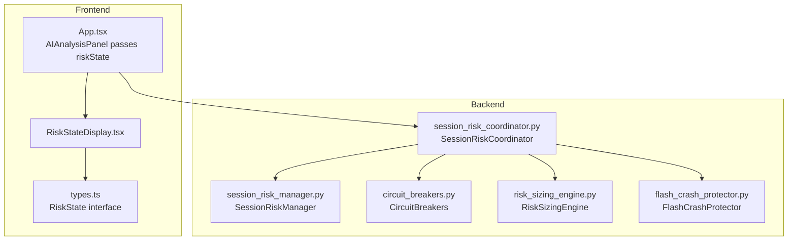
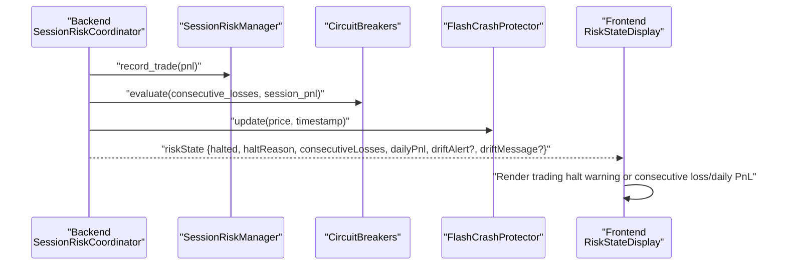
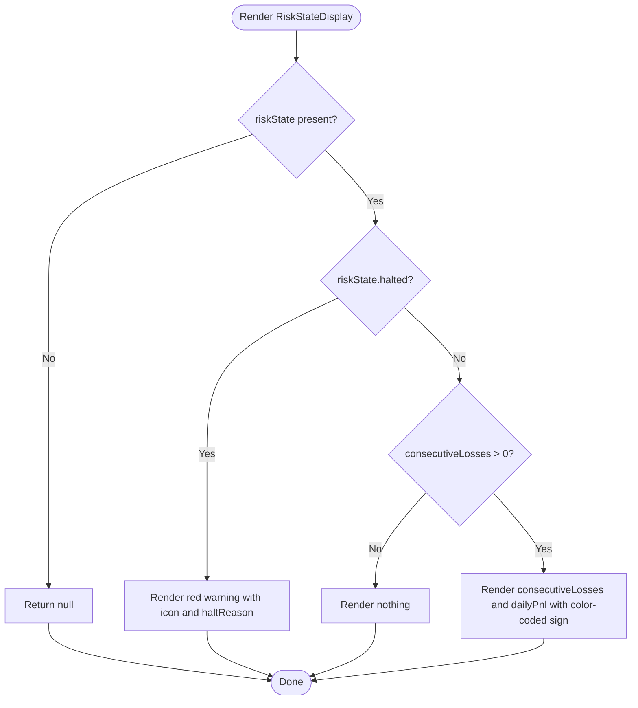
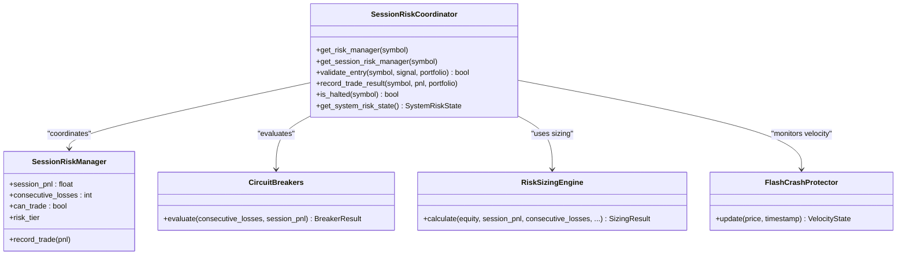
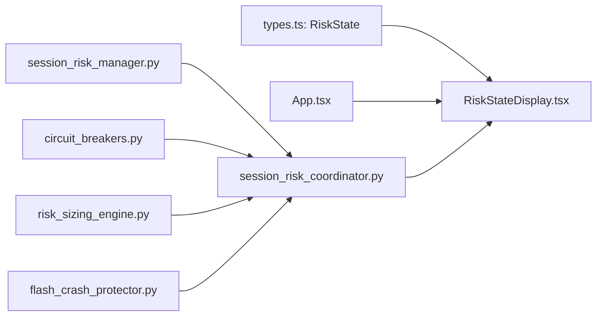

# Risk State Display

<cite>
**Referenced Files in This Document**
- [RiskStateDisplay.tsx](file://frontend/components/ai/RiskStateDisplay.tsx)
- [types.ts](file://frontend/types.ts)
- [App.tsx](file://frontend/App.tsx)
- [session_risk_coordinator.py](file://backend/app/application/services/session_risk_coordinator.py)
- [session_risk_manager.py](file://backend/app/domain/fabio_ai/services/session_risk_manager.py)
- [circuit_breakers.py](file://backend/app/domain/services/circuit_breakers.py)
- [risk_sizing_engine.py](file://backend/app/domain/services/risk_sizing_engine.py)
- [flash_crash_protector.py](file://backend/app/domain/services/flash_crash_protector.py)
</cite>

## Table of Contents
1. [Introduction](#introduction)
2. [Project Structure](#project-structure)
3. [Core Components](#core-components)
4. [Architecture Overview](#architecture-overview)
5. [Detailed Component Analysis](#detailed-component-analysis)
6. [Dependency Analysis](#dependency-analysis)
7. [Performance Considerations](#performance-considerations)
8. [Troubleshooting Guide](#troubleshooting-guide)
9. [Conclusion](#conclusion)

## Introduction
This document describes the Risk State Display component responsible for communicating current risk conditions and safety warnings to traders in real time. It explains how risk assessments are evaluated, how warnings are surfaced visually, and how the component integrates with backend risk management systems. The documentation covers circuit breaker status, position sizing context, safety thresholds, and dynamic risk adjustments, while also detailing visual design elements such as color coding, warning icons, and status indicators. Practical examples illustrate rendering under normal and emergency conditions, and guidance is provided for maintaining trading discipline and system safety.

## Project Structure
The Risk State Display lives in the frontend and consumes a typed risk state object that originates from backend risk management services. The backend aggregates risk signals, enforces circuit breakers, and exposes a concise risk state to the UI.

**Diagram sources**
- [RiskStateDisplay.tsx:1-37](file://frontend/components/ai/RiskStateDisplay.tsx#L1-L37)
- [types.ts:66-73](file://frontend/types.ts#L66-L73)
- [App.tsx:378](file://frontend/App.tsx#L378)
- [session_risk_coordinator.py:43-345](file://backend/app/application/services/session_risk_coordinator.py#L43-L345)
- [session_risk_manager.py:26-162](file://backend/app/domain/fabio_ai/services/session_risk_manager.py#L26-L162)
- [circuit_breakers.py:44-110](file://backend/app/domain/services/circuit_breakers.py#L44-L110)
- [risk_sizing_engine.py:44-204](file://backend/app/domain/services/risk_sizing_engine.py#L44-L204)
- [flash_crash_protector.py:41-124](file://backend/app/domain/services/flash_crash_protector.py#L41-L124)

**Section sources**
- [RiskStateDisplay.tsx:1-37](file://frontend/components/ai/RiskStateDisplay.tsx#L1-L37)
- [types.ts:66-73](file://frontend/types.ts#L66-L73)
- [App.tsx:378](file://frontend/App.tsx#L378)

## Core Components
- RiskStateDisplay (frontend): Renders trading halt warnings and consecutive loss counters with appropriate visual styling.
- RiskState (frontend types): Defines the shape of risk state passed from backend to UI.
- SessionRiskCoordinator (backend): Aggregates risk across symbols, evaluates circuit breakers, and produces a system risk state.
- SessionRiskManager (backend): Tracks session PnL, enforces 3-loss circuit breaker, and computes risk tiers.
- CircuitBreakers (backend): Enforces non-overridable hard limits (consecutive loss, daily drawdown, profit target).
- RiskSizingEngine (backend): Computes deterministic position sizing and risk tiers.
- FlashCrashProtector (backend): Monitors price velocity and halts trading during extreme spikes.

**Section sources**
- [RiskStateDisplay.tsx:9-32](file://frontend/components/ai/RiskStateDisplay.tsx#L9-L32)
- [types.ts:66-73](file://frontend/types.ts#L66-L73)
- [session_risk_coordinator.py:43-314](file://backend/app/application/services/session_risk_coordinator.py#L43-L314)
- [session_risk_manager.py:26-162](file://backend/app/domain/fabio_ai/services/session_risk_manager.py#L26-L162)
- [circuit_breakers.py:44-110](file://backend/app/domain/services/circuit_breakers.py#L44-L110)
- [risk_sizing_engine.py:44-204](file://backend/app/domain/services/risk_sizing_engine.py#L44-L204)
- [flash_crash_protector.py:41-124](file://backend/app/domain/services/flash_crash_protector.py#L41-L124)

## Architecture Overview
The frontend receives a normalized risk state from the backend and renders it as a compact, high-contrast indicator. The backend continuously evaluates multiple risk safeguards and updates the risk state accordingly.

**Diagram sources**
- [session_risk_coordinator.py:155-212](file://backend/app/application/services/session_risk_coordinator.py#L155-L212)
- [session_risk_manager.py:116-135](file://backend/app/domain/fabio_ai/services/session_risk_manager.py#L116-L135)
- [circuit_breakers.py:64-105](file://backend/app/domain/services/circuit_breakers.py#L64-L105)
- [flash_crash_protector.py:65-117](file://backend/app/domain/services/flash_crash_protector.py#L65-L117)
- [RiskStateDisplay.tsx:10-32](file://frontend/components/ai/RiskStateDisplay.tsx#L10-L32)

## Detailed Component Analysis

### RiskStateDisplay (Frontend)
- Purpose: Display trading halt warnings and consecutive loss counters with minimal UI overhead.
- Inputs: RiskState object containing halted, haltReason, consecutiveLosses, dailyPnl, optional driftAlert and driftMessage.
- Rendering logic:
  - If halted is true, render a prominent red warning with an icon and halt reason.
  - If not halted but consecutiveLosses > 0, render a compact row showing consecutive loss count and daily P&L with color-coded sign.
- Visual design:
  - Red background with subtle border for halt state.
  - Yellow accent for consecutive loss count.
  - Green/red color for daily P&L depending on sign.
  - Small, high-contrast typography suitable for real-time dashboards.

**Diagram sources**
- [RiskStateDisplay.tsx:10-32](file://frontend/components/ai/RiskStateDisplay.tsx#L10-L32)

**Section sources**
- [RiskStateDisplay.tsx:9-32](file://frontend/components/ai/RiskStateDisplay.tsx#L9-L32)
- [types.ts:66-73](file://frontend/types.ts#L66-L73)

### RiskState (Frontend Types)
- Fields:
  - halted: boolean
  - haltReason: string
  - consecutiveLosses: number
  - dailyPnl: number
  - driftAlert?: boolean
  - driftMessage?: string
- Usage: Passed from backend via the AI analysis panel to the RiskStateDisplay.

**Section sources**
- [types.ts:66-73](file://frontend/types.ts#L66-L73)

### Backend Risk Evaluation Pipeline
- SessionRiskCoordinator orchestrates risk:
  - Tracks per-symbol and system-wide risk.
  - Enforces multiple guards: signal grade threshold, session circuit breaker, daily loss limits, and standard risk manager checks.
  - Produces a consolidated system risk state including halt status, reasons, and drift alerts/messages.
- SessionRiskManager:
  - Maintains session PnL, trade counts, and consecutive win/loss streaks.
  - Enforces a 3-loss circuit breaker and determines risk tiers.
- CircuitBreakers:
  - Enforces non-overridable hard limits: consecutive loss thresholds, daily drawdown, and optional profit target lock.
- RiskSizingEngine:
  - Computes deterministic position sizing with risk tiers and scale-in plans.
- FlashCrashProtector:
  - Monitors price velocity and halts trading during extreme spikes.

**Diagram sources**
- [session_risk_coordinator.py:43-314](file://backend/app/application/services/session_risk_coordinator.py#L43-L314)
- [session_risk_manager.py:26-162](file://backend/app/domain/fabio_ai/services/session_risk_manager.py#L26-L162)
- [circuit_breakers.py:44-110](file://backend/app/domain/services/circuit_breakers.py#L44-L110)
- [risk_sizing_engine.py:44-204](file://backend/app/domain/services/risk_sizing_engine.py#L44-L204)
- [flash_crash_protector.py:41-124](file://backend/app/domain/services/flash_crash_protector.py#L41-L124)

**Section sources**
- [session_risk_coordinator.py:169-212](file://backend/app/application/services/session_risk_coordinator.py#L169-L212)
- [session_risk_manager.py:62-79](file://backend/app/domain/fabio_ai/services/session_risk_manager.py#L62-L79)
- [circuit_breakers.py:64-105](file://backend/app/domain/services/circuit_breakers.py#L64-L105)
- [risk_sizing_engine.py:77-203](file://backend/app/domain/services/risk_sizing_engine.py#L77-L203)
- [flash_crash_protector.py:65-117](file://backend/app/domain/services/flash_crash_protector.py#L65-L117)

### Integration with AI Analysis Panel and App
- The AIAnalysisPanel receives riskState from the active instrument state and forwards it to RiskStateDisplay.
- App.tsx wires the AI panel and ensures riskState is available to the display component.

**Section sources**
- [App.tsx:378](file://frontend/App.tsx#L378)
- [RiskStateDisplay.tsx:10-32](file://frontend/components/ai/RiskStateDisplay.tsx#L10-L32)

### Visual Design Elements
- Trading Halt Warning:
  - Icon: AlertTriangle.
  - Background: Red with translucent overlay and soft red border.
  - Typography: Uppercase “Trading Halted” label with a muted secondary line for the reason.
- Consecutive Losses and Daily PnL:
  - Layout: Compact two-column row.
  - Color coding: Yellow for consecutive loss count; green for positive daily PnL, red for negative.
  - Units: Currency symbol and two decimals for daily PnL.

**Section sources**
- [RiskStateDisplay.tsx:15-29](file://frontend/components/ai/RiskStateDisplay.tsx#L15-L29)

### Examples of Risk State Rendering
- Normal session with small losses:
  - Display: Consecutive Losses count and daily P&L row with red daily PnL.
- After three consecutive losses:
  - Display: Prominent red “Trading Halted” banner with halt reason.
- Emergency price spike (flash crash):
  - Backend: FlashCrashProtector triggers halt; SessionRiskCoordinator propagates halted state; Frontend shows red warning.

**Section sources**
- [RiskStateDisplay.tsx:15-23](file://frontend/components/ai/RiskStateDisplay.tsx#L15-L23)
- [flash_crash_protector.py:89-98](file://backend/app/domain/services/flash_crash_protector.py#L89-L98)
- [session_risk_manager.py:127-134](file://backend/app/domain/fabio_ai/services/session_risk_manager.py#L127-L134)

## Dependency Analysis
- Frontend depends on:
  - RiskState interface for type safety.
  - RiskStateDisplay for rendering risk state.
- Backend depends on:
  - SessionRiskCoordinator to orchestrate risk across subsystems.
  - SessionRiskManager for session-level circuit breaker and risk tiers.
  - CircuitBreakers for hard limits enforcement.
  - RiskSizingEngine for sizing context and risk tiers.
  - FlashCrashProtector for velocity-based halts.

**Diagram sources**
- [types.ts:66-73](file://frontend/types.ts#L66-L73)
- [RiskStateDisplay.tsx:1-37](file://frontend/components/ai/RiskStateDisplay.tsx#L1-L37)
- [App.tsx:378](file://frontend/App.tsx#L378)
- [session_risk_coordinator.py:43-314](file://backend/app/application/services/session_risk_coordinator.py#L43-L314)
- [session_risk_manager.py:26-162](file://backend/app/domain/fabio_ai/services/session_risk_manager.py#L26-L162)
- [circuit_breakers.py:44-110](file://backend/app/domain/services/circuit_breakers.py#L44-L110)
- [risk_sizing_engine.py:44-204](file://backend/app/domain/services/risk_sizing_engine.py#L44-L204)
- [flash_crash_protector.py:41-124](file://backend/app/domain/services/flash_crash_protector.py#L41-L124)

**Section sources**
- [session_risk_coordinator.py:169-212](file://backend/app/application/services/session_risk_coordinator.py#L169-L212)
- [session_risk_manager.py:62-79](file://backend/app/domain/fabio_ai/services/session_risk_manager.py#L62-L79)
- [circuit_breakers.py:64-105](file://backend/app/domain/services/circuit_breakers.py#L64-L105)
- [risk_sizing_engine.py:77-203](file://backend/app/domain/services/risk_sizing_engine.py#L77-L203)
- [flash_crash_protector.py:65-117](file://backend/app/domain/services/flash_crash_protector.py#L65-L117)

## Performance Considerations
- RiskStateDisplay is memoized and only renders when riskState changes, minimizing re-renders.
- Backend calculations for sizing and circuit breakers are lightweight and deterministic, enabling frequent updates without UI lag.
- FlashCrashProtector maintains a bounded price history window to keep memory and computation constant over time.

[No sources needed since this section provides general guidance]

## Troubleshooting Guide
- Risk display shows no content:
  - Verify riskState is provided and not null.
  - Confirm the AIAnalysisPanel is passing riskState to RiskStateDisplay.
- Persistent halt warning:
  - Check SessionRiskManager’s halt state and reason.
  - Review CircuitBreakers evaluation for consecutive loss or daily drawdown triggers.
- Unexpected sizing or risk tier:
  - Inspect RiskSizingEngine parameters and inputs (equity, session_pnl, consecutive_losses).
- Flash crash halts:
  - Investigate FlashCrashProtector velocity thresholds and recent price movements.

**Section sources**
- [RiskStateDisplay.tsx:10-11](file://frontend/components/ai/RiskStateDisplay.tsx#L10-L11)
- [App.tsx:378](file://frontend/App.tsx#L378)
- [session_risk_manager.py:82-88](file://backend/app/domain/fabio_ai/services/session_risk_manager.py#L82-L88)
- [circuit_breakers.py:64-105](file://backend/app/domain/services/circuit_breakers.py#L64-L105)
- [risk_sizing_engine.py:77-203](file://backend/app/domain/services/risk_sizing_engine.py#L77-L203)
- [flash_crash_protector.py:65-117](file://backend/app/domain/services/flash_crash_protector.py#L65-L117)

## Conclusion
The Risk State Display is a focused, high-impact UI element that communicates critical risk conditions to traders. Backed by robust backend risk management—circuit breakers, session risk controls, sizing logic, and flash crash protection—the component ensures transparency, safety, and disciplined trading. Its minimalist design and real-time updates help traders maintain situational awareness and avoid risky behavior during volatile or emergency market conditions.