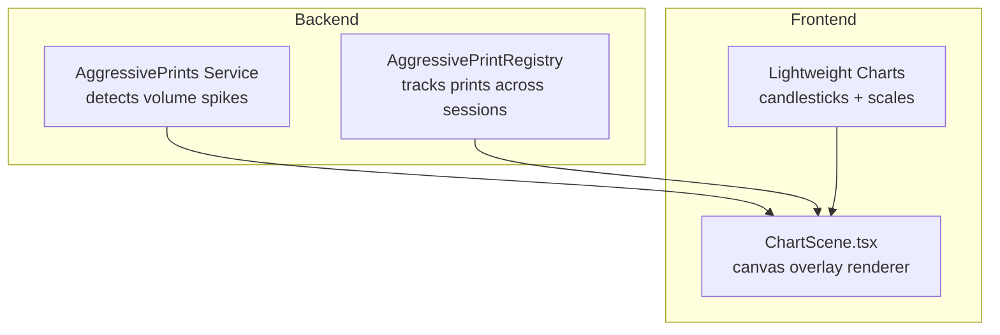
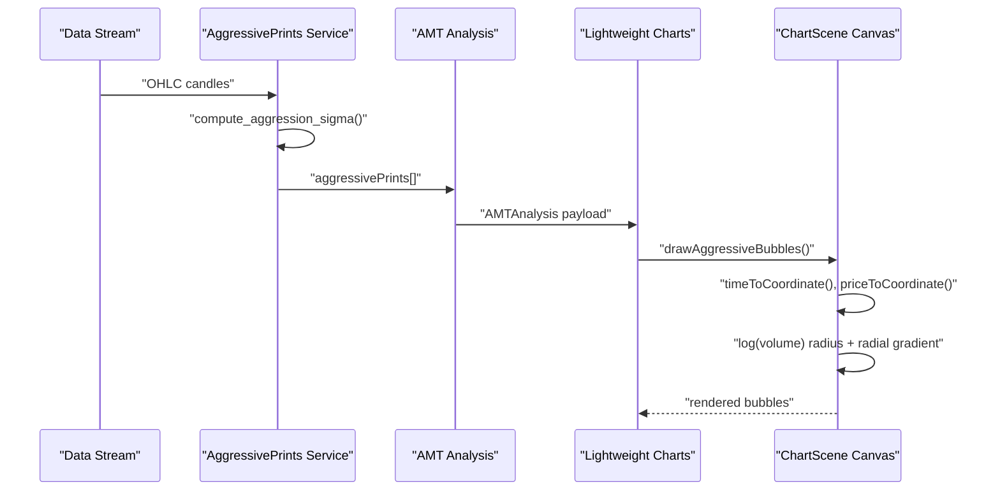
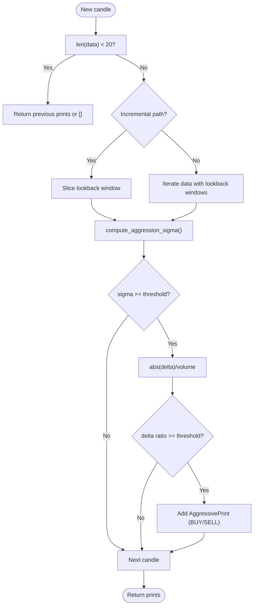
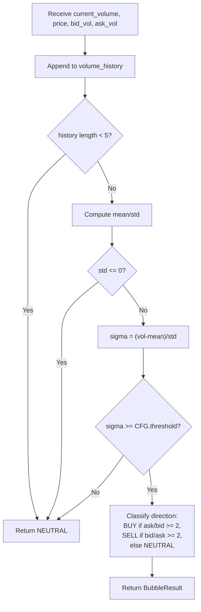
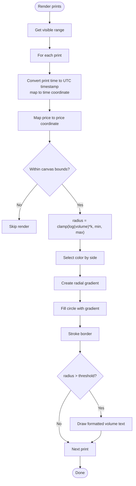
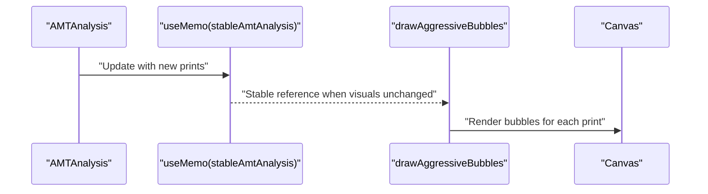
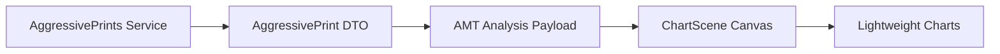

# Aggressive Print Bubble Visualization

<cite>
**Referenced Files in This Document**
- [aggressive_prints.py](file://backend/app/domain/services/aggressive_prints.py)
- [bubble_detector.py](file://backups/backend_v2/src/orderflow/bubble_detector.py)
- [ChartScene.tsx](file://frontend/components/ChartScene.tsx)
- [VolumeAccessory.tsx](file://frontend/components/VolumeAccessory.tsx)
- [test_aggressive_prints.py](file://backend/tests/unit/domain/test_aggressive_prints.py)
</cite>

## Table of Contents
1. [Introduction](#introduction)
2. [Project Structure](#project-structure)
3. [Core Components](#core-components)
4. [Architecture Overview](#architecture-overview)
5. [Detailed Component Analysis](#detailed-component-analysis)
6. [Dependency Analysis](#dependency-analysis)
7. [Performance Considerations](#performance-considerations)
8. [Troubleshooting Guide](#troubleshooting-guide)
9. [Conclusion](#conclusion)

## Introduction
This document describes the aggressive print bubble visualization system that highlights large-volume trades on the chart canvas. The system detects statistically significant volume spikes using robust statistical thresholds, transforms time/price coordinates to canvas coordinates, renders scalable bubbles with radial gradients and directional coloring, and overlays readable volume labels. It integrates with AMT analysis data to present actionable market microstructure insights in real time.

## Project Structure
The aggressive print bubble visualization spans backend detection and frontend rendering:

- Backend detection:
  - Statistical detection of aggressive prints using dynamic thresholds
  - Registry for retest analysis and persistent bubble tracking
- Frontend rendering:
  - Canvas overlay on top of the Lightweight Charts candlesticks
  - Coordinate transformation from time/price to pixel coordinates
  - Bubble rendering with logarithmic sizing, radial gradients, and directional coloring
  - Text overlay for volume display when bubbles are large enough

**Diagram sources**
- [aggressive_prints.py:1-174](file://backend/app/domain/services/aggressive_prints.py#L1-L174)
- [ChartScene.tsx:375-484](file://frontend/components/ChartScene.tsx#L375-L484)

**Section sources**
- [aggressive_prints.py:1-174](file://backend/app/domain/services/aggressive_prints.py#L1-L174)
- [ChartScene.tsx:375-484](file://frontend/components/ChartScene.tsx#L375-L484)

## Core Components
- AggressivePrints detection service:
  - Computes a dynamic sigma score using EMA-based mean and variance
  - Applies a delta-directionality threshold to classify buy/sell prints
  - Supports incremental updates for streaming performance
- AggressivePrintRegistry:
  - Maintains a persistent list of detected prints
  - Enables retest analysis around recent price levels
- Frontend bubble renderer:
  - Converts time/price to canvas coordinates
  - Renders bubbles with logarithmic radius scaling
  - Applies radial gradients and directional colors
  - Displays volume text when bubble is large enough

**Section sources**
- [aggressive_prints.py:20-174](file://backend/app/domain/services/aggressive_prints.py#L20-L174)
- [ChartScene.tsx:428-484](file://frontend/components/ChartScene.tsx#L428-L484)

## Architecture Overview
The system operates as follows:
- Backend continuously computes aggressive prints from OHLC data streams
- AMT analysis packages prints alongside profile and levels for visualization
- Frontend receives stable references to AMT data and draws bubbles on a canvas overlay
- Coordinate systems translate between time/price and pixel space

**Diagram sources**
- [aggressive_prints.py:76-144](file://backend/app/domain/services/aggressive_prints.py#L76-L144)
- [ChartScene.tsx:399-402](file://frontend/components/ChartScene.tsx#L399-L402)
- [ChartScene.tsx:428-484](file://frontend/components/ChartScene.tsx#L428-L484)

## Detailed Component Analysis

### Backend: AggressivePrints Detection
- Configuration:
  - sigma_threshold: statistical significance threshold for volume spike detection
  - ema_period: smoothing period for dynamic mean/variance
  - delta_directionality_threshold: minimum proportion of delta volume relative to total volume
  - lookback/min_data/expiry_candles: sliding-window and retention controls
- Algorithm:
  - compute_aggression_sigma: EMA mean/variance with population seeding and a minimum standard deviation floor
  - find_aggressive_prints: incremental or full scan to detect prints meeting both sigma and delta criteria
- Registry:
  - AggressivePrintRegistry stores prints and supports retest queries near current price levels

**Diagram sources**
- [aggressive_prints.py:76-144](file://backend/app/domain/services/aggressive_prints.py#L76-L144)
- [aggressive_prints.py:34-74](file://backend/app/domain/services/aggressive_prints.py#L34-L74)

**Section sources**
- [aggressive_prints.py:20-32](file://backend/app/domain/services/aggressive_prints.py#L20-L32)
- [aggressive_prints.py:34-74](file://backend/app/domain/services/aggressive_prints.py#L34-L74)
- [aggressive_prints.py:76-144](file://backend/app/domain/services/aggressive_prints.py#L76-L144)
- [aggressive_prints.py:147-174](file://backend/app/domain/services/aggressive_prints.py#L147-L174)

### Backend: Alternative Bubble Detector (v2)
An alternate bubble detection implementation exists that:
- Uses a rolling window of volumes to compute mean/std
- Flags bubbles when sigma meets a configurable threshold
- Classifies directionality from bid/ask volumes

**Diagram sources**
- [bubble_detector.py:27-113](file://backups/backend_v2/src/orderflow/bubble_detector.py#L27-L113)

**Section sources**
- [bubble_detector.py:16-25](file://backups/backend_v2/src/orderflow/bubble_detector.py#L16-L25)
- [bubble_detector.py:36-109](file://backups/backend_v2/src/orderflow/bubble_detector.py#L36-L109)

### Frontend: Bubble Renderer
- Coordinate transformation:
  - Converts print time to UTC timestamp and maps to chart time coordinate
  - Maps price to chart price coordinate using the candlestick series
- Bubble rendering:
  - Radius computed from log(volume) scaled by a constant factor with min/max bounds
  - Radial gradient from center (high opacity) to edge (low opacity)
  - Directional coloring: buy bubbles use bullish color, sell bubbles use bearish color
  - Optional stroke border for contrast
- Text overlay:
  - Draws white monospaced volume label centered on bubble when radius exceeds a threshold
  - Uses a helper to format thousands for readability

**Diagram sources**
- [ChartScene.tsx:428-484](file://frontend/components/ChartScene.tsx#L428-L484)

**Section sources**
- [ChartScene.tsx:428-484](file://frontend/components/ChartScene.tsx#L428-L484)

### Integration with AMT Analysis Data
- The frontend memoizes AMTAnalysis to avoid unnecessary redraws when only non-visual fields change
- The overlay only renders aggressive prints when present in the stable AMTAnalysis reference
- The renderer accesses print.time, print.price, print.volume, and print.side to draw bubbles

**Diagram sources**
- [ChartScene.tsx:78-110](file://frontend/components/ChartScene.tsx#L78-L110)
- [ChartScene.tsx:399-402](file://frontend/components/ChartScene.tsx#L399-L402)
- [ChartScene.tsx:428-484](file://frontend/components/ChartScene.tsx#L428-L484)

**Section sources**
- [ChartScene.tsx:78-110](file://frontend/components/ChartScene.tsx#L78-L110)
- [ChartScene.tsx:399-402](file://frontend/components/ChartScene.tsx#L399-L402)

## Dependency Analysis
- Backend depends on:
  - OHLC data structures and AggressivePrint value objects
  - Numerical computation for EMA mean/variance
- Frontend depends on:
  - Lightweight Charts APIs for coordinate mapping
  - AMTAnalysis payload containing aggressive prints
  - Utility helpers for color conversion and text formatting

**Diagram sources**
- [aggressive_prints.py:15](file://backend/app/domain/services/aggressive_prints.py#L15)
- [ChartScene.tsx:400-401](file://frontend/components/ChartScene.tsx#L400-L401)

**Section sources**
- [aggressive_prints.py:15](file://backend/app/domain/services/aggressive_prints.py#L15)
- [ChartScene.tsx:400-401](file://frontend/components/ChartScene.tsx#L400-L401)

## Performance Considerations
- Backend:
  - Incremental detection path minimizes recomputation when data grows by one element
  - Expiry window limits memory footprint for long streams
  - Minimum data checks prevent premature detections during warm-up
- Frontend:
  - Stable references for AMTAnalysis and OHLC data reduce redraw frequency
  - Overlay only redraws when visual-relevant fields change
  - Canvas operations are scoped to visible range
- Rendering:
  - Logarithmic radius scaling prevents extremely large bubbles for massive trades
  - Conditional text rendering avoids overdraw for small bubbles

**Section sources**
- [aggressive_prints.py:88-120](file://backend/app/domain/services/aggressive_prints.py#L88-L120)
- [ChartScene.tsx:78-110](file://frontend/components/ChartScene.tsx#L78-L110)
- [ChartScene.tsx:399-402](file://frontend/components/ChartScene.tsx#L399-L402)

## Troubleshooting Guide
- No bubbles appear:
  - Verify aggressive prints are present in the AMTAnalysis payload
  - Confirm the overlay is enabled and the canvas is properly sized
- Incorrect coordinates or bubbles off-screen:
  - Ensure time values are converted to UTC timestamps and within visible range
  - Check that price coordinates align with the candlestick series
- Overly large or tiny bubbles:
  - Adjust the logarithmic scaling factor and min/max radius bounds
- Text not visible:
  - Increase the radius threshold for text rendering or adjust font size/contrast
- Performance issues:
  - Confirm stable references are preventing unnecessary redraws
  - Limit visible range and avoid excessive gradient recalculations

**Section sources**
- [ChartScene.tsx:445-482](file://frontend/components/ChartScene.tsx#L445-L482)
- [test_aggressive_prints.py:1-200](file://backend/tests/unit/domain/test_aggressive_prints.py#L1-L200)

## Conclusion
The aggressive print bubble visualization combines robust backend detection with efficient frontend rendering to surface large-volume trades. The system uses dynamic statistical thresholds, directional classification, and scalable visual encoding to communicate market intensity. Its modular design enables easy styling customization and real-time updates with minimal overhead.