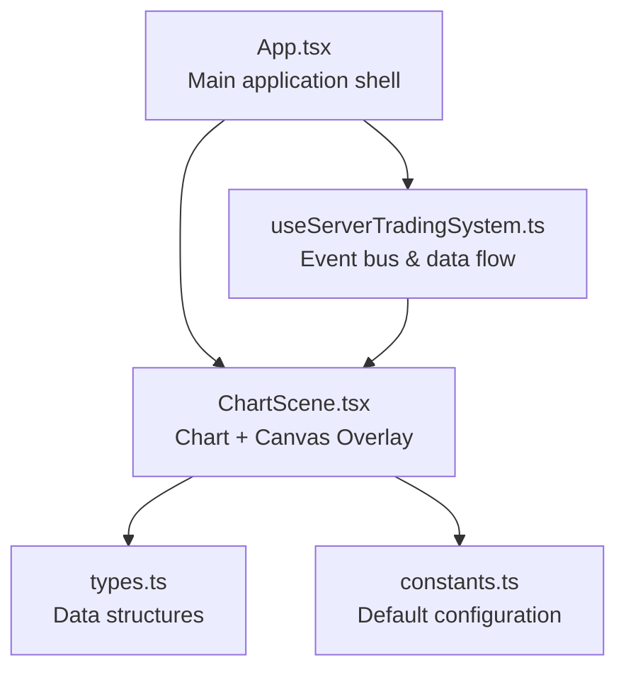
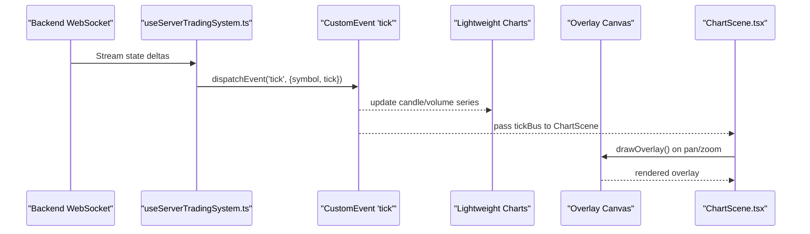
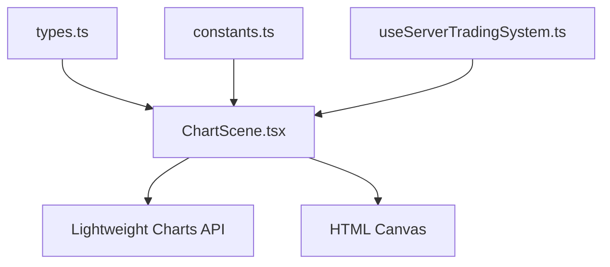

# Canvas Overlay Rendering System

<cite>
**Referenced Files in This Document**
- [ChartScene.tsx](file://frontend/components/ChartScene.tsx)
- [types.ts](file://frontend/types.ts)
- [constants.ts](file://frontend/constants.ts)
- [App.tsx](file://frontend/App.tsx)
- [useServerTradingSystem.ts](file://frontend/hooks/useServerTradingSystem.ts)
</cite>

## Table of Contents
1. [Introduction](#introduction)
2. [Project Structure](#project-structure)
3. [Core Components](#core-components)
4. [Architecture Overview](#architecture-overview)
5. [Detailed Component Analysis](#detailed-component-analysis)
6. [Dependency Analysis](#dependency-analysis)
7. [Performance Considerations](#performance-considerations)
8. [Troubleshooting Guide](#troubleshooting-guide)
9. [Conclusion](#conclusion)

## Introduction
This document describes the canvas overlay system used for advanced chart visualizations in the trading frontend. It covers the overlay canvas implementation, coordinate transformation between chart and canvas spaces, the drawing pipeline, lifecycle management, event subscriptions for pan/zoom events, and performance optimization techniques including memoization and selective redraws. It also documents coordinate conversion functions, visible range detection, and responsive overlay sizing, with practical examples of overlay initialization, cleanup procedures, and integration with chart events.

## Project Structure
The canvas overlay system is implemented within the ChartScene component, which integrates with the Lightweight Charts library and a custom canvas overlay for advanced visualizations such as volume profiles, aggressive prints, footprint displays, and range bar overlays.

**Diagram sources**
- [App.tsx:150-205](file://frontend/App.tsx#L150-L205)
- [ChartScene.tsx:1-120](file://frontend/components/ChartScene.tsx#L1-L120)
- [types.ts:1-376](file://frontend/types.ts#L1-L376)
- [constants.ts:1-28](file://frontend/constants.ts#L1-L28)
- [useServerTradingSystem.ts:280-479](file://frontend/hooks/useServerTradingSystem.ts#L280-L479)

**Section sources**
- [App.tsx:150-205](file://frontend/App.tsx#L150-L205)
- [ChartScene.tsx:1-120](file://frontend/components/ChartScene.tsx#L1-L120)
- [types.ts:1-376](file://frontend/types.ts#L1-L376)
- [constants.ts:1-28](file://frontend/constants.ts#L1-L28)
- [useServerTradingSystem.ts:280-479](file://frontend/hooks/useServerTradingSystem.ts#L280-L479)

## Core Components
- ChartScene: The primary component that initializes Lightweight Charts, manages overlay canvas, handles pan/zoom events, and orchestrates drawing pipelines for different chart modes (Standard, Footprint, Range).
- Data structures: Types define the data shapes for OHLC, AMT analysis, footprint candles, and range bar data used by the overlay.
- Configuration: Default chart configuration controls colors, visibility toggles, and overlay modes.
- Event bus: A CustomEvent-based tickBus delivers real-time ticks to the chart without triggering React state updates.

Key responsibilities:
- Initialize chart and series, subscribe to pan/zoom events, and manage overlay canvas sizing.
- Implement drawing pipelines for volume profiles, aggressive prints, footprint cells, and range bar overlays.
- Apply memoization and selective redraws to optimize performance.
- Integrate with backend event bus for real-time updates.

**Section sources**
- [ChartScene.tsx:51-115](file://frontend/components/ChartScene.tsx#L51-L115)
- [types.ts:229-301](file://frontend/types.ts#L229-L301)
- [constants.ts:4-19](file://frontend/constants.ts#L4-L19)
- [useServerTradingSystem.ts:296-304](file://frontend/hooks/useServerTradingSystem.ts#L296-L304)

## Architecture Overview
The overlay system consists of:
- Lightweight Charts for base candlesticks, volumes, and price/time coordinates.
- A separate HTML canvas overlaid on top of the chart for custom drawings.
- A CustomEvent-based tickBus for real-time updates that bypass React state updates.
- Pan/zoom subscription to trigger overlay redraws only when the visible range changes.

**Diagram sources**
- [useServerTradingSystem.ts:296-304](file://frontend/hooks/useServerTradingSystem.ts#L296-L304)
- [ChartScene.tsx:277-320](file://frontend/components/ChartScene.tsx#L277-L320)
- [ChartScene.tsx:375-425](file://frontend/components/ChartScene.tsx#L375-L425)

## Detailed Component Analysis

### ChartScene Component
ChartScene is the central orchestrator for chart initialization, overlay canvas management, and drawing pipelines.

- Initialization and sizing:
  - Creates Lightweight Charts with configurable layout, grid, and time scale options.
  - Uses ResizeObserver to synchronize chart and overlay canvas sizes on container resize.
  - Applies mode-specific series visibility and bar spacing.

- Real-time tick subscription:
  - Subscribes to a CustomEvent named 'tick' via tickBus.
  - Updates candlestick and histogram series directly via native APIs to avoid React overhead.
  - Guards against stale/out-of-order ticks with try/catch.

- Overlay lifecycle:
  - Draws overlay content when data changes and on pan/zoom events.
  - Subscribes to visible logical range changes to redraw only when needed.
  - Clears overlay canvas before each draw cycle.

- Drawing pipelines:
  - Standard mode: draws aggressive bubbles and volume profiles.
  - Footprint mode: draws footprint cells, global levels, and CVD line.
  - Range mode: draws volume profiles and range bar overlays (VWAP, POC, VAH/VAL).

- Coordinate transformations:
  - Converts time strings to UNIX timestamps with IST offset.
  - Uses timeScale methods for coordinate conversions: timeToCoordinate, logicalToCoordinate, priceToCoordinate.
  - Detects visible range via getVisibleLogicalRange and iterates only visible bars.

- Performance optimizations:
  - Memoizes AMT analysis to avoid overlay redraws when only backend-provided references change.
  - Stabilizes data reference to prevent redraws on intra-candle tick updates.
  - Uses React.memo with a custom comparator to prevent unnecessary re-renders.

- Cleanup:
  - Disconnects ResizeObserver and removes chart on unmount.
  - Unsubscribes from pan/zoom events and tickBus listeners.

**Section sources**
- [ChartScene.tsx:116-275](file://frontend/components/ChartScene.tsx#L116-L275)
- [ChartScene.tsx:277-320](file://frontend/components/ChartScene.tsx#L277-L320)
- [ChartScene.tsx:375-425](file://frontend/components/ChartScene.tsx#L375-L425)
- [ChartScene.tsx:428-484](file://frontend/components/ChartScene.tsx#L428-L484)
- [ChartScene.tsx:625-652](file://frontend/components/ChartScene.tsx#L625-L652)
- [ChartScene.tsx:685-980](file://frontend/components/ChartScene.tsx#L685-L980)
- [ChartScene.tsx:982-1086](file://frontend/components/ChartScene.tsx#L982-L1086)
- [ChartScene.tsx:1495-1514](file://frontend/components/ChartScene.tsx#L1495-L1514)

### Coordinate Transformation Functions
The overlay relies on Lightweight Charts coordinate conversion APIs:
- timeToCoordinate: converts a time value to pixel x-coordinate.
- logicalToCoordinate: converts a logical index to pixel x-coordinate.
- priceToCoordinate: converts a price value to pixel y-coordinate.

These are used extensively for:
- Placing aggressive bubbles at precise screen coordinates.
- Rendering footprint cells aligned with candle positions.
- Drawing horizontal lines for POC/VAH/VAL levels.
- Plotting CVD line segments within the visible range.

**Section sources**
- [ChartScene.tsx:445-447](file://frontend/components/ChartScene.tsx#L445-L447)
- [ChartScene.tsx:697-759](file://frontend/components/ChartScene.tsx#L697-L759)
- [ChartScene.tsx:1022-1070](file://frontend/components/ChartScene.tsx#L1022-L1070)

### Visible Range Detection
The overlay determines which bars are visible and should be drawn:
- Retrieves the visible logical range from the time scale.
- Iterates from Math.floor(from) to Math.ceil(to).
- Skips out-of-range indices and invalid coordinates.

This ensures efficient rendering by limiting work to visible bars only.

**Section sources**
- [ChartScene.tsx:438-439](file://frontend/components/ChartScene.tsx#L438-L439)
- [ChartScene.tsx:697-698](file://frontend/components/ChartScene.tsx#L697-L698)
- [ChartScene.tsx:751-759](file://frontend/components/ChartScene.tsx#L751-L759)

### Responsive Overlay Sizing
The overlay canvas is kept in sync with the chart container:
- ResizeObserver observes the chart container and updates chart dimensions.
- Sets overlay canvas width and height to match the chart container.
- On tab visibility changes, re-applies dimensions to ensure correct scaling.

**Section sources**
- [ChartScene.tsx:221-234](file://frontend/components/ChartScene.tsx#L221-L234)
- [ChartScene.tsx:321-339](file://frontend/components/ChartScene.tsx#L321-L339)

### Drawing Pipelines

#### Aggressive Bubbles
- Converts print timestamps to coordinates.
- Computes bubble radius based on logarithmic volume scaling.
- Renders radial gradients and borders, with optional numeric labels.

**Section sources**
- [ChartScene.tsx:428-484](file://frontend/components/ChartScene.tsx#L428-L484)

#### Volume Profile (Session/Leg/Combined)
- Calculates maximum volume to normalize bar widths.
- Draws directional bars with alpha blending and highlights for POC/HVN/LVN/VA.
- Supports combined mode with dual profiles on the right side.

**Section sources**
- [ChartScene.tsx:487-610](file://frontend/components/ChartScene.tsx#L487-L610)
- [ChartScene.tsx:625-652](file://frontend/components/ChartScene.tsx#L625-L652)

#### Footprint Display
- Renders spine (wick/body) for each candle.
- Draws bid/ask footprint columns with intensity based on imbalance ratios.
- Highlights stacked imbalances and POC levels.
- Shows totals and delta cards per candle.
- Draws CVD line in the bottom summary area.

**Section sources**
- [ChartScene.tsx:685-980](file://frontend/components/ChartScene.tsx#L685-L980)

#### Range Bars Overlay
- Draws VWAP, POC, VAH, VAL lines across the chart width.
- Adds descriptive labels and Triple-A detection indicators.

**Section sources**
- [ChartScene.tsx:982-1086](file://frontend/components/ChartScene.tsx#L982-L1086)

### Overlay Lifecycle Management
- Initialization: Creates chart, adds series, applies mode-specific options, sets up ResizeObserver, and loads initial data.
- Real-time updates: Listens for 'tick' events and updates series via native APIs.
- Overlay drawing: Subscribes to pan/zoom events to redraw overlay content.
- Cleanup: Removes observers, unsubscribes events, and destroys chart on unmount.

**Section sources**
- [ChartScene.tsx:116-194](file://frontend/components/ChartScene.tsx#L116-L194)
- [ChartScene.tsx:277-320](file://frontend/components/ChartScene.tsx#L277-L320)
- [ChartScene.tsx:375-425](file://frontend/components/ChartScene.tsx#L375-L425)
- [ChartScene.tsx:270-275](file://frontend/components/ChartScene.tsx#L270-L275)

### Event Subscriptions for Pan/Zoom
- Subscribes to timeScale().subscribeVisibleLogicalRangeChange to trigger overlay redraws.
- Unsubscribes on cleanup to prevent leaks.

**Section sources**
- [ChartScene.tsx:417-424](file://frontend/components/ChartScene.tsx#L417-L424)

### Integration with Chart Events
- ChartScene receives tickBus and symbol props from App.tsx.
- Real-time tick updates are dispatched via CustomEvent and handled by ChartScene without React state churn.

**Section sources**
- [App.tsx:154-204](file://frontend/App.tsx#L154-L204)
- [useServerTradingSystem.ts:296-304](file://frontend/hooks/useServerTradingSystem.ts#L296-L304)

## Dependency Analysis
The overlay system depends on:
- Lightweight Charts for base rendering and coordinate systems.
- CustomEvent-based tickBus for real-time updates.
- React.memo and useMemo for performance optimization.
- Mode-specific data structures (AMTAnalysis, FootprintCandle, RangeBarData).

**Diagram sources**
- [types.ts:229-301](file://frontend/types.ts#L229-L301)
- [ChartScene.tsx:1-16](file://frontend/components/ChartScene.tsx#L1-L16)
- [constants.ts:4-19](file://frontend/constants.ts#L4-L19)
- [useServerTradingSystem.ts:296-304](file://frontend/hooks/useServerTradingSystem.ts#L296-L304)

**Section sources**
- [types.ts:229-301](file://frontend/types.ts#L229-L301)
- [ChartScene.tsx:1-16](file://frontend/components/ChartScene.tsx#L1-L16)
- [constants.ts:4-19](file://frontend/constants.ts#L4-L19)
- [useServerTradingSystem.ts:296-304](file://frontend/hooks/useServerTradingSystem.ts#L296-L304)

## Performance Considerations
- Memoization:
  - AMT analysis memoization compares visually relevant fields to avoid overlay redraws when only backend-provided references change.
  - Data reference stabilization prevents redraws on intra-candle tick updates.
  - React.memo with a custom comparator prevents unnecessary re-renders of ChartScene.

- Selective redraws:
  - Overlay only redraws on pan/zoom events and when data/mode changes.
  - Visible range iteration limits work to visible bars.

- Real-time updates:
  - TickBus bypasses React state updates, reducing render pressure.
  - Native series update APIs minimize overhead.

- Canvas optimizations:
  - Clearing canvas once per frame.
  - Efficient loops and early exits for invalid coordinates.

**Section sources**
- [ChartScene.tsx:78-110](file://frontend/components/ChartScene.tsx#L78-L110)
- [ChartScene.tsx:112-114](file://frontend/components/ChartScene.tsx#L112-L114)
- [ChartScene.tsx:417-424](file://frontend/components/ChartScene.tsx#L417-L424)
- [ChartScene.tsx:1495-1514](file://frontend/components/ChartScene.tsx#L1495-L1514)
- [useServerTradingSystem.ts:296-304](file://frontend/hooks/useServerTradingSystem.ts#L296-L304)

## Troubleshooting Guide
Common issues and resolutions:
- Stale/out-of-order ticks causing crashes:
  - The overlay catches errors during native series updates and logs warnings, preventing UI crashes.

- Overlay not updating after pan/zoom:
  - Ensure pan/zoom subscription is active and visible range changes are detected.

- Incorrect coordinate placement:
  - Verify time values are converted to UNIX timestamps with IST offset and that coordinate conversion APIs are used consistently.

- Performance degradation:
  - Confirm memoization and selective redraws are active; check that React.memo comparator is preventing unnecessary re-renders.

**Section sources**
- [ChartScene.tsx:310-312](file://frontend/components/ChartScene.tsx#L310-L312)
- [ChartScene.tsx:417-424](file://frontend/components/ChartScene.tsx#L417-L424)
- [ChartScene.tsx:252-268](file://frontend/components/ChartScene.tsx#L252-L268)

## Conclusion
The canvas overlay system provides a robust, high-performance rendering pipeline for advanced chart visualizations. By leveraging Lightweight Charts for base rendering, a custom overlay canvas for specialized graphics, and a CustomEvent-based tickBus for real-time updates, it achieves responsive, accurate, and efficient overlays. Memoization, selective redraws, and careful coordinate handling ensure smooth performance across pan/zoom interactions and continuous data streams.