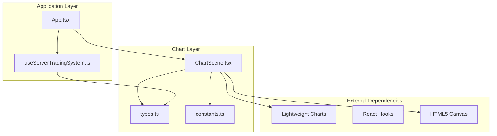
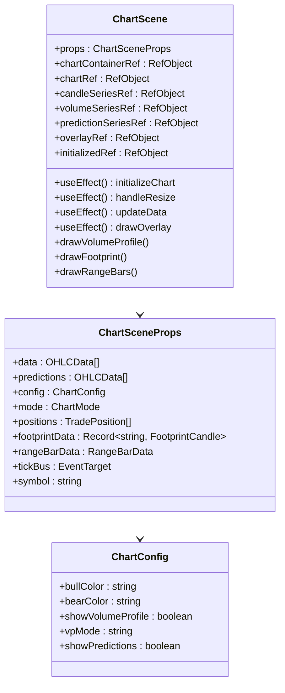
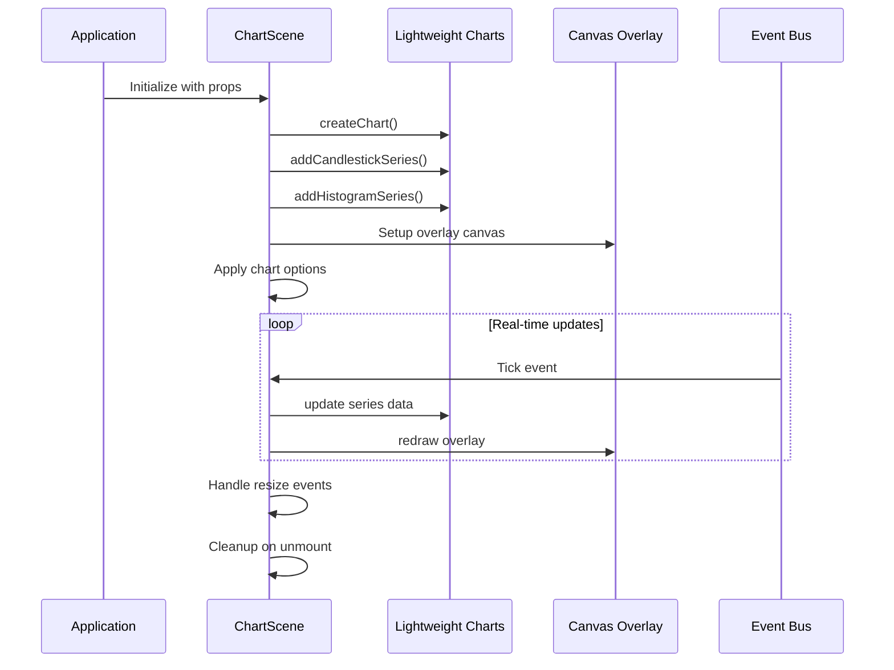
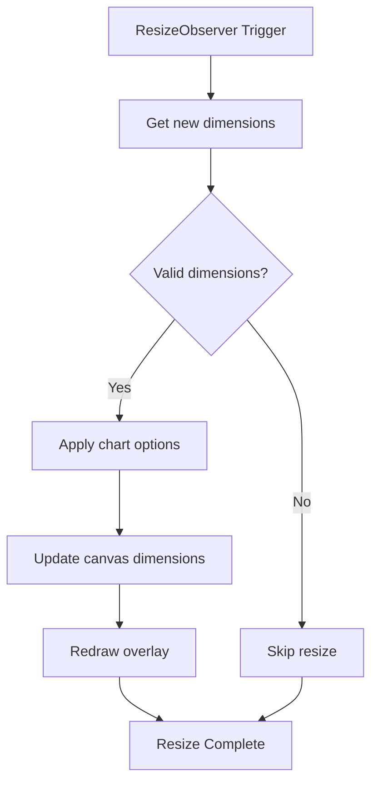
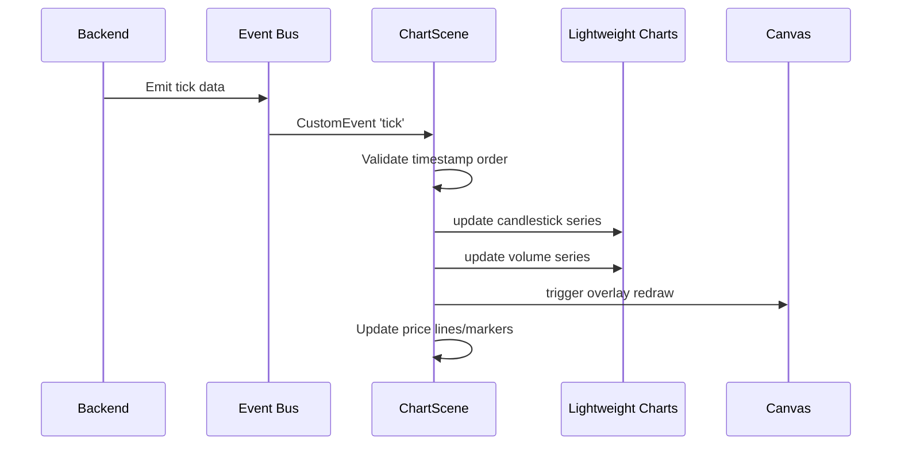
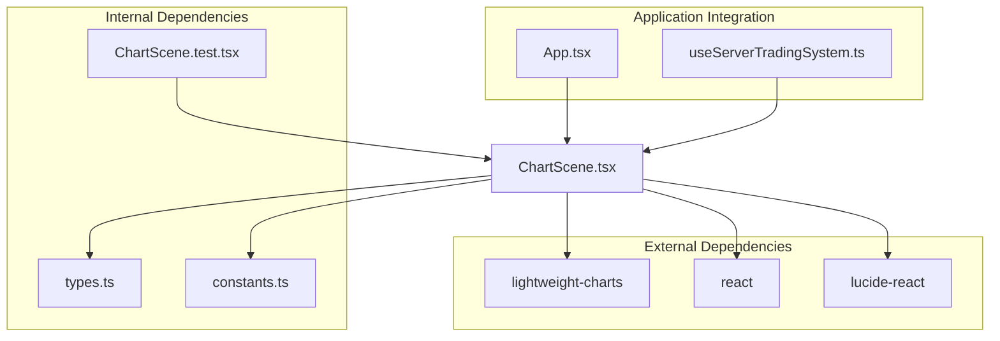

# Chart Initialization and Configuration

<cite>
**Referenced Files in This Document**
- [ChartScene.tsx](file://frontend/components/ChartScene.tsx)
- [types.ts](file://frontend/types.ts)
- [constants.ts](file://frontend/constants.ts)
- [App.tsx](file://frontend/App.tsx)
- [useServerTradingSystem.ts](file://frontend/hooks/useServerTradingSystem.ts)
- [ChartScene.test.tsx](file://frontend/tests/components/ChartScene.test.tsx)
</cite>

## Table of Contents
1. [Introduction](#introduction)
2. [Project Structure](#project-structure)
3. [Core Components](#core-components)
4. [Architecture Overview](#architecture-overview)
5. [Detailed Component Analysis](#detailed-component-analysis)
6. [Dependency Analysis](#dependency-analysis)
7. [Performance Considerations](#performance-considerations)
8. [Troubleshooting Guide](#troubleshooting-guide)
9. [Conclusion](#conclusion)

## Introduction

The ChartScene component is the core visualization layer for the trading application, built using Lightweight Charts library. It provides three distinct chart modes for different analytical approaches: STANDARD candlesticks, FOOTPRINT orderflow visualization, and RANGE bar analysis. This documentation covers the complete initialization lifecycle, configuration options, responsive design implementation, and advanced features like canvas overlays and real-time data streaming.

## Project Structure

The chart system is organized around a modular architecture with clear separation of concerns:



**Diagram sources**
- [App.tsx:16-395](file://frontend/App.tsx#L16-L395)
- [ChartScene.tsx:1-1514](file://frontend/components/ChartScene.tsx#L1-L1514)
- [useServerTradingSystem.ts:59-654](file://frontend/hooks/useServerTradingSystem.ts#L59-L654)

**Section sources**
- [App.tsx:16-395](file://frontend/App.tsx#L16-L395)
- [ChartScene.tsx:1-1514](file://frontend/components/ChartScene.tsx#L1-L1514)
- [useServerTradingSystem.ts:59-654](file://frontend/hooks/useServerTradingSystem.ts#L59-L654)

## Core Components

### ChartScene Component Architecture

The ChartScene component serves as a comprehensive charting solution with the following key architectural elements:

#### Primary Responsibilities
- **Lightweight Charts Integration**: Manages chart lifecycle, series creation, and data binding
- **Multi-Mode Rendering**: Supports three distinct chart modes with dynamic switching
- **Canvas Overlay System**: Implements custom drawing for advanced visualizations
- **Responsive Design**: Handles dynamic resizing with ResizeObserver
- **Real-Time Updates**: Processes live tick data through event bus architecture

#### Component Structure


**Diagram sources**
- [ChartScene.tsx:18-34](file://frontend/components/ChartScene.tsx#L18-L34)
- [types.ts:204-219](file://frontend/types.ts#L204-L219)
- [types.ts:144](file://frontend/types.ts#L144)

**Section sources**
- [ChartScene.tsx:51-77](file://frontend/components/ChartScene.tsx#L51-L77)
- [types.ts:144](file://frontend/types.ts#L144)
- [types.ts:204-219](file://frontend/types.ts#L204-L219)

## Architecture Overview

The chart system follows a sophisticated architecture combining native Lightweight Charts with custom canvas overlays:



**Diagram sources**
- [ChartScene.tsx:117-275](file://frontend/components/ChartScene.tsx#L117-L275)
- [ChartScene.tsx:278-319](file://frontend/components/ChartScene.tsx#L278-L319)
- [ChartScene.tsx:376-425](file://frontend/components/ChartScene.tsx#L376-L425)

## Detailed Component Analysis

### Chart Initialization Lifecycle

The initialization process follows a carefully orchestrated sequence:

#### Phase 1: Chart Creation
The chart is created with comprehensive styling and configuration:

```mermaid
flowchart TD
Start([Component Mount]) --> CheckContainer{Has Container?}
CheckContainer --> |No| Wait[Wait for ref]
CheckContainer --> |Yes| CreateChart[createChart()]
CreateChart --> ConfigureLayout[Configure layout options]
ConfigureLayout --> ConfigureGrid[Configure grid colors]
ConfigureGrid --> ConfigureCrosshair[Setup crosshair]
ConfigureCrosshair --> ConfigureTimeScale[Configure time scale]
ConfigureTimeScale --> CreateSeries[Create series]
CreateSeries --> CandleSeries[addCandlestickSeries]
CreateSeries --> VolumeSeries[addHistogramSeries]
CreateSeries --> PredictionSeries[addCandlestickSeries]
CandleSeries --> ApplyModeOptions[Apply mode-specific options]
VolumeSeries --> ApplyModeOptions
PredictionSeries --> ApplyModeOptions
ApplyModeOptions --> SetupResizeObserver[Setup ResizeObserver]
SetupResizeObserver --> LoadInitialData[Load initial data]
LoadInitialData --> End([Initialization Complete])
```

**Diagram sources**
- [ChartScene.tsx:117-176](file://frontend/components/ChartScene.tsx#L117-L176)
- [ChartScene.tsx:196-220](file://frontend/components/ChartScene.tsx#L196-L220)
- [ChartScene.tsx:221-234](file://frontend/components/ChartScene.tsx#L221-L234)

#### Phase 2: Data Loading and Processing

The component handles different data loading scenarios based on chart mode:

**Section sources**
- [ChartScene.tsx:237-268](file://frontend/components/ChartScene.tsx#L237-L268)
- [ChartScene.tsx:1096-1134](file://frontend/components/ChartScene.tsx#L1096-L1134)
- [ChartScene.tsx:1137-1183](file://frontend/components/ChartScene.tsx#L1137-L1183)

### Three Chart Modes Implementation

#### STANDARD Mode
The default candlestick chart with full functionality:

**Key Features:**
- Visible candlesticks with configurable bullish/bearish colors
- Volume histogram with transparency effects
- Prediction series overlay
- Interactive markers for positions and signals
- Price lines for volume profile levels

**Configuration Options:**
- Bar spacing: 6 pixels
- Min bar spacing: 2 pixels
- Price scale margins: 15% top, 15% bottom
- Grid visibility: Enabled with dark theme colors

#### FOOTPRINT Mode
Advanced orderflow visualization:

**Key Features:**
- Transparent candlesticks (visual footprint only)
- Custom footprint rendering with delta visualization
- Volume profile overlay on right side
- Aggressive print bubbles
- CVD (Cumulative Delta) line in summary area

**Configuration Options:**
- Bar spacing: 160 pixels (wide bars for readability)
- Min bar spacing: 100 pixels
- Price scale margins: 35% bottom for summary area
- Prediction series: Hidden

#### RANGE Mode
Range bar analysis with specialized indicators:

**Key Features:**
- Range-based bars instead of time-based candles
- Volume profile with session and leg analysis
- VWAP (Volume Weighted Average Price) line
- Triple-A pattern detection
- Cumulative delta visualization

**Configuration Options:**
- Bar spacing: 40 pixels
- Min bar spacing: 20 pixels
- Specialized overlay rendering for range data

**Section sources**
- [ChartScene.tsx:177-220](file://frontend/components/ChartScene.tsx#L177-L220)
- [ChartScene.tsx:342-373](file://frontend/components/ChartScene.tsx#L342-L373)

### Responsive Design Implementation

The component implements robust responsive behavior using ResizeObserver:



**Diagram sources**
- [ChartScene.tsx:221-234](file://frontend/components/ChartScene.tsx#L221-L234)

**Key Responsive Features:**
- Automatic chart resizing on container changes
- Canvas overlay synchronization
- Maintains aspect ratio and proportions
- Handles edge cases (zero dimensions)

**Section sources**
- [ChartScene.tsx:221-234](file://frontend/components/ChartScene.tsx#L221-L234)

### Canvas Overlay System

The component implements a sophisticated canvas overlay system for advanced visualizations:

#### Volume Profile Rendering
The overlay draws volume profiles with glass-like transparency effects:

**Features:**
- Directional coloring (green for buys, red for sells)
- Alpha blending for depth perception
- Value area highlighting
- HVN/LVN zone identification
- POC (Point of Control) marker with glow effect

#### Footprint Visualization
Advanced orderflow representation:

**Rendering Pipeline:**
1. **Grid Layout**: Calculates cell dimensions based on price step
2. **Intensity Calculation**: Alpha values based on volume ratios
3. **Imbalance Detection**: Visual indicators for buy/sell dominance
4. **Stacked Imbalance**: Special highlighting for consecutive imbalances
5. **Summary Area**: Bottom panel with totals and delta cards

#### Range Bar Overlays
Specialized rendering for range-based analysis:

**Elements:**
- VWAP line with dashed styling
- POC, VAH, VAL level markers
- Triple-A pattern detection indicators
- Range size and cumulative delta displays

**Section sources**
- [ChartScene.tsx:376-425](file://frontend/components/ChartScene.tsx#L376-L425)
- [ChartScene.tsx:626-652](file://frontend/components/ChartScene.tsx#L626-L652)
- [ChartScene.tsx:685-980](file://frontend/components/ChartScene.tsx#L685-L980)
- [ChartScene.tsx:982-1086](file://frontend/components/ChartScene.tsx#L982-L1086)

### Real-Time Data Streaming

The component integrates with a sophisticated event bus system for real-time updates:



**Diagram sources**
- [useServerTradingSystem.ts:297-324](file://frontend/hooks/useServerTradingSystem.ts#L297-L324)
- [ChartScene.tsx:281-313](file://frontend/components/ChartScene.tsx#L281-L313)

**Key Features:**
- Timestamp validation to prevent crashes
- Stale data filtering
- Non-blocking updates
- Efficient delta compression

**Section sources**
- [useServerTradingSystem.ts:297-324](file://frontend/hooks/useServerTradingSystem.ts#L297-L324)
- [ChartScene.tsx:281-313](file://frontend/components/ChartScene.tsx#L281-L313)

### Configuration and Styling Options

#### Default Configuration
The system provides comprehensive styling customization:

**Color Scheme Options:**
- Bullish color: Emerald 500 (#10b981)
- Bearish color: Red 500 (#ef4444)
- Background: Transparent for glass effect
- Grid colors: Dark blue-gray (#1e293b)

**Visual Effects:**
- Glass opacity: 1.0 (fully opaque)
- Roughness: 0.1 (smooth surface)
- Transmission: 0.95 (highly transparent)

**Functional Options:**
- Show grid: Enabled
- Auto rotate: Disabled
- Show predictions: Enabled
- Show volume profile: Enabled
- Volume profile mode: Combined

**Section sources**
- [constants.ts:4-19](file://frontend/constants.ts#L4-L19)
- [types.ts:204-219](file://frontend/types.ts#L204-L219)

### Error Handling and Cleanup

The component implements comprehensive error handling and resource management:

#### Cleanup Procedures
- **ResizeObserver**: Proper disconnection on unmount
- **Event Listeners**: Removal of tick event handlers
- **Chart Destruction**: Safe removal of chart instances
- **Memory Management**: Cleanup of references and intervals

#### Error Handling Patterns
- **Stale Data Protection**: Timestamp validation prevents crashes
- **Graceful Degradation**: Overlay rendering continues despite individual errors
- **Safe Updates**: Try-catch blocks around chart operations
- **Reference Validation**: Null checks before accessing DOM elements

**Section sources**
- [ChartScene.tsx:270-275](file://frontend/components/ChartScene.tsx#L270-L275)
- [ChartScene.tsx:310-312](file://frontend/components/ChartScene.tsx#L310-L312)
- [ChartScene.tsx:409-411](file://frontend/components/ChartScene.tsx#L409-L411)

## Dependency Analysis

The ChartScene component has well-defined dependencies and relationships:



**Diagram sources**
- [ChartScene.tsx:2-16](file://frontend/components/ChartScene.tsx#L2-L16)
- [App.tsx:3-12](file://frontend/App.tsx#L3-L12)
- [useServerTradingSystem.ts:2-11](file://frontend/hooks/useServerTradingSystem.ts#L2-L11)

**Section sources**
- [ChartScene.tsx:2-16](file://frontend/components/ChartScene.tsx#L2-L16)
- [App.tsx:3-12](file://frontend/App.tsx#L3-L12)
- [useServerTradingSystem.ts:2-11](file://frontend/hooks/useServerTradingSystem.ts#L2-L11)

## Performance Considerations

### Optimization Strategies

#### Reference Stability
- **Memoization**: Uses `useMemo` for expensive calculations
- **Stable References**: Prevents unnecessary re-renders
- **Custom Equality**: Implements `React.memo` with custom comparison

#### Rendering Efficiency
- **Canvas Optimization**: Single canvas for overlay rendering
- **Selective Updates**: Only redraws when data changes
- **Batch Updates**: Combines multiple state changes

#### Memory Management
- **Proper Cleanup**: All event listeners and observers are cleaned up
- **Reference Tracking**: Uses refs to track component state
- **Resource Pooling**: Reuses chart instances where possible

### Performance Metrics

**Typical Performance Characteristics:**
- **Initialization**: Sub-second chart creation
- **Update Rate**: 60fps with optimized rendering
- **Memory Usage**: Minimal overhead for overlay canvases
- **CPU Usage**: Optimized for smooth scrolling and zooming

## Troubleshooting Guide

### Common Issues and Solutions

#### Chart Not Rendering
**Symptoms**: Blank chart container
**Causes**: 
- Missing container reference
- Zero dimensions
- Chart creation failures

**Solutions**:
- Ensure container has non-zero dimensions
- Verify chart container ref is properly attached
- Check browser compatibility for WebGL

#### Data Display Issues
**Symptoms**: Incorrect time display or missing data
**Causes**:
- Timestamp format inconsistencies
- Data ordering problems
- Timezone conversion errors

**Solutions**:
- Validate timestamp format (ISO 8601)
- Ensure data is sorted chronologically
- Use consistent timezone handling

#### Performance Problems
**Symptoms**: Slow rendering or lag
**Causes**:
- Excessive overlay redraws
- Large datasets without optimization
- Memory leaks

**Solutions**:
- Implement data stabilization techniques
- Use memoization for expensive computations
- Monitor memory usage and clean up resources

#### Real-time Data Issues
**Symptoms**: Missing or delayed updates
**Causes**:
- Event bus connectivity problems
- Stale data filtering
- Timestamp validation failures

**Solutions**:
- Verify WebSocket connection status
- Check event bus subscription
- Validate timestamp ordering

**Section sources**
- [ChartScene.tsx:257-259](file://frontend/components/ChartScene.tsx#L257-L259)
- [ChartScene.tsx:310-312](file://frontend/components/ChartScene.tsx#L310-L312)
- [useServerTradingSystem.ts:488-497](file://frontend/hooks/useServerTradingSystem.ts#L488-L497)

## Conclusion

The ChartScene component represents a sophisticated implementation of financial charting with advanced features and robust architecture. Its multi-mode approach, comprehensive styling options, and efficient real-time data handling make it suitable for complex trading applications. The component demonstrates excellent separation of concerns, with clear boundaries between chart rendering, data management, and user interaction.

Key strengths include:
- **Flexible Architecture**: Easy-to-use interface with powerful customization
- **Performance Optimization**: Efficient rendering and memory management
- **Robust Error Handling**: Comprehensive protection against common issues
- **Extensible Design**: Modular structure supporting future enhancements

The implementation serves as a strong foundation for financial visualization applications, providing both immediate functionality and long-term maintainability.