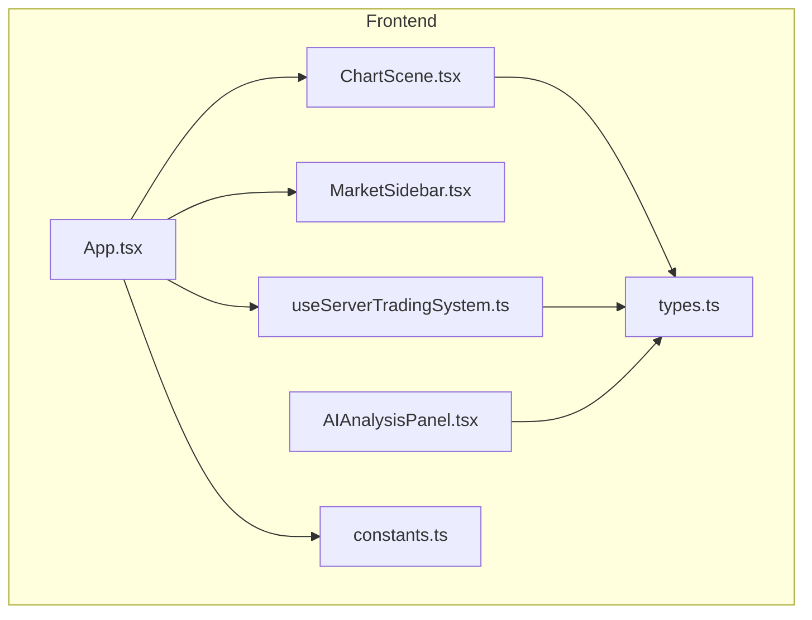
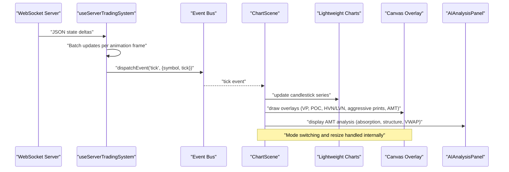
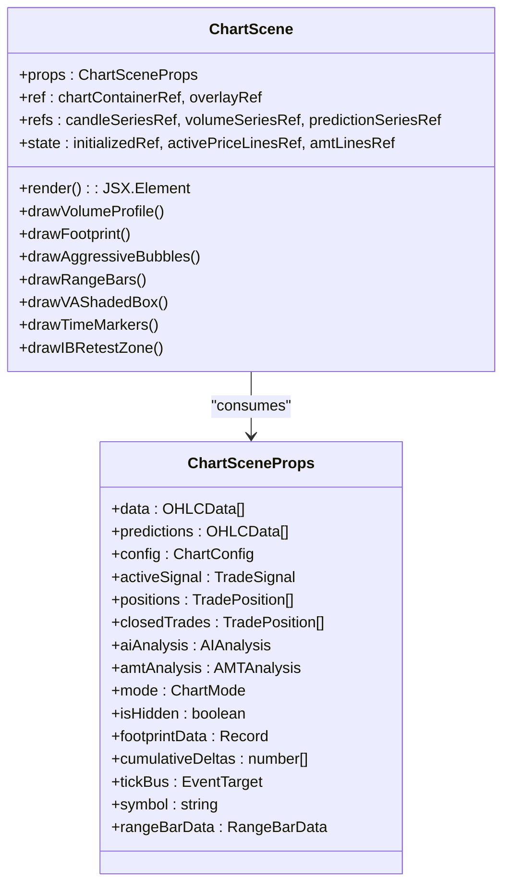
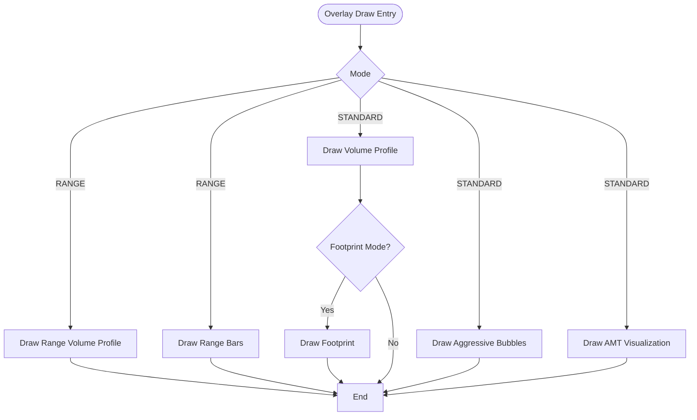
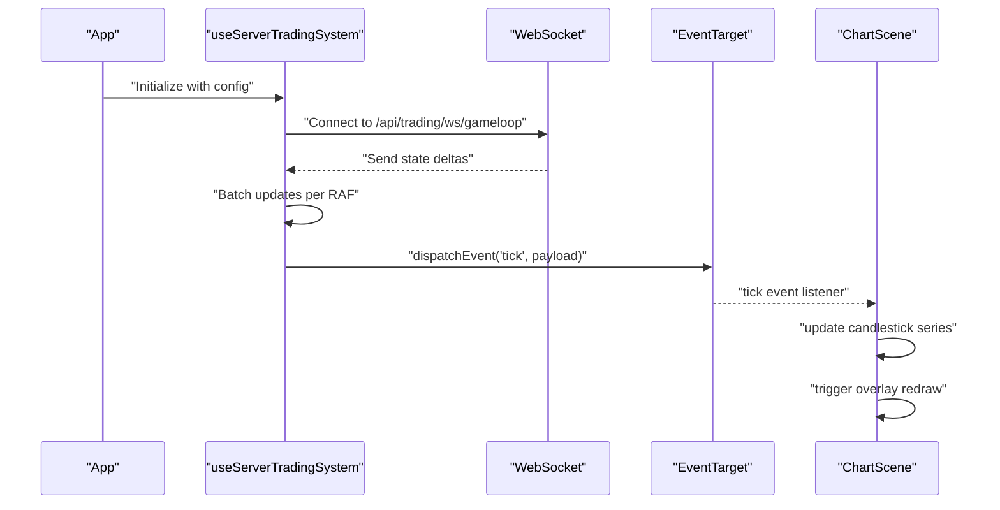
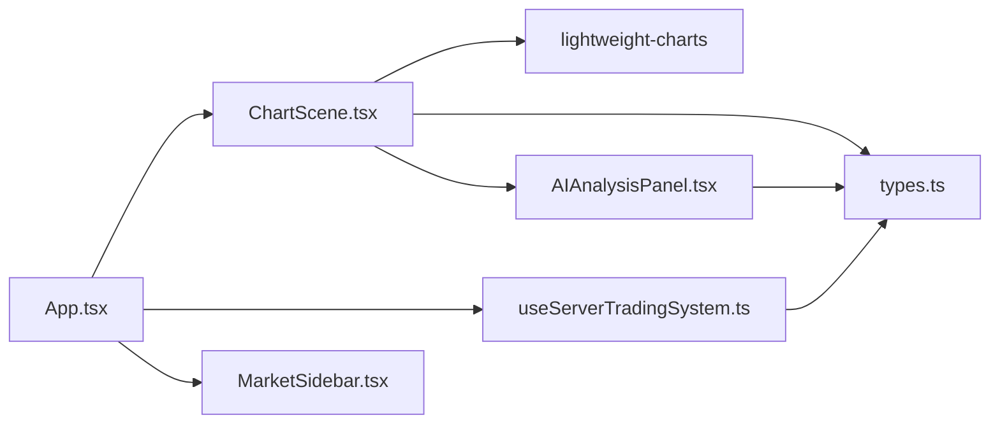

# Chart Visualization Components

<cite>
**Referenced Files in This Document**
- [ChartScene.tsx](file://frontend/components/ChartScene.tsx)
- [types.ts](file://frontend/types.ts)
- [useServerTradingSystem.ts](file://frontend/hooks/useServerTradingSystem.ts)
- [AIAnalysisPanel.tsx](file://frontend/components/AIAnalysisPanel.tsx)
- [App.tsx](file://frontend/App.tsx)
- [constants.ts](file://frontend/constants.ts)
- [ChartScene.test.tsx](file://frontend/tests/components/ChartScene.test.tsx)
- [MarketSidebar.tsx](file://frontend/components/MarketSidebar.tsx)
</cite>

## Update Summary
**Changes Made**
- Enhanced ChartScene with comprehensive AMT visualization capabilities including absorption zones, structure panels, and advanced market structure visualization
- Added sophisticated canvas overlay system with gradient fills, boundary indicators, and intelligent caching mechanisms
- Integrated absorption detection with range and volume ratio analysis
- Implemented structure classification panels with confidence scoring
- Enhanced VWAP event markers with directional coloring and sigma deviation visualization
- Added intelligent caching mechanisms for AMT analysis data to optimize overlay redraws

## Table of Contents
1. [Introduction](#introduction)
2. [Project Structure](#project-structure)
3. [Core Components](#core-components)
4. [Architecture Overview](#architecture-overview)
5. [Detailed Component Analysis](#detailed-component-analysis)
6. [Advanced AMT Visualization Features](#advanced-amt-visualization-features)
7. [Dependency Analysis](#dependency-analysis)
8. [Performance Considerations](#performance-considerations)
9. [Troubleshooting Guide](#troubleshooting-guide)
10. [Conclusion](#conclusion)

## Introduction
This document provides comprehensive technical documentation for the ChartScene component and related chart visualization functionality. It covers the enhanced candlestick chart implementation with support for STANDARD, FOOTPRINT, and RANGE modes, integration with the Lightweight Charts library, canvas overlay rendering for volume profiles and aggressive prints, and real-time tick streaming via WebSocket. The component now features sophisticated AMT (Auction Market Theory) visualization capabilities including absorption zones, structure panels, VWAP event markers, and advanced market structure visualization with intelligent caching mechanisms.

## Project Structure
The chart visualization is implemented in the frontend directory under components and hooks. The primary chart component is ChartScene, which integrates with a WebSocket-based trading system hook and is embedded within the main App shell alongside a market scanner sidebar. The enhanced AMT visualization system includes absorption detection, structure classification, and VWAP analysis.

**Diagram sources**
- [App.tsx:16-395](file://frontend/App.tsx#L16-L395)
- [ChartScene.tsx:1-1964](file://frontend/components/ChartScene.tsx#L1-L1964)
- [useServerTradingSystem.ts:1-735](file://frontend/hooks/useServerTradingSystem.ts#L1-L735)
- [types.ts:1-406](file://frontend/types.ts#L1-L406)
- [constants.ts:1-28](file://frontend/constants.ts#L1-L28)
- [MarketSidebar.tsx:1-388](file://frontend/components/MarketSidebar.tsx#L1-L388)
- [AIAnalysisPanel.tsx:1-1689](file://frontend/components/AIAnalysisPanel.tsx#L1-L1689)

**Section sources**
- [App.tsx:16-395](file://frontend/App.tsx#L16-L395)
- [ChartScene.tsx:1-1964](file://frontend/components/ChartScene.tsx#L1-L1964)
- [useServerTradingSystem.ts:1-735](file://frontend/hooks/useServerTradingSystem.ts#L1-L735)
- [types.ts:1-406](file://frontend/types.ts#L1-L406)
- [constants.ts:1-28](file://frontend/constants.ts#L1-L28)
- [MarketSidebar.tsx:1-388](file://frontend/components/MarketSidebar.tsx#L1-L388)
- [AIAnalysisPanel.tsx:1-1689](file://frontend/components/AIAnalysisPanel.tsx#L1-L1689)

## Core Components
- **ChartScene**: The main chart component that renders candlesticks, overlays, and handles real-time updates. It supports STANDARD, FOOTPRINT, and RANGE modes and integrates with Lightweight Charts and a canvas overlay system with advanced AMT visualization.
- **useServerTradingSystem**: A WebSocket-based hook that streams market data and state updates to the UI without triggering React renders for every tick.
- **App**: Orchestrates the chart instances, controls, and UI layout, including mode switching and dual volume profile tabs.
- **types**: Defines data structures for OHLC data, chart configuration, AMT analysis, footprint data, and range bar data.
- **constants**: Provides default chart configuration values.
- **AIAnalysisPanel**: Enhanced panel that displays absorption zones, structure classifications, and VWAP analysis with confidence scoring.

Key responsibilities:
- ChartScene manages chart lifecycle, data binding, mode switching, canvas overlays, and real-time tick updates with intelligent caching for AMT analysis.
- useServerTradingSystem manages WebSocket connectivity, batching updates, and dispatching tick events via an event bus.
- App composes multiple ChartScene instances for concurrent STANDARD, FOOTPRINT, and RANGE views and exposes configuration controls.
- AIAnalysisPanel provides comprehensive AMT analysis visualization with absorption detection, structure classification, and VWAP confidence metrics.

**Section sources**
- [ChartScene.tsx:51-1964](file://frontend/components/ChartScene.tsx#L51-L1964)
- [useServerTradingSystem.ts:59-735](file://frontend/hooks/useServerTradingSystem.ts#L59-L735)
- [App.tsx:150-206](file://frontend/App.tsx#L150-L206)
- [types.ts:144-406](file://frontend/types.ts#L144-L406)
- [constants.ts:4-19](file://frontend/constants.ts#L4-L19)
- [AIAnalysisPanel.tsx:970-1459](file://frontend/components/AIAnalysisPanel.tsx#L970-L1459)

## Architecture Overview
The chart visualization architecture combines Lightweight Charts for native candlestick rendering with a custom canvas overlay system for advanced orderflow and profile visualizations. Real-time updates are streamed via WebSocket and delivered through an event bus to avoid unnecessary React re-renders. The enhanced AMT visualization system provides sophisticated market structure analysis with absorption detection, structure classification, and VWAP confidence scoring.

**Diagram sources**
- [useServerTradingSystem.ts:204-498](file://frontend/hooks/useServerTradingSystem.ts#L204-L498)
- [ChartScene.tsx:278-319](file://frontend/components/ChartScene.tsx#L278-L319)
- [ChartScene.tsx:376-425](file://frontend/components/ChartScene.tsx#L376-L425)
- [AIAnalysisPanel.tsx:970-1459](file://frontend/components/AIAnalysisPanel.tsx#L970-L1459)

## Detailed Component Analysis

### ChartScene Component
ChartScene is a React component that:
- Initializes Lightweight Charts with candlestick and histogram series.
- Manages three chart modes: STANDARD, FOOTPRINT, and RANGE.
- Renders a canvas overlay for volume profiles, POC levels, HVN/LVN zones, and aggressive prints.
- Handles real-time tick streaming via an event bus.
- Implements responsive design with ResizeObserver and maintains aspect ratios across modes.
- Uses memoization to stabilize references and reduce overlay redraws.
- **Enhanced**: Integrates sophisticated AMT visualization including absorption zones, structure panels, and VWAP confidence analysis.

Key implementation patterns:
- Chart initialization and options: creates chart, series, applies grid and layout options, and adjusts price scale margins for FOOTPRINT and RANGE modes.
- Mode switching: toggles series visibility and colors without remounting.
- Data binding: sets historical data for STANDARD mode and range bars for RANGE mode; updates series incrementally for real-time ticks.
- Canvas overlay: draws volume profiles, footprint cells, CVD line, and aggressive bubbles with dynamic sizing and color intensity.
- **Enhanced**: AMT overlay rendering with absorption detection, structure classification, and VWAP event markers.
- Responsive behavior: observes container size changes and updates chart and overlay dimensions.
- Lifecycle: cleans up observers and removes the chart on unmount.

Performance optimizations:
- Memoization of AMT analysis to avoid overlay redraws when only reference identity changes.
- Stabilizing data references to prevent overlay redraws on intra-candle tick updates.
- RAF batching for overlay redraws triggered by pan/zoom events.
- Efficient coordinate conversions using Lightweight Charts APIs.
- **Enhanced**: Intelligent caching mechanisms for AMT analysis data to optimize expensive overlay redraws.

Error handling:
- Try/catch around tick updates to prevent crashes from stale or out-of-order timestamps.
- Graceful handling of missing overlay contexts and hidden states.

Examples:
- Initialization: [ChartScene.tsx:117-275](file://frontend/components/ChartScene.tsx#L117-L275)
- Real-time tick handling: [ChartScene.tsx:278-319](file://frontend/components/ChartScene.tsx#L278-L319)
- Canvas overlay drawing: [ChartScene.tsx:376-425](file://frontend/components/ChartScene.tsx#L376-L425)
- Volume profile drawing: [ChartScene.tsx:626-652](file://frontend/components/ChartScene.tsx#L626-L652)
- Footprint drawing: [ChartScene.tsx:686-980](file://frontend/components/ChartScene.tsx#L686-L980)
- Aggressive prints drawing: [ChartScene.tsx:429-484](file://frontend/components/ChartScene.tsx#L429-L484)
- Range bars overlay: [ChartScene.tsx:982-1086](file://frontend/components/ChartScene.tsx#L982-L1086)
- **Enhanced**: AMT overlay rendering: [ChartScene.tsx:394-420](file://frontend/components/ChartScene.tsx#L394-L420)
- Mode switching: [ChartScene.tsx:342-373](file://frontend/components/ChartScene.tsx#L342-L373)
- Responsive resize: [ChartScene.tsx:221-234](file://frontend/components/ChartScene.tsx#L221-L234)

**Diagram sources**
- [ChartScene.tsx:18-34](file://frontend/components/ChartScene.tsx#L18-L34)
- [ChartScene.tsx:51-67](file://frontend/components/ChartScene.tsx#L51-L67)

**Section sources**
- [ChartScene.tsx:51-1964](file://frontend/components/ChartScene.tsx#L51-L1964)
- [types.ts:144-301](file://frontend/types.ts#L144-L301)

### Canvas Overlay System
The canvas overlay system enables advanced visualizations:
- **Volume Profiles**: Draws session and leg profiles on the right side of the chart with directional coloring, alpha blending, and value area shading.
- **Footprint**: Renders footprint cells with bid/ask bars, imbalance indicators, stacked imbalance borders, and POC highlights within candle bodies.
- **Aggressive Prints**: Renders bubbles sized by volume with radial gradients and labels.
- **CVD Line**: Plots cumulative delta within the footprint summary area.
- **Range Bars**: Draws VWAP, POC, VAH/VAL lines and Triple-A markers on range bar charts.
- **Enhanced**: **AMT Visualization**: Draws absorption zones, structure panels, and VWAP confidence markers with intelligent caching.

Drawing helpers:
- drawProfileBars: Core routine for volume profile bars with zone-aware coloring and glassy effects.
- drawVolumeProfile: Switches between session, leg, and combined modes.
- drawFootprint: Renders footprint grid, spine, imbalance bars, and summary statistics.
- drawAggressiveBubbles: Renders volume bubbles with gradient fills and text labels.
- drawRangeBars: Renders range bar overlays including VWAP, POC, VAH/VAL, and Triple-A indicators.
- **Enhanced**: drawVAShadedBox: Draws value area shaded regions with boundary indicators.
- **Enhanced**: drawTimeMarkers: Renders session phase markers with background shading.
- **Enhanced**: drawIBRetestZone: Draws initial balance retest zone with active/inactive state visualization.

**Diagram sources**
- [ChartScene.tsx:384-412](file://frontend/components/ChartScene.tsx#L384-L412)
- [ChartScene.tsx:626-652](file://frontend/components/ChartScene.tsx#L626-L652)
- [ChartScene.tsx:654-683](file://frontend/components/ChartScene.tsx#L654-L683)
- [ChartScene.tsx:686-980](file://frontend/components/ChartScene.tsx#L686-L980)
- [ChartScene.tsx:429-484](file://frontend/components/ChartScene.tsx#L429-L484)
- [ChartScene.tsx:982-1086](file://frontend/components/ChartScene.tsx#L982-L1086)
- [ChartScene.tsx:506-541](file://frontend/components/ChartScene.tsx#L506-L541)
- [ChartScene.tsx:544-640](file://frontend/components/ChartScene.tsx#L544-L640)
- [ChartScene.tsx:643-723](file://frontend/components/ChartScene.tsx#L643-L723)

**Section sources**
- [ChartScene.tsx:376-1325](file://frontend/components/ChartScene.tsx#L376-L1325)

### Real-Time Tick Streaming via WebSocket
The WebSocket integration uses a dedicated hook that:
- Establishes a WebSocket connection to the backend trading loop endpoint.
- Batches state updates per animation frame to minimize React renders.
- Dispatches tick events via an EventTarget to avoid updating React state for every tick.
- Maintains heartbeat and automatic reconnection logic.
- Supports symbol switching with generation-based de-duplication.

**Diagram sources**
- [useServerTradingSystem.ts:509-571](file://frontend/hooks/useServerTradingSystem.ts#L509-L571)
- [useServerTradingSystem.ts:204-498](file://frontend/hooks/useServerTradingSystem.ts#L204-L498)
- [ChartScene.tsx:278-319](file://frontend/components/ChartScene.tsx#L278-L319)

**Section sources**
- [useServerTradingSystem.ts:59-735](file://frontend/hooks/useServerTradingSystem.ts#L59-L735)
- [ChartScene.tsx:278-319](file://frontend/components/ChartScene.tsx#L278-L319)

### Chart Configuration and Mode Switching
Chart configuration is centralized in ChartConfig and includes:
- Bull/Bear colors for candles and overlays.
- Glass opacity, roughness, and transmission for canvas effects.
- Grid visibility, auto rotation, and prediction visibility.
- Volume profile toggle and mode selection (session, leg, combined, off).
- Trend classification.

Mode switching:
- STANDARD: Standard candlesticks with prediction series and markers.
- FOOTPRINT: Transparent candle bodies with footprint overlay and summary area.
- RANGE: Range bars with volume profile and Triple-A indicators.

Dual volume profile tabs:
- Session, Leg, Combined, Off modes selectable from the UI.

**Section sources**
- [types.ts:204-219](file://frontend/types.ts#L204-L219)
- [constants.ts:4-19](file://frontend/constants.ts#L4-L19)
- [App.tsx:222-278](file://frontend/App.tsx#L222-L278)
- [ChartScene.tsx:177-220](file://frontend/components/ChartScene.tsx#L177-L220)
- [ChartScene.tsx:342-373](file://frontend/components/ChartScene.tsx#L342-L373)

### Responsive Design and Lifecycle Management
Responsive behavior:
- ResizeObserver monitors chart container size and updates chart and overlay dimensions.
- Price scale margins adjust for FOOTPRINT and RANGE modes to accommodate overlays.

Lifecycle management:
- Chart removal and observer disconnection on unmount.
- Visibility change handling to avoid unnecessary chart updates when hidden.
- Cleanup of drag listeners and timers in App.

**Section sources**
- [ChartScene.tsx:221-234](file://frontend/components/ChartScene.tsx#L221-L234)
- [ChartScene.tsx:270-275](file://frontend/components/ChartScene.tsx#L270-L275)
- [App.tsx:58-60](file://frontend/App.tsx#L58-L60)

## Advanced AMT Visualization Features

### Absorption Detection System
The enhanced AMT visualization includes sophisticated absorption detection with range and volume ratio analysis:

- **Absorption Zones**: Visual indicators showing periods where price stalls despite continued buying/selling pressure
- **Range Ratio Analysis**: Compares absorption period range to normal market movement to quantify absorption strength
- **Volume Ratio Analysis**: Measures absorption volume relative to normal trading volume
- **Directional Coloring**: Green for buy absorption, red for sell absorption
- **Contextual Messaging**: Descriptive text explaining absorption characteristics

Implementation details:
- Absorption detection integrated into AIAnalysisPanel with real-time updates
- Visual indicators rendered on chart overlays during absorption periods
- Confidence scoring for absorption strength (range and volume ratios)

**Section sources**
- [AIAnalysisPanel.tsx:970-1050](file://frontend/components/AIAnalysisPanel.tsx#L970-L1050)
- [ChartScene.tsx:394-420](file://frontend/components/ChartScene.tsx#L394-L420)

### Market Structure Classification Panels
Advanced market structure visualization with confidence scoring:

- **Structure Classification**: TREND_UP, TREND_DOWN, RANGE, BREAKOUT, REVERSAL categories
- **Confidence Scoring**: Percentage confidence for each structure classification
- **Visual Indicators**: Color-coded badges with icons representing market structure
- **Trading Guidance**: Contextual recommendations based on detected market structure
- **Strength Meter**: Visual confidence bar with color coding (green/yellow/red)

Structure categories:
- TREND_UP: Higher highs & higher lows — bullish trend
- TREND_DOWN: Lower highs & lower lows — bearish trend  
- RANGE: Price rotating between support/resistance
- BREAKOUT: Price breaking out of range — potential trend start
- REVERSAL: Trend reversal in progress

**Section sources**
- [AIAnalysisPanel.tsx:1260-1333](file://frontend/components/AIAnalysisPanel.tsx#L1260-L1333)
- [ChartScene.tsx:1432-1662](file://frontend/components/ChartScene.tsx#L1432-L1662)

### Enhanced VWAP Visualization
Sophisticated VWAP analysis with confidence and deviation metrics:

- **Directional VWAP Coloring**: Green for rising VWAP, red for declining VWAP, cyan for flat
- **Sigma Deviation Visualization**: +/-1σ and +/-2σ bands with fade zone indication
- **Deviation Meter**: Inline sigma meter showing current price deviation from VWAP
- **Extreme Deviation Alerts**: Visual warnings for sigma deviations beyond 1.8σ
- **Prior Day Context**: Comparison to prior day VWAP, POC, and value area levels

VWAP confidence calculation:
- Recent VWAP slope analysis determines directional coloring
- Sigma deviation calculated from current price position relative to VWAP bands
- Extreme deviation zones automatically highlighted for trading decisions

**Section sources**
- [AIAnalysisPanel.tsx:1052-1169](file://frontend/components/AIAnalysisPanel.tsx#L1052-L1169)
- [ChartScene.tsx:1514-1583](file://frontend/components/ChartScene.tsx#L1514-L1583)

### Intelligent Caching Mechanisms
Optimized performance through intelligent data caching:

- **AMT Analysis Memoization**: Prevents overlay redraws when only reference identity changes
- **Stable Data References**: Avoids canvas overlay redraws on intra-candle tick updates
- **Fingerprinting Algorithm**: Compares visually-relevant fields to determine when overlays need updating
- **RAF Batching**: Overlay redraws triggered by pan/zoom are batched to reduce CPU overhead
- **Conditional Rendering**: Overlay drawing is skipped when chart is hidden to conserve resources

Cache optimization strategies:
- Field comparison for profile, legProfile, aggressivePrints, and levels arrays
- Reference identity preservation to avoid unnecessary redraws
- Efficient coordinate conversions using Lightweight Charts APIs

**Section sources**
- [ChartScene.tsx:77-109](file://frontend/components/ChartScene.tsx#L77-L109)
- [ChartScene.tsx:111-113](file://frontend/components/ChartScene.tsx#L111-L113)
- [ChartScene.tsx:428-436](file://frontend/components/ChartScene.tsx#L428-L436)

## Dependency Analysis
ChartScene depends on:
- Lightweight Charts for native candlestick and histogram rendering.
- React hooks for state, refs, effects, and memoization.
- EventTarget for real-time tick delivery without React renders.
- Internal types for data structures and configuration.
- **Enhanced**: AIAnalysisPanel for comprehensive AMT visualization display.

Integration points:
- App composes three ChartScene instances for concurrent modes.
- useServerTradingSystem provides tickBus and instrument state.
- MarketSidebar drives symbol selection and influences activeInstrument.
- **Enhanced**: AIAnalysisPanel displays absorption zones, structure classifications, and VWAP analysis.

**Diagram sources**
- [App.tsx:150-206](file://frontend/App.tsx#L150-L206)
- [ChartScene.tsx:2-16](file://frontend/components/ChartScene.tsx#L2-L16)
- [useServerTradingSystem.ts:1-11](file://frontend/hooks/useServerTradingSystem.ts#L1-L11)
- [types.ts:1-17](file://frontend/types.ts#L1-L17)
- [MarketSidebar.tsx:1-6](file://frontend/components/MarketSidebar.tsx#L1-L6)
- [AIAnalysisPanel.tsx:1-10](file://frontend/components/AIAnalysisPanel.tsx#L1-L10)

**Section sources**
- [ChartScene.tsx:2-16](file://frontend/components/ChartScene.tsx#L2-L16)
- [useServerTradingSystem.ts:1-11](file://frontend/hooks/useServerTradingSystem.ts#L1-L11)
- [App.tsx:150-206](file://frontend/App.tsx#L150-L206)

## Performance Considerations
- **Memoization strategies**:
  - Memoized AMT analysis to avoid overlay redraws when only reference identity changes.
  - Stable data reference to prevent overlay redraws on intra-candle tick updates.
  - React.memo on ChartScene with a custom equality checker to avoid re-renders.
  - **Enhanced**: Intelligent caching mechanisms for expensive AMT calculations.
- **RAF batching**:
  - Overlay redraws triggered by pan/zoom are batched to reduce CPU overhead.
  - **Enhanced**: AMT overlay redraws are optimized through field comparison algorithms.
- **Efficient coordinate conversions**:
  - Using Lightweight Charts APIs for time/price to coordinate conversions.
- **Canvas optimizations**:
  - Conditional drawing checks and early returns when overlay is hidden.
  - Minimal DOM manipulation; overlay is pointer-events-none.
  - **Enhanced**: Gradient fills and boundary indicators optimized for performance.
- **WebSocket batching**:
  - Batched state updates per animation frame to reduce React renders.
- **Memory management**:
  - Proper cleanup of observers, timers, and WebSocket connections on unmount.
  - **Enhanced**: Cache invalidation for AMT analysis data to prevent memory leaks.

## Troubleshooting Guide
Common issues and resolutions:
- **Stale or out-of-order tick updates**:
  - ChartScene wraps tick updates in try/catch and logs ignored updates to prevent crashes.
  - useServerTradingSystem ensures history is sorted and filters stale ticks.
- **Hidden chart visibility**:
  - Overlay drawing is skipped when the chart is hidden to avoid unnecessary work.
- **WebSocket disconnections**:
  - Automatic reconnection with exponential backoff and heartbeat monitoring.
- **Memory leaks**:
  - Proper cleanup of observers, timers, and WebSocket connections on unmount.
  - **Enhanced**: Cache management for AMT analysis data prevents memory accumulation.
- **Canvas overlay errors**:
  - Try/catch around overlay drawing to prevent UI crashes.
- **AMT visualization performance**:
  - **Enhanced**: Field comparison algorithm prevents unnecessary overlay redraws.
  - **Enhanced**: Absorption detection and structure classification are optimized for real-time updates.

**Section sources**
- [ChartScene.tsx:297-312](file://frontend/components/ChartScene.tsx#L297-L312)
- [useServerTradingSystem.ts:258-272](file://frontend/hooks/useServerTradingSystem.ts#L258-L272)
- [ChartScene.tsx:409-411](file://frontend/components/ChartScene.tsx#L409-L411)
- [ChartScene.tsx:270-275](file://frontend/components/ChartScene.tsx#L270-L275)
- [useServerTradingSystem.ts:550-565](file://frontend/hooks/useServerTradingSystem.ts#L550-L565)

## Conclusion
ChartScene delivers a robust, high-performance chart visualization solution that seamlessly integrates Lightweight Charts with a custom canvas overlay system. The enhanced AMT visualization capabilities provide sophisticated market structure analysis including absorption detection, structure classification with confidence scoring, and VWAP analysis with sigma deviation visualization. The component's architecture balances flexibility and efficiency through intelligent caching mechanisms, optimized overlay rendering, and comprehensive performance optimizations. The integration with AIAnalysisPanel provides users with comprehensive market insights through absorption zones, structure panels, and VWAP confidence metrics, enabling advanced orderflow and profile visualizations while maintaining smooth interactivity and reliable lifecycle management.