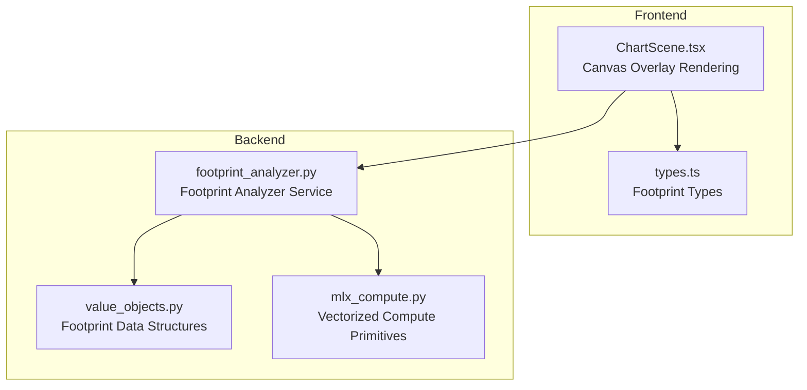
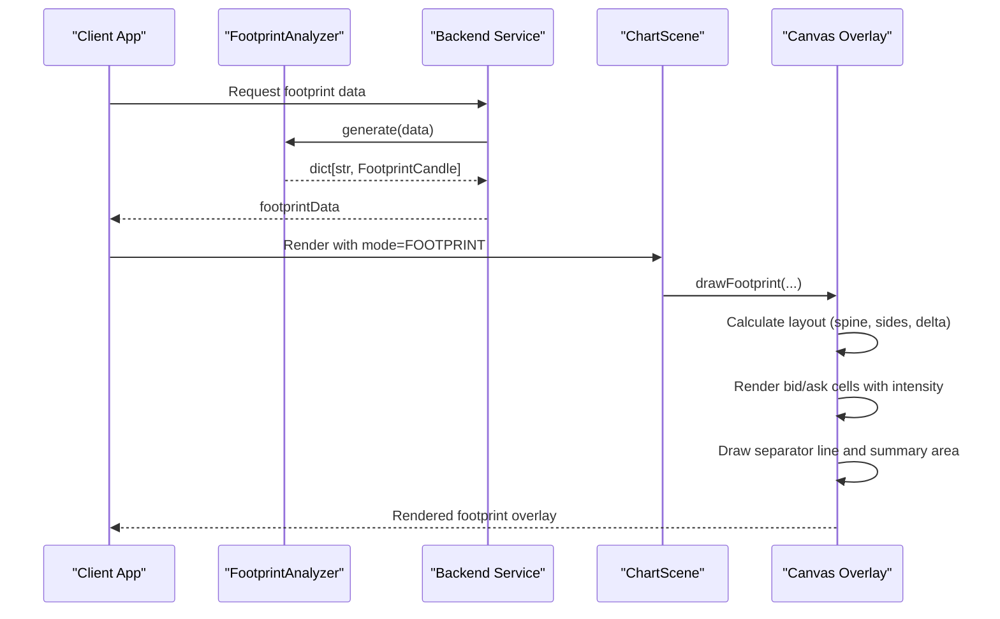
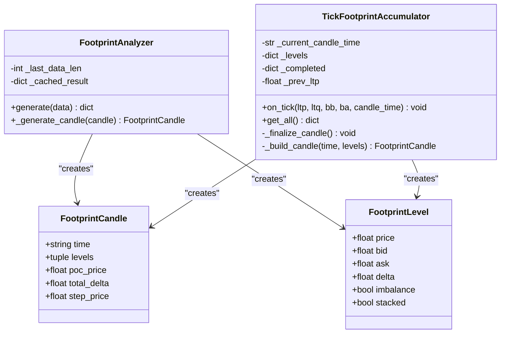
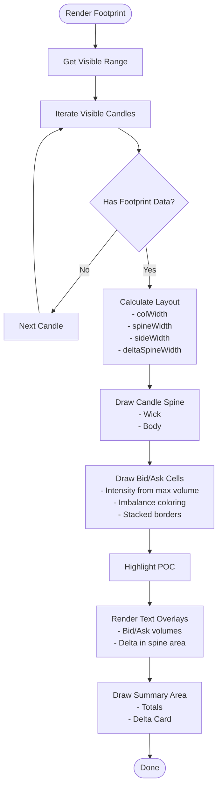
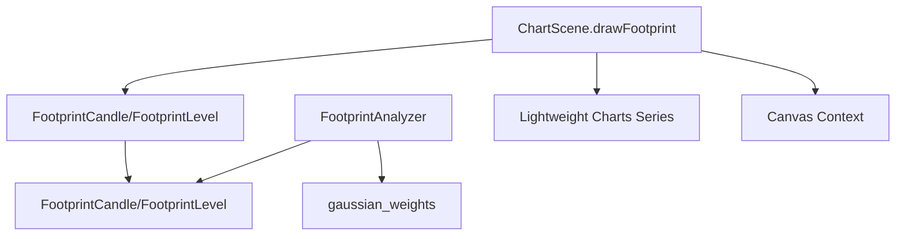

# Footprint Chart Mode Implementation

<cite>
**Referenced Files in This Document**
- [ChartScene.tsx](file://frontend/components/ChartScene.tsx)
- [footprint_analyzer.py](file://backend/app/domain/fabio_ai/services/footprint_analyzer.py)
- [types.ts](file://frontend/types.ts)
- [value_objects.py](file://backend/app/domain/trading/models/value_objects.py)
- [mlx_compute.py](file://backend/app/domain/fabio_ai/services/mlx_compute.py)
- [test_footprint_analyzer.py](file://backend/tests/unit/domain/test_footprint_analyzer.py)
- [test_footprint_gaps.py](file://backend/tests/unit/domain/test_footprint_gaps.py)
</cite>

## Table of Contents
1. [Introduction](#introduction)
2. [Project Structure](#project-structure)
3. [Core Components](#core-components)
4. [Architecture Overview](#architecture-overview)
5. [Detailed Component Analysis](#detailed-component-analysis)
6. [Dependency Analysis](#dependency-analysis)
7. [Performance Considerations](#performance-considerations)
8. [Troubleshooting Guide](#troubleshooting-guide)
9. [Conclusion](#conclusion)

## Introduction
This document provides comprehensive technical documentation for the footprint chart mode implementation. It explains the specialized rendering approach for footprint visualization, including candle spine drawing, bid/ask cell rendering, and delta spine positioning. It covers layout calculations for footprint cells, side width computations, and text overlay positioning. The document also details the global level drawing (POC, VAH, VAL) on the canvas, separator lines, and summary area implementation. Finally, it includes examples of footprint data mapping, cell rendering algorithms, and integration with order flow analysis data.

## Project Structure
The footprint chart mode spans both frontend and backend components:
- Frontend: Canvas overlay rendering for footprint visualization, including bid/ask cells, spine rendering, and summary area.
- Backend: Domain service for generating footprint candles from OHLC and delta data, with Gaussian distribution modeling and incremental caching.

**Diagram sources**
- [ChartScene.tsx:685-980](file://frontend/components/ChartScene.tsx#L685-L980)
- [footprint_analyzer.py:17-124](file://backend/app/domain/fabio_ai/services/footprint_analyzer.py#L17-L124)
- [types.ts:357-376](file://frontend/types.ts#L357-L376)
- [value_objects.py:224-252](file://backend/app/domain/trading/models/value_objects.py#L224-L252)
- [mlx_compute.py:28-41](file://backend/app/domain/fabio_ai/services/mlx_compute.py#L28-L41)

**Section sources**
- [ChartScene.tsx:685-980](file://frontend/components/ChartScene.tsx#L685-L980)
- [footprint_analyzer.py:17-124](file://backend/app/domain/fabio_ai/services/footprint_analyzer.py#L17-L124)
- [types.ts:357-376](file://frontend/types.ts#L357-L376)
- [value_objects.py:224-252](file://backend/app/domain/trading/models/value_objects.py#L224-L252)
- [mlx_compute.py:28-41](file://backend/app/domain/fabio_ai/services/mlx_compute.py#L28-L41)

## Core Components
- Footprint Analyzer (Backend): Generates footprint candles from OHLC and delta data using Gaussian distribution modeling centered on VWAP. Implements incremental caching for efficient updates when data grows by one candle.
- Canvas Overlay Renderer (Frontend): Renders footprint visualization on a canvas overlay, including candle spines, bid/ask cells, stacked imbalance borders, POC highlights, and summary area with totals and delta card.
- Data Structures: Defines FootprintLevel and FootprintCandle models used by both backend and frontend.

Key responsibilities:
- Backend: Volume allocation per price level, imbalance detection, stacked imbalance detection, and absorption/contested zone analysis.
- Frontend: Layout calculations, cell rendering, text overlays, and global level drawing.

**Section sources**
- [footprint_analyzer.py:17-124](file://backend/app/domain/fabio_ai/services/footprint_analyzer.py#L17-L124)
- [ChartScene.tsx:685-980](file://frontend/components/ChartScene.tsx#L685-L980)
- [types.ts:357-376](file://frontend/types.ts#L357-L376)
- [value_objects.py:224-252](file://backend/app/domain/trading/models/value_objects.py#L224-L252)

## Architecture Overview
The footprint chart mode integrates seamlessly with the existing Lightweight Charts candlestick series while adding a canvas overlay for footprint visualization. The backend generates footprint data incrementally, and the frontend renders it with precise layout controls and responsive text overlays.

**Diagram sources**
- [footprint_analyzer.py:101-124](file://backend/app/domain/fabio_ai/services/footprint_analyzer.py#L101-L124)
- [ChartScene.tsx:405-407](file://frontend/components/ChartScene.tsx#L405-L407)
- [ChartScene.tsx:685-980](file://frontend/components/ChartScene.tsx#L685-L980)

## Detailed Component Analysis

### Backend Footprint Analyzer
The Footprint Analyzer transforms OHLC and delta data into footprint candles with Gaussian-distributed volume allocation and imbalance detection.

**Diagram sources**
- [footprint_analyzer.py:17-124](file://backend/app/domain/fabio_ai/services/footprint_analyzer.py#L17-L124)
- [footprint_analyzer.py:126-275](file://backend/app/domain/fabio_ai/services/footprint_analyzer.py#L126-L275)
- [value_objects.py:246-252](file://backend/app/domain/trading/models/value_objects.py#L246-L252)
- [value_objects.py:236-243](file://backend/app/domain/trading/models/value_objects.py#L236-L243)

Rendering algorithm highlights:
- Gaussian distribution modeling: Centers weights on VWAP with standard deviation derived from price range, ensuring realistic volume clustering around the most likely price areas.
- Volume allocation: Computes buy/sell volumes per level using normalized Gaussian weights, rounding to integers to avoid truncation artifacts while preserving total delta.
- Imbalance detection: Flags imbalances when ask/bid ratios exceed thresholds, with diagonal checks for buy/sell imbalances across adjacent levels.
- Stacked imbalance: Identifies 3+ consecutive imbalances in the same direction for emphasis in the visualization.
- Incremental caching: Reuses cached results when only the latest candle is appended, minimizing recomputation.

**Section sources**
- [footprint_analyzer.py:24-99](file://backend/app/domain/fabio_ai/services/footprint_analyzer.py#L24-L99)
- [footprint_analyzer.py:126-275](file://backend/app/domain/fabio_ai/services/footprint_analyzer.py#L126-L275)
- [mlx_compute.py:28-41](file://backend/app/domain/fabio_ai/services/mlx_compute.py#L28-L41)

### Frontend Canvas Overlay Renderer
The canvas overlay renders footprint visualization with precise layout control and responsive text overlays.

**Diagram sources**
- [ChartScene.tsx:685-980](file://frontend/components/ChartScene.tsx#L685-L980)

Layout and rendering details:
- Layout calculations:
  - Column width equals chart bar spacing multiplied by 0.95.
  - Delta spine width adjusts based on available space (20 for wide bars, 6 for narrow).
  - Spine width remains constant at 6 pixels for visual clarity.
  - Side width equals (column width - delta spine width) divided by 2.
  - Text padding set to 4 pixels for readable overlays.
- Cell rendering:
  - Maximum volume per candle determines intensity scaling for bid/ask bars.
  - Alpha values range from 0.2 to 0.9, increasing with volume share.
  - Imbalance coloring uses bright red/green for aggressive imbalances; normal colors otherwise.
  - Stacked imbalance borders use gold/magenta for emphasis.
- Text overlays:
  - Bid/ask volumes aligned right/left within respective columns.
  - Delta values centered in the spine area when space permits.
  - Font sizes adapt to cell height for readability.
- Summary area:
  - Fixed height at 15% of canvas height.
  - Contains total bid/ask labels and a delta card centered under the candle.
- Global levels:
  - POC, VAH, and VAL drawn as horizontal dashed lines with labels.
  - POC rendered as a solid line; VAH/VAL as dashed lines.
  - Lines clipped to stay above the summary area.

**Section sources**
- [ChartScene.tsx:685-980](file://frontend/components/ChartScene.tsx#L685-L980)

### Data Mapping and Integration
The frontend receives footprint data keyed by candle time and renders it against the corresponding OHLC candles. The backend ensures that footprint generation aligns with the visible range and handles incremental updates efficiently.

Integration points:
- Data mapping: The renderer accesses footprint data using the OHLC candle's time as the key.
- Incremental updates: The backend maintains a cache and regenerates only the newest candle when data grows by one element.
- Order flow analysis: The renderer supports integration with aggressive print bubbles and other order flow indicators alongside footprint visualization.

**Section sources**
- [ChartScene.tsx:405-407](file://frontend/components/ChartScene.tsx#L405-L407)
- [footprint_analyzer.py:101-124](file://backend/app/domain/fabio_ai/services/footprint_analyzer.py#L101-L124)

## Dependency Analysis
The footprint chart mode relies on several key dependencies and relationships:

**Diagram sources**
- [footprint_analyzer.py:17-124](file://backend/app/domain/fabio_ai/services/footprint_analyzer.py#L17-L124)
- [mlx_compute.py:28-41](file://backend/app/domain/fabio_ai/services/mlx_compute.py#L28-L41)
- [ChartScene.tsx:685-980](file://frontend/components/ChartScene.tsx#L685-L980)
- [types.ts:357-376](file://frontend/types.ts#L357-L376)
- [value_objects.py:224-252](file://backend/app/domain/trading/models/value_objects.py#L224-L252)

Dependencies and coupling:
- Backend-to-frontend data contract: FootprintCandle and FootprintLevel define the canonical data structures for visualization.
- Vectorized compute: Gaussian weight computation leverages optimized pure Python for small arrays and MLX GPU for larger batches.
- Rendering independence: Canvas overlay operates independently of Lightweight Charts candlesticks, enabling flexible visualization without interfering with standard chart rendering.

**Section sources**
- [footprint_analyzer.py:17-124](file://backend/app/domain/fabio_ai/services/footprint_analyzer.py#L17-L124)
- [mlx_compute.py:28-41](file://backend/app/domain/fabio_ai/services/mlx_compute.py#L28-L41)
- [ChartScene.tsx:685-980](file://frontend/components/ChartScene.tsx#L685-L980)
- [types.ts:357-376](file://frontend/types.ts#L357-L376)
- [value_objects.py:224-252](file://backend/app/domain/trading/models/value_objects.py#L224-L252)

## Performance Considerations
- Incremental computation: The backend caches previous results and recomputes only the latest candle when data grows by one, reducing CPU usage during live updates.
- Vectorized operations: Gaussian weight computation uses optimized pure Python for typical per-tick workloads and MLX GPU for large batch operations, balancing overhead and throughput.
- Canvas rendering efficiency: The overlay draws only visible candles and uses simple geometric fills and strokes, minimizing GPU load while maintaining visual fidelity.
- Responsive text sizing: Font sizes adapt to cell height, ensuring readability without excessive redraws.

[No sources needed since this section provides general guidance]

## Troubleshooting Guide
Common issues and resolutions:
- Empty or missing footprint data:
  - Verify that the backend generated footprint data for the requested time keys.
  - Ensure the frontend passes the correct footprintData prop and that keys match OHLC candle times.
- Incorrect layout or overlapping text:
  - Confirm that bar spacing and column width calculations are applied consistently.
  - Check that cell height is computed from price coordinates and that text visibility conditions are met.
- Misaligned global levels:
  - Ensure price-to-coordinate conversions are performed before drawing horizontal lines.
  - Verify that lines are clipped to remain above the summary area.
- Performance degradation during live updates:
  - Confirm incremental caching is enabled and that only the newest candle triggers regeneration.
  - Validate that vectorized compute functions are used appropriately for array sizes.

Validation and testing:
- Unit tests cover single candle generation, flat candle handling, multiple candles, POC calculation, and imbalance detection.
- Gap detection tests validate absorption and contested zone detection logic.

**Section sources**
- [test_footprint_analyzer.py:13-62](file://backend/tests/unit/domain/test_footprint_analyzer.py#L13-L62)
- [test_footprint_gaps.py:16-55](file://backend/tests/unit/domain/test_footprint_gaps.py#L16-L55)

## Conclusion
The footprint chart mode provides a sophisticated visualization layer that augments standard candlestick charts with order flow insights. The backend's Gaussian-based footprint generation, combined with the frontend's precise canvas rendering, delivers a responsive and informative display of bid/ask distribution, imbalances, and global levels. The modular design enables seamless integration with other order flow indicators and supports efficient incremental updates for live trading scenarios.