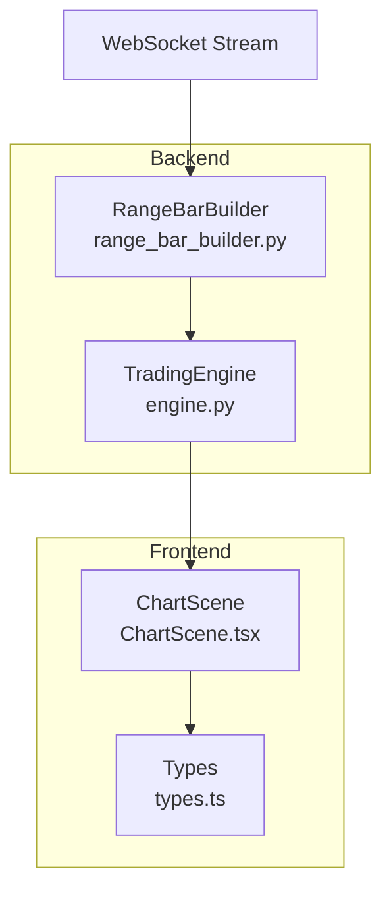
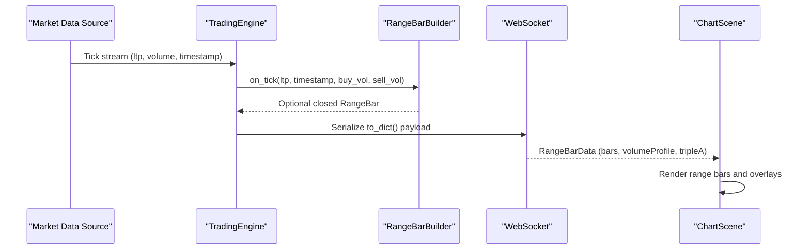
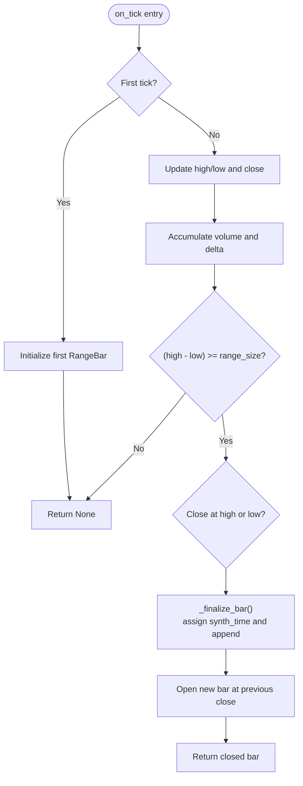
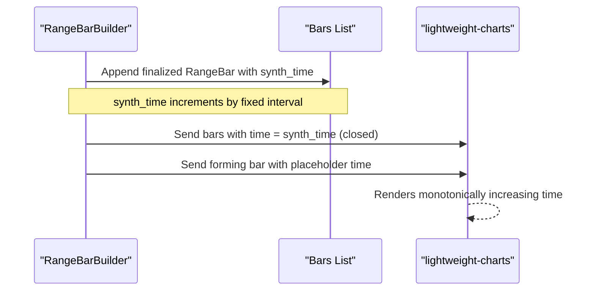
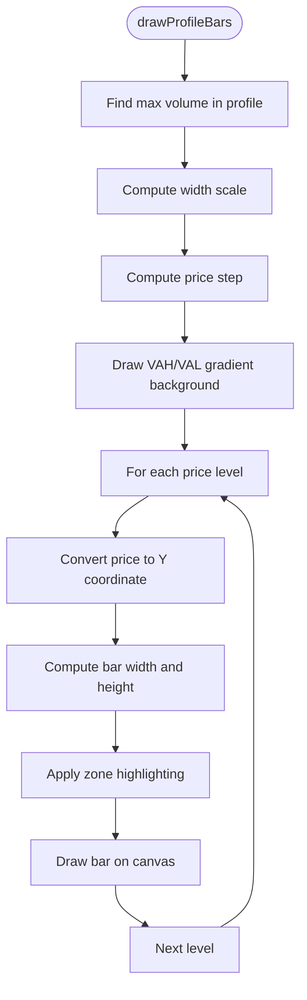
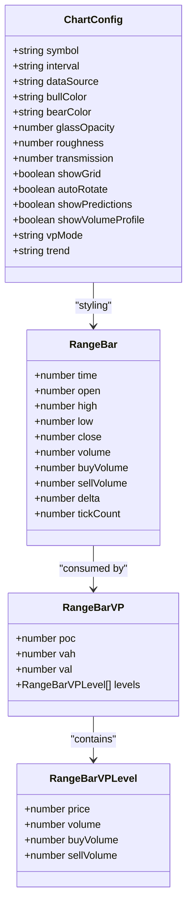
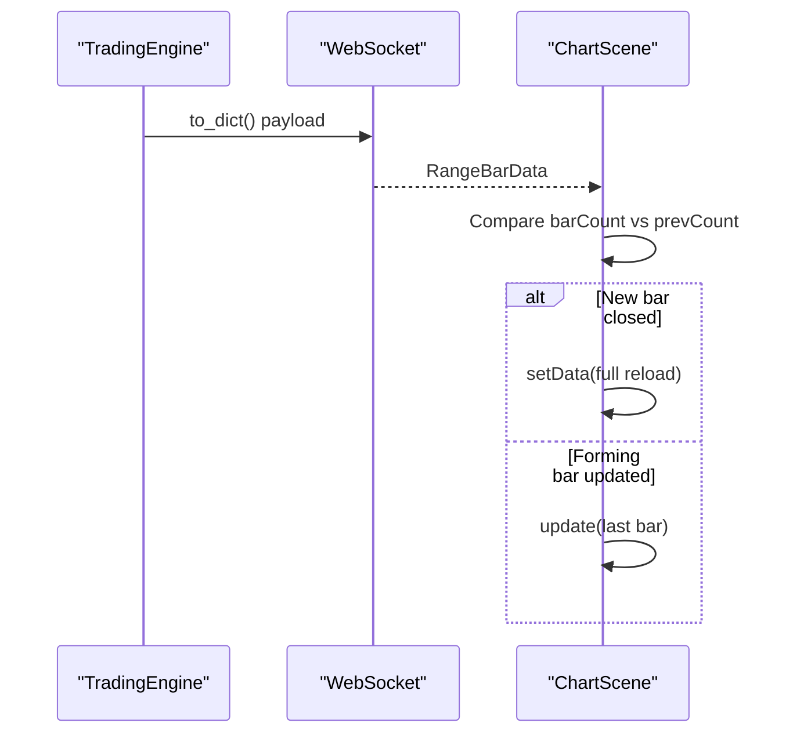
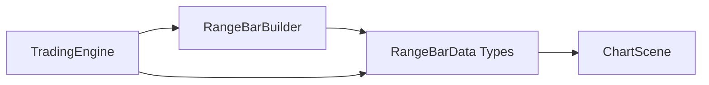

# Range Bar Visualization System

<cite>
**Referenced Files in This Document**
- [range_bar_builder.py](file://backend/app/application/range_bar_builder.py)
- [ChartScene.tsx](file://frontend/components/ChartScene.tsx)
- [types.ts](file://frontend/types.ts)
- [engine.py](file://backend/app/application/engine.py)
</cite>

## Table of Contents
1. [Introduction](#introduction)
2. [Project Structure](#project-structure)
3. [Core Components](#core-components)
4. [Architecture Overview](#architecture-overview)
5. [Detailed Component Analysis](#detailed-component-analysis)
6. [Dependency Analysis](#dependency-analysis)
7. [Performance Considerations](#performance-considerations)
8. [Troubleshooting Guide](#troubleshooting-guide)
9. [Conclusion](#conclusion)

## Introduction
This document explains the range bar visualization system designed for multi-timeframe analysis. Unlike traditional time-based candles, range bars are constructed purely on price movement—specifically, when the high-low range of an in-progress bar reaches a configured threshold. This enables traders to analyze market structure independent of time, revealing true supply/demand dynamics and reaction zones.

Key capabilities documented:
- Range bar data structure and lifecycle
- Synthetic timestamp handling for chart rendering
- Specialized rendering algorithms for range bars and volume profiles
- Range volume profile computation and display
- Bar width calculations and visual styling
- Integration with the backend range bar builder and frontend chart rendering
- Differences between standard candles and range bars, including spacing and styling
- Examples of data processing and performance optimizations for large datasets

## Project Structure
The range bar system spans backend and frontend components:
- Backend: RangeBarBuilder computes range bars, volume profiles, and related analytics from incoming tick streams.
- Frontend: ChartScene renders range bars and overlays volume profiles using lightweight-charts and custom canvas overlays.

**Diagram sources**
- [range_bar_builder.py:74-110](file://backend/app/application/range_bar_builder.py#L74-L110)
- [engine.py:110-112](file://backend/app/application/engine.py#L110-L112)
- [ChartScene.tsx:1136-1183](file://frontend/components/ChartScene.tsx#L1136-L1183)
- [types.ts:146-194](file://frontend/types.ts#L146-L194)

**Section sources**
- [range_bar_builder.py:1-15](file://backend/app/application/range_bar_builder.py#L1-L15)
- [ChartScene.tsx:1136-1183](file://frontend/components/ChartScene.tsx#L1136-L1183)
- [types.ts:146-194](file://frontend/types.ts#L146-L194)

## Core Components
- RangeBarBuilder: Processes tick data into price-movement-based bars, maintains volume profile state, computes VWAP and Triple-A pattern detection, and serializes data for the frontend.
- RangeBar data model: Captures OHLC, volume, deltas, tick counts, and synthetic timestamps.
- VolumeProfileLevel and RangeBarVP: Represent price-level volumes and derived statistics (POC, VAH, VAL).
- Frontend ChartScene: Renders range bars and overlays volume profiles with custom canvas drawing and lightweight-charts integration.
- Types: Defines the data contract for range bar payloads and overlay rendering.

**Section sources**
- [range_bar_builder.py:22-57](file://backend/app/application/range_bar_builder.py#L22-L57)
- [range_bar_builder.py:74-110](file://backend/app/application/range_bar_builder.py#L74-L110)
- [ChartScene.tsx:487-652](file://frontend/components/ChartScene.tsx#L487-L652)
- [types.ts:146-194](file://frontend/types.ts#L146-L194)

## Architecture Overview
The system operates as follows:
- Market data is ingested by the backend and fed into RangeBarBuilder instances per symbol.
- RangeBarBuilder updates in-progress bars and finalizes them when the range threshold is met.
- Finalized bars are serialized with synthetic timestamps and sent to the frontend via the TradingEngine.
- The frontend renders range bars on a candlestick series and overlays volume profiles using canvas drawing.

**Diagram sources**
- [engine.py:110-112](file://backend/app/application/engine.py#L110-L112)
- [range_bar_builder.py:148-217](file://backend/app/application/range_bar_builder.py#L148-L217)
- [range_bar_builder.py:485-575](file://backend/app/application/range_bar_builder.py#L485-L575)
- [ChartScene.tsx:1136-1183](file://frontend/components/ChartScene.tsx#L1136-L1183)

## Detailed Component Analysis

### RangeBarBuilder: Data Structure and Algorithms
RangeBarBuilder encapsulates:
- RangeBar: Core OHLCV record plus volume deltas and synthetic timestamps.
- VolumeProfileLevel and RangeBarVP: Levelized volume with POC/VAH/VAL computation.
- Processing pipeline: Tick ingestion, high/low updates, range breach detection, bar finalization, and indicator updates.

Key behaviors:
- Range breach detection: When (high - low) ≥ range_size, the bar closes at high or low depending on the relationship to the open.
- Volume profile distribution: Distributes bar volume across price buckets using tick-sized steps and linear interpolation across the bar’s range.
- Synthetic timestamps: Assigns ascending synthetic timestamps to closed bars and uses a safe placeholder for the forming bar to maintain monotonic time ordering.

**Diagram sources**
- [range_bar_builder.py:148-217](file://backend/app/application/range_bar_builder.py#L148-L217)
- [range_bar_builder.py:219-227](file://backend/app/application/range_bar_builder.py#L219-L227)

**Section sources**
- [range_bar_builder.py:22-57](file://backend/app/application/range_bar_builder.py#L22-L57)
- [range_bar_builder.py:148-217](file://backend/app/application/range_bar_builder.py#L148-L217)
- [range_bar_builder.py:219-256](file://backend/app/application/range_bar_builder.py#L219-L256)

### Synthetic Timestamp Handling
Synthetic timestamps ensure monotonic time progression for chart rendering:
- Closed bars receive synth_time incremented by a fixed interval.
- The forming bar uses a placeholder timestamp strictly greater than the last closed bar but less than the next closed bar, preventing non-ascending time values in lightweight-charts.

**Diagram sources**
- [range_bar_builder.py:219-227](file://backend/app/application/range_bar_builder.py#L219-L227)
- [range_bar_builder.py:492-501](file://backend/app/application/range_bar_builder.py#L492-L501)

**Section sources**
- [range_bar_builder.py:219-227](file://backend/app/application/range_bar_builder.py#L219-L227)
- [range_bar_builder.py:492-501](file://backend/app/application/range_bar_builder.py#L492-L501)

### Range Volume Profile Rendering
The frontend draws volume profiles as vertical bars on the right side of the chart:
- Computes maximum volume to scale bar widths.
- Uses price step size to compute bar heights for continuous price ranges.
- Highlights value area (VAH/VAL) with gradient shading.
- Applies directional coloring (buy/sell) and marks POC and HVN/LVN zones.

**Diagram sources**
- [ChartScene.tsx:487-526](file://frontend/components/ChartScene.tsx#L487-L526)
- [ChartScene.tsx:528-652](file://frontend/components/ChartScene.tsx#L528-L652)

**Section sources**
- [ChartScene.tsx:487-526](file://frontend/components/ChartScene.tsx#L487-L526)
- [ChartScene.tsx:528-652](file://frontend/components/ChartScene.tsx#L528-L652)

### Bar Width Calculations and Visual Styling
Range bars differ from standard candles in spacing and visual presentation:
- Bar spacing: RANGE mode reduces barSpacing/minBarSpacing for denser visualization compared to STANDARD mode.
- Visual styling: Range bars use candlestick series with custom colors; volume overlay uses histogram series with directional coloring.
- Overlay rendering: Custom canvas draws volume profiles, value areas, and markers without altering candle geometry.

**Diagram sources**
- [types.ts:146-194](file://frontend/types.ts#L146-L194)
- [types.ts:204-219](file://frontend/types.ts#L204-L219)

**Section sources**
- [ChartScene.tsx:189-194](file://frontend/components/ChartScene.tsx#L189-L194)
- [ChartScene.tsx:1136-1183](file://frontend/components/ChartScene.tsx#L1136-L1183)
- [types.ts:146-194](file://frontend/types.ts#L146-L194)

### Integration with Range Bar Data Source
The backend aggregates ticks into range bars and exposes them via a unified payload:
- Bars: Array of closed and forming bars with synthetic timestamps.
- Volume profiles: Session and leg profiles with POC/VAH/VAL.
- Analytics: VWAP, cumulative delta, Triple-A pattern detection.

Frontend integrates by:
- Detecting mode changes and resetting counters to ensure full reloads when switching modes.
- Performing setData() on new bar closures and update() on forming bar changes to minimize redraw overhead.

**Diagram sources**
- [range_bar_builder.py:485-575](file://backend/app/application/range_bar_builder.py#L485-L575)
- [ChartScene.tsx:1136-1183](file://frontend/components/ChartScene.tsx#L1136-L1183)

**Section sources**
- [range_bar_builder.py:485-575](file://backend/app/application/range_bar_builder.py#L485-L575)
- [ChartScene.tsx:1136-1183](file://frontend/components/ChartScene.tsx#L1136-L1183)

### Differences Between Standard Candles and Range Bars
- Construction: Standard candles aggregate trades over fixed time intervals; range bars aggregate trades until price moves a fixed range from the open.
- Spacing: Range mode uses tighter bar spacing for dense visualization; standard mode uses wider spacing for readability.
- Volume overlay: Both use histogram series, but range bars emphasize volume distribution across price levels.
- Indicators: Range bars naturally reveal POC/VAH/VAL and support Triple-A pattern detection aligned with price action.

**Section sources**
- [ChartScene.tsx:189-194](file://frontend/components/ChartScene.tsx#L189-L194)
- [range_bar_builder.py:388-482](file://backend/app/application/range_bar_builder.py#L388-L482)

### Examples of Range Bar Data Processing
- Tick ingestion: on_tick updates OHLC, volume, and delta; checks range breach and finalizes bars when threshold is met.
- Volume profile: _finalize_bar distributes volume across price buckets and interpolates across the bar’s range.
- Serialization: to_dict converts bars to OHLC-like records with synthetic timestamps and includes session/leg profiles and analytics.

**Section sources**
- [range_bar_builder.py:148-217](file://backend/app/application/range_bar_builder.py#L148-L217)
- [range_bar_builder.py:229-256](file://backend/app/application/range_bar_builder.py#L229-L256)
- [range_bar_builder.py:485-575](file://backend/app/application/range_bar_builder.py#L485-L575)

## Dependency Analysis
The system exhibits clear separation of concerns:
- Backend depends on RangeBarBuilder for data processing and analytics.
- Frontend depends on types for payload contracts and ChartScene for rendering.
- TradingEngine orchestrates data flow and WebSocket exposure.

**Diagram sources**
- [engine.py:110-112](file://backend/app/application/engine.py#L110-L112)
- [range_bar_builder.py:485-575](file://backend/app/application/range_bar_builder.py#L485-L575)
- [types.ts:146-194](file://frontend/types.ts#L146-L194)
- [ChartScene.tsx:1136-1183](file://frontend/components/ChartScene.tsx#L1136-L1183)

**Section sources**
- [engine.py:110-112](file://backend/app/application/engine.py#L110-L112)
- [range_bar_builder.py:485-575](file://backend/app/application/range_bar_builder.py#L485-L575)
- [types.ts:146-194](file://frontend/types.ts#L146-L194)
- [ChartScene.tsx:1136-1183](file://frontend/components/ChartScene.tsx#L1136-L1183)

## Performance Considerations
- Efficient updates: Frontend uses setData() only on new bar closures and update() for forming bars to minimize redraw overhead.
- Data trimming: RangeBarBuilder limits stored bars to a maximum window to control memory usage.
- Volume distribution: Interpolates volume across price buckets to avoid excessive memory for fine-grained steps.
- Canvas optimization: Memoization and stable references prevent unnecessary overlay redraws.

Recommendations:
- Tune range_size per instrument to balance responsiveness and stability.
- Monitor max_bars to align with visualization needs and memory budgets.
- Use vpMode appropriately to reduce overlay complexity when analyzing multiple sessions.

**Section sources**
- [ChartScene.tsx:1136-1183](file://frontend/components/ChartScene.tsx#L1136-L1183)
- [range_bar_builder.py:225-227](file://backend/app/application/range_bar_builder.py#L225-L227)
- [range_bar_builder.py:238-251](file://backend/app/application/range_bar_builder.py#L238-L251)

## Troubleshooting Guide
Common issues and resolutions:
- Non-ascending timestamps: Ensure synthetic timestamps are assigned consistently; the builder guarantees monotonic ordering by design.
- Empty or missing profile: Verify that bars have sufficient volume and range; profile computation requires positive totals.
- Excessive redraws: Confirm that setData() is only invoked on new bar closures and update() is used for forming bars.
- Mode switching artifacts: Reset internal counters when leaving RANGE mode to force a full reload on next entry.

**Section sources**
- [range_bar_builder.py:492-501](file://backend/app/application/range_bar_builder.py#L492-L501)
- [ChartScene.tsx:1136-1183](file://frontend/components/ChartScene.tsx#L1136-L1183)

## Conclusion
The range bar visualization system provides a robust framework for multi-timeframe analysis grounded in price action. By separating concerns between backend data processing and frontend rendering, the system achieves efficient updates, accurate profile computation, and flexible visual styling. Proper tuning of range_size, bar limits, and rendering modes enables scalable analysis across large datasets while maintaining responsive user experiences.