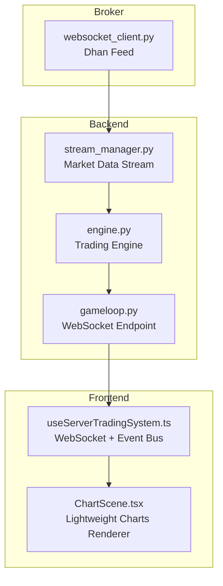
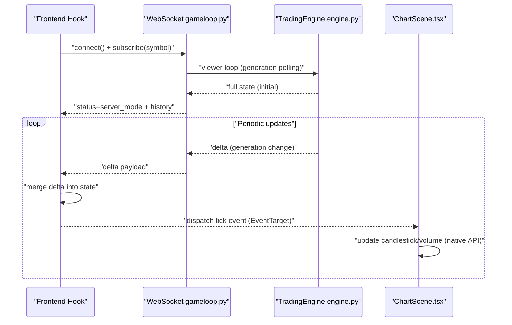
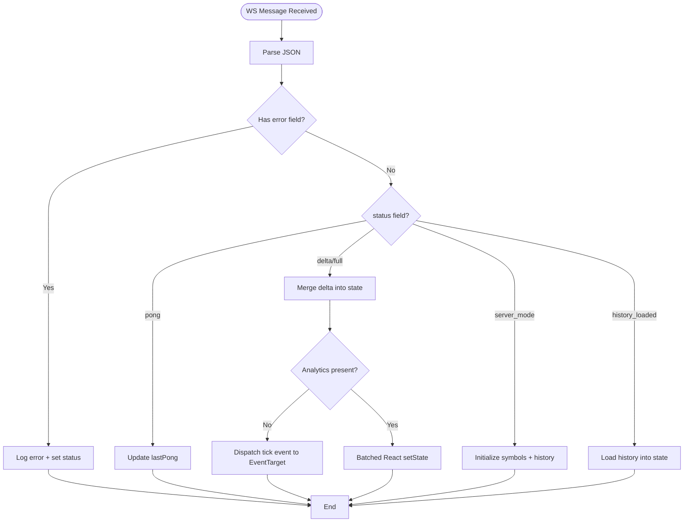
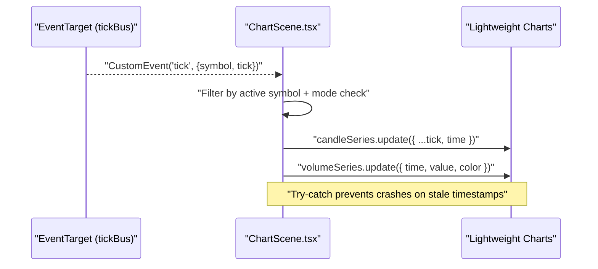
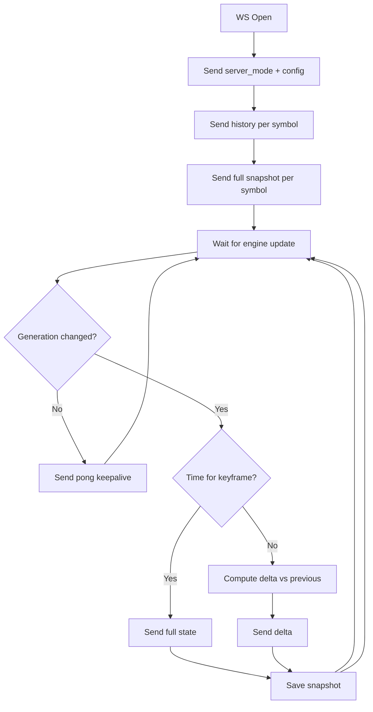
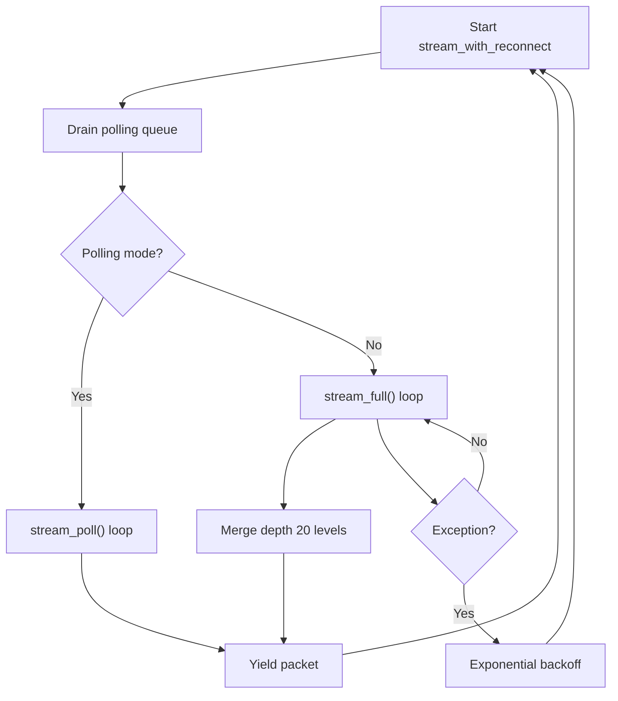
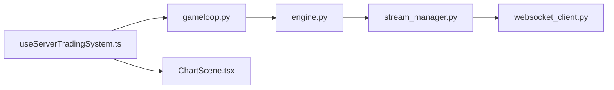

# Real-Time Data Streaming and Updates

<cite>
**Referenced Files in This Document**
- [useServerTradingSystem.ts](file://frontend/hooks/useServerTradingSystem.ts)
- [ChartScene.tsx](file://frontend/components/ChartScene.tsx)
- [gameloop.py](file://backend/app/api/websocket/gameloop.py)
- [stream_manager.py](file://backend/app/application/stream_manager.py)
- [engine.py](file://backend/app/application/engine.py)
- [websocket_client.py](file://brokers/broker/dhan/infrastructure/websocket_client.py)
- [tick_utils.py](file://backend/app/domain/services/tick_utils.py)
- [signal_validator.py](file://backend/app/domain/trading/services/signal_validator.py)
</cite>

## Table of Contents
1. [Introduction](#introduction)
2. [Project Structure](#project-structure)
3. [Core Components](#core-components)
4. [Architecture Overview](#architecture-overview)
5. [Detailed Component Analysis](#detailed-component-analysis)
6. [Dependency Analysis](#dependency-analysis)
7. [Performance Considerations](#performance-considerations)
8. [Troubleshooting Guide](#troubleshooting-guide)
9. [Conclusion](#conclusion)

## Introduction
This document explains the real-time data streaming and chart update pipeline used by the system. It covers WebSocket integration, tick event handling, dynamic chart updates without remounting, stale tick prevention, timestamp validation, error handling for out-of-order data, the event bus pattern, symbol filtering, selective data updates, and performance optimizations for high-frequency streams. The backend is server-driven: the trading engine runs independently and streams state to frontend clients via a WebSocket endpoint. The frontend renders charts and overlays using a high-performance event bus to avoid unnecessary React re-renders.

## Project Structure
The real-time streaming spans three layers:
- Frontend: React hook manages WebSocket, delta state merging, and an event bus for ticks; ChartScene renders candlesticks and overlays.
- Backend: WebSocket endpoint streams server-mode state; the engine aggregates ticks and computes analytics; StreamManager handles broker connectivity and fallbacks.
- Broker: Dhan WebSocket client provides market data feeds with robust reconnection logic.

**Diagram sources**
- [useServerTradingSystem.ts:59-654](file://frontend/hooks/useServerTradingSystem.ts#L59-L654)
- [ChartScene.tsx:51-373](file://frontend/components/ChartScene.tsx#L51-L373)
- [gameloop.py:112-356](file://backend/app/api/websocket/gameloop.py#L112-L356)
- [engine.py:59-200](file://backend/app/application/engine.py#L59-L200)
- [stream_manager.py:32-304](file://backend/app/application/stream_manager.py#L32-L304)
- [websocket_client.py:473-668](file://brokers/broker/dhan/infrastructure/websocket_client.py#L473-L668)

**Section sources**
- [useServerTradingSystem.ts:59-654](file://frontend/hooks/useServerTradingSystem.ts#L59-L654)
- [ChartScene.tsx:51-373](file://frontend/components/ChartScene.tsx#L51-L373)
- [gameloop.py:112-356](file://backend/app/api/websocket/gameloop.py#L112-L356)
- [engine.py:59-200](file://backend/app/application/engine.py#L59-L200)
- [stream_manager.py:32-304](file://backend/app/application/stream_manager.py#L32-L304)
- [websocket_client.py:473-668](file://brokers/broker/dhan/infrastructure/websocket_client.py#L473-L668)

## Core Components
- Frontend WebSocket and Event Bus
  - Establishes a direct WebSocket connection to the backend, performs heartbeats, and merges deltas into instrument state.
  - Emits tick events via a global EventTarget to drive chart updates without touching React state.
- Chart Rendering
  - Initializes Lightweight Charts, applies mode-specific options, and subscribes to tick events to update candlesticks and volumes.
  - Uses memoization and overlay stability to minimize redraws.
- Backend WebSocket and Engine
  - Streams server-mode configuration, history, and periodic deltas keyed by generation.
  - Validates incoming tick payloads and filters out invalid data.
- Stream Management
  - Dual-streaming (full + depth) with polling fallback for symbols that do not arrive via WebSocket.
  - Reconnection with exponential backoff and staleness detection.

**Section sources**
- [useServerTradingSystem.ts:59-654](file://frontend/hooks/useServerTradingSystem.ts#L59-L654)
- [ChartScene.tsx:51-373](file://frontend/components/ChartScene.tsx#L51-L373)
- [gameloop.py:112-356](file://backend/app/api/websocket/gameloop.py#L112-L356)
- [engine.py:59-200](file://backend/app/application/engine.py#L59-L200)
- [stream_manager.py:32-304](file://backend/app/application/stream_manager.py#L32-L304)

## Architecture Overview
The system follows a server-driven model:
- The TradingEngine continuously processes market data and maintains a generation-aware state.
- The WebSocket endpoint streams full snapshots initially, then deltas keyed by generation.
- The frontend renders charts and overlays using a dedicated event bus for tick updates, ensuring minimal React updates.

**Diagram sources**
- [useServerTradingSystem.ts:509-597](file://frontend/hooks/useServerTradingSystem.ts#L509-L597)
- [gameloop.py:198-337](file://backend/app/api/websocket/gameloop.py#L198-L337)
- [engine.py:127-177](file://backend/app/application/engine.py#L127-L177)
- [ChartScene.tsx:277-319](file://frontend/components/ChartScene.tsx#L277-L319)

## Detailed Component Analysis

### Frontend WebSocket and Event Bus
- Connection lifecycle
  - Connects directly to backend port, bypassing reverse proxies to reduce failures.
  - Sends initial subscribe on open; debounced symbol switching with generation counters prevents stale subscribe races.
  - Heartbeat ping/pong with timeouts triggers reconnects.
- Delta compression and state merging
  - Merges only changed fields into instrument state; analytics-only deltas skip React updates.
  - Maintains ascending time order for tick arrays and caps buffer size.
  - Deduplicates LLM history entries based on direction and rationale.
- Event bus pattern
  - Dispatches tick events to decouple chart updates from React state changes.
  - Tick-only deltas trigger native chart updates; analytics deltas update React state.

**Diagram sources**
- [useServerTradingSystem.ts:204-498](file://frontend/hooks/useServerTradingSystem.ts#L204-L498)

**Section sources**
- [useServerTradingSystem.ts:509-597](file://frontend/hooks/useServerTradingSystem.ts#L509-L597)
- [useServerTradingSystem.ts:204-498](file://frontend/hooks/useServerTradingSystem.ts#L204-L498)
- [useServerTradingSystem.ts:326-396](file://frontend/hooks/useServerTradingSystem.ts#L326-L396)

### Chart Rendering and Dynamic Updates
- Initialization
  - Creates candlestick and histogram series; applies mode-specific options (standard, footprint, range).
  - Loads initial data with IST offset normalization; ensures sorted time to prevent chart crashes.
- Real-time tick updates
  - Subscribes to tick events; ignores ticks when rendering RANGE bars (which use synthetic timestamps).
  - Wraps native chart updates in try-catch to ignore stale/out-of-order updates safely.
- Mode switching without remount
  - Applies series options dynamically based on mode; overlays remain stable via memoized references.

**Diagram sources**
- [ChartScene.tsx:277-319](file://frontend/components/ChartScene.tsx#L277-L319)

**Section sources**
- [ChartScene.tsx:116-275](file://frontend/components/ChartScene.tsx#L116-L275)
- [ChartScene.tsx:277-319](file://frontend/components/ChartScene.tsx#L277-L319)
- [ChartScene.tsx:341-373](file://frontend/components/ChartScene.tsx#L341-L373)

### Backend WebSocket and State Streaming
- Server-driven mode
  - Sends server_mode status with active symbols and exchange/interval settings.
  - Streams recent history per symbol, then full snapshots, then deltas keyed by generation.
- Delta compression
  - Computes deltas by comparing previous state snapshots; shallow copies with selective deep copies for mutable fields.
- Tick validation
  - Parses and validates incoming tick payloads; rejects invalid OHLC values and high-low inconsistencies.

**Diagram sources**
- [gameloop.py:198-337](file://backend/app/api/websocket/gameloop.py#L198-L337)
- [gameloop.py:50-62](file://backend/app/api/websocket/gameloop.py#L50-L62)

**Section sources**
- [gameloop.py:112-196](file://backend/app/api/websocket/gameloop.py#L112-L196)
- [gameloop.py:198-337](file://backend/app/api/websocket/gameloop.py#L198-L337)
- [gameloop.py:50-62](file://backend/app/api/websocket/gameloop.py#L50-L62)

### Stream Management and Broker Connectivity
- Dual-streaming and polling fallback
  - Starts a depth 20 stream alongside full feed; merges depth into packets.
  - Switches to polling for symbols that do not arrive via WebSocket after a grace period.
- Reconnection and staleness
  - Exponential backoff with capped retries; marks stream dead after max failures.
  - Detects staleness and resets timers on tick receipt.

**Diagram sources**
- [stream_manager.py:135-289](file://backend/app/application/stream_manager.py#L135-L289)

**Section sources**
- [stream_manager.py:32-304](file://backend/app/application/stream_manager.py#L32-L304)
- [websocket_client.py:473-668](file://brokers/broker/dhan/infrastructure/websocket_client.py#L473-L668)

### Timestamp Validation and Stale Tick Prevention
- Frontend
  - Drops ticks when the chart is in RANGE mode to avoid injecting standard UNIX timestamps into synthetic integer timestamps.
  - Wraps native chart updates in try-catch to ignore stale/out-of-order updates.
  - Maintains ascending time order for tick arrays and caps buffer size.
- Backend
  - Validates OHLC values and high-low consistency; rejects malformed ticks.
  - Uses generation-based polling to ensure viewers receive updates in order.

**Section sources**
- [ChartScene.tsx:281-312](file://frontend/components/ChartScene.tsx#L281-L312)
- [useServerTradingSystem.ts:333-344](file://frontend/hooks/useServerTradingSystem.ts#L333-L344)
- [gameloop.py:96-110](file://backend/app/api/websocket/gameloop.py#L96-L110)

### Event Bus Pattern, Symbol Filtering, and Selective Updates
- Event bus
  - Global EventTarget dispatches tick events; ChartScene listens and updates native series.
- Symbol filtering
  - Tick events include the symbol; ChartScene filters by active symbol before updating.
- Selective analytics updates
  - Analytics-only deltas skip React state updates; tick-only deltas update the chart via the event bus.

**Section sources**
- [useServerTradingSystem.ts:297-301](file://frontend/hooks/useServerTradingSystem.ts#L297-L301)
- [ChartScene.tsx:286-288](file://frontend/components/ChartScene.tsx#L286-L288)
- [useServerTradingSystem.ts:306-325](file://frontend/hooks/useServerTradingSystem.ts#L306-L325)

### Real-Time Subscription Setup and Update Strategies
- Subscription setup
  - Initial subscribe on WS open; debounced symbol changes with generation counters to prevent race conditions.
- Update strategies by chart mode
  - STANDARD: Update candlesticks and histograms; overlays disabled.
  - FOOTPRINT: Hide candle visuals, enable overlays; draw footprint and aggressive prints.
  - RANGE: Use synthetic timestamps; draw range bars and optional volume profile.

**Section sources**
- [useServerTradingSystem.ts:523-533](file://frontend/hooks/useServerTradingSystem.ts#L523-L533)
- [useServerTradingSystem.ts:601-621](file://frontend/hooks/useServerTradingSystem.ts#L601-L621)
- [ChartScene.tsx:177-220](file://frontend/components/ChartScene.tsx#L177-L220)
- [ChartScene.tsx:344-373](file://frontend/components/ChartScene.tsx#L344-L373)

## Dependency Analysis
- Frontend hook depends on:
  - WebSocket endpoint for state and tick deltas.
  - EventTarget for high-frequency tick delivery.
- Backend depends on:
  - TradingEngine for generation-aware state.
  - StreamManager for broker connectivity and fallback.
  - Broker WebSocket client for market data.

**Diagram sources**
- [useServerTradingSystem.ts:509-597](file://frontend/hooks/useServerTradingSystem.ts#L509-L597)
- [gameloop.py:112-196](file://backend/app/api/websocket/gameloop.py#L112-L196)
- [engine.py:59-200](file://backend/app/application/engine.py#L59-L200)
- [stream_manager.py:32-304](file://backend/app/application/stream_manager.py#L32-L304)
- [websocket_client.py:473-668](file://brokers/broker/dhan/infrastructure/websocket_client.py#L473-L668)
- [ChartScene.tsx:51-373](file://frontend/components/ChartScene.tsx#L51-L373)

**Section sources**
- [useServerTradingSystem.ts:509-597](file://frontend/hooks/useServerTradingSystem.ts#L509-L597)
- [gameloop.py:112-196](file://backend/app/api/websocket/gameloop.py#L112-L196)
- [engine.py:59-200](file://backend/app/application/engine.py#L59-L200)
- [stream_manager.py:32-304](file://backend/app/application/stream_manager.py#L32-L304)
- [websocket_client.py:473-668](file://brokers/broker/dhan/infrastructure/websocket_client.py#L473-L668)
- [ChartScene.tsx:51-373](file://frontend/components/ChartScene.tsx#L51-L373)

## Performance Considerations
- Delta compression
  - Backend computes deltas by comparing previous snapshots; frontend merges only changed fields.
- Batched React updates
  - Frontend batches multiple deltas into a single React render per animation frame to reduce overhead.
- Event bus for ticks
  - Tick-only updates bypass React state; chart updates occur via native Lightweight Charts APIs.
- Overlay stability
  - Memoized references and fingerprinting prevent unnecessary overlay redraws.
- Stream fallbacks
  - Polling fallback for symbols without WebSocket data reduces stalls.
- Timestamp normalization
  - Consistent IST offset normalization avoids chart sorting issues.

[No sources needed since this section provides general guidance]

## Troubleshooting Guide
- WebSocket connection issues
  - Heartbeat timeouts trigger automatic reconnects; check backend logs for disconnect reasons.
  - Frontend retries with exponential backoff; inspect connection status messages.
- Stale or out-of-order ticks
  - Frontend ignores updates when the chart is in RANGE mode or when try-catch catches timestamp errors.
  - Backend validates tick payloads; malformed data is rejected.
- Stream staleness
  - StreamManager detects zero-tick windows and switches to polling; monitors staleness thresholds.
- Signal freshness
  - Signal validators compute age against current tick timestamps; stale signals are flagged.

**Section sources**
- [useServerTradingSystem.ts:534-545](file://frontend/hooks/useServerTradingSystem.ts#L534-L545)
- [useServerTradingSystem.ts:310-312](file://frontend/hooks/useServerTradingSystem.ts#L310-L312)
- [stream_manager.py:120-129](file://backend/app/application/stream_manager.py#L120-L129)
- [signal_validator.py:52-82](file://backend/app/domain/trading/services/signal_validator.py#L52-L82)

## Conclusion
The system achieves responsive, high-frequency real-time updates through a server-driven architecture with delta compression, an event bus for ticks, and careful timestamp handling. The frontend renders charts efficiently without remounting, while the backend maintains robust stream management and validation. Together, these patterns deliver reliable, performant chart updates under real market conditions.