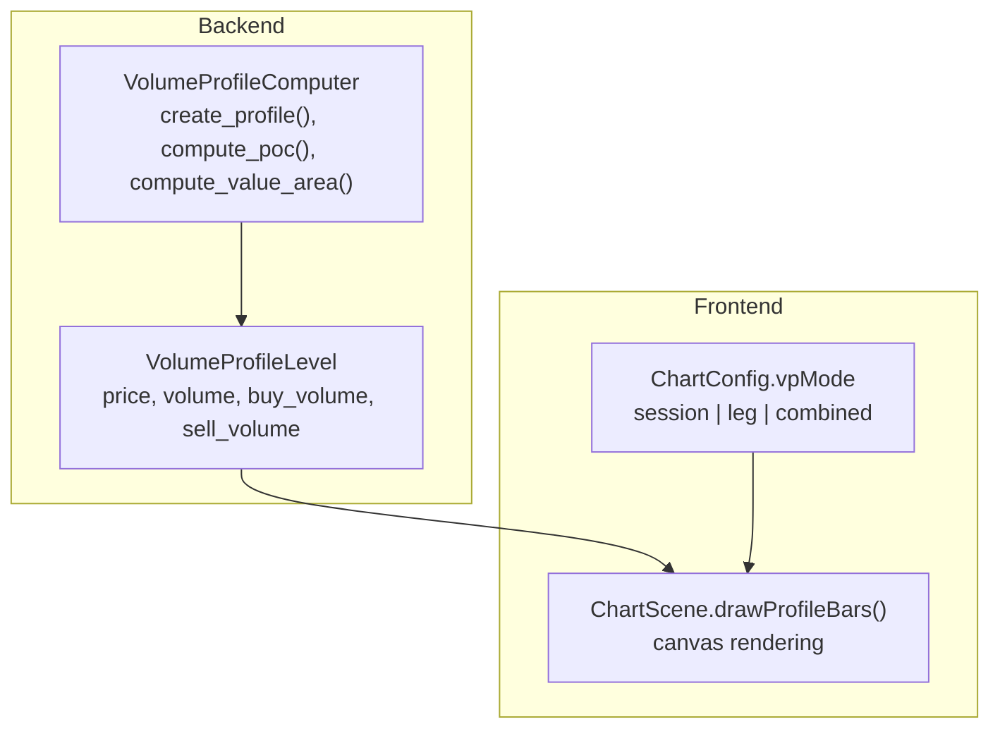
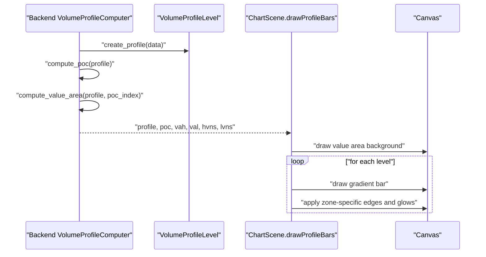
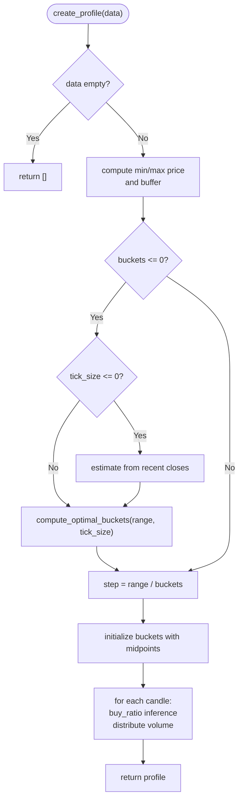
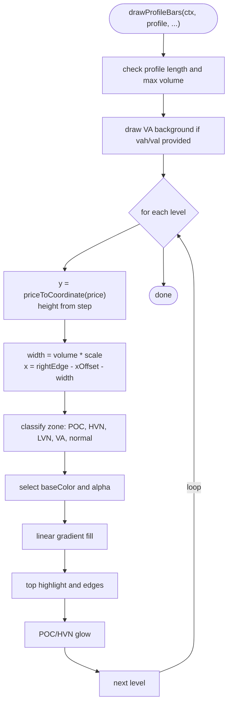
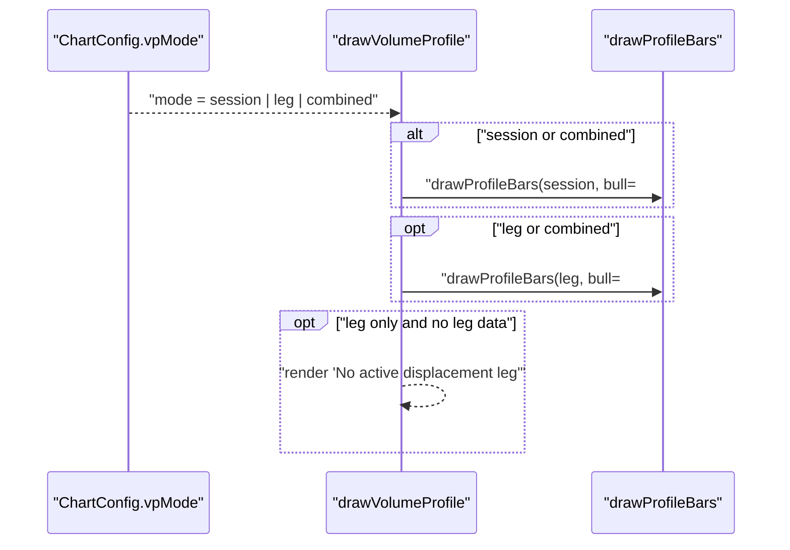
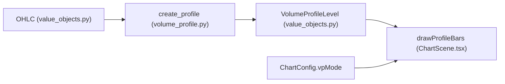

# Volume Profile Rendering

<cite>
**Referenced Files in This Document**
- [ChartScene.tsx](file://frontend/components/ChartScene.tsx)
- [VolumeAccessory.tsx](file://frontend/components/VolumeAccessory.tsx)
- [volume_profile.py](file://backend/app/domain/services/volume_profile.py)
- [value_objects.py](file://backend/app/domain/trading/models/value_objects.py)
- [test_volume_profile.py](file://backend/tests/unit/domain/test_volume_profile.py)
- [volume_profile_logic_correctness_analysis.md](file://backups/docs/volume_profile_logic_correctness_analysis.md)
- [test_lvn_detector.py](file://backend/tests/unit/domain/test_lvn_detector.py)
</cite>

## Table of Contents
1. [Introduction](#introduction)
2. [Project Structure](#project-structure)
3. [Core Components](#core-components)
4. [Architecture Overview](#architecture-overview)
5. [Detailed Component Analysis](#detailed-component-analysis)
6. [Dependency Analysis](#dependency-analysis)
7. [Performance Considerations](#performance-considerations)
8. [Troubleshooting Guide](#troubleshooting-guide)
9. [Conclusion](#conclusion)

## Introduction
This document explains the volume profile rendering functionality, focusing on the frontend drawProfileBars implementation and the backend volume profile computation pipeline. It covers:
- How profile bars are created and rendered with gradient fills and visual enhancements
- Zone highlighting for POC, HVN, LVN, and Value Area
- Dual-mode rendering (session and leg profiles) with combined view support
- Color coding strategies, shadows, and glows
- Profile data structures, coordinate calculations, and performance optimizations
- Examples of rendering, zone detection algorithms, and customization options

## Project Structure
The volume profile rendering spans two layers:
- Backend: computes the profile, POC, VAH, VAL, and optional leg profile
- Frontend: renders the profile bars on the chart canvas with visual enhancements

**Diagram sources**
- [volume_profile.py:196-290](file://backend/app/domain/services/volume_profile.py#L196-L290)
- [value_objects.py:84-92](file://backend/app/domain/trading/models/value_objects.py#L84-L92)
- [ChartScene.tsx:487-652](file://frontend/components/ChartScene.tsx#L487-L652)

**Section sources**
- [ChartScene.tsx:487-652](file://frontend/components/ChartScene.tsx#L487-L652)
- [volume_profile.py:196-290](file://backend/app/domain/services/volume_profile.py#L196-L290)
- [value_objects.py:84-92](file://backend/app/domain/trading/models/value_objects.py#L84-L92)

## Core Components
- Backend profile builder:
  - create_profile builds a histogram from OHLC candles
  - compute_poc selects the peak volume price with tie-breaking by VWAP reference
  - compute_value_area computes VAH/VAL using the CME Two-Row Pairs Method
  - Optional IncrementalVolumeProfile supports incremental updates and dynamic bucket sizing
- Frontend renderer:
  - drawProfileBars draws bars on the right side of the chart with gradient fills
  - Zones are highlighted: POC (bright yellow glow), HVN (green edge), LVN (thin orange edge), Value Area (blue gradient background)
  - Supports session and leg profiles, with combined view and offset positioning

**Section sources**
- [volume_profile.py:196-290](file://backend/app/domain/services/volume_profile.py#L196-L290)
- [volume_profile.py:41-148](file://backend/app/domain/services/volume_profile.py#L41-L148)
- [volume_profile.py:293-491](file://backend/app/domain/services/volume_profile.py#L293-L491)
- [ChartScene.tsx:487-652](file://frontend/components/ChartScene.tsx#L487-L652)
- [value_objects.py:84-92](file://backend/app/domain/trading/models/value_objects.py#L84-L92)

## Architecture Overview
The rendering pipeline integrates backend profile computation with frontend canvas drawing. The backend produces:
- Session profile levels with POC, VAH, VAL
- Optional leg profile levels for displacement legs
- Lists of HVNs and LVNs (LVN detection is tested separately)

The frontend receives these structures and renders them with visual enhancements.

**Diagram sources**
- [volume_profile.py:196-290](file://backend/app/domain/services/volume_profile.py#L196-L290)
- [volume_profile.py:41-148](file://backend/app/domain/services/volume_profile.py#L41-L148)
- [ChartScene.tsx:487-652](file://frontend/components/ChartScene.tsx#L487-L652)

## Detailed Component Analysis

### Backend: Volume Profile Computation
- Data ingestion:
  - Input: list of OHLC candles
  - Optional: taker buy volume or delta for buy/sell attribution
- Histogram construction:
  - Auto-compute buckets based on price range and tick size
  - Distribute volume uniformly across price buckets or concentrate at close
- POC computation:
  - Tie-break by proximity to VWAP reference when provided
- Value Area computation:
  - CME Two-Row Pairs Method expanding in steps of two rows alternately
- Snapshot building:
  - Produces immutable snapshot with POC, VAH, VAL, total volume, and histogram

**Diagram sources**
- [volume_profile.py:196-290](file://backend/app/domain/services/volume_profile.py#L196-L290)
- [volume_profile.py:185-194](file://backend/app/domain/services/volume_profile.py#L185-L194)

**Section sources**
- [volume_profile.py:196-290](file://backend/app/domain/services/volume_profile.py#L196-L290)
- [volume_profile.py:41-148](file://backend/app/domain/services/volume_profile.py#L41-L148)
- [test_volume_profile.py:34-61](file://backend/tests/unit/domain/test_volume_profile.py#L34-L61)

### Frontend: drawProfileBars Implementation
- Inputs:
  - profile: array of { price, volume, buyVolume, sellVolume }
  - maxWidthPct: maximum bar width as percentage of canvas width
  - xOffset: horizontal offset for combined view
  - bullColor/bearColor: base colors
  - useDirectionColors: whether to color bars by buy/sell dominance
  - hvnPrices, lvnPrices, vahPrice, valPrice, pocPrice: zone markers
- Coordinate calculations:
  - maxVol determines width scaling
  - step between price buckets drives bar height
  - priceToCoordinate maps price to pixel Y
- Zone highlighting:
  - Value Area: blue linear gradient background spanning VA range
  - POC: bright yellow edge with glow
  - HVN: green left edge with subtle glow
  - LVN: thin orange edge
  - Normal: faint colored edge
- Visual enhancements:
  - Glassy gradient fill (left transparent to right opaque)
  - Top highlight for “refraction” effect
  - Shadows for POC and HVN

**Diagram sources**
- [ChartScene.tsx:487-610](file://frontend/components/ChartScene.tsx#L487-L610)

**Section sources**
- [ChartScene.tsx:487-610](file://frontend/components/ChartScene.tsx#L487-L610)

### Dual-Mode Rendering (Session and Leg Profiles)
- Modes:
  - session: render session profile on the right side
  - leg: render leg profile (if present) with amber/orange colors
  - combined: render both with a horizontal offset for the session profile
- Combined view:
  - Session profile offset to the left to make room for leg profile
  - Each profile has its own label and color scheme
- Leg-only mode:
  - If no leg profile exists, display a “No active displacement leg” indicator

**Diagram sources**
- [ChartScene.tsx:625-652](file://frontend/components/ChartScene.tsx#L625-L652)
- [ChartScene.tsx:654-683](file://frontend/components/ChartScene.tsx#L654-L683)

**Section sources**
- [ChartScene.tsx:625-652](file://frontend/components/ChartScene.tsx#L625-L652)
- [ChartScene.tsx:654-683](file://frontend/components/ChartScene.tsx#L654-L683)

### Zone Highlighting and Color Coding
- POC:
  - Bright yellow edge with glow for emphasis
- HVN:
  - Green left edge with subtle glow
- LVN:
  - Thin orange edge for minimal visual intrusion
- Value Area:
  - Blue gradient background spanning VA range
- Directional coloring:
  - When enabled, bars reflect buy/sell dominance using configured colors
- Tolerance-based matching:
  - Uses bucket step to determine proximity to target levels

**Section sources**
- [ChartScene.tsx:514-610](file://frontend/components/ChartScene.tsx#L514-L610)

### LVN Detection and Integration Notes
- Backend LVN detection is tested independently and focuses on:
  - Finding local minima in smoothed histograms
  - Threshold-based strength scoring
- Frontend expects an array of LVN prices to highlight; ensure backend supplies legLvns and session-level LVNs when available

**Section sources**
- [test_lvn_detector.py:15-39](file://backend/tests/unit/domain/test_lvn_detector.py#L15-L39)
- [volume_profile_logic_correctness_analysis.md:188-244](file://backups/docs/volume_profile_logic_correctness_analysis.md#L188-L244)

## Dependency Analysis
- Backend depends on:
  - Trading models for OHLC and VolumeProfileLevel
  - Optional taker buy volume or delta for buy/sell attribution
- Frontend depends on:
  - Lightweight profile structures with price, volume, buyVolume, sellVolume
  - Chart series coordinates for pixel mapping
  - Configuration for rendering mode

**Diagram sources**
- [value_objects.py:18-65](file://backend/app/domain/trading/models/value_objects.py#L18-L65)
- [value_objects.py:84-92](file://backend/app/domain/trading/models/value_objects.py#L84-L92)
- [volume_profile.py:196-290](file://backend/app/domain/services/volume_profile.py#L196-L290)
- [ChartScene.tsx:487-652](file://frontend/components/ChartScene.tsx#L487-L652)

**Section sources**
- [value_objects.py:18-65](file://backend/app/domain/trading/models/value_objects.py#L18-L65)
- [value_objects.py:84-92](file://backend/app/domain/trading/models/value_objects.py#L84-L92)
- [volume_profile.py:196-290](file://backend/app/domain/services/volume_profile.py#L196-L290)
- [ChartScene.tsx:487-652](file://frontend/components/ChartScene.tsx#L487-L652)

## Performance Considerations
- Backend:
  - IncrementalVolumeProfile avoids full rebuilds by adding/removing candles and only recalculating POC/VA when necessary
  - Optimal bucket count computed from price range and tick size to balance resolution and performance
- Frontend:
  - Single pass over profile levels with constant-time per-level operations
  - Efficient gradient and shadow drawing using canvas APIs
  - Early exits when profile is empty or max volume is zero

**Section sources**
- [volume_profile.py:293-491](file://backend/app/domain/services/volume_profile.py#L293-L491)
- [ChartScene.tsx:487-610](file://frontend/components/ChartScene.tsx#L487-L610)

## Troubleshooting Guide
- Profile appears too narrow or misaligned:
  - Verify the profile window selection; ensure sufficient historical candles are included
  - Confirm bucket count is appropriate for the price range
- LVNs not visible:
  - Ensure LVN detection is enabled and thresholds are suitable
  - Confirm backend supplies legLvns and session-level LVNs
- POC not highlighted:
  - Check tolerance calculation based on bucket step
  - Ensure pocPrice is provided and matches a profile price within tolerance
- Combined view overlaps:
  - Adjust maxWidthPct and xOffset for session profile to avoid overlap with leg profile

**Section sources**
- [volume_profile_logic_correctness_analysis.md:35-81](file://backups/docs/volume_profile_logic_correctness_analysis.md#L35-L81)
- [ChartScene.tsx:625-652](file://frontend/components/ChartScene.tsx#L625-L652)

## Conclusion
The volume profile rendering combines robust backend computation with polished frontend visualization. The drawProfileBars function implements a glassy, layered rendering style with gradient fills, directional coloring, and targeted zone highlights. Dual-mode rendering supports session and leg profiles, enabling advanced analysis workflows. Proper configuration of bucket sizing, window selection, and LVN thresholds ensures accurate and actionable visual signals.