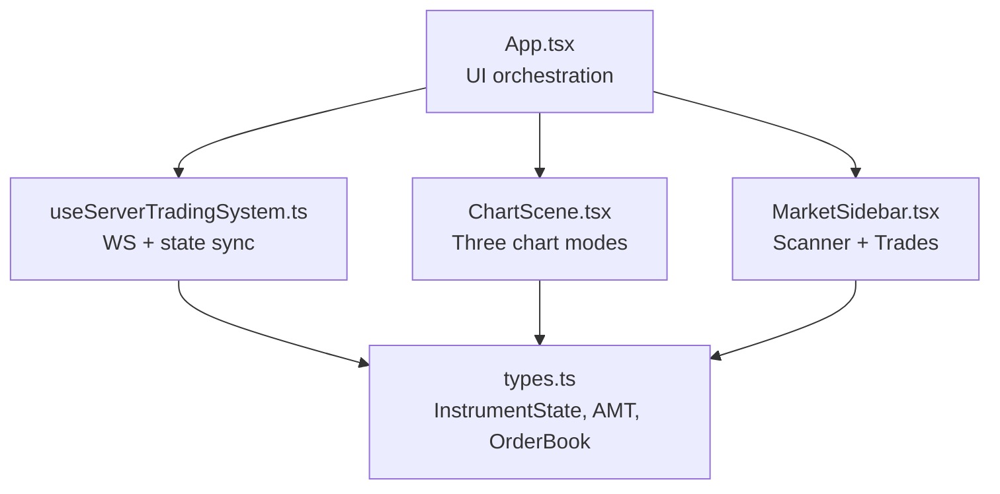
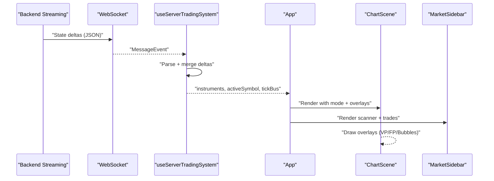
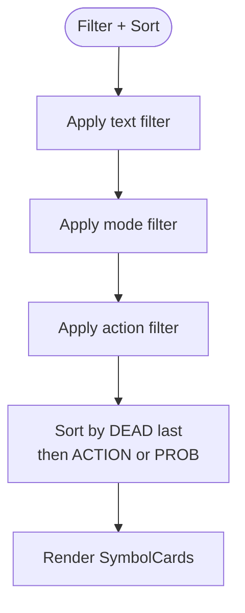
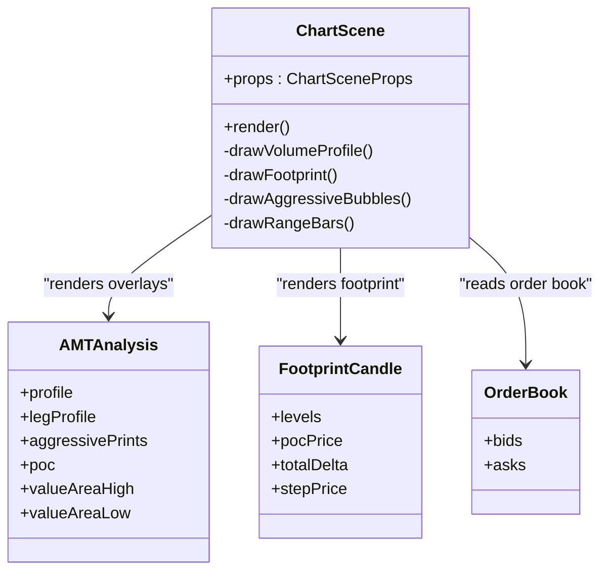
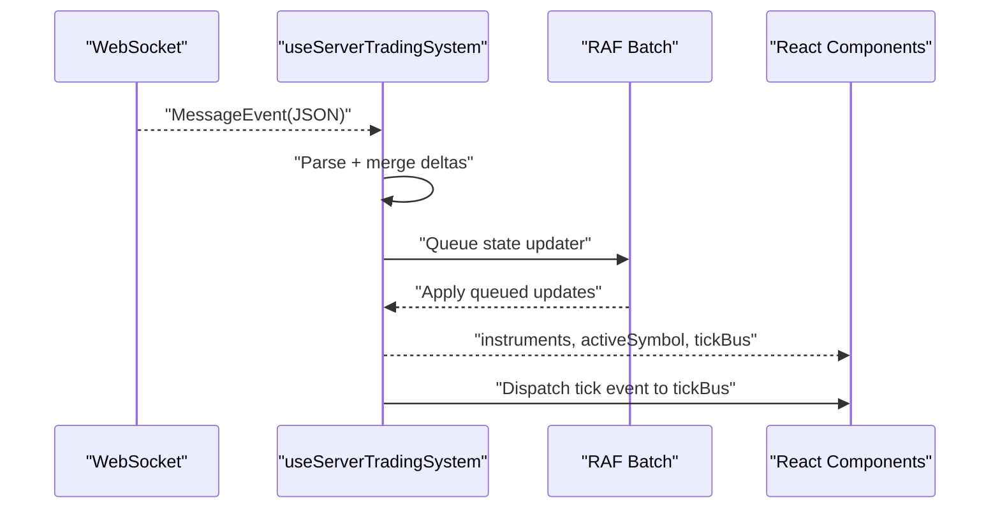
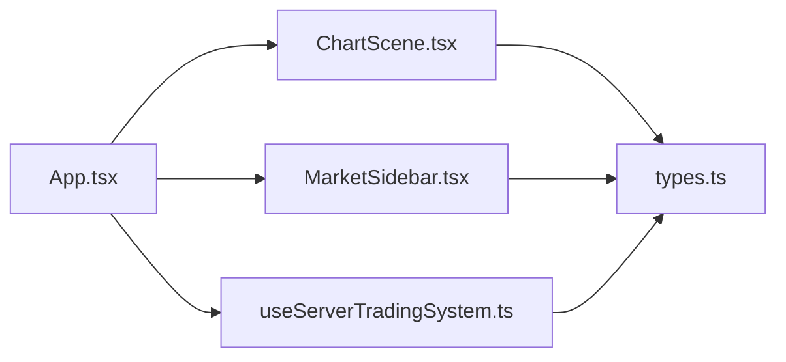

# Market Data Display Components

<cite>
**Referenced Files in This Document**
- [App.tsx](file://frontend/App.tsx)
- [MarketSidebar.tsx](file://frontend/components/MarketSidebar.tsx)
- [VolumeAccessory.tsx](file://frontend/components/VolumeAccessory.tsx)
- [ChartScene.tsx](file://frontend/components/ChartScene.tsx)
- [useServerTradingSystem.ts](file://frontend/hooks/useServerTradingSystem.ts)
- [types.ts](file://frontend/types.ts)
</cite>

## Table of Contents
1. [Introduction](#introduction)
2. [Project Structure](#project-structure)
3. [Core Components](#core-components)
4. [Architecture Overview](#architecture-overview)
5. [Detailed Component Analysis](#detailed-component-analysis)
6. [Dependency Analysis](#dependency-analysis)
7. [Performance Considerations](#performance-considerations)
8. [Troubleshooting Guide](#troubleshooting-guide)
9. [Conclusion](#conclusion)

## Introduction
This document explains the market data display components that power the trading interface. It focuses on:
- MarketSidebar: instrument scanning, selection, watchlist management, and market data filtering
- VolumeAccessory: a deprecated component that previously rendered volume profile overlays
- Integration with the trading system via a server-driven hook and Lightweight Charts

It covers component props, state management, event handling patterns, real-time updates, responsive design, accessibility, and performance optimization for large datasets.

## Project Structure
The market data display is composed of:
- App orchestrates UI state, chart modes, and sidebar visibility
- MarketSidebar renders the scanner and trade history panels
- ChartScene renders three chart instances (standard, footprint, range) with overlays
- useServerTradingSystem manages WebSocket connectivity, batching, and state synchronization
- types define the shared data models for instruments, order book, and analyses

**Diagram sources**
- [App.tsx:16-395](file://frontend/App.tsx#L16-L395)
- [MarketSidebar.tsx:168-388](file://frontend/components/MarketSidebar.tsx#L168-L388)
- [ChartScene.tsx:51-1514](file://frontend/components/ChartScene.tsx#L51-L1514)
- [useServerTradingSystem.ts:59-655](file://frontend/hooks/useServerTradingSystem.ts#L59-L655)
- [types.ts:119-376](file://frontend/types.ts#L119-L376)

**Section sources**
- [App.tsx:16-395](file://frontend/App.tsx#L16-L395)
- [MarketSidebar.tsx:168-388](file://frontend/components/MarketSidebar.tsx#L168-L388)
- [ChartScene.tsx:51-1514](file://frontend/components/ChartScene.tsx#L51-L1514)
- [useServerTradingSystem.ts:59-655](file://frontend/hooks/useServerTradingSystem.ts#L59-L655)
- [types.ts:119-376](file://frontend/types.ts#L119-L376)

## Core Components
- MarketSidebar: renders a live scanner of instruments with filters, sorting, and recent trades panel
- ChartScene: renders three chart modes (standard, footprint, range) with overlays for volume profile, aggressive prints, and orderflow
- useServerTradingSystem: WebSocket-driven state manager that batches updates, handles heartbeats, and merges deltas
- VolumeAccessory: deprecated component that previously provided a 2D volume profile overlay

Key integration points:
- App composes MarketSidebar and ChartScene, passes instruments and activeSymbol from useServerTradingSystem
- ChartScene consumes AMT analysis and order book to draw overlays
- MarketSidebar consumes instruments and emits onSelect to change activeSymbol

**Section sources**
- [App.tsx:62-117](file://frontend/App.tsx#L62-L117)
- [MarketSidebar.tsx:168-388](file://frontend/components/MarketSidebar.tsx#L168-L388)
- [ChartScene.tsx:51-1514](file://frontend/components/ChartScene.tsx#L51-L1514)
- [useServerTradingSystem.ts:59-655](file://frontend/hooks/useServerTradingSystem.ts#L59-L655)
- [VolumeAccessory.tsx:1-4](file://frontend/components/VolumeAccessory.tsx#L1-L4)

## Architecture Overview
The system follows a server-driven architecture:
- Backend streams market data and analytics via WebSocket
- useServerTradingSystem parses messages, batches updates, and merges deltas into InstrumentState
- App selects activeSymbol and renders ChartScene and MarketSidebar accordingly
- ChartScene draws overlays (volume profile, footprint, aggressive prints) based on AMT and order book data

**Diagram sources**
- [useServerTradingSystem.ts:204-498](file://frontend/hooks/useServerTradingSystem.ts#L204-L498)
- [App.tsx:62-117](file://frontend/App.tsx#L62-L117)
- [ChartScene.tsx:375-425](file://frontend/components/ChartScene.tsx#L375-L425)
- [MarketSidebar.tsx:168-388](file://frontend/components/MarketSidebar.tsx#L168-L388)

## Detailed Component Analysis

### MarketSidebar
Purpose:
- Scan instruments, filter by mode/action, sort by action/probability
- Display recent closed trades for the active symbol
- Allow symbol selection to drive the active chart

Props:
- instruments: Record<string, InstrumentState>
- activeSymbol: string
- onSelect: (symbol: string) => void

State and filtering:
- Local state: filter text, modeFilter, actionFilter, sortBy
- Filtering pipeline: text match → mode filter → action filter
- Sorting: prioritizes “DEAD” markets last; then by action/probability

Rendering:
- Symbol cards show mode badge, action timing, probability, LTP, and change%
- Cards highlight open positions and live PnL indicators
- Recent trades panel lists closed trades for the active symbol

Event handling:
- onSelect triggers setActiveSymbol via the stable callback in App
- Debounced subscription prevents race conditions when rapidly switching symbols

Accessibility and responsiveness:
- Uses semantic labels and icons
- Sticky header and scrollable panels for usability
- Responsive widths and compact typography for dense data

Performance:
- SymbolCard memoized to avoid re-rendering on unrelated changes
- useMemo for filtered list and recent trades
- Efficient sorting and filtering over instrument keys

**Diagram sources**
- [MarketSidebar.tsx:175-222](file://frontend/components/MarketSidebar.tsx#L175-L222)
- [MarketSidebar.tsx:36-166](file://frontend/components/MarketSidebar.tsx#L36-L166)

**Section sources**
- [MarketSidebar.tsx:7-11](file://frontend/components/MarketSidebar.tsx#L7-L11)
- [MarketSidebar.tsx:168-388](file://frontend/components/MarketSidebar.tsx#L168-L388)
- [App.tsx:75-79](file://frontend/App.tsx#L75-L79)

### VolumeAccessory
Status:
- Deprecated in favor of ChartScene overlays

Behavior:
- Renders null; volume profile is now handled by ChartScene’s overlay drawing functions

Integration:
- No longer used; replaced by ChartScene’s drawVolumeProfile and drawFootprint

**Section sources**
- [VolumeAccessory.tsx:1-4](file://frontend/components/VolumeAccessory.tsx#L1-L4)
- [ChartScene.tsx:625-652](file://frontend/components/ChartScene.tsx#L625-L652)
- [ChartScene.tsx:685-980](file://frontend/components/ChartScene.tsx#L685-L980)

### ChartScene
Purpose:
- Render three chart modes: STANDARD, FOOTPRINT, RANGE
- Draw overlays for volume profile, aggressive prints, footprint, and range bar markers

Props:
- data, predictions, config, positions, closedTrades, aiAnalysis, amtAnalysis, mode, isHidden, footprintData, cumulativeDeltas, tickBus, symbol, rangeBarData

Key rendering logic:
- Initializes Lightweight Charts with candlestick, histogram, and prediction series
- Applies mode-specific options (visibility, spacing, margins)
- Draws overlays via canvas:
  - Volume profile (session/leg/combined)
  - Aggressive prints (Fabio-style bubbles)
  - Footprint (bid/ask bars, imbalances, stacked imbalances, POC, delta cards, CVD)
  - Range bars (VWAP, POC/VAH/VAL, Triple-A markers)

Real-time updates:
- Subscribes to tickBus to update candlesticks and volumes without triggering React renders
- Handles visibility changes and pan/zoom events to redraw overlays

Performance optimizations:
- Stable references for AMT analysis and data to minimize overlay redraws
- RAF batching for state updates
- Conditional rendering based on mode and visibility

**Diagram sources**
- [ChartScene.tsx:51-1514](file://frontend/components/ChartScene.tsx#L51-L1514)
- [types.ts:229-301](file://frontend/types.ts#L229-L301)
- [types.ts:369-376](file://frontend/types.ts#L369-L376)
- [types.ts:14-17](file://frontend/types.ts#L14-L17)

**Section sources**
- [ChartScene.tsx:18-34](file://frontend/components/ChartScene.tsx#L18-L34)
- [ChartScene.tsx:375-425](file://frontend/components/ChartScene.tsx#L375-L425)
- [ChartScene.tsx:625-652](file://frontend/components/ChartScene.tsx#L625-L652)
- [ChartScene.tsx:685-980](file://frontend/components/ChartScene.tsx#L685-L980)
- [ChartScene.tsx:982-1086](file://frontend/components/ChartScene.tsx#L982-L1086)

### useServerTradingSystem
Responsibilities:
- Manage WebSocket connection, heartbeat, and reconnection
- Parse backend messages and merge deltas into InstrumentState
- Batch React state updates using requestAnimationFrame
- Maintain tickBus for high-frequency updates without React renders
- Provide derived state (activeFootprint, cumulativeDeltas)

Key patterns:
- Delta merging: only changed fields are merged; analytics-only deltas skip React updates
- Generation-based subscription debouncing to avoid stale subscribe races
- Deduplication of LLM history entries
- Safety checks for out-of-order or stale ticks

**Diagram sources**
- [useServerTradingSystem.ts:204-498](file://frontend/hooks/useServerTradingSystem.ts#L204-L498)
- [useServerTradingSystem.ts:84-101](file://frontend/hooks/useServerTradingSystem.ts#L84-L101)
- [useServerTradingSystem.ts:296-324](file://frontend/hooks/useServerTradingSystem.ts#L296-L324)

**Section sources**
- [useServerTradingSystem.ts:59-655](file://frontend/hooks/useServerTradingSystem.ts#L59-L655)

### Integration with Trading System
- App uses useServerTradingSystem to obtain instruments, activeSymbol, tickBus, and connection status
- MarketSidebar receives instruments and onSelect to change activeSymbol
- ChartScene receives activeInstrument and draws overlays based on AMT and order book data
- Volume profile toggles are controlled by config.vpMode and showVolumeProfile

**Section sources**
- [App.tsx:62-117](file://frontend/App.tsx#L62-L117)
- [App.tsx:249-268](file://frontend/App.tsx#L249-L268)
- [MarketSidebar.tsx:168-388](file://frontend/components/MarketSidebar.tsx#L168-L388)
- [ChartScene.tsx:375-425](file://frontend/components/ChartScene.tsx#L375-L425)

## Dependency Analysis
- App depends on MarketSidebar, ChartScene, and useServerTradingSystem
- ChartScene depends on types (InstrumentState, AMTAnalysis, OrderBook, FootprintCandle)
- MarketSidebar depends on types (InstrumentState) and Lucide icons
- useServerTradingSystem depends on types and WebSocket APIs

**Diagram sources**
- [App.tsx:16-395](file://frontend/App.tsx#L16-L395)
- [MarketSidebar.tsx:168-388](file://frontend/components/MarketSidebar.tsx#L168-L388)
- [ChartScene.tsx:51-1514](file://frontend/components/ChartScene.tsx#L51-L1514)
- [useServerTradingSystem.ts:59-655](file://frontend/hooks/useServerTradingSystem.ts#L59-L655)
- [types.ts:119-376](file://frontend/types.ts#L119-L376)

**Section sources**
- [App.tsx:16-395](file://frontend/App.tsx#L16-L395)
- [types.ts:119-376](file://frontend/types.ts#L119-L376)

## Performance Considerations
- RAF batching: useServerTradingSystem queues state updates and applies them in a single animation frame to reduce render churn
- Stable references: ChartScene memoizes AMT analysis and data to avoid unnecessary overlay redraws
- Delta-only updates: analytics-only deltas are merged without triggering React state updates, while tick events are dispatched to tickBus for native chart updates
- Debounced symbol switching: subscription generation prevents race conditions during rapid symbol changes
- Overlay optimization: overlays are drawn only when visible and upon pan/zoom events
- Large dataset handling: ChartScene limits overlays to visible range and uses efficient canvas drawing routines

[No sources needed since this section provides general guidance]

## Troubleshooting Guide
Common issues and remedies:
- Disconnected from backend:
  - Check connection status banner and heartbeat logs
  - Verify backend port and network connectivity
- Stale or missing data:
  - Confirm backend is sending sorted history and respecting time ordering
  - Ensure tickBus updates are not receiving out-of-order timestamps
- Overlays not appearing:
  - Verify showVolumeProfile is enabled and vpMode is not off
  - Confirm AMT analysis and order book are present
- Rapid symbol switching:
  - Ensure subscription generation is incremented and debounce timer is respected
- Memory leaks:
  - Ensure drag listeners and WebSocket timers are cleaned up on unmount

**Section sources**
- [useServerTradingSystem.ts:509-597](file://frontend/hooks/useServerTradingSystem.ts#L509-L597)
- [ChartScene.tsx:277-319](file://frontend/components/ChartScene.tsx#L277-L319)
- [App.tsx:30-60](file://frontend/App.tsx#L30-L60)

## Conclusion
The market data display system combines a server-driven state manager with three chart modes and a scanner sidebar. MarketSidebar provides live scanning, filtering, and trade history, while ChartScene renders overlays for volume profile, footprint, and aggressive prints. useServerTradingSystem ensures robust, real-time updates with performance optimizations. VolumeAccessory is deprecated in favor of ChartScene’s overlays.