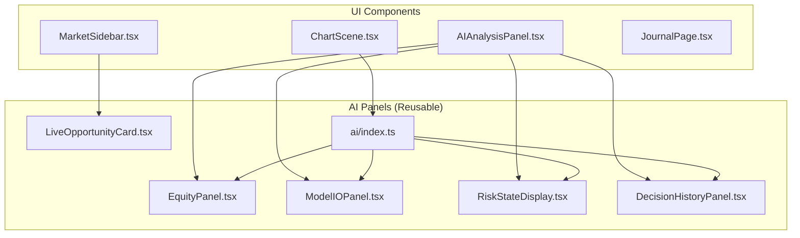
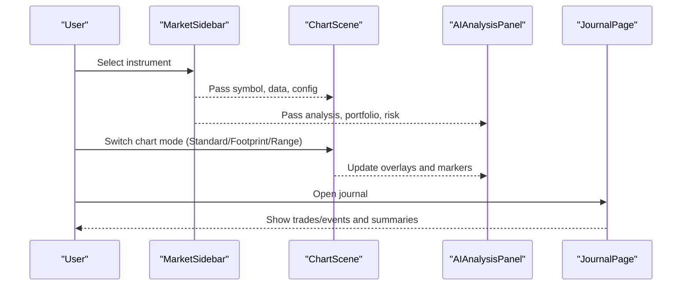
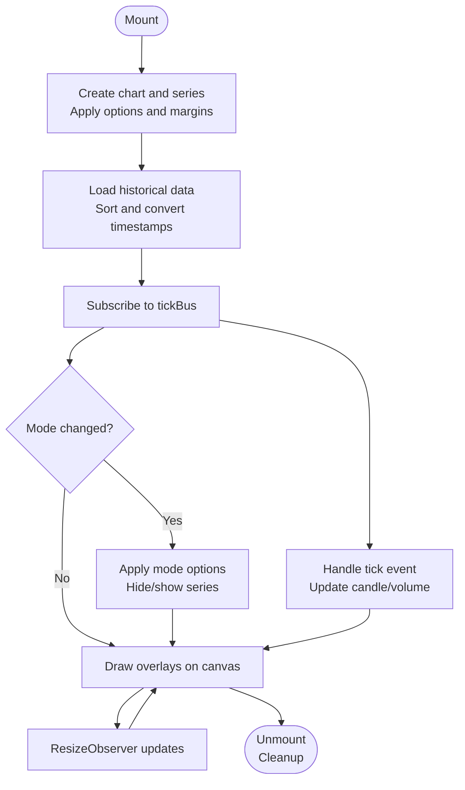
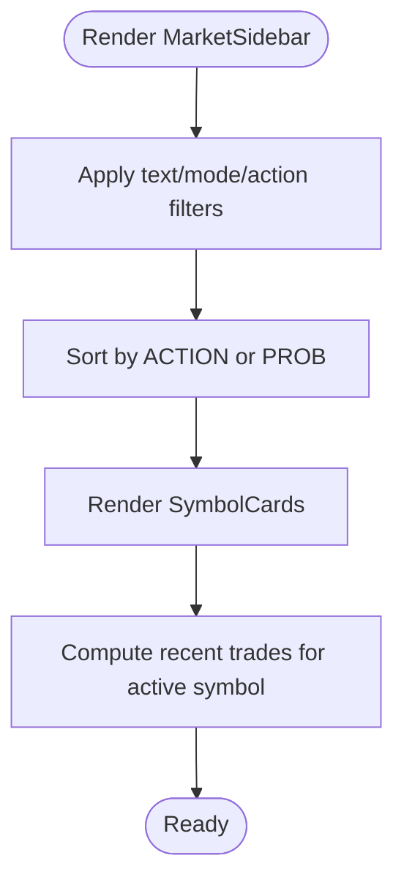
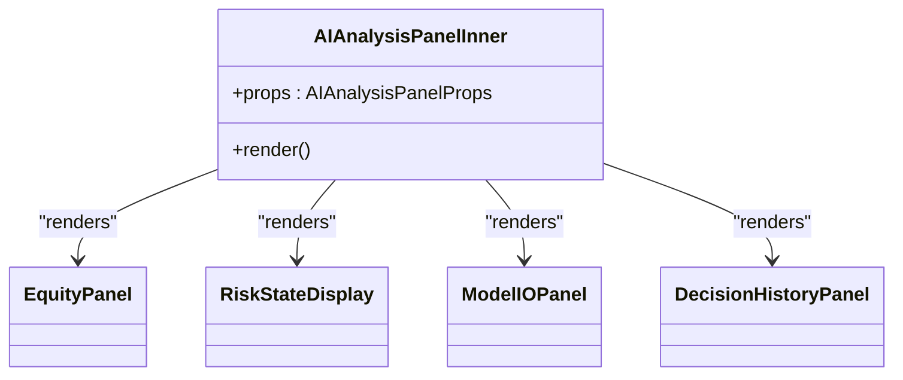
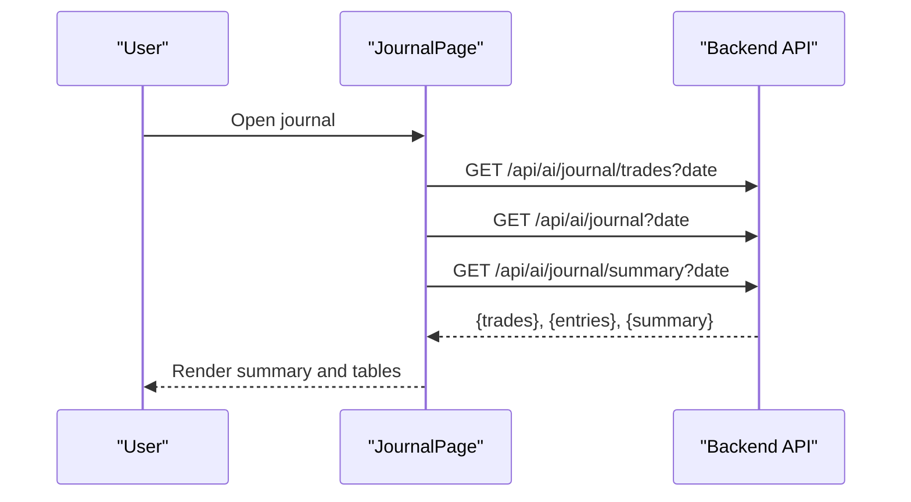
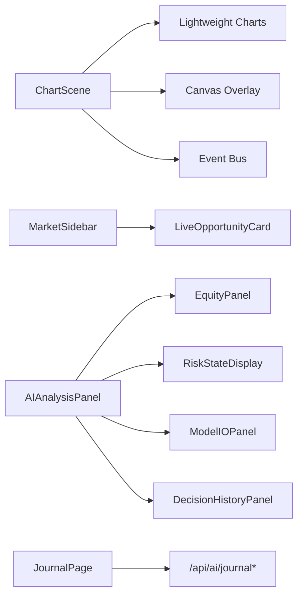

# React Components

<cite>
**Referenced Files in This Document**
- [ChartScene.tsx](file://frontend/components/ChartScene.tsx)
- [MarketSidebar.tsx](file://frontend/components/MarketSidebar.tsx)
- [AIAnalysisPanel.tsx](file://frontend/components/AIAnalysisPanel.tsx)
- [JournalPage.tsx](file://frontend/components/JournalPage.tsx)
- [LiveOpportunityCard.tsx](file://frontend/components/ai/LiveOpportunityCard.tsx)
- [EquityPanel.tsx](file://frontend/components/ai/EquityPanel.tsx)
- [ModelIOPanel.tsx](file://frontend/components/ai/ModelIOPanel.tsx)
- [RiskStateDisplay.tsx](file://frontend/components/ai/RiskStateDisplay.tsx)
- [DecisionHistoryPanel.tsx](file://frontend/components/ai/DecisionHistoryPanel.tsx)
- [index.ts](file://frontend/components/ai/index.ts)
</cite>

## Table of Contents
1. [Introduction](#introduction)
2. [Project Structure](#project-structure)
3. [Core Components](#core-components)
4. [Architecture Overview](#architecture-overview)
5. [Detailed Component Analysis](#detailed-component-analysis)
6. [Dependency Analysis](#dependency-analysis)
7. [Performance Considerations](#performance-considerations)
8. [Troubleshooting Guide](#troubleshooting-guide)
9. [Conclusion](#conclusion)
10. [Appendices](#appendices)

## Introduction
This document describes the GlassyTrade AI React component library used for real-time market visualization, instrument scanning, AI-driven insights, and trade tracking. It covers the major components ChartScene, MarketSidebar, AIAnalysisPanel, and JournalPage, plus reusable AI panels such as LiveOpportunityCard, EquityPanel, ModelIOPanel, and RiskStateDisplay. The guide explains component props, state management patterns, event handling, composition examples, styling and theming, responsive design, lifecycle, error boundaries, and performance optimizations.

## Project Structure
The components are organized under frontend/components with a dedicated ai/ subfolder for reusable AI-focused panels. Each component is a functional React component with TypeScript props and memoization for performance.

**Diagram sources**
- [ChartScene.tsx:1-1514](file://frontend/components/ChartScene.tsx#L1-L1514)
- [MarketSidebar.tsx:1-388](file://frontend/components/MarketSidebar.tsx#L1-L388)
- [AIAnalysisPanel.tsx:1-1039](file://frontend/components/AIAnalysisPanel.tsx#L1-L1039)
- [JournalPage.tsx:1-377](file://frontend/components/JournalPage.tsx#L1-L377)
- [LiveOpportunityCard.tsx:1-94](file://frontend/components/ai/LiveOpportunityCard.tsx#L1-L94)
- [EquityPanel.tsx:1-78](file://frontend/components/ai/EquityPanel.tsx#L1-L78)
- [ModelIOPanel.tsx:1-36](file://frontend/components/ai/ModelIOPanel.tsx#L1-L36)
- [RiskStateDisplay.tsx:1-37](file://frontend/components/ai/RiskStateDisplay.tsx#L1-L37)
- [DecisionHistoryPanel.tsx:1-98](file://frontend/components/ai/DecisionHistoryPanel.tsx#L1-L98)
- [index.ts:1-6](file://frontend/components/ai/index.ts#L1-L6)

**Section sources**
- [ChartScene.tsx:1-1514](file://frontend/components/ChartScene.tsx#L1-L1514)
- [MarketSidebar.tsx:1-388](file://frontend/components/MarketSidebar.tsx#L1-L388)
- [AIAnalysisPanel.tsx:1-1039](file://frontend/components/AIAnalysisPanel.tsx#L1-L1039)
- [JournalPage.tsx:1-377](file://frontend/components/JournalPage.tsx#L1-L377)
- [LiveOpportunityCard.tsx:1-94](file://frontend/components/ai/LiveOpportunityCard.tsx#L1-L94)
- [EquityPanel.tsx:1-78](file://frontend/components/ai/EquityPanel.tsx#L1-L78)
- [ModelIOPanel.tsx:1-36](file://frontend/components/ai/ModelIOPanel.tsx#L1-L36)
- [RiskStateDisplay.tsx:1-37](file://frontend/components/ai/RiskStateDisplay.tsx#L1-L37)
- [DecisionHistoryPanel.tsx:1-98](file://frontend/components/ai/DecisionHistoryPanel.tsx#L1-L98)
- [index.ts:1-6](file://frontend/components/ai/index.ts#L1-L6)

## Core Components
- ChartScene: Real-time interactive chart with candlesticks, overlays, and optional footprint/range modes. Integrates with Lightweight Charts and a canvas overlay for advanced visuals.
- MarketSidebar: Instrument scanner and selector with filtering, sorting, and recent trade history.
- AIAnalysisPanel: Central AI dashboard aggregating GenAI and AMT insights, equity, risk state, and decision history.
- JournalPage: Trade journal with summaries, filters, and event logs.

Reusable AI Panels:
- LiveOpportunityCard: Prominent live opportunity banner with quick navigation to a selected symbol.
- EquityPanel: Portfolio equity, open PnL, session PnL, and partial TP indicators.
- ModelIOPanel: Debugging panel showing prompt and model output.
- RiskStateDisplay: Trading halt warnings and consecutive loss indicators.
- DecisionHistoryPanel: Expandable timeline of AI decisions with export capability.

**Section sources**
- [ChartScene.tsx:18-34](file://frontend/components/ChartScene.tsx#L18-L34)
- [MarketSidebar.tsx:7-11](file://frontend/components/MarketSidebar.tsx#L7-L11)
- [AIAnalysisPanel.tsx:7-18](file://frontend/components/AIAnalysisPanel.tsx#L7-L18)
- [JournalPage.tsx:4-67](file://frontend/components/JournalPage.tsx#L4-L67)
- [LiveOpportunityCard.tsx:5-11](file://frontend/components/ai/LiveOpportunityCard.tsx#L5-L11)
- [EquityPanel.tsx:4-7](file://frontend/components/ai/EquityPanel.tsx#L4-L7)
- [ModelIOPanel.tsx:5-7](file://frontend/components/ai/ModelIOPanel.tsx#L5-L7)
- [RiskStateDisplay.tsx:5-7](file://frontend/components/ai/RiskStateDisplay.tsx#L5-L7)
- [DecisionHistoryPanel.tsx:6-8](file://frontend/components/ai/DecisionHistoryPanel.tsx#L6-L8)

## Architecture Overview
The UI composes ChartScene and MarketSidebar as primary trading screens, with AIAnalysisPanel providing contextual AI insights. JournalPage surfaces historical performance. AI panels are modular and reused across AIAnalysisPanel and MarketSidebar.

**Diagram sources**
- [ChartScene.tsx:117-275](file://frontend/components/ChartScene.tsx#L117-L275)
- [MarketSidebar.tsx:168-387](file://frontend/components/MarketSidebar.tsx#L168-L387)
- [AIAnalysisPanel.tsx:20-1038](file://frontend/components/AIAnalysisPanel.tsx#L20-L1038)
- [JournalPage.tsx:115-233](file://frontend/components/JournalPage.tsx#L115-L233)

## Detailed Component Analysis

### ChartScene
- Purpose: Real-time market visualization with candlesticks, overlays, and optional footprint/range modes.
- Props:
  - data: Historical OHLC bars
  - predictions: Predictive candlesticks overlay
  - config: Chart theme and toggles (bull/bear colors, volume profile, vpMode)
  - activeSignal, positions, closedTrades: Trade markers and price lines
  - aiAnalysis, amtAnalysis: AI overlays and levels
  - mode: Chart mode (STANDARD, FOOTPRINT, RANGE)
  - isHidden: Visibility toggle
  - footprintData, cumulativeDeltas: Footprint overlay inputs
  - tickBus, symbol, rangeBarData: Real-time and range bar data
- State management:
  - Refs for chart instances, series, overlays, and memoized references to avoid redraws
  - useMemo for stable AMT analysis and data references
  - useEffect for initialization, resizing, mode switching, overlay drawing, and realtime updates
- Event handling:
  - Real-time tick bus subscription with defensive updates
  - ResizeObserver for responsive sizing
  - Pan/zoom subscriptions to redraw overlays
- Rendering:
  - Lightweight Charts candlesticks and histogram series
  - Canvas overlay for footprint, volume profile, aggressive prints, and range overlays
  - Price lines for POC/VAH/VAL/HVN/LVN and SL/TP markers
- Lifecycle:
  - Mount: create chart, add series, apply options, load data
  - Update: mode changes, data changes, overlays, markers
  - Unmount: remove listeners, destroy chart
- Error handling:
  - Defensive try/catch around tick updates
  - Safe overlay drawing with try/catch
- Performance:
  - React.memo with custom equality
  - useMemo for stable references
  - Overlay redraws gated by stable AMT analysis and data length
  - Range bar setData/update strategy to avoid losing history

**Diagram sources**
- [ChartScene.tsx:117-275](file://frontend/components/ChartScene.tsx#L117-L275)
- [ChartScene.tsx:277-319](file://frontend/components/ChartScene.tsx#L277-L319)
- [ChartScene.tsx:341-373](file://frontend/components/ChartScene.tsx#L341-L373)
- [ChartScene.tsx:375-425](file://frontend/components/ChartScene.tsx#L375-L425)
- [ChartScene.tsx:1095-1183](file://frontend/components/ChartScene.tsx#L1095-L1183)

**Section sources**
- [ChartScene.tsx:18-34](file://frontend/components/ChartScene.tsx#L18-L34)
- [ChartScene.tsx:117-275](file://frontend/components/ChartScene.tsx#L117-L275)
- [ChartScene.tsx:277-319](file://frontend/components/ChartScene.tsx#L277-L319)
- [ChartScene.tsx:341-373](file://frontend/components/ChartScene.tsx#L341-L373)
- [ChartScene.tsx:375-425](file://frontend/components/ChartScene.tsx#L375-L425)
- [ChartScene.tsx:1095-1183](file://frontend/components/ChartScene.tsx#L1095-L1183)
- [ChartScene.tsx:1495-1514](file://frontend/components/ChartScene.tsx#L1495-L1514)

### MarketSidebar
- Purpose: Scan instruments, filter/sort by market state and AI timing, select active symbol, and show recent closed trades.
- Props:
  - instruments: Record of instrument states
  - activeSymbol: Currently selected symbol
  - onSelect: Callback to switch symbol
- State management:
  - Local state for filters (text, mode, action), sort preference
  - useMemo for filtered and sorted lists
  - useMemo for recent trades of active symbol
- Rendering:
  - Sticky header with filters and column headers
  - Symbol cards with live PnL, open positions, mode badges, timing, and probability
  - Recent trades panel with exit reasons and durations
- Composition:
  - Uses LiveOpportunityCard for live signals
  - Uses SymbolCard (memoized) for list items

**Diagram sources**
- [MarketSidebar.tsx:168-222](file://frontend/components/MarketSidebar.tsx#L168-L222)
- [MarketSidebar.tsx:308-323](file://frontend/components/MarketSidebar.tsx#L308-L323)

**Section sources**
- [MarketSidebar.tsx:7-11](file://frontend/components/MarketSidebar.tsx#L7-L11)
- [MarketSidebar.tsx:168-222](file://frontend/components/MarketSidebar.tsx#L168-L222)
- [MarketSidebar.tsx:308-323](file://frontend/components/MarketSidebar.tsx#L308-L323)

### AIAnalysisPanel
- Purpose: Consolidated AI insights, equity, risk state, and decision history.
- Props:
  - analysis, amtResult, portfolio, riskState, agentDecision, llmHistory, orderBook, depth20Active, overseerAction, overseerReason
- State management:
  - useMemo for current LTP proxy, effective analysis, open PnL, and derived values
  - React.memo wrapper to prevent unnecessary renders
- Rendering:
  - Header with engine status, equity panel, risk state display
  - State and location sections (session/leg, POC/VAH/VAL)
  - Aggression, market metrics, structure, IB/breaks, LVN play, VWAP/context
  - Probability engine and overseer panels
  - Trade plan for open positions and recent closed trades
  - Rule checklist and model I/O footer
  - Decision history panel
- Composition:
  - Uses EquityPanel, RiskStateDisplay, ModelIOPanel, DecisionHistoryPanel

**Diagram sources**
- [AIAnalysisPanel.tsx:20-1038](file://frontend/components/AIAnalysisPanel.tsx#L20-L1038)
- [EquityPanel.tsx:10-77](file://frontend/components/ai/EquityPanel.tsx#L10-L77)
- [RiskStateDisplay.tsx:10-36](file://frontend/components/ai/RiskStateDisplay.tsx#L10-L36)
- [ModelIOPanel.tsx:10-35](file://frontend/components/ai/ModelIOPanel.tsx#L10-L35)
- [DecisionHistoryPanel.tsx:11-97](file://frontend/components/ai/DecisionHistoryPanel.tsx#L11-L97)

**Section sources**
- [AIAnalysisPanel.tsx:7-18](file://frontend/components/AIAnalysisPanel.tsx#L7-L18)
- [AIAnalysisPanel.tsx:20-1038](file://frontend/components/AIAnalysisPanel.tsx#L20-L1038)

### JournalPage
- Purpose: Browse daily trade journal with summaries, filters, and event logs.
- Props:
  - onBack: Callback to navigate back
- State management:
  - Local state for date, tab, summary, trades, entries, loading, filter, hideFlat
  - useEffect to fetch summaries, trades, and events for the selected date
- Rendering:
  - Header with back button and date navigation
  - Summary cards for key metrics
  - Tabbed view: Trades table and Events timeline
  - Filtering by event type and toggling FLAT signals
- API interactions:
  - Fetches /api/ai/journal/trades, /api/ai/journal, and /api/ai/journal/summary

**Diagram sources**
- [JournalPage.tsx:125-136](file://frontend/components/JournalPage.tsx#L125-L136)

**Section sources**
- [JournalPage.tsx:115-233](file://frontend/components/JournalPage.tsx#L115-L233)
- [JournalPage.tsx:236-377](file://frontend/components/JournalPage.tsx#L236-L377)

### Reusable AI Panels

#### LiveOpportunityCard
- Purpose: Prominent live opportunity banner with quick navigation.
- Props:
  - symbol, agentDecision, ltp, onSelect, onClose
- Behavior:
  - Shows scanning state when no ENTER_NOW signal
  - Renders target lock with estimated SL/TP when actionable
  - Calls onSelect to navigate to chart

**Section sources**
- [LiveOpportunityCard.tsx:5-11](file://frontend/components/ai/LiveOpportunityCard.tsx#L5-L11)
- [LiveOpportunityCard.tsx:13-93](file://frontend/components/ai/LiveOpportunityCard.tsx#L13-L93)

#### EquityPanel
- Purpose: Portfolio equity, open PnL, session PnL, and partial TP indicators.
- Props:
  - portfolio, openPnl
- Behavior:
  - Computes session realized PnL and draws progress bar against target/circuit
  - Shows partial TP info for open positions

**Section sources**
- [EquityPanel.tsx:4-7](file://frontend/components/ai/EquityPanel.tsx#L4-L7)
- [EquityPanel.tsx:10-77](file://frontend/components/ai/EquityPanel.tsx#L10-L77)

#### ModelIOPanel
- Purpose: Debugging panel for prompt and model output.
- Props:
  - displayAnalysis
- Behavior:
  - Sanitized display of input prompt and raw output

**Section sources**
- [ModelIOPanel.tsx:5-7](file://frontend/components/ai/ModelIOPanel.tsx#L5-L7)
- [ModelIOPanel.tsx:10-35](file://frontend/components/ai/ModelIOPanel.tsx#L10-L35)

#### RiskStateDisplay
- Purpose: Trading halt warnings and consecutive loss counters.
- Props:
  - riskState
- Behavior:
  - Shows halted warning or consecutive loss/daily PnL

**Section sources**
- [RiskStateDisplay.tsx:5-7](file://frontend/components/ai/RiskStateDisplay.tsx#L5-L7)
- [RiskStateDisplay.tsx:10-36](file://frontend/components/ai/RiskStateDisplay.tsx#L10-L36)

#### DecisionHistoryPanel
- Purpose: Expandable timeline of AI decisions with export capability.
- Props:
  - llmHistory
- Behavior:
  - Detects error states, renders entries with direction/confidence/time
  - Sanitized rationale display

**Section sources**
- [DecisionHistoryPanel.tsx:6-8](file://frontend/components/ai/DecisionHistoryPanel.tsx#L6-L8)
- [DecisionHistoryPanel.tsx:11-97](file://frontend/components/ai/DecisionHistoryPanel.tsx#L11-L97)

## Dependency Analysis
- ChartScene depends on:
  - Lightweight Charts for rendering
  - Canvas overlay for footprint/volume profile/aggressive prints
  - Event bus for real-time ticks
  - AMT and GenAI analysis for overlays and markers
- MarketSidebar depends on:
  - Instruments state and agent decisions for filtering and display
  - LiveOpportunityCard for live signals
- AIAnalysisPanel composes:
  - EquityPanel, RiskStateDisplay, ModelIOPanel, DecisionHistoryPanel
  - Uses sanitized text utilities for LLM outputs
- JournalPage depends on:
  - Backend APIs for trades, events, and summaries

**Diagram sources**
- [ChartScene.tsx:1-14](file://frontend/components/ChartScene.tsx#L1-L14)
- [MarketSidebar.tsx:1-5](file://frontend/components/MarketSidebar.tsx#L1-L5)
- [AIAnalysisPanel.tsx:1-5](file://frontend/components/AIAnalysisPanel.tsx#L1-L5)
- [JournalPage.tsx:125-136](file://frontend/components/JournalPage.tsx#L125-L136)

**Section sources**
- [ChartScene.tsx:1-14](file://frontend/components/ChartScene.tsx#L1-L14)
- [MarketSidebar.tsx:1-5](file://frontend/components/MarketSidebar.tsx#L1-L5)
- [AIAnalysisPanel.tsx:1-5](file://frontend/components/AIAnalysisPanel.tsx#L1-L5)
- [JournalPage.tsx:125-136](file://frontend/components/JournalPage.tsx#L125-L136)

## Performance Considerations
- Memoization:
  - React.memo on ChartScene with custom equality
  - React.memo on AI panels
  - useMemo for stable AMT analysis, data references, derived values
- Rendering optimizations:
  - Overlay redraws gated by stable references
  - Range bar setData/update to preserve history
  - Conditional rendering of expensive overlays
- Event handling:
  - Defensive try/catch around tick updates
  - ResizeObserver cleanup
- State:
  - Local state kept minimal (filters, tabs, date)
  - Memoized computations for derived data

**Section sources**
- [ChartScene.tsx:1495-1514](file://frontend/components/ChartScene.tsx#L1495-L1514)
- [AIAnalysisPanel.tsx:1036-1038](file://frontend/components/AIAnalysisPanel.tsx#L1036-L1038)
- [EquityPanel.tsx:10-77](file://frontend/components/ai/EquityPanel.tsx#L10-L77)
- [DecisionHistoryPanel.tsx:11-97](file://frontend/components/ai/DecisionHistoryPanel.tsx#L11-L97)

## Troubleshooting Guide
- ChartScene overlay errors:
  - Overlay drawing wrapped in try/catch; check console for overlay draw errors
  - Ensure mode compatibility (RANGE blocks standard tick updates)
- Stale/out-of-order ticks:
  - Try/catch around tick updates; log ignored updates
- Footprint/range rendering:
  - Verify footprintData and rangeBarData availability
  - Confirm mode-specific series visibility
- MarketSidebar filters:
  - Ensure instruments state contains expected keys and fields
  - Check dead market detection logic
- JournalPage:
  - Verify API endpoints and response shapes
  - Handle empty arrays gracefully

**Section sources**
- [ChartScene.tsx:409-412](file://frontend/components/ChartScene.tsx#L409-L412)
- [ChartScene.tsx:296-312](file://frontend/components/ChartScene.tsx#L296-L312)
- [MarketSidebar.tsx:188-222](file://frontend/components/MarketSidebar.tsx#L188-L222)
- [JournalPage.tsx:125-136](file://frontend/components/JournalPage.tsx#L125-L136)

## Conclusion
The GlassyTrade AI React component library provides a cohesive, high-performance trading interface. ChartScene delivers advanced real-time visualization, MarketSidebar enables efficient instrument scanning, AIAnalysisPanel consolidates AI insights, and JournalPage offers comprehensive trade tracking. Reusable AI panels promote consistency and maintainability. The components leverage memoization, defensive updates, and modular composition to achieve responsiveness and reliability.

## Appendices

### Component Composition Examples
- Integrating ChartScene with MarketSidebar:
  - Pass selected symbol, data, config, and analysis from MarketSidebar to ChartScene
  - Use tickBus for real-time updates
- Using AIAnalysisPanel:
  - Provide analysis, amtResult, portfolio, riskState, agentDecision, llmHistory
  - Compose with EquityPanel, RiskStateDisplay, ModelIOPanel, DecisionHistoryPanel
- JournalPage usage:
  - Navigate to JournalPage and pass onBack handler
  - Use date picker and tabs to browse trades and events

**Section sources**
- [ChartScene.tsx:51-67](file://frontend/components/ChartScene.tsx#L51-L67)
- [MarketSidebar.tsx:168-172](file://frontend/components/MarketSidebar.tsx#L168-L172)
- [AIAnalysisPanel.tsx:20-1038](file://frontend/components/AIAnalysisPanel.tsx#L20-L1038)
- [JournalPage.tsx:115-233](file://frontend/components/JournalPage.tsx#L115-L233)

### Theming and Responsive Design
- Theming:
  - Tailwind classes define dark theme, borders, and gradients
  - Color tokens for bullish/bearish and status indicators
- Responsive:
  - Flexbox and grid layouts adapt to container sizes
  - Sticky headers and scrollable areas for long lists
  - Canvas overlay resizes with ResizeObserver

**Section sources**
- [ChartScene.tsx:120-144](file://frontend/components/ChartScene.tsx#L120-L144)
- [MarketSidebar.tsx:234-383](file://frontend/components/MarketSidebar.tsx#L234-L383)
- [AIAnalysisPanel.tsx:106-185](file://frontend/components/AIAnalysisPanel.tsx#L106-L185)
- [JournalPage.tsx:147-232](file://frontend/components/JournalPage.tsx#L147-L232)