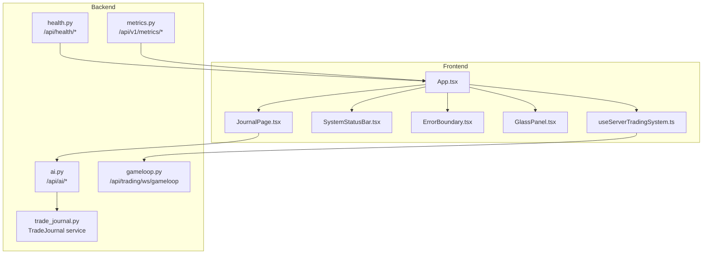
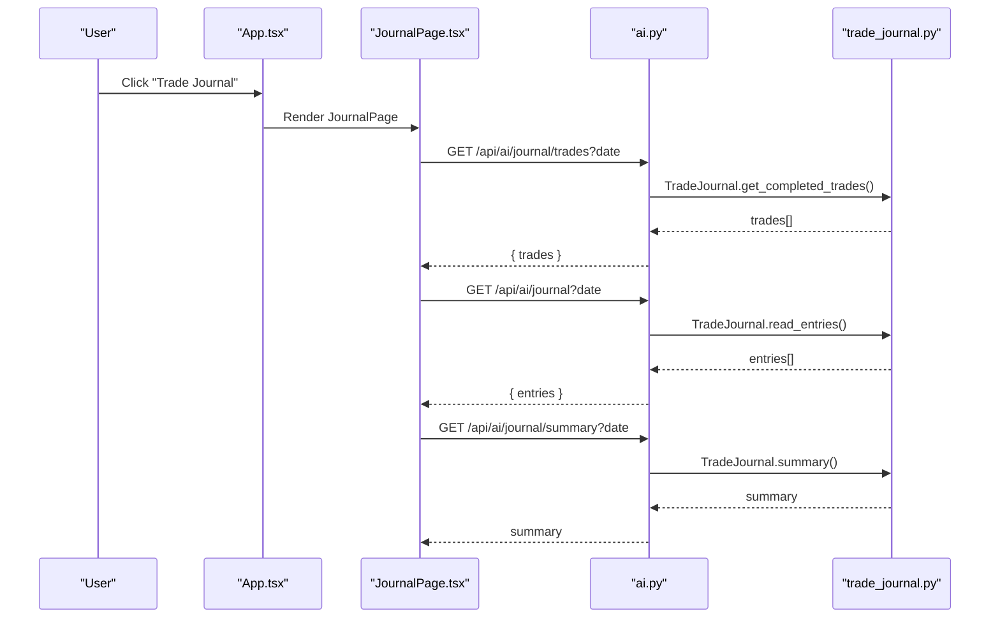
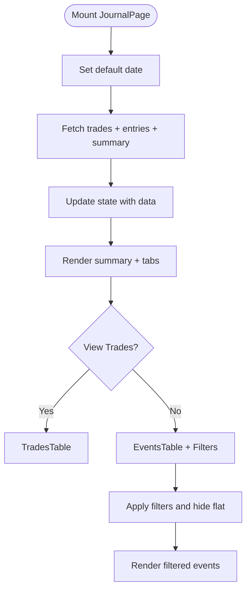
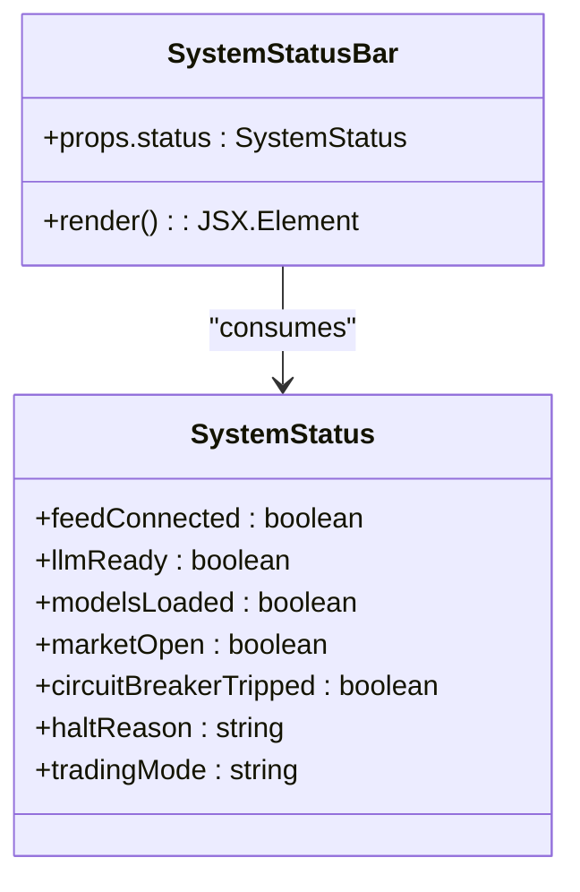
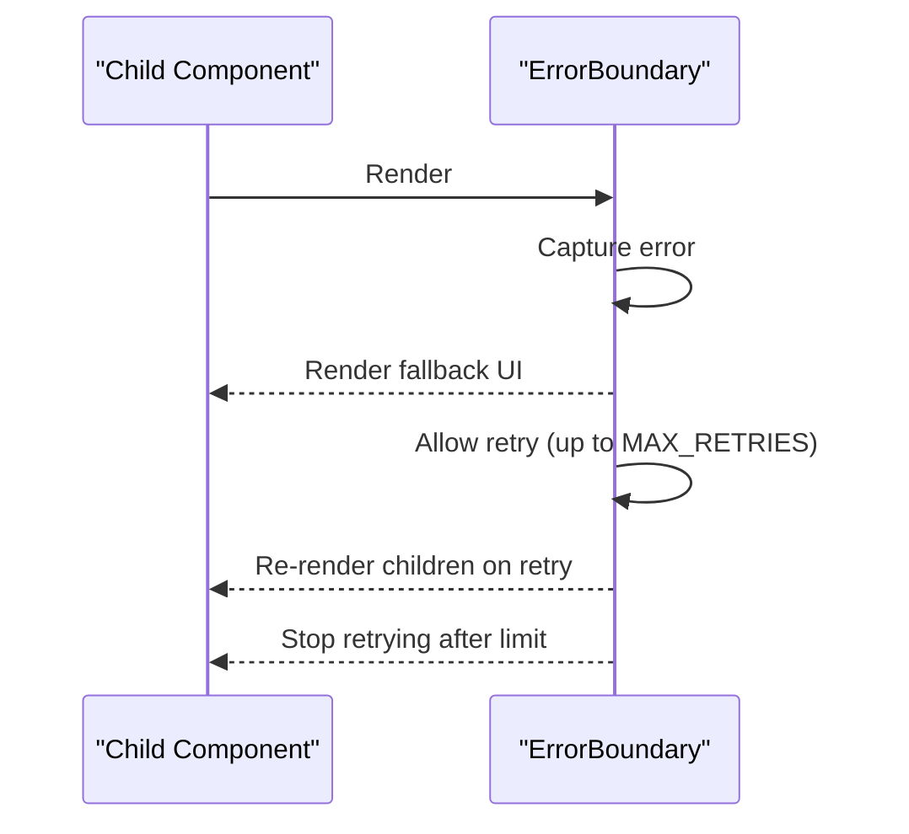
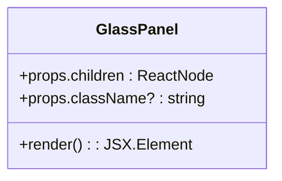
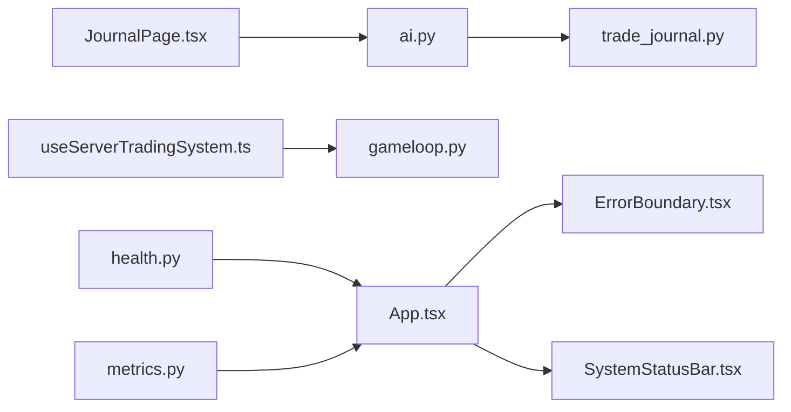

# Trade Journal and System Components

<cite>
**Referenced Files in This Document**
- [JournalPage.tsx](file://frontend/components/JournalPage.tsx)
- [SystemStatusBar.tsx](file://frontend/components/SystemStatusBar.tsx)
- [ErrorBoundary.tsx](file://frontend/components/ErrorBoundary.tsx)
- [GlassPanel.tsx](file://frontend/components/GlassPanel.tsx)
- [ai.py](file://backend/app/api/routers/ai.py)
- [trade_journal.py](file://backend/app/application/services/trade_journal.py)
- [health.py](file://backend/app/api/routers/health.py)
- [metrics.py](file://backend/app/api/routers/metrics.py)
- [gameloop.py](file://backend/app/api/websocket/gameloop.py)
- [useServerTradingSystem.ts](file://frontend/hooks/useServerTradingSystem.ts)
- [App.tsx](file://frontend/App.tsx)
</cite>

## Table of Contents
1. [Introduction](#introduction)
2. [Project Structure](#project-structure)
3. [Core Components](#core-components)
4. [Architecture Overview](#architecture-overview)
5. [Detailed Component Analysis](#detailed-component-analysis)
6. [Dependency Analysis](#dependency-analysis)
7. [Performance Considerations](#performance-considerations)
8. [Troubleshooting Guide](#troubleshooting-guide)
9. [Conclusion](#conclusion)

## Introduction
This document provides comprehensive technical and practical documentation for the trade journal and system monitoring components in the GlassyTrade AI platform. It covers:
- JournalPage: Trade history management, performance analysis, and trade review capabilities
- SystemStatusBar: System health monitoring, connection status, and operational metrics
- ErrorBoundary: Fault tolerance and recovery mechanisms
- GlassPanel: UI composition and styling patterns

It explains component usage, data flow, state management, backend integration, composition patterns, styling approaches, and user experience considerations.

## Project Structure
The components are organized across the frontend and backend:
- Frontend components: JournalPage, SystemStatusBar, ErrorBoundary, GlassPanel
- Backend APIs: AI journal endpoints, health and metrics endpoints, WebSocket gameloop
- Frontend hooks and app integration: useServerTradingSystem, App routing and error boundaries

**Diagram sources**
- [App.tsx:16-127](file://frontend/App.tsx#L16-L127)
- [JournalPage.tsx:115-136](file://frontend/components/JournalPage.tsx#L115-L136)
- [SystemStatusBar.tsx:102-146](file://frontend/components/SystemStatusBar.tsx#L102-L146)
- [ErrorBoundary.tsx:13-56](file://frontend/components/ErrorBoundary.tsx#L13-L56)
- [GlassPanel.tsx:8-30](file://frontend/components/GlassPanel.tsx#L8-L30)
- [useServerTradingSystem.ts:59-152](file://frontend/hooks/useServerTradingSystem.ts#L59-L152)
- [ai.py:181-232](file://backend/app/api/routers/ai.py#L181-L232)
- [trade_journal.py:542-561](file://backend/app/application/services/trade_journal.py#L542-L561)
- [health.py:26-78](file://backend/app/api/routers/health.py#L26-L78)
- [metrics.py:30-56](file://backend/app/api/routers/metrics.py#L30-L56)
- [gameloop.py:112-196](file://backend/app/api/websocket/gameloop.py#L112-L196)

**Section sources**
- [App.tsx:16-127](file://frontend/App.tsx#L16-L127)
- [JournalPage.tsx:115-136](file://frontend/components/JournalPage.tsx#L115-L136)
- [SystemStatusBar.tsx:102-146](file://frontend/components/SystemStatusBar.tsx#L102-L146)
- [ErrorBoundary.tsx:13-56](file://frontend/components/ErrorBoundary.tsx#L13-L56)
- [GlassPanel.tsx:8-30](file://frontend/components/GlassPanel.tsx#L8-L30)
- [useServerTradingSystem.ts:59-152](file://frontend/hooks/useServerTradingSystem.ts#L59-L152)
- [ai.py:181-232](file://backend/app/api/routers/ai.py#L181-L232)
- [trade_journal.py:542-561](file://backend/app/application/services/trade_journal.py#L542-L561)
- [health.py:26-78](file://backend/app/api/routers/health.py#L26-L78)
- [metrics.py:30-56](file://backend/app/api/routers/metrics.py#L30-L56)
- [gameloop.py:112-196](file://backend/app/api/websocket/gameloop.py#L112-L196)

## Core Components
- JournalPage: Fetches and displays trade journal data, supports date navigation, filtering, and tabbed views for completed trades and event logs.
- SystemStatusBar: Displays real-time system health indicators, trading mode, circuit breaker status, and market phase timers.
- ErrorBoundary: Provides generic error handling with retry logic and fallback UI for child components.
- GlassPanel: A reusable UI container with glassmorphism styling for panel composition.

**Section sources**
- [JournalPage.tsx:115-234](file://frontend/components/JournalPage.tsx#L115-L234)
- [SystemStatusBar.tsx:3-149](file://frontend/components/SystemStatusBar.tsx#L3-L149)
- [ErrorBoundary.tsx:3-60](file://frontend/components/ErrorBoundary.tsx#L3-L60)
- [GlassPanel.tsx:3-33](file://frontend/components/GlassPanel.tsx#L3-L33)

## Architecture Overview
The system integrates frontend components with backend services through REST and WebSocket channels:
- JournalPage queries backend endpoints for trades, entries, and summaries.
- useServerTradingSystem manages WebSocket connectivity, heartbeat, and state updates.
- Backend exposes health, metrics, and trading endpoints consumed by the frontend.
- ErrorBoundary wraps critical UI areas to improve resilience.

**Diagram sources**
- [App.tsx:103-105](file://frontend/App.tsx#L103-L105)
- [JournalPage.tsx:125-136](file://frontend/components/JournalPage.tsx#L125-L136)
- [ai.py:181-206](file://backend/app/api/routers/ai.py#L181-L206)
- [trade_journal.py:575-586](file://backend/app/application/services/trade_journal.py#L575-L586)

## Detailed Component Analysis

### JournalPage: Trade Tracking and Analysis
- Responsibilities:
  - Fetches and displays completed trades and event logs for a selected date
  - Provides summary statistics and filters for event visibility
  - Supports tabbed views: Trades and All Events
  - Formats durations, symbols, and numeric values consistently
- Data flow:
  - Uses useEffect to fetch three endpoints concurrently on date change
  - Filters events by type and hides flat signals when configured
  - Renders TradesTable and EventsTable with color-coded statuses
- Backend integration:
  - Calls /api/ai/journal/trades, /api/ai/journal, and /api/ai/journal/summary
  - Backed by TradeJournal service that reads JSONL logs and computes summaries
- UX considerations:
  - Loading states, empty state messaging, and responsive tables
  - Color-coded exit reasons and PnL for quick scanning

**Diagram sources**
- [JournalPage.tsx:115-234](file://frontend/components/JournalPage.tsx#L115-L234)
- [ai.py:181-206](file://backend/app/api/routers/ai.py#L181-L206)
- [trade_journal.py:575-586](file://backend/app/application/services/trade_journal.py#L575-L586)

**Section sources**
- [JournalPage.tsx:115-234](file://frontend/components/JournalPage.tsx#L115-L234)
- [ai.py:181-206](file://backend/app/api/routers/ai.py#L181-L206)
- [trade_journal.py:542-561](file://backend/app/application/services/trade_journal.py#L542-L561)

### SystemStatusBar: System Health Monitoring
- Responsibilities:
  - Displays connection and readiness indicators for feed, LLM, models, and market
  - Shows trading mode (LIVE vs PAPER) with color-coded badges
  - Highlights circuit breaker tripping with halt reason
  - Provides market phase timer with progress bar and countdown
- Implementation:
  - Uses a local timer hook to compute phase, label, and progress
  - Renders colored dots for each health indicator
  - Shows market phase banner and progress bar synchronized to market schedule
- UX considerations:
  - Minimal, non-intrusive status bar suitable for top-of-screen placement
  - Clear visual feedback for critical states (e.g., circuit breaker)

**Diagram sources**
- [SystemStatusBar.tsx:3-16](file://frontend/components/SystemStatusBar.tsx#L3-L16)
- [SystemStatusBar.tsx:102-146](file://frontend/components/SystemStatusBar.tsx#L102-L146)

**Section sources**
- [SystemStatusBar.tsx:3-149](file://frontend/components/SystemStatusBar.tsx#L3-L149)

### ErrorBoundary: Fault Tolerance and Recovery
- Responsibilities:
  - Catches rendering errors in child components
  - Displays a friendly fallback UI with error message and retry button
  - Limits retries to a maximum count to avoid infinite loops
- Behavior:
  - Logs error and component name to console
  - Enables retry until max retries reached
  - After max retries, instructs user to reload the page
- Composition:
  - Wrapped around critical UI areas (Journal, Chart, Sidebar, Analysis)
  - Accepts optional custom fallback and component name

**Diagram sources**
- [ErrorBoundary.tsx:13-56](file://frontend/components/ErrorBoundary.tsx#L13-L56)
- [App.tsx:104-105](file://frontend/App.tsx#L104-L105)
- [App.tsx:134-140](file://frontend/App.tsx#L134-L140)
- [App.tsx:152-152](file://frontend/App.tsx#L152-L152)
- [App.tsx:373-386](file://frontend/App.tsx#L373-L386)

**Section sources**
- [ErrorBoundary.tsx:3-60](file://frontend/components/ErrorBoundary.tsx#L3-L60)
- [App.tsx:104-105](file://frontend/App.tsx#L104-L105)
- [App.tsx:134-140](file://frontend/App.tsx#L134-L140)
- [App.tsx:152-152](file://frontend/App.tsx#L152-L152)
- [App.tsx:373-386](file://frontend/App.tsx#L373-L386)

### GlassPanel: UI Composition and Styling
- Responsibilities:
  - Provides a reusable glassmorphic container for panels
  - Applies backdrop blur, borders, rounded corners, and subtle gradients
  - Supports custom className extension
- Usage:
  - Wraps sidebar content, overlays, and analysis panels
  - Ensures consistent visual language across the dashboard

**Diagram sources**
- [GlassPanel.tsx:3-6](file://frontend/components/GlassPanel.tsx#L3-L6)
- [GlassPanel.tsx:8-30](file://frontend/components/GlassPanel.tsx#L8-L30)

**Section sources**
- [GlassPanel.tsx:3-33](file://frontend/components/GlassPanel.tsx#L3-L33)

## Dependency Analysis
- Frontend-to-backend dependencies:
  - JournalPage depends on ai.py endpoints backed by TradeJournal service
  - useServerTradingSystem depends on WebSocket gameloop for live state streaming
  - System status and metrics are exposed via health.py and metrics.py
- Component coupling:
  - App.tsx composes ErrorBoundary around major UI regions
  - JournalPage is isolated from backend concerns via HTTP endpoints
- External integrations:
  - Backend uses service graph for dependency resolution and metrics collection

**Diagram sources**
- [JournalPage.tsx:125-136](file://frontend/components/JournalPage.tsx#L125-L136)
- [ai.py:181-206](file://backend/app/api/routers/ai.py#L181-L206)
- [trade_journal.py:542-561](file://backend/app/application/services/trade_journal.py#L542-L561)
- [useServerTradingSystem.ts:509-570](file://frontend/hooks/useServerTradingSystem.ts#L509-L570)
- [gameloop.py:112-196](file://backend/app/api/websocket/gameloop.py#L112-L196)
- [App.tsx:103-105](file://frontend/App.tsx#L103-L105)
- [health.py:26-78](file://backend/app/api/routers/health.py#L26-L78)
- [metrics.py:30-56](file://backend/app/api/routers/metrics.py#L30-L56)

**Section sources**
- [JournalPage.tsx:125-136](file://frontend/components/JournalPage.tsx#L125-L136)
- [ai.py:181-206](file://backend/app/api/routers/ai.py#L181-L206)
- [trade_journal.py:542-561](file://backend/app/application/services/trade_journal.py#L542-L561)
- [useServerTradingSystem.ts:509-570](file://frontend/hooks/useServerTradingSystem.ts#L509-L570)
- [gameloop.py:112-196](file://backend/app/api/websocket/gameloop.py#L112-L196)
- [App.tsx:103-105](file://frontend/App.tsx#L103-L105)
- [health.py:26-78](file://backend/app/api/routers/health.py#L26-L78)
- [metrics.py:30-56](file://backend/app/api/routers/metrics.py#L30-L56)

## Performance Considerations
- JournalPage:
  - Concurrent fetches reduce perceived latency for date navigation
  - Filtering and hiding flat signals minimize DOM rendering for large event sets
- useServerTradingSystem:
  - Batched React updates via requestAnimationFrame reduce render thrash
  - Delta compression in WebSocket messages minimizes bandwidth and CPU usage
  - Heartbeat mechanism detects dead connections proactively
- Backend:
  - TradeJournal stores entries in JSONL files for efficient reads and summaries
  - Metrics endpoints expose gate rejection and latency percentiles for observability

[No sources needed since this section provides general guidance]

## Troubleshooting Guide
- JournalPage shows empty data:
  - Verify backend endpoints are reachable and TradeJournal has entries for the selected date
  - Confirm date selection and network connectivity
- ErrorBoundary fallback appears:
  - Inspect console for error logs emitted by ErrorBoundary
  - Retry to recover from transient failures; otherwise reload the page
- Connection issues:
  - useServerTradingSystem manages reconnection with exponential backoff
  - Heartbeat pings and timeouts help diagnose dead connections
- System status anomalies:
  - health.py provides system health checks and overall status
  - metrics.py exposes gate rejection and latency metrics for diagnostics

**Section sources**
- [ErrorBoundary.tsx:20-22](file://frontend/components/ErrorBoundary.tsx#L20-L22)
- [useServerTradingSystem.ts:536-545](file://frontend/hooks/useServerTradingSystem.ts#L536-L545)
- [health.py:26-78](file://backend/app/api/routers/health.py#L26-L78)
- [metrics.py:30-56](file://backend/app/api/routers/metrics.py#L30-L56)

## Conclusion
The trade journal and system monitoring components form a cohesive monitoring and analysis layer:
- JournalPage delivers actionable trade insights with robust data retrieval and filtering
- SystemStatusBar provides clear, real-time system health and market phase awareness
- ErrorBoundary improves resilience by containing rendering errors and enabling recovery
- GlassPanel standardizes glassmorphic UI composition across the application

These components integrate tightly with backend services through REST and WebSocket channels, ensuring a responsive, observable, and user-friendly trading experience.