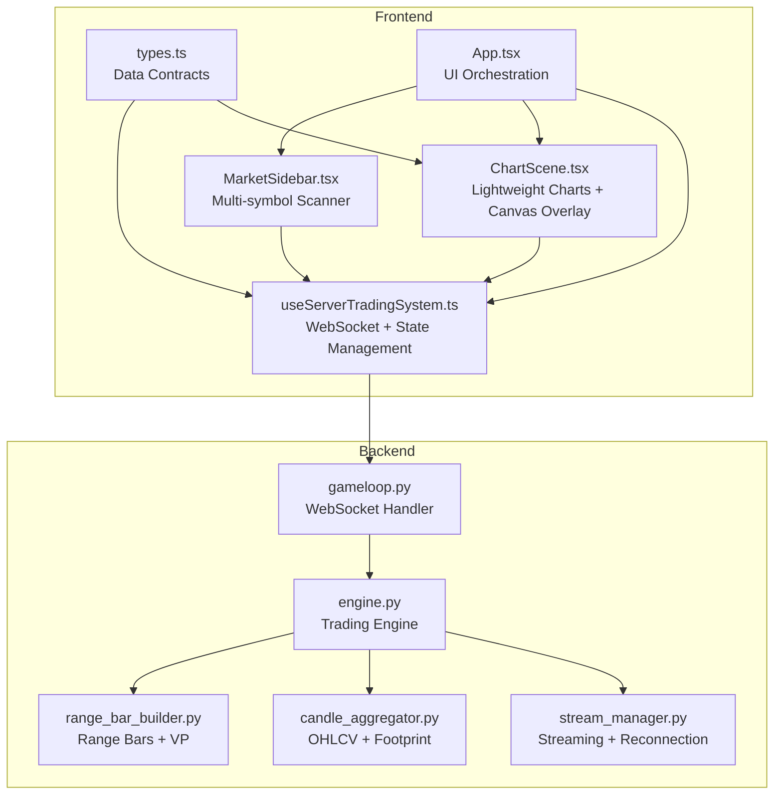
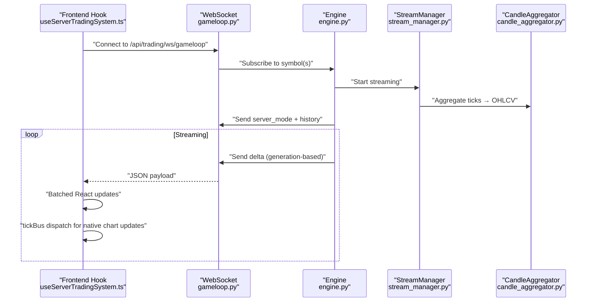
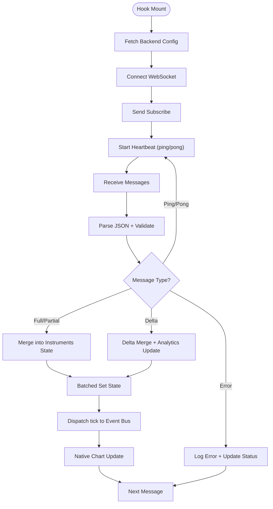
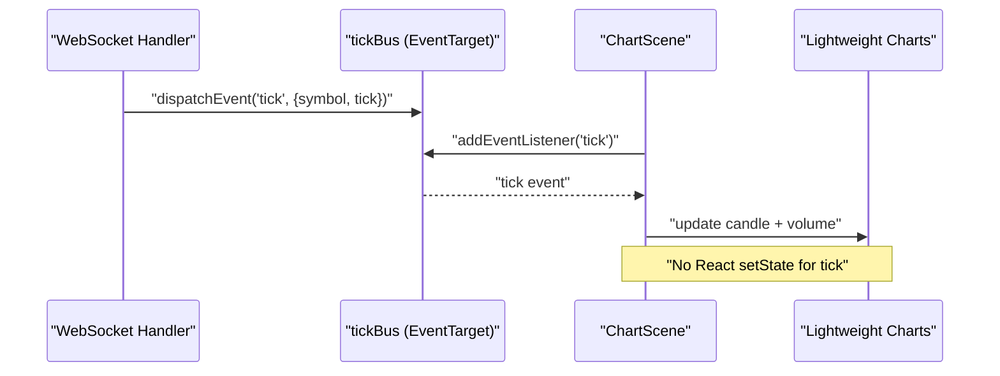
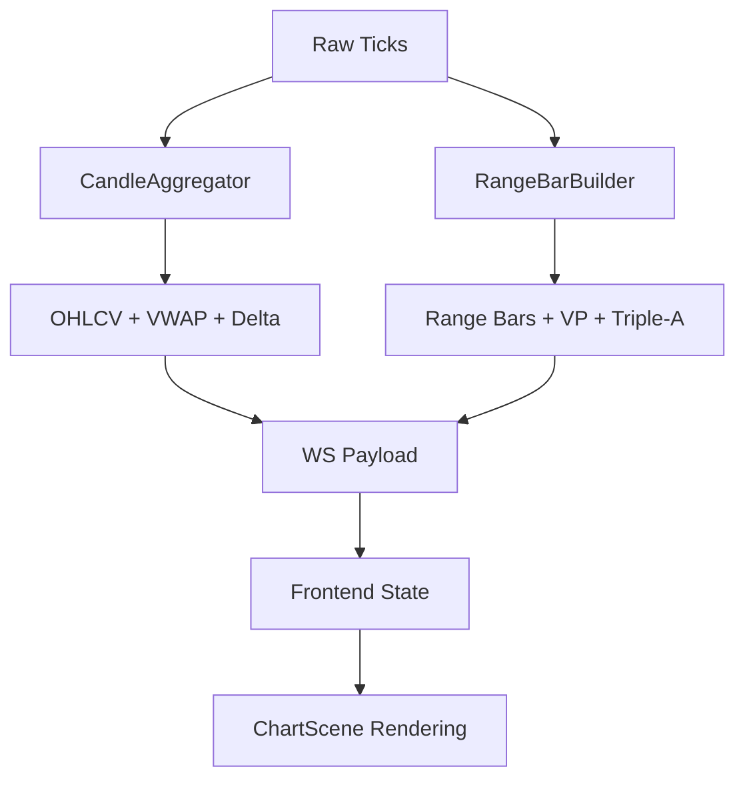
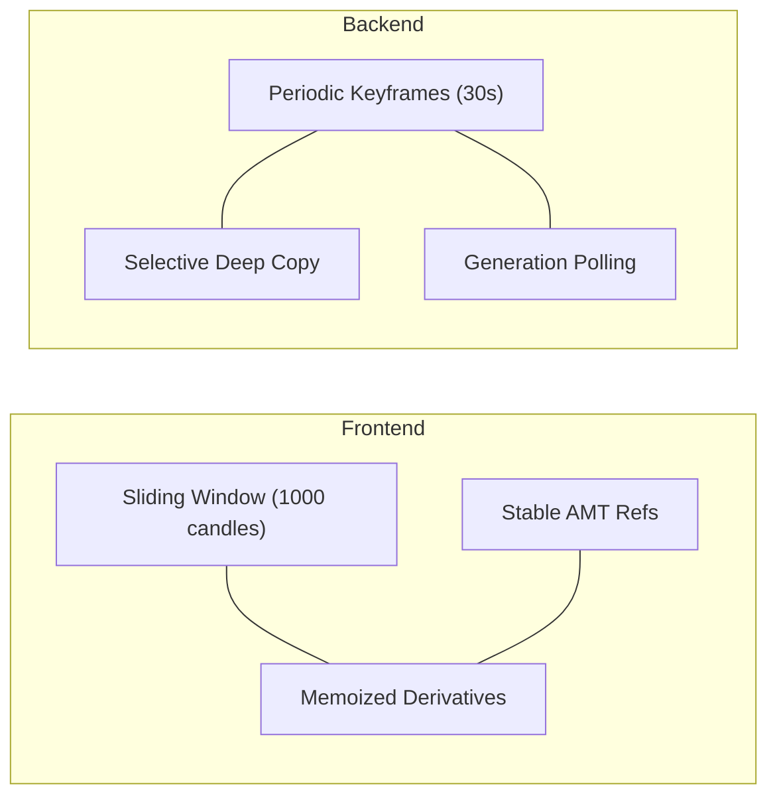
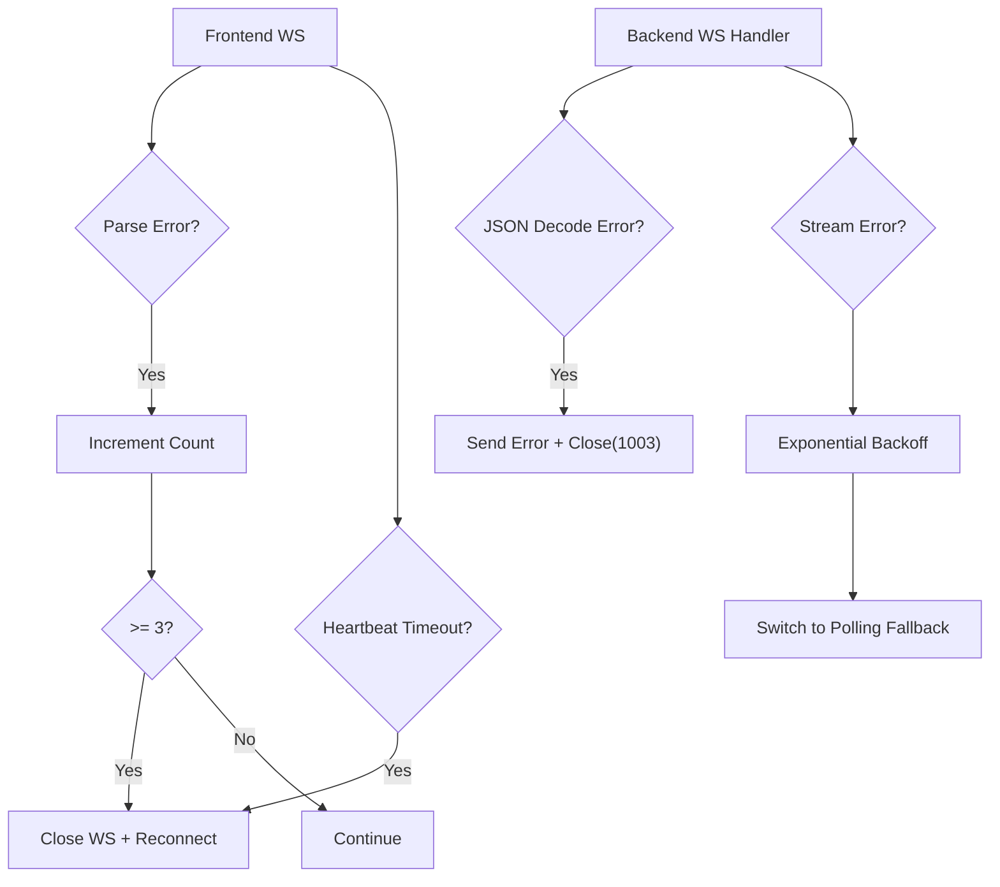
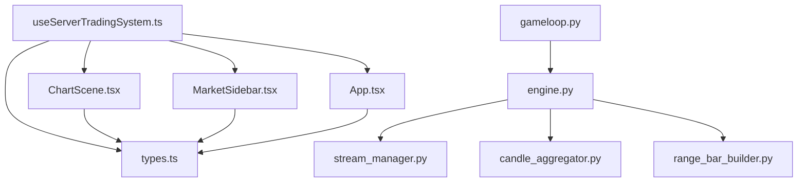

# Real-Time Data Handling

<cite>
**Referenced Files in This Document**
- [useServerTradingSystem.ts](file://frontend/hooks/useServerTradingSystem.ts)
- [types.ts](file://frontend/types.ts)
- [ChartScene.tsx](file://frontend/components/ChartScene.tsx)
- [MarketSidebar.tsx](file://frontend/components/MarketSidebar.tsx)
- [App.tsx](file://frontend/App.tsx)
- [constants.ts](file://frontend/constants.ts)
- [ErrorBoundary.tsx](file://frontend/components/ErrorBoundary.tsx)
- [gameloop.py](file://backend/app/api/websocket/gameloop.py)
- [stream_manager.py](file://backend/app/application/stream_manager.py)
- [engine.py](file://backend/app/application/engine.py)
- [candle_aggregator.py](file://backend/app/application/candle_aggregator.py)
- [range_bar_builder.py](file://backend/app/application/range_bar_builder.py)
</cite>

## Table of Contents
1. [Introduction](#introduction)
2. [Project Structure](#project-structure)
3. [Core Components](#core-components)
4. [Architecture Overview](#architecture-overview)
5. [Detailed Component Analysis](#detailed-component-analysis)
6. [Dependency Analysis](#dependency-analysis)
7. [Performance Considerations](#performance-considerations)
8. [Troubleshooting Guide](#troubleshooting-guide)
9. [Conclusion](#conclusion)

## Introduction
This document explains the real-time data handling system powering the GlassyTrade AI frontend. It covers WebSocket integration patterns, the server-driven streaming architecture, real-time state updates, the tickBus event system, data sanitization, and performance optimizations. It also documents data transformation pipelines, caching strategies, memory management for large datasets, and robust error handling for network issues and data validation.

## Project Structure
The real-time system spans three layers:
- Frontend React application with a dedicated hook for WebSocket orchestration and state management
- Lightweight Charts-based visualization components that consume real-time updates via an event bus
- Backend trading engine that aggregates market data, computes analytics, and streams deltas to clients

**Diagram sources**
- [useServerTradingSystem.ts:59-654](file://frontend/hooks/useServerTradingSystem.ts#L59-L654)
- [ChartScene.tsx:1-1514](file://frontend/components/ChartScene.tsx#L1-L1514)
- [MarketSidebar.tsx:1-388](file://frontend/components/MarketSidebar.tsx#L1-L388)
- [App.tsx:1-395](file://frontend/App.tsx#L1-L395)
- [types.ts:1-376](file://frontend/types.ts#L1-L376)
- [gameloop.py:112-356](file://backend/app/api/websocket/gameloop.py#L112-L356)
- [engine.py:59-200](file://backend/app/application/engine.py#L59-L200)
- [stream_manager.py:32-304](file://backend/app/application/stream_manager.py#L32-L304)
- [candle_aggregator.py:73-200](file://backend/app/application/candle_aggregator.py#L73-L200)
- [range_bar_builder.py:74-200](file://backend/app/application/range_bar_builder.py#L74-L200)

**Section sources**
- [useServerTradingSystem.ts:59-654](file://frontend/hooks/useServerTradingSystem.ts#L59-L654)
- [ChartScene.tsx:1-1514](file://frontend/components/ChartScene.tsx#L1-L1514)
- [MarketSidebar.tsx:1-388](file://frontend/components/MarketSidebar.tsx#L1-L388)
- [App.tsx:1-395](file://frontend/App.tsx#L1-L395)
- [types.ts:1-376](file://frontend/types.ts#L1-L376)
- [gameloop.py:112-356](file://backend/app/api/websocket/gameloop.py#L112-L356)
- [engine.py:59-200](file://backend/app/application/engine.py#L59-L200)
- [stream_manager.py:32-304](file://backend/app/application/stream_manager.py#L32-L304)
- [candle_aggregator.py:73-200](file://backend/app/application/candle_aggregator.py#L73-L200)
- [range_bar_builder.py:74-200](file://backend/app/application/range_bar_builder.py#L74-L200)

## Core Components
- useServerTradingSystem: Central hook orchestrating WebSocket lifecycle, delta compression, batched React updates, heartbeat, and subscription debouncing. It exposes a tickBus EventTarget for high-frequency updates outside React renders.
- ChartScene: Renders multiple chart instances (Standard, Footprint, Range) and draws overlays using canvas. It listens to tickBus for native Lightweight Charts updates and stabilizes expensive overlays.
- MarketSidebar: Multi-symbol scanner with filtering, sorting, and live position indicators.
- Backend gameloop: Server-driven WebSocket handler that streams full snapshots and subsequent deltas, with generation-based polling and periodic keyframes.
- Engine: Standalone trading engine that seeds history, aggregates ticks, builds range bars, and notifies WebSocket viewers.
- StreamManager: Manages dual-stream (full + depth 20) and polling fallback, with reconnection and staleness detection.
- CandleAggregator: Builds OHLCV, VWAP, and footprint data from ticks with contextual caps and delta computation.
- RangeBarBuilder: Constructs price-movement-based bars and computes volume profiles and Triple-A patterns.

**Section sources**
- [useServerTradingSystem.ts:59-654](file://frontend/hooks/useServerTradingSystem.ts#L59-L654)
- [ChartScene.tsx:1-1514](file://frontend/components/ChartScene.tsx#L1-L1514)
- [MarketSidebar.tsx:1-388](file://frontend/components/MarketSidebar.tsx#L1-L388)
- [gameloop.py:112-356](file://backend/app/api/websocket/gameloop.py#L112-L356)
- [engine.py:59-200](file://backend/app/application/engine.py#L59-L200)
- [stream_manager.py:32-304](file://backend/app/application/stream_manager.py#L32-L304)
- [candle_aggregator.py:73-200](file://backend/app/application/candle_aggregator.py#L73-L200)
- [range_bar_builder.py:74-200](file://backend/app/application/range_bar_builder.py#L74-L200)

## Architecture Overview
The system follows a server-driven model:
- Backend starts the engine and continuously streams state to all connected WebSocket clients.
- Frontend connects to the WebSocket endpoint, receives configuration, history, and periodic deltas.
- Frontend batches state updates and uses an event bus for tick delivery to the chart, minimizing React re-renders.
- Backend performs delta compression and periodically sends full keyframes to recover from desynchronization.

**Diagram sources**
- [useServerTradingSystem.ts:509-570](file://frontend/hooks/useServerTradingSystem.ts#L509-L570)
- [gameloop.py:198-337](file://backend/app/api/websocket/gameloop.py#L198-L337)
- [engine.py:131-176](file://backend/app/application/engine.py#L131-L176)
- [stream_manager.py:135-289](file://backend/app/application/stream_manager.py#L135-L289)
- [candle_aggregator.py:114-200](file://backend/app/application/candle_aggregator.py#L114-L200)

## Detailed Component Analysis

### Frontend WebSocket Integration and State Management
- Connection lifecycle: Establishes WebSocket to backend, sends initial subscribe, manages reconnect with exponential backoff, and heartbeat via ping/pong.
- Delta compression: Receives server-side deltas and merges only changed fields into existing state, reducing payload size and UI churn.
- Batched updates: Uses requestAnimationFrame to coalesce multiple incoming messages into a single React render per frame.
- Generation-based subscription: Debounces rapid symbol switches and invalidates stale subscribe messages to prevent race conditions.
- Error handling: Parses JSON safely, tracks consecutive parse errors, and triggers reconnection to recover from desync.

**Diagram sources**
- [useServerTradingSystem.ts:111-152](file://frontend/hooks/useServerTradingSystem.ts#L111-L152)
- [useServerTradingSystem.ts:509-570](file://frontend/hooks/useServerTradingSystem.ts#L509-L570)
- [useServerTradingSystem.ts:204-498](file://frontend/hooks/useServerTradingSystem.ts#L204-L498)

**Section sources**
- [useServerTradingSystem.ts:59-654](file://frontend/hooks/useServerTradingSystem.ts#L59-L654)

### TickBus System for Efficient Data Propagation
- Purpose: Decouple high-frequency tick updates from React state to minimize renders and improve responsiveness.
- Implementation: An EventTarget-based bus receives tick events from WebSocket handlers and ChartScene subscribes to update Lightweight Charts natively.
- Benefits: Avoids expensive React re-renders for every tick; maintains chart smoothness even under heavy load.

**Diagram sources**
- [useServerTradingSystem.ts:296-304](file://frontend/hooks/useServerTradingSystem.ts#L296-L304)
- [ChartScene.tsx:277-319](file://frontend/components/ChartScene.tsx#L277-L319)

**Section sources**
- [useServerTradingSystem.ts:296-304](file://frontend/hooks/useServerTradingSystem.ts#L296-L304)
- [ChartScene.tsx:277-319](file://frontend/components/ChartScene.tsx#L277-L319)

### Data Transformation Pipelines
- Backend OHLCV aggregation: CandleAggregator converts raw ticks into OHLCV, computes VWAP, and accumulates footprint deltas with contextual caps to handle session resets.
- Range bars: RangeBarBuilder constructs price-movement bars, computes volume profiles, and detects Triple-A patterns for advanced visualization.
- Frontend normalization: ChartScene ensures data is sorted by time and converts timestamps to IST for chart axes.

**Diagram sources**
- [candle_aggregator.py:114-200](file://backend/app/application/candle_aggregator.py#L114-L200)
- [range_bar_builder.py:148-200](file://backend/app/application/range_bar_builder.py#L148-L200)
- [gameloop.py:284-310](file://backend/app/api/websocket/gameloop.py#L284-L310)
- [ChartScene.tsx:252-268](file://frontend/components/ChartScene.tsx#L252-L268)

**Section sources**
- [candle_aggregator.py:114-200](file://backend/app/application/candle_aggregator.py#L114-L200)
- [range_bar_builder.py:148-200](file://backend/app/application/range_bar_builder.py#L148-L200)
- [gameloop.py:284-310](file://backend/app/api/websocket/gameloop.py#L284-L310)
- [ChartScene.tsx:252-268](file://frontend/components/ChartScene.tsx#L252-L268)

### Caching Strategies and Memory Management
- Frontend:
  - Fixed-size sliding window for OHLC data (limits to 1000 candles).
  - Stable references for expensive overlays (AMT analysis) to avoid unnecessary redraws.
  - Memoization for derived computations (cumulative deltas).
- Backend:
  - Periodic full keyframes (every 30s) to bound delta size and recover from desync.
  - Selective deep copies for mutable fields (portfolio, AMT) to avoid sharing references.
  - Generation-based polling to throttle updates and reduce bandwidth.

**Diagram sources**
- [useServerTradingSystem.ts:341-342](file://frontend/hooks/useServerTradingSystem.ts#L341-L342)
- [useServerTradingSystem.ts:296-310](file://frontend/hooks/useServerTradingSystem.ts#L296-L310)
- [gameloop.py:284-310](file://backend/app/api/websocket/gameloop.py#L284-L310)

**Section sources**
- [useServerTradingSystem.ts:341-342](file://frontend/hooks/useServerTradingSystem.ts#L341-L342)
- [useServerTradingSystem.ts:296-310](file://frontend/hooks/useServerTradingSystem.ts#L296-L310)
- [gameloop.py:284-310](file://backend/app/api/websocket/gameloop.py#L284-L310)

### Error Handling and Graceful Degradation
- Frontend:
  - JSON parse error tracking; automatic reconnection after 3+ consecutive failures.
  - Heartbeat timeout detection; closes WS and schedules reconnect.
  - ErrorBoundary component to catch render errors and offer retry.
- Backend:
  - Robust JSON decoding with graceful closes and informative error messages.
  - StreamManager retries with exponential backoff and switches to polling fallback when WS stalls.
  - Staleness watchdog to detect dead streams and trigger recovery.

**Diagram sources**
- [useServerTradingSystem.ts:488-498](file://frontend/hooks/useServerTradingSystem.ts#L488-L498)
- [useServerTradingSystem.ts:534-565](file://frontend/hooks/useServerTradingSystem.ts#L534-L565)
- [ErrorBoundary.tsx:13-57](file://frontend/components/ErrorBoundary.tsx#L13-L57)
- [gameloop.py:174-196](file://backend/app/api/websocket/gameloop.py#L174-L196)
- [stream_manager.py:272-289](file://backend/app/application/stream_manager.py#L272-L289)

**Section sources**
- [useServerTradingSystem.ts:488-498](file://frontend/hooks/useServerTradingSystem.ts#L488-L498)
- [useServerTradingSystem.ts:534-565](file://frontend/hooks/useServerTradingSystem.ts#L534-L565)
- [ErrorBoundary.tsx:13-57](file://frontend/components/ErrorBoundary.tsx#L13-L57)
- [gameloop.py:174-196](file://backend/app/api/websocket/gameloop.py#L174-L196)
- [stream_manager.py:272-289](file://backend/app/application/stream_manager.py#L272-L289)

### Handling Live Market Data and Managing Connection States
- Live market data: Frontend receives OHLC ticks via tickBus and updates Lightweight Charts directly for smooth rendering.
- Connection states: Frontend displays connection status banners and automatically reconnects with jittered delays.
- Reconnection logic: Exponential backoff with capped delay; heartbeat ensures liveness; parse error detection prevents stuck desynchronized states.

**Section sources**
- [ChartScene.tsx:277-319](file://frontend/components/ChartScene.tsx#L277-L319)
- [useServerTradingSystem.ts:509-570](file://frontend/hooks/useServerTradingSystem.ts#L509-L570)
- [useServerTradingSystem.ts:534-565](file://frontend/hooks/useServerTradingSystem.ts#L534-L565)

### Data Sanitization and Validation
- Backend validation: Ensures OHLC prices and volumes are valid and coherent; rejects malformed ticks with explicit error messages.
- Frontend validation: Sorts historical data by time to prevent Lightweight Charts crashes; guards against stale/out-of-order ticks.

**Section sources**
- [gameloop.py:96-110](file://backend/app/api/websocket/gameloop.py#L96-L110)
- [ChartScene.tsx:252-268](file://frontend/components/ChartScene.tsx#L252-L268)
- [useServerTradingSystem.ts:258-261](file://frontend/hooks/useServerTradingSystem.ts#L258-L261)

## Dependency Analysis
The frontend hook depends on WebSocket messages and the tickBus to drive UI updates, while the backend engine depends on streaming adapters and aggregation modules. The system exhibits loose coupling through JSON payloads and event-driven updates.

**Diagram sources**
- [useServerTradingSystem.ts:1-11](file://frontend/hooks/useServerTradingSystem.ts#L1-L11)
- [types.ts:1-376](file://frontend/types.ts#L1-L376)
- [ChartScene.tsx:1-34](file://frontend/components/ChartScene.tsx#L1-L34)
- [MarketSidebar.tsx:1-11](file://frontend/components/MarketSidebar.tsx#L1-L11)
- [App.tsx:1-13](file://frontend/App.tsx#L1-L13)
- [gameloop.py:112-131](file://backend/app/api/websocket/gameloop.py#L112-L131)
- [engine.py:59-126](file://backend/app/application/engine.py#L59-L126)
- [stream_manager.py:32-74](file://backend/app/application/stream_manager.py#L32-L74)
- [candle_aggregator.py:73-96](file://backend/app/application/candle_aggregator.py#L73-L96)
- [range_bar_builder.py:74-101](file://backend/app/application/range_bar_builder.py#L74-L101)

**Section sources**
- [useServerTradingSystem.ts:1-11](file://frontend/hooks/useServerTradingSystem.ts#L1-L11)
- [types.ts:1-376](file://frontend/types.ts#L1-L376)
- [ChartScene.tsx:1-34](file://frontend/components/ChartScene.tsx#L1-L34)
- [MarketSidebar.tsx:1-11](file://frontend/components/MarketSidebar.tsx#L1-L11)
- [App.tsx:1-13](file://frontend/App.tsx#L1-L13)
- [gameloop.py:112-131](file://backend/app/api/websocket/gameloop.py#L112-L131)
- [engine.py:59-126](file://backend/app/application/engine.py#L59-L126)
- [stream_manager.py:32-74](file://backend/app/application/stream_manager.py#L32-L74)
- [candle_aggregator.py:73-96](file://backend/app/application/candle_aggregator.py#L73-L96)
- [range_bar_builder.py:74-101](file://backend/app/application/range_bar_builder.py#L74-L101)

## Performance Considerations
- Minimize React renders: Batch updates via requestAnimationFrame and use EventTarget for tick delivery.
- Stabilize overlays: Memoize expensive AMT analysis and only redraw when visually relevant fields change.
- Limit dataset sizes: Frontend maintains bounded history; backend sends periodic keyframes to bound delta growth.
- Efficient serialization: Backend selectively deep-copies mutable fields and uses shallow copies for others.
- Network resilience: Exponential backoff, heartbeat, and polling fallback reduce downtime and improve stability.

[No sources needed since this section provides general guidance]

## Troubleshooting Guide
- WebSocket disconnects: Verify heartbeat is functioning; check connection status banner; ensure reconnection timers are active.
- Stale or out-of-order ticks: Confirm frontend guards against stale updates and backend validates tick coherence.
- Desynchronized state: Expect periodic keyframes; if persistent, inspect consecutive parse error handling and reconnection logic.
- Stream health: Monitor staleness thresholds and polling fallback activation in StreamManager.
- UI crashes: Ensure historical data is sorted and Lightweight Charts receives valid timestamps.

**Section sources**
- [useServerTradingSystem.ts:534-565](file://frontend/hooks/useServerTradingSystem.ts#L534-L565)
- [useServerTradingSystem.ts:310-324](file://frontend/hooks/useServerTradingSystem.ts#L310-L324)
- [ChartScene.tsx:294-312](file://frontend/components/ChartScene.tsx#L294-L312)
- [stream_manager.py:120-134](file://backend/app/application/stream_manager.py#L120-L134)
- [gameloop.py:174-196](file://backend/app/api/websocket/gameloop.py#L174-L196)

## Conclusion
GlassyTrade AI’s real-time system combines a server-driven architecture with efficient frontend rendering. The useServerTradingSystem hook orchestrates WebSocket lifecycle, delta compression, and batched updates, while the tickBus enables high-frequency chart updates without React overhead. The backend engine aggregates ticks, computes analytics, and streams deltas with robust error handling and fallback mechanisms. Together, these components deliver responsive, resilient, and scalable real-time market visualization.