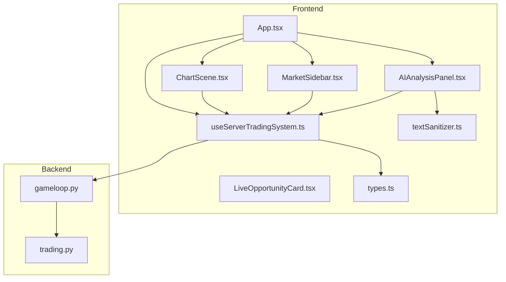
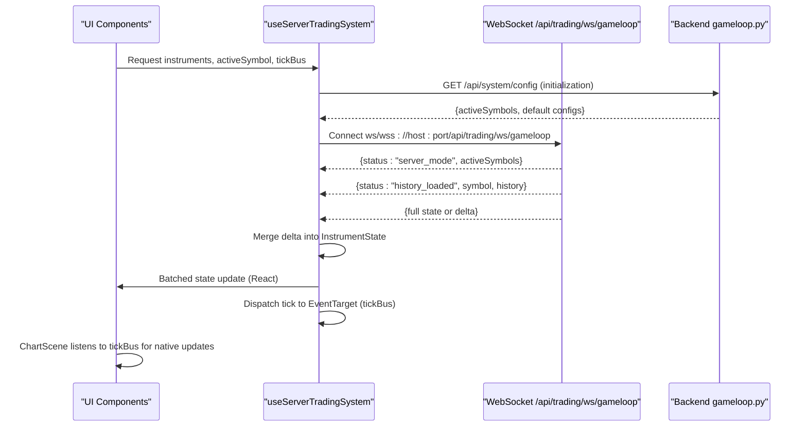
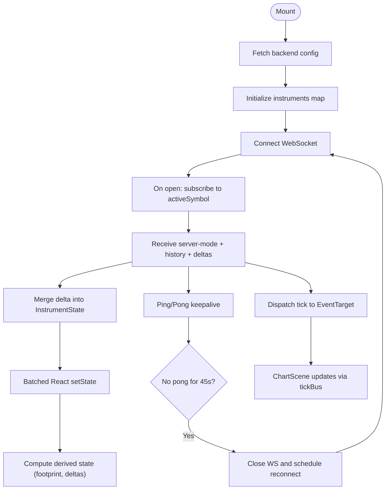
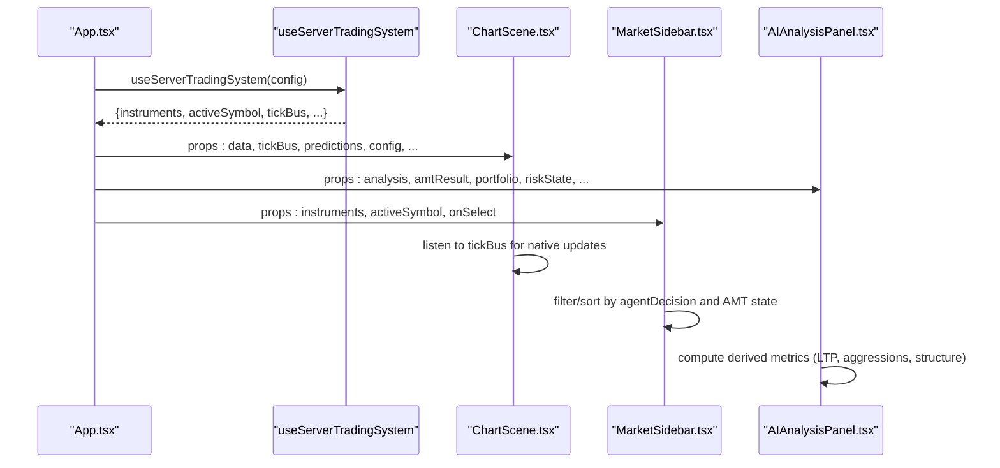
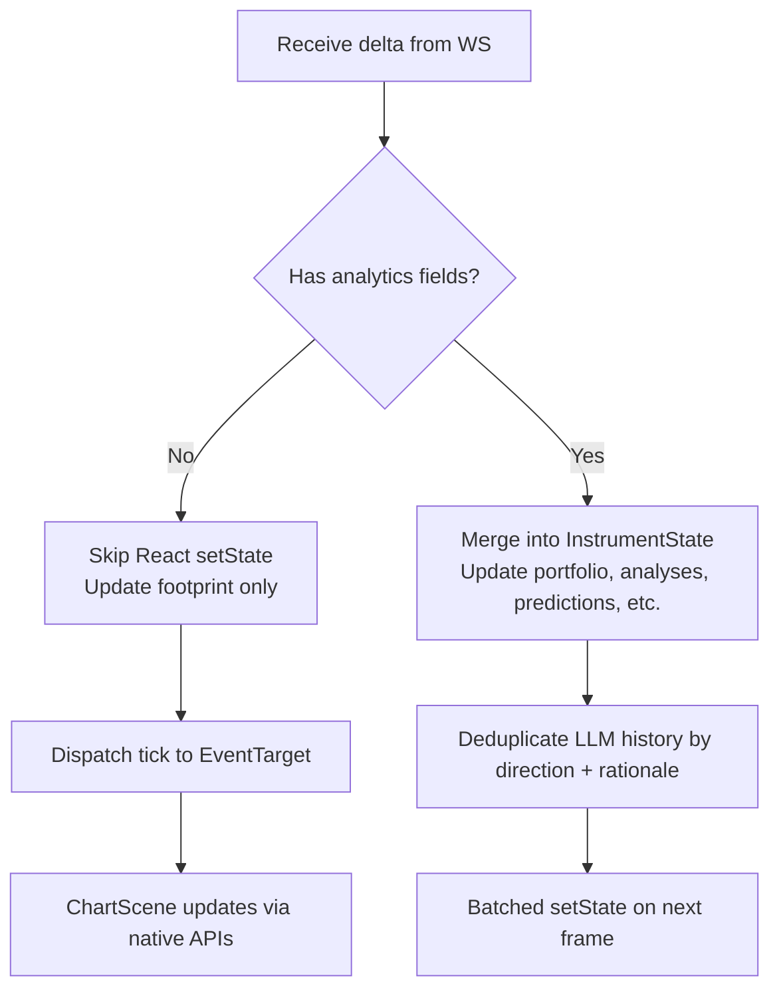
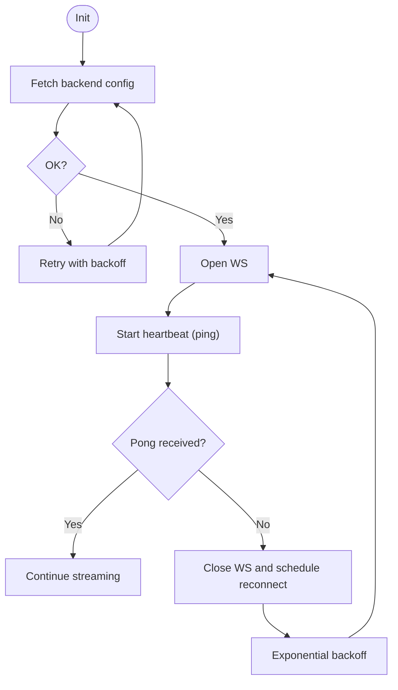
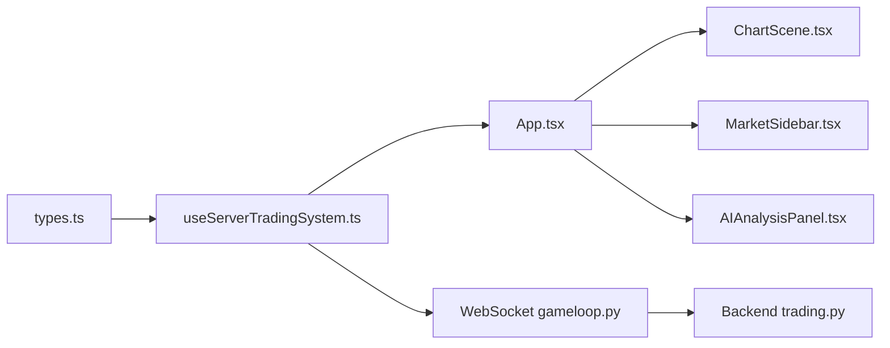

# State Management and Hooks

<cite>
**Referenced Files in This Document**
- [useServerTradingSystem.ts](file://frontend/hooks/useServerTradingSystem.ts)
- [types.ts](file://frontend/types.ts)
- [App.tsx](file://frontend/App.tsx)
- [ChartScene.tsx](file://frontend/components/ChartScene.tsx)
- [MarketSidebar.tsx](file://frontend/components/MarketSidebar.tsx)
- [AIAnalysisPanel.tsx](file://frontend/components/AIAnalysisPanel.tsx)
- [LiveOpportunityCard.tsx](file://frontend/components/ai/LiveOpportunityCard.tsx)
- [textSanitizer.ts](file://frontend/utils/textSanitizer.ts)
- [gameloop.py](file://backend/app/api/websocket/gameloop.py)
- [trading.py](file://backend/app/api/routers/trading.py)
- [useServerTradingSystem.test.tsx](file://frontend/tests/hooks/useServerTradingSystem.test.tsx)
</cite>

## Table of Contents
1. [Introduction](#introduction)
2. [Project Structure](#project-structure)
3. [Core Components](#core-components)
4. [Architecture Overview](#architecture-overview)
5. [Detailed Component Analysis](#detailed-component-analysis)
6. [Dependency Analysis](#dependency-analysis)
7. [Performance Considerations](#performance-considerations)
8. [Troubleshooting Guide](#troubleshooting-guide)
9. [Conclusion](#conclusion)
10. [Appendices](#appendices)

## Introduction
This document explains the GlassyTrade AI frontend state management system with a focus on the useServerTradingSystem hook. It covers how the hook orchestrates WebSocket connections, real-time data streaming, and trading state synchronization. It documents the state architecture (instrument data, market analysis results, AI predictions, and portfolio information), TypeScript types and interfaces, state consumption patterns, data transformation, real-time updates, error handling, loading states, and connection management. Guidance is also provided for extending the state system and maintaining type safety across the application.

## Project Structure
The state management spans three layers:
- Hook layer: useServerTradingSystem manages WebSocket lifecycle, delta-compressed state updates, and batching.
- Types layer: frontend/types defines the canonical TypeScript interfaces for all state shapes.
- UI layer: React components consume the hook’s returned state and render charts, market scanners, and AI panels.



**Diagram sources**
- [App.tsx:62-72](file://frontend/App.tsx#L62-L72)
- [useServerTradingSystem.ts:59-654](file://frontend/hooks/useServerTradingSystem.ts#L59-L654)
- [types.ts:119-142](file://frontend/types.ts#L119-L142)
- [ChartScene.tsx:51-67](file://frontend/components/ChartScene.tsx#L51-L67)
- [MarketSidebar.tsx:168-388](file://frontend/components/MarketSidebar.tsx#L168-L388)
- [AIAnalysisPanel.tsx:20-800](file://frontend/components/AIAnalysisPanel.tsx#L20-L800)
- [LiveOpportunityCard.tsx:13-94](file://frontend/components/ai/LiveOpportunityCard.tsx#L13-L94)
- [textSanitizer.ts:17-50](file://frontend/utils/textSanitizer.ts#L17-L50)
- [gameloop.py:112-356](file://backend/app/api/websocket/gameloop.py#L112-L356)
- [trading.py:13-100](file://backend/app/api/routers/trading.py#L13-L100)

**Section sources**
- [App.tsx:62-72](file://frontend/App.tsx#L62-L72)
- [useServerTradingSystem.ts:59-654](file://frontend/hooks/useServerTradingSystem.ts#L59-L654)
- [types.ts:119-142](file://frontend/types.ts#L119-L142)

## Core Components
- useServerTradingSystem: Central orchestrator for backend-driven trading state. It initializes backend configuration, sets up WebSocket connections, handles delta-compressed state updates, batches frequent updates, and exposes derived state for UI components.
- Types: Strongly typed definitions for InstrumentState, AIAnalysis, GenAIAnalysis, AMTAnalysis, Portfolio, and related structures.
- UI Consumers: App, ChartScene, MarketSidebar, AIAnalysisPanel, and LiveOpportunityCard consume the hook’s state to render charts, scanners, and AI insights.

Key responsibilities:
- WebSocket lifecycle and reconnection
- Delta compression and state merging
- Batched React updates via requestAnimationFrame
- Footprint and tick event bus for high-frequency updates
- Derived state computation (cumulative deltas, footprint data)
- Error handling and heartbeat monitoring

**Section sources**
- [useServerTradingSystem.ts:59-654](file://frontend/hooks/useServerTradingSystem.ts#L59-L654)
- [types.ts:119-142](file://frontend/types.ts#L119-L142)
- [App.tsx:62-72](file://frontend/App.tsx#L62-L72)

## Architecture Overview
The system follows a server-driven architecture:
- Backend runs the trading engine and exposes a WebSocket endpoint that streams state snapshots and deltas.
- Frontend connects to the WebSocket, receives server-mode configuration, history, and continuous updates.
- The hook merges deltas into a normalized InstrumentState, dispatches tick events to a dedicated event bus, and batches React updates.



**Diagram sources**
- [useServerTradingSystem.ts:111-152](file://frontend/hooks/useServerTradingSystem.ts#L111-L152)
- [useServerTradingSystem.ts:509-570](file://frontend/hooks/useServerTradingSystem.ts#L509-L570)
- [useServerTradingSystem.ts:204-498](file://frontend/hooks/useServerTradingSystem.ts#L204-L498)
- [gameloop.py:198-356](file://backend/app/api/websocket/gameloop.py#L198-L356)

## Detailed Component Analysis

### useServerTradingSystem Hook
Responsibilities:
- Initializes backend configuration and default instruments
- Manages WebSocket connection, heartbeat, and reconnection
- Handles server-mode configuration, history loading, and delta-compressed updates
- Merges deltas into InstrumentState and maintains tickBus for high-frequency updates
- Derives footprint and cumulative delta data
- Exposes connection status and controls for UI

Implementation highlights:
- Default model weights and initial InstrumentState factory
- Batched updates via requestAnimationFrame to reduce render churn
- Delta merge logic that selectively updates fields and deduplicates LLM history entries
- Heartbeat mechanism to detect dead connections and trigger reconnects
- Generation-based subscription debouncing to avoid race conditions on rapid symbol changes



**Diagram sources**
- [useServerTradingSystem.ts:111-152](file://frontend/hooks/useServerTradingSystem.ts#L111-L152)
- [useServerTradingSystem.ts:509-570](file://frontend/hooks/useServerTradingSystem.ts#L509-L570)
- [useServerTradingSystem.ts:204-498](file://frontend/hooks/useServerTradingSystem.ts#L204-L498)
- [useServerTradingSystem.ts:628-639](file://frontend/hooks/useServerTradingSystem.ts#L628-L639)

**Section sources**
- [useServerTradingSystem.ts:13-51](file://frontend/hooks/useServerTradingSystem.ts#L13-L51)
- [useServerTradingSystem.ts:84-101](file://frontend/hooks/useServerTradingSystem.ts#L84-L101)
- [useServerTradingSystem.ts:204-498](file://frontend/hooks/useServerTradingSystem.ts#L204-L498)
- [useServerTradingSystem.ts:509-570](file://frontend/hooks/useServerTradingSystem.ts#L509-L570)
- [useServerTradingSystem.ts:628-639](file://frontend/hooks/useServerTradingSystem.ts#L628-L639)

### State Architecture and Types
InstrumentState encapsulates the complete state for a symbol:
- OHLC time series and order book
- Portfolio, model weights, generation, and analytics
- AI predictions, risk state, agent decisions, overseer actions, and stats
- Depth-20 flag, last update timestamp, and optional LTP/OI/range bars

Related types include AIAnalysis, GenAIAnalysis, AMTAnalysis, AgentDecision, RiskState, LLMHistoryEntry, and Portfolio.

```mermaid
classDiagram
class InstrumentState {
+string symbol
+OHLCData[] data
+OrderBook? orderBook
+Portfolio portfolio
+ModelWeights modelWeights
+number generation
+AIAnalysis? aiAnalysis
+GenAIAnalysis? genAIAnalysis
+AMTAnalysis? amtAnalysis
+RiskState? riskState
+AgentDecision? agentDecision
+LLMHistoryEntry[] llmHistory
+OHLCData[] predictions
+string overseerAction
+string overseerReason
+StrategyStats? stats
+boolean depth20Active
+boolean? stale
+number? ltp
+number? oi
+RangeBarData? rangeBars
+number lastUpdate
}
class Portfolio {
+number balance
+number equity
+number leverage
+TradePosition[] positions
+TradePosition[] closedTrades
+{time : string,pnl : number}[] history
}
class GenAIAnalysis {
+string direction
+string rationale
+string confidence
+string? inputPrompt
+string? rawOutput
+string? marketState
+string? aggression
+number? quantProbability
+string? quantDirection
}
class AMTAnalysis {
+string marketState
+number poc
+number valueAreaHigh
+number valueAreaLow
+number[] hvns
+number[] lvns
+number aggression
+TradeSignal? signal
+string? profileShape
+number? balanceRatio
+number? ofi
+number? cvdSlope
+string? cvdDivergence
+number? sessionVwap
+string? llmThinking
}
class AgentDecision {
+string direction
+number probability
+string regime
+string timing
+number sizeFraction
+number slAdjust
+number tpAdjust
+number latencyUs
+string rationale
}
class RiskState {
+boolean halted
+string haltReason
+number consecutiveLosses
+number dailyPnl
+boolean? driftAlert
+string? driftMessage
}
InstrumentState --> Portfolio
InstrumentState --> GenAIAnalysis
InstrumentState --> AMTAnalysis
InstrumentState --> AgentDecision
InstrumentState --> RiskState
```

**Diagram sources**
- [types.ts:119-142](file://frontend/types.ts#L119-L142)
- [types.ts:107-114](file://frontend/types.ts#L107-L114)
- [types.ts:40-50](file://frontend/types.ts#L40-L50)
- [types.ts:229-301](file://frontend/types.ts#L229-L301)
- [types.ts:52-64](file://frontend/types.ts#L52-L64)
- [types.ts:66-73](file://frontend/types.ts#L66-L73)

**Section sources**
- [types.ts:119-142](file://frontend/types.ts#L119-L142)
- [types.ts:107-114](file://frontend/types.ts#L107-L114)
- [types.ts:40-50](file://frontend/types.ts#L40-L50)
- [types.ts:229-301](file://frontend/types.ts#L229-L301)
- [types.ts:52-64](file://frontend/types.ts#L52-L64)
- [types.ts:66-73](file://frontend/types.ts#L66-L73)

### UI Consumption Patterns
- App integrates the hook and passes instruments, activeSymbol, tickBus, and derived state to ChartScene and AIAnalysisPanel.
- ChartScene consumes tickBus to update lightweight-charts series without triggering React renders.
- MarketSidebar filters and sorts instruments based on agent decisions and AMT market state.
- AIAnalysisPanel displays GenAI and AMT insights, portfolio metrics, and risk state.
- LiveOpportunityCard surfaces the best “ENTER_NOW” opportunity across instruments.



**Diagram sources**
- [App.tsx:62-72](file://frontend/App.tsx#L62-L72)
- [ChartScene.tsx:277-319](file://frontend/components/ChartScene.tsx#L277-L319)
- [MarketSidebar.tsx:168-388](file://frontend/components/MarketSidebar.tsx#L168-L388)
- [AIAnalysisPanel.tsx:20-800](file://frontend/components/AIAnalysisPanel.tsx#L20-L800)

**Section sources**
- [App.tsx:62-72](file://frontend/App.tsx#L62-L72)
- [ChartScene.tsx:277-319](file://frontend/components/ChartScene.tsx#L277-L319)
- [MarketSidebar.tsx:168-388](file://frontend/components/MarketSidebar.tsx#L168-L388)
- [AIAnalysisPanel.tsx:20-800](file://frontend/components/AIAnalysisPanel.tsx#L20-L800)

### Data Transformation and Real-Time Updates
- Delta compression: The backend computes deltas; the frontend merges only changed fields into InstrumentState.
- Tick-only deltas: When only tick data arrives, the hook dispatches a tick event to tickBus and skips React updates to minimize renders.
- LLM history deduplication: The hook deduplicates entries by direction and rationale within a short time window.
- Footprint and cumulative deltas: Derived from the latest footprint map and OHLC data.



**Diagram sources**
- [useServerTradingSystem.ts:295-397](file://frontend/hooks/useServerTradingSystem.ts#L295-L397)
- [useServerTradingSystem.ts:366-392](file://frontend/hooks/useServerTradingSystem.ts#L366-L392)
- [useServerTradingSystem.ts:298-301](file://frontend/hooks/useServerTradingSystem.ts#L298-L301)

**Section sources**
- [useServerTradingSystem.ts:295-397](file://frontend/hooks/useServerTradingSystem.ts#L295-L397)
- [useServerTradingSystem.ts:366-392](file://frontend/hooks/useServerTradingSystem.ts#L366-L392)

### Error Handling, Loading States, and Connection Management
- Backend config fetch retries with exponential backoff until backend is reachable.
- WebSocket onerror is a no-op; the hook relies on heartbeat to detect disconnections.
- Heartbeat: periodic ping; if no pong within a threshold, WS is closed and reconnect is scheduled.
- Reconnect: exponential backoff with capped delay; clears pending timers on cleanup.
- Connection status: surfaced to UI for user feedback.
- Stale data: backend can mark state as stale; the hook reflects this flag.



**Diagram sources**
- [useServerTradingSystem.ts:111-152](file://frontend/hooks/useServerTradingSystem.ts#L111-L152)
- [useServerTradingSystem.ts:534-565](file://frontend/hooks/useServerTradingSystem.ts#L534-L565)
- [useServerTradingSystem.ts:540-544](file://frontend/hooks/useServerTradingSystem.ts#L540-L544)

**Section sources**
- [useServerTradingSystem.ts:111-152](file://frontend/hooks/useServerTradingSystem.ts#L111-L152)
- [useServerTradingSystem.ts:534-565](file://frontend/hooks/useServerTradingSystem.ts#L534-L565)
- [useServerTradingSystem.ts:540-544](file://frontend/hooks/useServerTradingSystem.ts#L540-L544)

### Extending the State System and Maintaining Type Safety
Guidance:
- Add new fields to InstrumentState and related interfaces in types.ts to preserve type safety.
- When extending backend state, mirror changes in the frontend types and update the delta merge logic to handle new keys.
- Use the delta protocol: send only changed fields; the frontend merges selectively.
- Keep tick-only deltas off React updates; use tickBus for native chart updates.
- Maintain LLM history deduplication logic when adding new fields to LLMHistoryEntry.
- Add tests for new behaviors using the existing test pattern in useServerTradingSystem.test.tsx.

**Section sources**
- [types.ts:119-142](file://frontend/types.ts#L119-L142)
- [useServerTradingSystem.ts:295-397](file://frontend/hooks/useServerTradingSystem.ts#L295-L397)
- [useServerTradingSystem.test.tsx:45-126](file://frontend/tests/hooks/useServerTradingSystem.test.tsx#L45-L126)

## Dependency Analysis
- Hook depends on types.ts for strongly typed state and interfaces.
- UI components depend on the hook’s return values for rendering.
- Backend depends on the trading engine; the WebSocket endpoint streams server-mode configuration, history, and deltas.



**Diagram sources**
- [types.ts:119-142](file://frontend/types.ts#L119-L142)
- [useServerTradingSystem.ts:59-654](file://frontend/hooks/useServerTradingSystem.ts#L59-L654)
- [App.tsx:62-72](file://frontend/App.tsx#L62-L72)
- [gameloop.py:112-356](file://backend/app/api/websocket/gameloop.py#L112-L356)
- [trading.py:13-100](file://backend/app/api/routers/trading.py#L13-L100)

**Section sources**
- [types.ts:119-142](file://frontend/types.ts#L119-L142)
- [useServerTradingSystem.ts:59-654](file://frontend/hooks/useServerTradingSystem.ts#L59-L654)
- [gameloop.py:112-356](file://backend/app/api/websocket/gameloop.py#L112-L356)
- [trading.py:13-100](file://backend/app/api/routers/trading.py#L13-L100)

## Performance Considerations
- Batched updates: requestAnimationFrame batching prevents excessive React renders during high-frequency updates.
- Delta compression: only changed fields are merged, reducing payload size and merge cost.
- TickBus separation: native chart updates via EventTarget avoid unnecessary React state churn.
- Derived computations: useMemo for footprint data and cumulative deltas prevent recomputation on every render.
- ChartScene stability: memoized references for AMT analysis and OHLC arrays reduce overlay redraws.

[No sources needed since this section provides general guidance]

## Troubleshooting Guide
Common issues and remedies:
- No initial data: Verify backend config fetch succeeds and activeSymbols are populated.
- Frequent reconnects: Check heartbeat timeouts and network connectivity; inspect connectionStatus.
- Stale state: Look for stale flags in InstrumentState; ensure backend is sending fresh updates.
- Tick ordering crashes: The hook drops delayed ticks; the chart wrapper catches and ignores out-of-order updates.
- LLM history duplication: Deduplication logic compares direction and rationale within a short window.

**Section sources**
- [useServerTradingSystem.ts:111-152](file://frontend/hooks/useServerTradingSystem.ts#L111-L152)
- [useServerTradingSystem.ts:534-565](file://frontend/hooks/useServerTradingSystem.ts#L534-L565)
- [useServerTradingSystem.ts:366-392](file://frontend/hooks/useServerTradingSystem.ts#L366-L392)
- [ChartScene.tsx:297-312](file://frontend/components/ChartScene.tsx#L297-L312)

## Conclusion
The useServerTradingSystem hook centralizes server-driven state management for GlassyTrade AI. It efficiently handles WebSocket lifecycle, delta-compressed updates, and real-time rendering via a dedicated tick bus. The strongly typed state architecture ensures correctness across components, while derived computations and batching optimize performance. The provided patterns and guidance enable safe extension of the state system and maintenance of type safety.

[No sources needed since this section summarizes without analyzing specific files]

## Appendices

### Example State Consumption Patterns
- Active instrument selection: App.tsx passes activeSymbol to MarketSidebar and ChartScene.
- Real-time ticks: ChartScene listens to tickBus to update lightweight-charts series.
- AI insights: AIAnalysisPanel composes GenAI and AMT outputs, computing derived metrics.
- Opportunity discovery: App.tsx scans instruments to find the best “ENTER_NOW” opportunity.

**Section sources**
- [App.tsx:77-94](file://frontend/App.tsx#L77-L94)
- [ChartScene.tsx:277-319](file://frontend/components/ChartScene.tsx#L277-L319)
- [AIAnalysisPanel.tsx:20-800](file://frontend/components/AIAnalysisPanel.tsx#L20-L800)
- [MarketSidebar.tsx:168-388](file://frontend/components/MarketSidebar.tsx#L168-L388)

### Testing Patterns
- Mock WebSocket for deterministic tests.
- Verify initial state, connection flags, and tickBus availability.
- Exercise setActiveSymbol and confirm state updates.

**Section sources**
- [useServerTradingSystem.test.tsx:45-126](file://frontend/tests/hooks/useServerTradingSystem.test.tsx#L45-L126)