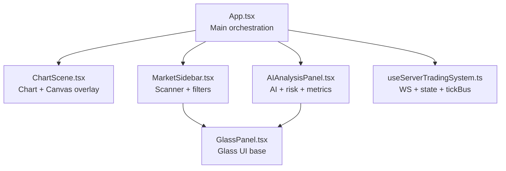
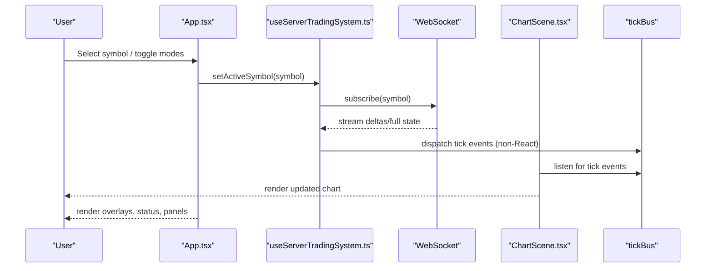
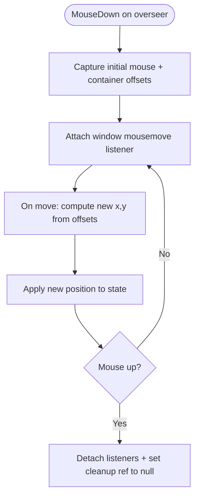
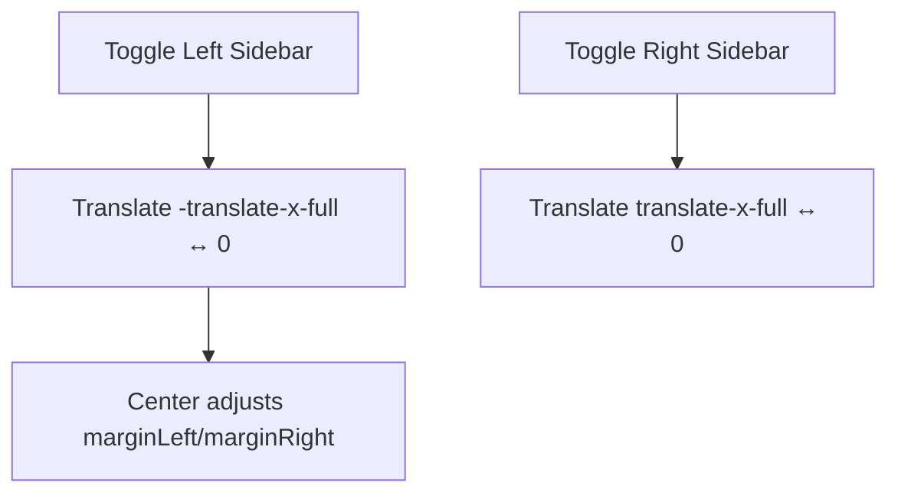
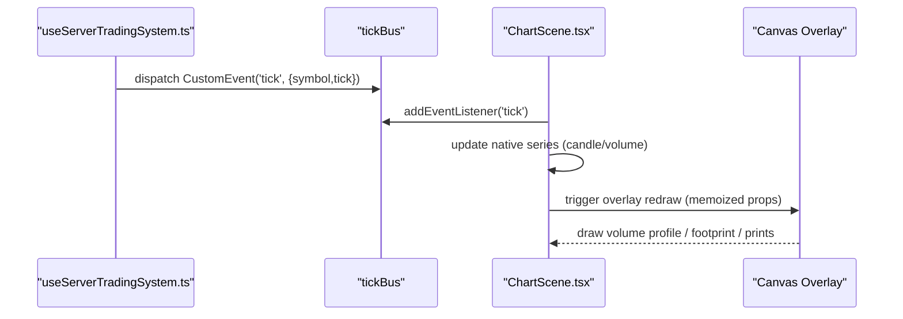
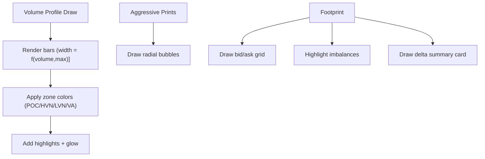
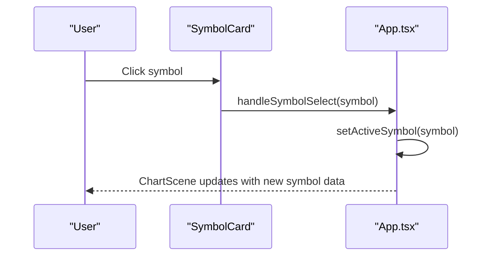
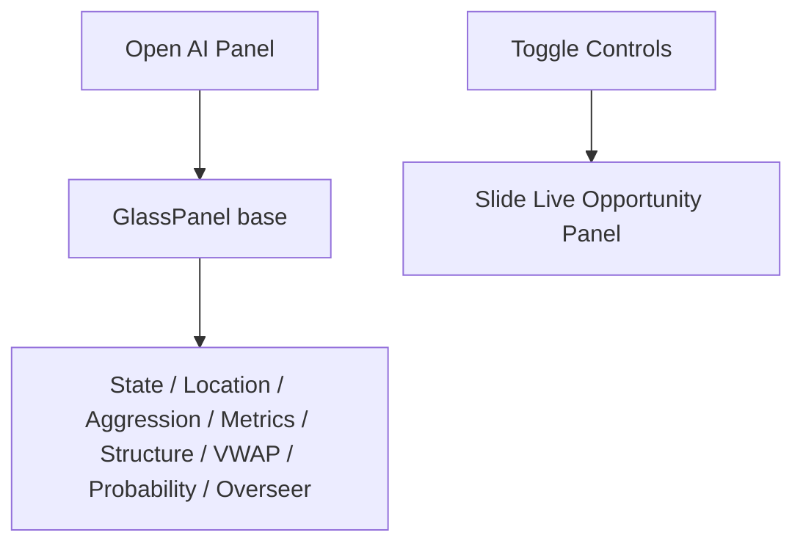
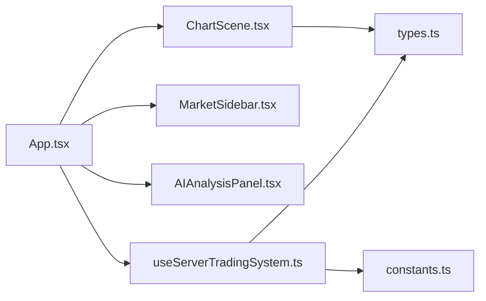

# UI/UX Patterns and Interactions

<cite>
**Referenced Files in This Document**
- [App.tsx](file://frontend/App.tsx)
- [ChartScene.tsx](file://frontend/components/ChartScene.tsx)
- [MarketSidebar.tsx](file://frontend/components/MarketSidebar.tsx)
- [GlassPanel.tsx](file://frontend/components/GlassPanel.tsx)
- [AIAnalysisPanel.tsx](file://frontend/components/AIAnalysisPanel.tsx)
- [constants.ts](file://frontend/constants.ts)
- [types.ts](file://frontend/types.ts)
- [useServerTradingSystem.ts](file://frontend/hooks/useServerTradingSystem.ts)
</cite>

## Table of Contents
1. [Introduction](#introduction)
2. [Project Structure](#project-structure)
3. [Core Components](#core-components)
4. [Architecture Overview](#architecture-overview)
5. [Detailed Component Analysis](#detailed-component-analysis)
6. [Dependency Analysis](#dependency-analysis)
7. [Performance Considerations](#performance-considerations)
8. [Accessibility and Interaction Design](#accessibility-and-interaction-design)
9. [Troubleshooting Guide](#troubleshooting-guide)
10. [Conclusion](#conclusion)

## Introduction
This document describes the UI/UX patterns and interaction design of the GlassyTrade AI frontend. It focuses on the layout system (draggable overlays, collapsible sidebars, responsive behavior), user interaction patterns (symbol selection, chart mode switching, real-time data visualization controls), accessibility and keyboard navigation, touch interactions, animation systems, state transitions, visual feedback, performance considerations, and examples of custom drag-and-drop and modal management.

## Project Structure
The frontend is a React application with a glassmorphism design theme. The main application orchestrates:
- A central chart area with three rendering modes (standard candles, footprint, range bars)
- Collapsible left/right panels for market scanning and AI analysis
- A draggable “overseer” floating control
- Real-time data visualization powered by a native chart library and a custom canvas overlay

**Diagram sources**
- [App.tsx:16-392](file://frontend/App.tsx#L16-L392)
- [ChartScene.tsx:51-1426](file://frontend/components/ChartScene.tsx#L51-L1426)
- [MarketSidebar.tsx:168-387](file://frontend/components/MarketSidebar.tsx#L168-L387)
- [AIAnalysisPanel.tsx:20-1039](file://frontend/components/AIAnalysisPanel.tsx#L20-L1039)
- [GlassPanel.tsx:8-32](file://frontend/components/GlassPanel.tsx#L8-L32)
- [useServerTradingSystem.ts:59-654](file://frontend/hooks/useServerTradingSystem.ts#L59-L654)

**Section sources**
- [App.tsx:16-392](file://frontend/App.tsx#L16-L392)
- [ChartScene.tsx:51-1426](file://frontend/components/ChartScene.tsx#L51-L1426)
- [MarketSidebar.tsx:168-387](file://frontend/components/MarketSidebar.tsx#L168-L387)
- [GlassPanel.tsx:8-32](file://frontend/components/GlassPanel.tsx#L8-L32)
- [AIAnalysisPanel.tsx:20-1039](file://frontend/components/AIAnalysisPanel.tsx#L20-L1039)
- [useServerTradingSystem.ts:59-654](file://frontend/hooks/useServerTradingSystem.ts#L59-L654)

## Core Components
- App orchestrates global UI state (chart mode, sidebar toggles, controls visibility, draggable overlay position), renders three ChartScene instances (standard, footprint, range), and manages top-level overlays and status indicators.
- ChartScene renders the chart via a native library, applies dynamic overlays (volume profile, aggressive prints, footprint), and handles real-time updates through a dedicated event bus.
- MarketSidebar provides symbol scanning, filtering, sorting, and quick access to recent trades for the active symbol.
- AIAnalysisPanel displays AI reasoning, risk state, market structure, and decision probabilities in a glass-like panel.
- GlassPanel provides reusable glassmorphism styling and gloss effects.
- useServerTradingSystem manages WebSocket connectivity, batching updates, and dispatching real-time ticks to the chart without triggering React re-renders.

**Section sources**
- [App.tsx:16-392](file://frontend/App.tsx#L16-L392)
- [ChartScene.tsx:51-1426](file://frontend/components/ChartScene.tsx#L51-L1426)
- [MarketSidebar.tsx:168-387](file://frontend/components/MarketSidebar.tsx#L168-L387)
- [AIAnalysisPanel.tsx:20-1039](file://frontend/components/AIAnalysisPanel.tsx#L20-L1039)
- [GlassPanel.tsx:8-32](file://frontend/components/GlassPanel.tsx#L8-L32)
- [useServerTradingSystem.ts:59-654](file://frontend/hooks/useServerTradingSystem.ts#L59-L654)

## Architecture Overview
The frontend follows a server-driven architecture: the backend streams instrument states and ticks; the frontend renders visuals and user interactions without performing market data retrieval or business logic.

**Diagram sources**
- [App.tsx:76-79](file://frontend/App.tsx#L76-L79)
- [useServerTradingSystem.ts:509-570](file://frontend/hooks/useServerTradingSystem.ts#L509-L570)
- [useServerTradingSystem.ts:296-324](file://frontend/hooks/useServerTradingSystem.ts#L296-L324)
- [ChartScene.tsx:277-319](file://frontend/components/ChartScene.tsx#L277-L319)

## Detailed Component Analysis

### Draggable Overlay (Overseer Box)
- The “overseer” is a draggable floating control positioned absolutely in the viewport. Dragging is implemented with mouse move/up listeners attached to the window during the drag lifecycle. The component persists drag state and cleans up listeners on unmount to prevent memory leaks.
- Position is stored in component state and applied as inline styles. The drag handler computes offsets relative to the container’s bounding rectangle.

**Diagram sources**
- [App.tsx:30-56](file://frontend/App.tsx#L30-L56)
- [App.tsx:58-60](file://frontend/App.tsx#L58-L60)

**Section sources**
- [App.tsx:24-60](file://frontend/App.tsx#L24-L60)

### Collapsible Sidebars
- Left sidebar (MarketScanner): Toggles via translate transforms with transition classes. Visibility is controlled by a boolean state; the center content adapts margins accordingly.
- Right sidebar (AI Analysis): Toggles similarly; content is scrollable and glass-styled.

**Diagram sources**
- [App.tsx:129-148](file://frontend/App.tsx#L129-L148)
- [App.tsx:351-388](file://frontend/App.tsx#L351-L388)

**Section sources**
- [App.tsx:129-148](file://frontend/App.tsx#L129-L148)
- [App.tsx:351-388](file://frontend/App.tsx#L351-L388)

### Chart Mode Switching and Real-Time Visualization
- Three ChartScene instances are rendered simultaneously but only one is visible at a time. The visible instance receives real-time ticks via a dedicated event bus, while others remain hidden.
- Modes:
  - STANDARD: candlesticks + histogram + optional prediction overlay
  - FOOTPRINT: candle spine + footprint grid + delta summary + CVD line
  - RANGE: range bars with volume profile and markers
- Real-time updates:
  - A native chart library updates candlesticks and volumes.
  - A canvas overlay draws volume profiles, aggressive prints, footprint cells, and summary metrics.
  - The overlay is redrawn only when relevant data changes (memoized references and fingerprinting).

**Diagram sources**
- [useServerTradingSystem.ts:296-324](file://frontend/hooks/useServerTradingSystem.ts#L296-L324)
- [ChartScene.tsx:277-319](file://frontend/components/ChartScene.tsx#L277-L319)
- [ChartScene.tsx:375-425](file://frontend/components/ChartScene.tsx#L375-L425)

**Section sources**
- [App.tsx:150-206](file://frontend/App.tsx#L150-L206)
- [ChartScene.tsx:341-373](file://frontend/components/ChartScene.tsx#L341-L373)
- [ChartScene.tsx:375-425](file://frontend/components/ChartScene.tsx#L375-L425)
- [ChartScene.tsx:625-652](file://frontend/components/ChartScene.tsx#L625-L652)
- [ChartScene.tsx:685-980](file://frontend/components/ChartScene.tsx#L685-L980)
- [ChartScene.tsx:982-1086](file://frontend/components/ChartScene.tsx#L982-L1086)

### Volume Profile and Visual Feedback
- Volume profile rendering:
  - Session and leg profiles are drawn as glassy bars on the right edge of the chart with directional coloring and alpha blending.
  - POC, HVN/LVN, and value area regions are highlighted with gradients and subtle glows.
- Aggressive prints:
  - Large-volume prints are rendered as radial bubbles with volume-derived radii and inner text.
- Footprint:
  - Bid/ask columns with imbalance highlighting, stacked imbalance borders, and a summary delta card.
- Decision card:
  - A floating card shows current AI decision with expand/collapse behavior and rationale text.

**Diagram sources**
- [ChartScene.tsx:487-610](file://frontend/components/ChartScene.tsx#L487-L610)
- [ChartScene.tsx:428-484](file://frontend/components/ChartScene.tsx#L428-L484)
- [ChartScene.tsx:685-980](file://frontend/components/ChartScene.tsx#L685-L980)

**Section sources**
- [ChartScene.tsx:487-610](file://frontend/components/ChartScene.tsx#L487-L610)
- [ChartScene.tsx:428-484](file://frontend/components/ChartScene.tsx#L428-L484)
- [ChartScene.tsx:685-980](file://frontend/components/ChartScene.tsx#L685-L980)

### Symbol Selection and Market Scanner
- The MarketSidebar lists instruments with filtering/sorting and live status indicators.
- Selection triggers a stable callback to update the active symbol without forcing re-renders of the sidebar itself.
- Recent trades panel shows closed trades for the active symbol.

**Diagram sources**
- [MarketSidebar.tsx:36-166](file://frontend/components/MarketSidebar.tsx#L36-L166)
- [App.tsx:76-79](file://frontend/App.tsx#L76-L79)

**Section sources**
- [MarketSidebar.tsx:168-387](file://frontend/components/MarketSidebar.tsx#L168-L387)
- [App.tsx:76-79](file://frontend/App.tsx#L76-L79)

### AI Analysis Panel and Modal Management
- The AI panel is a persistent right-side panel with a glassmorphism design and scrollable content.
- It displays:
  - Engine status and equity
  - Risk state warnings
  - Market state and structure
  - Aggression metrics and verification signals
  - Probability engine decision with rationale
  - Overseer actions
- The “Live Opportunity” panel is a transient overlay that slides in/out based on controls visibility state.

**Diagram sources**
- [AIAnalysisPanel.tsx:106-185](file://frontend/components/AIAnalysisPanel.tsx#L106-L185)
- [GlassPanel.tsx:8-32](file://frontend/components/GlassPanel.tsx#L8-L32)
- [App.tsx:326-337](file://frontend/App.tsx#L326-L337)

**Section sources**
- [AIAnalysisPanel.tsx:106-185](file://frontend/components/AIAnalysisPanel.tsx#L106-L185)
- [GlassPanel.tsx:8-32](file://frontend/components/GlassPanel.tsx#L8-L32)
- [App.tsx:326-337](file://frontend/App.tsx#L326-L337)

## Dependency Analysis
- App depends on:
  - useServerTradingSystem for state and real-time tick delivery
  - ChartScene for visualization
  - MarketSidebar for symbol selection
  - AIAnalysisPanel for intelligence display
- ChartScene depends on:
  - Lightweight Charts for candlesticks and overlays
  - Canvas for custom drawings
  - Memoized props to minimize redraws
- useServerTradingSystem depends on:
  - WebSocket for real-time updates
  - EventTarget-based tickBus to avoid React renders
  - Batched updates via requestAnimationFrame

**Diagram sources**
- [App.tsx:16-392](file://frontend/App.tsx#L16-L392)
- [useServerTradingSystem.ts:59-654](file://frontend/hooks/useServerTradingSystem.ts#L59-L654)
- [ChartScene.tsx:51-1426](file://frontend/components/ChartScene.tsx#L51-L1426)
- [types.ts:204-219](file://frontend/types.ts#L204-L219)
- [constants.ts:4-19](file://frontend/constants.ts#L4-L19)

**Section sources**
- [App.tsx:16-392](file://frontend/App.tsx#L16-L392)
- [useServerTradingSystem.ts:59-654](file://frontend/hooks/useServerTradingSystem.ts#L59-L654)
- [ChartScene.tsx:51-1426](file://frontend/components/ChartScene.tsx#L51-L1426)
- [types.ts:204-219](file://frontend/types.ts#L204-L219)
- [constants.ts:4-19](file://frontend/constants.ts#L4-L19)

## Performance Considerations
- Real-time updates:
  - Ticks are dispatched via a dedicated event bus to avoid React re-renders; ChartScene updates native series directly.
  - Overlay redraws are minimized using memoized references and data fingerprinting to detect meaningful changes.
- Rendering:
  - ChartScene uses React.memo with a custom equality comparator to prevent unnecessary re-renders.
  - ResizeObserver ensures the chart and overlay canvases match container dimensions.
- Data stability:
  - useMemo stabilizes references for AMT analysis and OHLC data to reduce overlay redraws.
  - Range bars use setData/update selectively to avoid wiping historical data on every tick.
- Batching:
  - WebSocket messages are batched per animation frame to reduce state updates frequency.

**Section sources**
- [ChartScene.tsx:1495-1513](file://frontend/components/ChartScene.tsx#L1495-L1513)
- [ChartScene.tsx:82-110](file://frontend/components/ChartScene.tsx#L82-L110)
- [ChartScene.tsx:1136-1183](file://frontend/components/ChartScene.tsx#L1136-L1183)
- [useServerTradingSystem.ts:84-101](file://frontend/hooks/useServerTradingSystem.ts#L84-L101)

## Accessibility and Interaction Design
- Keyboard navigation:
  - Focusable buttons and toggles use semantic elements and hover/focus states. Consider adding explicit tabindex and keyboard shortcuts for frequent actions (e.g., toggling sidebars, switching modes).
- Screen reader support:
  - Status banners and live indicators use concise labels. Ensure ARIA attributes are added to interactive controls (e.g., roles for modals and panels).
- Touch interactions:
  - Touch-friendly sizing for buttons and toggles. Ensure gesture areas are large enough for mobile use.
- Visual feedback:
  - Animated status dots, pulsing indicators, and transitions provide immediate feedback for live data and state changes.
- Color and contrast:
  - Bull/bear colors are used consistently; ensure sufficient contrast for critical alerts and warnings.
- Motion preferences:
  - Provide reduced motion options for transitions and overlays to accommodate user needs.

[No sources needed since this section provides general guidance]

## Troubleshooting Guide
- Connection issues:
  - The app displays a connection banner when disconnected and attempts automatic reconnection with exponential backoff.
- Stale or out-of-order ticks:
  - ChartScene wraps updates in a try-catch and ignores stale/out-of-order ticks to prevent crashes.
- WebSocket desynchronization:
  - Consecutive parse errors trigger a reconnect to resynchronize the stream.
- Memory leaks:
  - Drag listeners are cleaned up on unmount; ensure similar cleanup for other global event listeners.

**Section sources**
- [App.tsx:122-127](file://frontend/App.tsx#L122-L127)
- [ChartScene.tsx:296-312](file://frontend/components/ChartScene.tsx#L296-L312)
- [useServerTradingSystem.ts:488-497](file://frontend/hooks/useServerTradingSystem.ts#L488-L497)
- [App.tsx:58-60](file://frontend/App.tsx#L58-L60)

## Conclusion
The GlassyTrade AI frontend combines a glassmorphism UI with robust real-time visualization and server-driven state management. Its layout system supports draggable overlays, collapsible sidebars, and responsive resizing. Interaction patterns emphasize symbol selection, chart mode switching, and AI-driven insights, with careful attention to performance and visual feedback. Extending accessibility and motion preferences would further improve usability across diverse users.