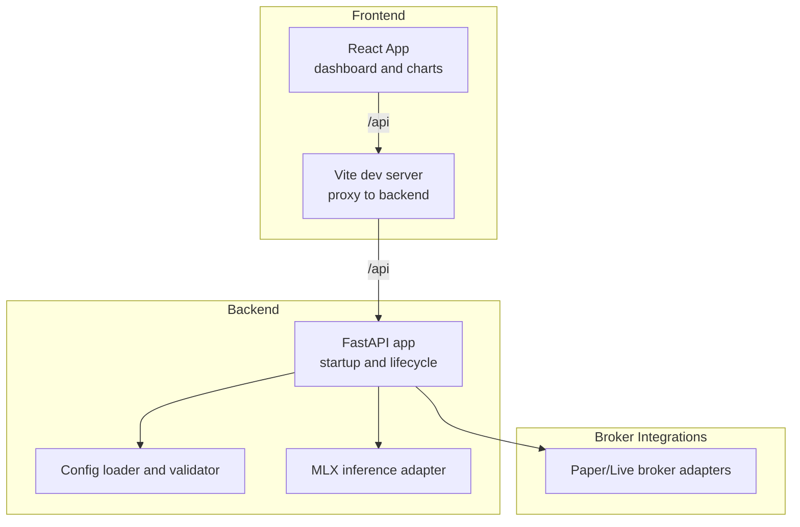
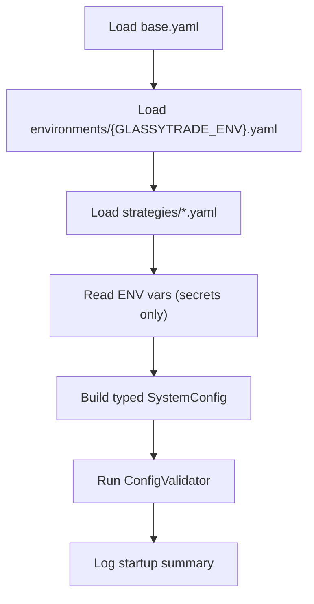
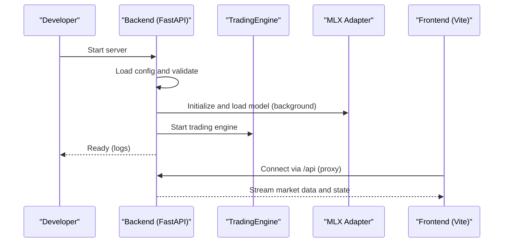
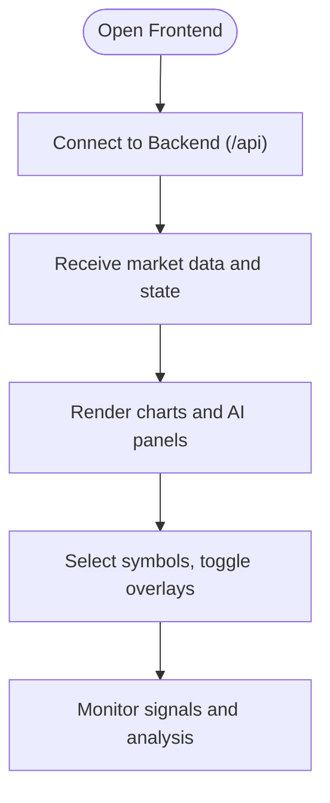
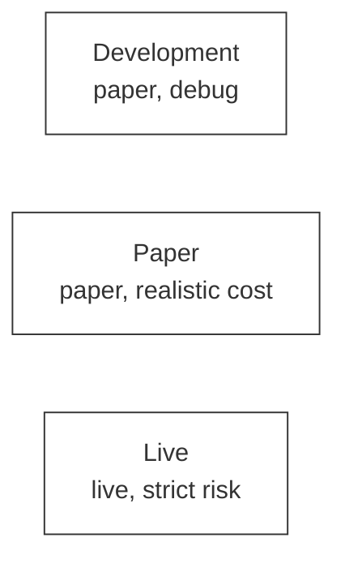

# Getting Started

<cite>
**Referenced Files in This Document**
- [backend/requirements.txt](file://backend/requirements.txt)
- [frontend/package.json](file://frontend/package.json)
- [start.sh](file://start.sh)
- [start_frontend.sh](file://start_frontend.sh)
- [backend/app/main.py](file://backend/app/main.py)
- [backend/app/config_models/loader.py](file://backend/app/config_models/loader.py)
- [backend/app/config_models/validator.py](file://backend/app/config_models/validator.py)
- [backend/app/config_models/__init__.py](file://backend/app/config_models/__init__.py)
- [backend/config/environments/development.yaml](file://backend/config/environments/development.yaml)
- [backend/config/environments/paper.yaml](file://backend/config/environments/paper.yaml)
- [backend/config/environments/live.yaml](file://backend/config/environments/live.yaml)
- [backend/app/market_config.yaml](file://backend/app/market_config.yaml)
- [frontend/vite.config.ts](file://frontend/vite.config.ts)
- [frontend/App.tsx](file://frontend/App.tsx)
- [backend/app/infrastructure/mlx_gpu_lock.py](file://backend/app/infrastructure/mlx_gpu_lock.py)
- [backend/app/infrastructure/adapters/mlx_inference_adapter.py](file://backend/app/infrastructure/adapters/mlx_inference_adapter.py)
</cite>

## Table of Contents
1. [Introduction](#introduction)
2. [Project Structure](#project-structure)
3. [Prerequisites and Hardware Notes](#prerequisites-and-hardware-notes)
4. [Installation and Environment Setup](#installation-and-environment-setup)
5. [Initial Configuration](#initial-configuration)
6. [Deployment Guide](#deployment-guide)
7. [Basic Usage](#basic-usage)
8. [Environment-Specific Modes](#environment-specific-modes)
9. [Verification Checklist](#verification-checklist)
10. [Troubleshooting Guide](#troubleshooting-guide)
11. [Performance Considerations](#performance-considerations)
12. [Conclusion](#conclusion)

## Introduction
GlassyTrade AI v5 is a production-grade, domain-driven trading system with an integrated AI inference engine, real-time market data streaming, and a React-based frontend dashboard. It supports development, paper trading, and live trading modes, with optional Apple Silicon MLX acceleration for inference.

## Project Structure
The repository is organized into:
- backend: FastAPI application, configuration, trading engine, adapters, and MLX inference
- frontend: React/TypeScript Vite app with proxy to backend
- brokers: Broker integrations and utilities
- conductor, docs, specs, validations, and scripts supporting development and operations

**Diagram sources**
- [backend/app/main.py:83-127](file://backend/app/main.py#L83-L127)
- [backend/app/config_models/loader.py:139-245](file://backend/app/config_models/loader.py#L139-L245)
- [backend/app/infrastructure/adapters/mlx_inference_adapter.py:12-396](file://backend/app/infrastructure/adapters/mlx_inference_adapter.py#L12-L396)
- [frontend/vite.config.ts:9-18](file://frontend/vite.config.ts#L9-L18)
- [frontend/App.tsx:62-72](file://frontend/App.tsx#L62-L72)

**Section sources**
- [backend/app/main.py:1-227](file://backend/app/main.py#L1-L227)
- [frontend/vite.config.ts:1-39](file://frontend/vite.config.ts#L1-L39)

## Prerequisites and Hardware Notes
- Python 3.9+ is required for the backend.
- Node.js is required for the frontend.
- Apple Silicon (ARM64) hardware is recommended for MLX acceleration. The backend includes MLX and MLX LM dependencies and a GPU lock for Metal concurrency safety.
- Ensure your terminal shell supports the provided start scripts (Bash and Zsh).

**Section sources**
- [backend/requirements.txt:1-22](file://backend/requirements.txt#L1-L22)
- [frontend/package.json:1-39](file://frontend/package.json#L1-L39)
- [backend/app/infrastructure/mlx_gpu_lock.py:1-19](file://backend/app/infrastructure/mlx_gpu_lock.py#L1-L19)

## Installation and Environment Setup
Follow these steps to prepare your environment:

1. Install Python dependencies for the backend
   - Navigate to the backend directory and install requirements.
   - The backend uses FastAPI, Uvicorn, Pydantic, websockets, YAML, and MLX-related packages.

2. Install Node.js dependencies for the frontend
   - Navigate to the frontend directory and install dependencies using your package manager.

3. Prepare the MLX model path (optional)
   - If you intend to use local MLX inference, set the model path environment variable expected by the MLX adapter.

4. Start the system
   - Use the provided start script to launch both backend and frontend concurrently.

**Section sources**
- [backend/requirements.txt:1-22](file://backend/requirements.txt#L1-L22)
- [frontend/package.json:13-37](file://frontend/package.json#L13-L37)
- [start.sh:1-55](file://start.sh#L1-L55)
- [start_frontend.sh:1-6](file://start_frontend.sh#L1-L6)

## Initial Configuration
GlassyTrade AI loads configuration from a layered YAML hierarchy and validates it at startup. The effective configuration is built by merging:
- base defaults
- environment-specific overrides
- strategy files
- feature flags
- environment variables (for secrets)

Key configuration areas:
- Environment mode and broker mode
- Risk parameters
- Exchange and symbol settings
- LLM model identifiers and temperatures
- Feature flags controlling AI roles and engines

**Diagram sources**
- [backend/app/config_models/loader.py:139-245](file://backend/app/config_models/loader.py#L139-L245)
- [backend/app/config_models/validator.py:22-176](file://backend/app/config_models/validator.py#L22-L176)

**Section sources**
- [backend/app/config_models/loader.py:1-288](file://backend/app/config_models/loader.py#L1-L288)
- [backend/app/config_models/validator.py:1-177](file://backend/app/config_models/validator.py#L1-L177)
- [backend/app/config_models/__init__.py:1-209](file://backend/app/config_models/__init__.py#L1-L209)

## Deployment Guide
End-to-end deployment steps:

1. Backend setup
   - Ensure Python 3.9+ is installed.
   - Install backend dependencies from the requirements file.
   - Confirm the startup lifecycle loads the LLM model and starts the trading engine.

2. Frontend installation
   - Install Node.js dependencies.
   - Configure the Vite proxy to route "/api" to the backend.

3. Broker configuration
   - Choose broker mode via environment variables or configuration files.
   - For paper trading, a paper broker is used by default in development and paper environments.
   - For live trading, ensure broker credentials are provided via environment variables.

4. Model loading
   - Local MLX model: Set the model path environment variable recognized by the MLX adapter.
   - Cloud fallback: If no local model is configured, the system can fall back to a cloud LLM endpoint using configured API keys.

5. Start the system
   - Use the provided start script to launch backend and frontend.
   - Verify both processes are running and logs show successful initialization.

**Diagram sources**
- [backend/app/main.py:83-127](file://backend/app/main.py#L83-L127)
- [backend/app/infrastructure/adapters/mlx_inference_adapter.py:38-81](file://backend/app/infrastructure/adapters/mlx_inference_adapter.py#L38-L81)
- [frontend/vite.config.ts:12-18](file://frontend/vite.config.ts#L12-L18)

**Section sources**
- [backend/app/main.py:83-127](file://backend/app/main.py#L83-L127)
- [frontend/vite.config.ts:1-39](file://frontend/vite.config.ts#L1-L39)
- [backend/app/infrastructure/adapters/mlx_inference_adapter.py:12-396](file://backend/app/infrastructure/adapters/mlx_inference_adapter.py#L12-L396)

## Basic Usage
After successful startup:
- Open the frontend at the URL printed by the start script.
- The dashboard connects to the backend and displays market data streams.
- Use the sidebar to select instruments and switch between chart modes (standard candles, footprint, range bars).
- Monitor AI analysis panels for GenAI rationale, AMT signals, and risk state.

**Diagram sources**
- [frontend/App.tsx:62-72](file://frontend/App.tsx#L62-L72)
- [frontend/vite.config.ts:12-18](file://frontend/vite.config.ts#L12-L18)

**Section sources**
- [frontend/App.tsx:16-117](file://frontend/App.tsx#L16-L117)
- [frontend/App.tsx:119-395](file://frontend/App.tsx#L119-L395)

## Environment-Specific Modes
GlassyTrade AI supports three operational modes controlled by configuration:

- Development
  - Paper broker, relaxed risk, minimal symbol set, debug logging.
  - Use for local iteration and testing.

- Paper
  - Paper broker, realistic risk and cost model, info logging.
  - Use for strategy testing and training.

- Live
  - Live broker, strict risk, warning logging, LLM safeguards.
  - Use for real capital with appropriate safeguards.

**Diagram sources**
- [backend/config/environments/development.yaml:1-33](file://backend/config/environments/development.yaml#L1-L33)
- [backend/config/environments/paper.yaml:1-25](file://backend/config/environments/paper.yaml#L1-L25)
- [backend/config/environments/live.yaml:1-26](file://backend/config/environments/live.yaml#L1-L26)

**Section sources**
- [backend/config/environments/development.yaml:1-33](file://backend/config/environments/development.yaml#L1-L33)
- [backend/config/environments/paper.yaml:1-25](file://backend/config/environments/paper.yaml#L1-L25)
- [backend/config/environments/live.yaml:1-26](file://backend/config/environments/live.yaml#L1-L26)

## Verification Checklist
Perform these checks to ensure proper initialization and connectivity:

- Backend logs
  - Confirm model loading and validation messages.
  - Verify the trading engine started successfully.

- Frontend logs
  - Confirm the frontend connected to the backend and is receiving data.

- Environment and broker mode
  - Verify the selected environment and broker mode match expectations.

- Market configuration
  - Confirm active exchanges and symbols are enabled as intended.

- MLX model availability
  - If using local MLX, ensure the model path is set and the adapter reports ready.
  - If using cloud fallback, ensure API keys are configured.

- Ports and proxy
  - Backend runs on port 9090; frontend runs on port 5190.
  - Vite proxy forwards "/api" to the backend.

**Section sources**
- [backend/app/main.py:88-126](file://backend/app/main.py#L88-L126)
- [backend/app/config_models/loader.py:248-287](file://backend/app/config_models/loader.py#L248-L287)
- [backend/app/infrastructure/adapters/mlx_inference_adapter.py:351-396](file://backend/app/infrastructure/adapters/mlx_inference_adapter.py#L351-L396)
- [frontend/vite.config.ts:12-18](file://frontend/vite.config.ts#L12-L18)
- [start.sh:14-54](file://start.sh#L14-L54)

## Troubleshooting Guide
Common issues and resolutions:

- Backend fails to start or exits early
  - Check backend logs for model readiness failures or engine startup errors.
  - Ensure environment variables for secrets are set.

- Frontend cannot connect to backend
  - Verify the Vite proxy target matches the backend address and port.
  - Confirm firewall and port availability.

- MLX model not loading
  - Confirm the model path environment variable is set.
  - If absent, configure cloud fallback API key and endpoint.
  - Metal concurrency: the MLX adapter serializes GPU operations; avoid manual concurrent calls.

- Live mode restrictions
  - Ensure broker mode is "live" and LLM entry gate is disabled in live.
  - Capital must meet minimum thresholds for live mode.

- Risk and configuration violations
  - Review validation errors/warnings for risky thresholds or misconfigurations.
  - Adjust risk parameters and symbol settings accordingly.

**Section sources**
- [backend/app/config_models/validator.py:32-44](file://backend/app/config_models/validator.py#L32-L44)
- [backend/app/config_models/validator.py:103-114](file://backend/app/config_models/validator.py#L103-L114)
- [backend/app/infrastructure/adapters/mlx_inference_adapter.py:38-81](file://backend/app/infrastructure/adapters/mlx_inference_adapter.py#L38-L81)
- [backend/app/infrastructure/mlx_gpu_lock.py:1-19](file://backend/app/infrastructure/mlx_gpu_lock.py#L1-L19)

## Performance Considerations
- Apple Silicon MLX acceleration
  - The MLX adapter is optimized for Apple Silicon and includes a GPU lock to serialize Metal command buffers safely.
- Concurrency and throughput
  - The backend includes a simple in-memory rate limiter to protect resources.
- Logging
  - Structured JSON logging is enabled for production visibility.

**Section sources**
- [backend/app/infrastructure/mlx_gpu_lock.py:1-19](file://backend/app/infrastructure/mlx_gpu_lock.py#L1-L19)
- [backend/app/main.py:188-210](file://backend/app/main.py#L188-L210)

## Conclusion
You are now ready to deploy and operate GlassyTrade AI v5 across development, paper trading, and live modes. Use the provided scripts and configuration layers to tailor the system to your needs, and rely on the verification checklist and troubleshooting guide to maintain a smooth operation.