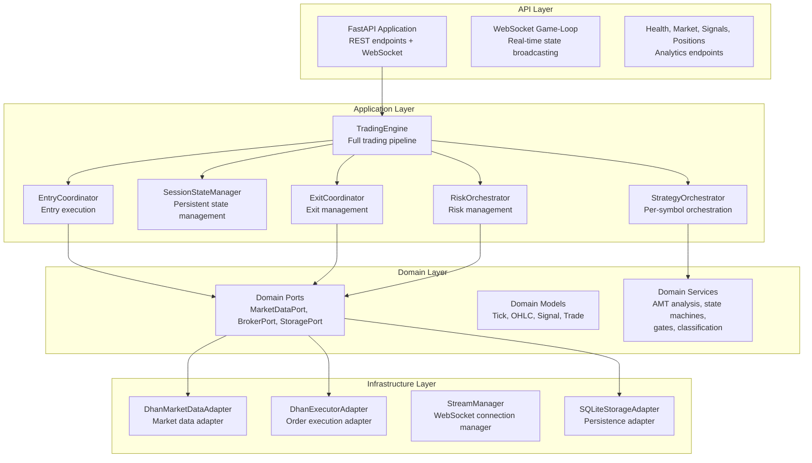
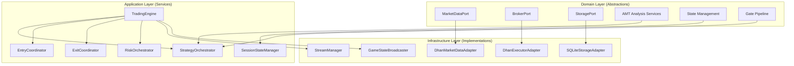
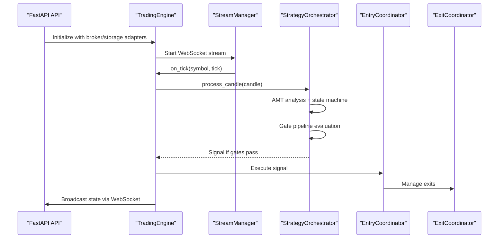
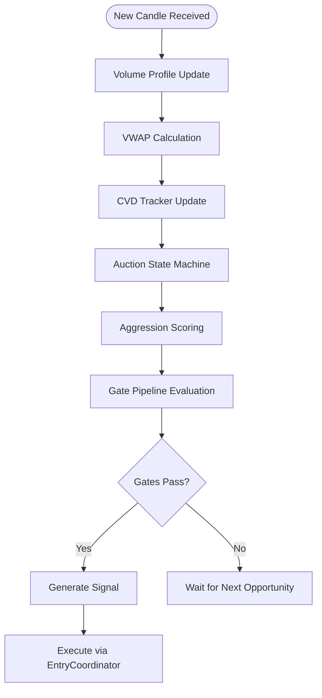
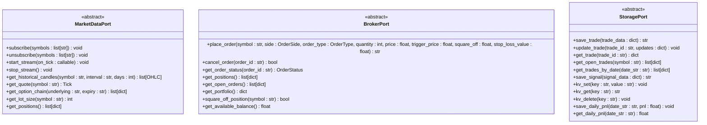
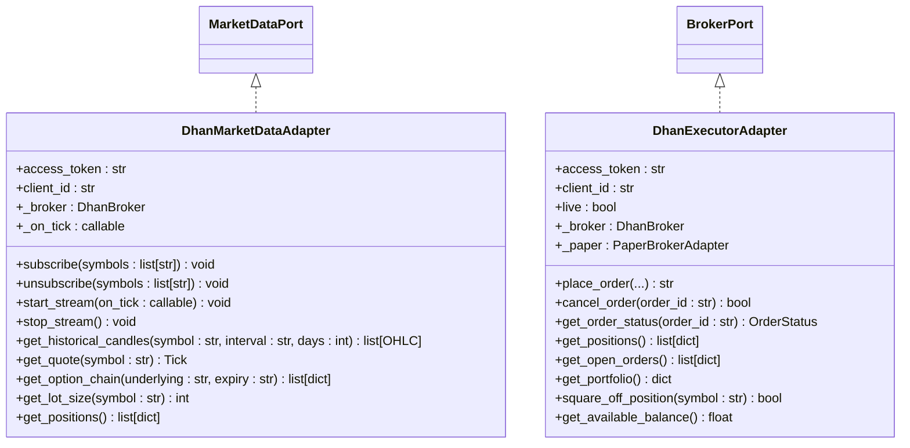
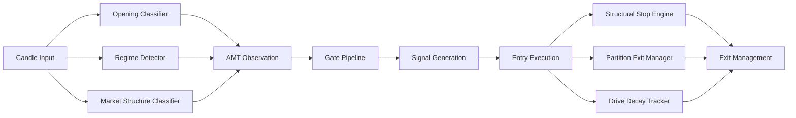
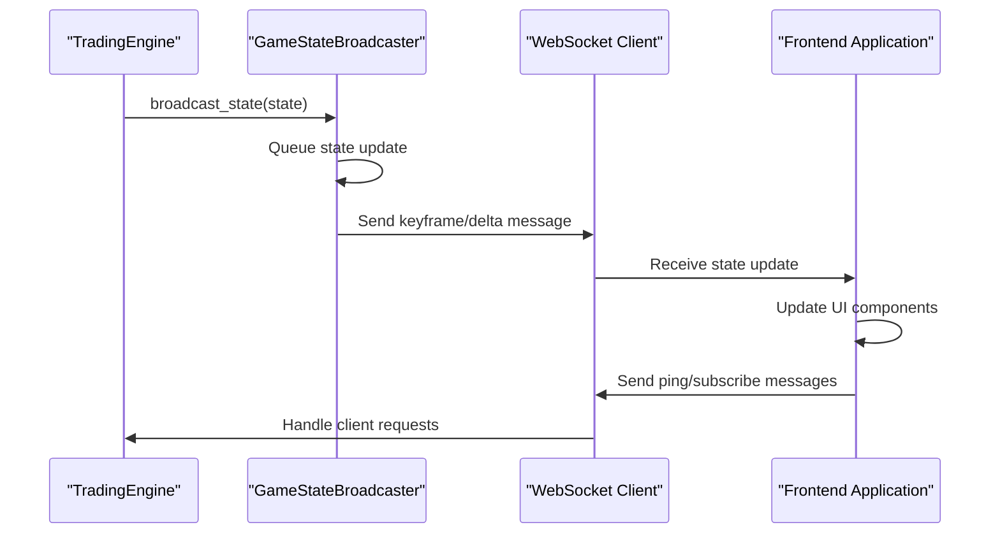
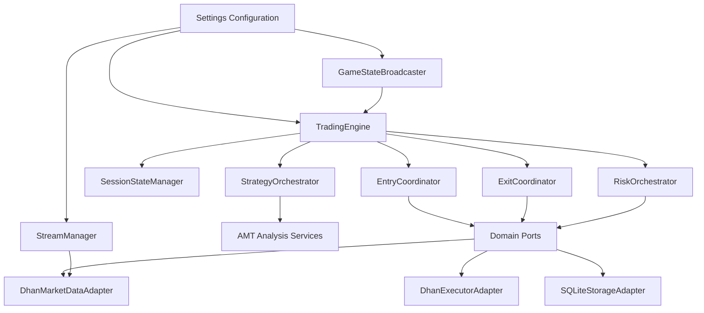

# Architecture Overview

<cite>
**Referenced Files in This Document**
- [appv2/backend/appv2/main.py](file://appv2/backend/appv2/main.py)
- [appv2/backend/appv2/application/trading_engine.py](file://appv2/backend/appv2/application/trading_engine.py)
- [appv2/backend/appv2/config/settings.py](file://appv2/backend/appv2/config/settings.py)
- [appv2/backend/appv2/domain/ports/market_data.py](file://appv2/backend/appv2/domain/ports/market_data.py)
- [appv2/backend/appv2/domain/ports/broker.py](file://appv2/backend/appv2/domain/ports/broker.py)
- [appv2/backend/appv2/domain/ports/storage.py](file://appv2/backend/appv2/domain/ports/storage.py)
- [appv2/backend/appv2/infrastructure/dhan_feed.py](file://appv2/backend/appv2/infrastructure/dhan_feed.py)
- [appv2/backend/appv2/infrastructure/dhan_executor.py](file://appv2/backend/appv2/infrastructure/dhan_executor.py)
- [appv2/backend/appv2/application/strategy_orchestrator.py](file://appv2/backend/appv2/application/strategy_orchestrator.py)
- [appv2/backend/appv2/application/session_state_manager.py](file://appv2/backend/appv2/application/session_state_manager.py)
- [appv2/backend/appv2/infrastructure/stream_manager.py](file://appv2/backend/appv2/infrastructure/stream_manager.py)
- [appv2/backend/appv2/api/state_broadcaster.py](file://appv2/backend/appv2/api/state_broadcaster.py)
</cite>

## Update Summary
**Changes Made**
- Complete architectural overhaul to document the new appv2 system with dependency inversion patterns
- Added comprehensive coverage of ports and adapters architecture with concrete implementations
- Documented service decomposition patterns and per-symbol orchestration
- Updated trading engine architecture with advanced AMT classification and exit management
- Enhanced domain-driven design documentation with clear separation between domain logic and infrastructure
- Added detailed coverage of hexagonal architecture principles and clean separation from external broker integrations

## Table of Contents
1. [Introduction](#introduction)
2. [Project Structure](#project-structure)
3. [Core Components](#core-components)
4. [Architecture Overview](#architecture-overview)
5. [Detailed Component Analysis](#detailed-component-analysis)
6. [Dependency Analysis](#dependency-analysis)
7. [Performance Considerations](#performance-considerations)
8. [Troubleshooting Guide](#troubleshooting-guide)
9. [Conclusion](#conclusion)

## Introduction
GlassyTrade AI v5 appv2 represents a major architectural evolution featuring production-grade domain-driven design (DDD) and event-driven architecture with dependency inversion patterns. The system implements Fabio Valentini's Auction Market Theory (AMT) methodology with AI-assisted entry decisions through a sophisticated hexagonal architecture that emphasizes clean separation between domain logic and external integrations. The new architecture introduces comprehensive service decomposition patterns, per-symbol orchestration, and advanced AMT classification capabilities.

## Project Structure
The appv2 backend follows a modern layered architecture with clear separation of concerns:

- **API Layer**: FastAPI endpoints with WebSocket game-loop for real-time state broadcasting
- **Application Layer**: Trading engine, orchestrators, and specialized services for per-symbol processing
- **Domain Layer**: Pure domain services, models, and ports defining abstractions
- **Infrastructure Layer**: Concrete adapters for market data, broker execution, and storage
- **Configuration Layer**: Pydantic-based settings management with environment variable validation

**Diagram sources**
- [appv2/backend/appv2/main.py:92-241](file://appv2/backend/appv2/main.py#L92-L241)
- [appv2/backend/appv2/application/trading_engine.py:77-638](file://appv2/backend/appv2/application/trading_engine.py#L77-L638)
- [appv2/backend/appv2/domain/ports/market_data.py:11-64](file://appv2/backend/appv2/domain/ports/market_data.py#L11-L64)

**Section sources**
- [appv2/backend/appv2/main.py:92-241](file://appv2/backend/appv2/main.py#L92-L241)
- [appv2/backend/appv2/application/trading_engine.py:77-638](file://appv2/backend/appv2/application/trading_engine.py#L77-L638)

## Core Components
- **TradingEngine**: Comprehensive trading engine managing all aspects of live trading with per-symbol orchestration
- **StrategyOrchestrator**: Per-symbol service handling AMT analysis, state machine evaluation, and gate pipeline execution
- **SessionStateManager**: Persistent state management with JSON serialization and storage integration
- **Domain Ports**: Clean abstractions for market data, broker execution, and storage operations
- **Concrete Adapters**: Production-ready implementations for Dhan market data and order execution
- **Service Decomposition**: Modular services for advanced AMT classification, exit management, and risk orchestration

**Section sources**
- [appv2/backend/appv2/application/trading_engine.py:77-638](file://appv2/backend/appv2/application/trading_engine.py#L77-L638)
- [appv2/backend/appv2/application/strategy_orchestrator.py:54-245](file://appv2/backend/appv2/application/strategy_orchestrator.py#L54-L245)
- [appv2/backend/appv2/application/session_state_manager.py:87-159](file://appv2/backend/appv2/application/session_state_manager.py#L87-L159)

## Architecture Overview
The appv2 system embraces modern architectural patterns:

- **Hexagonal Architecture (Ports & Adapters)**: Clean separation between domain logic and external systems
- **Dependency Inversion**: Domain services depend on abstractions, not concrete implementations
- **Service Decomposition**: Modular services for specialized trading functions
- **Per-Symbol Orchestration**: Isolated processing for each tradable symbol
- **Advanced AMT Classification**: Multiple layers of market structure analysis
- **Real-Time State Broadcasting**: WebSocket-based live updates for frontend consumers

**Diagram sources**
- [appv2/backend/appv2/domain/ports/market_data.py:11-64](file://appv2/backend/appv2/domain/ports/market_data.py#L11-L64)
- [appv2/backend/appv2/domain/ports/broker.py:9-53](file://appv2/backend/appv2/domain/ports/broker.py#L9-L53)
- [appv2/backend/appv2/domain/ports/storage.py:8-54](file://appv2/backend/appv2/domain/ports/storage.py#L8-L54)
- [appv2/backend/appv2/application/trading_engine.py:77-638](file://appv2/backend/appv2/application/trading_engine.py#L77-L638)

**Section sources**
- [appv2/backend/appv2/application/trading_engine.py:77-638](file://appv2/backend/appv2/application/trading_engine.py#L77-L638)
- [appv2/backend/appv2/domain/ports/market_data.py:11-64](file://appv2/backend/appv2/domain/ports/market_data.py#L11-L64)

## Detailed Component Analysis

### TradingEngine: Comprehensive Trading Pipeline
The TradingEngine serves as the central orchestrator managing all aspects of live trading operations. It implements a sophisticated pipeline that processes market data, executes trading decisions, and maintains real-time state synchronization.

**Diagram sources**
- [appv2/backend/appv2/application/trading_engine.py:219-427](file://appv2/backend/appv2/application/trading_engine.py#L219-L427)
- [appv2/backend/appv2/infrastructure/stream_manager.py:155-168](file://appv2/backend/appv2/infrastructure/stream_manager.py#L155-L168)

**Section sources**
- [appv2/backend/appv2/application/trading_engine.py:77-638](file://appv2/backend/appv2/application/trading_engine.py#L77-L638)

### StrategyOrchestrator: Per-Symbol AMT Processing
The StrategyOrchestrator provides per-symbol orchestration for AMT analysis, state machine evaluation, and gate pipeline execution. Each symbol maintains its own isolated processing context with dedicated services for volume profile analysis, market state evaluation, and signal generation.

**Diagram sources**
- [appv2/backend/appv2/application/strategy_orchestrator.py:75-136](file://appv2/backend/appv2/application/strategy_orchestrator.py#L75-L136)

**Section sources**
- [appv2/backend/appv2/application/strategy_orchestrator.py:54-245](file://appv2/backend/appv2/application/strategy_orchestrator.py#L54-L245)

### Domain Ports and Dependency Inversion
The domain layer defines clean abstractions that enable dependency inversion, allowing the system to remain agnostic of specific broker implementations while maintaining strong separation of concerns.

**Diagram sources**
- [appv2/backend/appv2/domain/ports/market_data.py:11-64](file://appv2/backend/appv2/domain/ports/market_data.py#L11-L64)
- [appv2/backend/appv2/domain/ports/broker.py:9-53](file://appv2/backend/appv2/domain/ports/broker.py#L9-L53)
- [appv2/backend/appv2/domain/ports/storage.py:8-54](file://appv2/backend/appv2/domain/ports/storage.py#L8-L54)

**Section sources**
- [appv2/backend/appv2/domain/ports/market_data.py:11-64](file://appv2/backend/appv2/domain/ports/market_data.py#L11-L64)
- [appv2/backend/appv2/domain/ports/broker.py:9-53](file://appv2/backend/appv2/domain/ports/broker.py#L9-L53)
- [appv2/backend/appv2/domain/ports/storage.py:8-54](file://appv2/backend/appv2/domain/ports/storage.py#L8-L54)

### Concrete Adapters: Production-Ready Implementations
The infrastructure layer provides production-ready implementations that adhere to the domain port abstractions, enabling seamless switching between different broker providers and execution modes.

**Diagram sources**
- [appv2/backend/appv2/infrastructure/dhan_feed.py:25-151](file://appv2/backend/appv2/infrastructure/dhan_feed.py#L25-L151)
- [appv2/backend/appv2/infrastructure/dhan_executor.py:22-168](file://appv2/backend/appv2/infrastructure/dhan_executor.py#L22-L168)

**Section sources**
- [appv2/backend/appv2/infrastructure/dhan_feed.py:25-151](file://appv2/backend/appv2/infrastructure/dhan_feed.py#L25-L151)
- [appv2/backend/appv2/infrastructure/dhan_executor.py:22-168](file://appv2/backend/appv2/infrastructure/dhan_executor.py#L22-L168)

### Advanced AMT Classification and Exit Management
The system incorporates sophisticated AMT classification capabilities including opening classification, regime detection, and market structure analysis, along with advanced exit management through structural stops and partition exits.

**Diagram sources**
- [appv2/backend/appv2/application/trading_engine.py:280-310](file://appv2/backend/appv2/application/trading_engine.py#L280-L310)
- [appv2/backend/appv2/application/trading_engine.py:158-160](file://appv2/backend/appv2/application/trading_engine.py#L158-L160)

**Section sources**
- [appv2/backend/appv2/application/trading_engine.py:148-180](file://appv2/backend/appv2/application/trading_engine.py#L148-L180)

### Real-Time State Broadcasting and Frontend Integration
The system provides comprehensive real-time state broadcasting through WebSocket connections, enabling frontend consumers to receive live updates without affecting trading operations.

**Diagram sources**
- [appv2/backend/appv2/api/state_broadcaster.py:44-82](file://appv2/backend/appv2/api/state_broadcaster.py#L44-L82)
- [appv2/backend/appv2/main.py:197-235](file://appv2/backend/appv2/main.py#L197-L235)

**Section sources**
- [appv2/backend/appv2/api/state_broadcaster.py:22-130](file://appv2/backend/appv2/api/state_broadcaster.py#L22-L130)
- [appv2/backend/appv2/main.py:197-235](file://appv2/backend/appv2/main.py#L197-L235)

## Dependency Analysis
The appv2 architecture implements clean dependency management through dependency inversion and service decomposition:

**Diagram sources**
- [appv2/backend/appv2/config/settings.py:12-123](file://appv2/backend/appv2/config/settings.py#L12-L123)
- [appv2/backend/appv2/application/trading_engine.py:86-180](file://appv2/backend/appv2/application/trading_engine.py#L86-L180)

**Section sources**
- [appv2/backend/appv2/config/settings.py:12-123](file://appv2/backend/appv2/config/settings.py#L12-L123)
- [appv2/backend/appv2/application/trading_engine.py:86-180](file://appv2/backend/appv2/application/trading_engine.py#L86-L180)

## Performance Considerations
- **Asynchronous Processing**: Non-blocking operations throughout the pipeline minimize latency and maximize throughput
- **Per-Symbol Isolation**: Each symbol maintains separate processing contexts, preventing cross-contamination and enabling independent scaling
- **Advanced Throttling**: Configurable throttling mechanisms prevent excessive processing while maintaining responsiveness
- **Efficient State Management**: Bounded memory usage with automatic cleanup and persistence integration
- **Real-Time Broadcasting**: Optimized WebSocket communication with delta compression and rate limiting
- **Heartbeat Monitoring**: Robust connection health monitoring with automatic reconnection and resubscription

## Troubleshooting Guide
- **Connection Issues**: StreamManager provides comprehensive heartbeat monitoring and automatic reconnection with exponential backoff
- **Broker Integration**: DhanExecutorAdapter gracefully handles both live and paper trading modes with fallback mechanisms
- **State Persistence**: SessionStateManager includes robust error handling and recovery for session state management
- **WebSocket Communication**: GameStateBroadcaster manages client connections with proper cleanup and error recovery
- **Configuration Validation**: Pydantic-based settings provide runtime validation with clear error messages for misconfiguration

**Section sources**
- [appv2/backend/appv2/infrastructure/stream_manager.py:169-256](file://appv2/backend/appv2/infrastructure/stream_manager.py#L169-L256)
- [appv2/backend/appv2/infrastructure/dhan_executor.py:37-57](file://appv2/backend/appv2/infrastructure/dhan_executor.py#L37-L57)
- [appv2/backend/appv2/application/session_state_manager.py:122-154](file://appv2/backend/appv2/application/session_state_manager.py#L122-L154)

## Conclusion
GlassyTrade AI v5 appv2 represents a mature, production-grade trading system built on modern architectural principles including domain-driven design, dependency inversion, and hexagonal architecture. The system's comprehensive service decomposition enables maintainability, scalability, and robustness while maintaining clean separation between domain logic and external integrations. The advanced AMT classification capabilities, real-time state broadcasting, and sophisticated risk management demonstrate the system's capability to handle complex live trading scenarios with reliability and performance.