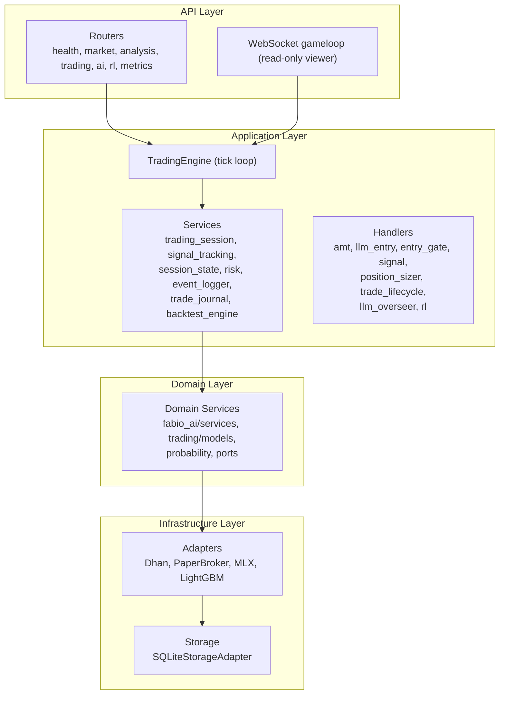
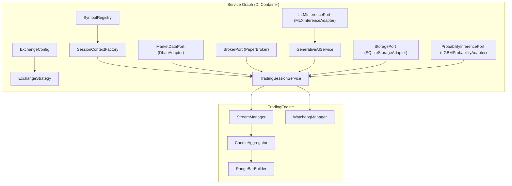
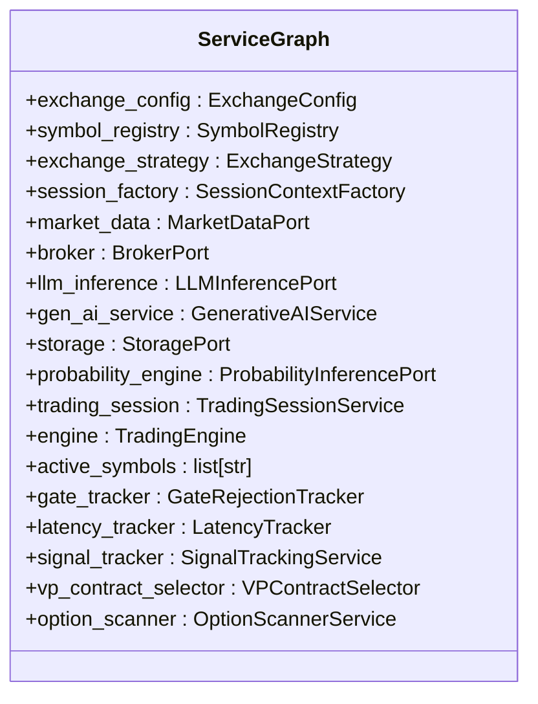
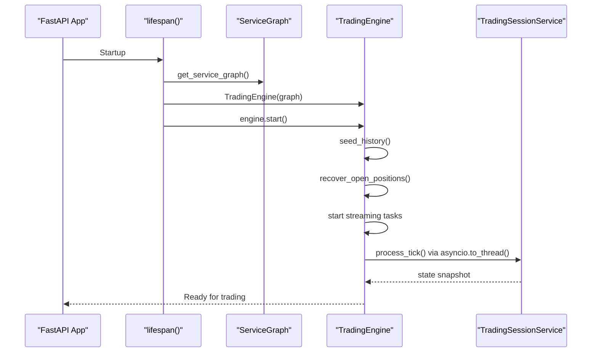
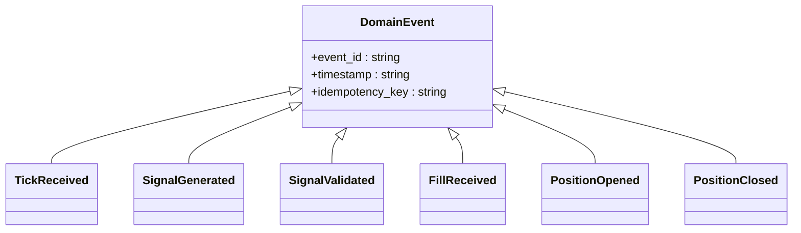
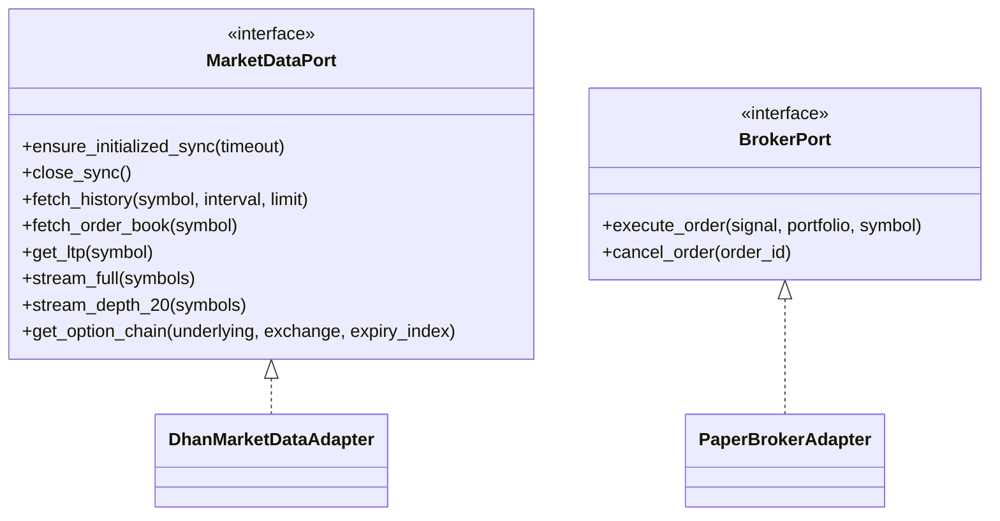
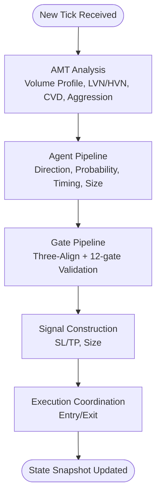
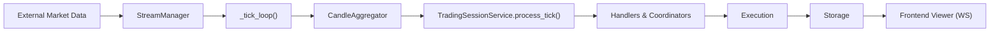
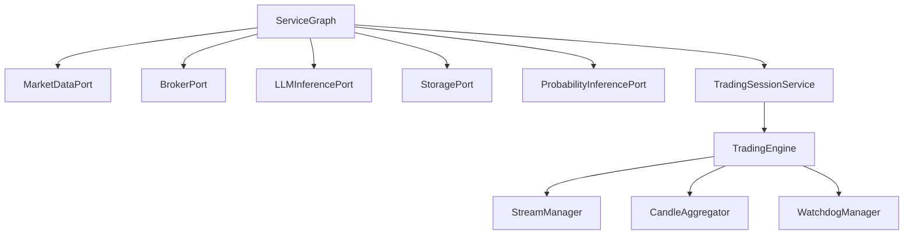

# Architecture Overview

<cite>
**Referenced Files in This Document**
- [backend/app/main.py](file://backend/app/main.py)
- [backend/app/config.py](file://backend/app/config.py)
- [ARCHITECTURE.md](file://ARCHITECTURE.md)
- [backend/docs/architecture.md](file://backend/docs/architecture.md)
- [backend/app/api/dependencies.py](file://backend/app/api/dependencies.py)
- [backend/app/application/engine.py](file://backend/app/application/engine.py)
- [backend/app/application/services/trading_session.py](file://backend/app/application/services/trading_session.py)
- [backend/app/domain/trading/events.py](file://backend/app/domain/trading/events.py)
- [backend/app/domain/ports/market_data.py](file://backend/app/domain/ports/market_data.py)
- [backend/app/infrastructure/adapters/dhan_adapter.py](file://backend/app/infrastructure/adapters/dhan_adapter.py)
- [backend/app/infrastructure/adapters/paper_broker.py](file://backend/app/infrastructure/adapters/paper_broker.py)
- [backend/app/domain/fabio_ai/services/amt_analyzer.py](file://backend/app/domain/fabio_ai/services/amt_analyzer.py)
</cite>

## Table of Contents
1. [Introduction](#introduction)
2. [Project Structure](#project-structure)
3. [Core Components](#core-components)
4. [Architecture Overview](#architecture-overview)
5. [Detailed Component Analysis](#detailed-component-analysis)
6. [Dependency Analysis](#dependency-analysis)
7. [Performance Considerations](#performance-considerations)
8. [Troubleshooting Guide](#troubleshooting-guide)
9. [Conclusion](#conclusion)

## Introduction
GlassyTrade AI v5 is a production-grade, domain-driven design (DDD) and event-driven trading system implementing Fabio Valentini’s Auction Market Theory (AMT) methodology with AI-assisted entry decisions. The system follows a hexagonal (ports & adapters) architecture to isolate domain logic from external integrations (brokers, market data, inference engines). It features a standalone trading engine that continuously operates independent of frontend connections, ensuring uninterrupted trading while the frontend acts as a read-only viewer.

## Project Structure
The backend is organized into layered packages:
- API Layer: FastAPI routers and WebSocket endpoints
- Application Layer: Trading engine, services, and handlers
- Domain Layer: Pure domain services, models, and ports
- Infrastructure Layer: Adapters for market data, broker, inference, and storage
- Pipeline Layer: NiFi-style channels connecting ingestion to execution

**Diagram sources**
- [backend/docs/architecture.md:12-52](file://backend/docs/architecture.md#L12-L52)
- [ARCHITECTURE.md:41-105](file://ARCHITECTURE.md#L41-L105)

**Section sources**
- [backend/docs/architecture.md:12-52](file://backend/docs/architecture.md#L12-L52)
- [ARCHITECTURE.md:41-105](file://ARCHITECTURE.md#L41-L105)

## Core Components
- Service Graph (DI Container): Singleton factory wiring all adapters, services, and strategies at startup
- TradingEngine: Standalone event loop that streams market data, aggregates candles, and coordinates the trading pipeline
- TradingSessionService: Orchestrates per-symbol state, delegates to focused handlers, and manages risk and lifecycle
- Domain Ports: Abstractions for market data, broker, LLM inference, storage, and probability engines
- Hexagonal Adapters: Concrete implementations for Dhan market data, paper broker, MLX inference, and SQLite storage

**Section sources**
- [backend/app/api/dependencies.py:43-327](file://backend/app/api/dependencies.py#L43-L327)
- [backend/app/application/engine.py:59-126](file://backend/app/application/engine.py#L59-L126)
- [backend/app/application/services/trading_session.py:85-232](file://backend/app/application/services/trading_session.py#L85-L232)
- [backend/app/domain/ports/market_data.py:19-112](file://backend/app/domain/ports/market_data.py#L19-L112)

## Architecture Overview
GlassyTrade AI v5 embraces:
- DDD + Hexagonal (Ports & Adapters) + Event-Driven + Pipeline (NiFi-style)
- Layered architecture separating domain logic, application orchestration, and infrastructure concerns
- Service Graph dependency injection pattern for component lifecycle management
- Standalone trading engine decoupled from frontend connections

**Diagram sources**
- [backend/app/api/dependencies.py:43-327](file://backend/app/api/dependencies.py#L43-L327)
- [backend/app/application/engine.py:107-123](file://backend/app/application/engine.py#L107-L123)

**Section sources**
- [ARCHITECTURE.md:663-732](file://ARCHITECTURE.md#L663-L732)
- [backend/app/api/dependencies.py:43-327](file://backend/app/api/dependencies.py#L43-L327)

## Detailed Component Analysis

### Service Graph and Dependency Injection
The Service Graph is a singleton factory that constructs and wires all components at application startup. It encapsulates exchange configuration, symbol registry, exchange strategy, and creates adapters for market data, broker, inference, and storage. It also initializes optional services like alerting, profiling, and scanning, and assigns references to the trading session and trackers.

**Diagram sources**
- [backend/app/api/dependencies.py:43-327](file://backend/app/api/dependencies.py#L43-L327)

**Section sources**
- [backend/app/api/dependencies.py:324-384](file://backend/app/api/dependencies.py#L324-L384)

### Standalone Trading Engine
The TradingEngine runs independently of frontend connections. It seeds historical data, recovers open positions, streams ticks, aggregates candles, and coordinates the trading pipeline. It exposes read-only access for frontend viewers and supports immediate state updates triggered from background threads.

**Diagram sources**
- [backend/app/main.py:83-127](file://backend/app/main.py#L83-L127)
- [backend/app/application/engine.py:131-177](file://backend/app/application/engine.py#L131-L177)
- [backend/app/application/services/trading_session.py:233-417](file://backend/app/application/services/trading_session.py#L233-L417)

**Section sources**
- [backend/app/main.py:83-127](file://backend/app/main.py#L83-L127)
- [backend/app/application/engine.py:131-177](file://backend/app/application/engine.py#L131-L177)

### Event-Driven Pipeline and Domain Events
The system uses immutable domain events to capture state changes and drive reactions across handlers. Events flow through the system to ensure idempotency, auditability, and clean separation of concerns.

**Diagram sources**
- [backend/app/domain/trading/events.py:39-499](file://backend/app/domain/trading/events.py#L39-L499)

**Section sources**
- [backend/app/domain/trading/events.py:39-499](file://backend/app/domain/trading/events.py#L39-L499)

### Hexagonal Architecture and Ports
The domain defines abstract ports for market data, broker, LLM inference, storage, and probability engines. Concrete adapters implement these ports, enabling clean isolation from external systems like Dhan market data and paper broker execution.

**Diagram sources**
- [backend/app/domain/ports/market_data.py:19-112](file://backend/app/domain/ports/market_data.py#L19-L112)
- [backend/app/infrastructure/adapters/dhan_adapter.py:66-457](file://backend/app/infrastructure/adapters/dhan_adapter.py#L66-L457)
- [backend/app/infrastructure/adapters/paper_broker.py:118-199](file://backend/app/infrastructure/adapters/paper_broker.py#L118-L199)

**Section sources**
- [backend/app/domain/ports/market_data.py:19-112](file://backend/app/domain/ports/market_data.py#L19-L112)
- [backend/app/infrastructure/adapters/dhan_adapter.py:66-457](file://backend/app/infrastructure/adapters/dhan_adapter.py#L66-L457)
- [backend/app/infrastructure/adapters/paper_broker.py:118-199](file://backend/app/infrastructure/adapters/paper_broker.py#L118-L199)

### AMT Analysis and Gate Pipeline
The AMT analyzer computes volume profiles, LVN/HVN detection, aggression scoring, and market state assessment. These results feed the agent pipeline and gate validation stages, culminating in signal generation and execution coordination.

**Diagram sources**
- [backend/app/domain/fabio_ai/services/amt_analyzer.py:623-838](file://backend/app/domain/fabio_ai/services/amt_analyzer.py#L623-L838)
- [backend/app/application/services/trading_session.py:461-517](file://backend/app/application/services/trading_session.py#L461-L517)

**Section sources**
- [backend/app/domain/fabio_ai/services/amt_analyzer.py:623-838](file://backend/app/domain/fabio_ai/services/amt_analyzer.py#L623-L838)
- [backend/app/application/services/trading_session.py:461-517](file://backend/app/application/services/trading_session.py#L461-L517)

### Conceptual Overview
The system’s data flow moves from external feeds to the trading engine, through the session coordinator, and into execution. The frontend connects via WebSocket to receive state updates without affecting trading continuity.

**Diagram sources**
- [ARCHITECTURE.md:330-474](file://ARCHITECTURE.md#L330-L474)
- [backend/app/application/engine.py:628-800](file://backend/app/application/engine.py#L628-L800)

**Section sources**
- [ARCHITECTURE.md:330-474](file://ARCHITECTURE.md#L330-L474)
- [backend/app/application/engine.py:628-800](file://backend/app/application/engine.py#L628-L800)

## Dependency Analysis
The Service Graph centralizes component creation and wiring. Dependencies are injected into the TradingEngine and TradingSessionService, ensuring loose coupling and testability.

**Diagram sources**
- [backend/app/api/dependencies.py:43-327](file://backend/app/api/dependencies.py#L43-L327)
- [backend/app/application/engine.py:107-123](file://backend/app/application/engine.py#L107-L123)

**Section sources**
- [backend/app/api/dependencies.py:43-327](file://backend/app/api/dependencies.py#L43-L327)
- [backend/app/application/engine.py:107-123](file://backend/app/application/engine.py#L107-L123)

## Performance Considerations
- Asynchronous streaming and event loops minimize blocking and maximize throughput
- Historical seeding and position recovery reduce downtime and improve continuity
- Throttling and circuit breakers protect against overload and malformed data
- Background thread-based persistence reduces write contention

## Troubleshooting Guide
- Model readiness and validation: The backend waits for the LLM model to be ready and validates inference before accepting connections
- Graceful shutdown: The engine stops streaming, flushes pending ticks, shuts down thread pools, and disconnects market data feeds
- Watchdog and stale stream detection: Health monitoring and stale stream watchdogs keep the engine resilient
- Error handling utilities: Centralized error handling and logging facilitate debugging and recovery

**Section sources**
- [backend/app/main.py:88-169](file://backend/app/main.py#L88-L169)
- [backend/app/application/engine.py:178-208](file://backend/app/application/engine.py#L178-L208)
- [backend/app/application/services/trading_session.py:422-458](file://backend/app/application/services/trading_session.py#L422-L458)

## Conclusion
GlassyTrade AI v5 demonstrates a mature, production-grade trading system built on DDD, hexagonal architecture, and event-driven pipelines. The Service Graph dependency injection pattern ensures clean component lifecycle management, while the standalone TradingEngine guarantees continuous trading operations independent of frontend connectivity. The hexagonal design cleanly isolates domain logic from external integrations, enabling maintainability, scalability, and robustness in live trading environments.