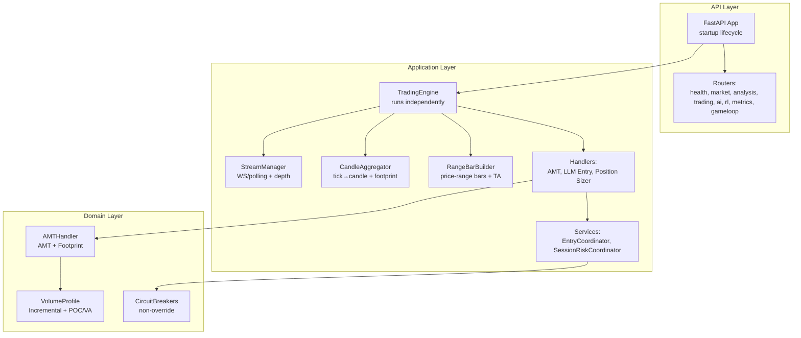
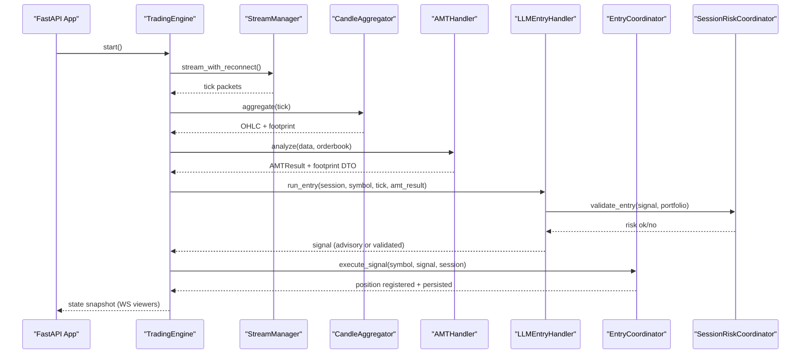
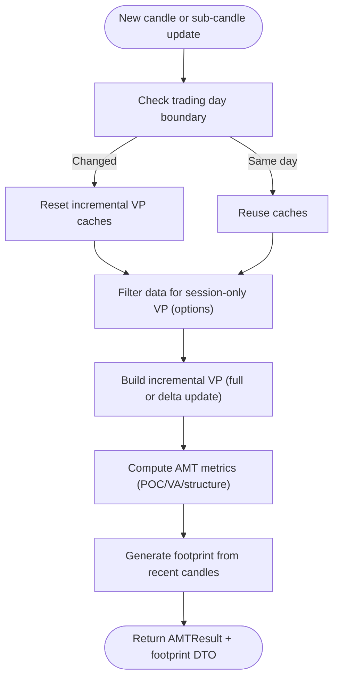
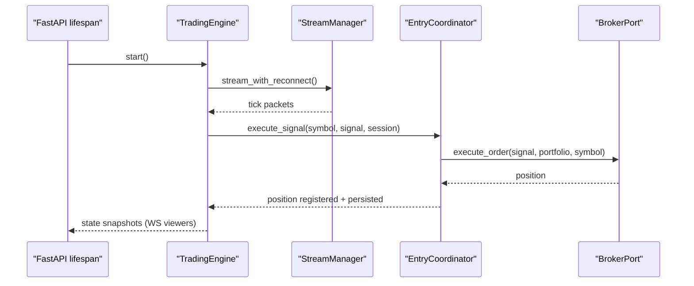
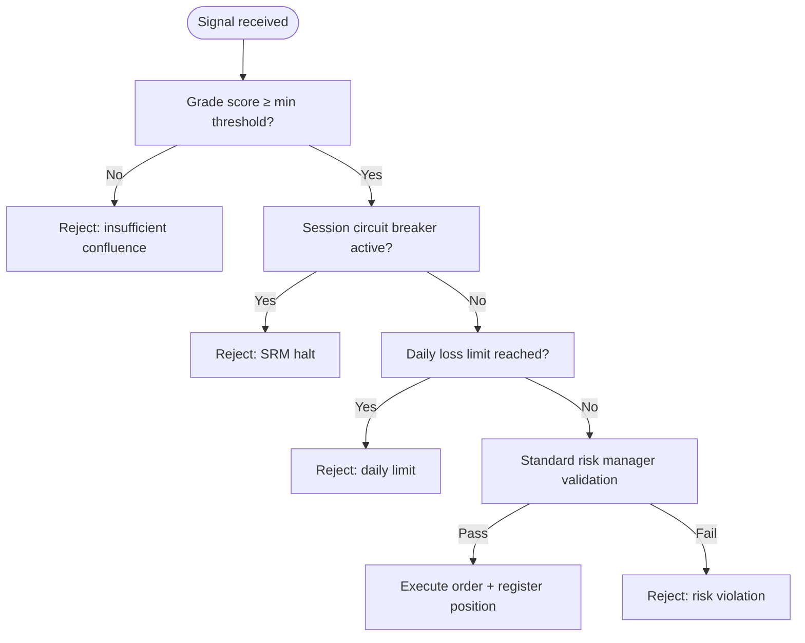
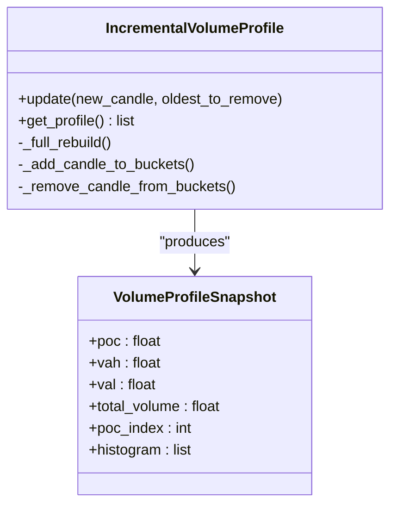
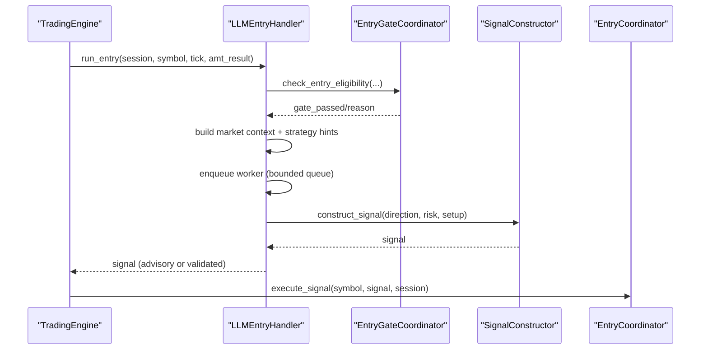
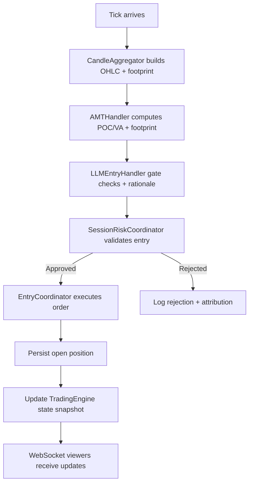
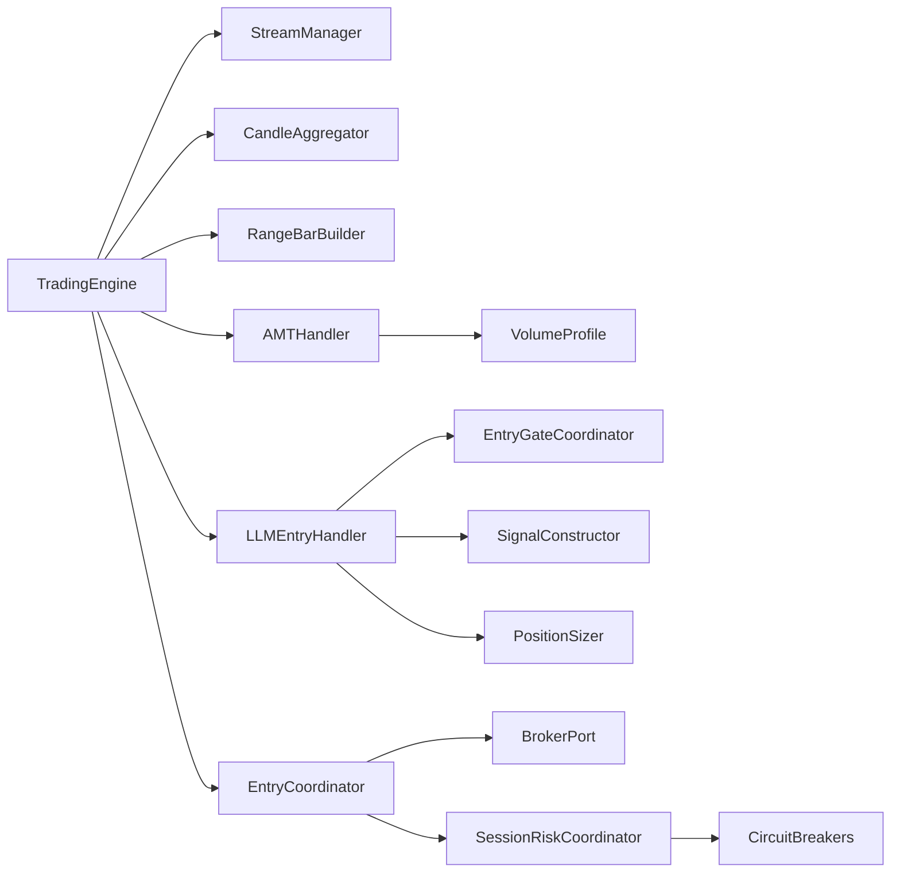

# Core Features

<cite>
**Referenced Files in This Document**
- [backend/app/main.py](file://backend/app/main.py)
- [backend/app/application/engine.py](file://backend/app/application/engine.py)
- [backend/app/application/stream_manager.py](file://backend/app/application/stream_manager.py)
- [backend/app/application/candle_aggregator.py](file://backend/app/application/candle_aggregator.py)
- [backend/app/application/range_bar_builder.py](file://backend/app/application/range_bar_builder.py)
- [backend/app/application/handlers/amt_handler.py](file://backend/app/application/handlers/amt_handler.py)
- [backend/app/application/handlers/llm_entry_handler.py](file://backend/app/application/handlers/llm_entry_handler.py)
- [backend/app/application/handlers/position_sizer.py](file://backend/app/application/handlers/position_sizer.py)
- [backend/app/application/services/entry_coordinator.py](file://backend/app/application/services/entry_coordinator.py)
- [backend/app/application/services/session_risk_coordinator.py](file://backend/app/application/services/session_risk_coordinator.py)
- [backend/app/domain/services/circuit_breakers.py](file://backend/app/domain/services/circuit_breakers.py)
- [backend/app/domain/services/volume_profile.py](file://backend/app/domain/services/volume_profile.py)
</cite>

## Table of Contents
1. [Introduction](#introduction)
2. [Project Structure](#project-structure)
3. [Core Components](#core-components)
4. [Architecture Overview](#architecture-overview)
5. [Detailed Component Analysis](#detailed-component-analysis)
6. [Dependency Analysis](#dependency-analysis)
7. [Performance Considerations](#performance-considerations)
8. [Troubleshooting Guide](#troubleshooting-guide)
9. [Conclusion](#conclusion)

## Introduction
This document explains the GlassyTrade AI v5 core features that enable production-ready algorithmic trading. It covers:
- Real-time market analysis grounded in Fabio Valentini’s Auction Market Theory (AMT), including multi-timeframe structural analysis and order flow insights
- Automated trading execution that operates independently of frontend connectivity
- Position sizing and risk management controls, including non-overridable circuit breakers
- Order flow analysis: volume profile construction, footprint analysis, and market state classification
- Generative AI integration for entry gate evaluation, rationale generation, and adaptive trading strategies
- Practical feature interactions and end-to-end trading lifecycle

## Project Structure
GlassyTrade AI v5 is a FastAPI-based backend implementing a Domain-Driven Design (DDD) and event-driven architecture. The trading engine runs continuously, decoupled from the frontend, while the API exposes health, market, analysis, trading, AI, RL, metrics, and WebSocket endpoints.

**Diagram sources**
- [backend/app/main.py:171-227](file://backend/app/main.py#L171-L227)
- [backend/app/application/engine.py:59-126](file://backend/app/application/engine.py#L59-L126)
- [backend/app/application/stream_manager.py:32-65](file://backend/app/application/stream_manager.py#L32-L65)
- [backend/app/application/candle_aggregator.py:73-96](file://backend/app/application/candle_aggregator.py#L73-L96)
- [backend/app/application/range_bar_builder.py:74-95](file://backend/app/application/range_bar_builder.py#L74-L95)
- [backend/app/application/handlers/amt_handler.py:45-66](file://backend/app/application/handlers/amt_handler.py#L45-L66)
- [backend/app/application/services/entry_coordinator.py:41-65](file://backend/app/application/services/entry_coordinator.py#L41-L65)
- [backend/app/domain/services/volume_profile.py:293-321](file://backend/app/domain/services/volume_profile.py#L293-L321)
- [backend/app/domain/services/circuit_breakers.py:44-63](file://backend/app/domain/services/circuit_breakers.py#L44-L63)

**Section sources**
- [backend/app/main.py:83-127](file://backend/app/main.py#L83-L127)
- [backend/app/application/engine.py:131-177](file://backend/app/application/engine.py#L131-L177)

## Core Components
- TradingEngine: continuous market data ingestion, candle aggregation, AMT/order flow analysis, state snapshot building, and independent execution
- StreamManager: robust WS/polling dual-stream with depth, fallback, and staleness detection
- CandleAggregator: tick-to-candle aggregation with VWAP, delta, and footprint accumulation
- RangeBarBuilder: price-range bars for visualization and Triple-A pattern detection
- AMTHandler: AMT analysis and footprint generation with incremental volume profile
- LLMEntryHandler: AI-driven entry gating, rationale generation, and advisory signals
- EntryCoordinator: validates signals, enriches with options, executes orders, registers positions
- SessionRiskCoordinator: session-level risk, circuit breakers, and tiered risk engines
- CircuitBreakers: non-overridable hard stops for drawdown, profit target, and consecutive losses

**Section sources**
- [backend/app/application/engine.py:59-126](file://backend/app/application/engine.py#L59-L126)
- [backend/app/application/stream_manager.py:32-65](file://backend/app/application/stream_manager.py#L32-L65)
- [backend/app/application/candle_aggregator.py:73-96](file://backend/app/application/candle_aggregator.py#L73-L96)
- [backend/app/application/range_bar_builder.py:74-95](file://backend/app/application/range_bar_builder.py#L74-L95)
- [backend/app/application/handlers/amt_handler.py:45-66](file://backend/app/application/handlers/amt_handler.py#L45-L66)
- [backend/app/application/handlers/llm_entry_handler.py:61-95](file://backend/app/application/handlers/llm_entry_handler.py#L61-L95)
- [backend/app/application/services/entry_coordinator.py:41-65](file://backend/app/application/services/entry_coordinator.py#L41-L65)
- [backend/app/application/services/session_risk_coordinator.py:43-71](file://backend/app/application/services/session_risk_coordinator.py#L43-L71)
- [backend/app/domain/services/circuit_breakers.py:44-63](file://backend/app/domain/services/circuit_breakers.py#L44-L63)

## Architecture Overview
GlassyTrade AI v5 runs a standalone trading engine at startup. The frontend connects via WebSocket to view state snapshots; disconnections do not affect execution. Market data is ingested via StreamManager, aggregated into candles, and processed through AMT and order flow analyzers. The LLMEntryHandler evaluates entry gates and generates rationales. EntryCoordinator executes validated signals and persists positions. SessionRiskCoordinator enforces risk caps and circuit breakers.

**Diagram sources**
- [backend/app/main.py:108-126](file://backend/app/main.py#L108-L126)
- [backend/app/application/engine.py:620-800](file://backend/app/application/engine.py#L620-L800)
- [backend/app/application/stream_manager.py:135-294](file://backend/app/application/stream_manager.py#L135-L294)
- [backend/app/application/candle_aggregator.py:114-256](file://backend/app/application/candle_aggregator.py#L114-L256)
- [backend/app/application/handlers/amt_handler.py:89-181](file://backend/app/application/handlers/amt_handler.py#L89-L181)
- [backend/app/application/handlers/llm_entry_handler.py:379-460](file://backend/app/application/handlers/llm_entry_handler.py#L379-L460)
- [backend/app/application/services/entry_coordinator.py:66-111](file://backend/app/application/services/entry_coordinator.py#L66-L111)
- [backend/app/application/services/session_risk_coordinator.py:169-211](file://backend/app/application/services/session_risk_coordinator.py#L169-L211)

## Detailed Component Analysis

### Real-Time Market Analysis with AMT and Multi-Timeframe Structural Analysis
- AMTHandler builds incremental volume profiles and computes POC/VAH/VAL efficiently, caching profile arrays between sub-candle updates. It integrates footprint analysis and session-only VP filtering for options.
- CandleAggregator converts ticks to candles, computes VWAP, delta, and accumulates footprint data per candle.
- RangeBarBuilder creates price-range bars, enabling visualization and Triple-A pattern detection, and computes leg and session volume profiles.

**Diagram sources**
- [backend/app/application/handlers/amt_handler.py:89-181](file://backend/app/application/handlers/amt_handler.py#L89-L181)
- [backend/app/domain/services/volume_profile.py:293-491](file://backend/app/domain/services/volume_profile.py#L293-L491)
- [backend/app/application/candle_aggregator.py:258-301](file://backend/app/application/candle_aggregator.py#L258-L301)
- [backend/app/application/range_bar_builder.py:388-482](file://backend/app/application/range_bar_builder.py#L388-L482)

**Section sources**
- [backend/app/application/handlers/amt_handler.py:89-181](file://backend/app/application/handlers/amt_handler.py#L89-L181)
- [backend/app/domain/services/volume_profile.py:293-491](file://backend/app/domain/services/volume_profile.py#L293-L491)
- [backend/app/application/candle_aggregator.py:114-256](file://backend/app/application/candle_aggregator.py#L114-L256)
- [backend/app/application/range_bar_builder.py:148-217](file://backend/app/application/range_bar_builder.py#L148-L217)

### Automated Trading Execution Independent of Frontend
- TradingEngine starts on server startup, initializes delegated modules, seeds history, and begins streaming. It exposes read-only state snapshots for WebSocket viewers and supports immediate updates triggered from background threads.
- StreamManager provides dual-streaming (full + depth) with fallback polling and staleness detection.
- EntryCoordinator executes validated signals, enriches with option selection, registers positions, publishes events, and persists open positions.

**Diagram sources**
- [backend/app/main.py:108-126](file://backend/app/main.py#L108-L126)
- [backend/app/application/engine.py:131-177](file://backend/app/application/engine.py#L131-L177)
- [backend/app/application/stream_manager.py:135-294](file://backend/app/application/stream_manager.py#L135-L294)
- [backend/app/application/services/entry_coordinator.py:66-111](file://backend/app/application/services/entry_coordinator.py#L66-L111)

**Section sources**
- [backend/app/application/engine.py:131-177](file://backend/app/application/engine.py#L131-L177)
- [backend/app/application/stream_manager.py:135-294](file://backend/app/application/stream_manager.py#L135-L294)
- [backend/app/application/services/entry_coordinator.py:66-111](file://backend/app/application/services/entry_coordinator.py#L66-L111)

### Position Sizing, Risk Management, and Circuit Breakers
- SessionRiskCoordinator validates entries against confluence grade thresholds, session circuit breakers, daily loss limits, and standard risk manager constraints.
- CircuitBreakers enforce non-overridable hard stops: consecutive losses (with separate thresholds for winning/losing streaks), daily drawdown limits, and profit target locks.
- EntryCoordinator enforces risk validation and option selection enrichment before execution.

**Diagram sources**
- [backend/app/application/services/session_risk_coordinator.py:169-211](file://backend/app/application/services/session_risk_coordinator.py#L169-L211)
- [backend/app/domain/services/circuit_breakers.py:64-105](file://backend/app/domain/services/circuit_breakers.py#L64-L105)
- [backend/app/application/services/entry_coordinator.py:155-179](file://backend/app/application/services/entry_coordinator.py#L155-L179)

**Section sources**
- [backend/app/application/services/session_risk_coordinator.py:169-211](file://backend/app/application/services/session_risk_coordinator.py#L169-L211)
- [backend/app/domain/services/circuit_breakers.py:64-105](file://backend/app/domain/services/circuit_breakers.py#L64-L105)
- [backend/app/application/services/entry_coordinator.py:155-179](file://backend/app/application/services/entry_coordinator.py#L155-L179)

### Order Flow Analysis: Volume Profile, Footprint, and Market State Classification
- VolumeProfile (IncrementalVolumeProfile) maintains bucketed volume-at-price histograms and recomputes POC/VA efficiently on new candles.
- Footprint analysis is integrated into AMTHandler and CandleAggregator footprint accumulation.
- Market state classification and structural signals are derived from AMT metrics (aggression, structure confidence, LVNs/HVNs, CVD slope, etc.).

**Diagram sources**
- [backend/app/domain/services/volume_profile.py:293-491](file://backend/app/domain/services/volume_profile.py#L293-L491)

**Section sources**
- [backend/app/domain/services/volume_profile.py:293-491](file://backend/app/domain/services/volume_profile.py#L293-L491)
- [backend/app/application/handlers/amt_handler.py:176-178](file://backend/app/application/handlers/amt_handler.py#L176-L178)
- [backend/app/application/candle_aggregator.py:258-301](file://backend/app/application/candle_aggregator.py#L258-L301)

### Generative AI Integration: Entry Gate Evaluation, Rationale Generation, Adaptive Strategies
- LLMEntryHandler orchestrates gate checking, builds market context, and enqueues LLM inference per symbol with bounded queues and worker threads.
- It applies safety nets (buy-only mode, VWAP extremes), computes attribution, and logs rejections/journals.
- PositionSizer is imported from the domain layer for sizing logic.

**Diagram sources**
- [backend/app/application/handlers/llm_entry_handler.py:379-460](file://backend/app/application/handlers/llm_entry_handler.py#L379-L460)
- [backend/app/application/handlers/llm_entry_handler.py:782-800](file://backend/app/application/handlers/llm_entry_handler.py#L782-L800)
- [backend/app/application/handlers/position_sizer.py:1-10](file://backend/app/application/handlers/position_sizer.py#L1-L10)

**Section sources**
- [backend/app/application/handlers/llm_entry_handler.py:61-95](file://backend/app/application/handlers/llm_entry_handler.py#L61-L95)
- [backend/app/application/handlers/llm_entry_handler.py:379-460](file://backend/app/application/handlers/llm_entry_handler.py#L379-L460)
- [backend/app/application/handlers/position_sizer.py:1-10](file://backend/app/application/handlers/position_sizer.py#L1-L10)

### Practical Feature Interactions and End-to-End Example
- Scenario: New candle forms → AMTHandler updates VP and computes AMT metrics → LLMEntryHandler evaluates gates and builds rationale → SessionRiskCoordinator validates risk → EntryCoordinator executes order and persists position → TradingEngine updates state snapshots for WS viewers.

**Diagram sources**
- [backend/app/application/candle_aggregator.py:114-256](file://backend/app/application/candle_aggregator.py#L114-L256)
- [backend/app/application/handlers/amt_handler.py:89-181](file://backend/app/application/handlers/amt_handler.py#L89-L181)
- [backend/app/application/handlers/llm_entry_handler.py:379-460](file://backend/app/application/handlers/llm_entry_handler.py#L379-L460)
- [backend/app/application/services/session_risk_coordinator.py:169-211](file://backend/app/application/services/session_risk_coordinator.py#L169-L211)
- [backend/app/application/services/entry_coordinator.py:66-111](file://backend/app/application/services/entry_coordinator.py#L66-L111)
- [backend/app/application/engine.py:303-358](file://backend/app/application/engine.py#L303-L358)

**Section sources**
- [backend/app/application/engine.py:303-358](file://backend/app/application/engine.py#L303-L358)

## Dependency Analysis
- Engine depends on StreamManager, CandleAggregator, RangeBarBuilder, and WatchdogManager.
- AMTHandler depends on AMTAnalyzer and FootprintAnalyzer; integrates CandleAggregator footprint.
- LLMEntryHandler composes EntryGateCoordinator, SignalConstructor, and PositionSizer.
- EntryCoordinator depends on BrokerPort, TradeLifecycleHandler, EventLogger, StoragePort, RiskCoordinator, OptionSelector, and SessionStateManager.
- SessionRiskCoordinator aggregates RiskManager, SessionRiskManager, and optional RiskTierEngine.

**Diagram sources**
- [backend/app/application/engine.py:107-117](file://backend/app/application/engine.py#L107-L117)
- [backend/app/application/handlers/amt_handler.py:9-11](file://backend/app/application/handlers/amt_handler.py#L9-L11)
- [backend/app/application/handlers/llm_entry_handler.py:92-94](file://backend/app/application/handlers/llm_entry_handler.py#L92-L94)
- [backend/app/application/services/entry_coordinator.py:48-64](file://backend/app/application/services/entry_coordinator.py#L48-L64)
- [backend/app/application/services/session_risk_coordinator.py:50-71](file://backend/app/application/services/session_risk_coordinator.py#L50-L71)
- [backend/app/domain/services/circuit_breakers.py:44-63](file://backend/app/domain/services/circuit_breakers.py#L44-L63)

**Section sources**
- [backend/app/application/engine.py:107-117](file://backend/app/application/engine.py#L107-L117)
- [backend/app/application/handlers/llm_entry_handler.py:92-94](file://backend/app/application/handlers/llm_entry_handler.py#L92-L94)
- [backend/app/application/services/entry_coordinator.py:48-64](file://backend/app/application/services/entry_coordinator.py#L48-L64)
- [backend/app/application/services/session_risk_coordinator.py:50-71](file://backend/app/application/services/session_risk_coordinator.py#L50-L71)

## Performance Considerations
- Incremental volume profile updates minimize recomputation to new candles and short windows for developing VA.
- Sub-candle throttling reduces redundant state updates and frontend redraws.
- Dual-streaming with depth and polling fallback improves resilience; staleness detection and reconnection reduce downtime.
- Bounded LLM queues per symbol prevent overload during regime changes.
- Range bars and footprint computations are optimized for visualization and pattern detection without blocking the main pipeline.

[No sources needed since this section provides general guidance]

## Troubleshooting Guide
- Market data issues: verify StreamManager staleness, polling fallback, and depth stream availability; check reconnection attempts and consecutive failure thresholds.
- Engine restarts: ensure TradingEngine restarts after disconnects and recovers open positions from storage on startup.
- Risk halts: inspect SessionRiskCoordinator and CircuitBreakers triggers; confirm daily drawdown, consecutive losses, and profit target locks.
- LLM throughput: monitor bounded queues and worker threads; ensure model readiness and cooldowns between calls.

**Section sources**
- [backend/app/application/stream_manager.py:120-134](file://backend/app/application/stream_manager.py#L120-L134)
- [backend/app/application/engine.py:620-627](file://backend/app/application/engine.py#L620-L627)
- [backend/app/application/services/session_risk_coordinator.py:246-253](file://backend/app/application/services/session_risk_coordinator.py#L246-L253)
- [backend/app/domain/services/circuit_breakers.py:64-105](file://backend/app/domain/services/circuit_breakers.py#L64-L105)
- [backend/app/application/handlers/llm_entry_handler.py:379-377](file://backend/app/application/handlers/llm_entry_handler.py#L379-L377)

## Conclusion
GlassyTrade AI v5 delivers a production-grade, event-driven trading system with robust real-time AMT analysis, order flow insights, and AI-powered entry evaluation. Its independent engine, resilient streaming, and strict risk controls ensure reliable execution even without frontend connectivity. The modular design enables seamless integration of generative AI, multi-timeframe structural analysis, and adaptive strategies, backed by incremental volume profiles and circuit breaker safeguards.