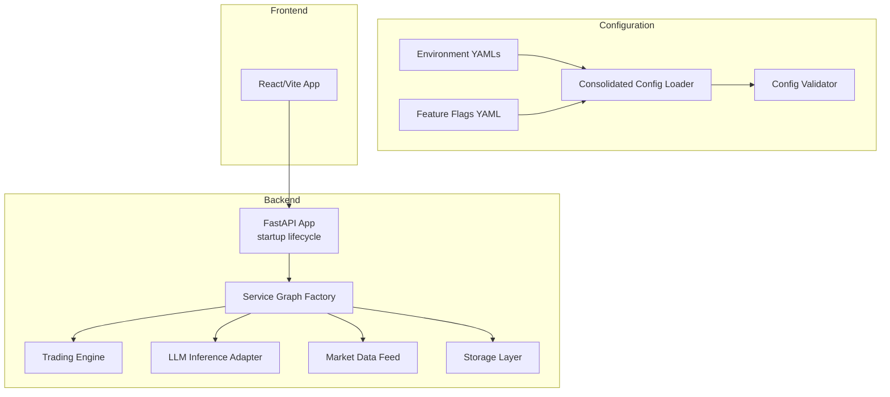
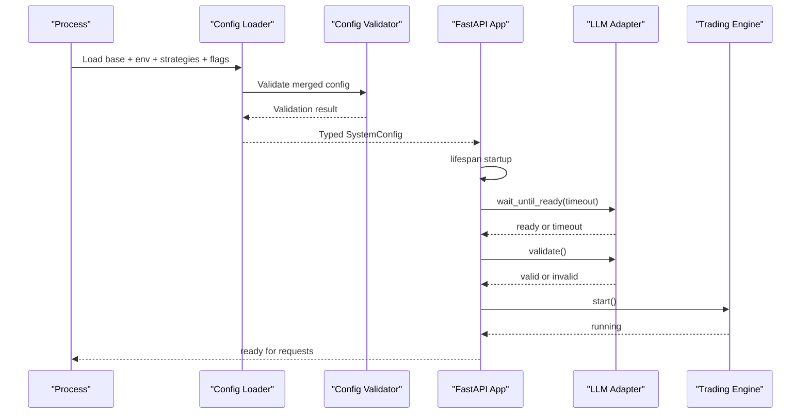
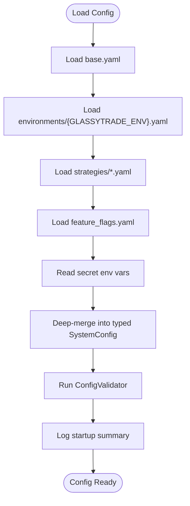
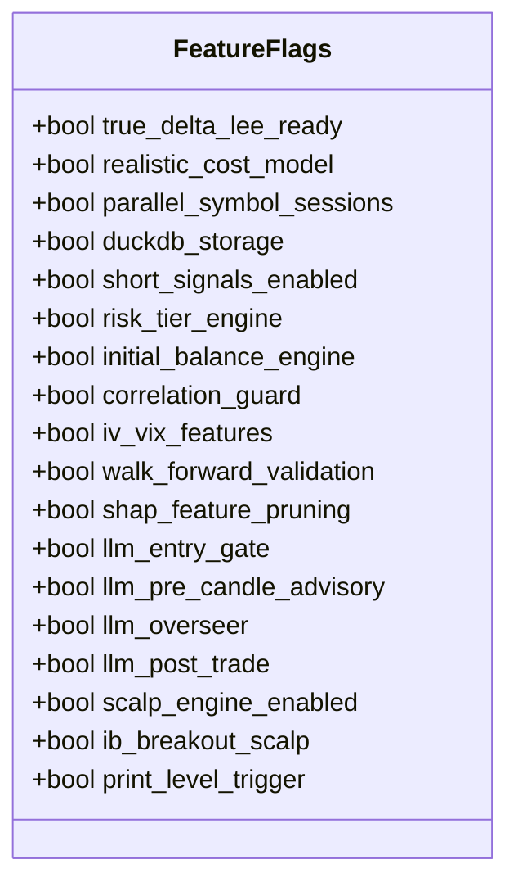
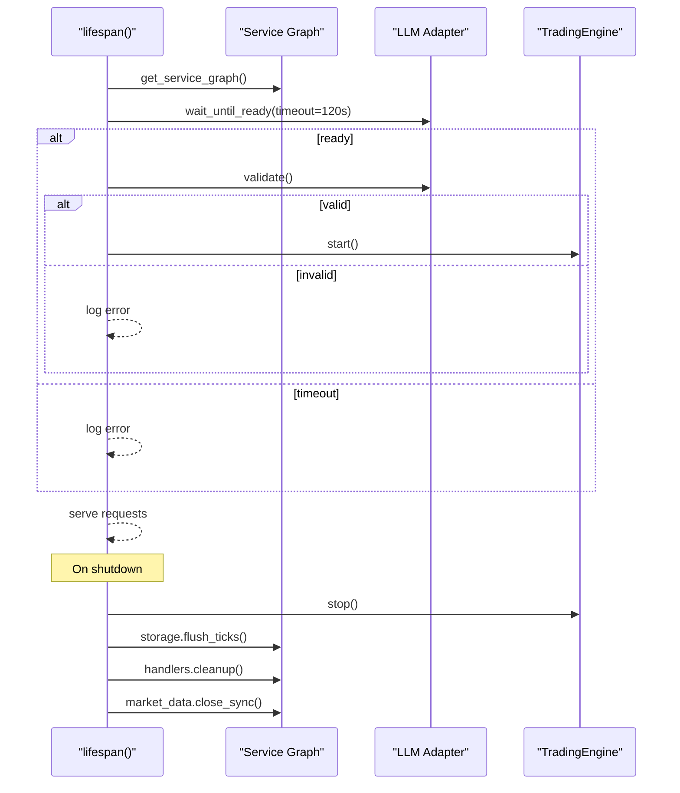
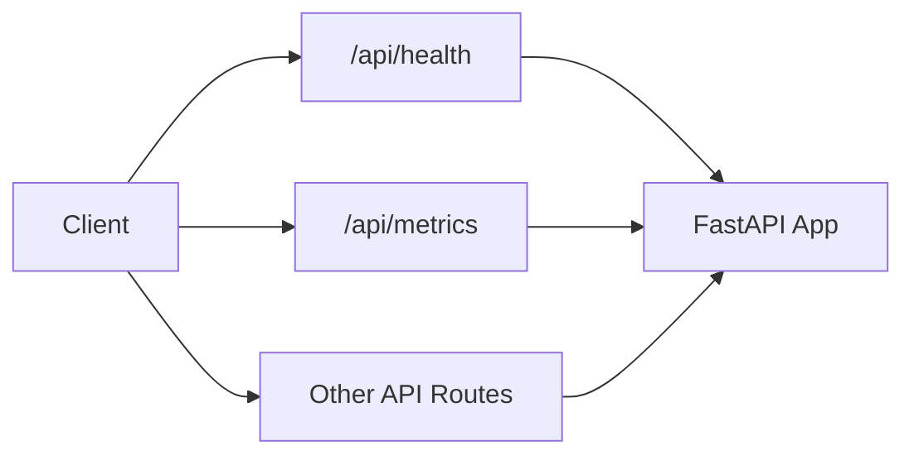
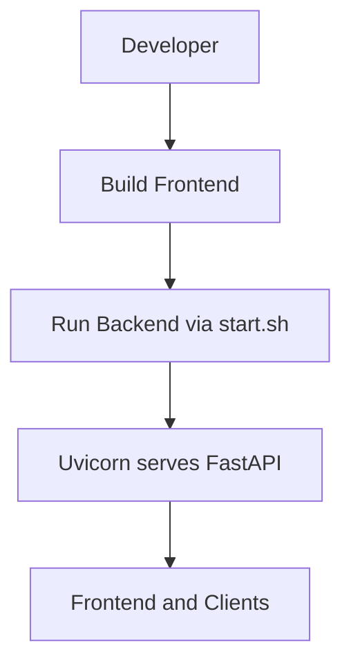
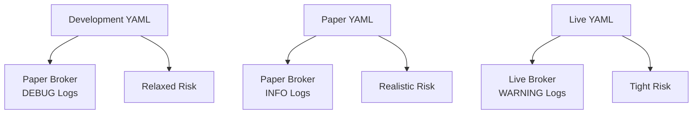
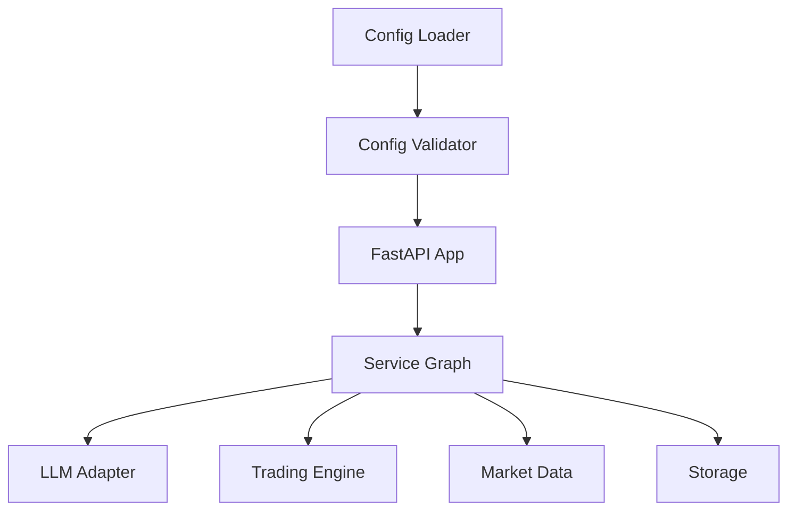

# Deployment Overview

<cite>
**Referenced Files in This Document**
- [backend/app/main.py](file://backend/app/main.py)
- [backend/start.sh](file://backend/start.sh)
- [backend/app/config.py](file://backend/app/config.py)
- [backend/config/consolidated.py](file://backend/config/consolidated.py)
- [backend/app/config_models/loader.py](file://backend/app/config_models/loader.py)
- [backend/app/config_models/validator.py](file://backend/app/config_models/validator.py)
- [backend/config/environments/development.yaml](file://backend/config/environments/development.yaml)
- [backend/config/environments/paper.yaml](file://backend/config/environments/paper.yaml)
- [backend/config/environments/live.yaml](file://backend/config/environments/live.yaml)
- [backend/config/feature_flags.yaml](file://backend/config/feature_flags.yaml)
- [frontend/package.json](file://frontend/package.json)
</cite>

## Table of Contents
1. [Introduction](#introduction)
2. [Project Structure](#project-structure)
3. [Core Components](#core-components)
4. [Architecture Overview](#architecture-overview)
5. [Detailed Component Analysis](#detailed-component-analysis)
6. [Dependency Analysis](#dependency-analysis)
7. [Performance Considerations](#performance-considerations)
8. [Troubleshooting Guide](#troubleshooting-guide)
9. [Conclusion](#conclusion)
10. [Appendices](#appendices)

## Introduction
This document provides a deployment overview for GlassyTrade AI v5, focusing on the containerized backend and integrated frontend. It explains how multiple environments (development, paper trading, live trading) are supported, how configuration is consolidated and validated, how feature flags enable capability toggling, and how the startup sequence initializes the service graph, loads and validates the LLM model, and activates the trading engine. Monitoring and logging, health checks, graceful shutdown, and operational best practices are also covered.

## Project Structure
GlassyTrade AI v5 comprises:
- A Python FastAPI backend with a modular architecture, configuration consolidation, and a startup lifecycle that initializes the trading engine and LLM model readiness.
- A separate frontend built with React/Vite that integrates with the backend APIs and WebSocket endpoints.
- Environment-specific configuration files and a feature flags system to control capabilities across environments.

**Diagram sources**
- [backend/app/main.py:83-176](file://backend/app/main.py#L83-L176)
- [backend/app/config_models/loader.py:139-245](file://backend/app/config_models/loader.py#L139-L245)
- [backend/app/config_models/validator.py:22-176](file://backend/app/config_models/validator.py#L22-L176)
- [backend/config/environments/development.yaml:1-33](file://backend/config/environments/development.yaml#L1-L33)
- [backend/config/environments/paper.yaml:1-25](file://backend/config/environments/paper.yaml#L1-L25)
- [backend/config/environments/live.yaml:1-26](file://backend/config/environments/live.yaml#L1-L26)
- [backend/config/feature_flags.yaml:1-37](file://backend/config/feature_flags.yaml#L1-L37)
- [frontend/package.json:1-39](file://frontend/package.json#L1-L39)

**Section sources**
- [backend/app/main.py:83-176](file://backend/app/main.py#L83-L176)
- [backend/app/config_models/loader.py:139-245](file://backend/app/config_models/loader.py#L139-L245)
- [backend/app/config_models/validator.py:22-176](file://backend/app/config_models/validator.py#L22-L176)
- [backend/config/environments/development.yaml:1-33](file://backend/config/environments/development.yaml#L1-L33)
- [backend/config/environments/paper.yaml:1-25](file://backend/config/environments/paper.yaml#L1-L25)
- [backend/config/environments/live.yaml:1-26](file://backend/config/environments/live.yaml#L1-L26)
- [backend/config/feature_flags.yaml:1-37](file://backend/config/feature_flags.yaml#L1-L37)
- [frontend/package.json:1-39](file://frontend/package.json#L1-L39)

## Core Components
- FastAPI application with structured logging, CORS, rate limiting, and a lifespan manager for startup and shutdown.
- Configuration subsystem that merges base, environment, strategies, and feature flags into a single typed configuration, then validates it.
- Environment-specific YAML files controlling broker mode, log levels, exchange/symbol enablement, and risk parameters.
- Feature flags controlling capability toggles across phases and roles.
- Startup sequence that creates the service graph, waits for LLM readiness, validates the model, starts the trading engine, and exposes health endpoints.
- Graceful shutdown that stops the engine, flushes pending ticks, cleans up thread pools, and disconnects market data.

**Section sources**
- [backend/app/main.py:58-176](file://backend/app/main.py#L58-L176)
- [backend/app/config_models/loader.py:139-245](file://backend/app/config_models/loader.py#L139-L245)
- [backend/app/config_models/validator.py:22-176](file://backend/app/config_models/validator.py#L22-L176)
- [backend/config/environments/development.yaml:1-33](file://backend/config/environments/development.yaml#L1-L33)
- [backend/config/environments/paper.yaml:1-25](file://backend/config/environments/paper.yaml#L1-L25)
- [backend/config/environments/live.yaml:1-26](file://backend/config/environments/live.yaml#L1-L26)
- [backend/config/feature_flags.yaml:1-37](file://backend/config/feature_flags.yaml#L1-L37)

## Architecture Overview
The deployment architecture centers on a single backend process that:
- Initializes configuration from environment YAMLs and feature flags.
- Validates configuration and logs a human-readable startup summary.
- Waits for the LLM model to become ready with a timeout and performs a validation inference.
- Starts the trading engine and exposes API endpoints and a WebSocket route.
- Provides health endpoints and handles graceful shutdown.

**Diagram sources**
- [backend/app/config_models/loader.py:139-245](file://backend/app/config_models/loader.py#L139-L245)
- [backend/app/config_models/validator.py:22-176](file://backend/app/config_models/validator.py#L22-L176)
- [backend/app/main.py:83-127](file://backend/app/main.py#L83-L127)

## Detailed Component Analysis

### Configuration Management and Environment Switching
- Base defaults are defined in the consolidated configuration module and environment-specific overrides are applied from YAML files.
- Feature flags are loaded from a dedicated YAML and merged into the configuration.
- The loader enforces a strict merge order: base → environment → strategies → feature flags → environment variables for secrets.
- The validator enforces hard rules for correctness and safety (e.g., live mode constraints) and emits warnings for non-critical misconfigurations.

**Diagram sources**
- [backend/app/config_models/loader.py:139-245](file://backend/app/config_models/loader.py#L139-L245)
- [backend/app/config_models/validator.py:22-176](file://backend/app/config_models/validator.py#L22-L176)

**Section sources**
- [backend/config/consolidated.py:232-417](file://backend/config/consolidated.py#L232-L417)
- [backend/app/config_models/loader.py:139-245](file://backend/app/config_models/loader.py#L139-L245)
- [backend/app/config_models/validator.py:22-176](file://backend/app/config_models/validator.py#L22-L176)
- [backend/config/environments/development.yaml:1-33](file://backend/config/environments/development.yaml#L1-L33)
- [backend/config/environments/paper.yaml:1-25](file://backend/config/environments/paper.yaml#L1-L25)
- [backend/config/environments/live.yaml:1-26](file://backend/config/environments/live.yaml#L1-L26)
- [backend/config/feature_flags.yaml:1-37](file://backend/config/feature_flags.yaml#L1-L37)

### Feature Flag System
- Feature flags are organized by phase and role, enabling capability toggling across environments.
- The loader constructs a FeatureFlags object from the YAML and enforces that the LLM entry gate is disabled in all environments.
- Flags influence runtime behavior such as risk tiers, correlation guards, LLM advisory roles, and infrastructure choices.

**Diagram sources**
- [backend/app/config_models/loader.py:170-189](file://backend/app/config_models/loader.py#L170-L189)
- [backend/config/feature_flags.yaml:5-37](file://backend/config/feature_flags.yaml#L5-L37)

**Section sources**
- [backend/app/config_models/loader.py:167-189](file://backend/app/config_models/loader.py#L167-L189)
- [backend/config/feature_flags.yaml:1-37](file://backend/config/feature_flags.yaml#L1-L37)

### Startup Sequence: Service Graph, Model Loading, Trading Engine
- The lifespan manager creates the service graph and waits for the LLM adapter to be ready with a timeout.
- A validation inference is performed to ensure model correctness.
- The trading engine is instantiated and started independently of the frontend.
- Graceful shutdown stops the engine, flushes pending ticks, cleans up thread pools, and disconnects the market data feed.

**Diagram sources**
- [backend/app/main.py:83-170](file://backend/app/main.py#L83-L170)

**Section sources**
- [backend/app/main.py:83-170](file://backend/app/main.py#L83-L170)

### Health Checks and Monitoring
- Health endpoints are mounted under the API prefix and expose the current health status of the backend.
- Structured JSON logging is configured at the root level for production-grade observability.
- Rate limiting middleware protects the backend from abuse.

**Diagram sources**
- [backend/app/main.py:73-80](file://backend/app/main.py#L73-L80)
- [backend/app/main.py:58-68](file://backend/app/main.py#L58-L68)
- [backend/app/main.py:195-210](file://backend/app/main.py#L195-L210)

**Section sources**
- [backend/app/main.py:73-80](file://backend/app/main.py#L73-L80)
- [backend/app/main.py:58-68](file://backend/app/main.py#L58-L68)
- [backend/app/main.py:195-210](file://backend/app/main.py#L195-L210)

### Containerization Approach
- The backend is started via a shell script that invokes Uvicorn with host and port settings.
- The frontend is a static React/Vite application with build and dev scripts.

**Diagram sources**
- [backend/start.sh:1-6](file://backend/start.sh#L1-L6)
- [frontend/package.json:6-12](file://frontend/package.json#L6-L12)

**Section sources**
- [backend/start.sh:1-6](file://backend/start.sh#L1-L6)
- [frontend/package.json:1-39](file://frontend/package.json#L1-L39)

### Environment Profiles and Broker Modes
- Development: paper broker, DEBUG logs, restricted symbols, relaxed risk.
- Paper: paper broker, INFO logs, full exchanges, realistic risk and costs.
- Live: live broker, WARNING logs, strict risk, LLM entry gate disabled, higher capital requirement.

**Diagram sources**
- [backend/config/environments/development.yaml:1-33](file://backend/config/environments/development.yaml#L1-L33)
- [backend/config/environments/paper.yaml:1-25](file://backend/config/environments/paper.yaml#L1-L25)
- [backend/config/environments/live.yaml:1-26](file://backend/config/environments/live.yaml#L1-L26)

**Section sources**
- [backend/config/environments/development.yaml:1-33](file://backend/config/environments/development.yaml#L1-L33)
- [backend/config/environments/paper.yaml:1-25](file://backend/config/environments/paper.yaml#L1-L25)
- [backend/config/environments/live.yaml:1-26](file://backend/config/environments/live.yaml#L1-L26)

## Dependency Analysis
The backend depends on:
- Configuration loaders and validators to construct and validate a unified configuration.
- The service graph factory to wire components.
- The LLM adapter for model readiness and validation.
- The trading engine for autonomous operation.
- The market data feed and storage layer for runtime operations.

**Diagram sources**
- [backend/app/config_models/loader.py:139-245](file://backend/app/config_models/loader.py#L139-L245)
- [backend/app/config_models/validator.py:22-176](file://backend/app/config_models/validator.py#L22-L176)
- [backend/app/main.py:83-170](file://backend/app/main.py#L83-L170)

**Section sources**
- [backend/app/config_models/loader.py:139-245](file://backend/app/config_models/loader.py#L139-L245)
- [backend/app/config_models/validator.py:22-176](file://backend/app/config_models/validator.py#L22-L176)
- [backend/app/main.py:83-170](file://backend/app/main.py#L83-L170)

## Performance Considerations
- Model readiness timeout prevents indefinite blocking during startup.
- Structured logging avoids expensive string formatting in hot paths.
- Rate limiting protects resources under load.
- Consolidated configuration reduces repeated parsing and improves startup predictability.

[No sources needed since this section provides general guidance]

## Troubleshooting Guide
Common issues and remedies:
- LLM model not ready or failing validation: check model paths and adapter settings; review readiness timeout and validation logs.
- Configuration validation failures: address hard errors reported by the validator (e.g., live mode constraints, ML model file presence).
- Broker mode mismatch in live: ensure environment YAML sets the correct broker mode and capital thresholds.
- Frontend connectivity: confirm CORS origins and port alignment with the backend.

**Section sources**
- [backend/app/main.py:83-170](file://backend/app/main.py#L83-L170)
- [backend/app/config_models/validator.py:22-176](file://backend/app/config_models/validator.py#L22-L176)
- [backend/config/environments/live.yaml:1-26](file://backend/config/environments/live.yaml#L1-L26)

## Conclusion
GlassyTrade AI v5 employs a robust configuration and validation pipeline, a clear environment taxonomy, and a disciplined startup/shutdown lifecycle. The combination of typed configuration, feature flags, and health endpoints supports safe deployments across development, paper, and live environments while maintaining operational reliability.

[No sources needed since this section summarizes without analyzing specific files]

## Appendices

### Operational Procedures
- Environment switching: set the environment variable for the desired profile and restart the backend.
- Maintenance windows: schedule downtime during off-peak sessions; ensure the trading engine is stopped gracefully and market data is disconnected.
- Security for live trading: enforce broker credentials via environment variables, restrict LLM entry gating, and monitor logs for anomalies.

[No sources needed since this section provides general guidance]