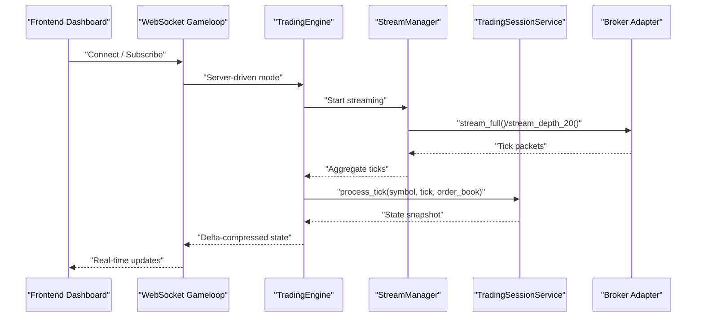
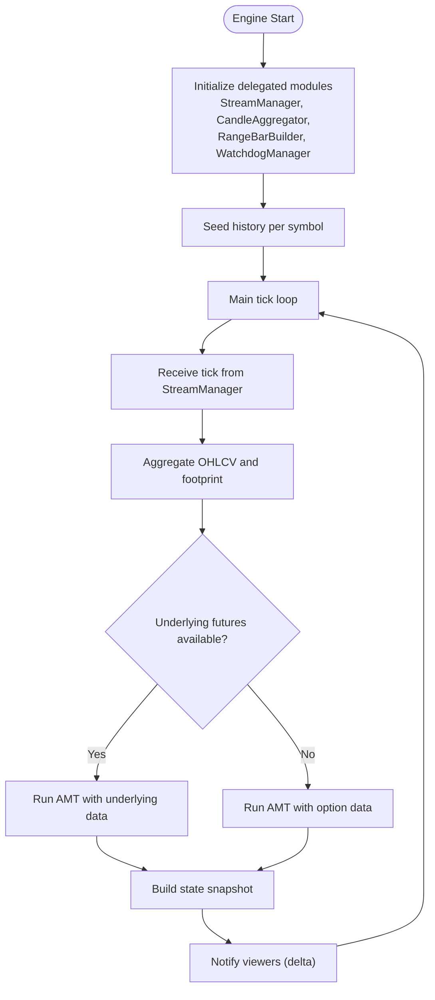
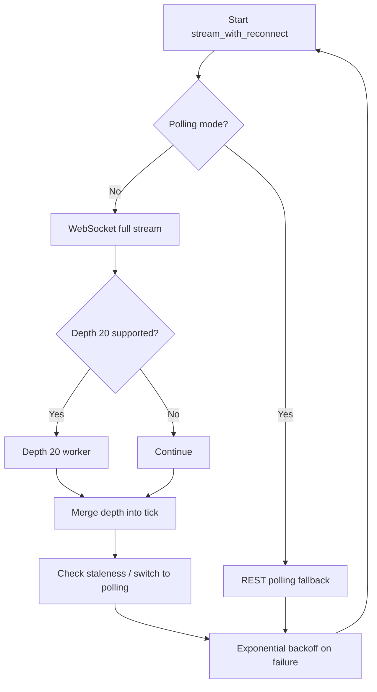
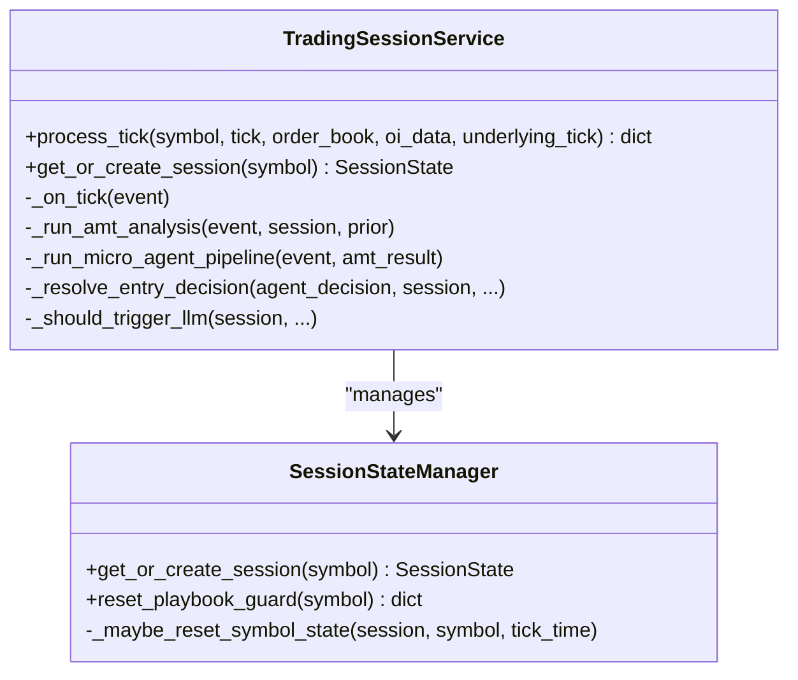
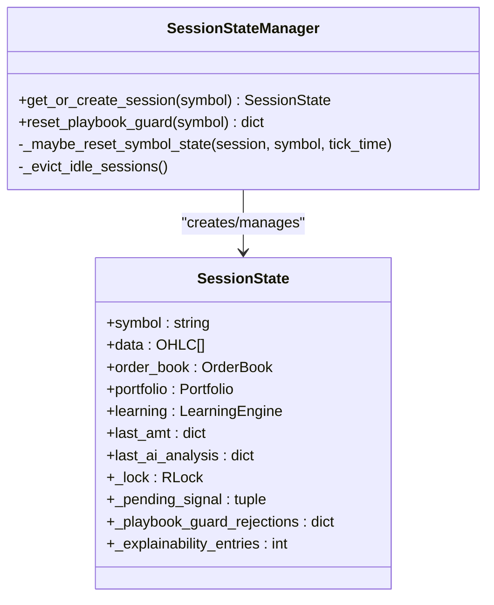
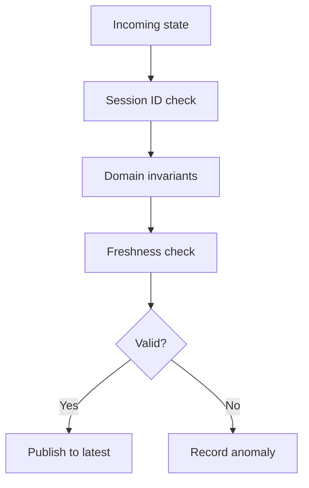
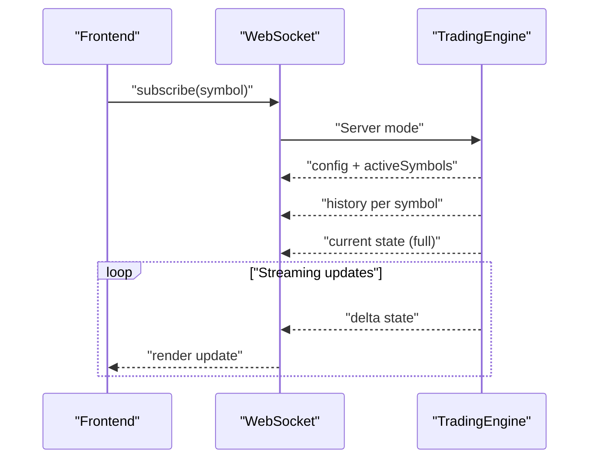
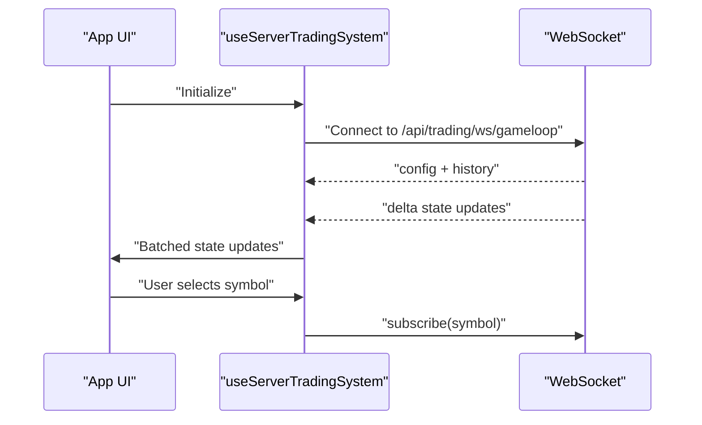
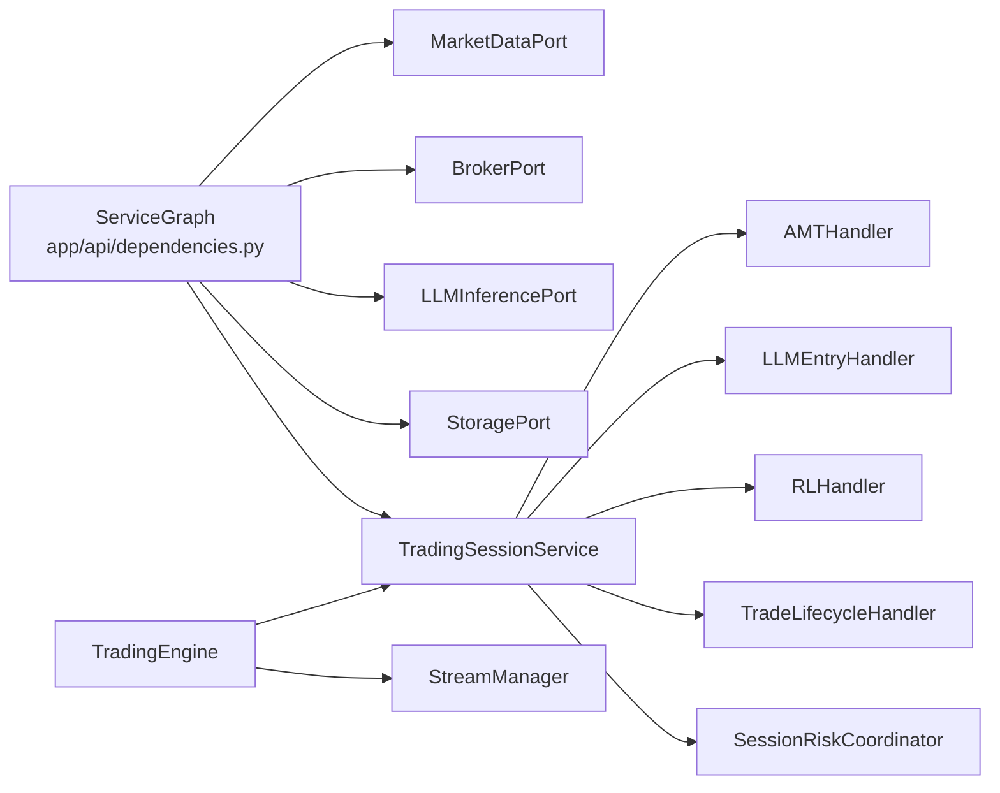

# System Components

<cite>
**Referenced Files in This Document**
- [backend/app/main.py](file://backend/app/main.py)
- [backend/app/config.py](file://backend/app/config.py)
- [backend/app/api/dependencies.py](file://backend/app/api/dependencies.py)
- [backend/app/application/engine.py](file://backend/app/application/engine.py)
- [backend/app/application/stream_manager.py](file://backend/app/application/stream_manager.py)
- [backend/app/application/services/trading_session.py](file://backend/app/application/services/trading_session.py)
- [backend/app/application/services/session_state_manager.py](file://backend/app/application/services/session_state_manager.py)
- [backend/app/api/websocket/gameloop.py](file://backend/app/api/websocket/gameloop.py)
- [backend/app/domain/services/state_bus.py](file://backend/app/domain/services/state_bus.py)
- [frontend/App.tsx](file://frontend/App.tsx)
- [frontend/hooks/useServerTradingSystem.ts](file://frontend/hooks/useServerTradingSystem.ts)
</cite>

## Table of Contents
1. [Introduction](#introduction)
2. [Project Structure](#project-structure)
3. [Core Components](#core-components)
4. [Architecture Overview](#architecture-overview)
5. [Detailed Component Analysis](#detailed-component-analysis)
6. [Dependency Analysis](#dependency-analysis)
7. [Performance Considerations](#performance-considerations)
8. [Troubleshooting Guide](#troubleshooting-guide)
9. [Conclusion](#conclusion)

## Introduction
This document describes the GlassyTrade AI v5 system’s core components and their interactions. It covers the trading engine, market data processing pipeline, AMT analysis engine, AI decision-making modules, state management, event bus architecture, and inter-component communication patterns. It also explains how the backend FastAPI application integrates with the React frontend dashboard and external broker adapters, and outlines lifecycle management, dependency injection, and component roles that collectively form the trading ecosystem.

## Project Structure
The system is organized into three primary layers:
- Backend FastAPI application: orchestrates services, adapters, and WebSocket streaming.
- Application domain: trading pipeline, handlers, risk, and state management.
- Frontend React dashboard: real-time visualization and user controls.

```mermaid
graph TB
subgraph "Backend"
M["FastAPI Main<br/>app/main.py"]
CFG["Settings<br/>app/config.py"]
DEPS["Service Graph Factory<br/>app/api/dependencies.py"]
ENG["TradingEngine<br/>app/application/engine.py"]
SM["StreamManager<br/>app/application/stream_manager.py"]
TS["TradingSessionService<br/>app/application/services/trading_session.py"]
SSM["SessionStateManager<br/>app/application/services/session_state_manager.py"]
SB["StateBus<br/>app/domain/services/state_bus.py"]
WS["WebSocket Gameloop<br/>app/api/websocket/gameloop.py"]
end
subgraph "Frontend"
APP["React App<br/>frontend/App.tsx"]
HOOK["useServerTradingSystem Hook<br/>frontend/hooks/useServerTradingSystem.ts"]
end
M --> DEPS
DEPS --> ENG
DEPS --> TS
DEPS --> CFG
ENG --> SM
ENG --> TS
TS --> SSM
TS --> SB
WS <- --> ENG
HOOK <- --> WS
APP --> HOOK
```

**Diagram sources**
- [backend/app/main.py:1-227](file://backend/app/main.py#L1-L227)
- [backend/app/config.py:1-157](file://backend/app/config.py#L1-L157)
- [backend/app/api/dependencies.py:1-384](file://backend/app/api/dependencies.py#L1-L384)
- [backend/app/application/engine.py:1-800](file://backend/app/application/engine.py#L1-L800)
- [backend/app/application/stream_manager.py:1-304](file://backend/app/application/stream_manager.py#L1-L304)
- [backend/app/application/services/trading_session.py:1-800](file://backend/app/application/services/trading_session.py#L1-L800)
- [backend/app/application/services/session_state_manager.py:1-410](file://backend/app/application/services/session_state_manager.py#L1-L410)
- [backend/app/domain/services/state_bus.py:1-247](file://backend/app/domain/services/state_bus.py#L1-L247)
- [backend/app/api/websocket/gameloop.py:1-356](file://backend/app/api/websocket/gameloop.py#L1-L356)
- [frontend/App.tsx:1-395](file://frontend/App.tsx#L1-L395)
- [frontend/hooks/useServerTradingSystem.ts:1-655](file://frontend/hooks/useServerTradingSystem.ts#L1-L655)

**Section sources**
- [backend/app/main.py:1-227](file://backend/app/main.py#L1-L227)
- [backend/app/config.py:1-157](file://backend/app/config.py#L1-L157)
- [backend/app/api/dependencies.py:1-384](file://backend/app/api/dependencies.py#L1-L384)
- [frontend/App.tsx:1-395](file://frontend/App.tsx#L1-L395)
- [frontend/hooks/useServerTradingSystem.ts:1-655](file://frontend/hooks/useServerTradingSystem.ts#L1-L655)

## Core Components
- TradingEngine: standalone engine that streams market data, aggregates candles, runs the full pipeline, and exposes state snapshots to the WebSocket viewer. It manages per-symbol state, notifies viewers, and survives frontend disconnections.
- StreamManager: encapsulates market data streaming with reconnection, dual-stream (full + depth 20), polling fallback, and staleness monitoring.
- TradingSessionService: central coordinator delegating to specialized handlers (AMT, LLM entry, overseer, lifecycle, RL), risk coordination, and event logging. It builds state snapshots and coordinates execution.
- SessionStateManager: per-symbol state container with thread-safety, playbook guard, explainability tracking, and session lifecycle management.
- StateBus: validates and publishes market state, enforces domain invariants, and records anomalies to prevent UI/engine divergence.
- WebSocket Gameloop: server-driven viewer that streams engine state deltas to the frontend, with delta compression and periodic keyframes.
- Frontend Dashboard: React app consuming WebSocket state, rendering charts, overlays, and AI panels; it is read-only with respect to trading actions.

**Section sources**
- [backend/app/application/engine.py:1-800](file://backend/app/application/engine.py#L1-L800)
- [backend/app/application/stream_manager.py:1-304](file://backend/app/application/stream_manager.py#L1-L304)
- [backend/app/application/services/trading_session.py:1-800](file://backend/app/application/services/trading_session.py#L1-L800)
- [backend/app/application/services/session_state_manager.py:1-410](file://backend/app/application/services/session_state_manager.py#L1-L410)
- [backend/app/domain/services/state_bus.py:1-247](file://backend/app/domain/services/state_bus.py#L1-L247)
- [backend/app/api/websocket/gameloop.py:1-356](file://backend/app/api/websocket/gameloop.py#L1-L356)
- [frontend/App.tsx:1-395](file://frontend/App.tsx#L1-L395)
- [frontend/hooks/useServerTradingSystem.ts:1-655](file://frontend/hooks/useServerTradingSystem.ts#L1-L655)

## Architecture Overview
GlassyTrade AI v5 follows a production-grade Domain-Driven Design and event-driven architecture. The backend creates a service graph at startup, initializes adapters and handlers, and starts the TradingEngine. The engine independently streams market data and processes ticks, while the frontend connects via WebSocket to receive state deltas. External broker adapters (Dhan, Paper) are wired through ports and adapters.



**Diagram sources**
- [backend/app/api/websocket/gameloop.py:198-356](file://backend/app/api/websocket/gameloop.py#L198-L356)
- [backend/app/application/engine.py:620-800](file://backend/app/application/engine.py#L620-L800)
- [backend/app/application/stream_manager.py:135-304](file://backend/app/application/stream_manager.py#L135-L304)
- [backend/app/application/services/trading_session.py:233-418](file://backend/app/application/services/trading_session.py#L233-L418)

## Detailed Component Analysis

### TradingEngine
Responsibilities:
- Independent operation: starts on server boot, continues trading regardless of frontend connections.
- Stream management: delegates to StreamManager for WebSocket/dual-stream/polling.
- Candle aggregation and footprint accumulation.
- Dual-feed AMT analysis using option contract and underlying futures.
- State snapshot building and viewer notification via generation counters and async conditions.
- Mid-trade recovery: loads open positions from storage on startup.
- Watchdog loops for SL/TP and stream health.

Key behaviors:
- Throttling: limits process_tick to once per 500ms per symbol.
- Cross-thread notifications: schedules viewer updates from background threads.
- Snapshot builder reuse: leverages state snapshot builder for consistency.



**Diagram sources**
- [backend/app/application/engine.py:131-208](file://backend/app/application/engine.py#L131-L208)
- [backend/app/application/engine.py:372-426](file://backend/app/application/engine.py#L372-L426)
- [backend/app/application/engine.py:620-800](file://backend/app/application/engine.py#L620-L800)

**Section sources**
- [backend/app/application/engine.py:1-800](file://backend/app/application/engine.py#L1-L800)

### StreamManager
Responsibilities:
- Market data streaming with reconnection and exponential backoff.
- Dual-stream support: WebSocket full + Depth 20 (NSE).
- Polling fallback for symbols not delivered via WebSocket (e.g., MCX options).
- Staleness detection and switching to polling mode.
- Tick counting and last tick time tracking.



**Diagram sources**
- [backend/app/application/stream_manager.py:135-304](file://backend/app/application/stream_manager.py#L135-L304)

**Section sources**
- [backend/app/application/stream_manager.py:1-304](file://backend/app/application/stream_manager.py#L1-L304)

### TradingSessionService
Responsibilities:
- Central coordinator delegating to focused handlers:
  - AMT analysis via AMTHandler
  - LLM entry decisions via LLMEntryHandler
  - Trade lifecycle via TradeLifecycleHandler
  - RL status via RLHandler
  - Session state via SessionStateManager
  - Risk via SessionRiskCoordinator
  - Event logging via SessionEventLogger
- Builds state snapshots and coordinates execution.
- Manages pending signals, session resets, and session-phase checks (e.g., forced exits near session close).



**Diagram sources**
- [backend/app/application/services/trading_session.py:85-232](file://backend/app/application/services/trading_session.py#L85-L232)
- [backend/app/application/services/session_state_manager.py:100-167](file://backend/app/application/services/session_state_manager.py#L100-L167)

**Section sources**
- [backend/app/application/services/trading_session.py:1-800](file://backend/app/application/services/trading_session.py#L1-L800)
- [backend/app/application/services/session_state_manager.py:1-410](file://backend/app/application/services/session_state_manager.py#L1-L410)

### State Management and Session State
SessionStateManager defines the per-symbol state container and runtime QA features:
- Thread-safe portfolio and throttle flags.
- Playbook guard rejections and explainability tracking.
- Session-day reset logic and idle session eviction.
- Prior session profile loading for cross-session continuity.



**Diagram sources**
- [backend/app/application/services/session_state_manager.py:31-98](file://backend/app/application/services/session_state_manager.py#L31-L98)
- [backend/app/application/services/session_state_manager.py:100-167](file://backend/app/application/services/session_state_manager.py#L100-L167)

**Section sources**
- [backend/app/application/services/session_state_manager.py:1-410](file://backend/app/application/services/session_state_manager.py#L1-L410)

### StateBus Validation Middleware
StateBus ensures data integrity:
- Session consistency checks.
- Domain invariant validation (POC/VAH/VAL ordering, VWAP positivity).
- Freshness checks with maximum staleness threshold.
- Anomaly recording and reporting.



**Diagram sources**
- [backend/app/domain/services/state_bus.py:82-144](file://backend/app/domain/services/state_bus.py#L82-L144)
- [backend/app/domain/services/state_bus.py:166-232](file://backend/app/domain/services/state_bus.py#L166-L232)

**Section sources**
- [backend/app/domain/services/state_bus.py:1-247](file://backend/app/domain/services/state_bus.py#L1-L247)

### WebSocket Gameloop and Viewer Loop
Gameloop implements a server-driven viewer:
- Sends backend configuration and history for all active symbols.
- Streams current state snapshots and then deltas with periodic keyframes.
- Uses generation-based polling to notify clients of updates.
- Delta compression reduces payload size.



**Diagram sources**
- [backend/app/api/websocket/gameloop.py:198-356](file://backend/app/api/websocket/gameloop.py#L198-L356)

**Section sources**
- [backend/app/api/websocket/gameloop.py:1-356](file://backend/app/api/websocket/gameloop.py#L1-L356)

### Frontend Dashboard and Hook
The React frontend is a pure renderer:
- Uses a custom hook to connect to the WebSocket gameloop, batch updates, and manage reconnection.
- Implements delta merging for analytics-only updates and tick-only dispatch via a dedicated event bus.
- Provides multi-mode chart views (standard, footprint, range bars) and AI panels.



**Diagram sources**
- [frontend/hooks/useServerTradingSystem.ts:109-152](file://frontend/hooks/useServerTradingSystem.ts#L109-L152)
- [frontend/hooks/useServerTradingSystem.ts:204-498](file://frontend/hooks/useServerTradingSystem.ts#L204-L498)
- [frontend/App.tsx:16-395](file://frontend/App.tsx#L16-L395)

**Section sources**
- [frontend/hooks/useServerTradingSystem.ts:1-655](file://frontend/hooks/useServerTradingSystem.ts#L1-L655)
- [frontend/App.tsx:1-395](file://frontend/App.tsx#L1-L395)

## Dependency Analysis
The backend constructs a service graph at startup and wires adapters and services:
- ServiceGraph creates adapters (market data, broker, LLM, storage), strategies, and the TradingSessionService.
- TradingSessionService composes specialized handlers and coordinators.
- The TradingEngine depends on the service graph for market data, session service, and risk coordination.



**Diagram sources**
- [backend/app/api/dependencies.py:43-384](file://backend/app/api/dependencies.py#L43-L384)
- [backend/app/application/engine.py:73-126](file://backend/app/application/engine.py#L73-L126)
- [backend/app/application/services/trading_session.py:85-232](file://backend/app/application/services/trading_session.py#L85-L232)

**Section sources**
- [backend/app/api/dependencies.py:1-384](file://backend/app/api/dependencies.py#L1-L384)
- [backend/app/application/engine.py:1-800](file://backend/app/application/engine.py#L1-L800)
- [backend/app/application/services/trading_session.py:1-800](file://backend/app/application/services/trading_session.py#L1-L800)

## Performance Considerations
- Delta compression: WebSocket gameloop sends deltas to reduce bandwidth and CPU.
- Batched React updates: frontend batches multiple state updates per animation frame to minimize re-renders.
- Throttling: TradingEngine limits processing to once per 500ms per symbol to avoid overload.
- Asynchronous persistence: storage writes are offloaded to a background thread via an async persistence bus.
- Staleness detection: StreamManager switches to polling when WebSocket delivers no ticks for a period.
- Memory bounds: SessionStateManager evicts idle sessions and caps candle history per symbol.

[No sources needed since this section provides general guidance]

## Troubleshooting Guide
Common areas to inspect:
- WebSocket connectivity: monitor ping/pong, reconnection delays, and parse error counts in the frontend hook.
- Engine start-up: verify LLM model readiness and engine start/stop lifecycle logs.
- Market data: check StreamManager staleness, polling fallback activation, and reconnection attempts.
- State anomalies: review StateBus anomaly logs for session mismatches, stale data, or invariant violations.
- Session state: confirm session creation, idle eviction, and playbook guard resets.

**Section sources**
- [frontend/hooks/useServerTradingSystem.ts:509-597](file://frontend/hooks/useServerTradingSystem.ts#L509-L597)
- [backend/app/api/websocket/gameloop.py:198-356](file://backend/app/api/websocket/gameloop.py#L198-L356)
- [backend/app/application/engine.py:131-208](file://backend/app/application/engine.py#L131-L208)
- [backend/app/application/stream_manager.py:120-134](file://backend/app/application/stream_manager.py#L120-L134)
- [backend/app/domain/services/state_bus.py:82-144](file://backend/app/domain/services/state_bus.py#L82-L144)

## Conclusion
GlassyTrade AI v5 integrates a robust trading engine, a resilient market data pipeline, and a modular decision-making stack. The backend’s dependency injection and event-driven design enable clear separation of concerns, while the frontend remains a passive viewer that renders real-time state deltas. Together, these components form a scalable, observable, and production-ready trading ecosystem.