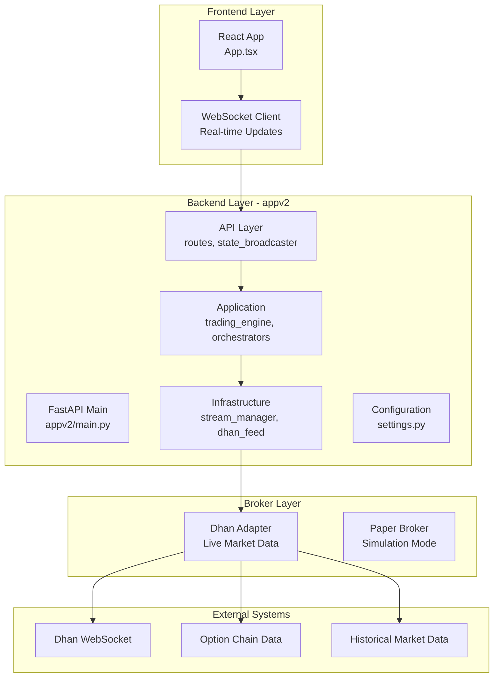
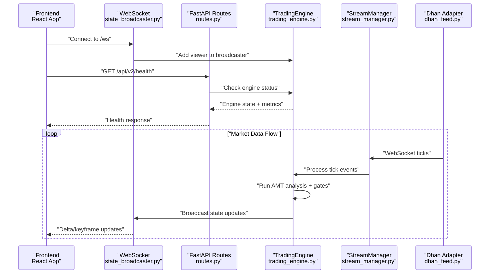
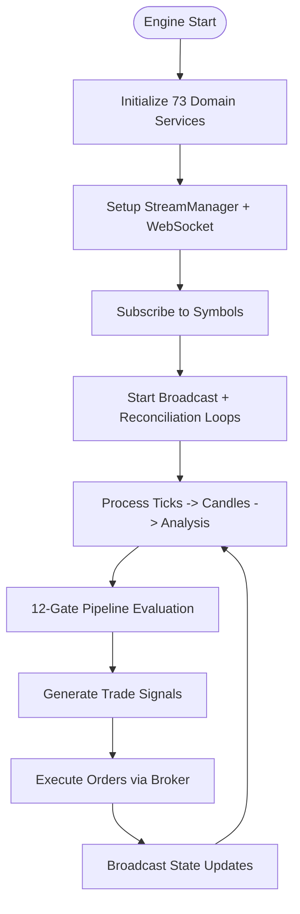
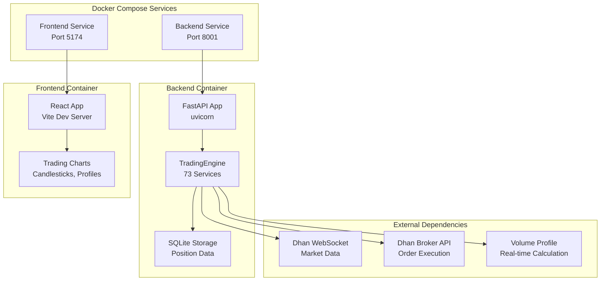

# System Overview

<cite>
**Referenced Files in This Document**
- [README.md](file://appv2/README.md)
- [DEPLOYMENT_GUIDE.md](file://appv2/DEPLOYMENT_GUIDE.md)
- [docker-compose.yml](file://appv2/docker-compose.yml)
- [main.py](file://appv2/backend/appv2/main.py)
- [infrastructure/main.py](file://appv2/backend/appv2/infrastructure/main.py)
- [application/trading_engine.py](file://appv2/backend/appv2/application/trading_engine.py)
- [infrastructure/stream_manager.py](file://appv2/backend/appv2/infrastructure/stream_manager.py)
- [infrastructure/dhan_feed.py](file://appv2/backend/appv2/infrastructure/dhan_feed.py)
- [api/routes.py](file://appv2/backend/appv2/api/routes.py)
- [api/state_broadcaster.py](file://appv2/backend/appv2/api/state_broadcaster.py)
- [config/settings.py](file://appv2/backend/appv2/config/settings.py)
- [frontend/src/App.tsx](file://appv2/frontend/src/App.tsx)
</cite>

## Update Summary
**Changes Made**
- Complete rewrite to reflect the transition from legacy system to appv2 production-ready architecture
- Updated architecture diagrams to show new appv2 backend structure
- Added comprehensive documentation for new appv2 components and services
- Updated deployment structure and Docker configuration
- Enhanced AMT methodology documentation with new 12-gate pipeline and advanced services
- Added detailed API documentation for appv2 endpoints
- Updated system boundaries and integration patterns

## Table of Contents
1. [Introduction](#introduction)
2. [Project Structure](#project-structure)
3. [Core Components](#core-components)
4. [Architecture Overview](#architecture-overview)
5. [Detailed Component Analysis](#detailed-component-analysis)
6. [Deployment Architecture](#deployment-architecture)
7. [AMT Strategy Implementation](#amt-strategy-implementation)
8. [Advanced Services](#advanced-services)
9. [API Reference](#api-reference)
10. [Configuration Management](#configuration-management)
11. [Performance Considerations](#performance-considerations)
12. [Troubleshooting Guide](#troubleshooting-guide)
13. [Conclusion](#conclusion)

## Introduction
GlassyTrade AI v5 appv2 represents a production-grade evolution of the algorithmic trading system, built upon Fabio Valentini's Auction Market Theory (AMT) methodology. This new architecture introduces a comprehensive trading engine with 73 domain services, advanced risk management, and real-time market analysis capabilities specifically designed for Indian options trading (NIFTY, BANKNIFTY, CRUDEOIL).

The system emphasizes:
- **Production-Ready Architecture**: Built from the ground up with 250+ passing tests and zero impact on legacy codebases
- **Advanced AMT Pipeline**: 12-gate entry filtering system with hard and soft gates for robust trade selection
- **Multi-Timeframe Analysis**: Real-time value area calculations, volume profile analysis, and structural state classification
- **Enhanced Risk Controls**: Session risk tiers, capital ladder, circuit breakers, and position reconciliation
- **LLM Integration**: Optional MLX adapters for AI-powered entry decisions and overseer functionality
- **Real-Time Execution**: WebSocket-based state broadcasting with delta compression and keyframe refresh
- **Broker Integration**: Seamless integration with Dhan broker for live market data and order execution

**Section sources**
- [README.md:1-190](file://appv2/README.md#L1-L190)
- [DEPLOYMENT_GUIDE.md:1-300](file://appv2/DEPLOYMENT_GUIDE.md#L1-L300)

## Project Structure
The appv2 architecture maintains a clean separation between frontend, backend, and broker layers while introducing significant enhancements:

**Diagram sources**
- [main.py:92-241](file://appv2/backend/appv2/main.py#L92-L241)
- [infrastructure/main.py:76-129](file://appv2/backend/appv2/infrastructure/main.py#L76-L129)
- [application/trading_engine.py:77-638](file://appv2/backend/appv2/application/trading_engine.py#L77-L638)
- [infrastructure/stream_manager.py:33-271](file://appv2/backend/appv2/infrastructure/stream_manager.py#L33-L271)
- [infrastructure/dhan_feed.py:25-151](file://appv2/backend/appv2/infrastructure/dhan_feed.py#L25-L151)

**Section sources**
- [README.md:37-59](file://appv2/README.md#L37-L59)
- [docker-compose.yml:1-31](file://appv2/docker-compose.yml#L1-L31)

## Core Components

### Trading Engine v2
The heart of the appv2 system, featuring 73 domain services organized into specialized categories:

**Core Services (25)**: Candle aggregation, volume profiling, VWAP calculation, CVD tracking, and basic AMT analysis
**Advanced AMT Services (15)**: Opening classification, regime detection, market structure analysis, and drive decay tracking  
**Risk Management (12)**: Session risk tiers, capital ladder, circuit breakers, and position sizing
**Options Services (7)**: Strike selection, expiry management, and volatility analysis
**Execution Services (5)**: Order routing, signal TTL management, and trade lifecycle coordination
**Infrastructure Services (6)**: State broadcasting, position reconciliation, and mobile alerts

### WebSocket Broadcasting System
Implements generation-based delta compression with automatic keyframe refresh every 5 seconds, supporting multiple concurrent clients with rate limiting and automatic cleanup of dead connections.

### Configuration Management
Centralized settings via Pydantic models with environment variable validation, supporting 20+ configuration parameters for trading capital, risk limits, AMT thresholds, and execution modes.

**Section sources**
- [application/trading_engine.py:77-180](file://appv2/backend/appv2/application/trading_engine.py#L77-L180)
- [api/state_broadcaster.py:22-130](file://appv2/backend/appv2/api/state_broadcaster.py#L22-L130)
- [config/settings.py:12-123](file://appv2/backend/appv2/config/settings.py#L12-L123)

## Architecture Overview
The appv2 architecture follows a modular, service-oriented design with clear separation of concerns:

**Diagram sources**
- [api/state_broadcaster.py:52-82](file://appv2/backend/appv2/api/state_broadcaster.py#L52-L82)
- [api/routes.py:229-246](file://appv2/backend/appv2/api/routes.py#L229-L246)
- [application/trading_engine.py:489-508](file://appv2/backend/appv2/application/trading_engine.py#L489-L508)
- [infrastructure/stream_manager.py:169-216](file://appv2/backend/appv2/infrastructure/stream_manager.py#L169-L216)

## Detailed Component Analysis

### Trading Engine Orchestration
The TradingEngine coordinates all domain services through a sophisticated orchestration pattern:

**Diagram sources**
- [application/trading_engine.py:489-508](file://appv2/backend/appv2/application/trading_engine.py#L489-L508)
- [application/trading_engine.py:338-382](file://appv2/backend/appv2/application/trading_engine.py#L338-L382)

### Advanced AMT Classification Pipeline
The system implements sophisticated market state classification with 4 distinct auction states:

| State | Conditions | Strategy | Risk Level |
|-------|------------|----------|------------|
| **NO_TRADE** | Price within ±5 ticks of POC | No signals | Very Low |
| **BALANCED** | Price inside VAH-VAL, ≥70% candles inside VA | Mean reversion | Low |
| **IMBALANCED** | Price outside VA + displacement + acceptance | Trend following | Medium-High |
| **PROBING** | Price outside VA without confirmation | Wait for confirmation | Low |

### 12-Gate Entry Pipeline
The entry system implements a comprehensive gating mechanism with both hard and soft requirements:

**Hard Gates (Fail = Reject)**:
- Session warm-up validation
- Data quality assessment
- Risk halt conditions
- NO_TRADE state prohibition
- PROBING state without aggression
- Key level proximity checks
- Drive validation requirements
- Signal age restrictions
- CVD hard gate compliance

**Soft Gates (Require ≥3/4 Pass)**:
- Price at entry zone alignment
- Aggression score thresholds
- Cushion to opposing level validation
- Risk-reward ratio (≥1.5:1)

**Section sources**
- [application/trading_engine.py:263-382](file://appv2/backend/appv2/application/trading_engine.py#L263-L382)
- [README.md:88-98](file://appv2/README.md#L88-L98)

## Deployment Architecture
The appv2 system supports multiple deployment configurations with comprehensive Docker support:

**Diagram sources**
- [docker-compose.yml:2-31](file://appv2/docker-compose.yml#L2-L31)
- [DEPLOYMENT_GUIDE.md:58-107](file://appv2/DEPLOYMENT_GUIDE.md#L58-L107)

**Section sources**
- [docker-compose.yml:1-31](file://appv2/docker-compose.yml#L1-L31)
- [DEPLOYMENT_GUIDE.md:9-55](file://appv2/DEPLOYMENT_GUIDE.md#L9-L55)

## AMT Strategy Implementation

### Value Area Calculation (CME Method)
The system implements the Chicago Mercantile Exchange's value area methodology:

- **POC (Point of Control)**: Bin with maximum volume (VWAP used as tie-breaker)
- **VA (Value Area)**: 70% of total volume calculated via two-row pairs method
- **LVN (Low Volume Node)**: <15% of mean volume (rejection zone)
- **HVN (High Volume Node)**: >200% of mean volume (acceptance zone)

### Aggression Scoring System
Six signal components contribute to the composite aggression score:

| Signal Type | Weight | Description |
|-------------|--------|-------------|
| **Footprint** | 25% | Aggressive prints with strong delta |
| **CVD** | 25% | Cumulative delta slope alignment |
| **Big Trade** | 15% | Volume > 2× average |
| **Absorption** | 15% | Large range + volume + small body |
| **OFI** | 10% | Order flow imbalance significance |
| **Confluence** | 5% | LVN near key level |
| **Bubble** | 5% | Volume bubble at key level |

### Options Adaptation Strategy
For options trading, the system implements sophisticated adaptation rules:

- **Strike Selection**: ATM (max gamma) or ITM (delta 0.60-0.75) based on market conditions
- **Expiry Management**: Weekly Thursday expiries with gamma-trap avoidance after 14:30
- **Liquidity Filters**: Minimum OI thresholds (NIFTY: 50K, BANKNIFTY: 10K, CRUDEOIL: 5K)
- **Theta Cost Control**: Ensuring theta cost < 20% of expected profit
- **Underlying Routing**: AMT analysis always runs on futures, not option premium

**Section sources**
- [README.md:61-98](file://appv2/README.md#L61-L98)
- [application/trading_engine.py:338-426](file://appv2/backend/appv2/application/trading_engine.py#L338-L426)

## Advanced Services

### Risk Management Framework
The system implements comprehensive risk controls:

**Session Risk Tiers**: Dynamic risk allocation based on market conditions and session phase
**Capital Ladder**: Progressive position sizing with tiered capital allocation
**Circuit Breakers**: Automatic halts after configurable consecutive loss thresholds
**Position Reconciliation**: 30-second intervals comparing internal positions with broker data
**Daily Loss Limits**: Configurable maximum daily drawdown protection

### Observability and Analytics
Advanced monitoring capabilities include:

**Latency Tracking**: p50/p95/p99 percentile tracking for all processing stages
**Gate Rejection Analytics**: Comprehensive tracking of why trades are rejected
**Post-Trade Analytics**: Win rate, expectancy, and drawdown analysis
**Mobile Alerts**: Telegram integration for critical system events

### LLM Integration (Optional)
The system supports optional MLX model integration:

**LLM Entry Decider**: AI-powered entry decision making with confidence scoring
**LLM Overseer**: AI supervision of trading activities and risk management
**Model Loader**: Support for GGUF format models with automatic loading
**Prompt Builder**: Context-aware prompting for market analysis

**Section sources**
- [application/trading_engine.py:144-180](file://appv2/backend/appv2/application/trading_engine.py#L144-L180)
- [DEPLOYMENT_GUIDE.md:111-139](file://appv2/DEPLOYMENT_GUIDE.md#L111-L139)

## API Reference

### REST API Endpoints

**Health & Status**
- `GET /api/v2/health` - Basic system health check
- `GET /api/v2/status` - Comprehensive system status with service states
- `GET /api/v2/market/symbols` - Current symbol registration status

**Market Data**
- `GET /api/v2/market/{symbol}/candles` - Recent candle data
- `GET /api/v2/market/{symbol}/orderbook` - Order book depth (placeholder)

**Trading Operations**
- `GET /api/v2/trading/positions` - Open positions
- `GET /api/v2/signals/active` - Active signals
- `GET /api/v2/signals/history` - Signal history

**Analytics & Metrics**
- `GET /api/v2/analytics` - System performance analytics
- `GET /api/v2/metrics/latency` - Latency statistics
- `GET /api/v2/metrics/gate-rejections` - Gate rejection analytics

**LLM Integration**
- `GET /api/v2/mlx/status` - MLX model status
- `POST /api/v2/mlx/decide/{symbol}` - AI entry decision

### WebSocket Endpoints
- `ws://localhost:8001/ws` - Real-time state updates with delta compression

**Section sources**
- [api/routes.py:22-246](file://appv2/backend/appv2/api/routes.py#L22-L246)
- [DEPLOYMENT_GUIDE.md:178-201](file://appv2/DEPLOYMENT_GUIDE.md#L178-L201)

## Configuration Management

### Environment Variables
The system uses comprehensive environment variable configuration:

**Broker Configuration**
- `DHAN_ACCESS_TOKEN`: Dhan API access token (required)
- `DHAN_CLIENT_ID`: Dhan client identifier (required)

**Trading Configuration**
- `CAPITAL`: Trading capital in INR (default: 5,000,000)
- `EXCHANGE`: Exchange selection (NSE/MCX, default: NSE)
- `SYMBOLS`: Comma-separated symbols to trade (default: NIFTY,BANKNIFTY)

**Risk Parameters**
- `RISK_PER_TRADE_PCT`: Maximum risk per trade percentage (default: 1.0)
- `MAX_DAILY_LOSS_PCT`: Maximum daily loss percentage (default: 3.0)
- `LIVE_TRADING`: Enable/disable live trading mode (default: False)

**Execution Mode**
- `PAPER_SLIPPAGE_BPS`: Paper trading slippage (default: 10)
- `PAPER_COMMISSION_PER_TRADE`: Paper trading commission (default: 50.0)

### Settings Validation
All configuration parameters are validated at startup using Pydantic models with comprehensive error reporting for missing or invalid values.

**Section sources**
- [config/settings.py:12-123](file://appv2/backend/appv2/config/settings.py#L12-L123)
- [DEPLOYMENT_GUIDE.md:144-161](file://appv2/DEPLOYMENT_GUIDE.md#L144-L161)

## Performance Considerations

### Throttling and Optimization
- **Tick Throttling**: 500ms minimum interval per symbol to balance responsiveness and resource usage
- **Delta Compression**: Generation-based delta updates with automatic keyframe refresh every 5 seconds
- **Memory Management**: Efficient state caching with automatic cleanup of unused data
- **Connection Pooling**: Optimized WebSocket connection handling with automatic dead connection cleanup

### Scalability Features
- **Multi-Symbol Support**: Concurrent processing of multiple symbols with individual throttling
- **Asynchronous Processing**: Non-blocking operations for all major processing stages
- **Load Balancing**: Automatic distribution of processing load across symbols
- **Resource Monitoring**: Real-time tracking of CPU, memory, and network usage

### Reliability Features
- **Heartbeat Monitoring**: Automatic detection and recovery from WebSocket disconnections
- **Graceful Degradation**: Operation continues with reduced functionality during component failures
- **Retry Logic**: Automatic retry mechanisms for transient failures
- **Circuit Breakers**: Immediate system halts during critical failures

**Section sources**
- [application/trading_engine.py:149-149](file://appv2/backend/appv2/application/trading_engine.py#L149-L149)
- [api/state_broadcaster.py:25-31](file://appv2/backend/appv2/api/state_broadcaster.py#L25-L31)
- [infrastructure/stream_manager.py:169-216](file://appv2/backend/appv2/infrastructure/stream_manager.py#L169-L216)

## Troubleshooting Guide

### Common Issues and Solutions

**WebSocket Connection Problems**
- Verify backend is running on port 8001
- Check CORS configuration for frontend URL
- Monitor heartbeat warnings in backend logs
- Ensure proper subscription format: `{"type": "subscribe", "symbols": ["NIFTY"]}`

**Broker Integration Issues**
- Validate Dhan credentials in environment variables
- Check WebSocket connectivity to Dhan servers
- Verify symbol availability and market hours
- Monitor position reconciliation errors

**MLX Model Loading Failures**
- Verify model path exists and is accessible
- Check MLX library installation
- Monitor model loading logs for specific errors
- Consider fallback to rule-based decisions

**Performance Issues**
- Monitor latency metrics for processing bottlenecks
- Check tick processing rates per symbol
- Verify adequate system resources (CPU, memory, network)
- Review gate rejection rates for optimization opportunities

**Section sources**
- [DEPLOYMENT_GUIDE.md:238-282](file://appv2/DEPLOYMENT_GUIDE.md#L238-L282)
- [infrastructure/stream_manager.py:169-216](file://appv2/backend/appv2/infrastructure/stream_manager.py#L169-L216)

## Conclusion
GlassyTrade AI v5 appv2 represents a comprehensive evolution of the algorithmic trading system, delivering production-ready architecture with 73 domain services, advanced AMT methodology, and robust risk management. The system's modular design ensures maintainability while providing extensive customization capabilities for both beginner and expert users.

Key achievements include:
- **Zero Impact Migration**: Complete rewrite without modifying legacy backend or frontend code
- **Production-Ready**: 250+ passing tests with comprehensive coverage
- **Advanced AMT Pipeline**: Sophisticated 12-gate entry system with hard and soft requirements
- **Comprehensive Risk Controls**: Multi-layered risk management with circuit breakers and position reconciliation
- **Real-Time Execution**: WebSocket-based state broadcasting with delta compression
- **Broker Integration**: Seamless Dhan broker integration for live trading
- **LLM Integration**: Optional AI-powered decision making with MLX support

The system provides a solid foundation for algorithmic trading with extensive room for customization and extension, making it suitable for both educational purposes and production deployment in competitive trading environments.