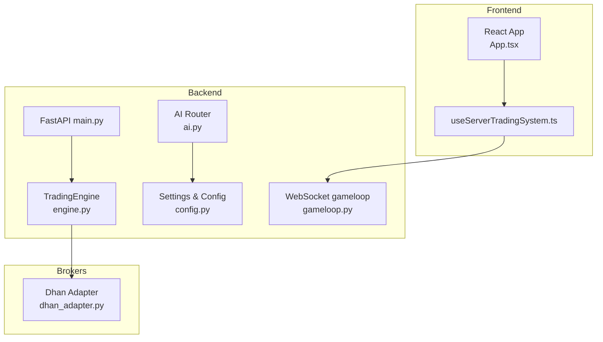
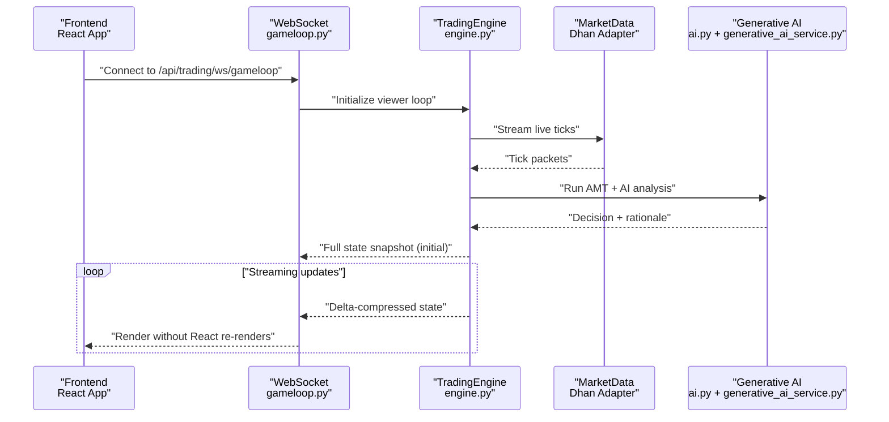
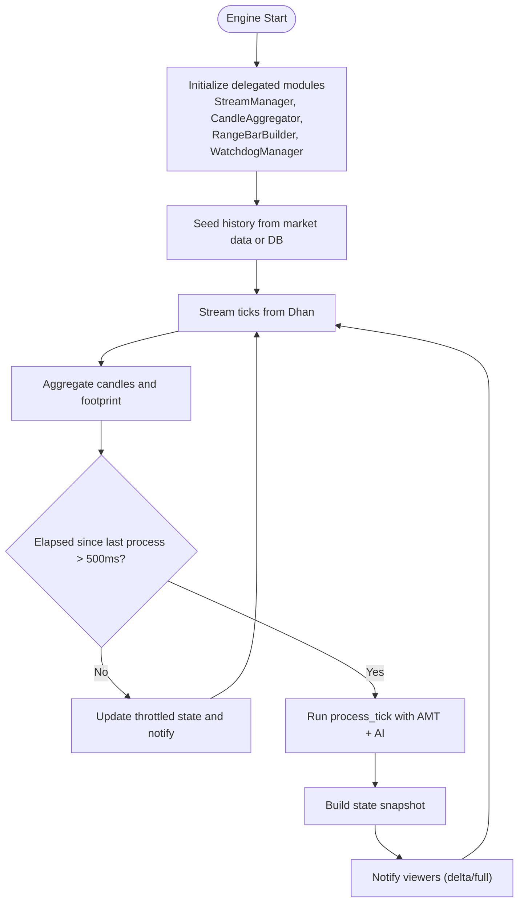
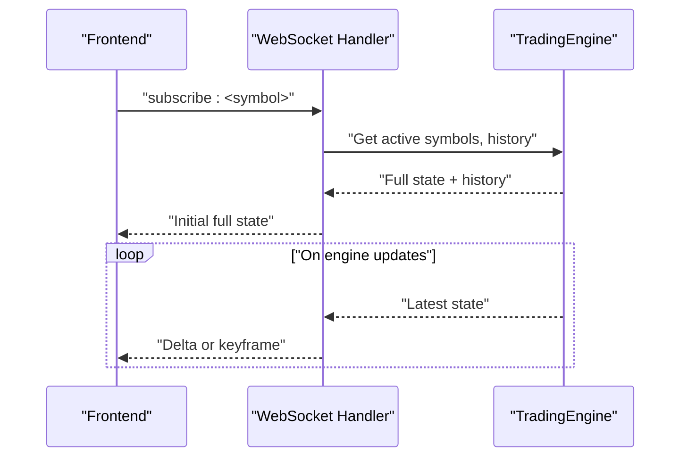
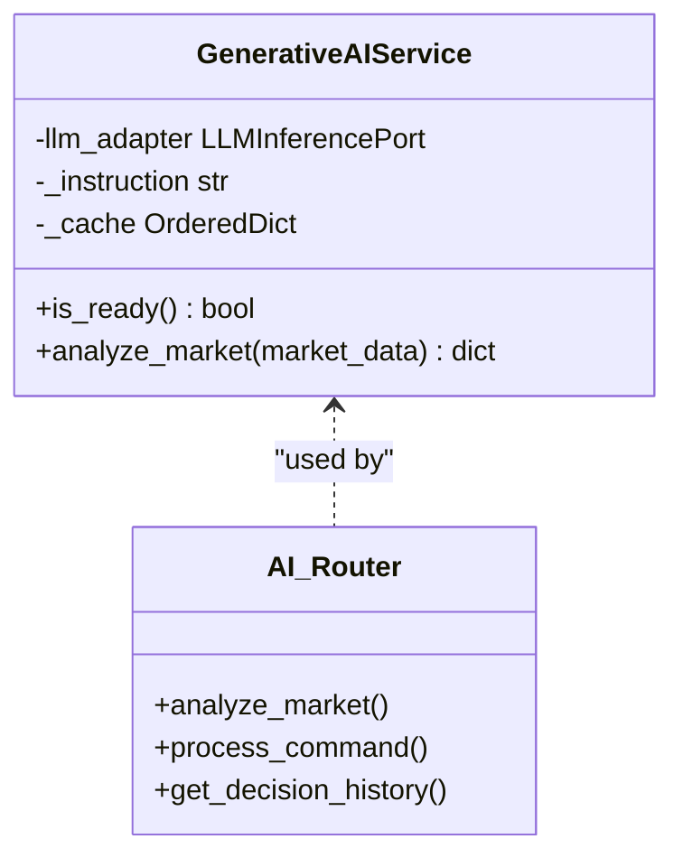
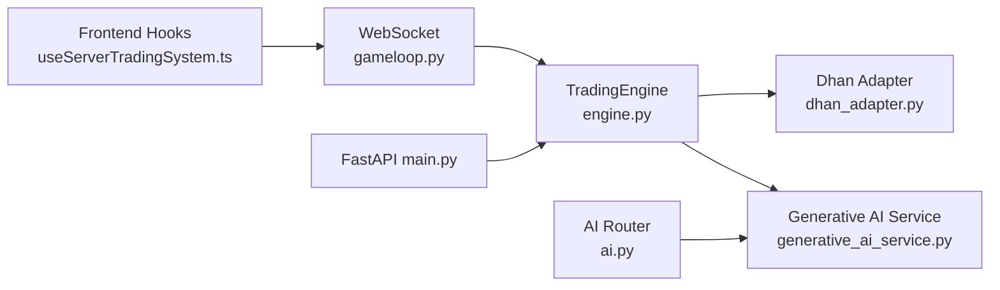

# System Overview

<cite>
**Referenced Files in This Document**
- [App.tsx](file://frontend/App.tsx)
- [useServerTradingSystem.ts](file://frontend/hooks/useServerTradingSystem.ts)
- [main.py](file://backend/app/main.py)
- [config.py](file://backend/app/config.py)
- [engine.py](file://backend/app/application/engine.py)
- [gameloop.py](file://backend/app/api/websocket/gameloop.py)
- [ai.py](file://backend/app/api/routers/ai.py)
- [generative_ai_service.py](file://backend/app/domain/fabio_ai/services/generative_ai_service.py)
- [dhan_adapter.py](file://backend/app/infrastructure/adapters/dhan_adapter.py)
- [state_snapshot_builder.py](file://backend/app/application/services/state_snapshot_builder.py)
- [constants.py](file://backend/app/domain/constants.py)
</cite>

## Table of Contents
1. [Introduction](#introduction)
2. [Project Structure](#project-structure)
3. [Core Components](#core-components)
4. [Architecture Overview](#architecture-overview)
5. [Detailed Component Analysis](#detailed-component-analysis)
6. [Dependency Analysis](#dependency-analysis)
7. [Performance Considerations](#performance-considerations)
8. [Troubleshooting Guide](#troubleshooting-guide)
9. [Conclusion](#conclusion)

## Introduction
GlassyTrade AI v5 is a production-grade algorithmic trading system designed for real-time market analysis and automated trading execution. It combines a FastAPI backend, a React frontend, and Fabio Valentini’s Auction Market Theory (AMT) methodology to deliver a robust, multi-timeframe analysis platform. The system emphasizes:
- Real-time streaming from external brokers (Dhan) with resilient reconnection and fallback polling
- AMT-based order flow and structural analysis integrated with a Generative AI (LLM) entry advisor
- Multi-timeframe analysis and visualization through candlesticks, footprint profiles, and range bars
- Independent trading engine that operates regardless of frontend connectivity
- Strong risk controls, explainability monitoring, and playbook alignment

The system targets both beginner-friendly insights and advanced developer extensibility, enabling traders and engineers to observe, interpret, and act on auction dynamics using AMT and AI-informed signals.

## Project Structure
The repository is organized into three primary layers:
- Backend: FastAPI application with domain-driven design, event-driven trading engine, and WebSocket streaming
- Frontend: React application with real-time state synchronization and visualization
- Brokers: Shared integration layer for external broker APIs (Dhan)

**Diagram sources**
- [main.py:171-227](file://backend/app/main.py#L171-L227)
- [engine.py:59-126](file://backend/app/application/engine.py#L59-L126)
- [gameloop.py:112-196](file://backend/app/api/websocket/gameloop.py#L112-L196)
- [ai.py:15-281](file://backend/app/api/routers/ai.py#L15-L281)
- [config.py:26-157](file://backend/app/config.py#L26-L157)
- [dhan_adapter.py:66-148](file://backend/app/infrastructure/adapters/dhan_adapter.py#L66-L148)

**Section sources**
- [main.py:1-227](file://backend/app/main.py#L1-L227)
- [engine.py:1-981](file://backend/app/application/engine.py#L1-L981)
- [gameloop.py:1-356](file://backend/app/api/websocket/gameloop.py#L1-L356)
- [ai.py:1-281](file://backend/app/api/routers/ai.py#L1-L281)
- [config.py:1-157](file://backend/app/config.py#L1-L157)
- [dhan_adapter.py:1-457](file://backend/app/infrastructure/adapters/dhan_adapter.py#L1-L457)

## Core Components
- FastAPI Backend
  - Entry point initializes logging, CORS, rate limiting, and mounts routers for health, market, analysis, trading, AI, RL, and metrics
  - Startup lifecycle loads LLM models and validates readiness before accepting traffic
  - Exposes WebSocket endpoint for server-driven state streaming

- Trading Engine
  - Runs independently of frontend; streams market data, aggregates candles, builds state snapshots, and notifies viewers
  - Supports mid-trade recovery, stale watchdogs, and garbage collection loops
  - Provides throttled processing and delta-compressed state updates over WebSocket

- Generative AI Service (Fabio AI)
  - Implements AMT-aligned prompts and parses canonical LLM outputs for entry decisions
  - Caches recent responses to avoid redundant inference
  - Integrates with the AMT analysis pipeline and UI state

- Dhan Broker Adapter
  - Implements MarketDataPort to fetch historical data, quotes, and live streams
  - Provides REST fallback polling for symbols with limited WebSocket support
  - Handles instrument detection, exchange routing, and delta approximation

- React Frontend
  - Pure renderer consuming server-driven state via WebSocket
  - Supports multi-mode charts (standard candles, footprint, range bars) and volume profile modes
  - Maintains a lightweight event bus for high-frequency tick updates without triggering React renders

**Section sources**
- [main.py:83-176](file://backend/app/main.py#L83-L176)
- [engine.py:131-208](file://backend/app/application/engine.py#L131-L208)
- [engine.py:281-358](file://backend/app/application/engine.py#L281-L358)
- [generative_ai_service.py:26-99](file://backend/app/domain/fabio_ai/services/generative_ai_service.py#L26-L99)
- [dhan_adapter.py:66-457](file://backend/app/infrastructure/adapters/dhan_adapter.py#L66-L457)
- [useServerTradingSystem.ts:59-655](file://frontend/hooks/useServerTradingSystem.ts#L59-L655)

## Architecture Overview
GlassyTrade AI v5 follows a server-driven architecture:
- Backend starts the trading engine at startup and exposes a WebSocket for real-time state
- Frontend connects to the WebSocket and receives delta-compressed state updates
- Market data is ingested via the Dhan adapter; AMT and AI analysis enrich the state
- The system remains operational even if the frontend disconnects

**Diagram sources**
- [gameloop.py:198-337](file://backend/app/api/websocket/gameloop.py#L198-L337)
- [engine.py:620-800](file://backend/app/application/engine.py#L620-L800)
- [dhan_adapter.py:364-457](file://backend/app/infrastructure/adapters/dhan_adapter.py#L364-L457)
- [ai.py:27-41](file://backend/app/api/routers/ai.py#L27-L41)
- [generative_ai_service.py:53-96](file://backend/app/domain/fabio_ai/services/generative_ai_service.py#L53-L96)

## Detailed Component Analysis

### Backend Entry Point and Lifecycle
- Initializes structured logging, CORS, rate limiting middleware, and router mounts
- Starts the service graph, waits for LLM readiness, and validates model outputs
- Instantiates and starts the TradingEngine; injects engine reference into overseer handler
- Graceful shutdown sequences engine stop, tick flush, thread pool cleanup, and market data disconnect

**Section sources**
- [main.py:58-176](file://backend/app/main.py#L58-L176)
- [main.py:171-227](file://backend/app/main.py#L171-L227)

### Trading Engine
- Manages per-symbol state, depth books, and range bars
- Seeds history from market data or local DB; supports mid-trade recovery on startup
- Aggregates ticks into candles, computes footprint deltas, and throttles processing
- Builds state snapshots enriched with AMT, AI, portfolio, and risk state; notifies viewers
- Provides immediate update capability for cross-thread triggers (e.g., overseer actions)

**Diagram sources**
- [engine.py:131-208](file://backend/app/application/engine.py#L131-L208)
- [engine.py:372-426](file://backend/app/application/engine.py#L372-L426)
- [engine.py:620-800](file://backend/app/application/engine.py#L620-L800)
- [engine.py:281-358](file://backend/app/application/engine.py#L281-L358)

**Section sources**
- [engine.py:59-126](file://backend/app/application/engine.py#L59-L126)
- [engine.py:372-426](file://backend/app/application/engine.py#L372-L426)
- [engine.py:620-800](file://backend/app/application/engine.py#L620-L800)
- [engine.py:281-358](file://backend/app/application/engine.py#L281-L358)

### WebSocket Streaming (Server-Driven)
- Accepts subscription requests and streams full state plus delta updates
- Implements keyframe refresh every 30 seconds and delta compression for bandwidth efficiency
- Sends periodic “pong” heartbeats; gracefully handles client disconnects and timeouts

**Diagram sources**
- [gameloop.py:198-337](file://backend/app/api/websocket/gameloop.py#L198-L337)

**Section sources**
- [gameloop.py:112-196](file://backend/app/api/websocket/gameloop.py#L112-L196)
- [gameloop.py:198-337](file://backend/app/api/websocket/gameloop.py#L198-L337)

### Generative AI Service (Fabio AI)
- Constructs AMT-aligned prompts and parses canonical LLM outputs for entry decisions
- Caches recent results to reduce inference cost and stabilize UI updates
- Exposed via AI router endpoints for manual analysis and command processing

**Diagram sources**
- [generative_ai_service.py:26-99](file://backend/app/domain/fabio_ai/services/generative_ai_service.py#L26-L99)
- [ai.py:27-144](file://backend/app/api/routers/ai.py#L27-L144)

**Section sources**
- [generative_ai_service.py:26-99](file://backend/app/domain/fabio_ai/services/generative_ai_service.py#L26-L99)
- [ai.py:27-144](file://backend/app/api/routers/ai.py#L27-L144)

### Dhan Broker Integration
- Implements MarketDataPort with lazy initialization and thread-safe guards
- Provides historical data retrieval, quote snapshots, and live streaming
- Includes REST fallback polling for symbols with limited WebSocket support
- Auto-detects option chains and routes to appropriate exchange segments

**Section sources**
- [dhan_adapter.py:66-148](file://backend/app/infrastructure/adapters/dhan_adapter.py#L66-L148)
- [dhan_adapter.py:214-318](file://backend/app/infrastructure/adapters/dhan_adapter.py#L214-L318)
- [dhan_adapter.py:364-457](file://backend/app/infrastructure/adapters/dhan_adapter.py#L364-L457)

### Frontend React Application
- Minimal rendering logic; all state is server-driven via WebSocket
- Uses a dedicated event bus for tick updates to avoid unnecessary React renders
- Supports multi-mode charts (standard, footprint, range bars) and volume profile toggles
- Maintains LLM decision history and overlays AI rationale and agent decisions

**Section sources**
- [App.tsx:16-392](file://frontend/App.tsx#L16-L392)
- [useServerTradingSystem.ts:59-655](file://frontend/hooks/useServerTradingSystem.ts#L59-L655)

## Dependency Analysis
Key dependencies and relationships:
- Backend depends on the Dhan adapter for market data and on the Generative AI service for entry decisions
- The TradingEngine orchestrates state building and notifies WebSocket viewers
- Frontend consumes server-driven state and renders visualizations
- Configuration is centralized in settings and constants, ensuring consistent behavior across modules

**Diagram sources**
- [useServerTradingSystem.ts:59-655](file://frontend/hooks/useServerTradingSystem.ts#L59-L655)
- [gameloop.py:198-337](file://backend/app/api/websocket/gameloop.py#L198-L337)
- [engine.py:59-126](file://backend/app/application/engine.py#L59-L126)
- [dhan_adapter.py:66-148](file://backend/app/infrastructure/adapters/dhan_adapter.py#L66-L148)
- [generative_ai_service.py:26-99](file://backend/app/domain/fabio_ai/services/generative_ai_service.py#L26-L99)
- [ai.py:27-144](file://backend/app/api/routers/ai.py#L27-L144)
- [main.py:171-227](file://backend/app/main.py#L171-L227)

**Section sources**
- [main.py:72-81](file://backend/app/main.py#L72-L81)
- [engine.py:107-116](file://backend/app/application/engine.py#L107-L116)
- [gameloop.py:203-213](file://backend/app/api/websocket/gameloop.py#L203-L213)

## Performance Considerations
- Throttling: The engine throttles per-symbol processing to approximately 500 ms to balance responsiveness and resource usage
- Delta Compression: WebSocket updates are delta-compressed to minimize bandwidth and improve UI smoothness
- Batched Updates: Frontend batches state updates per animation frame to reduce render churn
- Memory and Logging: Structured JSON logging and optional memory tracing enable production observability
- Resilient Data Sources: Market data fallback polling ensures continuity for symbols with limited WebSocket support

[No sources needed since this section provides general guidance]

## Troubleshooting Guide
Common issues and remedies:
- LLM Model Not Ready
  - Verify model readiness and validation logs during backend startup
  - Check model paths and adapter configurations in settings

- WebSocket Disconnections
  - Inspect heartbeat timeouts and reconnection delays
  - Confirm backend port binding and firewall rules

- Market Data Gaps
  - Use REST fallback polling for symbols with limited WebSocket support
  - Validate instrument detection and exchange routing

- Stale State or Desynchronization
  - Monitor parse error counts and automatic reconnection
  - Ensure frontend respects generation-based updates and delta compression

**Section sources**
- [main.py:88-107](file://backend/app/main.py#L88-L107)
- [gameloop.py:509-570](file://backend/app/api/websocket/gameloop.py#L509-L570)
- [dhan_adapter.py:383-434](file://backend/app/infrastructure/adapters/dhan_adapter.py#L383-L434)
- [useServerTradingSystem.ts:488-498](file://frontend/hooks/useServerTradingSystem.ts#L488-L498)

## Conclusion
GlassyTrade AI v5 integrates AMT and Generative AI to provide a production-grade, multi-timeframe trading system. Its server-driven architecture ensures reliability, scalability, and a clean separation between presentation and execution. By combining robust broker integration, resilient streaming, and explainability-focused design, the system supports both novice interpretation and expert customization across diverse markets and timeframes.