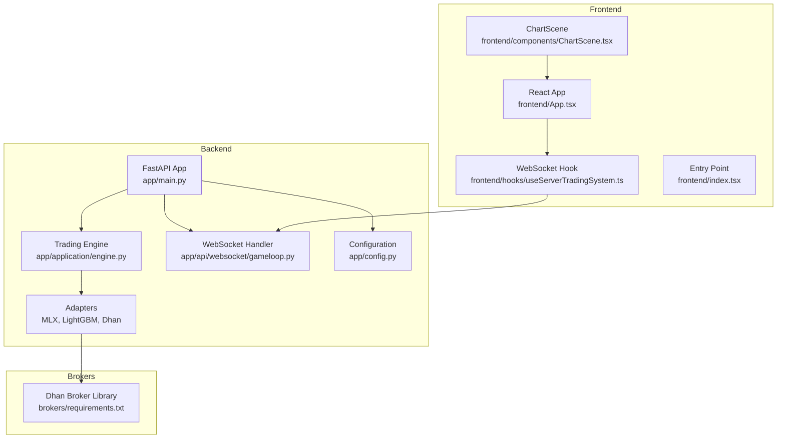
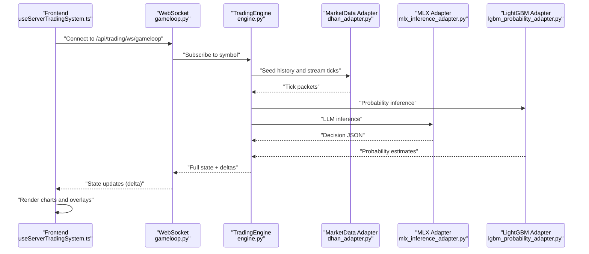
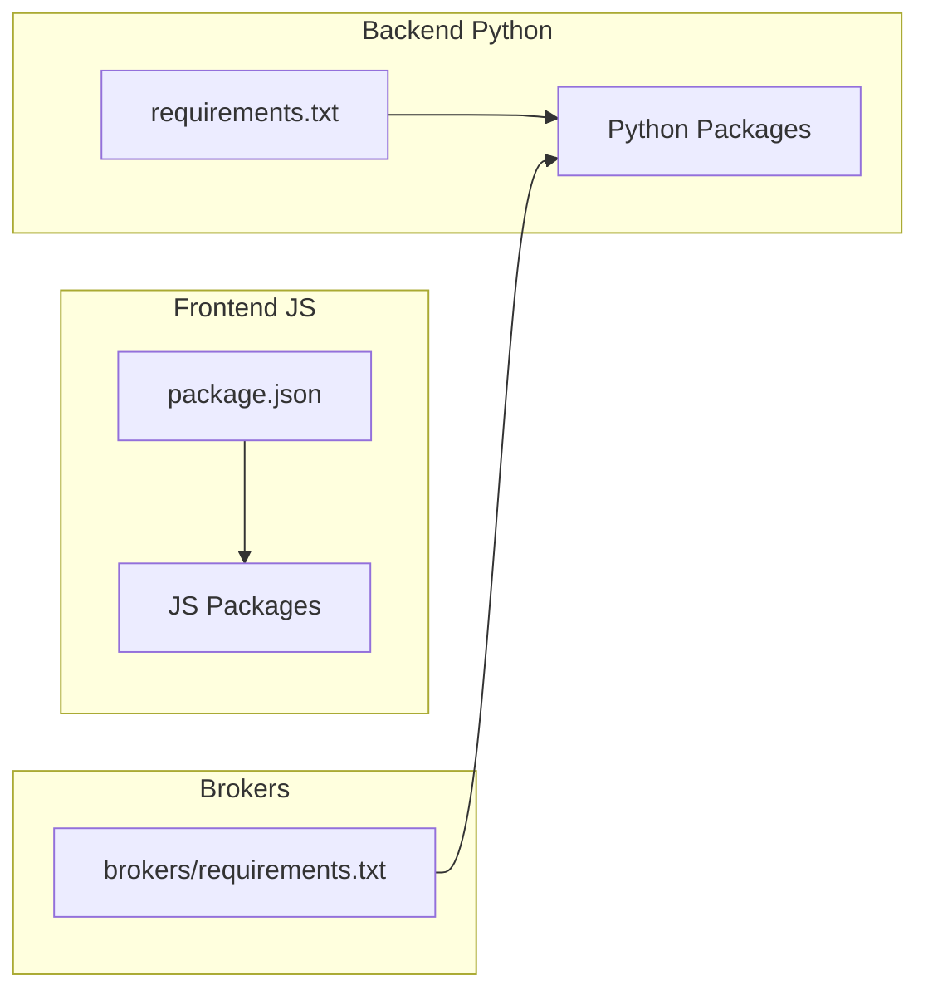

# Technology Stack

<cite>
**Referenced Files in This Document**
- [backend/requirements.txt](file://backend/requirements.txt)
- [frontend/package.json](file://frontend/package.json)
- [backend/setup.py](file://backend/setup.py)
- [brokers/requirements.txt](file://brokers/requirements.txt)
- [backend/app/main.py](file://backend/app/main.py)
- [backend/app/config.py](file://backend/app/config.py)
- [backend/app/infrastructure/adapters/mlx_inference_adapter.py](file://backend/app/infrastructure/adapters/mlx_inference_adapter.py)
- [backend/app/infrastructure/adapters/lgbm_probability_adapter.py](file://backend/app/infrastructure/adapters/lgbm_probability_adapter.py)
- [backend/app/infrastructure/adapters/dhan_adapter.py](file://backend/app/infrastructure/adapters/dhan_adapter.py)
- [backend/app/infrastructure/metrics.py](file://backend/app/infrastructure/metrics.py)
- [backend/app/api/websocket/gameloop.py](file://backend/app/api/websocket/gameloop.py)
- [backend/app/application/engine.py](file://backend/app/application/engine.py)
- [backend/app/domain/ports/market_data.py](file://backend/app/domain/ports/market_data.py)
- [frontend/index.tsx](file://frontend/index.tsx)
- [frontend/App.tsx](file://frontend/App.tsx)
- [frontend/components/ChartScene.tsx](file://frontend/components/ChartScene.tsx)
- [frontend/hooks/useServerTradingSystem.ts](file://frontend/hooks/useServerTradingSystem.ts)
- [frontend/constants.ts](file://frontend/constants.ts)
</cite>

## Table of Contents
1. [Introduction](#introduction)
2. [Project Structure](#project-structure)
3. [Core Components](#core-components)
4. [Architecture Overview](#architecture-overview)
5. [Detailed Component Analysis](#detailed-component-analysis)
6. [Dependency Analysis](#dependency-analysis)
7. [Performance Considerations](#performance-considerations)
8. [Troubleshooting Guide](#troubleshooting-guide)
9. [Conclusion](#conclusion)

## Introduction
This document describes the GlassyTrade AI v5 technology stack spanning the backend built with Python FastAPI, the frontend built with React and TypeScript, and specialized libraries for algorithmic trading. It covers core dependencies (MLX for Apple Silicon machine learning inference, LightGBM for probability modeling, and Dhan broker integration), frontend visualization (Three.js for 3D scenes, lightweight-charts for candlesticks), WebSocket real-time streaming, development/testing tools, deployment infrastructure, version compatibility requirements, performance characteristics, and the rationale behind technology choices that support high-frequency trading operations.

## Project Structure
The repository is organized into three primary areas:
- backend: FastAPI application, trading engine, adapters, configuration, and metrics
- frontend: React/TypeScript dashboard with visualization components and WebSocket integration
- brokers: Dhan broker integration library and related utilities

**Diagram sources**
- [backend/app/main.py:1-227](file://backend/app/main.py#L1-L227)
- [backend/app/application/engine.py:1-981](file://backend/app/application/engine.py#L1-L981)
- [backend/app/api/websocket/gameloop.py:1-356](file://backend/app/api/websocket/gameloop.py#L1-L356)
- [backend/app/config.py:1-157](file://backend/app/config.py#L1-L157)
- [frontend/App.tsx:1-395](file://frontend/App.tsx#L1-L395)
- [frontend/components/ChartScene.tsx:1-1514](file://frontend/components/ChartScene.tsx#L1-L1514)
- [frontend/hooks/useServerTradingSystem.ts:1-655](file://frontend/hooks/useServerTradingSystem.ts#L1-L655)
- [frontend/index.tsx:1-16](file://frontend/index.tsx#L1-L16)
- [brokers/requirements.txt:1-9](file://brokers/requirements.txt#L1-L9)

**Section sources**
- [backend/app/main.py:1-227](file://backend/app/main.py#L1-L227)
- [frontend/App.tsx:1-395](file://frontend/App.tsx#L1-L395)

## Core Components
- Backend FastAPI application initializes the service graph, loads the LLM model, starts the trading engine, and exposes REST and WebSocket endpoints.
- Trading engine runs independently of frontend connections, aggregates ticks, builds state snapshots, and streams updates via WebSocket.
- Adapters encapsulate Apple Silicon MLX inference, LightGBM probability modeling, and Dhan broker connectivity.
- Frontend is a pure renderer that consumes backend state via WebSocket and renders charts and overlays.

Key implementation references:
- Application entry and startup: [backend/app/main.py:83-176](file://backend/app/main.py#L83-L176)
- Trading engine lifecycle and state management: [backend/app/application/engine.py:131-276](file://backend/app/application/engine.py#L131-L276)
- WebSocket streaming and delta compression: [backend/app/api/websocket/gameloop.py:198-337](file://backend/app/api/websocket/gameloop.py#L198-L337)
- Configuration and environment settings: [backend/app/config.py:26-156](file://backend/app/config.py#L26-L156)

**Section sources**
- [backend/app/main.py:83-176](file://backend/app/main.py#L83-L176)
- [backend/app/application/engine.py:131-276](file://backend/app/application/engine.py#L131-L276)
- [backend/app/api/websocket/gameloop.py:198-337](file://backend/app/api/websocket/gameloop.py#L198-L337)
- [backend/app/config.py:26-156](file://backend/app/config.py#L26-L156)

## Architecture Overview
GlassyTrade AI v5 follows a server-driven architecture:
- Backend FastAPI serves configuration, metrics, and WebSocket state updates.
- Trading engine continuously processes market data and produces state deltas.
- Frontend connects via WebSocket, receives deltas, and renders charts and overlays.
- Specialized adapters provide ML inference, probability modeling, and broker connectivity.

**Diagram sources**
- [frontend/hooks/useServerTradingSystem.ts:509-570](file://frontend/hooks/useServerTradingSystem.ts#L509-L570)
- [backend/app/api/websocket/gameloop.py:198-337](file://backend/app/api/websocket/gameloop.py#L198-L337)
- [backend/app/application/engine.py:620-800](file://backend/app/application/engine.py#L620-L800)
- [backend/app/infrastructure/adapters/dhan_adapter.py:211-318](file://backend/app/infrastructure/adapters/dhan_adapter.py#L211-L318)
- [backend/app/infrastructure/adapters/mlx_inference_adapter.py:184-265](file://backend/app/infrastructure/adapters/mlx_inference_adapter.py#L184-L265)
- [backend/app/infrastructure/adapters/lgbm_probability_adapter.py:119-155](file://backend/app/infrastructure/adapters/lgbm_probability_adapter.py#L119-L155)

## Detailed Component Analysis

### Backend FastAPI Application
- Initializes logging, loads LLM model, starts trading engine, and mounts routers.
- Implements a simple in-memory rate limiter middleware.
- CORS is configured via settings.

Implementation highlights:
- Startup and shutdown lifecycle: [backend/app/main.py:83-176](file://backend/app/main.py#L83-L176)
- Rate limiting middleware: [backend/app/main.py:195-209](file://backend/app/main.py#L195-L209)
- CORS configuration: [backend/app/main.py:178-185](file://backend/app/main.py#L178-L185)

**Section sources**
- [backend/app/main.py:83-176](file://backend/app/main.py#L83-L176)
- [backend/app/main.py:195-209](file://backend/app/main.py#L195-L209)

### Trading Engine
- Independent of frontend connections; seeds history, aggregates ticks, throttles processing, and notifies viewers.
- Maintains per-symbol state, generation counter, and selective deep copies for thread safety.
- Integrates with watchdog managers and range bar builders.

Key references:
- Lifecycle and state management: [backend/app/application/engine.py:131-276](file://backend/app/application/engine.py#L131-L276)
- History seeding and recovery: [backend/app/application/engine.py:372-576](file://backend/app/application/engine.py#L372-L576)
- Tick loop and throttling: [backend/app/application/engine.py:628-800](file://backend/app/application/engine.py#L628-L800)

**Section sources**
- [backend/app/application/engine.py:131-276](file://backend/app/application/engine.py#L131-L276)
- [backend/app/application/engine.py:372-576](file://backend/app/application/engine.py#L372-L576)
- [backend/app/application/engine.py:628-800](file://backend/app/application/engine.py#L628-L800)

### WebSocket Game Loop
- Server-driven mode: sends config, history, current snapshot, then deltas on updates.
- Delta compression reduces bandwidth and improves responsiveness.
- Heartbeat mechanism detects dead connections.

References:
- Viewer loop and delta compression: [backend/app/api/websocket/gameloop.py:198-337](file://backend/app/api/websocket/gameloop.py#L198-L337)
- Delta computation: [backend/app/api/websocket/gameloop.py:50-61](file://backend/app/api/websocket/gameloop.py#L50-L61)

**Section sources**
- [backend/app/api/websocket/gameloop.py:198-337](file://backend/app/api/websocket/gameloop.py#L198-L337)
- [backend/app/api/websocket/gameloop.py:50-61](file://backend/app/api/websocket/gameloop.py#L50-L61)

### MLX Inference Adapter (Apple Silicon)
- Singleton adapter for MLX-based LLM inference with background loading and cloud fallback.
- Serializes GPU calls with a lock to avoid Metal crashes.
- Validates model readiness and supports structured JSON extraction.

References:
- Adapter class and predict logic: [backend/app/infrastructure/adapters/mlx_inference_adapter.py:12-265](file://backend/app/infrastructure/adapters/mlx_inference_adapter.py#L12-L265)
- Cloud fallback with exponential backoff: [backend/app/infrastructure/adapters/mlx_inference_adapter.py:82-182](file://backend/app/infrastructure/adapters/mlx_inference_adapter.py#L82-L182)

**Section sources**
- [backend/app/infrastructure/adapters/mlx_inference_adapter.py:12-265](file://backend/app/infrastructure/adapters/mlx_inference_adapter.py#L12-L265)
- [backend/app/infrastructure/adapters/mlx_inference_adapter.py:82-182](file://backend/app/infrastructure/adapters/mlx_inference_adapter.py#L82-L182)

### LightGBM Probability Adapter
- Loads pre-trained models for first-passage probability inference and optional Platt scaling.
- Provides calibrated estimates and optional MFE quantile models for dynamic take-profit.

References:
- Adapter class and estimate method: [backend/app/infrastructure/adapters/lgbm_probability_adapter.py:24-155](file://backend/app/infrastructure/adapters/lgbm_probability_adapter.py#L24-L155)

**Section sources**
- [backend/app/infrastructure/adapters/lgbm_probability_adapter.py:24-155](file://backend/app/infrastructure/adapters/lgbm_probability_adapter.py#L24-L155)

### Dhan Broker Adapter
- Implements MarketDataPort using the brokers/ library for NSE/NFO/MCX instruments.
- Provides historical data, order book depth, and live streaming with fallbacks.
- Handles exchange detection and option chain resolution.

References:
- Adapter class and stream methods: [backend/app/infrastructure/adapters/dhan_adapter.py:66-457](file://backend/app/infrastructure/adapters/dhan_adapter.py#L66-L457)
- Market data port interface: [backend/app/domain/ports/market_data.py:19-112](file://backend/app/domain/ports/market_data.py#L19-L112)

**Section sources**
- [backend/app/infrastructure/adapters/dhan_adapter.py:66-457](file://backend/app/infrastructure/adapters/dhan_adapter.py#L66-L457)
- [backend/app/domain/ports/market_data.py:19-112](file://backend/app/domain/ports/market_data.py#L19-L112)

### Metrics Collection
- Tracks inference latency, signal counts, P&L, cache hits/misses, regime changes, and ticks processed.
- Exposes metrics via a dictionary for the metrics endpoint.

References:
- Metrics collector: [backend/app/infrastructure/metrics.py:14-97](file://backend/app/infrastructure/metrics.py#L14-L97)

**Section sources**
- [backend/app/infrastructure/metrics.py:14-97](file://backend/app/infrastructure/metrics.py#L14-L97)

### Frontend Dashboard

#### React/TypeScript Entry and App Shell
- React app bootstrapped via index.tsx.
- App shell manages UI state, pages, and integrates the trading system hook.

References:
- Entry point: [frontend/index.tsx:1-16](file://frontend/index.tsx#L1-L16)
- App shell and pages: [frontend/App.tsx:16-395](file://frontend/App.tsx#L16-L395)

**Section sources**
- [frontend/index.tsx:1-16](file://frontend/index.tsx#L1-L16)
- [frontend/App.tsx:16-395](file://frontend/App.tsx#L16-L395)

#### ChartScene (lightweight-charts)
- Renders candlesticks, volume, overlays, and dynamic canvases for footprint and volume profiles.
- Implements memoization and canvas overlay drawing for performance.

References:
- Chart initialization and rendering: [frontend/components/ChartScene.tsx:116-275](file://frontend/components/ChartScene.tsx#L116-L275)
- Overlay drawing and profile rendering: [frontend/components/ChartScene.tsx:375-425](file://frontend/components/ChartScene.tsx#L375-L425)

**Section sources**
- [frontend/components/ChartScene.tsx:116-275](file://frontend/components/ChartScene.tsx#L116-L275)
- [frontend/components/ChartScene.tsx:375-425](file://frontend/components/ChartScene.tsx#L375-L425)

#### WebSocket Hook (useServerTradingSystem)
- Establishes WebSocket connection to backend, batches updates, handles heartbeats, and merges deltas.
- Manages symbol switching, stale data detection, and LLM decision history.

References:
- Connection and message handling: [frontend/hooks/useServerTradingSystem.ts:509-570](file://frontend/hooks/useServerTradingSystem.ts#L509-L570)
- Delta merging and batching: [frontend/hooks/useServerTradingSystem.ts:290-396](file://frontend/hooks/useServerTradingSystem.ts#L290-L396)

**Section sources**
- [frontend/hooks/useServerTradingSystem.ts:509-570](file://frontend/hooks/useServerTradingSystem.ts#L509-L570)
- [frontend/hooks/useServerTradingSystem.ts:290-396](file://frontend/hooks/useServerTradingSystem.ts#L290-L396)

#### Constants and Defaults
- Default chart configuration and sample prompts.

References:
- Defaults: [frontend/constants.ts:4-19](file://frontend/constants.ts#L4-L19)

**Section sources**
- [frontend/constants.ts:4-19](file://frontend/constants.ts#L4-L19)

## Dependency Analysis
Technology stack dependencies and compatibility:

- Backend Python dependencies:
  - FastAPI and Uvicorn for ASGI server
  - Pydantic for configuration validation
  - HTTPX and WebSockets for client and server communications
  - PyTorch, Transformers, PEFT, Accelerate for LLM serving
  - MLX and MLX-LLM for Apple Silicon optimized inference
  - LightGBM for probability modeling
  - PyYAML for configuration

- Frontend dependencies:
  - React 19 and React DOM
  - lightweight-charts 4.1.1 for candlestick rendering
  - Three.js and @react-three/fiber/@react-three/drei for 3D scenes
  - UUID for identifiers
  - TailwindCSS and Vite for build tooling

- Broker integration:
  - aiohttp, pandas, requests for network and data handling
  - Dhan broker library for market data and streaming

**Diagram sources**
- [backend/requirements.txt:1-22](file://backend/requirements.txt#L1-L22)
- [frontend/package.json:1-39](file://frontend/package.json#L1-L39)
- [brokers/requirements.txt:1-9](file://brokers/requirements.txt#L1-L9)

**Section sources**
- [backend/requirements.txt:1-22](file://backend/requirements.txt#L1-L22)
- [frontend/package.json:1-39](file://frontend/package.json#L1-L39)
- [brokers/requirements.txt:1-9](file://brokers/requirements.txt#L1-L9)

## Performance Considerations
- MLX on Apple Silicon delivers significantly faster inference compared to PyTorch MPS, with background loading and cloud fallback for availability.
- Lightweight-charts efficiently renders candlesticks and overlays; canvas overlays are redrawn only when relevant data changes.
- WebSocket server-driven mode uses delta compression to minimize bandwidth and improve responsiveness.
- Trading engine throttles processing to reduce CPU load and ensures thread-safe state updates.
- Frontend batches state updates per animation frame to avoid excessive re-renders during high-frequency updates.

[No sources needed since this section provides general guidance]

## Troubleshooting Guide
Common issues and resolutions:
- MLX model not ready: Verify model path environment variables and check readiness/validation logic.
  - References: [backend/app/infrastructure/adapters/mlx_inference_adapter.py:363-374](file://backend/app/infrastructure/adapters/mlx_inference_adapter.py#L363-L374), [backend/app/infrastructure/adapters/mlx_inference_adapter.py:376-395](file://backend/app/infrastructure/adapters/mlx_inference_adapter.py#L376-L395)
- WebSocket disconnections: Heartbeat timeouts and automatic reconnection are handled; inspect connection status and logs.
  - References: [frontend/hooks/useServerTradingSystem.ts:534-564](file://frontend/hooks/useServerTradingSystem.ts#L534-L564)
- Dhan streaming issues: Adapter includes fallback REST polling for specific instruments; monitor logs for initialization failures.
  - References: [backend/app/infrastructure/adapters/dhan_adapter.py:383-434](file://backend/app/infrastructure/adapters/dhan_adapter.py#L383-L434)
- Engine startup failures: Check service graph creation, LLM readiness, and market data initialization.
  - References: [backend/app/main.py:83-127](file://backend/app/main.py#L83-L127), [backend/app/application/engine.py:131-176](file://backend/app/application/engine.py#L131-L176)

**Section sources**
- [backend/app/infrastructure/adapters/mlx_inference_adapter.py:363-395](file://backend/app/infrastructure/adapters/mlx_inference_adapter.py#L363-L395)
- [frontend/hooks/useServerTradingSystem.ts:534-564](file://frontend/hooks/useServerTradingSystem.ts#L534-L564)
- [backend/app/infrastructure/adapters/dhan_adapter.py:383-434](file://backend/app/infrastructure/adapters/dhan_adapter.py#L383-L434)
- [backend/app/main.py:83-127](file://backend/app/main.py#L83-L127)
- [backend/app/application/engine.py:131-176](file://backend/app/application/engine.py#L131-L176)

## Conclusion
GlassyTrade AI v5 combines a high-performance backend built on FastAPI and a React/TypeScript frontend to deliver a server-driven trading platform. Specialized adapters enable Apple Silicon-optimized ML inference, probabilistic modeling, and seamless Dhan broker integration. The architecture emphasizes real-time streaming via WebSocket, efficient rendering with lightweight-charts and canvas overlays, and robust operational safeguards for high-frequency trading environments.