# Integration Testing

<cite>
**Referenced Files in This Document**
- [test_e2e_trading_lifecycle.py](file://backend/tests/integration/test_e2e_trading_lifecycle.py)
- [test_api_endpoints.py](file://backend/tests/integration/test_api_endpoints.py)
- [test_frontend_integration.py](file://backend/tests/integration/test_frontend_integration.py)
- [test_schemas_serialization.py](file://backend/tests/integration/test_schemas_serialization.py)
- [test_gate_chain_integration.py](file://backend/tests/integration/test_gate_chain_integration.py)
- [test_signal_tracking_integration.py](file://backend/tests/integration/test_signal_tracking_integration.py)
- [test_trading_pipeline.py](file://backend/tests/integration/test_trading_pipeline.py)
- [test_mid_trade_recovery.py](file://backend/tests/integration/test_mid_trade_recovery.py)
- [test_failure_scenarios.py](file://backend/tests/integration/test_failure_scenarios.py)
- [gameloop.py](file://backend/app/api/websocket/gameloop.py)
- [main.py](file://backend/app/main.py)
- [conftest.py](file://backend/tests/conftest.py)
- [trading-flow.test.tsx](file://frontend/tests/integration/trading-flow.test.tsx)
</cite>

## Table of Contents
1. [Introduction](#introduction)
2. [Project Structure](#project-structure)
3. [Core Components](#core-components)
4. [Architecture Overview](#architecture-overview)
5. [Detailed Component Analysis](#detailed-component-analysis)
6. [Dependency Analysis](#dependency-analysis)
7. [Performance Considerations](#performance-considerations)
8. [Troubleshooting Guide](#troubleshooting-guide)
9. [Conclusion](#conclusion)
10. [Appendices](#appendices)

## Introduction
This document provides comprehensive integration testing guidance for GlassyTrade AI v5. It covers end-to-end trading lifecycle testing, API endpoint validation, frontend-backend integration verification, dual engine synchronization, gate chain integration, and signal tracking integration. It also explains WebSocket communication, real-time data streaming, state synchronization, and outlines practical testing setup, environment configuration, and data flow validation across system boundaries. Guidance is included for managing test data, cleanup procedures, and debugging distributed system interactions.

## Project Structure
GlassyTrade AI v5 integrates backend services (FastAPI), trading engine, WebSocket gameloop, and a React-based frontend. Integration tests span:
- Backend integration tests validating REST endpoints, WebSocket gameloop, DTO serialization, gate chains, signal tracking, and failure scenarios
- Frontend integration tests validating UI component interactions and contracts with backend

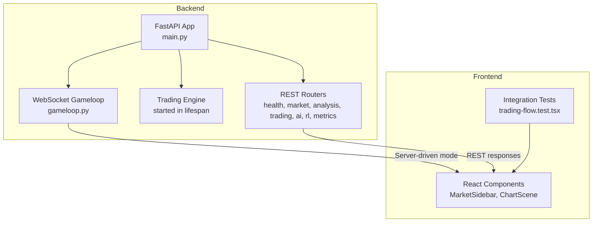

**Diagram sources**
- [main.py:83-176](file://backend/app/main.py#L83-L176)
- [gameloop.py:112-196](file://backend/app/api/websocket/gameloop.py#L112-L196)

**Section sources**
- [main.py:83-176](file://backend/app/main.py#L83-L176)
- [gameloop.py:112-196](file://backend/app/api/websocket/gameloop.py#L112-L196)

## Core Components
- Trading lifecycle pipeline: validates tick ingestion, analysis, signal generation, position management, and portfolio accounting end-to-end
- REST API coverage: health, trading, analysis, AI journal endpoints
- WebSocket gameloop: server-driven mode streaming, history seeding, delta compression, and error handling
- DTO serialization: round-trip validation for domain models to frontend contracts
- Gate chain integration: verifies gating logic across multiple filters
- Signal tracking integration: validates decision recording and persistence
- Mid-trade recovery: engine restart recovery of open positions
- Failure scenarios: financial calculations, risk management, thread safety, data integrity, edge cases, performance, idempotency, and failure mode simulation

**Section sources**
- [test_e2e_trading_lifecycle.py:85-697](file://backend/tests/integration/test_e2e_trading_lifecycle.py#L85-L697)
- [test_api_endpoints.py:14-247](file://backend/tests/integration/test_api_endpoints.py#L14-L247)
- [test_frontend_integration.py:129-402](file://backend/tests/integration/test_frontend_integration.py#L129-L402)
- [test_schemas_serialization.py:27-205](file://backend/tests/integration/test_schemas_serialization.py#L27-L205)
- [test_gate_chain_integration.py:58-239](file://backend/tests/integration/test_gate_chain_integration.py#L58-L239)
- [test_signal_tracking_integration.py:13-208](file://backend/tests/integration/test_signal_tracking_integration.py#L13-L208)
- [test_mid_trade_recovery.py:13-201](file://backend/tests/integration/test_mid_trade_recovery.py#L13-L201)
- [test_failure_scenarios.py:18-441](file://backend/tests/integration/test_failure_scenarios.py#L18-L441)

## Architecture Overview
The backend FastAPI application initializes a service graph at startup, loads the LLM model, starts the trading engine, and exposes REST and WebSocket endpoints. The WebSocket gameloop supports server-driven mode, sending configuration, historical data, and state deltas to clients. Frontend components consume REST and WebSocket streams to render charts and manage trading sessions.

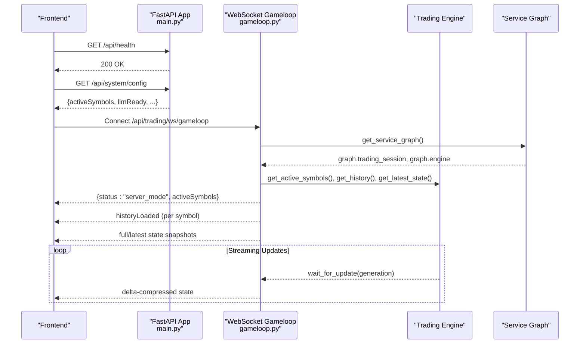

**Diagram sources**
- [main.py:83-176](file://backend/app/main.py#L83-L176)
- [gameloop.py:198-337](file://backend/app/api/websocket/gameloop.py#L198-L337)

## Detailed Component Analysis

### End-to-End Trading Lifecycle Testing
This suite validates the complete pipeline from market data ingestion to trade execution and accounting:
- Tick ingestion and session state growth
- Slippage and commission modeling in open/close cycles
- Equity history population and closed trade tracking
- Independent symbol sessions and state isolation
- WebSocket server-driven mode behavior and error handling
- REST endpoints for system controls and analytics

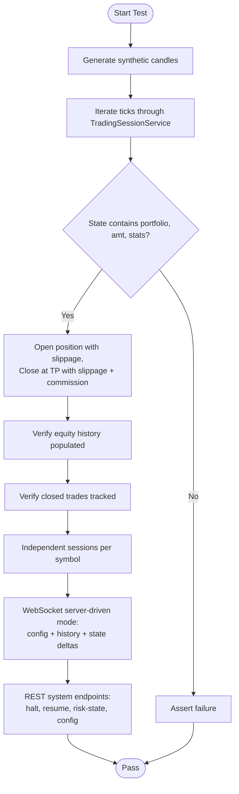

**Diagram sources**
- [test_e2e_trading_lifecycle.py:85-381](file://backend/tests/integration/test_e2e_trading_lifecycle.py#L85-L381)
- [gameloop.py:198-337](file://backend/app/api/websocket/gameloop.py#L198-L337)

**Section sources**
- [test_e2e_trading_lifecycle.py:85-381](file://backend/tests/integration/test_e2e_trading_lifecycle.py#L85-L381)
- [gameloop.py:198-337](file://backend/app/api/websocket/gameloop.py#L198-L337)

### API Endpoint Validation
This suite ensures REST endpoints return expected shapes and behaviors:
- Health endpoint returns ok with checks
- Trading endpoints create portfolios and compute stats
- Analysis endpoints return valid shapes for AMT, prediction, and footprint
- AI journal endpoints accept parameters and return assessments

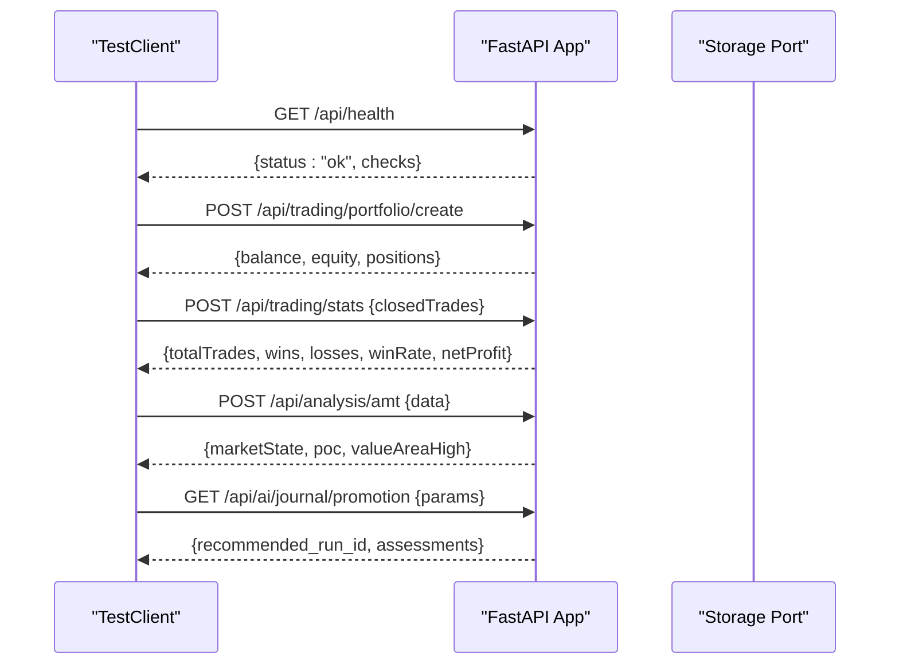

**Diagram sources**
- [test_api_endpoints.py:14-247](file://backend/tests/integration/test_api_endpoints.py#L14-L247)

**Section sources**
- [test_api_endpoints.py:14-247](file://backend/tests/integration/test_api_endpoints.py#L14-L247)

### Frontend-Backend Integration Verification
This suite validates the WebSocket gameloop and DTO contracts expected by the frontend:
- Server-driven mode configuration and history seeding
- State snapshot delivery and delta compression
- Error handling for invalid ticks
- DTO serialization keys match frontend TypeScript interfaces

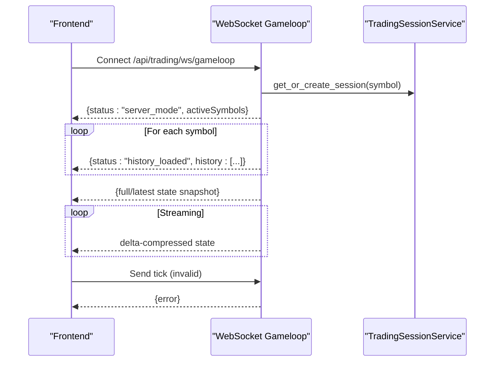

**Diagram sources**
- [test_frontend_integration.py:129-288](file://backend/tests/integration/test_frontend_integration.py#L129-L288)
- [gameloop.py:198-337](file://backend/app/api/websocket/gameloop.py#L198-L337)

**Section sources**
- [test_frontend_integration.py:129-288](file://backend/tests/integration/test_frontend_integration.py#L129-L288)
- [gameloop.py:198-337](file://backend/app/api/websocket/gameloop.py#L198-L337)

### DTO Serialization Contract Testing
Ensures domain models serialize/deserialize to DTOs with correct camelCase keys expected by the frontend:
- OHLC, OrderBook, ModelWeights, Position, Portfolio, Signal, AMTResult, StrategyStats, PositionEvent, Footprint

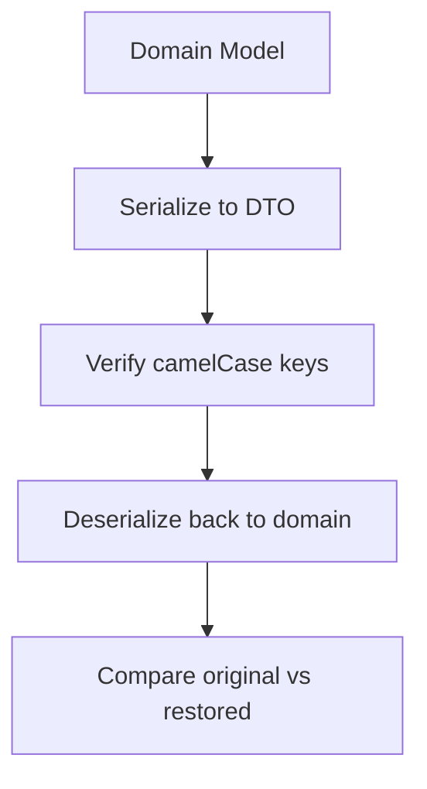

**Diagram sources**
- [test_schemas_serialization.py:27-205](file://backend/tests/integration/test_schemas_serialization.py#L27-L205)

**Section sources**
- [test_schemas_serialization.py:27-205](file://backend/tests/integration/test_schemas_serialization.py#L27-L205)

### Dual Engine Synchronization Tests
Validates that entry and overseer engines share the same narrative context and JSON contract enforcement. These tests are currently skipped pending live broker/MLX fixtures.

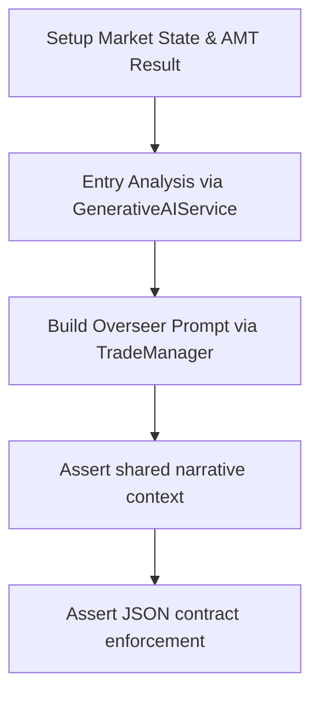

**Diagram sources**
- [test_dual_engine_sync.py:31-113](file://backend/tests/integration/test_dual_engine_sync.py#L31-L113)

**Section sources**
- [test_dual_engine_sync.py:31-113](file://backend/tests/integration/test_dual_engine_sync.py#L31-L113)

### Gate Chain Integration Validation
Verifies that the gate chain correctly evaluates market conditions and blocks or allows signals:
- All gates pass for clean setups
- Individual gate failures (CVD, profile shape, etc.)
- Gate ordering matters (first failure blocks)
- Empty and single-gate chains

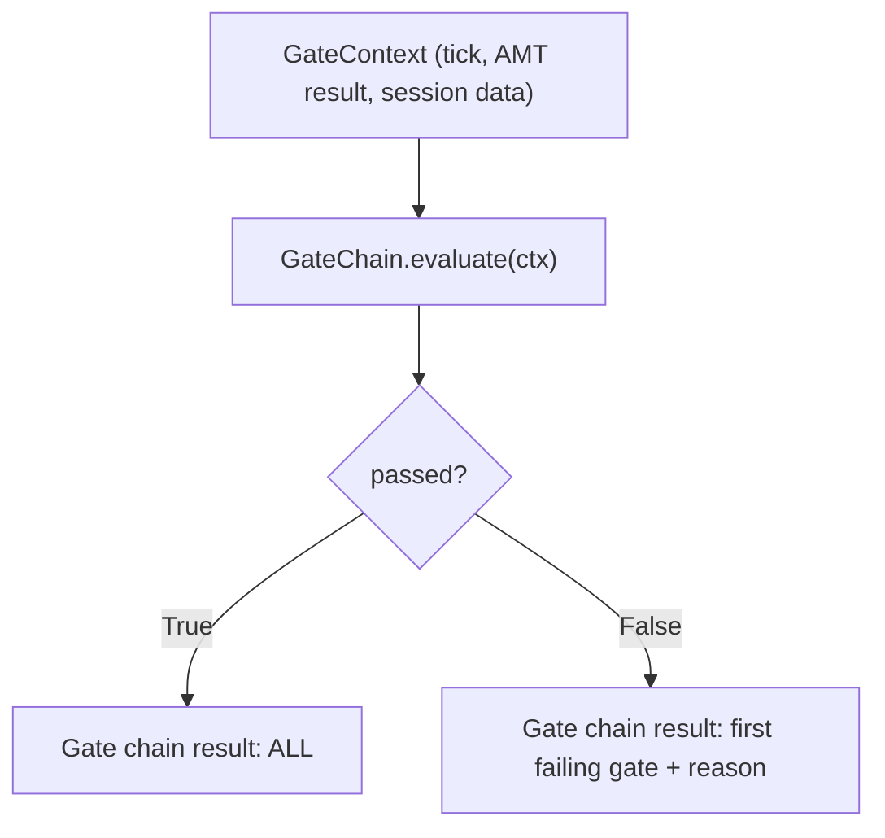

**Diagram sources**
- [test_gate_chain_integration.py:58-239](file://backend/tests/integration/test_gate_chain_integration.py#L58-L239)

**Section sources**
- [test_gate_chain_integration.py:58-239](file://backend/tests/integration/test_gate_chain_integration.py#L58-L239)

### Signal Tracking Integration Testing
Validates signal tracking service behavior:
- Track signal generation, gate blocks, waiting, cooldown states
- Aggregate stats across symbols and calculate rates
- Persist decisions to storage and retrieve recent decisions

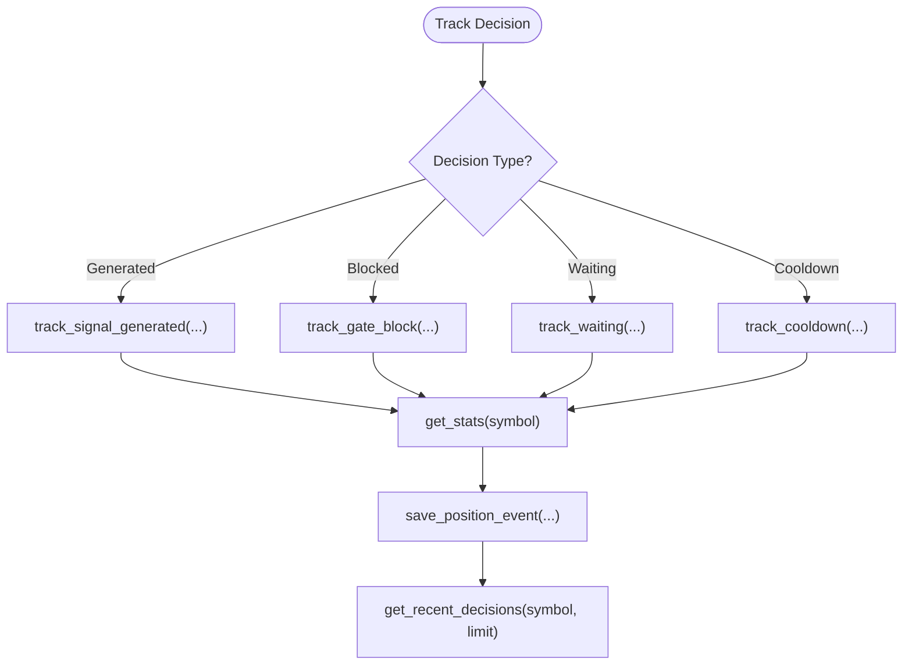

**Diagram sources**
- [test_signal_tracking_integration.py:13-208](file://backend/tests/integration/test_signal_tracking_integration.py#L13-L208)

**Section sources**
- [test_signal_tracking_integration.py:13-208](file://backend/tests/integration/test_signal_tracking_integration.py#L13-L208)

### Mid-Trade Recovery Across Engine Restart
Validates that open positions are recovered after engine restarts by loading from persistent storage and restoring to sessions:
- Empty DB recovery
- Adding new symbols to active lists
- Error handling and graceful degradation
- Skipping invalid positions

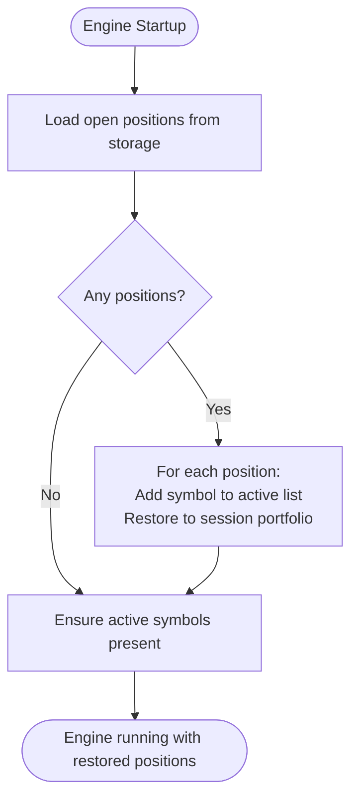

**Diagram sources**
- [test_mid_trade_recovery.py:13-201](file://backend/tests/integration/test_mid_trade_recovery.py#L13-L201)

**Section sources**
- [test_mid_trade_recovery.py:13-201](file://backend/tests/integration/test_mid_trade_recovery.py#L13-L201)

### WebSocket Communication and Real-Time Streaming
The WebSocket gameloop implements server-driven mode with:
- Configuration message sent first
- History seeding per symbol
- Full state snapshots and periodic delta compression
- Generation-based polling and keepalive
- Robust error handling for invalid JSON, network errors, and timeouts

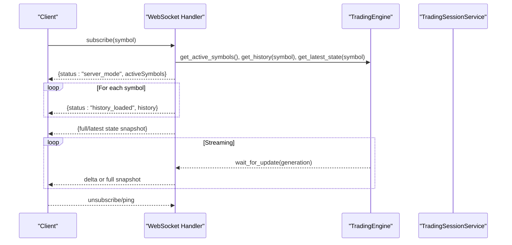

**Diagram sources**
- [gameloop.py:198-337](file://backend/app/api/websocket/gameloop.py#L198-L337)

**Section sources**
- [gameloop.py:198-337](file://backend/app/api/websocket/gameloop.py#L198-L337)

### Frontend Integration (React Components)
Validates UI component interactions and contracts:
- MarketSidebar and ChartScene render together
- Active symbol selection updates ChartScene
- Filter state maintained across symbol switches
- Live feed status indicators
- Mode switching between STANDARD and FOOTPRINT

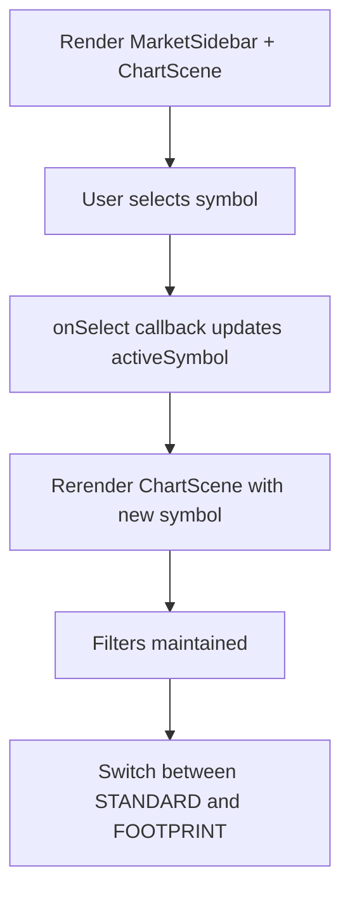

**Diagram sources**
- [trading-flow.test.tsx:57-344](file://frontend/tests/integration/trading-flow.test.tsx#L57-L344)

**Section sources**
- [trading-flow.test.tsx:57-344](file://frontend/tests/integration/trading-flow.test.tsx#L57-L344)

## Dependency Analysis
Integration tests rely on a shared test configuration that ensures import resolution across monorepo packages and uses mocking to isolate external dependencies.

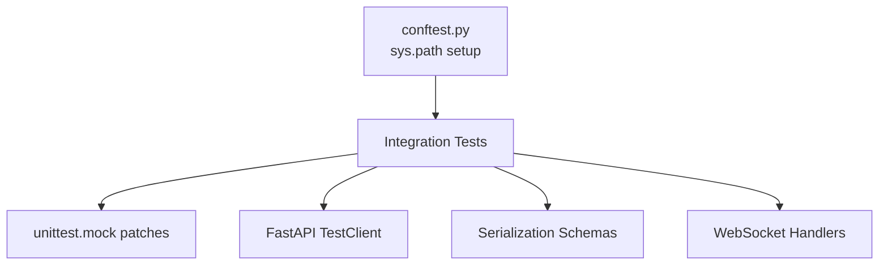

**Diagram sources**
- [conftest.py:16-35](file://backend/tests/conftest.py#L16-L35)

**Section sources**
- [conftest.py:16-35](file://backend/tests/conftest.py#L16-L35)

## Performance Considerations
- WebSocket delta compression reduces bandwidth and improves responsiveness
- Generation-based polling minimizes redundant state transmission
- DTO serialization uses aliasing for camelCase keys to avoid extra transformations
- Frontend tests mock heavy libraries (e.g., lightweight-charts) to reduce overhead

[No sources needed since this section provides general guidance]

## Troubleshooting Guide
Common issues and remedies:
- Invalid tick validation: ensure high >= low and positive numeric values
- JSON decode errors: verify client JSON formatting and handle unsupported data codes
- Engine readiness: confirm LLM model readiness and trading engine start in lifespan
- Storage connectivity: handle exceptions during recovery and graceful degradation
- Frontend contract mismatches: align DTO keys with frontend TypeScript interfaces

**Section sources**
- [gameloop.py:96-196](file://backend/app/api/websocket/gameloop.py#L96-L196)
- [main.py:83-176](file://backend/app/main.py#L83-L176)
- [test_mid_trade_recovery.py:120-139](file://backend/tests/integration/test_mid_trade_recovery.py#L120-L139)
- [test_schemas_serialization.py:27-205](file://backend/tests/integration/test_schemas_serialization.py#L27-L205)

## Conclusion
GlassyTrade AI v5 integration tests comprehensively validate the trading lifecycle, REST and WebSocket APIs, DTO contracts, gate chains, signal tracking, and recovery mechanisms. They ensure robustness against failure scenarios and maintain frontend-backend alignment. The guidance provided enables reliable testing, debugging, and continuous validation of distributed system interactions.

## Appendices
- Integration test setup: use FastAPI TestClient and patch service graph; ensure sys.path includes shared and brokers packages
- Environment configuration: verify CORS origins, rate limiting middleware, and LLM readiness during startup
- Data flow validation: leverage delta compression and generation polling for efficient state synchronization
- Cleanup procedures: gracefully stop the trading engine, flush storage ticks, and disconnect market data feeds

[No sources needed since this section summarizes without analyzing specific files]