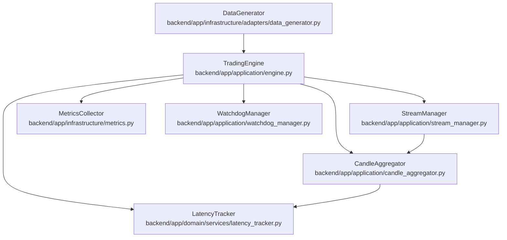
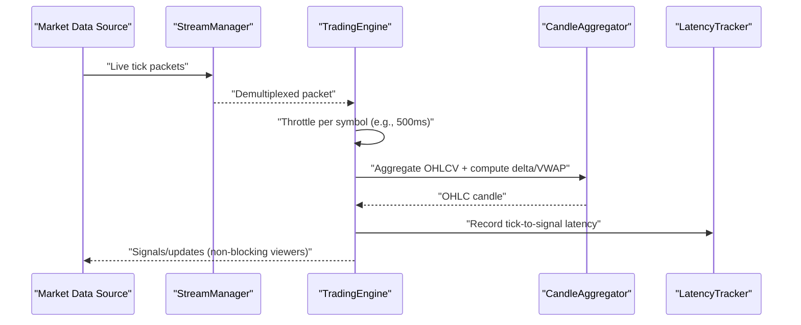
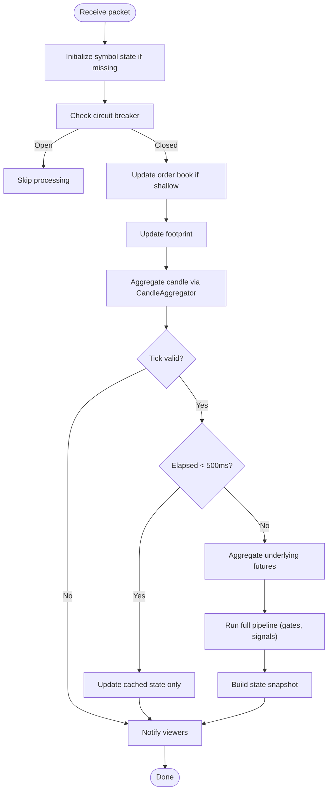
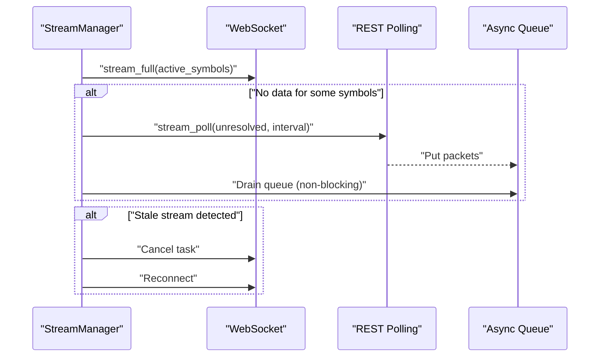
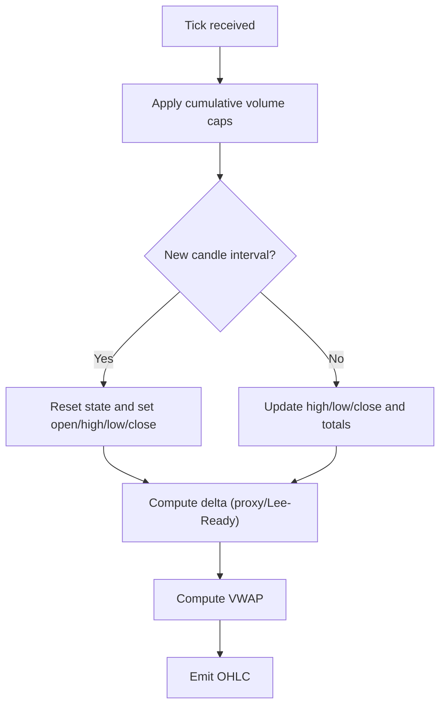
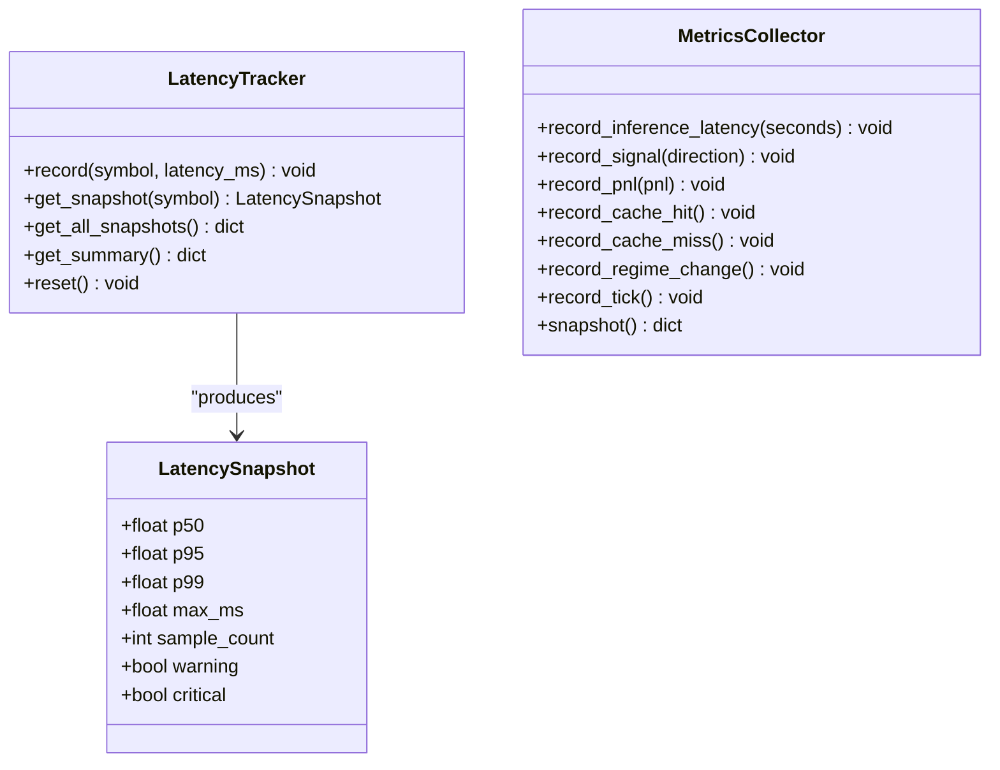
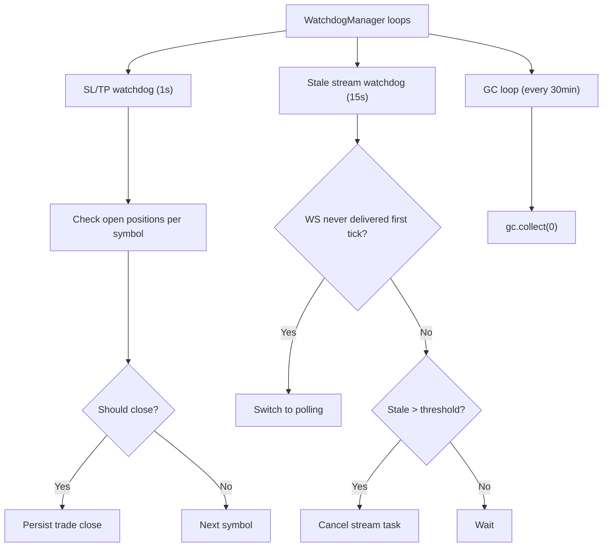
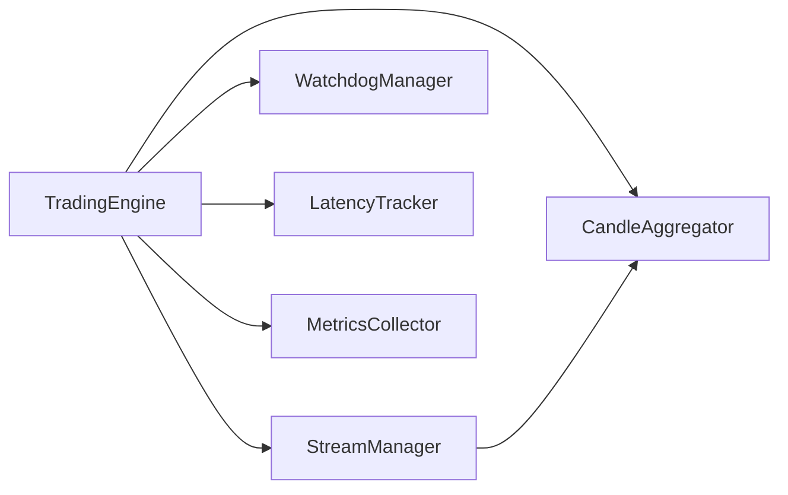

# Performance Testing

<cite>
**Referenced Files in This Document**
- [engine.py](file://backend/app/application/engine.py)
- [stream_manager.py](file://backend/app/application/stream_manager.py)
- [candle_aggregator.py](file://backend/app/application/candle_aggregator.py)
- [latency_tracker.py](file://backend/app/domain/services/latency_tracker.py)
- [metrics.py](file://backend/app/infrastructure/metrics.py)
- [watchdog_manager.py](file://backend/app/application/watchdog_manager.py)
- [data_generator.py](file://backend/app/infrastructure/adapters/data_generator.py)
- [test_optimizations.py](file://backend/tests/unit/test_optimizations.py)
- [baseline_test_results.json](file://backend/tests/baseline_test_results.json)
- [10_qa_test_plan.md](file://plan/10_qa_test_plan.md)
- [fulldoc.md](file://backups/docs/fulldoc.md)
</cite>

## Table of Contents
1. [Introduction](#introduction)
2. [Project Structure](#project-structure)
3. [Core Components](#core-components)
4. [Architecture Overview](#architecture-overview)
5. [Detailed Component Analysis](#detailed-component-analysis)
6. [Dependency Analysis](#dependency-analysis)
7. [Performance Considerations](#performance-considerations)
8. [Troubleshooting Guide](#troubleshooting-guide)
9. [Conclusion](#conclusion)
10. [Appendices](#appendices)

## Introduction
This document defines a comprehensive performance testing strategy for the GlassyTrade AI v5 system. It covers benchmarking methodologies for trading engine throughput, memory usage optimization, and real-time processing latency. It also documents hot path performance testing, optimization validation, scalability assessment across multiple symbols and timeframes, load testing strategies for concurrent market data streams, multi-symbol processing, and peak trading volume scenarios. Guidance is included for performance profiling, bottleneck identification, optimization validation, performance monitoring, metrics collection, regression testing, and continuous performance optimization workflows.

## Project Structure
The performance-critical parts of the system are centered around the trading engine, streaming manager, candle aggregation, latency tracking, metrics collection, watchdogs, and synthetic data generation for tests.

**Diagram sources**
- [engine.py:59-126](file://backend/app/application/engine.py#L59-L126)
- [stream_manager.py:185-266](file://backend/app/application/stream_manager.py#L185-L266)
- [candle_aggregator.py:73-113](file://backend/app/application/candle_aggregator.py#L73-L113)
- [latency_tracker.py:27-41](file://backend/app/domain/services/latency_tracker.py#L27-L41)
- [metrics.py:14-37](file://backend/app/infrastructure/metrics.py#L14-L37)
- [watchdog_manager.py:34-61](file://backend/app/application/watchdog_manager.py#L34-L61)
- [data_generator.py:27-51](file://backend/app/infrastructure/adapters/data_generator.py#L27-L51)

**Section sources**
- [engine.py:59-126](file://backend/app/application/engine.py#L59-L126)
- [stream_manager.py:185-266](file://backend/app/application/stream_manager.py#L185-L266)
- [candle_aggregator.py:73-113](file://backend/app/application/candle_aggregator.py#L73-L113)
- [latency_tracker.py:27-41](file://backend/app/domain/services/latency_tracker.py#L27-L41)
- [metrics.py:14-37](file://backend/app/infrastructure/metrics.py#L14-L37)
- [watchdog_manager.py:34-61](file://backend/app/application/watchdog_manager.py#L34-L61)
- [data_generator.py:27-51](file://backend/app/infrastructure/adapters/data_generator.py#L27-L51)

## Core Components
- TradingEngine: Orchestrates streaming, candle aggregation, throttling, and state updates. It controls per-symbol processing cadence and coordinates downstream services.
- StreamManager: Manages WebSocket and REST polling fallback for market data, with dual-path merging and staleness detection.
- CandleAggregator: Builds OHLCV candles from ticks, computes deltas, VWAP, and footprint accumulation.
- LatencyTracker: Tracks tick-to-signal latency per symbol with rolling windows and alert thresholds.
- MetricsCollector: Exposes inference latency, signal counts, P&L, cache metrics, and regime change counts.
- WatchdogManager: Runs independent SL/TP checks, detects stale streams, and performs periodic garbage collection.
- DataGenerator: Produces deterministic synthetic OHLCV data for controlled performance tests.

**Section sources**
- [engine.py:620-800](file://backend/app/application/engine.py#L620-L800)
- [stream_manager.py:185-266](file://backend/app/application/stream_manager.py#L185-L266)
- [candle_aggregator.py:114-256](file://backend/app/application/candle_aggregator.py#L114-L256)
- [latency_tracker.py:43-72](file://backend/app/domain/services/latency_tracker.py#L43-L72)
- [metrics.py:69-97](file://backend/app/infrastructure/metrics.py#L69-L97)
- [watchdog_manager.py:63-197](file://backend/app/application/watchdog_manager.py#L63-L197)
- [data_generator.py:27-51](file://backend/app/infrastructure/adapters/data_generator.py#L27-L51)

## Architecture Overview
The performance-critical pipeline receives live market packets, aggregates into candles, evaluates gates, and emits signals. Latency and throughput are monitored continuously, with watchdogs ensuring resilience and memory hygiene.

**Diagram sources**
- [stream_manager.py:246-266](file://backend/app/application/stream_manager.py#L246-L266)
- [engine.py:768-778](file://backend/app/application/engine.py#L768-L778)
- [candle_aggregator.py:114-256](file://backend/app/application/candle_aggregator.py#L114-L256)
- [latency_tracker.py:37-41](file://backend/app/domain/services/latency_tracker.py#L37-L41)

## Detailed Component Analysis

### TradingEngine Hot Path
- Throttling: Limits per-symbol processing to approximately once every 500 ms to avoid overload.
- State updates: Maintains latest state snapshots per symbol with thread locks to prevent race conditions.
- Underlying futures: Dual-feed aggregation for AMT analysis.
- Notifications: Uses async condition and event loop to notify WebSocket viewers efficiently.

**Diagram sources**
- [engine.py:654-778](file://backend/app/application/engine.py#L654-L778)
- [engine.py:281-358](file://backend/app/application/engine.py#L281-L358)

**Section sources**
- [engine.py:768-778](file://backend/app/application/engine.py#L768-L778)
- [engine.py:281-358](file://backend/app/application/engine.py#L281-L358)

### StreamManager Concurrency and Fallback
- Dual-path streaming: WebSocket primary, REST polling fallback for symbols with no WS data.
- Staleness detection: Cancels stuck streams and triggers reconnects.
- Queue draining: Non-blocking drain of polling queue before switching to WS.

**Diagram sources**
- [stream_manager.py:185-266](file://backend/app/application/stream_manager.py#L185-L266)

**Section sources**
- [stream_manager.py:185-266](file://backend/app/application/stream_manager.py#L185-L266)

### CandleAggregator Throughput and Delta Computation
- Volume caps: Guards against session resets by capping tick volume spikes.
- Delta modes: Supports both body-ratio proxy and Lee-Ready delta depending on feature flag.
- VWAP and footprint: Accumulates per-candle statistics for downstream analysis.

**Diagram sources**
- [candle_aggregator.py:114-256](file://backend/app/application/candle_aggregator.py#L114-L256)

**Section sources**
- [candle_aggregator.py:114-256](file://backend/app/application/candle_aggregator.py#L114-L256)

### LatencyTracker and MetricsCollection
- LatencyTracker: Rolling window of 1000 samples per symbol; computes p50/p95/p99 and flags warnings/criticals.
- MetricsCollector: Aggregates inference latency percentiles, signal counts, P&L, cache hit rates, and regime changes.

**Diagram sources**
- [latency_tracker.py:14-95](file://backend/app/domain/services/latency_tracker.py#L14-L95)
- [metrics.py:14-97](file://backend/app/infrastructure/metrics.py#L14-L97)

**Section sources**
- [latency_tracker.py:43-72](file://backend/app/domain/services/latency_tracker.py#L43-L72)
- [metrics.py:69-97](file://backend/app/infrastructure/metrics.py#L69-L97)

### WatchdogManager Resilience and Memory Hygiene
- SL/TP watchdog: Runs independently to protect positions even when streams are down.
- Stale stream watchdog: Detects and recovers from hung streams.
- GC loop: Periodic garbage collection to prevent memory leaks in long sessions.

**Diagram sources**
- [watchdog_manager.py:63-197](file://backend/app/application/watchdog_manager.py#L63-L197)

**Section sources**
- [watchdog_manager.py:63-197](file://backend/app/application/watchdog_manager.py#L63-L197)

### Synthetic Data Generation for Benchmarks
- Deterministic OHLCV generator supports multiple regimes (bullish, bearish, sideways, volatile) to simulate realistic loads for performance tests.

**Section sources**
- [data_generator.py:27-51](file://backend/app/infrastructure/adapters/data_generator.py#L27-L51)

## Dependency Analysis
- TradingEngine depends on StreamManager, CandleAggregator, WatchdogManager, LatencyTracker, and MetricsCollector.
- StreamManager feeds CandleAggregator and integrates with market data providers.
- LatencyTracker and MetricsCollector are consumed by the engine and exposed via monitoring endpoints.

**Diagram sources**
- [engine.py:108-116](file://backend/app/application/engine.py#L108-L116)
- [stream_manager.py:185-266](file://backend/app/application/stream_manager.py#L185-L266)
- [candle_aggregator.py:73-113](file://backend/app/application/candle_aggregator.py#L73-L113)
- [latency_tracker.py:27-41](file://backend/app/domain/services/latency_tracker.py#L27-L41)
- [metrics.py:14-37](file://backend/app/infrastructure/metrics.py#L14-L37)
- [watchdog_manager.py:34-61](file://backend/app/application/watchdog_manager.py#L34-L61)

**Section sources**
- [engine.py:108-116](file://backend/app/application/engine.py#L108-L116)
- [stream_manager.py:185-266](file://backend/app/application/stream_manager.py#L185-L266)
- [candle_aggregator.py:73-113](file://backend/app/application/candle_aggregator.py#L73-L113)
- [latency_tracker.py:27-41](file://backend/app/domain/services/latency_tracker.py#L27-L41)
- [metrics.py:14-37](file://backend/app/infrastructure/metrics.py#L14-L37)
- [watchdog_manager.py:34-61](file://backend/app/application/watchdog_manager.py#L34-L61)

## Performance Considerations
- Throughput: The engine throttles per-symbol processing to ~500 ms to maintain responsiveness under load.
- Memory: Session data is trimmed to a bounded number of candles to prevent unbounded growth.
- Latency: Rolling window latency tracking with p99 thresholds for warnings and critical alerts.
- Resilience: Watchdogs detect and recover from stale streams and enforce periodic GC.

Practical guidance:
- Use synthetic data to establish baselines across regimes and symbol counts.
- Monitor p95/p99 latency and cache hit rates to identify regressions.
- Validate O(1) operations (e.g., profile updates) and bounded memory growth.

**Section sources**
- [engine.py:768-778](file://backend/app/application/engine.py#L768-L778)
- [test_optimizations.py:26-38](file://backend/tests/unit/test_optimizations.py#L26-L38)
- [latency_tracker.py:64-72](file://backend/app/domain/services/latency_tracker.py#L64-L72)
- [watchdog_manager.py:177-197](file://backend/app/application/watchdog_manager.py#L177-L197)

## Troubleshooting Guide
Common performance issues and diagnostics:
- High p99 latency: Inspect LatencyTracker snapshots and MetricsCollector percentiles to locate bottlenecks.
- Stale streams: Confirm watchdog logs and StreamManager fallback behavior.
- Memory growth: Verify candle trimming and periodic GC activity.
- Signal drops: Review MetricsCollector signal counts and regime change metrics.

Validation steps:
- Establish baseline metrics using synthetic data.
- Run concurrent symbol tests and compare latency percentiles.
- Perform regression testing against the baseline JSON.

**Section sources**
- [latency_tracker.py:78-92](file://backend/app/domain/services/latency_tracker.py#L78-L92)
- [metrics.py:69-97](file://backend/app/infrastructure/metrics.py#L69-L97)
- [watchdog_manager.py:130-175](file://backend/app/application/watchdog_manager.py#L130-L175)
- [baseline_test_results.json:1-28](file://backend/tests/baseline_test_results.json#L1-L28)

## Conclusion
GlassyTrade AI v5 provides built-in mechanisms for performance monitoring and resilience. By leveraging LatencyTracker, MetricsCollector, WatchdogManager, and synthetic data generation, teams can establish benchmarks, validate optimizations, and ensure scalable, low-latency operation across multiple symbols and timeframes.

## Appendices

### Benchmarking Methodologies
- Throughput: Measure ticks per second across increasing symbol counts and timeframes using synthetic data generators.
- Memory: Track session data length and GC activity; validate bounded growth under sustained load.
- Latency: Record tick-to-signal latency per symbol and compute p50/p95/p99; alert on critical thresholds.

**Section sources**
- [data_generator.py:27-51](file://backend/app/infrastructure/adapters/data_generator.py#L27-L51)
- [latency_tracker.py:64-72](file://backend/app/domain/services/latency_tracker.py#L64-L72)
- [metrics.py:69-97](file://backend/app/infrastructure/metrics.py#L69-L97)

### Load Testing Strategies
- Concurrent symbols: Scale from 1 to 10+ symbols and measure end-to-end latency and throughput.
- Multi-timeframe: Vary STREAM_INTERVAL and validate candle aggregation throughput.
- Peak volume: Use volatile regimes and high-frequency ticks to stress delta computation and footprint accumulation.

**Section sources**
- [engine.py:108-116](file://backend/app/application/engine.py#L108-L116)
- [candle_aggregator.py:114-256](file://backend/app/application/candle_aggregator.py#L114-L256)

### Performance Monitoring and Metrics
- Expose MetricsCollector snapshot via API for dashboards.
- Integrate LatencyTracker summaries for per-symbol latency trends.
- Track cache hit rates and regime changes to correlate with performance.

**Section sources**
- [metrics.py:69-97](file://backend/app/infrastructure/metrics.py#L69-L97)
- [latency_tracker.py:78-92](file://backend/app/domain/services/latency_tracker.py#L78-L92)

### Regression Testing Workflow
- Baseline capture: Use the baseline JSON to track pass/fail counts and pass rate.
- Post-change validation: Re-run performance tests and compare percentiles and cache metrics.
- Continuous integration: Automate synthetic data-driven benchmarks on scheduled runs.

**Section sources**
- [baseline_test_results.json:1-28](file://backend/tests/baseline_test_results.json#L1-L28)

### Guidelines for Test Data Generation and Benchmark Establishment
- Regimes: Use deterministic synthetic data to simulate bullish, bearish, sideways, and volatile markets.
- Volume profiles: Validate O(1) profile updates under high-frequency ticks.
- Scalability: Increase symbol count and timeframe granularity to establish scaling curves.

**Section sources**
- [data_generator.py:27-51](file://backend/app/infrastructure/adapters/data_generator.py#L27-L51)
- [fulldoc.md:3847-3876](file://backups/docs/fulldoc.md#L3847-L3876)

### Test Plan Alignment
- Latency targets: End-to-end signal latency < 500 ms.
- Throughput: Concurrent symbol processing without degradation.
- Memory: Buffer management and bounded growth under sustained load.

**Section sources**
- [10_qa_test_plan.md:983-1054](file://plan/10_qa_test_plan.md#L983-L1054)