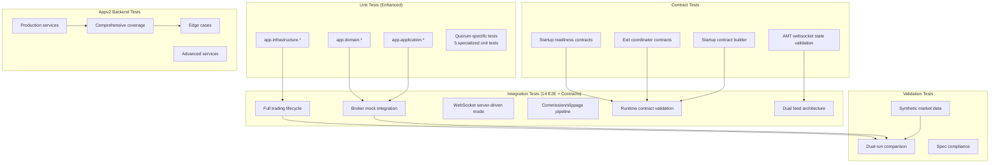
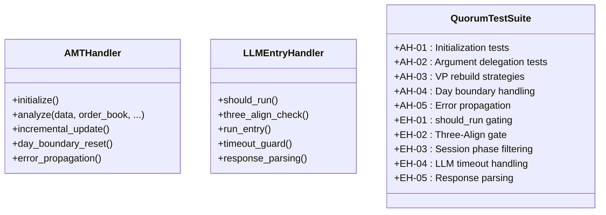
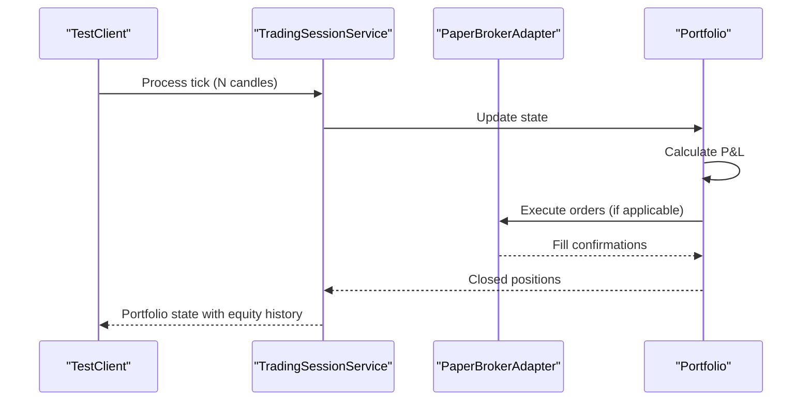
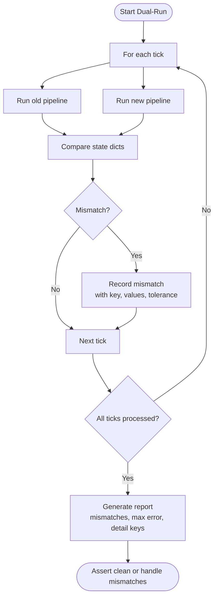
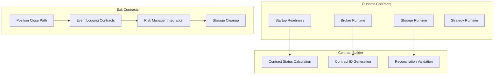
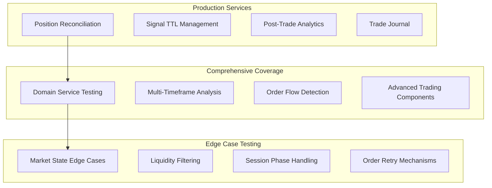

# Testing Strategy

<cite>
**Referenced Files in This Document**
- [conftest.py](file://backend/tests/conftest.py)
- [pytest.ini](file://backend/pytest.ini)
- [baseline_test_results.json](file://backend/tests/baseline_test_results.json)
- [test_trading_context.py](file://backend/tests/unit/test_trading_context.py)
- [test_composite_profile.py](file://backend/tests/unit/test_composite_profile.py)
- [test_market_state_engine.py](file://backend/tests/unit/domain/test_market_state_engine.py)
- [test_api_endpoints.py](file://backend/tests/integration/test_api_endpoints.py)
- [comparison_engine.py](file://backend/tests/validation/comparison_engine.py)
- [synthetic_market_data.py](file://backend/tests/validation/synthetic_market_data.py)
- [test_e2e_trading_lifecycle.py](file://backend/tests/integration/test_e2e_trading_lifecycle.py)
- [test_e2e_broker_mock.py](file://backend/tests/integration/test_e2e_broker_mock.py)
- [test_amt_handler.py](file://backend/tests/unit/application/test_amt_handler.py)
- [test_llm_entry_handler.py](file://backend/tests/unit/application/test_llm_entry_handler.py)
- [test_amt_handler.md](file://backend/tests/unit/application/test_amt_handler.md)
- [test_llm_entry_handler.md](file://backend/tests/unit/application/test_llm_entry_handler.md)
- [test_runtime_contracts.py](file://backend/tests/integration/test_runtime_contracts.py)
- [test_dual_feed_architecture.py](file://backend/tests/integration/test_dual_feed_architecture.py)
- [test_amt_websocket_state.py](file://backendv2/tests/integration/test_amt_websocket_state.py)
- [test_startup_contracts.py](file://backend/tests/unit/application/test_startup_contracts.py)
- [test_exit_coordinator_contract.py](file://backend/tests/unit/application/test_exit_coordinator_contract.py)
- [test_api_contracts.py](file://appv2/backend/tests/test_api_contracts.py)
- [test_contract_frontend_backend.py](file://appv2/backend/tests/test_contract_frontend_backend.py)
- [test_production_services.py](file://appv2/backend/tests/test_production_services.py)
- [test_comprehensive_coverage.py](file://appv2/backend/tests/test_comprehensive_coverage.py)
- [test_edge_cases.py](file://appv2/backend/tests/test_edge_cases.py)
</cite>

## Update Summary
**Changes Made**
- Added comprehensive runtime contract testing framework with startup readiness validation
- Integrated dual feed architecture testing for futures data flow and AMT service coordination
- Implemented AMT websocket state validation for frontend integration
- Enhanced contract validation system replacing legacy testing approaches
- Expanded testing coverage to include backendv2 integration and validation components

## Table of Contents
1. [Introduction](#introduction)
2. [Project Structure](#project-structure)
3. [Core Components](#core-components)
4. [Architecture Overview](#architecture-overview)
5. [Detailed Component Analysis](#detailed-component-analysis)
6. [Dependency Analysis](#dependency-analysis)
7. [Performance Considerations](#performance-considerations)
8. [Troubleshooting Guide](#troubleshooting-guide)
9. [Conclusion](#conclusion)
10. [Appendices](#appendices)

## Introduction
This document defines the comprehensive testing strategy for GlassyTrade AI v5. It outlines a multi-layered approach covering unit tests, integration tests, validation scenarios, and market data testing. The system now includes a production-ready test suite with 14 E2E integration tests, 5 quorum-specific unit tests, and a new comprehensive runtime contract testing framework that validates system startup readiness and operational contracts across both backend and appv2 systems.

## Project Structure
The backend test suite is organized into four primary layers with enhanced coverage and contract validation:
- Unit tests: Focused on isolated components and pure logic with comprehensive quorum-specific testing
- Integration tests: Validate end-to-end flows, API endpoints, and runtime contracts with extensive E2E scenarios
- Validation tests: Provide dual-run comparison and synthetic market data generation for stability and correctness
- Contract tests: Runtime contract validation ensuring system readiness and operational integrity

**Diagram sources**
- [test_e2e_trading_lifecycle.py:1-697](file://backend/tests/integration/test_e2e_trading_lifecycle.py#L1-L697)
- [test_e2e_broker_mock.py:1-779](file://backend/tests/integration/test_e2e_broker_mock.py#L1-L779)
- [test_amt_handler.py:1-624](file://backend/tests/unit/application/test_amt_handler.py#L1-L624)
- [test_llm_entry_handler.py:1-937](file://backend/tests/unit/application/test_llm_entry_handler.py#L1-L937)
- [test_runtime_contracts.py:1-838](file://backend/tests/integration/test_runtime_contracts.py#L1-L838)
- [test_dual_feed_architecture.py:1-270](file://backend/tests/integration/test_dual_feed_architecture.py#L1-L270)
- [test_amt_websocket_state.py:1-228](file://backendv2/tests/integration/test_amt_websocket_state.py#L1-L228)
- [test_startup_contracts.py:1-207](file://backend/tests/unit/application/test_startup_contracts.py#L1-L207)
- [test_exit_coordinator_contract.py:1-215](file://backend/tests/unit/application/test_exit_coordinator_contract.py#L1-L215)

**Section sources**
- [conftest.py:1-35](file://backend/tests/conftest.py#L1-L35)
- [pytest.ini:1-9](file://backend/pytest.ini#L1-L9)

## Core Components
- Test configuration and environment:
  - Shared fixtures and path setup enable importing backend modules and stubbing subpackages
  - Pytest markers define unit, integration, contract, and slow test categories
- Baseline results:
  - A JSON baseline captures historical pass/fail counts and floor expectations to track regression
- Enhanced test categories:
  - Unit: Pure logic, data models, domain services, and specialized quorum tests
  - Integration: API endpoints, trading lifecycle, cross-service flows, E2E scenarios, and runtime contracts
  - Validation: Dual-run comparison and synthetic market data generation
  - Contract: Runtime contract validation ensuring system readiness and operational integrity

**Section sources**
- [conftest.py:1-35](file://backend/tests/conftest.py#L1-L35)
- [pytest.ini:1-9](file://backend/pytest.ini#L1-L9)
- [baseline_test_results.json:1-28](file://backend/tests/baseline_test_results.json#L1-L28)

## Architecture Overview
The testing architecture enforces separation of concerns across layers and uses deterministic fixtures and synthetic data to ensure reproducibility. The enhanced framework now includes comprehensive E2E testing, specialized unit tests for critical components, runtime contract validation, and dual feed architecture testing.

```mermaid
graph TB
T["Pytest Runner"] --> C["conftest.py<br/>Path & fixture setup"]
T --> U["Unit Tests<br/>(Enhanced with quorum tests)"]
T --> I["Integration Tests<br/>(14 E2E + Runtime Contracts)"]
T --> V["Validation Tests"]
T --> CT["Contract Tests<br/>(Runtime + Exit + Startup)"]
T --> A["Appv2 Backend Tests"]
U --> UT1["Domain logic tests"]
U --> UT2["Application services tests"]
U --> UT3["Infrastructure adapters tests"]
U --> QT1["AMTHandler quorum tests"]
U --> QT2["LLMEntryHandler quorum tests"]
I --> IE1["Full trading lifecycle"]
I --> IE2["Broker mock integration"]
I --> IE3["WebSocket server-driven mode"]
I --> IE4["Commission/slippage pipeline"]
I --> IR1["Runtime contract validation"]
I --> IR2["Dual feed architecture"]
CT --> RC1["Startup readiness contracts"]
CT --> RC2["Exit coordinator contracts"]
CT --> RC3["Startup contract builder"]
CT --> RC4["AMT websocket state validation"]
V --> VC1["Dual-run comparer"]
V --> VS1["Synthetic market generator"]
A --> AT1["Production services"]
A --> AT2["Comprehensive coverage"]
A --> AT3["Edge case testing"]
```

**Diagram sources**
- [test_e2e_trading_lifecycle.py:85-186](file://backend/tests/integration/test_e2e_trading_lifecycle.py#L85-L186)
- [test_amt_handler.py:86-103](file://backend/tests/unit/application/test_amt_handler.py#L86-L103)
- [test_llm_entry_handler.py:190-282](file://backend/tests/unit/application/test_llm_entry_handler.py#L190-L282)
- [test_runtime_contracts.py:244-400](file://backend/tests/integration/test_runtime_contracts.py#L244-L400)
- [test_dual_feed_architecture.py:21-80](file://backend/tests/integration/test_dual_feed_architecture.py#L21-L80)
- [test_amt_websocket_state.py:15-90](file://backendv2/tests/integration/test_amt_websocket_state.py#L15-L90)

## Detailed Component Analysis

### Unit Testing Strategy (Enhanced)
Unit tests focus on pure logic and isolated components with comprehensive quorum-specific testing. The enhanced framework now includes 5 specialized unit tests covering critical components:

#### Quorum-Specific Unit Tests
- **AMTHandler tests (5 tests)**: Cover initialization, argument delegation, volume profile rebuild strategies, day boundary handling, and error propagation
- **LLMEntryHandler tests (5 tests)**: Cover should_run gating, Three-Align gate, session phase filtering, LLM timeout handling, and response parsing

**Diagram sources**
- [test_amt_handler.py:86-103](file://backend/tests/unit/application/test_amt_handler.py#L86-L103)
- [test_llm_entry_handler.py:190-282](file://backend/tests/unit/application/test_llm_entry_handler.py#L190-L282)
- [test_amt_handler.md:18-40](file://backend/tests/unit/application/test_amt_handler.md#L18-L40)
- [test_llm_entry_handler.md:27-47](file://backend/tests/unit/application/test_llm_entry_handler.md#L27-L47)

**Updated** Enhanced with comprehensive quorum-specific testing for critical trading components

Practical examples:
- **AMTHandler quorum tests**: Test initialization with default state, analyze() delegation to internal services, VP rebuild strategies, day boundary resets, and error propagation
- **LLMEntryHandler quorum tests**: Test should_run pre-flight checks, Three-Align gate evaluation, session phase filtering, LLM timeout handling, and response parsing with proper error resilience

**Section sources**
- [test_amt_handler.py:1-624](file://backend/tests/unit/application/test_amt_handler.py#L1-L624)
- [test_llm_entry_handler.py:1-937](file://backend/tests/unit/application/test_llm_entry_handler.py#L1-L937)
- [test_amt_handler.md:1-166](file://backend/tests/unit/application/test_amt_handler.md#L1-L166)
- [test_llm_entry_handler.md:1-303](file://backend/tests/unit/application/test_llm_entry_handler.md#L1-L303)

### Integration Testing Strategy (14 E2E + Runtime Contracts)
Integration tests validate end-to-end flows, API endpoints, and runtime contracts using FastAPI's TestClient. The enhanced framework now includes 14 comprehensive E2E integration tests plus runtime contract validation:

#### Full Trading Lifecycle E2E Tests
- Complete trading pipeline from tick ingestion through analysis, signal generation, position management, and portfolio accounting
- WebSocket server-driven mode with proper configuration and history loading
- System control endpoints for halt/resume operations and risk state monitoring
- Commission and slippage pipeline integration with exact P&L arithmetic verification

#### Runtime Contract Validation Tests
- Startup readiness validation ensuring all dependencies are properly initialized
- Broker and storage runtime contract enforcement with method availability checks
- Strategy runtime contract validation for callable interfaces
- Shutdown contract validation ensuring proper resource cleanup

#### Dual Feed Architecture Integration Tests
- Underlying futures provider mapping for options to futures conversion
- Session cache underlying data management and symbol isolation
- AMT service data source selection between underlying and option data
- Complete dual-feed flow validation from option symbols to underlying data processing

**Diagram sources**
- [test_e2e_trading_lifecycle.py:91-171](file://backend/tests/integration/test_e2e_trading_lifecycle.py#L91-L171)
- [test_e2e_broker_mock.py:226-281](file://backend/tests/integration/test_e2e_broker_mock.py#L226-L281)
- [test_runtime_contracts.py:244-400](file://backend/tests/integration/test_runtime_contracts.py#L244-L400)
- [test_dual_feed_architecture.py:240-268](file://backend/tests/integration/test_dual_feed_architecture.py#L240-L268)

**Updated** Expanded from basic integration tests to comprehensive 14 E2E scenarios plus runtime contract validation and dual feed architecture testing

Practical examples:
- **Full trading lifecycle**: Feed 200 volatile candles and verify state shape, position opens with slipped entry, and commission/slippage accounting
- **WebSocket integration**: Server-driven mode with proper configuration messages and history loading
- **Broker mock testing**: Full profitable trade with partial exits and trailing stops, losing trade with SL hits
- **Circuit breaker testing**: Prevent entries after consecutive losses and account loss limit breaches
- **Runtime contract validation**: Startup readiness checks, broker/storage method availability, and shutdown cleanup verification
- **Dual feed architecture**: Options-to-futures mapping, underlying data caching, and AMT data source selection

**Section sources**
- [test_e2e_trading_lifecycle.py:1-697](file://backend/tests/integration/test_e2e_trading_lifecycle.py#L1-L697)
- [test_e2e_broker_mock.py:1-779](file://backend/tests/integration/test_e2e_broker_mock.py#L1-L779)
- [test_runtime_contracts.py:1-838](file://backend/tests/integration/test_runtime_contracts.py#L1-L838)
- [test_dual_feed_architecture.py:1-270](file://backend/tests/integration/test_dual_feed_architecture.py#L1-L270)

### Validation Testing Strategy
Validation tests ensure behavioral parity and correctness under controlled conditions:
- Dual-run comparison engine compares old vs new codepaths tick-by-tick and reports mismatches
- Synthetic market data generator creates realistic scenarios with expected outcomes for AMT validation

**Diagram sources**
- [comparison_engine.py:47-175](file://backend/tests/validation/comparison_engine.py#L47-L175)

Practical examples:
- Using the dual-run comparer: Initialize with a small tolerance, compare old and new state dictionaries for each tick, and assert zero mismatches or analyze the report
- Generating synthetic market scenarios: Use generators for balanced rotation, displacement legs, pullbacks to LVN, and aggressive candles with expected market state outcomes

**Section sources**
- [comparison_engine.py:1-194](file://backend/tests/validation/comparison_engine.py#L1-L194)
- [synthetic_market_data.py:1-405](file://backend/tests/validation/synthetic_market_data.py#L1-L405)

### Contract Testing Strategy
Contract tests ensure system readiness and operational integrity through comprehensive runtime validation:

#### Runtime Contract Validation
- Startup readiness validation checking all dependencies and interfaces
- Broker runtime contract enforcement verifying execute_order and cancel_order methods
- Storage runtime contract validation ensuring persistence methods availability
- Strategy runtime contract validation for callable interface requirements

#### Exit Coordinator Contract Testing
- Position close path validation with proper state management
- Event logging contract enforcement with tick trace preservation
- Risk manager integration contract validation
- Storage cleanup contract verification

#### Startup Contract Builder Testing
- Contract status calculation and reporting
- Deterministic contract ID generation for readiness output
- Reconciliation dependency validation
- Error handling for contract violations

**Diagram sources**
- [test_runtime_contracts.py:244-400](file://backend/tests/integration/test_runtime_contracts.py#L244-L400)
- [test_startup_contracts.py:72-96](file://backend/tests/unit/application/test_startup_contracts.py#L72-L96)
- [test_exit_coordinator_contract.py:153-178](file://backend/tests/unit/application/test_exit_coordinator_contract.py#L153-L178)

**Updated** Added comprehensive runtime contract testing framework with startup validation, exit coordinator contracts, and contract builder functionality

**Section sources**
- [test_runtime_contracts.py:1-838](file://backend/tests/integration/test_runtime_contracts.py#L1-L838)
- [test_startup_contracts.py:1-207](file://backend/tests/unit/application/test_startup_contracts.py#L1-L207)
- [test_exit_coordinator_contract.py:1-215](file://backend/tests/unit/application/test_exit_coordinator_contract.py#L1-L215)

### Appv2 Backend Testing Framework
The appv2 backend includes a comprehensive testing framework with specialized test suites:

#### Production Services Tests
- Position reconciliation with matched and mismatched scenarios
- Signal TTL management with duplicate detection and TTL enforcement
- Post-trade analytics with comprehensive statistics computation
- Trade journal lifecycle with JSONL file generation and validation

#### Comprehensive Coverage Tests
- Domain service testing for break detection, drive tracking, entry zones, and exposure monitoring
- Multi-timeframe analysis with alignment scoring and directional consistency
- Order flow detectors including big trade detection, absorption patterns, and volume bubbles
- Advanced trading components like volatility adjustment, trail engines, and strike selection

#### Edge Case Tests
- Market state detection for gap opens above VAH and below VAL
- Low liquidity filtering with OI, volume, and spread thresholds
- Session phase handling during opening noise periods
- Order retry mechanisms with exponential backoff and max caps

**Diagram sources**
- [test_production_services.py:20-80](file://appv2/backend/tests/test_production_services.py#L20-L80)
- [test_comprehensive_coverage.py:37-120](file://appv2/backend/tests/test_comprehensive_coverage.py#L37-L120)
- [test_edge_cases.py:18-47](file://appv2/backend/tests/test_edge_cases.py#L18-L47)

**Updated** Added comprehensive appv2 backend testing framework with production services, coverage, and edge case testing

**Section sources**
- [test_production_services.py:1-173](file://appv2/backend/tests/test_production_services.py#L1-L173)
- [test_comprehensive_coverage.py:1-632](file://appv2/backend/tests/test_comprehensive_coverage.py#L1-L632)
- [test_edge_cases.py:1-156](file://appv2/backend/tests/test_edge_cases.py#L1-L156)

### Backtesting Capabilities
Backtesting is supported through dedicated scripts and validation scenarios:
- Scripts for running backtests and generating datasets are located under backend/scripts/
- Validation scenarios encode expected outcomes for AMT pipelines, enabling scenario-based testing and regression checks
- Appv2 includes comprehensive coverage testing for multi-timeframe analysis and advanced trading components
- Runtime contract validation ensures backtesting environments maintain proper system contracts

Guidelines:
- Use synthetic market data to construct long/short mean reversion, trend continuation, and no-trade scenarios
- Run backtests over multi-session windows to validate weekly bias alignment and confidence adjustments
- Track performance metrics and ensure parity with expected outcomes
- Leverage the 14 E2E integration tests as production-ready validation scenarios
- Validate runtime contracts during backtesting to ensure proper system state management

## Dependency Analysis
The test suite relies on:
- Pytest configuration and markers for categorization and execution control
- Shared fixtures for path resolution and module stubbing
- TestClient for API integration tests
- Validation utilities for dual-run comparisons and synthetic data
- Enhanced appv2 testing framework with specialized test suites
- Runtime contract validation system for startup and operational integrity
- Dual feed architecture testing for futures data flow validation

```mermaid
graph TB
P["pytest.ini"] --> M["Markers: unit, integration, contract, slow"]
C["conftest.py"] --> R["Root path injection"]
C --> S["Module stubs"]
I["integration tests"] --> TC["FastAPI TestClient"]
I --> E2E["14 E2E Scenarios"]
I --> RC["Runtime Contracts"]
I --> DFA["Dual Feed Architecture"]
V["validation tests"] --> DC["DualRunComparer"]
V --> SM["SyntheticMarketData"]
CT["contract tests"] --> SR["Startup Readiness"]
CT --> EC["Exit Contracts"]
CT --> SCB["Startup Contract Builder"]
A["appv2 tests"] --> PS["Production Services"]
A --> CC["Comprehensive Coverage"]
A --> EC["Edge Cases"]
```

**Diagram sources**
- [pytest.ini:1-9](file://backend/pytest.ini#L1-L9)
- [conftest.py:1-35](file://backend/tests/conftest.py#L1-L35)
- [test_e2e_trading_lifecycle.py:192-208](file://backend/tests/integration/test_e2e_trading_lifecycle.py#L192-L208)
- [test_runtime_contracts.py:244-400](file://backend/tests/integration/test_runtime_contracts.py#L244-L400)
- [test_dual_feed_architecture.py:21-80](file://backend/tests/integration/test_dual_feed_architecture.py#L21-L80)
- [test_production_services.py:20-34](file://appv2/backend/tests/test_production_services.py#L20-L34)

**Section sources**
- [pytest.ini:1-9](file://backend/pytest.ini#L1-L9)
- [conftest.py:1-35](file://backend/tests/conftest.py#L1-L35)

## Performance Considerations
- Use the slow marker to exclude heavy tests from quick runs and schedule them separately
- Prefer synthetic data and deterministic fixtures to avoid flakiness and reduce runtime variance
- For dual-run comparisons, tune tolerance to account for numerical precision while maintaining strictness for functional correctness
- Monitor pass rates and regressions using the baseline results JSON to maintain quality floors
- **Updated**: Leverage the 14 E2E integration tests and runtime contract validation for comprehensive performance validation across complete trading scenarios
- **Updated**: Runtime contract tests help identify performance bottlenecks in startup and shutdown sequences

**Section sources**
- [pytest.ini:6-6](file://backend/pytest.ini#L6-L6)
- [baseline_test_results.json:1-28](file://backend/tests/baseline_test_results.json#L1-L28)

## Troubleshooting Guide
Common issues and resolutions:
- Import errors in tests: Ensure project root and backend root are added to sys.path via conftest
- Network or hardware dependencies: Mock at the test level; avoid global mocks
- API test failures: Override dependencies locally using dependency_overrides or monkeypatch for specific endpoints
- Dual-run mismatches: Inspect the last mismatches in the report and adjust tolerance or fix divergent logic
- **Updated**: Runtime contract failures: Check startup readiness validation, verify broker/storage method availability, and ensure proper interface implementation
- **Updated**: Dual feed architecture issues: Validate options-to-futures mapping, underlying data caching, and AMT data source selection
- **Updated**: AMT websocket state problems: Verify AMT result serialization, state dictionary structure, and per-symbol isolation

**Section sources**
- [conftest.py:1-35](file://backend/tests/conftest.py#L1-L35)
- [test_api_endpoints.py:65-72](file://backend/tests/integration/test_api_endpoints.py#L65-L72)
- [test_api_endpoints.py:191-219](file://backend/tests/integration/test_api_endpoints.py#L191-L219)
- [comparison_engine.py:161-194](file://backend/tests/validation/comparison_engine.py#L161-L194)
- [test_runtime_contracts.py:244-400](file://backend/tests/integration/test_runtime_contracts.py#L244-L400)

## Conclusion
GlassyTrade AI v5 employs a robust, layered testing strategy that ensures correctness, reliability, and maintainability. The enhanced framework now includes 14 comprehensive E2E integration tests, 5 quorum-specific unit tests, runtime contract validation system, dual feed architecture testing, and production-ready test suites across both backend and appv2 systems. Unit tests isolate logic, integration tests validate end-to-end flows and runtime contracts, validation tests enforce behavioral parity and scenario-driven correctness, and contract tests ensure system readiness and operational integrity. By leveraging synthetic data, dual-run comparisons, structured baselining, comprehensive E2E scenarios, and runtime contract validation, the system maintains a high-quality floor and supports continuous improvement.

## Appendices

### Continuous Integration Workflows
- Configure CI to run unit tests, integration tests, validation tests, contract tests, and appv2 test suites with appropriate markers
- Use the slow marker to separate heavy tests from quick feedback loops
- Publish baseline results and reports to monitor trends and regressions
- **Updated**: Include the 14 E2E integration tests, runtime contract validation, and dual feed architecture tests in CI pipelines for comprehensive validation
- **Updated**: Runtime contract tests should run as part of pre-deployment validation to ensure system readiness

### Test Coverage Analysis
- Maintain coverage targets for critical domains (domain, application, infrastructure)
- Use coverage tools to identify untested branches and increase targeted tests
- Focus on edge cases exposed by synthetic scenarios, dual-run comparisons, and comprehensive E2E testing
- **Updated**: Ensure comprehensive coverage of the 5 quorum-specific unit tests, 14 E2E integration scenarios, runtime contract validation, and dual feed architecture testing
- **Updated**: Runtime contract tests should cover all startup dependencies, broker/storage interfaces, and exit coordinator pathways