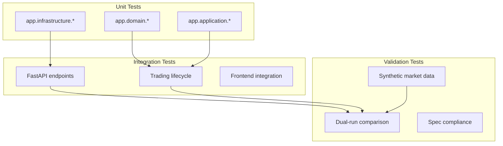
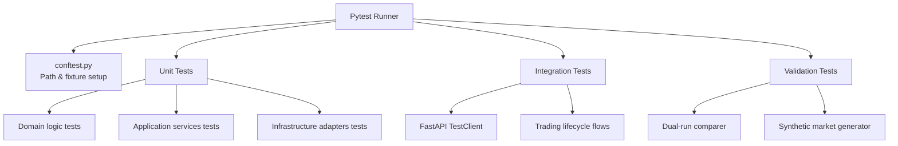
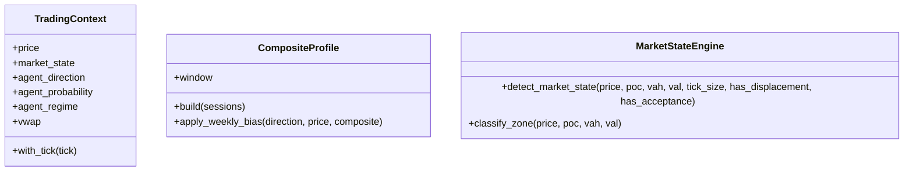
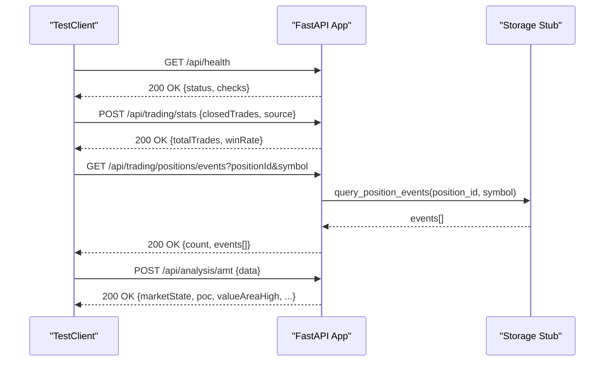
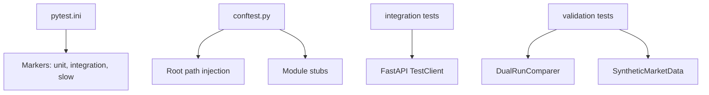

# Testing Strategy

<cite>
**Referenced Files in This Document**
- [conftest.py](file://backend/tests/conftest.py)
- [pytest.ini](file://backend/pytest.ini)
- [baseline_test_results.json](file://backend/tests/baseline_test_results.json)
- [test_trading_context.py](file://backend/tests/unit/test_trading_context.py)
- [test_composite_profile.py](file://backend/tests/unit/test_composite_profile.py)
- [test_market_state_engine.py](file://backend/tests/unit/domain/test_market_state_engine.py)
- [test_api_endpoints.py](file://backend/tests/integration/test_api_endpoints.py)
- [comparison_engine.py](file://backend/tests/validation/comparison_engine.py)
- [synthetic_market_data.py](file://backend/tests/validation/synthetic_market_data.py)
</cite>

## Table of Contents
1. [Introduction](#introduction)
2. [Project Structure](#project-structure)
3. [Core Components](#core-components)
4. [Architecture Overview](#architecture-overview)
5. [Detailed Component Analysis](#detailed-component-analysis)
6. [Dependency Analysis](#dependency-analysis)
7. [Performance Considerations](#performance-considerations)
8. [Troubleshooting Guide](#troubleshooting-guide)
9. [Conclusion](#conclusion)
10. [Appendices](#appendices)

## Introduction
This document defines the comprehensive testing strategy for GlassyTrade AI v5. It outlines a multi-layered approach covering unit tests, integration tests, validation scenarios, and market data testing. It documents the test suite organization, test case categories, and validation frameworks. Practical examples show how to write and execute tests for trading logic, market data processing, and AI inference components. It also explains the market data validation system, scenario-based testing, and backtesting capabilities, along with performance testing, load testing, edge case handling, test data generation, mock implementations, continuous integration workflows, debugging techniques, test coverage analysis, and quality assurance processes.

## Project Structure
The backend test suite is organized into three primary layers:
- Unit tests: Focused on isolated components and pure logic.
- Integration tests: Validate end-to-end flows and API endpoints.
- Validation tests: Provide dual-run comparison and synthetic market data generation for stability and correctness.

**Diagram sources**
- [test_trading_context.py:1-184](file://backend/tests/unit/test_trading_context.py#L1-L184)
- [test_api_endpoints.py:1-247](file://backend/tests/integration/test_api_endpoints.py#L1-L247)
- [comparison_engine.py:1-194](file://backend/tests/validation/comparison_engine.py#L1-L194)
- [synthetic_market_data.py:1-405](file://backend/tests/validation/synthetic_market_data.py#L1-L405)

**Section sources**
- [conftest.py:1-35](file://backend/tests/conftest.py#L1-L35)
- [pytest.ini:1-9](file://backend/pytest.ini#L1-L9)

## Core Components
- Test configuration and environment:
  - Shared fixtures and path setup enable importing backend modules and stubbing subpackages.
  - Pytest markers define unit, integration, and slow test categories.
- Baseline results:
  - A JSON baseline captures historical pass/fail counts and floor expectations to track regression.
- Test categories:
  - Unit: Pure logic, data models, and domain services.
  - Integration: API endpoints, trading lifecycle, and cross-service flows.
  - Validation: Dual-run comparison and synthetic market data generation.

**Section sources**
- [conftest.py:1-35](file://backend/tests/conftest.py#L1-L35)
- [pytest.ini:1-9](file://backend/pytest.ini#L1-L9)
- [baseline_test_results.json:1-28](file://backend/tests/baseline_test_results.json#L1-L28)

## Architecture Overview
The testing architecture enforces separation of concerns across layers and uses deterministic fixtures and synthetic data to ensure reproducibility.

**Diagram sources**
- [conftest.py:1-35](file://backend/tests/conftest.py#L1-L35)
- [test_api_endpoints.py:1-247](file://backend/tests/integration/test_api_endpoints.py#L1-L247)
- [comparison_engine.py:1-194](file://backend/tests/validation/comparison_engine.py#L1-L194)
- [synthetic_market_data.py:1-405](file://backend/tests/validation/synthetic_market_data.py#L1-L405)

## Detailed Component Analysis

### Unit Testing Strategy
Unit tests focus on pure logic and isolated components. Examples include:
- TradingContext immutability and derived properties.
- CompositeProfile building and weekly bias computation.
- MarketStateEngine classification and zone detection.

**Diagram sources**
- [test_trading_context.py:11-181](file://backend/tests/unit/test_trading_context.py#L11-L181)
- [test_composite_profile.py:10-205](file://backend/tests/unit/test_composite_profile.py#L10-L205)
- [test_market_state_engine.py:12-216](file://backend/tests/unit/domain/test_market_state_engine.py#L12-L216)

Practical examples:
- Writing a unit test for TradingContext:
  - Create a minimal mock tick and AMT result.
  - Assert immutability and derived properties.
  - Verify fallbacks and transformations.
  - Reference: [test_trading_context.py:14-181](file://backend/tests/unit/test_trading_context.py#L14-L181)
- Writing a unit test for CompositeProfile:
  - Build from empty sessions, single session, and merged sessions.
  - Validate window limits and fallback POC/VA calculations.
  - Detect LVNs/HVNs and compute weekly bias.
  - Reference: [test_composite_profile.py:13-205](file://backend/tests/unit/test_composite_profile.py#L13-L205)
- Writing a unit test for MarketStateEngine:
  - Test NO_TRADE near POC, BALANCED inside VA, IMBALANCED outside VA with displacement/acceptance, PROBING outside VA without displacement.
  - Validate zone classification and trigger messages.
  - Reference: [test_market_state_engine.py:15-216](file://backend/tests/unit/domain/test_market_state_engine.py#L15-L216)

**Section sources**
- [test_trading_context.py:1-184](file://backend/tests/unit/test_trading_context.py#L1-L184)
- [test_composite_profile.py:1-205](file://backend/tests/unit/test_composite_profile.py#L1-L205)
- [test_market_state_engine.py:1-216](file://backend/tests/unit/domain/test_market_state_engine.py#L1-L216)

### Integration Testing Strategy
Integration tests validate end-to-end flows and API endpoints using FastAPI’s TestClient. They include:
- Health checks and portfolio creation.
- Position lifecycle retrieval and event queries.
- Analysis endpoints for AMT, prediction, and footprint.
- AI journal promotion endpoint with monkeypatched assessments.

**Diagram sources**
- [test_api_endpoints.py:14-188](file://backend/tests/integration/test_api_endpoints.py#L14-L188)

Practical examples:
- Health endpoint test:
  - Send GET to /api/health and assert status and presence of checks.
  - Reference: [test_api_endpoints.py:15-21](file://backend/tests/integration/test_api_endpoints.py#L15-L21)
- Portfolio creation test:
  - POST to /api/trading/portfolio/create and assert balance/equity/positions fields.
  - Reference: [test_api_endpoints.py:24-33](file://backend/tests/integration/test_api_endpoints.py#L24-L33)
- Position lifecycle test:
  - Override storage dependency with a stub returning predefined events.
  - GET /api/trading/positions/{positionId}/lifecycle and assert status and event types.
  - Reference: [test_api_endpoints.py:82-136](file://backend/tests/integration/test_api_endpoints.py#L82-L136)
- AMT analysis test:
  - POST to /api/analysis/amt with generated candles and assert presence of market state fields.
  - Reference: [test_api_endpoints.py:151-188](file://backend/tests/integration/test_api_endpoints.py#L151-L188)

**Section sources**
- [test_api_endpoints.py:1-247](file://backend/tests/integration/test_api_endpoints.py#L1-L247)

### Validation Testing Strategy
Validation tests ensure behavioral parity and correctness under controlled conditions:
- Dual-run comparison engine compares old vs new codepaths tick-by-tick and reports mismatches.
- Synthetic market data generator creates realistic scenarios with expected outcomes for AMT validation.

**Diagram sources**
- [comparison_engine.py:47-175](file://backend/tests/validation/comparison_engine.py#L47-L175)

Practical examples:
- Using the dual-run comparer:
  - Initialize with a small tolerance.
  - For each tick, compare old and new state dictionaries.
  - At the end, assert zero mismatches or analyze the report.
  - Reference: [comparison_engine.py:61-175](file://backend/tests/validation/comparison_engine.py#L61-L175)
- Generating synthetic market scenarios:
  - Use generators for balanced rotation, displacement legs, pullbacks to LVN, and aggressive candles.
  - Compose scenarios and assert expected market state, bias, setup, and aggression presence.
  - Reference: [synthetic_market_data.py:45-405](file://backend/tests/validation/synthetic_market_data.py#L45-L405)

**Section sources**
- [comparison_engine.py:1-194](file://backend/tests/validation/comparison_engine.py#L1-L194)
- [synthetic_market_data.py:1-405](file://backend/tests/validation/synthetic_market_data.py#L1-L405)

### Backtesting Capabilities
Backtesting is supported through dedicated scripts and validation scenarios:
- Scripts for running backtests and generating datasets are located under backend/scripts/.
- Validation scenarios encode expected outcomes for AMT pipelines, enabling scenario-based testing and regression checks.

Guidelines:
- Use synthetic market data to construct long/short mean reversion, trend continuation, and no-trade scenarios.
- Run backtests over multi-session windows to validate weekly bias alignment and confidence adjustments.
- Track performance metrics and ensure parity with expected outcomes.

[No sources needed since this section provides general guidance]

## Dependency Analysis
The test suite relies on:
- Pytest configuration and markers for categorization and execution control.
- Shared fixtures for path resolution and module stubbing.
- TestClient for API integration tests.
- Validation utilities for dual-run comparisons and synthetic data.

**Diagram sources**
- [pytest.ini:1-9](file://backend/pytest.ini#L1-L9)
- [conftest.py:1-35](file://backend/tests/conftest.py#L1-L35)
- [test_api_endpoints.py:11-11](file://backend/tests/integration/test_api_endpoints.py#L11-L11)
- [comparison_engine.py:47-175](file://backend/tests/validation/comparison_engine.py#L47-L175)
- [synthetic_market_data.py:14-43](file://backend/tests/validation/synthetic_market_data.py#L14-L43)

**Section sources**
- [pytest.ini:1-9](file://backend/pytest.ini#L1-L9)
- [conftest.py:1-35](file://backend/tests/conftest.py#L1-L35)

## Performance Considerations
- Use the slow marker to exclude heavy tests from quick runs and schedule them separately.
- Prefer synthetic data and deterministic fixtures to avoid flakiness and reduce runtime variance.
- For dual-run comparisons, tune tolerance to account for numerical precision while maintaining strictness for functional correctness.
- Monitor pass rates and regressions using the baseline results JSON to maintain quality floors.

**Section sources**
- [pytest.ini:6-6](file://backend/pytest.ini#L6-L6)
- [baseline_test_results.json:1-28](file://backend/tests/baseline_test_results.json#L1-L28)

## Troubleshooting Guide
Common issues and resolutions:
- Import errors in tests:
  - Ensure project root and backend root are added to sys.path via conftest.
  - Reference: [conftest.py:20-29](file://backend/tests/conftest.py#L20-L29)
- Network or hardware dependencies:
  - Mock at the test level; avoid global mocks.
  - Reference: [conftest.py:32-34](file://backend/tests/conftest.py#L32-L34)
- API test failures:
  - Override dependencies locally using dependency_overrides or monkeypatch for specific endpoints.
  - Reference: [test_api_endpoints.py:65-72](file://backend/tests/integration/test_api_endpoints.py#L65-L72), [test_api_endpoints.py:191-219](file://backend/tests/integration/test_api_endpoints.py#L191-L219)
- Dual-run mismatches:
  - Inspect the last mismatches in the report and adjust tolerance or fix divergent logic.
  - Reference: [comparison_engine.py:161-194](file://backend/tests/validation/comparison_engine.py#L161-L194)

**Section sources**
- [conftest.py:1-35](file://backend/tests/conftest.py#L1-L35)
- [test_api_endpoints.py:65-72](file://backend/tests/integration/test_api_endpoints.py#L65-L72)
- [test_api_endpoints.py:191-219](file://backend/tests/integration/test_api_endpoints.py#L191-L219)
- [comparison_engine.py:161-194](file://backend/tests/validation/comparison_engine.py#L161-L194)

## Conclusion
GlassyTrade AI v5 employs a robust, layered testing strategy that ensures correctness, reliability, and maintainability. Unit tests isolate logic, integration tests validate end-to-end flows, and validation tests enforce behavioral parity and scenario-driven correctness. By leveraging synthetic data, dual-run comparisons, and structured baselining, the system maintains a high-quality floor and supports continuous improvement.

## Appendices

### Continuous Integration Workflows
- Configure CI to run unit tests, integration tests, and validation tests with appropriate markers.
- Use the slow marker to separate heavy tests from quick feedback loops.
- Publish baseline results and reports to monitor trends and regressions.

[No sources needed since this section provides general guidance]

### Test Coverage Analysis
- Maintain coverage targets for critical domains (domain, application, infrastructure).
- Use coverage tools to identify untested branches and increase targeted tests.
- Focus on edge cases exposed by synthetic scenarios and dual-run comparisons.

[No sources needed since this section provides general guidance]