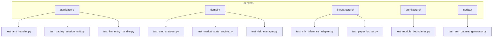
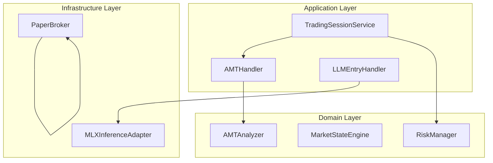
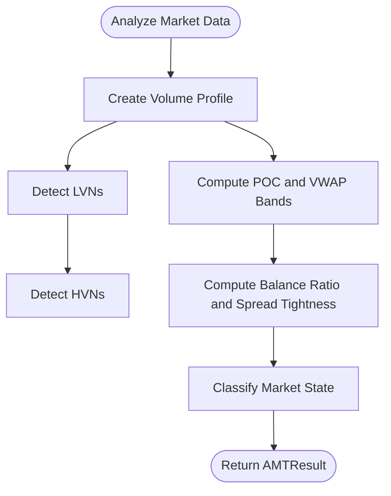
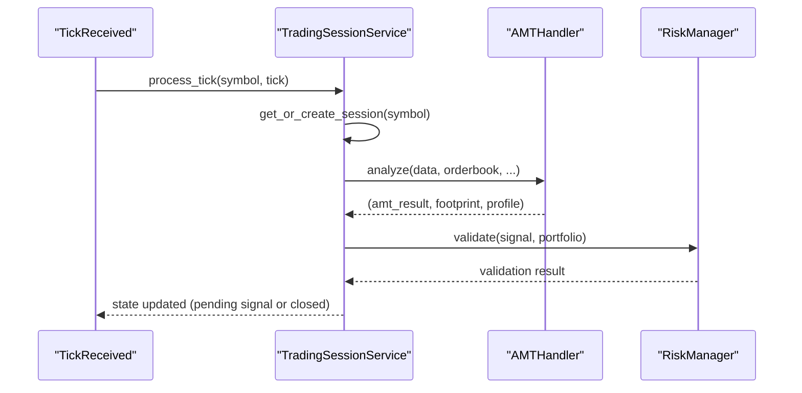
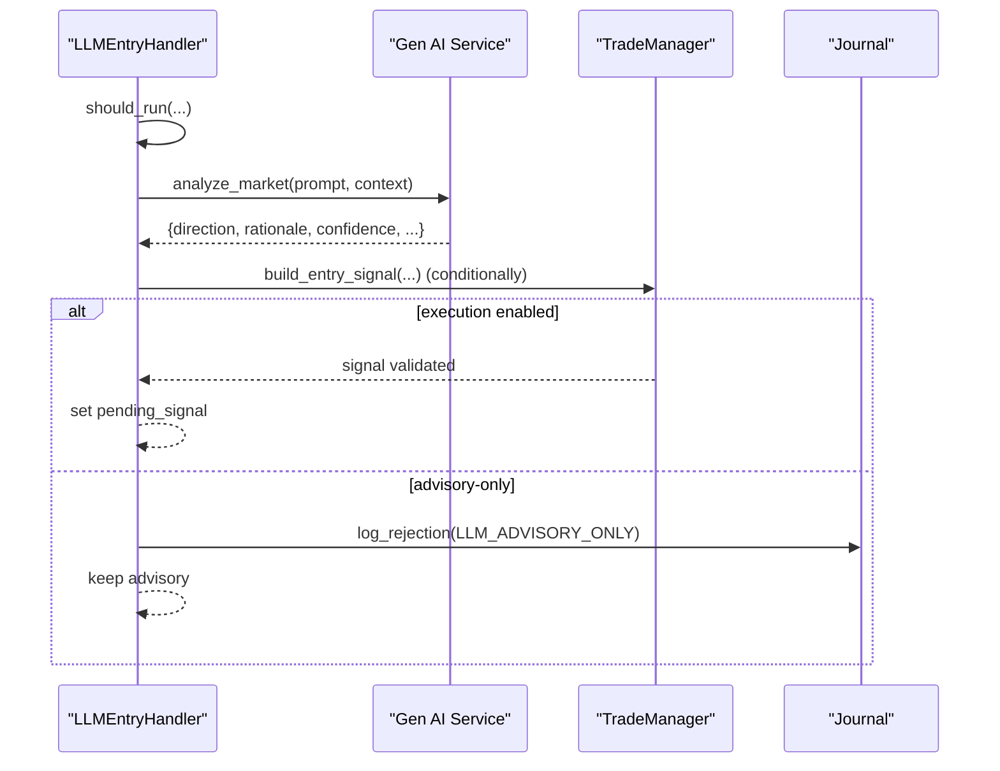
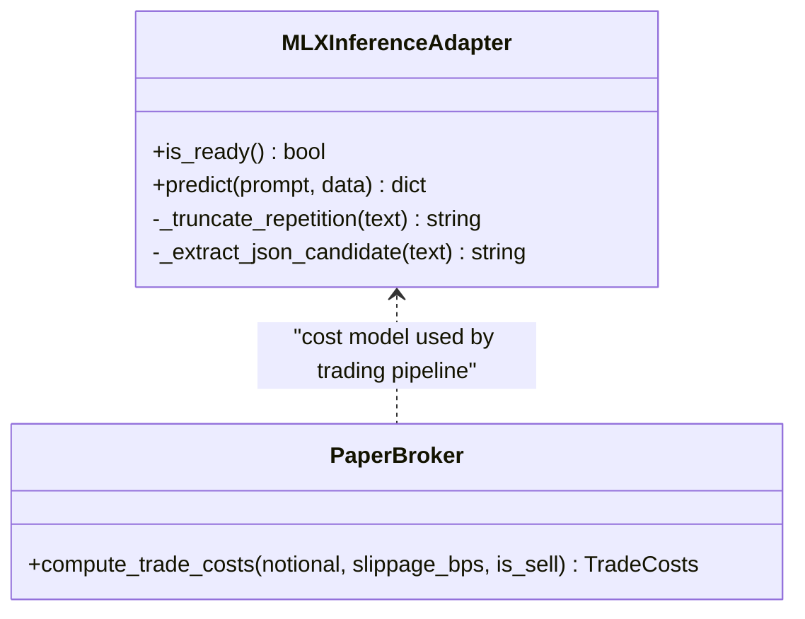
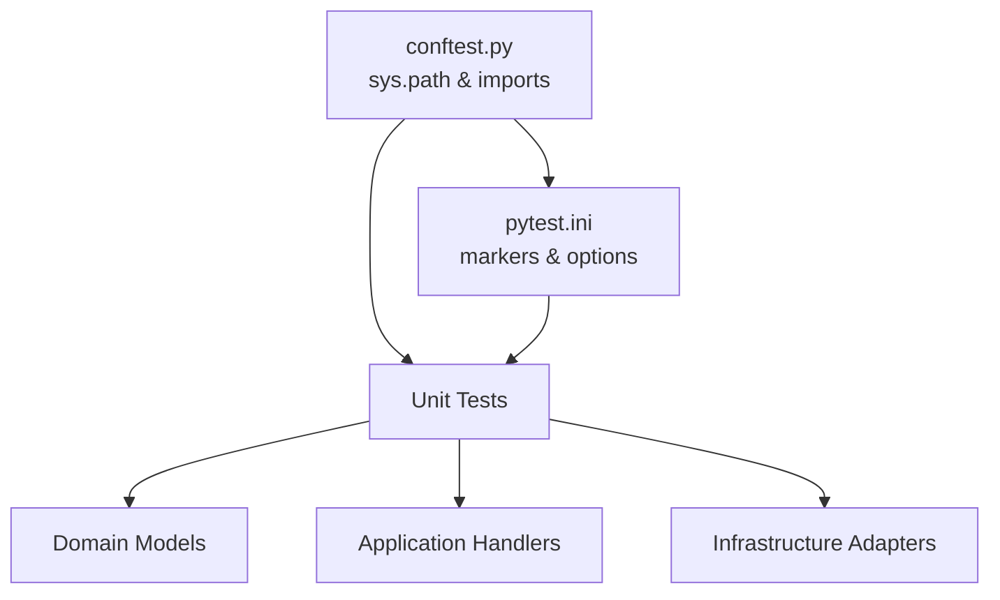

# Unit Testing

<cite>
**Referenced Files in This Document**
- [conftest.py](file://backend/tests/conftest.py)
- [pytest.ini](file://backend/pytest.ini)
- [test_amt_handler.py](file://backend/tests/unit/application/test_amt_handler.py)
- [test_trading_session_unit.py](file://backend/tests/unit/application/test_trading_session_unit.py)
- [test_llm_entry_handler.py](file://backend/tests/unit/application/test_llm_entry_handler.py)
- [test_amt_analyzer.py](file://backend/tests/unit/domain/test_amt_analyzer.py)
- [test_market_state_engine.py](file://backend/tests/unit/domain/test_market_state_engine.py)
- [test_risk_manager.py](file://backend/tests/unit/domain/test_risk_manager.py)
- [test_mlx_inference_adapter.py](file://backend/tests/unit/infrastructure/test_mlx_inference_adapter.py)
- [test_paper_broker.py](file://backend/tests/unit/infrastructure/test_paper_broker.py)
- [test_module_boundaries.py](file://backend/tests/unit/architecture/test_module_boundaries.py)
- [test_composite_profile.py](file://backend/tests/unit/test_composite_profile.py)
</cite>

## Table of Contents
1. [Introduction](#introduction)
2. [Project Structure](#project-structure)
3. [Core Components](#core-components)
4. [Architecture Overview](#architecture-overview)
5. [Detailed Component Analysis](#detailed-component-analysis)
6. [Dependency Analysis](#dependency-analysis)
7. [Performance Considerations](#performance-considerations)
8. [Troubleshooting Guide](#troubleshooting-guide)
9. [Conclusion](#conclusion)
10. [Appendices](#appendices)

## Introduction
This document describes unit testing practices for GlassyTrade AI v5 across domain layers: domain services, application handlers, and infrastructure adapters. It explains test organization by domain layer, categorizes test cases by trading logic, market data processing, AI inference components, and risk management, and provides practical examples for AMT analysis, trading session management, and event handlers. It also documents mocking strategies, test data setup, assertion patterns, test isolation, dependency injection in tests, performance testing approaches, naming conventions, coverage expectations, and CI workflows.

## Project Structure
The unit tests are organized by layer and functional category under backend/tests/unit/. The primary categories are:
- application: Application-layer handlers and services (e.g., AMT analysis, LLM entry, trading session lifecycle)
- domain: Domain services and models (e.g., AMT analyzer, market state engine, risk manager)
- infrastructure: Infrastructure adapters (e.g., MLX inference, paper broker)
- architecture: Module boundary and architecture tests
- scripts: Scripts used by tests (e.g., dataset generators)

**Diagram sources**
- [test_amt_handler.py](file://backend/tests/unit/application/test_amt_handler.py)
- [test_trading_session_unit.py](file://backend/tests/unit/application/test_trading_session_unit.py)
- [test_llm_entry_handler.py](file://backend/tests/unit/application/test_llm_entry_handler.py)
- [test_amt_analyzer.py](file://backend/tests/unit/domain/test_amt_analyzer.py)
- [test_market_state_engine.py](file://backend/tests/unit/domain/test_market_state_engine.py)
- [test_risk_manager.py](file://backend/tests/unit/domain/test_risk_manager.py)
- [test_mlx_inference_adapter.py](file://backend/tests/unit/infrastructure/test_mlx_inference_adapter.py)
- [test_paper_broker.py](file://backend/tests/unit/infrastructure/test_paper_broker.py)
- [test_module_boundaries.py](file://backend/tests/unit/architecture/test_module_boundaries.py)

**Section sources**
- [conftest.py](file://backend/tests/conftest.py)
- [pytest.ini](file://backend/pytest.ini)

## Core Components
This section outlines the unit testing approach for each major component category.

- Application Handlers
  - AMT Handler: Validates AMT analysis delegation, footprint generation, volume profile rebuild strategies, caching, lookback caps, and error propagation.
  - Trading Session Service: Validates event subscription, session lifecycle, signal idempotency, candle deduplication/capping, prior profile loading, thread safety, and risk manager integration.
  - LLM Entry Handler: Validates gating logic, queue management, worker lifecycle, timeout/error resilience, and response handling.

- Domain Services
  - AMT Analyzer: Validates profile creation, LVN/HVN detection, POC/VWAP bands, incremental profile behavior, and market structure classification.
  - Market State Engine: Validates 4-state classification (NO_TRADE, BALANCED, IMBALANCED, PROBING) and zone sub-classification.
  - Risk Manager: Validates signal validation against portfolio constraints.

- Infrastructure Adapters
  - MLX Inference Adapter: Validates readiness states, prompt formatting, serialization locking, and truncation logic.
  - Paper Broker: Validates cost model calculations for slippage, STT, exchange fees, brokerage, GST, and SEBI.

- Architecture and Utilities
  - Module Boundaries: Enforces domain/infrastructure separation via AST-based import checks.
  - Composite Profile: Validates weekly aggregation, bias detection, and alignment adjustments.

**Section sources**
- [test_amt_handler.py](file://backend/tests/unit/application/test_amt_handler.py)
- [test_trading_session_unit.py](file://backend/tests/unit/application/test_trading_session_unit.py)
- [test_llm_entry_handler.py](file://backend/tests/unit/application/test_llm_entry_handler.py)
- [test_amt_analyzer.py](file://backend/tests/unit/domain/test_amt_analyzer.py)
- [test_market_state_engine.py](file://backend/tests/unit/domain/test_market_state_engine.py)
- [test_risk_manager.py](file://backend/tests/unit/domain/test_risk_manager.py)
- [test_mlx_inference_adapter.py](file://backend/tests/unit/infrastructure/test_mlx_inference_adapter.py)
- [test_paper_broker.py](file://backend/tests/unit/infrastructure/test_paper_broker.py)
- [test_module_boundaries.py](file://backend/tests/unit/architecture/test_module_boundaries.py)
- [test_composite_profile.py](file://backend/tests/unit/test_composite_profile.py)

## Architecture Overview
The unit testing architecture emphasizes:
- Layer isolation: Domain logic is tested independently from application orchestration and infrastructure adapters.
- Mock-first approach: External dependencies (network, GPU, storage) are mocked at the module boundary.
- Deterministic test data: Synthetic market data generators and helper factories produce reproducible inputs.
- Assertion patterns: Focus on return types, argument forwarding, state transitions, and error propagation.

**Diagram sources**
- [test_amt_handler.py](file://backend/tests/unit/application/test_amt_handler.py)
- [test_trading_session_unit.py](file://backend/tests/unit/application/test_trading_session_unit.py)
- [test_llm_entry_handler.py](file://backend/tests/unit/application/test_llm_entry_handler.py)
- [test_amt_analyzer.py](file://backend/tests/unit/domain/test_amt_analyzer.py)
- [test_market_state_engine.py](file://backend/tests/unit/domain/test_market_state_engine.py)
- [test_risk_manager.py](file://backend/tests/unit/domain/test_risk_manager.py)
- [test_mlx_inference_adapter.py](file://backend/tests/unit/infrastructure/test_mlx_inference_adapter.py)
- [test_paper_broker.py](file://backend/tests/unit/infrastructure/test_paper_broker.py)

## Detailed Component Analysis

### AMT Analysis (Domain Services)
Key test categories:
- Profile creation and smoothing
- LVN/HVN detection
- POC/VWAP bands and balance ratio computation
- Incremental profile behavior and lookback limits
- Market structure classification and spread tightness gates

Practical example references:
- Profile creation and smoothing: [test_amt_analyzer.py](file://backend/tests/unit/domain/test_amt_analyzer.py)
- POC tiebreak and VWAP bands: [test_amt_analyzer.py](file://backend/tests/unit/domain/test_amt_analyzer.py)
- Incremental profile vs. full rebuild: [test_amt_analyzer.py](file://backend/tests/unit/domain/test_amt_analyzer.py)
- Market structure classification: [test_market_state_engine.py](file://backend/tests/unit/domain/test_market_state_engine.py)

**Diagram sources**
- [test_amt_analyzer.py](file://backend/tests/unit/domain/test_amt_analyzer.py)
- [test_market_state_engine.py](file://backend/tests/unit/domain/test_market_state_engine.py)

**Section sources**
- [test_amt_analyzer.py](file://backend/tests/unit/domain/test_amt_analyzer.py)
- [test_market_state_engine.py](file://backend/tests/unit/domain/test_market_state_engine.py)

### Trading Session Management (Application Handlers)
Key test categories:
- Event subscription and orchestration
- Session creation, reuse, and eviction
- Signal idempotency and pending signal drain
- Candle deduplication and MAX_CANDLES cap
- Prior profile loading and risk manager integration
- Thread safety and lock usage

Practical example references:
- Session lifecycle and eviction: [test_trading_session_unit.py](file://backend/tests/unit/application/test_trading_session_unit.py)
- Signal idempotency and pending signals: [test_trading_session_unit.py](file://backend/tests/unit/application/test_trading_session_unit.py)
- Candle deduplication and caps: [test_trading_session_unit.py](file://backend/tests/unit/application/test_trading_session_unit.py)
- Prior profile loading: [test_trading_session_unit.py](file://backend/tests/unit/application/test_trading_session_unit.py)

**Diagram sources**
- [test_trading_session_unit.py](file://backend/tests/unit/application/test_trading_session_unit.py)

**Section sources**
- [test_trading_session_unit.py](file://backend/tests/unit/application/test_trading_session_unit.py)

### Event Handlers (Application Handlers)
Key test categories:
- Gating logic (should_run): AI running flag, position presence, model readiness, POC validity, cooldown
- Gate checks inside run_entry: Three-Align gate, session phase filtering, cluster aggressive prints
- Timeout and error resilience: LLM timeout handling and exception catching
- Response handling: FLAT/LONG/SHORT parsing, BUY-only mode enforcement, advisory-only mode
- Queue management: Overflow handling, stale item dropping
- Worker lifecycle: Per-symbol worker thread creation and cleanup

Practical example references:
- Gating logic: [test_llm_entry_handler.py](file://backend/tests/unit/application/test_llm_entry_handler.py)
- Gate checks and session context: [test_llm_entry_handler.py](file://backend/tests/unit/application/test_llm_entry_handler.py)
- Timeout and error resilience: [test_llm_entry_handler.py](file://backend/tests/unit/application/test_llm_entry_handler.py)
- Response handling and execution modes: [test_llm_entry_handler.py](file://backend/tests/unit/application/test_llm_entry_handler.py)
- Queue management and worker lifecycle: [test_llm_entry_handler.py](file://backend/tests/unit/application/test_llm_entry_handler.py)

**Diagram sources**
- [test_llm_entry_handler.py](file://backend/tests/unit/application/test_llm_entry_handler.py)

**Section sources**
- [test_llm_entry_handler.py](file://backend/tests/unit/application/test_llm_entry_handler.py)

### Infrastructure Adapters
Key test categories:
- MLX Inference Adapter
  - Readiness states and singleton behavior
  - Prompt formatting for entry vs. overseer contexts
  - Serialization lock usage
  - Repetition truncation logic
- Paper Broker
  - Cost model calculations for slippage, STT, exchange fee, brokerage, GST, SEBI
  - Breakdown string formatting
  - Instrument-specific cost variations (e.g., NSE/NIFTY vs. MCX/CRUDEOIL)

Practical example references:
- MLX inference adapter: [test_mlx_inference_adapter.py](file://backend/tests/unit/infrastructure/test_mlx_inference_adapter.py)
- Paper broker cost model: [test_paper_broker.py](file://backend/tests/unit/infrastructure/test_paper_broker.py)

**Diagram sources**
- [test_mlx_inference_adapter.py](file://backend/tests/unit/infrastructure/test_mlx_inference_adapter.py)
- [test_paper_broker.py](file://backend/tests/unit/infrastructure/test_paper_broker.py)

**Section sources**
- [test_mlx_inference_adapter.py](file://backend/tests/unit/infrastructure/test_mlx_inference_adapter.py)
- [test_paper_broker.py](file://backend/tests/unit/infrastructure/test_paper_broker.py)

## Dependency Analysis
Unit tests rely on:
- Shared fixtures and path configuration via conftest.py to resolve imports across monorepo roots
- Pytest markers and options configured in pytest.ini for unit/integration/slow categorization and asyncio mode
- Mocking at module boundaries to isolate domain and infrastructure concerns
- Deterministic helpers to construct synthetic market data and domain entities

**Diagram sources**
- [conftest.py](file://backend/tests/conftest.py)
- [pytest.ini](file://backend/pytest.ini)

**Section sources**
- [conftest.py](file://backend/tests/conftest.py)
- [pytest.ini](file://backend/pytest.ini)

## Performance Considerations
- Keep unit tests fast: avoid real network/GPU/storage calls; use mocks and synthetic data generators.
- Favor deterministic inputs: reuse helper factories to minimize flakiness and speed up runs.
- Isolate hot paths: test incremental vs. full rebuilds separately to validate correctness without heavy workloads.
- Use targeted patches: mock only the necessary dependencies to reduce overhead and clarify test scope.
- Measure and track regressions: integrate micro-benchmarks for hot-path functions (e.g., profile builders) in dedicated benchmark suites if needed.

## Troubleshooting Guide
Common issues and resolutions:
- Import resolution failures in tests:
  - Ensure project root is added to sys.path in conftest.py so sibling packages resolve correctly.
- Mock autospec conflicts:
  - Prefer explicit MagicMock creation and patch targets at the module where the object is used, not where it is defined.
- Stale or conflicting state in handlers:
  - Use autouse fixtures to clean up worker threads and queues after each test.
- Architecture boundary violations:
  - Run module boundary tests to catch cross-layer imports early.

**Section sources**
- [conftest.py](file://backend/tests/conftest.py)
- [test_trading_session_unit.py](file://backend/tests/unit/application/test_trading_session_unit.py)
- [test_llm_entry_handler.py](file://backend/tests/unit/application/test_llm_entry_handler.py)
- [test_module_boundaries.py](file://backend/tests/unit/architecture/test_module_boundaries.py)

## Conclusion
GlassyTrade AI v5 unit tests are structured by domain layer and functional category, emphasizing isolation, deterministic inputs, and robust mocking. By focusing on AMT analysis, trading session lifecycle, and event handler logic, the suite validates correctness, resilience, and performance of core components. Adhering to naming conventions, isolation practices, and CI-friendly patterns ensures maintainability and reliability across refactorings.

## Appendices

### Practical Examples Index
- AMT Analysis
  - Profile creation and smoothing: [test_amt_analyzer.py](file://backend/tests/unit/domain/test_amt_analyzer.py)
  - POC/VWAP bands and balance ratio: [test_amt_analyzer.py](file://backend/tests/unit/domain/test_amt_analyzer.py)
  - Incremental profile vs. full rebuild: [test_amt_analyzer.py](file://backend/tests/unit/domain/test_amt_analyzer.py)
- Trading Session Management
  - Session lifecycle and eviction: [test_trading_session_unit.py](file://backend/tests/unit/application/test_trading_session_unit.py)
  - Signal idempotency and pending signals: [test_trading_session_unit.py](file://backend/tests/unit/application/test_trading_session_unit.py)
  - Candle deduplication and caps: [test_trading_session_unit.py](file://backend/tests/unit/application/test_trading_session_unit.py)
  - Prior profile loading: [test_trading_session_unit.py](file://backend/tests/unit/application/test_trading_session_unit.py)
- Event Handlers
  - Gating logic and session context: [test_llm_entry_handler.py](file://backend/tests/unit/application/test_llm_entry_handler.py)
  - Timeout and error resilience: [test_llm_entry_handler.py](file://backend/tests/unit/application/test_llm_entry_handler.py)
  - Response handling and execution modes: [test_llm_entry_handler.py](file://backend/tests/unit/application/test_llm_entry_handler.py)
  - Queue management and worker lifecycle: [test_llm_entry_handler.py](file://backend/tests/unit/application/test_llm_entry_handler.py)
- Infrastructure Adapters
  - MLX inference adapter readiness and prompts: [test_mlx_inference_adapter.py](file://backend/tests/unit/infrastructure/test_mlx_inference_adapter.py)
  - Paper broker cost model: [test_paper_broker.py](file://backend/tests/unit/infrastructure/test_paper_broker.py)

### Mocking Strategies
- Use patch at the call site or module boundary to replace external dependencies.
- Prefer patch.object for method-level mocking; use patch for module-level functions.
- For complex dependencies (e.g., storage, broker), inject mocks via fixtures and pass them to constructors.
- Avoid autospec conflicts by patching where the mock is used rather than where it is defined.

### Test Data Setup
- Use helper factories to construct OHLC candles, AMT results, signals, and portfolios deterministically.
- For domain services, leverage synthetic market data generators to produce varied but controlled datasets.
- For infrastructure adapters, simulate model readiness and inference responses with minimal payloads.

### Assertion Patterns
- Assert return types and shapes (e.g., AMTResult fields, DTO conversions).
- Assert argument forwarding to internal services (e.g., AMTAnalyzer.analyze).
- Assert state transitions and side effects (e.g., pending signal set, executed signal ids capped).
- Assert error propagation paths (e.g., exceptions raised and cleared state).

### Test Isolation and Dependency Injection
- Use pytest fixtures to create isolated instances of dependencies per test.
- Clean up threads and queues after each test using autouse fixtures.
- Inject mocks via constructor parameters to avoid global state leakage.

### Naming Conventions
- Prefix test classes with the component acronym and suffix with the feature (e.g., TestAnalyzeDelegation).
- Use descriptive test method names with a numeric prefix indicating the requirement ID (e.g., test_ah03_calls_amt_analyzer).
- Keep test method names concise but specific to the assertion being made.

### Coverage Requirements
- Target high coverage in domain services and application handlers; ensure critical paths are covered.
- Maintain coverage reports and enforce minimum thresholds in CI.

### Continuous Integration Workflows
- Use pytest.ini markers to categorize unit, integration, and slow tests.
- Configure CI to run unit tests on every push and integration/performance tests on scheduled runs.
- Enable artifact capture for failing test outputs and coverage reports.