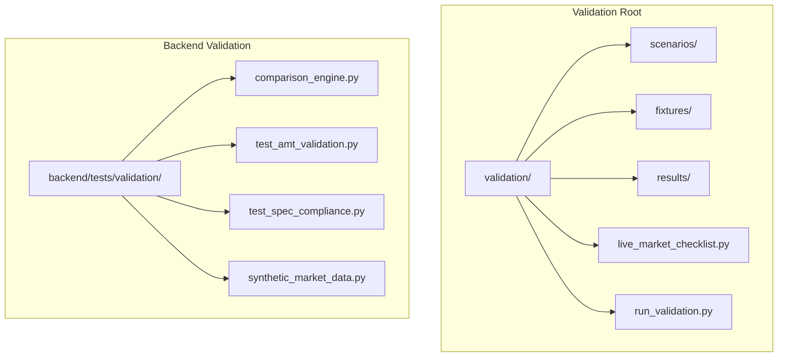
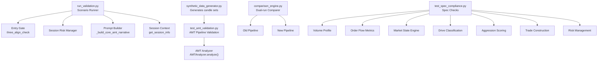
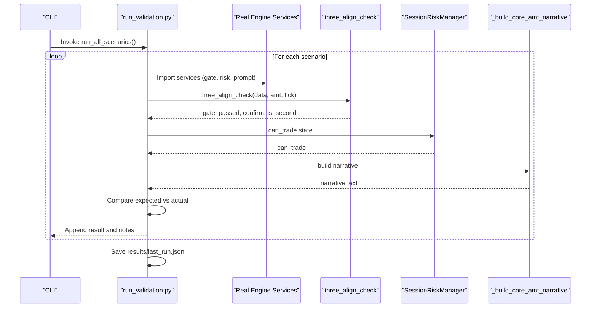
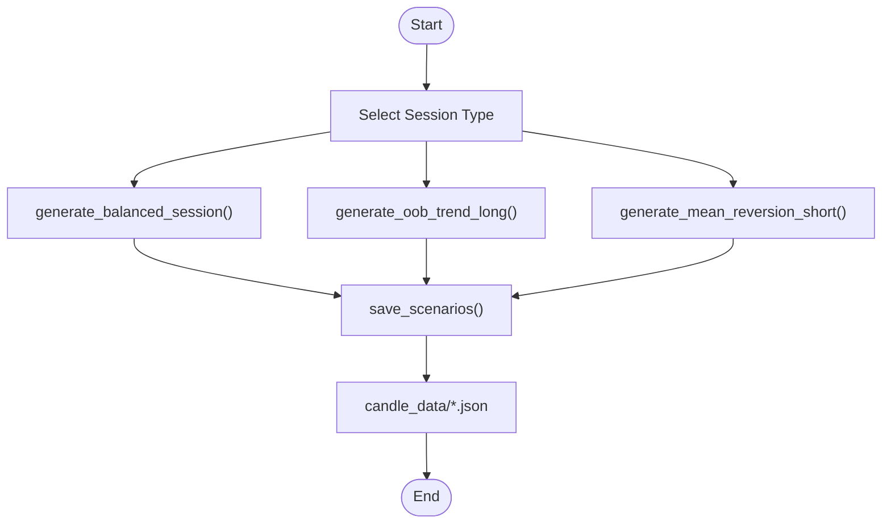
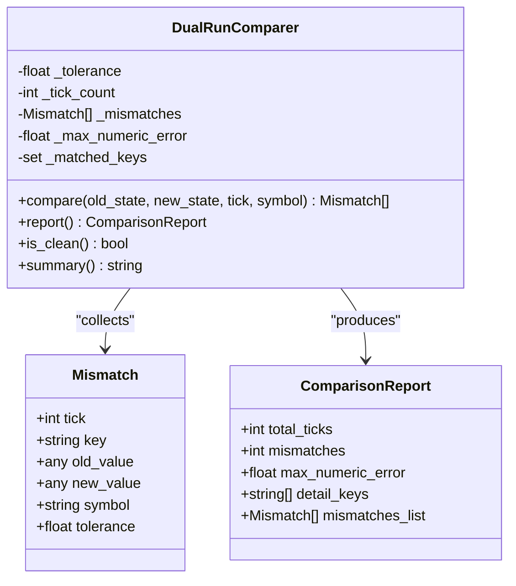
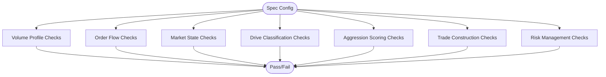
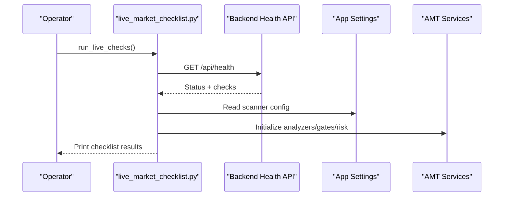
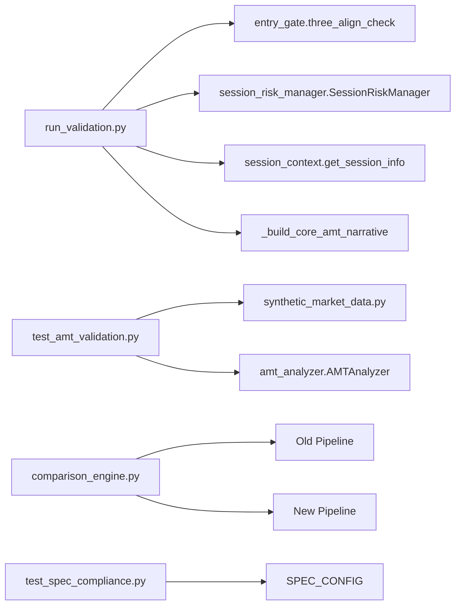

# Validation Framework

<cite>
**Referenced Files in This Document**
- [validation/README.md](file://validation/README.md)
- [validation/run_validation.py](file://validation/run_validation.py)
- [validation/live_market_checklist.py](file://validation/live_market_checklist.py)
- [validation/results/last_run.json](file://validation/results/last_run.json)
- [validation/scenarios/S001_BALANCED_NO_BREAK_NO_AGGRESSION.json](file://validation/scenarios/S001_BALANCED_NO_BREAK_NO_AGGRESSION.json)
- [validation/scenarios/S002_OOB_AT_LVN_STRONG_AGGRESSION_LONG.json](file://validation/scenarios/S002_OOB_AT_LVN_STRONG_AGGRESSION_LONG.json)
- [validation/scenarios/S015_IB_BREAK_MANDATORY_FOR_MODEL1.json](file://validation/scenarios/S015_IB_BREAK_MANDATORY_FOR_MODEL1.json)
- [validation/fixtures/synthetic_data_generator.py](file://validation/fixtures/synthetic_data_generator.py)
- [backend/tests/validation/comparison_engine.py](file://backend/tests/validation/comparison_engine.py)
- [backend/tests/validation/test_amt_validation.py](file://backend/tests/validation/test_amt_validation.py)
- [backend/tests/validation/test_spec_compliance.py](file://backend/tests/validation/test_spec_compliance.py)
- [backend/tests/validation/synthetic_market_data.py](file://backend/tests/validation/synthetic_market_data.py)
</cite>

## Table of Contents
1. [Introduction](#introduction)
2. [Project Structure](#project-structure)
3. [Core Components](#core-components)
4. [Architecture Overview](#architecture-overview)
5. [Detailed Component Analysis](#detailed-component-analysis)
6. [Dependency Analysis](#dependency-analysis)
7. [Performance Considerations](#performance-considerations)
8. [Troubleshooting Guide](#troubleshooting-guide)
9. [Conclusion](#conclusion)
10. [Appendices](#appendices)

## Introduction
This document describes the market data validation framework for GlassyTrade AI v5. It covers the scenario-based testing system aligned with Fabio Valentini’s Auction Market Theory (AMT) playbook, the comparison engine for validating trading logic against expected outcomes, synthetic market data generation for edge-case testing, and spec compliance validation. It also documents the 15 standardized test scenarios, practical workflows for creating new validations, interpreting results, automated regression testing, and performance benchmarking against historical market data.

## Project Structure
The validation framework is organized into:
- Scenario-driven validation under validation/
- Synthetic data generation under validation/fixtures/
- Live market pre-session checklist under validation/
- Backend-side AMT model validation and spec compliance under backend/tests/validation/

**Diagram sources**
- [validation/README.md:1-78](file://validation/README.md#L1-L78)
- [validation/run_validation.py:1-493](file://validation/run_validation.py#L1-L493)
- [validation/live_market_checklist.py:1-188](file://validation/live_market_checklist.py#L1-L188)
- [backend/tests/validation/comparison_engine.py:1-194](file://backend/tests/validation/comparison_engine.py#L1-L194)
- [backend/tests/validation/test_amt_validation.py:1-314](file://backend/tests/validation/test_amt_validation.py#L1-L314)
- [backend/tests/validation/test_spec_compliance.py:1-341](file://backend/tests/validation/test_spec_compliance.py#L1-L341)
- [backend/tests/validation/synthetic_market_data.py:1-405](file://backend/tests/validation/synthetic_market_data.py#L1-L405)

**Section sources**
- [validation/README.md:1-78](file://validation/README.md#L1-L78)

## Core Components
- Scenario-based validation runner: Executes 15 AMT-aligned scenarios against the real engine, capturing pass/fail and notes.
- Live market pre-session checklist: Verifies backend health, database, LLM readiness, scanners, session context, AMT analyzer, entry gates, risk manager, option scanner, and prompt builder.
- Synthetic market data generator: Produces balanced, out-of-balance trend, and mean-reversion sessions with realistic OHLCV and deltas for AMT pipeline testing.
- Comparison engine: Runs old vs new codepaths in parallel and reports mismatches with numeric tolerances.
- Spec compliance tests: Validates exact algorithmic implementations for volume profiles, order flow metrics, market states, drives, aggression scoring, trade construction, and risk management.

**Section sources**
- [validation/run_validation.py:1-493](file://validation/run_validation.py#L1-L493)
- [validation/live_market_checklist.py:1-188](file://validation/live_market_checklist.py#L1-L188)
- [validation/fixtures/synthetic_data_generator.py:1-302](file://validation/fixtures/synthetic_data_generator.py#L1-L302)
- [backend/tests/validation/comparison_engine.py:1-194](file://backend/tests/validation/comparison_engine.py#L1-L194)
- [backend/tests/validation/test_spec_compliance.py:1-341](file://backend/tests/validation/test_spec_compliance.py#L1-L341)

## Architecture Overview
The validation framework integrates scenario-driven tests, synthetic data, and spec compliance checks to ensure the AMT engine adheres to Fabio’s playbook and exact algorithmic specifications.

**Diagram sources**
- [validation/run_validation.py:170-437](file://validation/run_validation.py#L170-L437)
- [validation/fixtures/synthetic_data_generator.py:49-265](file://validation/fixtures/synthetic_data_generator.py#L49-L265)
- [backend/tests/validation/test_amt_validation.py:63-280](file://backend/tests/validation/test_amt_validation.py#L63-L280)
- [backend/tests/validation/comparison_engine.py:47-194](file://backend/tests/validation/comparison_engine.py#L47-L194)
- [backend/tests/validation/test_spec_compliance.py:26-42](file://backend/tests/validation/test_spec_compliance.py#L26-L42)

## Detailed Component Analysis

### Scenario-Based Testing System
- Purpose: Validate 15 AMT rules encoded as ground-truth scenarios.
- Coverage includes balanced states, breakout scenarios, aggressive prints, CVD extremes, shape warnings, R:R filters, opening session blocks, and more.
- Execution: The runner imports real services and runs each scenario via dedicated test functions, recording expected vs actual outcomes and saving results.

**Diagram sources**
- [validation/run_validation.py:159-437](file://validation/run_validation.py#L159-L437)

**Section sources**
- [validation/run_validation.py:65-156](file://validation/run_validation.py#L65-L156)
- [validation/run_validation.py:159-437](file://validation/run_validation.py#L159-L437)
- [validation/results/last_run.json:1-127](file://validation/results/last_run.json#L1-L127)

### Synthetic Market Data Generation
- Generates three canonical sessions:
  - Balanced rotation (typical AMT state)
  - Out-of-balance trend with displacement, pullback to LVN, and continuation
  - Mean reversion with failed breakout and snap-back to POC
- Outputs JSON files consumable by AMT pipeline tests.

**Diagram sources**
- [validation/fixtures/synthetic_data_generator.py:49-265](file://validation/fixtures/synthetic_data_generator.py#L49-L265)
- [validation/fixtures/synthetic_data_generator.py:277-296](file://validation/fixtures/synthetic_data_generator.py#L277-L296)

**Section sources**
- [validation/fixtures/synthetic_data_generator.py:1-302](file://validation/fixtures/synthetic_data_generator.py#L1-L302)
- [backend/tests/validation/synthetic_market_data.py:45-393](file://backend/tests/validation/synthetic_market_data.py#L45-L393)

### Comparison Engine for Regression Testing
- Compares old vs new pipeline outputs tick-by-tick.
- Supports exact equality and numeric comparisons within a configurable tolerance.
- Produces a report with mismatch counts, max numeric error, and last N mismatches.

**Diagram sources**
- [backend/tests/validation/comparison_engine.py:26-194](file://backend/tests/validation/comparison_engine.py#L26-L194)

**Section sources**
- [backend/tests/validation/comparison_engine.py:1-194](file://backend/tests/validation/comparison_engine.py#L1-L194)

### Spec Compliance Validation
- Validates exact algorithmic implementations:
  - Volume Profile Engine (POC, VAH/VAL, LVN/HVN thresholds)
  - Order Flow Metrics (CVD, footprint, absorption, OFI, VWAP)
  - Market State Engine (BALANCED, IMBALANCED, PROBING, NO_TRADE)
  - Drive Classification (first vs second drive)
  - Aggression Scoring (weighted signals)
  - Trade Construction (entry, SL, target, R:R)
  - Risk Management (session limits, position sizing)

**Diagram sources**
- [backend/tests/validation/test_spec_compliance.py:26-42](file://backend/tests/validation/test_spec_compliance.py#L26-L42)
- [backend/tests/validation/test_spec_compliance.py:49-332](file://backend/tests/validation/test_spec_compliance.py#L49-L332)

**Section sources**
- [backend/tests/validation/test_spec_compliance.py:1-341](file://backend/tests/validation/test_spec_compliance.py#L1-L341)

### Live Market Checklist
- Pre-market verification of backend health, database, LLM, scanner configuration, session context, AMT analyzer, entry gate, circuit breaker, option scanner, and prompt builder.
- Returns a pass/fail summary and actionable guidance.

**Diagram sources**
- [validation/live_market_checklist.py:16-152](file://validation/live_market_checklist.py#L16-L152)

**Section sources**
- [validation/live_market_checklist.py:1-188](file://validation/live_market_checklist.py#L1-L188)

## Dependency Analysis
- Scenario runner depends on real engine services (entry gate, session risk manager, session context, prompt builder).
- AMT pipeline tests depend on synthetic data generators and AMT analyzer.
- Comparison engine is independent and can be applied to any pair of pipelines.
- Spec compliance tests are self-contained and validate against explicit spec constants.

**Diagram sources**
- [validation/run_validation.py:170-179](file://validation/run_validation.py#L170-L179)
- [backend/tests/validation/test_amt_validation.py:21-29](file://backend/tests/validation/test_amt_validation.py#L21-L29)
- [backend/tests/validation/comparison_engine.py:47-194](file://backend/tests/validation/comparison_engine.py#L47-L194)
- [backend/tests/validation/test_spec_compliance.py:26-42](file://backend/tests/validation/test_spec_compliance.py#L26-L42)

**Section sources**
- [validation/run_validation.py:170-179](file://validation/run_validation.py#L170-L179)
- [backend/tests/validation/test_amt_validation.py:21-29](file://backend/tests/validation/test_amt_validation.py#L21-L29)
- [backend/tests/validation/comparison_engine.py:47-194](file://backend/tests/validation/comparison_engine.py#L47-L194)
- [backend/tests/validation/test_spec_compliance.py:26-42](file://backend/tests/validation/test_spec_compliance.py#L26-L42)

## Performance Considerations
- Synthetic data generation uses deterministic seeds to ensure reproducibility.
- Comparison engine supports numeric tolerances to handle floating-point differences due to execution order.
- Live checks use lightweight HTTP calls and local service initialization to minimize overhead.
- Scenario runner aggregates results and writes a compact JSON for quick review.

[No sources needed since this section provides general guidance]

## Troubleshooting Guide
- Scenario runner import errors: Verify backend path injection and module availability.
- Gate logic failures: Inspect gate_passed, confirm, and is_second outputs; ensure market state, LVN presence, and aggression meet thresholds.
- Risk manager halts: Confirm consecutive loss counts and max_consecutive_losses configuration.
- Spec compliance failures: Align thresholds and formulas with SPEC_CONFIG and expected behaviors.
- Live checks critical failures: Investigate backend health endpoint, database connectivity, and model readiness.

**Section sources**
- [validation/run_validation.py:180-182](file://validation/run_validation.py#L180-L182)
- [validation/live_market_checklist.py:31-37](file://validation/live_market_checklist.py#L31-L37)
- [backend/tests/validation/test_spec_compliance.py:26-42](file://backend/tests/validation/test_spec_compliance.py#L26-L42)

## Conclusion
GlassyTrade AI v5’s validation framework ensures AMT-aligned behavior through scenario-based tests, synthetic data generation, spec compliance checks, and live pre-session verification. The comparison engine enables robust regression testing between pipeline versions. Together, these components provide confidence for deployment and ongoing maintenance.

[No sources needed since this section summarizes without analyzing specific files]

## Appendices

### Practical Examples

- Creating a new validation scenario
  - Define input and expected outputs in a new JSON file under validation/scenarios/.
  - Add a test case in the scenario runner and implement the test function to construct mocks and call engine services.
  - Run the scenario runner to validate and update results.

  **Section sources**
  - [validation/scenarios/S001_BALANCED_NO_BREAK_NO_AGGRESSION.json:1-44](file://validation/scenarios/S001_BALANCED_NO_BREAK_NO_AGGRESSION.json#L1-L44)
  - [validation/run_validation.py:65-156](file://validation/run_validation.py#L65-L156)

- Running market data simulations
  - Generate synthetic candle sets for balanced, trend, and mean-reversion sessions.
  - Load scenarios and feed them into the AMT analyzer to validate state detection and profile construction.

  **Section sources**
  - [validation/fixtures/synthetic_data_generator.py:277-296](file://validation/fixtures/synthetic_data_generator.py#L277-L296)
  - [backend/tests/validation/test_amt_validation.py:255-280](file://backend/tests/validation/test_amt_validation.py#L255-L280)

- Interpreting validation results
  - Review pass/fail status and notes for each scenario.
  - Use last_run.json for automated reporting and CI integration.

  **Section sources**
  - [validation/results/last_run.json:1-127](file://validation/results/last_run.json#L1-L127)

- Automated regression testing
  - Use the comparison engine to compare old vs new pipelines over long tick streams.
  - Fail builds on mismatches exceeding tolerance.

  **Section sources**
  - [backend/tests/validation/comparison_engine.py:47-194](file://backend/tests/validation/comparison_engine.py#L47-L194)

- Performance benchmarking against historical market data
  - Convert historical OHLCV to the expected format and run AMT analyzer and entry gates.
  - Aggregate state transitions, trade decisions, and risk metrics for backtesting.

  [No sources needed since this section provides general guidance]

### 15 Standardized Test Scenarios Index
- S001: Balanced state, no breakout, no aggression → FLAT
- S002: Out-of-balance at LVN with strong aggression → LONG
- S003: Balanced failed breakout → SHORT (mean reversion)
- S004: Out-of-balance at LVN with zero aggression → FLAT
- S005: All gates pass but prior POC null → FLAT
- S006: Kelly never exceeds 0.5% (conservative when unproven)
- S007: Balanced with IB break not yet failed → WAIT
- S008: CVD is trade management, not entry
- S009: Profile must match option premium range
- S010: Signal and rationale must match
- S011: No rapid-fire entries in balanced state
- S012: Stop-loss at aggressive print, not multiplier
- S013: Full exit at prior session POC
- S014: Breakeven triggered by CVD pressure
- S015: IB break mandatory for Model 1

**Section sources**
- [validation/README.md:54-78](file://validation/README.md#L54-L78)
- [validation/scenarios/S001_BALANCED_NO_BREAK_NO_AGGRESSION.json:1-44](file://validation/scenarios/S001_BALANCED_NO_BREAK_NO_AGGRESSION.json#L1-L44)
- [validation/scenarios/S002_OOB_AT_LVN_STRONG_AGGRESSION_LONG.json:1-52](file://validation/scenarios/S002_OOB_AT_LVN_STRONG_AGGRESSION_LONG.json#L1-L52)
- [validation/scenarios/S015_IB_BREAK_MANDATORY_FOR_MODEL1.json:1-21](file://validation/scenarios/S015_IB_BREAK_MANDATORY_FOR_MODEL1.json#L1-L21)