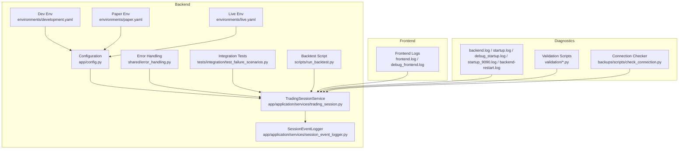
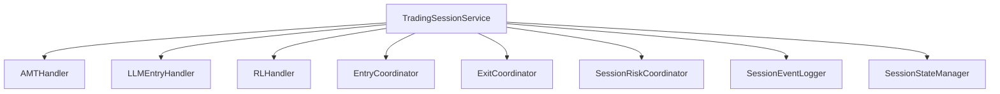
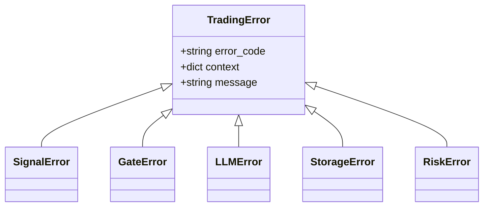
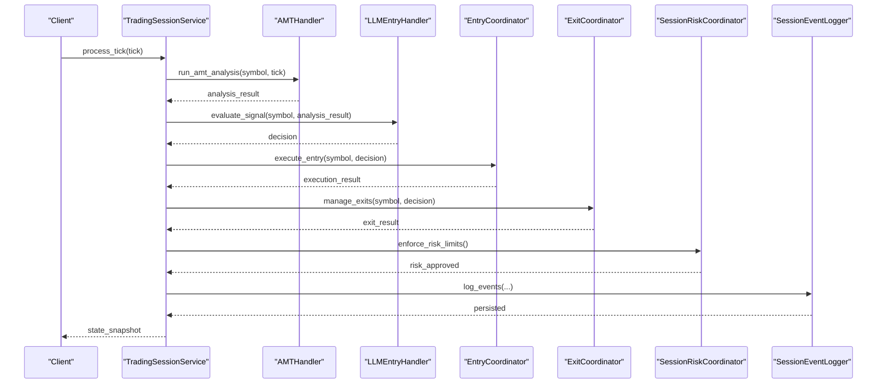
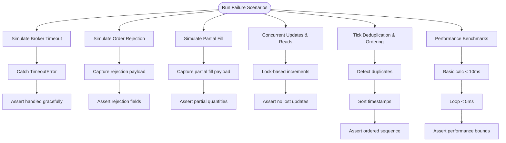
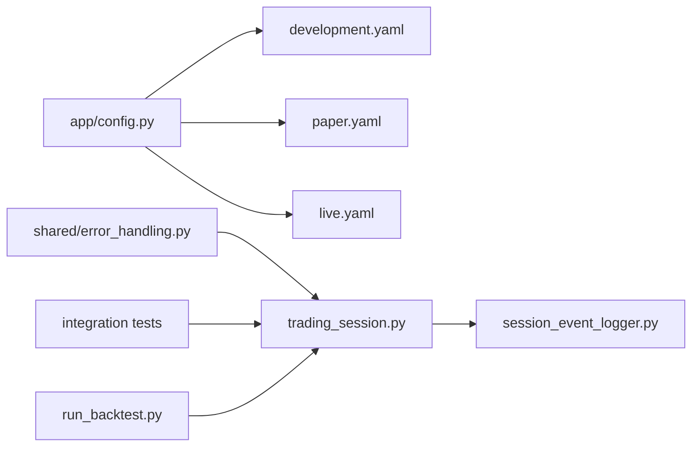
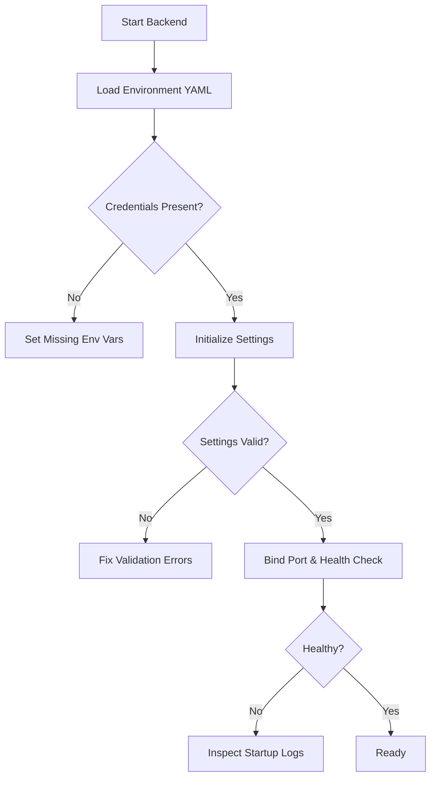

# Troubleshooting and FAQ

<cite>
**Referenced Files in This Document**
- [ENGINEERING_LOG.md](file://backend/ENGINEERING_LOG.md)
- [FINAL_REPORT.md](file://backend/FINAL_REPORT.md)
- [COMPREHENSIVE_CODEBASE_ANALYSIS.md](file://backend/COMPREHENSIVE_CODEBASE_ANALYSIS.md)
- [app/config.py](file://backend/app/config.py)
- [config/environments/development.yaml](file://backend/config/environments/development.yaml)
- [config/environments/paper.yaml](file://backend/config/environments/paper.yaml)
- [config/environments/live.yaml](file://backend/config/environments/live.yaml)
- [shared/error_handling.py](file://shared/error_handling.py)
- [app/application/services/trading_session.py](file://backend/app/application/services/trading_session.py)
- [app/application/services/session_event_logger.py](file://backend/app/application/services/session_event_logger.py)
- [tests/integration/test_failure_scenarios.py](file://backend/tests/integration/test_failure_scenarios.py)
- [scripts/run_backtest.py](file://backend/scripts/run_backtest.py)
- [backend.log](file://backend/backend.log)
- [startup.log](file://backend/startup.log)
- [debug_startup.log](file://backend/debug_startup.log)
- [startup_9090.log](file://backend/startup_9090.log)
- [backend-restart.log](file://backend-restart.log)
- [frontend.log](file://backend/frontend.log)
- [frontend/debug_frontend.log](file://backend/frontend.debug_frontend.log)
- [validation/live_market_checklist.py](file://validation/live_market_checklist.py)
- [validation/run_validation.py](file://validation/run_validation.py)
- [backups/scripts/check_connection.py](file://backups/scripts/check_connection.py)
</cite>

## Table of Contents
1. [Introduction](#introduction)
2. [Project Structure](#project-structure)
3. [Core Components](#core-components)
4. [Architecture Overview](#architecture-overview)
5. [Detailed Component Analysis](#detailed-component-analysis)
6. [Dependency Analysis](#dependency-analysis)
7. [Performance Considerations](#performance-considerations)
8. [Troubleshooting Guide](#troubleshooting-guide)
9. [FAQ](#faq)
10. [Conclusion](#conclusion)
11. [Appendices](#appendices)

## Introduction
This document provides a comprehensive troubleshooting and FAQ guide for GlassyTrade AI v5. It focuses on diagnosing and resolving common operational issues across model loading, broker connectivity, WebSocket streaming, and performance bottlenecks. It also documents debugging techniques using engineering logs, test verification tools, and diagnostic scripts, along with step-by-step guides for system initialization failures, market data processing issues, and trading execution problems. Guidance on configuration, integration challenges, performance optimization, and escalation procedures is included to support both new and experienced users.

## Project Structure
GlassyTrade AI v5 is a modular Python/TypeScript system with a backend trading engine, frontend dashboard, broker integrations, and validation tooling. Key areas relevant to troubleshooting include:
- Backend trading engine and services
- Configuration and environment profiles
- Error handling utilities and logging
- Integration and unit tests
- Diagnostic scripts and logs
- Validation and backtesting utilities

**Diagram sources**
- [app/config.py:1-157](file://backend/app/config.py#L1-L157)
- [config/environments/development.yaml:1-33](file://backend/config/environments/development.yaml#L1-L33)
- [config/environments/paper.yaml:1-25](file://backend/config/environments/paper.yaml#L1-L25)
- [config/environments/live.yaml:1-26](file://backend/config/environments/live.yaml#L1-L26)
- [shared/error_handling.py:1-203](file://shared/error_handling.py#L1-L203)
- [app/application/services/trading_session.py:1-200](file://backend/app/application/services/trading_session.py#L1-L200)
- [app/application/services/session_event_logger.py:1-312](file://backend/app/application/services/session_event_logger.py#L1-L312)
- [tests/integration/test_failure_scenarios.py:1-441](file://backend/tests/integration/test_failure_scenarios.py#L1-L441)
- [scripts/run_backtest.py:1-69](file://backend/scripts/run_backtest.py#L1-L69)
- [backend.log](file://backend/backend.log)
- [startup.log](file://backend/startup.log)
- [debug_startup.log](file://backend/debug_startup.log)
- [startup_9090.log](file://backend/startup_9090.log)
- [backend-restart.log](file://backend-restart.log)
- [frontend.log](file://backend/frontend.log)
- [frontend/debug_frontend.log](file://backend/frontend.debug_frontend.log)
- [validation/live_market_checklist.py](file://validation/live_market_checklist.py)
- [validation/run_validation.py](file://validation/run_validation.py)
- [backups/scripts/check_connection.py](file://backups/scripts/check_connection.py)

**Section sources**
- [app/config.py:1-157](file://backend/app/config.py#L1-L157)
- [config/environments/development.yaml:1-33](file://backend/config/environments/development.yaml#L1-L33)
- [config/environments/paper.yaml:1-25](file://backend/config/environments/paper.yaml#L1-L25)
- [config/environments/live.yaml:1-26](file://backend/config/environments/live.yaml#L1-L26)
- [shared/error_handling.py:1-203](file://shared/error_handling.py#L1-L203)
- [app/application/services/trading_session.py:1-200](file://backend/app/application/services/trading_session.py#L1-L200)
- [app/application/services/session_event_logger.py:1-312](file://backend/app/application/services/session_event_logger.py#L1-L312)
- [tests/integration/test_failure_scenarios.py:1-441](file://backend/tests/integration/test_failure_scenarios.py#L1-L441)
- [scripts/run_backtest.py:1-69](file://backend/scripts/run_backtest.py#L1-L69)
- [backend.log](file://backend/backend.log)
- [startup.log](file://backend/startup.log)
- [debug_startup.log](file://backend/debug_startup.log)
- [startup_9090.log](file://backend/startup_9090.log)
- [backend-restart.log](file://backend-restart.log)
- [frontend.log](file://backend/frontend.log)
- [frontend/debug_frontend.log](file://backend/frontend.debug_frontend.log)
- [validation/live_market_checklist.py](file://validation/live_market_checklist.py)
- [validation/run_validation.py](file://validation/run_validation.py)
- [backups/scripts/check_connection.py](file://backups/scripts/check_connection.py)

## Core Components
- Configuration and environment profiles define runtime behavior, broker mode, logging levels, and risk parameters. Use environment-specific YAML files to isolate development, paper, and live settings.
- Error handling utilities standardize exception types and logging across modules, enabling consistent diagnostics.
- TradingSessionService orchestrates per-symbol state, delegates to specialized handlers, and coordinates risk, logging, and persistence.
- SessionEventLogger persists position events, trade journals, explainability, and forward-test logs for auditability.
- Integration tests simulate failure scenarios (broker timeouts, order rejections, partial fills, thread safety, data integrity, performance) to validate resilience.
- Backtesting script validates historical trade performance and can be used to verify post-fix behavior.

**Section sources**
- [app/config.py:1-157](file://backend/app/config.py#L1-L157)
- [config/environments/development.yaml:1-33](file://backend/config/environments/development.yaml#L1-L33)
- [config/environments/paper.yaml:1-25](file://backend/config/environments/paper.yaml#L1-L25)
- [config/environments/live.yaml:1-26](file://backend/config/environments/live.yaml#L1-L26)
- [shared/error_handling.py:1-203](file://shared/error_handling.py#L1-L203)
- [app/application/services/trading_session.py:1-200](file://backend/app/application/services/trading_session.py#L1-L200)
- [app/application/services/session_event_logger.py:1-312](file://backend/app/application/services/session_event_logger.py#L1-L312)
- [tests/integration/test_failure_scenarios.py:1-441](file://backend/tests/integration/test_failure_scenarios.py#L1-L441)
- [scripts/run_backtest.py:1-69](file://backend/scripts/run_backtest.py#L1-L69)

## Architecture Overview
The system follows a layered architecture with clear separation of domain, application, and infrastructure concerns. TradingSessionService acts as a thin coordinator delegating to specialized handlers and services. Error handling and logging are centralized to improve observability and debugging.

**Diagram sources**
- [app/application/services/trading_session.py:1-200](file://backend/app/application/services/trading_session.py#L1-L200)

**Section sources**
- [app/application/services/trading_session.py:1-200](file://backend/app/application/services/trading_session.py#L1-L200)

## Detailed Component Analysis

### Error Handling and Logging
- Standardized exception hierarchy improves error categorization and context.
- Decorators and context managers provide consistent error handling patterns.
- Logging captures function/module context and stack traces for rapid diagnosis.

**Diagram sources**
- [shared/error_handling.py:1-203](file://shared/error_handling.py#L1-L203)

**Section sources**
- [shared/error_handling.py:1-203](file://shared/error_handling.py#L1-L203)

### Trading Session Orchestration
- TradingSessionService initializes specialized handlers and services, manages per-symbol state, and delegates responsibilities to maintain separation of concerns.
- It integrates with configuration, risk, logging, and persistence layers.

**Diagram sources**
- [app/application/services/trading_session.py:1-200](file://backend/app/application/services/trading_session.py#L1-L200)
- [app/application/services/session_event_logger.py:1-312](file://backend/app/application/services/session_event_logger.py#L1-L312)

**Section sources**
- [app/application/services/trading_session.py:1-200](file://backend/app/application/services/trading_session.py#L1-L200)
- [app/application/services/session_event_logger.py:1-312](file://backend/app/application/services/session_event_logger.py#L1-L312)

### Integration Failure Scenarios Testing
- Tests cover broker timeouts, order rejections, partial fills, thread safety, data integrity, and performance to validate system resilience.

**Diagram sources**
- [tests/integration/test_failure_scenarios.py:1-441](file://backend/tests/integration/test_failure_scenarios.py#L1-L441)

**Section sources**
- [tests/integration/test_failure_scenarios.py:1-441](file://backend/tests/integration/test_failure_scenarios.py#L1-L441)

## Dependency Analysis
- Configuration consolidation ensures a single source of truth for settings, reducing misconfiguration risks.
- Environment-specific YAML files isolate development, paper, and live configurations.
- Error handling utilities are imported across modules to standardize diagnostics.

**Diagram sources**
- [app/config.py:1-157](file://backend/app/config.py#L1-L157)
- [config/environments/development.yaml:1-33](file://backend/config/environments/development.yaml#L1-L33)
- [config/environments/paper.yaml:1-25](file://backend/config/environments/paper.yaml#L1-L25)
- [config/environments/live.yaml:1-26](file://backend/config/environments/live.yaml#L1-L26)
- [shared/error_handling.py:1-203](file://shared/error_handling.py#L1-L203)
- [app/application/services/trading_session.py:1-200](file://backend/app/application/services/trading_session.py#L1-L200)
- [app/application/services/session_event_logger.py:1-312](file://backend/app/application/services/session_event_logger.py#L1-L312)
- [tests/integration/test_failure_scenarios.py:1-441](file://backend/tests/integration/test_failure_scenarios.py#L1-L441)
- [scripts/run_backtest.py:1-69](file://backend/scripts/run_backtest.py#L1-L69)

**Section sources**
- [app/config.py:1-157](file://backend/app/config.py#L1-L157)
- [config/environments/development.yaml:1-33](file://backend/config/environments/development.yaml#L1-L33)
- [config/environments/paper.yaml:1-25](file://backend/config/environments/paper.yaml#L1-L25)
- [config/environments/live.yaml:1-26](file://backend/config/environments/live.yaml#L1-L26)
- [shared/error_handling.py:1-203](file://shared/error_handling.py#L1-L203)
- [app/application/services/trading_session.py:1-200](file://backend/app/application/services/trading_session.py#L1-L200)
- [app/application/services/session_event_logger.py:1-312](file://backend/app/application/services/session_event_logger.py#L1-L312)
- [tests/integration/test_failure_scenarios.py:1-441](file://backend/tests/integration/test_failure_scenarios.py#L1-L441)
- [scripts/run_backtest.py:1-69](file://backend/scripts/run_backtest.py#L1-L69)

## Performance Considerations
- Keep logging levels appropriate for environment (DEBUG for development, INFO/WARNING for paper/live) to reduce overhead.
- Use the backtesting script to validate performance-sensitive changes on historical data.
- Monitor thread safety and avoid shared mutable state without proper synchronization.
- Validate decimal vs float usage to prevent precision-related performance pitfalls.

[No sources needed since this section provides general guidance]

## Troubleshooting Guide

### Step 1: System Initialization Failures
Common symptoms:
- Backend fails to start or reports health checks failing.
- Missing or invalid environment variables.
- Configuration validation errors.

Recommended actions:
- Verify environment variables and configuration files:
  - Confirm environment selection and broker mode in environment YAML.
  - Ensure required credentials are present in settings.
- Review startup logs:
  - Check backend startup logs for early exceptions.
  - Inspect port binding logs to confirm service availability.
- Validate configuration at runtime:
  - Use configuration validation to detect missing fields.
- Confirm service graph and dependency injection:
  - Ensure specialized handlers/services are initialized by the trading session.

**Diagram sources**
- [app/config.py:147-153](file://backend/app/config.py#L147-L153)
- [config/environments/development.yaml:1-33](file://backend/config/environments/development.yaml#L1-L33)
- [config/environments/paper.yaml:1-25](file://backend/config/environments/paper.yaml#L1-L25)
- [config/environments/live.yaml:1-26](file://backend/config/environments/live.yaml#L1-L26)
- [startup.log](file://backend/startup.log)
- [startup_9090.log](file://backend/startup_9090.log)

**Section sources**
- [app/config.py:147-153](file://backend/app/config.py#L147-L153)
- [config/environments/development.yaml:1-33](file://backend/config/environments/development.yaml#L1-L33)
- [config/environments/paper.yaml:1-25](file://backend/config/environments/paper.yaml#L1-L25)
- [config/environments/live.yaml:1-26](file://backend/config/environments/live.yaml#L1-L26)
- [startup.log](file://backend/startup.log)
- [startup_9090.log](file://backend/startup_9090.log)

### Step 2: Market Data Processing Issues
Common symptoms:
- Missing or duplicate ticks.
- Out-of-order tick delivery.
- Incorrect OHLCV aggregation.

Recommended actions:
- Validate deduplication and ordering:
  - Ensure duplicate timestamp detection and sorting logic.
- Check candle aggregation:
  - Confirm interval and aggregation logic aligns with expectations.
- Review logs for data integrity issues:
  - Use integration tests as a reference for expected behavior.

**Section sources**
- [tests/integration/test_failure_scenarios.py:205-232](file://backend/tests/integration/test_failure_scenarios.py#L205-L232)

### Step 3: Trading Execution Problems
Common symptoms:
- Orders rejected or partially filled.
- Broker timeouts during execution.
- Position sizing or risk limits not applied.

Recommended actions:
- Simulate and verify failure modes:
  - Use integration tests to reproduce and validate handling of rejections and partial fills.
- Check risk coordinator and position sizing:
  - Ensure risk limits and position sizing logic are invoked before order placement.
- Confirm execution flow:
  - Verify entry/exit coordinators receive and act on decisions.

**Section sources**
- [tests/integration/test_failure_scenarios.py:384-433](file://backend/tests/integration/test_failure_scenarios.py#L384-L433)
- [app/application/services/trading_session.py:1-200](file://backend/app/application/services/trading_session.py#L1-L200)

### Step 4: Model Loading Failures
Common symptoms:
- LLM model path not found.
- Adapter path invalid.
- Inference backend misconfigured.

Recommended actions:
- Verify model and adapter paths in settings:
  - Ensure absolute or resolved paths exist.
- Confirm backend selection matches installed adapters.
- Validate model readiness and permissions.

**Section sources**
- [app/config.py:92-124](file://backend/app/config.py#L92-L124)

### Step 5: Broker Connectivity Problems
Common symptoms:
- Connection errors or timeouts.
- Authentication failures.
- Subscription or feed issues.

Recommended actions:
- Use connection checker scripts:
  - Validate broker connectivity and credentials.
- Review broker logs and network connectivity.
- Confirm exchange configuration and symbol lists.

**Section sources**
- [backups/scripts/check_connection.py](file://backups/scripts/check_connection.py)
- [config/environments/development.yaml:1-33](file://backend/config/environments/development.yaml#L1-L33)
- [config/environments/paper.yaml:1-25](file://backend/config/environments/paper.yaml#L1-L25)
- [config/environments/live.yaml:1-26](file://backend/config/environments/live.yaml#L1-L26)

### Step 6: WebSocket Disconnections
Common symptoms:
- Stream interruptions.
- Missing real-time updates.
- Dashboard desynchronization.

Recommended actions:
- Inspect frontend logs for WebSocket errors.
- Validate backend WebSocket state snapshots and reconnection logic.
- Confirm network stability and firewall rules.

**Section sources**
- [frontend.log](file://backend/frontend.log)
- [frontend/debug_frontend.log](file://backend/frontend.debug_frontend.log)

### Step 7: Performance Bottlenecks
Common symptoms:
- Slow tick processing.
- High memory usage.
- Elevated CPU/GPU utilization.

Recommended actions:
- Use backtesting script to measure performance on historical datasets.
- Reduce logging verbosity in live mode.
- Audit thread safety and shared state usage.
- Validate decimal vs float usage for precision-sensitive calculations.

**Section sources**
- [scripts/run_backtest.py:1-69](file://backend/scripts/run_backtest.py#L1-L69)
- [tests/integration/test_failure_scenarios.py:297-319](file://backend/tests/integration/test_failure_scenarios.py#L297-L319)

## FAQ

Q1: How do I verify configuration correctness?
- Use the configuration validation method to check for missing fields.
- Compare environment YAML settings with expected defaults.

Q2: How do I diagnose broker connectivity issues?
- Run the connection checker script and review logs.
- Confirm exchange configuration and symbol lists.

Q3: How do I troubleshoot model loading problems?
- Verify model and adapter paths in settings.
- Ensure backend selection matches installed adapters.

Q4: How do I validate trading execution behavior?
- Use integration tests to simulate rejections, partial fills, and timeouts.
- Confirm risk limits and position sizing logic.

Q5: How do I monitor performance?
- Use the backtesting script to benchmark historical runs.
- Adjust logging levels and inspect thread safety.

Q6: Where do I find engineering logs and diagnostics?
- Backend logs include startup, restart, and general logs.
- Frontend logs capture client-side WebSocket and rendering issues.
- Validation scripts provide checklist and run utilities.

Q7: How do I escalate complex issues?
- Document environment, configuration, and reproduction steps.
- Attach relevant logs and test outputs.
- Engage the appropriate support channels as defined by your organization’s process.

**Section sources**
- [app/config.py:147-153](file://backend/app/config.py#L147-L153)
- [config/environments/development.yaml:1-33](file://backend/config/environments/development.yaml#L1-L33)
- [config/environments/paper.yaml:1-25](file://backend/config/environments/paper.yaml#L1-L25)
- [config/environments/live.yaml:1-26](file://backend/config/environments/live.yaml#L1-L26)
- [backups/scripts/check_connection.py](file://backups/scripts/check_connection.py)
- [scripts/run_backtest.py:1-69](file://backend/scripts/run_backtest.py#L1-L69)
- [tests/integration/test_failure_scenarios.py:1-441](file://backend/tests/integration/test_failure_scenarios.py#L1-L441)
- [backend.log](file://backend/backend.log)
- [startup.log](file://backend/startup.log)
- [startup_9090.log](file://backend/startup_9090.log)
- [backend-restart.log](file://backend-restart.log)
- [frontend.log](file://backend/frontend.log)
- [frontend/debug_frontend.log](file://backend/frontend.debug_frontend.log)
- [validation/live_market_checklist.py](file://validation/live_market_checklist.py)
- [validation/run_validation.py](file://validation/run_validation.py)

## Conclusion
This guide consolidates troubleshooting workflows, diagnostic techniques, and best practices for GlassyTrade AI v5. By leveraging configuration validation, standardized error handling, integration tests, and diagnostic scripts, most operational issues can be quickly identified and resolved. For persistent or complex problems, escalate with comprehensive logs and reproducible test cases.

[No sources needed since this section summarizes without analyzing specific files]

## Appendices

### Appendix A: Debugging Techniques
- Use engineering logs to trace initialization, runtime, and restart events.
- Employ integration tests to simulate and validate failure scenarios.
- Run the backtesting script to verify performance and logic correctness.
- Inspect frontend logs for WebSocket and UI-related issues.

**Section sources**
- [ENGINEERING_LOG.md:1-353](file://backend/ENGINEERING_LOG.md#L1-L353)
- [tests/integration/test_failure_scenarios.py:1-441](file://backend/tests/integration/test_failure_scenarios.py#L1-L441)
- [scripts/run_backtest.py:1-69](file://backend/scripts/run_backtest.py#L1-L69)
- [backend.log](file://backend/backend.log)
- [startup.log](file://backend/startup.log)
- [startup_9090.log](file://backend/startup_9090.log)
- [backend-restart.log](file://backend-restart.log)
- [frontend.log](file://backend/frontend.log)
- [frontend/debug_frontend.log](file://backend/frontend.debug_frontend.log)

### Appendix B: Configuration Quick Reference
- Environment YAML files define broker mode, logging level, and risk parameters.
- Settings class consolidates runtime configuration and validation.

**Section sources**
- [config/environments/development.yaml:1-33](file://backend/config/environments/development.yaml#L1-L33)
- [config/environments/paper.yaml:1-25](file://backend/config/environments/paper.yaml#L1-L25)
- [config/environments/live.yaml:1-26](file://backend/config/environments/live.yaml#L1-L26)
- [app/config.py:1-157](file://backend/app/config.py#L1-L157)

### Appendix C: Stability and Refactoring Notes
- Recent engineering logs document stability fixes and feature additions.
- Final report outlines test coverage and architecture improvements.

**Section sources**
- [ENGINEERING_LOG.md:1-353](file://backend/ENGINEERING_LOG.md#L1-L353)
- [FINAL_REPORT.md:1-153](file://backend/FINAL_REPORT.md#L1-L153)
- [COMPREHENSIVE_CODEBASE_ANALYSIS.md:1-340](file://backend/COMPREHENSIVE_CODEBASE_ANALYSIS.md#L1-L340)