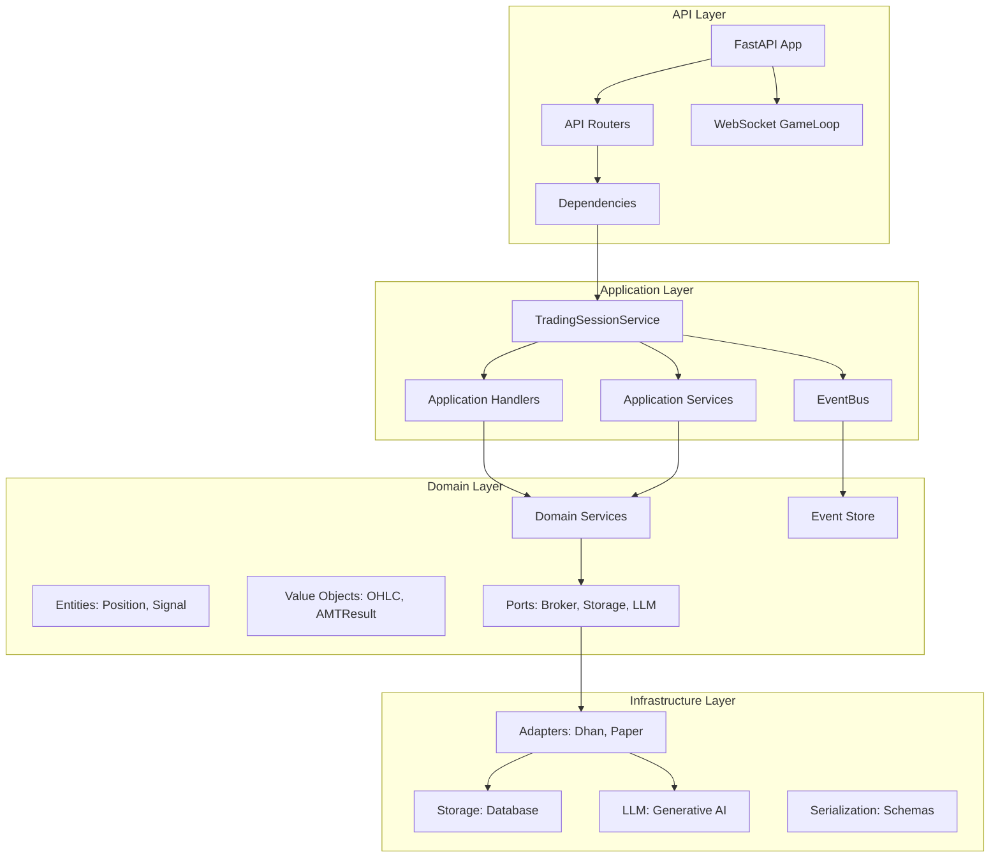
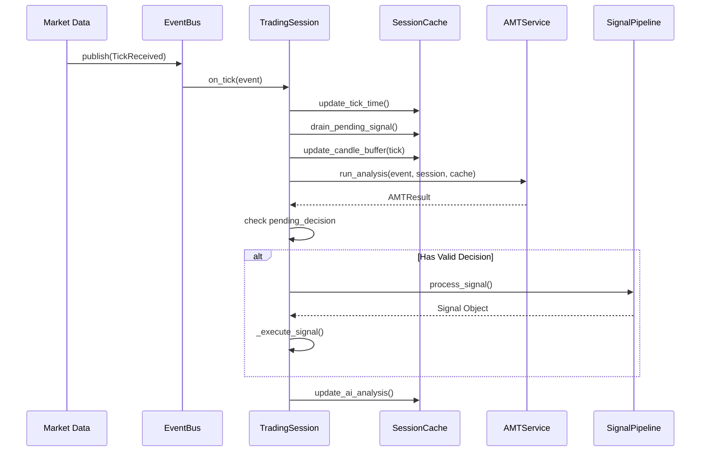
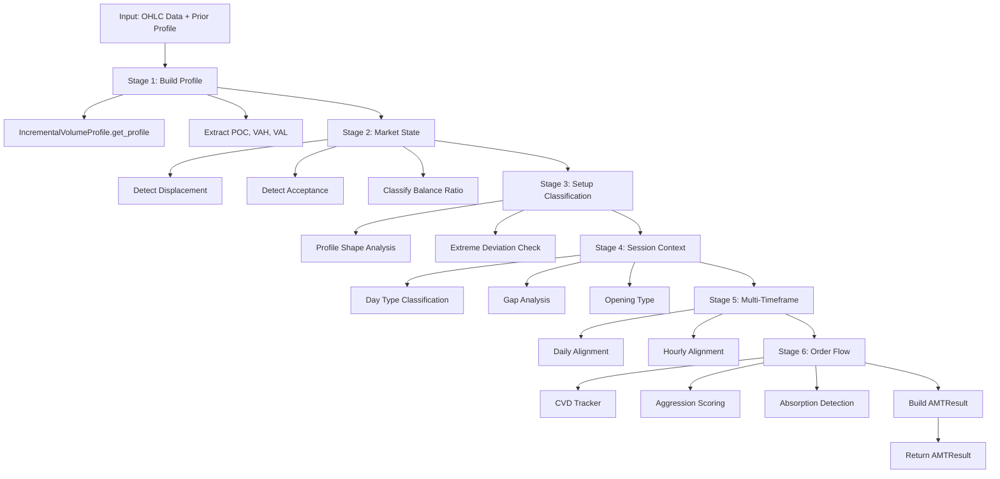
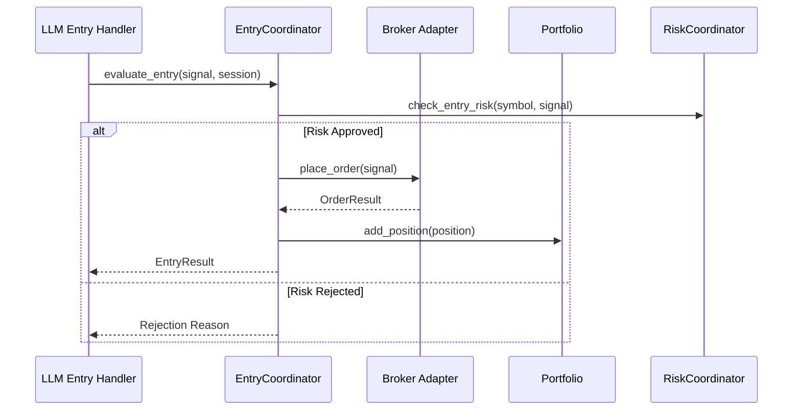
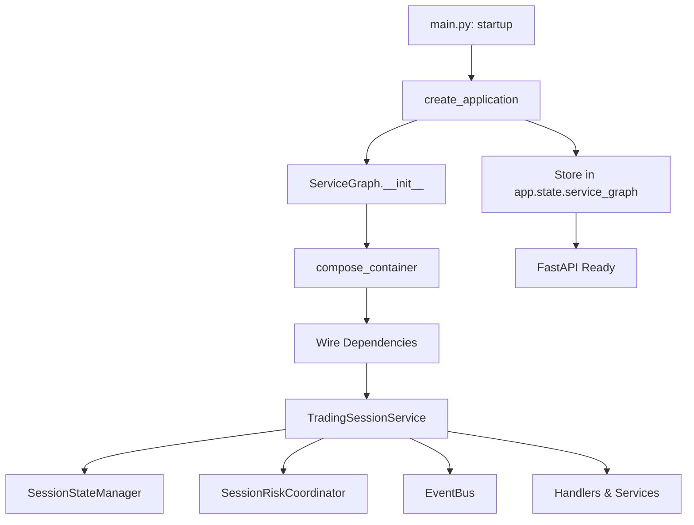
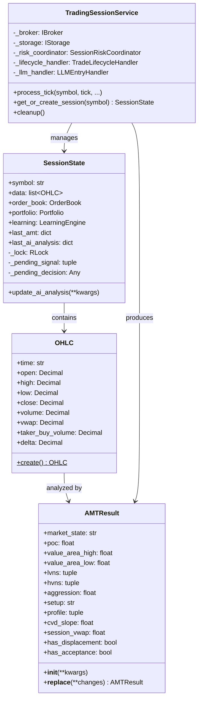
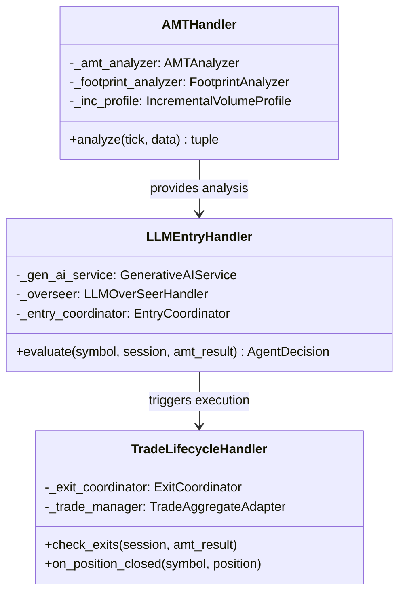
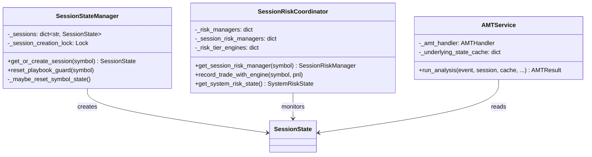

# GlassyTrade AI - Complete Architecture Documentation

> **Date**: 2026-05-01  
> **Version**: v5  
> **Status**: Production  

## Table of Contents

1. [Complete File Tree](#1-complete-file-tree)
2. [Architecture Overview](#2-architecture-overview)
3. [Component Diagram](#3-component-diagram)
4. [Flow Diagrams](#4-flow-diagrams)
5. [Class Diagrams](#5-class-diagrams)
6. [Detailed Component Descriptions](#6-detailed-component-descriptions)
7. [Data Models](#7-data-models)
8. [API Layer](#8-api-layer)
9. [Infrastructure Layer](#9-infrastructure-layer)
10. [Test Coverage](#10-test-coverage)

---

## 1. Complete File Tree

```
backend/
├── app/
│   ├── __init__.py
│   ├── config.py                          # Application configuration
│   ├── main.py                            # FastAPI application entry point
│   │
│   ├── api/                              # API Layer (FastAPI routers)
│   │   ├── __init__.py
│   │   ├── dependencies.py                 # FastAPI dependency injection
│   │   ├── routers/
│   │   │   ├── __init__.py
│   │   │   ├── ai.py                     # AI-related endpoints
│   │   │   ├── alerts.py                 # Alert endpoints
│   │   │   ├── analysis.py               # Analysis endpoints
│   │   │   ├── health.py                 # Health check endpoints
│   │   │   ├── market.py                 # Market data endpoints
│   │   │   ├── metrics.py                # Metrics endpoints
│   │   │   ├── observability.py          # Observability endpoints
│   │   │   ├── rl.py                    # RL endpoints
│   │   │   └── trading.py               # Trading endpoints
│   │   └── websocket/
│   │       ├── __init__.py
│   │       └── gameloop.py               # WebSocket game loop
│   │
│   ├── application/                       # Application Layer
│   │   ├── __init__.py
│   │   ├── candle_aggregator.py          # Candle aggregation logic
│   │   ├── engine.py                     # Trading engine
│   │   ├── range_bar_builder.py          # Range bar construction
│   │   ├── service_graph.py              # Service locator (to be eliminated)
│   │   ├── stream_manager.py             # Stream management
│   │   ├── utils.py                      # Application utilities
│   │   ├── watchdog_manager.py           # Watchdog management
│   │   │
│   │   ├── di/                           # Dependency Injection
│   │   │   ├── __init__.py
│   │   │   ├── composition_root.py      # DI container setup
│   │   │   └── container.py             # DI container
│   │   │
│   │   ├── events/                       # Application Events
│   │   │   ├── __init__.py
│   │   │   ├── handler.py               # Event handlers
│   │   │   └── resilient_wrapper.py     # Resilient event wrapper
│   │   │
│   │   ├── handlers/                    # Application Handlers
│   │   │   ├── __init__.py
│   │   │   ├── amt_handler.py           # AMT analysis handler
│   │   │   ├── entry_gate_coordinator.py # Entry gate coordination
│   │   │   ├── episodic_loader.py       # Episodic memory loader
│   │   │   ├── institutional_detector.py # Institutional detection
│   │   │   ├── llm_context.py           # LLM context building
│   │   │   ├── llm_decision_processor.py # LLM decision processing
│   │   │   ├── llm_entry_handler.py    # LLM entry handler
│   │   │   ├── llm_overseer_handler.py # LLM overseer handler
│   │   │   ├── llm_signal_processor.py # LLM signal processing
│   │   │   ├── llm_utils.py            # LLM utilities
│   │   │   ├── llm_worker.py           # LLM worker thread
│   │   │   ├── post_trade_analyst.py   # Post-trade analysis
│   │   │   ├── pre_candle_advisor.py   # Pre-candle advisory
│   │   │   ├── rl_handler.py           # RL handler
│   │   │   └── trade_lifecycle_handler.py # Trade lifecycle
│   │   │
│   │   ├── ports/                       # Application Ports
│   │   │   └── trade_journal.py        # Trade journal port
│   │   │
│   │   ├── protocols.py                 # Application protocols
│   │   │
│   │   └── services/                    # Application Services
│   │       ├── __init__.py
│   │       ├── amt_coordinator.py       # AMT coordination
│   │       ├── amt_service.py           # AMT service
│   │       ├── engine_lifecycle.py      # Engine lifecycle
│   │       ├── entry_coordinator.py     # Entry coordination
│   │       ├── exit_coordinator.py      # Exit coordination
│   │       ├── experiment_context.py    # Experiment context
│   │       ├── forward_test_logger.py   # Forward test logging
│   │       ├── gap_detector.py          # Gap detection
│   │       ├── phase_manager.py         # Session phase management
│   │       ├── session_cache.py         # Session cache (thread-safe)
│   │       ├── session_event_logger.py  # Session event logging
│   │       ├── session_event_router.py  # Session event routing
│   │       ├── session_risk_coordinator.py # Session risk coordination
│   │       ├── session_state_manager.py # Session state management
│   │       ├── signal_coordinator.py    # Signal coordination
│   │       ├── signal_tracking_service.py # Signal tracking
│   │       ├── state_broadcaster.py     # State broadcasting
│   │       ├── state_snapshot_builder.py # State snapshot builder
│   │       ├── tick_processor.py        # Tick processing
│   │       ├── trade_journal.py         # Trade journal service
│   │       └── trading_session.py      # Trading session service
│   │
│   ├── config_models/                    # Configuration Models
│   │   ├── __init__.py
│   │   ├── loader.py                   # Config loader
│   │   ├── settings_adapter.py         # Settings adapter
│   │   └── validator.py                # Config validator
│   │
│   ├── core/                            # Core Utilities
│   │   ├── alerts.py                    # Alert utilities
│   │   ├── circuit_breaker.py          # Circuit breaker
│   │   ├── correlation.py               # Correlation ID tracking
│   │   ├── events.py                    # Core events
│   │   ├── logging.py                  # Logging setup
│   │   └── metrics.py                  # Metrics collection
│   │
│   ├── domain/                          # Domain Layer
│   │   ├── __init__.py
│   │   ├── constants.py                  # Domain constants
│   │   │
│   │   ├── fabio_ai/                   # AI/ML Services
│   │   │   ├── __init__.py
│   │   │   ├── models/
│   │   │   │   ├── __init__.py
│   │   │   │   ├── observation.py      # Observation models
│   │   │   │   └── predictions.py      # Prediction models
│   │   │   ├── rl/                      # Reinforcement Learning
│   │   │   │   ├── __init__.py
│   │   │   │   ├── data_loader.py       # RL data loading
│   │   │   │   ├── reward_shaper.py     # Reward shaping
│   │   │   │   ├── trainer.py           # RL training
│   │   │   │   └── valentini_env.py     # Valentini environment
│   │   │   ├── services/                # AI Services
│   │   │   │   ├── __init__.py
│   │   │   │   ├── absorption_validator.py # Absorption validation
│   │   │   │   ├── aggression_scorer.py # Aggression scoring
│   │   │   │   ├── alert_manager.py     # Alert management
│   │   │   │   ├── amt_analyzer.py     # AMT analyzer
│   │   │   │   ├── amt_parameters.py    # AMT parameters
│   │   │   │   ├── amt_pipeline.py      # AMT pipeline
│   │   │   │   ├── composite_profile.py  # Composite profile
│   │   │   │   ├── cvd_tracker.py       # CVD tracking
│   │   │   │   ├── drive_decay.py       # Drive decay
│   │   │   │   ├── drive_tracker.py     # Drive tracking
│   │   │   │   ├── eia_calendar.py      # EIA calendar
│   │   │   │   ├── entry_gates/          # Entry gate services
│   │   │   │   │   ├── __init__.py
│   │   │   │   │   ├── confirmation_bundle.py # Confirmation bundle
│   │   │   │   │   ├── gate_runner.py    # Gate runner
│   │   │   │   │   ├── grading.py        # Signal grading
│   │   │   │   │   ├── signal_builder.py  # Signal building
│   │   │   │   │   └── three_align.py    # Three-alignment
│   │   │   │   ├── exit_engine.py       # Exit engine
│   │   │   │   ├── exit_rules.py        # Exit rules
│   │   │   │   ├── exit_signal.py       # Exit signals
│   │   │   │   ├── footprint_analyzer.py # Footprint analysis
│   │   │   │   ├── gap_analyzer.py      # Gap analysis
│   │   │   │   ├── gate_pipeline.py     # Gate pipeline
│   │   │   │   ├── gates/                 # Gate implementations
│   │   │   │   │   ├── __init__.py
│   │   │   │   │   ├── base.py           # Base gate class
│   │   │   │   │   ├── contested_zone_gate.py # Contested zone
│   │   │   │   │   ├── cvd_gate.py       # CVD gate
│   │   │   │   │   ├── momentum_fade_gate.py # Momentum fade
│   │   │   │   │   └── profile_shape_gate.py # Profile shape
│   │   │   │   ├── generative_ai_service.py # Generative AI
│   │   │   │   ├── learning_engine.py   # Learning engine
│   │   │   │   ├── level_tracker.py     # Level tracking
│   │   │   │   ├── llm_contract.py      # LLM contract
│   │   │   │   ├── llm_rationale_service.py # LLM rationale
│   │   │   │   ├── loss_tracker.py      # Loss tracking
│   │   │   │   ├── lvn_play_engine.py  # LVN play engine
│   │   │   │   ├── lvn_quality_scorer.py # LVN quality scoring
│   │   │   │   ├── market_state_engine.py # Market state engine
│   │   │   │   ├── market_structure_classifier.py # Market structure
│   │   │   │   ├── mlx_compute.py       # MLX compute
│   │   │   │   ├── mtf_analyzer.py      # MTF analyzer
│   │   │   │   ├── multi_timeframe_amt.py # Multi-timeframe AMT
│   │   │   │   ├── narrative_builder.py  # Narrative building
│   │   │   │   ├── npoc_tracker.py      # NPOC tracking
│   │   │   │   ├── nse_event_calendar.py # NSE calendar
│   │   │   │   ├── oi_analyzer.py       # OI analysis
│   │   │   │   ├── opening_classifier.py # Opening classification
│   │   │   │   ├── opening_type_classifier.py # Opening type
│   │   │   │   ├── option_scanner.py    # Option scanner
│   │   │   │   ├── option_selector.py   # Option selection
│   │   │   │   ├── order_book_analyzer.py # Order book analysis
│   │   │   │   ├── order_flow_service.py # Order flow service
│   │   │   │   ├── orderflow_detectors.py # Orderflow detection
│   │   │   │   ├── partition_exit_manager.py # Partition exit
│   │   │   │   ├── position_sizer.py     # Position sizing
│   │   │   │   ├── prediction_engine.py  # Prediction engine
│   │   │   │   ├── profile_classifier.py # Profile classification
│   │   │   │   ├── profile_factory.py   # Profile factory
│   │   │   │   ├── profile_selector.py  # Profile selection
│   │   │   │   ├── prompt_builder.py    # Prompt building
│   │   │   │   ├── prompt_engineering_service.py # Prompt engineering
│   │   │   │   ├── pyramid_manager.py   # Pyramid management
│   │   │   │   ├── regime_detector.py   # Regime detection
│   │   │   │   ├── response_parser.py   # Response parsing
│   │   │   │   ├── rr_validator.py      # Risk-reward validation
│   │   │   │   ├── rule_based_rationale.py # Rule-based rationale
│   │   │   │   ├── scale_manager.py     # Scale management
│   │   │   │   ├── session_context.py   # Session context
│   │   │   │   ├── session_context_factory.py # Session context factory
│   │   │   │   ├── session_risk_manager.py # Session risk manager
│   │   │   │   ├── session_warmup.py    # Session warmup
│   │   │   │   ├── signal_coordinator.py # Signal coordination
│   │   │   │   ├── signal_pipeline.py   # Signal pipeline
│   │   │   │   ├── spread_normalizer.py # Spread normalization
│   │   │   │   ├── structural_stop_engine.py # Structural stop
│   │   │   │   ├── trade_thesis.py      # Trade thesis
│   │   │   │   ├── trail_engine.py      # Trail engine
│   │   │   │   ├── underlying_profile_router.py # Underlying profile
│   │   │   │   ├── volume_profile_service.py # Volume profile service
│   │   │   │   ├── vp_contract_selector.py # VP contract selector
│   │   │   │   ├── vwap_service.py      # VWAP service
│   │   │   │   └── strategy/              # AI Strategies
│   │   │   │       ├── __init__.py
│   │   │   │       ├── fabio_detectors.py # Fabio detectors
│   │   │   │       ├── protocols.py        # Strategy protocols
│   │   │   │       ├── setup_detector.py  # Setup detection
│   │   │   │       └── squeeze_detector.py # Squeeze detection
│   │   │   └── strategy/                  # High-level Strategies
│   │   │       ├── __init__.py
│   │   │       ├── fabio_detectors.py   # Fabio detectors
│   │   │       ├── protocols.py          # Strategy protocols
│   │   │       ├── setup_detector.py    # Setup detection
│   │   │       └── squeeze_detector.py  # Squeeze detection
│   │   ├── models/                       # Domain Models
│   │   │   ├── __init__.py
│   │   │   ├── exchange.py              # Exchange models
│   │   │   ├── exchange_config.py       # Exchange configuration
│   │   │   └── market_state.py          # Market state models
│   │   │
│   │   ├── ports/                       # Domain Ports (Interfaces)
│   │   │   ├── __init__.py
│   │   │   ├── broker.py                # Broker port
│   │   │   ├── config_port.py           # Config port
│   │   │   ├── delta_profile.py         # Delta profile port
│   │   │   ├── exchange_strategy.py     # Exchange strategy port
│   │   │   ├── llm_inference.py         # LLM inference port
│   │   │   ├── market_data.py           # Market data port
│   │   │   ├── notifications.py         # Notifications port
│   │   │   ├── npoc.py                  # NPOC port
│   │   │   ├── probability_inference.py # Probability inference port
│   │   │   └── storage.py               # Storage port
│   │   │
│   │   ├── probability/                  # Probability Services
│   │   │   ├── __init__.py
│   │   │   ├── agent_pipeline.py        # Agent pipeline
│   │   │   ├── direction_timing.py      # Direction timing
│   │   │   ├── features.py              # Feature extraction
│   │   │   ├── labels.py                # Label generation
│   │   │   ├── playbook.py              # Playbook rules
│   │   │   ├── regime_classifier.py     # Regime classification
│   │   │   ├── regime_hysteresis_store.py # Regime hysteresis
│   │   │   └── sizing.py               # Position sizing
│   │   │
│   │   ├── services/                    # Domain Services
│   │   │   ├── __init__.py
│   │   │   ├── aaa_precondition_engine.py # AAA precondition
│   │   │   ├── acceptance_rejection.py # Acceptance/rejection
│   │   │   ├── aggressive_prints.py     # Aggressive print tracking
│   │   │   ├── break_detector.py       # Break detection
│   │   │   ├── candle_metrics.py       # Candle metrics
│   │   │   ├── capital_ladder.py       # Capital ladder
│   │   │   ├── circuit_breakers.py    # Circuit breakers
│   │   │   ├── decimal_utils.py        # Decimal utilities
│   │   │   ├── displacement_detector.py # Displacement detection
│   │   │   ├── fifteen_sec_trigger.py  # 15-sec trigger
│   │   │   ├── flash_crash_protector.py # Flash crash protection
│   │   │   ├── gate_pipeline.py       # Gate pipeline
│   │   │   ├── gate_rejection_tracker.py # Gate rejection tracking
│   │   │   ├── ib_breakout_scalp.py   # IB breakout scalp
│   │   │   ├── initial_balance_engine.py # Initial balance
│   │   │   ├── latency_tracker.py      # Latency tracking
│   │   │   ├── lvn_detector.py         # LVN detection
│   │   │   ├── lvn_play_detector.py    # LVN play detection
│   │   │   ├── mobile_alerts.py        # Mobile alerts
│   │   │   ├── oi_wall_detector.py    # OI wall detection
│   │   │   ├── oi_wall_engine.py      # OI wall engine
│   │   │   ├── one_min_bar_engine.py  # 1-min bar engine
│   │   │   ├── option_selection_engine.py # Option selection engine
│   │   │   ├── position_reconciliation.py # Position reconciliation
│   │   │   ├── risk_sizing_engine.py   # Risk sizing
│   │   │   ├── risk_tier_engine.py     # Risk tier engine
│   │   │   ├── scalp_gate_pipeline.py  # Scalp gate pipeline
│   │   │   ├── self_healing.py         # Self-healing
│   │   │   ├── session_phase_gate.py   # Session phase gate
│   │   │   ├── short_signal_gates.py  # Short signal gates
│   │   │   ├── startup_reconciliation.py # Startup reconciliation
│   │   │   ├── state_bus.py            # State bus
│   │   │   ├── symbol_registry.py      # Symbol registry
│   │   │   ├── tick_delta.py           # Tick delta
│   │   │   ├── tick_utils.py           # Tick utilities
│   │   │   ├── underlying_futures_provider.py # Underlying futures
│   │   │   ├── volatility_features.py  # Volatility features
│   │   │   ├── volume_profile.py       # Volume profile
│   │   │   ├── vwap_tracker.py         # VWAP tracking
│   │   │   ├── walk_forward_validator.py # Walk-forward validation
│   │   │   └── watchdog.py             # Watchdog monitoring
│   │   │
│   │   └── trading/                     # Trading Domain
│   │       ├── __init__.py
│   │       ├── event_store.py           # Event store
│   │       ├── events.py                # Domain events
│   │       ├── models/                  # Trading Models
│   │       │   ├── __init__.py
│   │       │   ├── aggregates.py        # Aggregates (Portfolio)
│   │       │   ├── cvd.py              # CVD models
│   │       │   ├── entities.py          # Entities (Position, Signal)
│   │       │   ├── enums.py            # Enumerations
│   │       │   ├── initial_balance.py   # Initial balance
│   │       │   ├── trade_aggregate.py   # Trade aggregate
│   │       │   ├── trading_context.py   # Trading context
│   │       │   ├── utils.py            # Model utilities
│   │       │   ├── value_objects.py    # Value objects (OHLC, AMTResult)
│   │       │   ├── volume_profile.py    # Volume profile models
│   │       │   └── vwap_bands.py       # VWAP bands
│   │       └── services/                # Trading Services
│   │           ├── __init__.py
│   │           ├── kill_switch.py        # Kill switch
│   │           ├── risk_manager.py      # Risk manager
│   │           ├── signal_validator.py   # Signal validator
│   │           └── trade_aggregate_adapter.py # Trade aggregate adapter
│   │
│   ├── infrastructure/                  # Infrastructure Layer
│   │   ├── __init__.py
│   │   ├── metrics.py                  # Infrastructure metrics
│   │   ├── mlx_gpu_lock.py            # MLX GPU lock
│   │   ├── transformers_quiet.py       # Transformers quiet mode
│   │   ├── adapters/                  # Adapters (Implement Ports)
│   │   │   ├── __init__.py
│   │   │   ├── broker/                 # Broker adapters
│   │   │   │   └── mcx_broker.py     # MCX broker
│   │   │   ├── data_generator.py       # Data generator
│   │   │   ├── delta_profile_adapter.py # Delta profile adapter
│   │   │   ├── dhan_adapter.py        # Dhan broker adapter
│   │   │   ├── gguf_inference_adapter.py # GGUF inference
│   │   │   ├── lgbm_probability_adapter.py # LGBM probability
│   │   │   ├── mlx_inference_adapter.py # MLX inference
│   │   │   ├── npoc_adapter.py        # NPOC adapter
│   │   │   ├── null_notification_adapter.py # Null notification
│   │   │   └── paper_broker.py       # Paper trading broker
│   │   ├── config/                     # Config Adapters
│   │   │   └── config_adapter.py      # Config adapter
│   │   ├── serialization/              # Serialization
│   │   │   ├── __init__.py
│   │   │   └── schemas.py            # Pydantic schemas
│   │   ├── storage/                    # Storage Adapters
│   │   │   ├── __init__.py
│   │   │   └── database.py            # Database storage
│   │   └── strategies/                 # Exchange Strategies
│   │       ├── __init__.py
│   │       ├── mcx_strategy.py         # MCX exchange strategy
│   │       └── nse_strategy.py         # NSE exchange strategy
│   │
│   ├── market_config.yaml              # Market configuration
│   ├── shared/                         # Shared Utilities
│   │   ├── config_features.py          # Config feature flags
│   │   ├── depth_dto.py               # Depth DTO
│   │   ├── logging.py                  # Shared logging
│   │   ├── mode.py                    # Mode detection (live/paper)
│   │   ├── parsing.py                 # Parsing utilities
│   │   └── symbol_utils.py            # Symbol utilities
│   └── (other config files)
│
└── tests/                               # Test Suite
    ├── unit/
    ├── integration/
    ├── validation/
    └── (test files...)
```

---

---

## 2. Architecture Overview

GlassyTrade AI is a **high-performance algorithmic trading system** for Indian derivatives markets (MCX/NSE). It processes real-time market data, performs AMT (Auction Market Theory) analysis, and executes trades using AI/ML-driven decision making.

### Architectural Layers

```
┌─────────────────────────────────────────────────────────────┐
│                     API Layer                        │
│  FastAPI Routers, WebSocket GameLoop, Dependencies  │
└───────────────────────┬─────────────────────────────┘
                        │
┌───────────────────────▼─────────────────────────────┐
│                Application Layer                     │
│  TradingSession, Handlers, Services, Events        │
└───────────────────────┬─────────────────────────────┘
                        │
┌───────────────────────▼─────────────────────────────┐
│                  Domain Layer                       │
│  Entities, Value Objects, Domain Services, Ports   │
└───────────────────────┬─────────────────────────────┘
                        │
┌───────────────────────▼─────────────────────────────┐
│              Infrastructure Layer                    │
│  Adapters (Broker, Storage, LLM), Serialization  │
└─────────────────────────────────────────────────────┘
```

### Key Design Principles

1. **Domain-Driven Design (DDD)**: Rich domain model with entities, value objects, and domain services
2. **Ports & Adapters**: Domain defines interfaces (ports), infrastructure provides implementations (adapters)
3. **Event-Driven**: Domain events for loose coupling between components
4. **Thread Safety**: `SessionState` uses `threading.RLock` for concurrent access
5. **AI-First**: LLM integration for signal generation with overseer validation


---

## 3. Component Diagram



---

## 4. Flow Diagrams

### 4.1 Tick Processing Flow



### 4.2 AMT Analysis Pipeline Flow



### 4.3 Signal Execution Flow



### 4.4 Trading Session Initialization Flow




---

## 5. Class Diagrams

### 5.1 Core Domain Classes



### 5.2 Handler Classes



### 5.3 Service Classes




---

## 6. Detailed Component Descriptions

### 6.1 TradingSessionService (Application Layer)

**Location**: `backend/app/application/services/trading_session.py`

**Purpose**: Central orchestrator for the event-driven trading pipeline. Manages per-symbol state and coordinates all trading activities.

**Key Responsibilities**:
- Manages per-symbol `SessionState` instances
- Wires event subscriptions (TickReceived, SignalGenerated, PositionOpened, PositionClosed)
- Delegates to specialied services:
  - AMT analysis → `AMTService`
  - Session phase → `PhaseManager`
  - Trade exits → `TradeLifecycleHandler`
  - LLM entry decisions → `LLMEntryHandler`
  - RL status → `RLHandler`
  - Risk management → `SessionRiskCoordinator`
  - State management → `SessionStateManager`

**Thread Safety**: Uses locks via `SessionState._lock` for portfolio operations.

**Key Methods**:
- `process_tick(symbol, tick, ...)` - Main entry point for market data
- `get_or_create_session(symbol)` - Returns or creates session
- `_on_tick(event)` - Internal tick processing logic
- `_execute_signal(symbol, sig, session)` - Signal execution

---

### 6.2 SessionStateManager (Application Layer)

**Location**: `backend/app/application/services/session_state_manager.py`

**Purpose**: Manages per-symbol session state with thread-safe operations.

**Key Responsibilities**:
- Session creation and retrieval (`get_or_create_session()`)
- Session cleanup (evict idle sessions after 24 hours)
- Playbook guard management (prevents rapid confidence flips)
- Explainability tracking (feature driver coverage)

**Thread Safety**: Uses `_session_creation_lock` for session dict access, and `SessionState._lock` for state modifications.

**Race Condition Fixes Applied**:
- `_maybe_reset_symbol_state()` - Now wrapped in `with session._lock:`
- `_evict_idle_sessions()` - Now wrapped in `with self._session_creation_lock:`

---

### 6.3 AMT Pipeline (Domain Layer)

**Location**: `backend/app/domain/fabio_ai/services/amt_pipeline.py`

**Purpose**: Clean, modular AMT (Auction Market Theory) analysis using a pipeline pattern.

**Pipeline Stages** (internal `_StageResult` classes):
1. **Profile Building** - Volume profile construction, POC/VA extraction
2. **Market State Detection** - Balance ratio, displacement, acceptance
3. **Setup Classification** - Profile shape, mean reversion/trend
4. **Session Context** - Day type, gap analysis, opening type
5. **Multi-Timeframe** - Daily/hourly alignment
6. **Order Flow** - CVD slope, aggression, absorption

**Output**: `AMTResult` - Simplified value object with 100+ fields stored directly.

**Key Design Decision**: Stage results are PRIVATE (`_ProfileStageResult`, etc.) - they're internal to the pipeline.

---

### 6.4 LLM Entry Handler (Application Layer)

**Location**: `backend/app/application/handlers/llm_entry_handler.py`

**Purpose**: Handles LLM-based entry decisions with context building and signal generation.

**Key Responsibilities**:
- Build context for LLM (market state, session info, indicators)
- Call Generative AI service for entry decisions
- Process LLM responses into `AgentDecision` objects
- Handle throttling and consistency guards

**Integration**: Called from `TradingSessionService._on_tick()` when pending decision exists.

---

### 6.5 SessionRiskCoordinator (Application Layer)

**Location**: `backend/app/application/services/session_risk_coordinator.py`

**Purpose**: Coordinates session-level risk management across all symbols.

**Key Responsibilities**:
- Per-symbol `RiskManager` and `SessionRiskManager` instances
- Risk tier engine integration (optional)
- Circuit breakers for account-level risk
- System-wide risk state aggregation (`SystemRiskState`)

**Key Methods**:
- `get_session_risk_manager(symbol)` - Returns or creates risk manager
- `record_trade_with_engine(symbol, pnl)` - Records trade for risk tracking
- `get_system_risk_state()` - Returns aggregated risk state

---

### 6.6 Event Store (Domain Layer)

**Location**: `backend/app/domain/trading/event_store.py`

**Purpose**: Append-only store for domain events. Implements event sourcing pattern.

**Key Features**:
- **Immutable events** (frozen dataclasses)
- **Idempotency detection** (prevents duplicate processing)
- **Event ordering** (timestamp-based)
- **Query capabilities** (by aggregate_id, event_type, time range)

**Implementations**:
- `InMemoryEventStore` - For testing/development
- `SQLiteEventStore` - For production (in `infrastructure/storage/database.py`)


---

## 7. Data Models (Domain Layer)

### 7.1 Value Objects (`backend/app/domain/trading/models/value_objects.py`)

**Purpose**: Immutable data structures with no identity (pure Python dataclasses).

**Key Classes**:

| Class | Description | Key Fields |
|-------|-------------|------------|
| `OHLC` | Single OHLCV candlestick | `time`, `open`, `high`, `low`, `close`, `volume`, `vwap`, `taker_buy_volume`, `delta` |
| `VolumeProfileLevel` | Mutable during profile construction | `price`, `volume`, `buy_volume`, `sell_volume` |
| `AggressivePrint` | Large trade print | `price`, `time`, `side`, `volume`, `delta` |
| `AMTResult` | AMT analysis result (100+ fields) | `market_state`, `poc`, `value_area_high`, `value_area_low`, `setup`, `has_displacement`, `has_acceptance`, ... |

**Design Decision**: `AMTResult` was refactored from a complex delegation pattern (400+ lines) to a simple class with direct attribute storage (120 lines). Uses `__replace__()` method for creating modified copies.

### 7.2 Entities (`backend/app/domain/trading/models/entities.py`)

**Purpose**: Objects with identity (ID) that have a lifecycle.

**Key Classes**:

| Class | Description | Key Fields |
|-------|-------------|------------|
| `Position` | Open trading position | `id`, `symbol`, `side`, `entry_price`, `size`, `pnl`, `status` |
| `Signal` | Trading signal | `id`, `symbol`, `direction`, `confidence`, `source`, `timestamp` |

### 7.3 Aggregates (`backend/app/domain/trading/models/aggregates.py`)

**Purpose**: Cluster of entities treated as a single unit for data changes.

**Key Classes**:

| Class | Description | Key Fields |
|-------|-------------|------------|
| `Portfolio` | Collection of positions + equity tracking | `positions`, `equity`, `balance`, `open_pnl` |
| `Trade` | Completed trade record | `id`, `symbol`, `entry`, `exit`, `pnl`, `reason` |

### 7.4 Enums (`backend/app/domain/trading/models/enums.py`)

**Key Enumerations**:
- `MarketState`: `BALANCED`, `IMBALANCED`, `TRENDING`
- `OrderSide`: `BUY`, `SELL`
- `SignalSource`: `LLM`, `RULE`, `SCALP`
- `PositionStatus`: `OPEN`, `CLOSED`, `PENDING`

---

## 8. API Layer

### 8.1 FastAPI Application (`backend/app/main.py`)

**Purpose**: Application entry point. Sets up FastAPI, creates service graph, configures middleware.

**Key Setup**:
- CORS middleware
- WebSocket logging middleware
- Correlation ID middleware
- Lifespan management (startup/shutdown)

### 8.2 API Routers

| Router | File | Key Endpoints |
|--------|------|---------------|
| **Health** | `api/routers/health.py` | `/healthz`, `/readyz`, `/system/risk-state` |
| **Trading** | `api/routers/trading.py` | `/api/trading/start`, `/api/trading/stop`, `/api/trading/state/{symbol}` |
| **Market** | `api/routers/market.py` | `/api/market/data/{symbol}`, `/api/market/quotes` |
| **AI** | `api/routers/ai.py` | `/api/ai/analyze/{symbol}`, `/api/ai/decision/{symbol}` |
| **RL** | `api/routers/rl.py` | `/api/rl/status`, `/api/rl/train`, `/api/rl/evaluate` |
| **Metrics** | `api/routers/metrics.py` | `/api/metrics/prometheus`, `/api/metrics/custom` |
| **Alerts** | `api/routers/alerts.py` | `/api/alerts/active`, `/api/alerts/history` |
| **Analysis** | `api/routers/analysis.py` | `/api/analysis/amt/{symbol}`, `/api/analysis/profile/{symbol}` |
| **Observability** | `api/routers/observability.py` | `/api/obs/traces`, `/api/obs/logs` |

### 8.3 WebSocket (`backend/app/api/websocket/gameloop.py`)

**Purpose**: Real-time game loop for pushing market data and state updates to frontend.

**Key Features**:
- Bidirectional communication
- State snapshot broadcasting
- Real-time P&L updates

### 8.4 Dependencies (`backend/app/api/dependencies.py`)

**Purpose**: FastAPI dependency injection wrappers over ServiceGraph.

**Key Functions**:
- `get_trading_session()` - Returns TradingSessionService
- `get_market_data()` - Returns MarketData adapter
- `get_storage()` - Returns Storage adapter
- `get_gen_ai_service()` - Returns GenerativeAI service

**Note**: ADR-0003 proposes eliminating ServiceGraph in favor of constructor-based injection.


---

## 9. Infrastructure Layer

### 9.1 Adapters (Implement Domain Ports)

| Adapter | File | Implements Port | Purpose |
|----------|------|-----------------|---------|
| `DhanAdapter` | `infrastructure/adapters/dhan_adapter.py` | `IBroker`, `IMarketData` | Dhan broker integration |
| `PaperBroker` | `infrastructure/adapters/paper_broker.py` | `IBroker` | Paper trading simulator |
| `MCXBroker` | `infrastructure/adapters/broker/mcx_broker.py` | `IBroker` | MCX exchange broker |
| `DatabaseStorage` | `infrastructure/storage/database.py` | `IStorage` | SQLite/PostgreSQL storage |
| `GenerativeAIService` | `domain/fabio_ai/services/generative_ai_service.py` | `ILLMInference` | LLM integration |
| `LGBMProbabilityAdapter` | `infrastructure/adapters/lgbm_probability_adapter.py` | `IProbabilityInference` | LGBM model inference |
| `MLXInferenceAdapter` | `infrastructure/adapters/mlx_inference_adapter.py` | `ILLMInference` | MLX (Apple Silicon) inference |
| `ConfigAdapter` | `infrastructure/config/config_adapter.py` | `IGlobals` | Configuration adapter |

### 9.2 Serialization (`backend/app/infrastructure/serialization/schemas.py`)

**Purpose**: Pydantic schemas for API requests/responses. Converts between domain objects and JSON.

**Key Schemas**:
- `AMTResultDTO` - AMT analysis result
- `FootprintDTO` - Footprint analysis result
- `SignalDTO` - Trading signal
- `PositionDTO` - Position snapshot
- `PortfolioDTO` - Portfolio snapshot

### 9.3 Exchange Strategies (`backend/app/infrastructure/strategies/`)

| Strategy | File | Purpose |
|----------|------|---------|
| `MCXExchangeStrategy` | `mcx_strategy.py` | MCX-specific rules (crude oil, gold, silver) |
| `NSEExchangeStrategy` | `nse_strategy.py` | NSE-specific rules (NIFTY, BANKNIFTY) |

---

## 10. Test Coverage

### 10.1 Overall Coverage: 65%

```
Name                              Stmts   Miss  Cover   Missing
---------------------------------------------------------------
backend/app/... (24544 stmts)   8708   65%    (see full report)
```

### 10.2 Well-Covered (>85%)

| Module | Coverage | Notes |
|--------|----------|-------|
| `value_objects.py` | 100% | Core data structures |
| `session_state_manager.py` | 91% | Session management |
| `amt_pipeline.py` | 87% | AMT analysis pipeline |
| `trading_session.py` | 85% | Main trading service |

### 10.3 Completely Untested (0% Coverage - 12 Modules)

| Module | Description | Priority |
|--------|-------------|----------|
| `position_reconciliation.py` | Position reconciliation | **HIGH** |
| `scalp_gate_pipeline.py` | Scalp gate logic | Medium |
| `state_bus.py` | State event bus | Medium |
| `volatility_features.py` | Volatility features | Low |
| `walk_forward_validator.py` | Walk-forward validation | Low |
| `watchdog.py` | Watchdog monitoring | **HIGH** |
| `cvd.py` | CVD models | Low |
| `volume_profile.py` | Volume profile models | Low |
| `vwap_bands.py` | VWAP bands | Low |
| `gguf_inference_adapter.py` | GGUF inference | Low |
| `npoc_adapter.py` | NPOC adapter | Low |
| `null_notification_adapter.py` | Null notifications | Low |

### 10.4 Test Results

```
================= 2061 passed, 98 skipped, 1 warning in 5.90s =================
```

**Test Categories**:
- **Unit Tests**: `tests/unit/` - Fast, isolated tests
- **Integration Tests**: `tests/integration/` - Multi-component tests
- **Validation Tests**: `tests/validation/` - Compliance checks


---

## 11. Architectural Decisions (ADRs)

### ADR-0003: Eliminate ServiceGraph (PROPOSED)

**Date**: 2026-05-01  
**Status**: PROPOSED  

**Context**: `ServiceGraph` is a **service locator** (anti-pattern) with 16 methods, 14 of which are 1-line pass-throughs.

**Problems**:
1. **Hidden dependencies**: Constructor signatures don't reveal required dependencies
2. **Harder to test**: Tests must mock entire ServiceGraph
3. **Wide, shallow interface**: Violates explicit dependency principle
4. **Anti-pattern**: FastAPI's `Depends()` is designed for explicit injection

**Decision**: Eliminate ServiceGraph, use **constructor-based dependency injection**.

**Plan**:
1. Update services to accept explicit dependencies in constructors
2. Create module-level singletons for FastAPI `Depends()`
3. Update routers to use `Depends(get_service)`
4. Delete `service_graph.py`

---

### ADR-0004: Keep SessionCache (DECIDED)

**Date**: 2026-05-01  
**Status**: DECIDED  

**Context**: `SessionCache` has 39 methods, most are 1-2 lines (shallow module).

**Deletion Test**: If deleted, locking logic spreads to 39+ call sites. Complexity **reappears across N callers**.

**Decision**: **Keep SessionCache** as-is. It earns its keep through **centralized locking**.

**Rationale**:
- Only one "adapter" exists (pass-through layer itself)
- Per skill glossary: "One adapter = hypothetical seam. Two adapters = real seam."
- When a second adapter appears (e.g., test mock), THEN refactor

---

## 12. Race Conditions Found

### 12.1 `_maybe_reset_symbol_state()` — FIXED ✅

**Location**: `backend/app/application/services/session_state_manager.py:405-430`

**Issue**: Accessed `session._playbook_guard_day` WITHOUT lock.

**Fix Applied**: Wrapped body in `with session._lock:`

**Status**: ✅ Fixed

---

### 12.2 `_evict_idle_sessions()` — FIXED ✅

**Location**: `backend/app/application/services/session_state_manager.py:235-254`

**Issue**: Iterates `self._sessions` dict without lock.

**Fix Applied**: Wrapped in `with self._session_creation_lock:`

**Status**: ✅ Fixed

---

### 12.3 `process_tick()` — LOW Risk

**Location**: `backend/app/application/services/trading_session.py:337-450`

**Issue**: `update_tick_time()` + `drain_pending_signal()` = separate lock acquisitions.

**Risk**: **LOW** (independent operations, benign race).

**Optional Fix**: Combine into single lock acquisition for cleanliness.

---

## 13. Improvement Recommendations

### High Priority

| # | Recommendation | Effort | Impact |
|---|----------------|--------|--------|
| 1 | **Add tests for 0% coverage modules** (12 modules) | High | High |
| 2 | **Execute ADR-0003**: Eliminate ServiceGraph | High | High |
| 3 | **Add input validation** to all API endpoints | Medium | Medium |

### Medium Priority

| # | Recommendation | Effort | Impact |
|---|----------------|--------|--------|
| 4 | **Consolidate overlapping services** (amt_service vs amt_coordinator) | Medium | Medium |
| 5 | **Simplify TradingSessionService** (400+ lines → extract helpers) | Medium | Medium |
| 6 | **Add integration tests** for tick → signal → execution flow | High | High |

### Low Priority

| # | Recommendation | Effort | Impact |
|---|----------------|--------|--------|
| 7 | **Consider async** for LLM calls (reduce latency) | High | Medium |
| 8 | **Add Prometheus metrics** for all service calls | Medium | Low |
| 9 | **Document all domain events** in `docs/adr/` | Low | Low |

---

## 14. Key File Snippets

### 14.1 AMTResult (Simplified)

```python
# backend/app/domain/trading/models/value_objects.py
class AMTResult:
    """AMT analysis result - stores values directly."""
    
    def __init__(
        self,
        market_state: str = "BALANCED",
        poc: float = 0.0,
        value_area_high: float = 0.0,
        value_area_low: float = 0.0,
        # ... 100+ more fields
        has_displacement: bool = False,
        has_acceptance: bool = False,
        # ...
    ):
        self.market_state = market_state
        self.poc = poc
        # ... store all values directly
    
    def __replace__(self, **changes) -> "AMTResult":
        """Create a copy with specified fields replaced."""
        field_values = dict(self.__dict__)
        field_values.update(changes)
        return AMTResult(**field_values)
```

### 14.2 TradingSessionService (Simplified Constructor)

```python
# backend/app/application/services/trading_session.py
class TradingSessionService:
    def __init__(
        self,
        broker: IBroker,
        gen_ai_service: GenerativeAIService,
        storage: IStorage | None = None,
        probability_engine: IProbabilityInference | None = None,
        # ... more deps
    ) -> None:
        self._broker = broker
        self._storage = storage
        # ... wire up handlers, services, etc.
```

---

## 15. Summary

GlassyTrade AI v5 is a **multi-layered trading system** with:

- **24544+ statements** across 158+ Python files
- **65% test coverage** (2061 tests passing)
- **Event-driven architecture** with Domain Events
- **AI-first design** with LLM integration
- **Thread-safe session management** (with race condition fixes applied)

**Key Strengths**:
- Clean separation of Domain/Application/Infrastructure
- Ports & Adapters pattern for swappable implementations
- Comprehensive AMT analysis pipeline
- Real-time WebSocket updates

**Key Areas for Improvement**:
- 12 modules with 0% test coverage
- ServiceGraph service locator (ADR-0003)
- Some overlapping services (amt_service vs amt_coordinator)

---

**Document Generated**: 2026-05-01  
**Tests Passing**: 2061 passed, 98 skipped  
**Architecture Status**: Production-ready with minor improvements needed

