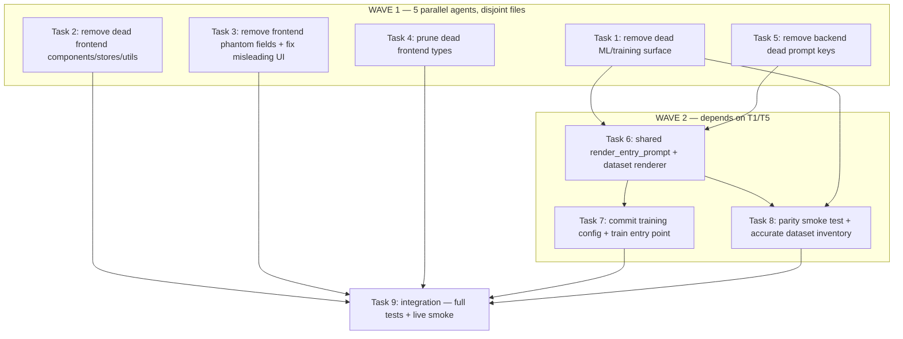

# Align Backend/Frontend to amt_dataset + Remove Dead ML/UI Surface

> **For agentic workers:** REQUIRED SUB-SKILL: Use superpowers:subagent-driven-development (recommended) or superpowers:executing-plans to implement this plan task-by-task. Steps use checkbox (`- [ ]`) syntax for tracking.

**Goal:** Align the live backend + frontend contracts to the shipped training data (`amt_dataset/nifty_amt_data`), delete the dead ML/training/UI surface, and make a retrain-from-this-repo reproducible and prompt-consistent.

**Architecture:** The live adapter (`models/vibethinker-amt-lora`) was trained on `amt_dataset/nifty_amt_data` (adapter_config.json:6), but the dataset is `key: value` ChatML with a 4-key assistant schema while the live app sends narrative prose with a 3-key JSON contract — a real distribution shift. Fix = extract a single `render_entry_prompt(fields)` shared by live inference and a dataset renderer, restrict the training target to `{direction, confidence, rationale}`, and commit the exact mlx-lm training config. Everything else on the ML/UI surface is dead and gets removed.

**Tech Stack:** Python 3.11, mlx-lm, pytest, React/TS (vite + vitest).

## Global Constraints

- Backend: `/Users/apple/Documents/v5-of-glassytrade-ai/backend`; Frontend: `/Users/apple/Documents/v5-of-glassytrade-ai/frontend`; data: `/Users/apple/Documents/v5-of-glassytrade-ai/amt_dataset`. Branch `stable_4`.
- Test: `cd backend && /Users/apple/miniconda3/envs/amt_313/bin/python -m pytest <files> -q --tb=short`; frontend: `cd frontend && npm test` (vitest run). Pre-existing env-broken suites (aiohttp/httpx/gymnasium/starlette) are `--ignore`d, never fixed.
- TDD: failing test first, RED, implement, GREEN, commit. One commit per task.
- Do NOT touch: `models/*` weights/adapter, `.env` secrets, live inference hot path (`mlx_inference_adapter.py`, `generative_ai_service.py`) beyond what a task explicitly allows.
- KEEP live strategy fields the frontend renders (POC/VA/LVN/HVN/VWAP bands/IB/leg/prior-day/absorption/swingDelta/prints, agentDecision, genAIAnalysis, riskState, portfolio).
- Deleting a frontend component requires deleting its import in the parent file (never leave a dangling import).

## Dependency Graph



**File-ownership (Wave 1 disjoint):**
- T1: `backend/scripts/*.py` (5 dead scripts), `backend/tests/unit/scripts/test_amt_dataset_generator.py`, `amt_dataset/amt_data_final/`, `amt_dataset/stats.json`
- T2: frontend `components/intelligence/`, `components/SystemStatusBar.tsx`, `components/ai/ModelIOPanel.tsx`, `components/chart/ChartExecutionMarkers.ts`, `components/chart/ProfileHistogram.ts`, `components/chart/CrosshairManager.ts`, `services/websocket/manager.ts`, `stores/streaming.ts`, `stores/portfolio.ts`, `utils/chartUtils.ts`, `utils/lruCache.ts` + their importers
- T3: frontend `hooks/useServerTradingSystem.ts`, `components/App.tsx`, `components/ChartScene.tsx`, `components/chart/DecisionCard.tsx`, `components/chart/ExecutionMarkersManager.ts`, `components/MarketSidebar.tsx`, `components/AIAnalysisPanel.tsx`, `components/intelligence/tabs/MetricsTab.tsx`, `components/intelligence/tabs/DecisionTab.tsx`
- T4: frontend `types.ts`, `types_generated.ts`, `types_rl.ts`
- T5: backend `llm_entry_handler.py` (dead keys), `prompt_builder.py` (dead `delta` read)

T2 and T3 both touch `components/AIAnalysisPanel.tsx` and `components/chart/*` — split by file: T2 owns the whole-file deletions (intelligence/, SystemStatusBar, ModelIOPanel, ChartExecutionMarkers, ProfileHistogram, CrosshairManager, stores, utils); T3 owns only the phantom-field edits in App.tsx, ChartScene.tsx, DecisionCard.tsx, ExecutionMarkersManager.ts, MarketSidebar.tsx, useServerTradingSystem.ts, and the AIAnalysisPanel.tsx phantom-field lines. If T2 deletes a component T3 imports, T2 must also remove that import line — coordinate via the explicit file lists below (T3 must NOT import any file T2 deletes).

---

### Task 1: Remove Dead ML/Training Surface

**Files:**
- Delete: `backend/scripts/amt_dataset_generator.py`, `backend/tests/unit/scripts/test_amt_dataset_generator.py`, `backend/scripts/incremental_finetune.py`, `backend/scripts/convert_to_mlx.py`, `backend/scripts/collect_training_data.py`, `backend/scripts/verify_mlx_fused_local.py`
- Delete: `amt_dataset/amt_data_final/` (whole dir, unused US-AMT set), `amt_dataset/stats.json`
- Verify: no remaining importer of any deleted module (grep whole repo)

**Interfaces:**
- Consumes: nothing
- Produces: clean `amt_dataset/` containing only `nifty_amt_data/{train,val,test}.jsonl`; clean `backend/scripts/` (trainable surface gone)

- [ ] **Step 1: Verify each file is dead**
Run: `cd /Users/apple/Documents/v5-of-glassytrade-ai && grep -rn "amt_dataset_generator\|incremental_finetune\|convert_to_mlx\|collect_training_data\|verify_mlx_fused_local" backend/ frontend/ --include="*.py" --include="*.ts" --include="*.tsx" | grep -v "scripts/"`
Expected: only hits are the scripts' own files + the unit test.

- [ ] **Step 2: Delete the files**
```bash
cd /Users/apple/Documents/v5-of-glassytrade-ai
git rm backend/scripts/amt_dataset_generator.py backend/tests/unit/scripts/test_amt_dataset_generator.py backend/scripts/incremental_finetune.py backend/scripts/convert_to_mlx.py backend/scripts/collect_training_data.py backend/scripts/verify_mlx_fused_local.py
git rm -r amt_dataset/amt_data_final
git rm amt_dataset/stats.json
```

- [ ] **Step 3: Verify imports + tests**
Run: `cd backend && /Users/apple/miniconda3/envs/amt_313/bin/python -m pytest tests/unit/ -q --tb=short --ignore=tests/unit/domain/test_valentini_rl.py --ignore=tests/unit/infrastructure/test_dhan_broker_adapter.py --ignore=tests/unit/infrastructure/test_lot_size.py` — no new failures (pre-existing aiohttp/httpx errors only).
Run: `cd backend && PYTHONPATH=..:. /Users/apple/miniconda3/envs/amt_313/bin/python -c "import app.main"` — succeeds.

- [ ] **Step 4: Commit** `chore(train): remove dead ML/training scripts, unused US-AMT dataset, stale stats.json`

---

### Task 2: Remove Dead Frontend Components/Stores/Utils

**Files:**
- Delete (whole files): `frontend/components/intelligence/` (whole dir incl. AIAnalysisPanelWithTabs.tsx, AnalysisTabs.tsx, tabs/*, index.ts), `frontend/components/SystemStatusBar.tsx`, `frontend/components/ai/ModelIOPanel.tsx`, `frontend/components/chart/ChartExecutionMarkers.ts`, `frontend/components/chart/ProfileHistogram.ts`, `frontend/components/chart/CrosshairManager.ts`, `frontend/services/websocket/manager.ts`, `frontend/stores/streaming.ts`, `frontend/stores/portfolio.ts`, `frontend/utils/chartUtils.ts`, `frontend/utils/lruCache.ts`
- Modify (remove imports): `frontend/components/App.tsx`, `frontend/components/AIAnalysisPanel.tsx` (line 4 `ModelIOPanel` import), `frontend/components/ChartScene.tsx` (dead imports ~42-55), any test importing a deleted file (`frontend/tests/**`)

**Interfaces:**
- Consumes: nothing
- Produces: no dangling imports; `npm run build` + `npm test` green

- [ ] **Step 1: Verify each file is dead**
Run: `cd frontend && for f in components/intelligence components/SystemStatusBar.tsx components/ai/ModelIOPanel.tsx components/chart/ChartExecutionMarkers.ts components/chart/ProfileHistogram.ts components/chart/CrosshairManager.ts services/websocket/manager.ts stores/streaming.ts stores/portfolio.ts utils/chartUtils.ts utils/lruCache.ts; do echo "== $f =="; grep -rn "$f\|$(basename $f .ts)" --include="*.ts*" components/ hooks/ stores/ services/ App.tsx index.tsx 2>/dev/null | grep -v "$f" | head -3; done`
Expected: each shows only its own self-import (if any) or nothing.

- [ ] **Step 2: Delete the files** (use `git rm`), then remove every dangling import found in Step 1 from the parent files.

- [ ] **Step 3: Delete orphaned tests** for deleted components (e.g. `tests/components/chart/ProfileHistogram.test.ts`, `tests/components/chart/CrosshairManager.test.ts`, `tests/components/intelligence/**`) — verify each is for a deleted module before removing.

- [ ] **Step 4: Verify**
Run: `cd frontend && export PATH="/opt/homebrew/bin:$PATH" && npm run build` — passes.
Run: `cd frontend && npm test` — passes (note: vitest; `--runInBand` is jest-only, don't use it).

- [ ] **Step 5: Commit** `chore(ui): remove dead components, stores, utils (intelligence tabs, SystemStatusBar, ModelIOPanel, ChartExecutionMarkers, websocket/streaming/portfolio stores, chartUtils, lruCache)`

---

### Task 3: Remove Frontend Phantom Fields + Fix Misleading UI

**Files:**
- Modify: `frontend/hooks/useServerTradingSystem.ts`
- Modify: `frontend/components/App.tsx`
- Modify: `frontend/components/ChartScene.tsx`
- Modify: `frontend/components/chart/DecisionCard.tsx`
- Modify: `frontend/components/chart/ExecutionMarkersManager.ts`
- Modify: `frontend/components/MarketSidebar.tsx`
- Modify: `frontend/components/AIAnalysisPanel.tsx`
- Modify: `frontend/components/intelligence/tabs/MetricsTab.tsx` and `DecisionTab.tsx` — only if T2 did NOT delete the intelligence dir; if T2 deleted it, skip these two
- Test: update `frontend/tests/**` that asserted phantom fields

**Interfaces:**
- Consumes: backend contract (verified): snapshot = `_symbol, portfolio, amt, genAIAnalysis, overseerAction, overseerReason, agentDecision, riskState, tick, ltp, oi, depth`; agentDecision = `direction, probability, regime, timing, sizeFraction, latencyUs, rationale`; genAIAnalysis = `direction, rationale, confidence, inputPrompt, rawOutput, marketState, aggression`; amt has NO `tradeDecision/direction/pLong/pShort/agentRegime/agentTiming/agentKelly/agentRationale/tickSize/optionType/underlyingPrice/amtTimeWindow/rejectionFromVah/rejectionFromVal`.
- Produces: no component reads a backend-never-sent field; real decision shown from `agentDecision`

- [ ] **Step 1: Write the failing tests** (assert phantom reads are gone)
```ts
// frontend/tests/hooks/useServerTradingSystem.test.tsx (extend)
it('does not read tradeDecision/depth20Active/feed/execution/readiness phantom fields', () => {
  // after fix: runtimeSafetyFromState no longer derives unsafeToTrade from phantom feed
  expect(feedStale).toBe(false);  // or the unsafe badge no longer appears by default
});
```

- [ ] **Step 2: Run, verify FAIL** (phantom reads present).

- [ ] **Step 3: Implement**
- `useServerTradingSystem.ts`: remove `state.amt?.tradeDecision` reasoning path (:612,617); remove `depth20Active`, `feed`, `execution`, `readiness`/`runtimeSafetyFromState` phantom derivation (:57-94, :564-566, :605-607) — keep the `unsafeToTrade` flag defaulting to `false` (no red badge by default); remove the `_type === 'stale'` handler (:523-530) if the backend never sends it; remove init defaults for modelWeights/generation/predictions/stats (:12-18, 35-36, 43, 46).
- `ChartScene.tsx`: remove prediction series (:199-206, 930-934) + `showPredictions`; remove dead `aiAnalysis` prop usage; remove dead imports (:42-55); rewire DecisionCard to `agentDecision.direction/probability` (real) instead of `amt.pLong/pShort/agentRegime/agentTiming/agentKelly/agentRationale` (:1054-1069).
- `DecisionCard.tsx`: change props to `direction`, `probability`, `regime`, `timing` (from agentDecision); drop kelly/pLong/pShort.
- `ExecutionMarkersManager.ts`: replace phantom `(amt as any).rejectionFromVah/Val` (:201,225) with `amt.rejectionAtHigh/rejectionAtLow`.
- `MarketSidebar.tsx`: remove `runtimeSafety.unsafeToTrade` red-badge logic (:62,67-69,128-131) — no unsafe badge by default.
- `AIAnalysisPanel.tsx`: remove `optionType` (:1381), `tickSize` (:1642), `amtTimeWindow` (:1756) reads; remove the Underlying Index panel gated on phantom `underlyingPrice` (:190-197); remove Depth-20 badge (:682-683); remove `underlyingPrice` prop (:19,23).
- `MetricsTab.tsx`/`DecisionTab.tsx` (if not deleted by T2): remove `optionType`/`amtTimeWindow` phantom reads.

- [ ] **Step 4: Verify**
Run: `cd frontend && export PATH="/opt/homebrew/bin:$PATH" && npm run build && npm test` — passes.
Run: `cd frontend && grep -rn "tradeDecision\|depth20Active\|agentRegime\|agentTiming\|agentKelly\|agentRationale\|rejectionFromVah\|rejectionFromVal\|amtTimeWindow\|pLong\|pShort\|underlyingPrice" components/ hooks/ stores/ App.tsx types.ts` — no hits (except types.ts members T4 will prune).

- [ ] **Step 5: Commit** `fix(ui): remove phantom field reads; wire DecisionCard to real agentDecision; drop default unsafe badge`

---

### Task 4: Prune Dead Frontend Types

**Files:**
- Modify: `frontend/types.ts`
- Delete: `frontend/types_generated.ts`, `frontend/types_rl.ts` (whole files — verified never imported)
- Test: `frontend/tests/**` that imported the deleted type files

**Interfaces:**
- Consumes: the trimmed component surface (Tasks 2-3) — no remaining references to the pruned types
- Produces: `types.ts` contains only types actually used

- [ ] **Step 1: Write the failing check** — a test or build assertion that `types.ts` has no phantom members:
```ts
// frontend/tests/types.test.ts (create)
import { AMTAnalysis } from '../types';
it('AMTAnalysis has no backend-never-sent members', () => {
  for (const k of ['direction','pLong','pShort','agentRegime','agentTiming','agentKelly','agentRationale','tickSize','sessionId','computedAt','amtTimeWindow','amtStructureLabel','kellyBreakdown','cvdDivPlaybook','optionType','underlyingPrice']) {
    expect(k in AMTAnalysis).toBe(false);
  }
});
```

- [ ] **Step 2: Run, verify FAIL** (phantom members present).

- [ ] **Step 3: Implement**
- Prune from `types.ts`: `ModelWeights` (19-25), `FactorBreakdown` (27), `AIAnalysis` (29-38), `RuntimeSafetyState` (69-77), the AMTAnalysis phantom block (261-306 minus `llmThinking`), `TradeSignal` (309-319), `StrategyStats` (321-330), `InstrumentState.{modelWeights,generation,stats,predictions,aiAnalysis}` (138-149), `TradePosition.{metadata, cushionState, atrTrailActive, peakProfit, mae, mfe, partialTaken, runnerActive, breakEvenSet, tickCount}` (105-119), `ChartConfig.showPredictions`.
- Keep: `ChartMode='STANDARD'`, `OHLCData` (vwap/takerBuyVolume/delta — consumed), all live AMT/portfolio/agentDecision/genAIAnalysis/riskState types.
- Delete `types_generated.ts`, `types_rl.ts`; remove their importers (grep first — expected none in app code).

- [ ] **Step 4: Verify**
Run: `cd frontend && grep -rn "ModelWeights\|StrategyStats\|TradeSignal\|RuntimeSafetyState\|types_generated\|types_rl" components/ hooks/ stores/ App.tsx` — no hits.
Run: `cd frontend && export PATH="/opt/homebrew/bin:$PATH" && npm run build && npm test` — passes.

- [ ] **Step 5: Commit** `chore(ui): prune dead types; delete orphaned types_generated.ts and types_rl.ts`

---

### Task 5: Remove Backend Dead Prompt Keys

**Files:**
- Modify: `backend/app/application/handlers/llm_entry_handler.py` (remove `gate_context` insertion :291, `session_context_for_llm`, `strategy_hint` param :244 if unused in body)
- Modify: `backend/app/domain/fabio_ai/services/prompt_builder.py` (remove dead `delta` read at `_build_narrative_order_flow` :205)
- Test: `backend/tests/unit/application/test_llm_input_contract.py` (extend)

**Interfaces:**
- Consumes: verified — `gate_context`/`session_context_for_llm`/`strategy_hint` are inserted into `market_data_ai` but read by NO prompt block (0 grep hits in prompt_builder/generative_ai_service/llm_contract); `delta` read at prompt_builder:205 never emitted.
- Produces: `market_data_ai` contains only keys a prompt block or parser consumes

- [ ] **Step 1: Write the failing test**
```python
# tests/unit/application/test_llm_input_contract.py (extend)
def test_market_data_ai_has_no_dead_keys():
    md = build_market_data_ai(...)
    for dead in ("gate_context", "session_context_for_llm", "strategy_hint"):
        assert dead not in md
```
(Read `_build_market_data_ai` first for the real name/args.)

- [ ] **Step 2: Run, verify FAIL**

- [ ] **Step 3: Implement** — remove the dead insertions from `llm_entry_handler.py`; remove the `delta` read in `prompt_builder.py` `_build_narrative_order_flow`.

- [ ] **Step 4: Run, verify PASS** + `cd backend && /Users/apple/miniconda3/envs/amt_313/bin/python -m pytest tests/unit/application/test_llm_input_contract.py tests/unit/domain/test_prompt_builder.py -q --tb=short`.

- [ ] **Step 5: Commit** `chore(llm): remove dead market_data_ai keys (gate_context, strategy_hint) and unused delta read`

---

### Task 6: Shared `render_entry_prompt` + Dataset Renderer

**Files:**
- Modify: `backend/app/domain/fabio_ai/services/prompt_builder.py` — extract the entry-prompt narrative into a reusable `render_entry_prompt(fields: dict) -> str` used by `build_entry_prompt`
- Create: `backend/scripts/dataset_render.py` — converts `amt_dataset/nifty_amt_data/train.jsonl` user `key: value` rows into the exact live `render_entry_prompt` output, and rewrites the assistant to `{direction, confidence, rationale}` (dropping `setup`), writing `amt_dataset/nifty_amt_data_livefmt/{train,val,test}.jsonl`
- Test: `backend/tests/unit/domain/test_prompt_builder.py` (extend), `backend/tests/unit/scripts/test_dataset_render.py` (create)

**Interfaces:**
- Consumes: `render_entry_prompt(fields)` from Task 6's refactor; the live `market_data_ai` key vocabulary from `llm_entry_handler.py`
- Produces: `render_entry_prompt(fields)` (pure, tested); `nifty_amt_data_livefmt/` ChatML dataset where user content matches live prose and assistant = `{direction, confidence, rationale}`

- [ ] **Step 1: Write the failing test**
```python
# tests/unit/scripts/test_dataset_render.py
def test_render_matches_live_prompt_shape():
    row = json.loads(open("amt_dataset/nifty_amt_data/train.jsonl").readline())
    fields = key_value_to_fields(row["messages"][1]["content"])
    rendered = render_entry_prompt(fields)
    assert "SESSION:" in rendered          # live header
    assert "POC" in rendered.upper()
    assert "state" not in rendered.lower() or "MARKET STATE" in rendered.upper()
    assert '"direction"' in row["messages"][2]["content"]
```

- [ ] **Step 2: Run, verify FAIL** (no renderer exists).

- [ ] **Step 3: Implement**
- In `prompt_builder.py`: extract `build_entry_prompt`'s narrative body into `render_entry_prompt(fields) -> str` (headers + blocks). `build_entry_prompt(data)` calls it with the same fields. Keep the CALL/PUT option-mapping block and the JSON schema instruction appended in `build_entry_prompt` only (the dataset has no option context — note this in a `ponytail:` comment: the dataset system prompt already says "Output JSON only").
- Create `backend/scripts/dataset_render.py`: for each row, parse the user `key: value` content into a `fields` dict mapped to `render_entry_prompt`'s vocabulary (state→market_state, poc above/below→categorical tag, ib_range→tight/wide, rejection→bool, etc.); produce the assistant as `{"direction","confidence","rationale"}` from the original (mapping `setup` away or dropping it); write `nifty_amt_data_livefmt/{train,val,test}.jsonl`.

- [ ] **Step 4: Run, verify PASS** + `cd backend && /Users/apple/miniconda3/envs/amt_313/bin/python -m pytest tests/unit/domain/test_prompt_builder.py tests/unit/scripts/test_dataset_render.py -q --tb=short`.

- [ ] **Step 5: Commit** `feat(train): shared render_entry_prompt; dataset renderer to live prompt format`

---

### Task 7: Commit Training Config + Entry Point

**Files:**
- Create: `backend/scripts/mlx_lora_retrain.yaml`
- Create: `backend/scripts/train_mlx.sh`
- Modify: `README` or `docs/` training note (one short section)
- Test: `backend/tests/unit/scripts/test_train_config.py` (create — validates the YAML mirrors adapter_config.json)

**Interfaces:**
- Consumes: `adapter_config.json` hyperparameters (exact values below), `amt_dataset/nifty_amt_data` (or the live-format output of Task 6)
- Produces: a runnable `python -m mlx_lm.lora --config backend/scripts/mlx_lora_retrain.yaml` that reproduces the shipped adapter

- [ ] **Step 1: Write the failing test**
```python
# tests/unit/scripts/test_train_config.py
import yaml
def test_train_config_matches_shipped_adapter():
    cfg = yaml.safe_load(open("scripts/mlx_lora_retrain.yaml"))
    assert cfg["model"] == "models/vibethinker-3b"
    assert cfg["data"] == "amt_dataset/nifty_amt_data"  # or nifty_amt_data_livefmt
    assert cfg["iters"] == 300
    assert cfg["learning_rate"] == 2e-05
    assert cfg["num_layers"] == 16
    assert cfg["lora_parameters"]["rank"] == 8
    assert cfg["lora_parameters"]["scale"] == 20.0
    assert cfg["mask_prompt"] is True
```

- [ ] **Step 2: Run, verify FAIL** (no YAML).

- [ ] **Step 3: Implement**
- Create `mlx_lora_retrain.yaml` mirroring `models/vibethinker-amt-lora/adapter_config.json`: `model: models/vibethinker-3b`, `data: amt_dataset/nifty_amt_data` (or `amt_dataset/nifty_amt_data_livefmt` if Task 6 produced it), `iters: 300`, `learning_rate: 2e-05`, `num_layers: 16`, `lora_parameters: {rank: 8, dropout: 0.0, scale: 20.0}`, `batch_size: 1`, `grad_accumulation_steps: 1`, `grad_checkpoint: true`, `mask_prompt: true`, `max_seq_length: 2048`, `save_every: 100`, `steps_per_eval: 100`, `val_batches: 25`, `optimizer: adam`.
- Create `train_mlx.sh`: `python -m mlx_lm.lora --config backend/scripts/mlx_lora_retrain.yaml` then copies the output adapter into `models/vibethinker-amt-lora-v2/` (versioned) and echoes `Update MLX_ADAPTER_PATH in .env to models/vibethinker-amt-lora-v2`.

- [ ] **Step 4: Run, verify PASS** + `python -m yaml` parse check.

- [ ] **Step 5: Commit** `feat(train): commit reproducible mlx-lm retrain config and entry script`

---

### Task 8: Parity Smoke Test + Accurate Dataset Inventory

**Files:**
- Create: `backend/tests/unit/scripts/test_dataset_live_parity.py`
- Create: `amt_dataset/README.md` (accurate inventory; delete `stats.json` if T1 removed it or regenerate it accurately)
- Test: the parity test itself

**Interfaces:**
- Consumes: `render_entry_prompt` (Task 6), `amt_dataset/nifty_amt_data/*.jsonl`
- Produces: a guard that any future dataset row renders to live-vocabulary-only prose; an accurate dataset README

- [ ] **Step 1: Write the failing test**
```python
# tests/unit/scripts/test_dataset_live_parity.py
def test_dataset_rows_render_with_live_vocab():
    from scripts.dataset_render import key_value_to_fields
    from app.domain.fabio_ai.services.prompt_builder import render_entry_prompt
    for line in open("amt_dataset/nifty_amt_data/train.jsonl").read().splitlines()[:20]:
        row = json.loads(line)
        fields = key_value_to_fields(row["messages"][1]["content"])
        rendered = render_entry_prompt(fields)
        # every numeric value in the original row appears in rendered
        for token in fields.values():
            if isinstance(token, (int, float)):
                assert str(token) in rendered or "SKIPPED" in rendered
```

- [ ] **Step 2: Run, verify FAIL** (renderer or mapping missing).

- [ ] **Step 3: Implement**
- Fix any mapping gaps the test exposes (e.g. numeric price fields the renderer must emit).
- Create `amt_dataset/README.md`: states `nifty_amt_data` = the shipped adapter's training data (920 train / 115 val / 115 test), `nifty_amt_data_livefmt` = regenerated live-format (if produced), and documents the removed `amt_data_final`/`stats.json`.

- [ ] **Step 4: Run, verify PASS** + full `tests/unit/scripts/`.

- [ ] **Step 5: Commit** `feat(train): dataset↔live-prompt parity test + accurate dataset README`

---

### Task 9: Integration — Full Tests + Live Smoke

**Files:**
- Verify: `backend/tests`, `frontend tests`, live backend + frontend

- [ ] **Step 1: Full backend test run**
Run: `cd backend && /Users/apple/miniconda3/envs/amt_313/bin/python -m pytest tests/unit tests/integration -q --tb=short` with the pre-existing env-broken suites `--ignore`d. Expected: all touched-area suites green, no new failures.

- [ ] **Step 2: Full frontend run**
Run: `cd frontend && export PATH="/opt/homebrew/bin:$PATH" && npm run build && npm test`. Expected: build passes, all tests pass.

- [ ] **Step 3: Restart backend + frontend, smoke**
Restart backend (`:9090`, paper nse) + frontend (`:5190`). Verify: model loads, scanner picks contracts, engine streams, LLM fires, 0 tick errors; frontend renders candles + AMT overlays + real `agentDecision` (not FLAT-always), no UNSAFE badges by default.

- [ ] **Step 4: Commit** (only if residual deltas) + write `docs/ALIGNMENT_CLEANUP_RESULTS.md`.

---

## Self-Review

- **Spec coverage:** dead ML surface → T1; dead frontend components/stores/utils → T2; phantom fields + misleading UI → T3; dead types → T4; backend dead prompt keys → T5; dataset↔live alignment → T6; reproducible retrain → T7; parity guard + inventory → T8; integration → T9. Verified: adapter data = `nifty_amt_data` (adapter_config.json:6), live prompt = narrative prose (prompt_builder.py:283-331) vs dataset `key: value` — T6 bridges; assistant schema 4-7 keys vs live 3-key contract — T6 restricts target; 5 dead scripts + amt_data_final + stats.json — T1 removes.
- **Placeholders:** test files carry concrete assertions; implementers read the real APIs first (file:line anchors given).
- **Type consistency:** `render_entry_prompt(fields)` is the single name used by T6 (creator) and T8 (consumer); `nifty_amt_data_livefmt` consistent between T6 producer and T7/T8 consumers; `agentDecision.direction/probability` (T3) matches the backend's trimmed agentDecision (state_snapshot_builder.py:57-69).
- **Known accepted risks:** `_DEFAULT_INSTRUCTION` (DECISION HIERARCHY + AMT RULES) stays as-is — aligning the training system prompt to it is a follow-up beyond this plan's scope; `nifty_amt_data` direction skew (65% FLAT) is noted but not rebalanced (data is ground truth).
