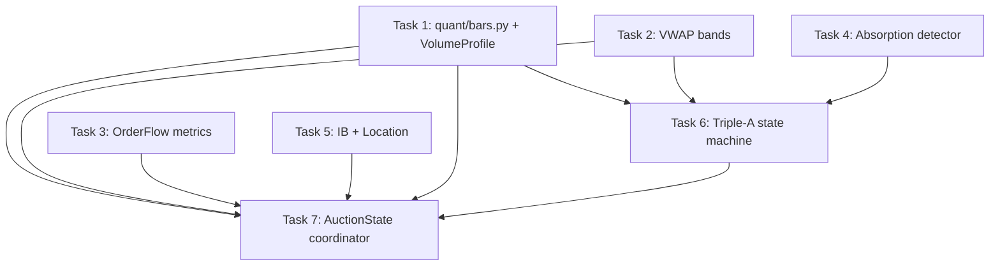

# AMT Analysis Kernel — Greenfield Implementation Plan

> **For agentic workers:** REQUIRED SUB-SKILL: Use superpowers:subagent-driven-development (recommended) or superpowers:executing-plans to implement this plan task-by-task. Steps use checkbox (`- [ ]`) syntax for tracking.

**Goal:** Build the pure, per-bar Analysis Layer from `docs/AMT_ARCHITECTURE_PROPOSAL.md` — the `AuctionState` kernel with the six detectors (VP, VWAP, order flow, absorption, IB/location, Triple-A) as a clean greenfield module, fully unit-tested and deterministic.

**Architecture:** A new `quant/` package sits beside the existing app — it does NOT import any existing app code (greenfield). Each detector is a stateful pure function `update(bar) -> partial state`; a coordinator folds them into one immutable `AuctionState` snapshot per closed bar. Pure = same input bars → identical output every run (replayable, golden-file testable).

**Tech Stack:** Python 3.11, dataclasses, pytest. No new dependencies.

## Global Constraints

- New package at `/Users/apple/Documents/v5-of-glassytrade-ai/quant/`, tests at `/Users/apple/Documents/v5-of-glassytrade-ai/tests/quant/`. Branch `stable_4`.
- `quant/` must have ZERO imports from `backend/` or `app/` — greenfield, self-contained.
- Test command: `cd /Users/apple/Documents/v5-of-glassytrade-ai && /Users/apple/miniconda3/envs/amt_313/bin/python -m pytest tests/quant -q --tb=short`.
- TDD: failing test first, RED, implement, GREEN, commit. One commit per task.
- Do NOT touch `backend/`, `frontend/`, or `models/`.
- Bar type: use the existing `app.domain.trading.models.value_objects.OHLC` is FORBIDDEN (no app imports). Define `quant/bars.py` with an `OHLC`-equivalent dataclass (`Bar`) carrying `time, open, high, low, close, volume, buy_volume, sell_volume, delta`.
- `AuctionState` is immutable (frozen dataclass).
- No fabricated data. No config beyond module constants. No new dependencies.

## Dependency Graph



**File-ownership (Wave 1 parallel, disjoint):**
- T1: `quant/bars.py`, `quant/volume_profile.py`, `tests/quant/test_bars.py`, `tests/quant/test_volume_profile.py`
- T2: `quant/vwap.py`, `tests/quant/test_vwap.py`
- T3: `quant/order_flow.py`, `tests/quant/test_order_flow.py`
- T4: `quant/absorption.py`, `tests/quant/test_absorption.py`
- T5: `quant/location.py`, `tests/quant/test_location.py`
- T6: `quant/triple_a.py`, `tests/quant/test_triple_a.py` (consumes T1's VP + T2's VWAP + T4's Absorption interfaces)
- T7 (Wave 2): `quant/auction_state.py`, `quant/coordinator.py`, `tests/quant/test_auction_state.py` — consumes all six.

**Wave 1 = T1..T6 parallel** (disjoint files, T6 only needs T1/T2/T4 *interfaces*, which are pinned in its brief). **Wave 2 = T7** (coordinator), then **T8** (golden-file determinism test, Wave 3). Because T6 depends on the VP/VWAP/Absorption interfaces, T1/T2/T4 must land their public API exactly as their briefs specify — the coordinator (T7) pins the exact field names below.

---

### Task 1: Bars + Volume Profile

**Files:**
- Create: `quant/bars.py`
- Create: `quant/volume_profile.py`
- Create: `quant/__init__.py`
- Create: `tests/quant/test_bars.py`
- Create: `tests/quant/test_volume_profile.py`

**Interfaces:**
- Consumes: nothing (greenfield)
- Produces:
  - `quant/bars.py`:
    ```python
    @dataclass(frozen=True)
    class Bar:
        time: str
        open: float
        high: float
        low: float
        close: float
        volume: float
        buy_volume: float = 0.0
        sell_volume: float = 0.0
        delta: float = 0.0
    ```
  - `quant/volume_profile.py`:
    ```python
    @dataclass(frozen=True)
    class VolumeProfileLevel:
        price: float
        volume: float
        buy_volume: float = 0.0
        sell_volume: float = 0.0

    @dataclass(frozen=True)
    class VolumeProfile:
        levels: tuple[VolumeProfileLevel, ...]
        poc: float
        vah: float
        val: float
        step: float
        total_volume: float

    class VolumeProfileBuilder:
        def __init__(self, buckets: int = 0, tick_size: float = 0.0) -> None: ...
        def update(self, bar: Bar) -> None: ...
        def snapshot(self) -> VolumeProfile: ...
    ```

- [ ] **Step 1: Write failing tests**

```python
# tests/quant/test_bars.py
from quant.bars import Bar

def test_bar_defaults():
    b = Bar(time="t", open=1, high=2, low=0.5, close=1.5, volume=100)
    assert b.buy_volume == 0.0 and b.sell_volume == 0.0 and b.delta == 0.0
    assert b.high > b.low
```

```python
# tests/quant/test_volume_profile.py
import pytest
from quant.bars import Bar
from quant.volume_profile import VolumeProfileBuilder

def _bars():
    # 10 bars spanning 100..109, equal volume 100 each, close=mid
    return [Bar(time=f"t{i}", open=100+i, high=100+i+0.5, low=100+i-0.5,
                close=100+i, volume=100) for i in range(10)]

def test_volume_is_preserved():
    vb = VolumeProfileBuilder()
    for b in _bars():
        vb.update(b)
    vp = vb.snapshot()
    assert vp.total_volume == pytest.approx(1000)

def test_poc_is_max_volume_bucket():
    bars = _bars()
    bars[5] = Bar(time="t5", open=105, high=105.5, low=104.5, close=105, volume=1000)
    vb = VolumeProfileBuilder()
    for b in bars:
        vb.update(b)
    vp = vb.snapshot()
    assert vp.poc == pytest.approx(105.0)

def test_value_area_captures_70_percent():
    vb = VolumeProfileBuilder()
    for b in _bars():
        vb.update(b)
    vp = vb.snapshot()
    va_vol = sum(l.volume for l in vp.levels
                 if vp.val <= l.price <= vp.vah)
    assert va_vol >= 0.68 * vp.total_volume
    assert vp.vah > vp.val
```

- [ ] **Step 2: Run, verify FAIL** (`ModuleNotFoundError`).

- [ ] **Step 3: Implement** — `quant/bars.py`, `quant/volume_profile.py`. Distribution: uniform across `[low, high]` (the non-concentrated path); auto bucket count `max(100, min(int(price_range / tick_size), 1000))` with tick_size auto-detected from min close diff (default 0.05); POC = max-volume bucket with VWAP-free tie-break (lowest index); VA = **average-weighted CME two-row pairs** at 70% (port the corrected algorithm exactly: compare `pair_avg = pair_sum / pair_count`, expand up/down 1-2 rows).

- [ ] **Step 4: Run, verify PASS** — all green.

- [ ] **Step 5: Commit** `feat(quant): bars + average-weighted volume profile (POC/VAH/VAL)`

---

### Task 2: VWAP Bands

**Files:**
- Create: `quant/vwap.py`
- Create: `tests/quant/test_vwap.py`

**Interfaces:**
- Consumes: `quant.bars.Bar` (Task 1)
- Produces:
  ```python
  @dataclass(frozen=True)
  class VWAPState:
      value: float
      upper_1: float
      lower_1: float
      upper_2: float
      lower_2: float
      std: float
      deviation_sigmas: float  # of the latest close vs vwap

  class VWAPBuilder:
      def update(self, bar: Bar) -> None: ...
      def snapshot(self) -> VWAPState: ...
  ```

- [ ] **Step 1: Write failing tests**

```python
# tests/quant/test_vwap.py
from quant.bars import Bar
from quant.vwap import VWAPBuilder

def test_vwap_is_volume_weighted():
    vb = VWAPBuilder()
    # big volume at 100, tiny volume at 200 -> vwap close to 100
    vb.update(Bar(time="t1", open=100, high=100, low=100, close=100, volume=1000))
    vb.update(Bar(time="t2", open=200, high=200, low=200, close=200, volume=1))
    v = vb.snapshot()
    assert 100 <= v.value <= 101

def test_std_is_volume_weighted_not_simple():
    vb = VWAPBuilder()
    vb.update(Bar(time="t1", open=100, high=100, low=100, close=100, volume=1000))
    vb.update(Bar(time="t2", open=200, high=200, low=200, close=200, volume=1))
    v = vb.snapshot()
    # simple std of [100,200] would be 50; volume-weighted must be far smaller
    assert v.std < 10

def test_bands_monotonic():
    vb = VWAPBuilder()
    for i in range(20):
        vb.update(Bar(time=f"t{i}", open=100+i, high=100+i+1, low=100+i-1,
                      close=100+i, volume=100))
    v = vb.snapshot()
    assert v.lower_2 < v.lower_1 < v.value < v.upper_1 < v.upper_2
```

- [ ] **Step 2: Run, verify FAIL**

- [ ] **Step 3: Implement** — `quant/vwap.py`: numerically-stable shifted-variance accumulator (`cum_sq_vol += vol * (p - vwap_prev) * (p - vwap_new)`); `std = sqrt(cum_sq_vol / cum_vol)`; bands `value ± k*std`; `deviation_sigmas = (last_close - value) / max(std, 1e-9)`.

- [ ] **Step 4: Run, verify PASS**

- [ ] **Step 5: Commit** `feat(quant): volume-weighted VWAP with ±1σ/±2σ bands`

---

### Task 3: Order Flow Metrics

**Files:**
- Create: `quant/order_flow.py`
- Create: `tests/quant/test_order_flow.py`

**Interfaces:**
- Consumes: `quant.bars.Bar` (Task 1)
- Produces:
  ```python
  @dataclass(frozen=True)
  class OrderFlowState:
      delta: float          # latest bar delta (buy - sell)
      cvd: float            # cumulative delta
      cvd_slope: float      # linear slope of last N deltas (N=20)
      cvd_divergence: str   # "BULLISH" | "BEARISH" | "NONE"
      aggressive_prints: tuple[tuple[float, float, str], ...]  # (price, volume, "BUY"/"SELL")

  class OrderFlowBuilder:
      def __init__(self, window: int = 20) -> None: ...
      def update(self, bar: Bar) -> None: ...
      def snapshot(self) -> OrderFlowState: ...
  ```

- [ ] **Step 1: Write failing tests**

```python
# tests/quant/test_order_flow.py
from quant.bars import Bar
from quant.order_flow import OrderFlowBuilder

def _bar(i, delta, vol=100):
    bv = max(0, (vol + delta) / 2)
    sv = vol - bv
    return Bar(time=f"t{i}", open=100, high=101, low=99, close=100,
               volume=vol, buy_volume=bv, sell_volume=sv, delta=delta)

def test_cvd_is_cumulative():
    of = OrderFlowBuilder()
    of.update(_bar(0, 10)); of.update(_bar(1, -4)); of.update(_bar(2, 7))
    assert of.snapshot().cvd == pytest.approx(13)

def test_delta_matches_bar():
    of = OrderFlowBuilder()
    of.update(_bar(0, 25))
    assert of.snapshot().delta == pytest.approx(25)

def test_slope_positive_for_rising_deltas():
    of = OrderFlowBuilder()
    for i, d in enumerate([1, 2, 3, 4, 5, 6]):
        of.update(_bar(i, d))
    assert of.snapshot().cvd_slope > 0

def test_bullish_divergence_when_cvd_up_price_down():
    of = OrderFlowBuilder()
    # cvd rising while closes fall -> bullish divergence
    for i in range(20):
        of.update(Bar(time=f"t{i}", open=100-i, high=101-i, low=99-i, close=100-i,
                      volume=100, buy_volume=60, sell_volume=40, delta=20))
    assert of.snapshot().cvd_divergence == "BULLISH"
```

- [ ] **Step 2: Run, verify FAIL**

- [ ] **Step 3: Implement** — `quant/order_flow.py`: cvd cumulative; slope via simple linear regression over last `window` deltas; divergence: compare sign of recent cvd slope vs recent close slope (opposite signs → BULLISH/BEARISH); aggressive_prints = last bar's buy/sell when either side ≥ 2× the other.

- [ ] **Step 4: Run, verify PASS**

- [ ] **Step 5: Commit** `feat(quant): order-flow metrics (delta, CVD, slope, divergence, prints)`

---

### Task 4: Absorption Detector

**Files:**
- Create: `quant/absorption.py`
- Create: `tests/quant/test_absorption.py`

**Interfaces:**
- Consumes: `quant.bars.Bar` (Task 1)
- Produces:
  ```python
  @dataclass(frozen=True)
  class Absorption:
      bar_index: int
      price: float
      volume: float
      side: str            # "BUY" | "SELL"
      strength: float      # 0..1
      bar_age: int         # bars since this absorption (0 = current)

  class AbsorptionDetector:
      def __init__(self, volume_mult: float = 1.5, range_ratio: float = 0.5) -> None: ...
      def update(self, bar: Bar) -> None: ...
      def snapshot(self) -> Absorption | None: ...
  ```

- [ ] **Step 1: Write failing tests**

```python
# tests/quant/test_absorption.py
from quant.bars import Bar
from quant.absorption import AbsorptionDetector

def _low_volume_bars(n=25):
    return [Bar(time=f"t{i}", open=100, high=101, low=99, close=100, volume=100)
            for i in range(n)]

def test_detects_buy_absorption():
    det = AbsorptionDetector()
    for b in _low_volume_bars():
        det.update(b)
    det.update(Bar(time="t25", open=100, high=100.2, low=99.8, close=100,
                   volume=500, buy_volume=450, sell_volume=50))  # vol 5x, tight range
    a = det.snapshot()
    assert a is not None and a.side == "BUY"

def test_wide_range_is_not_absorption():
    det = AbsorptionDetector()
    for b in _low_volume_bars():
        det.update(b)
    det.update(Bar(time="t25", open=100, high=110, low=90, close=100, volume=500))  # wide range
    assert det.snapshot() is None

def test_strength_bounded_and_age_tracks():
    det = AbsorptionDetector()
    for b in _low_volume_bars():
        det.update(b)
    det.update(Bar(time="t25", open=100, high=100.2, low=99.8, close=100, volume=800))
    a = det.snapshot()
    assert 0 <= a.strength <= 1
    det.update(Bar(time="t26", open=100, high=101, low=99, close=100, volume=100))
    assert det.snapshot().bar_age == 1
```

- [ ] **Step 2: Run, verify FAIL**

- [ ] **Step 3: Implement** — `quant/absorption.py`: rolling 20-bar avg volume; absorption when `bar.volume > volume_mult * avg` AND `(high-low) <= range_ratio * avg_range`; side from buy_volume ≥ 0.55×volume → BUY; strength = normalized volume excess `min(1, (vol/avg - 1) / 3)`; `bar_age` increments per bar since detection, resets on new detection.

- [ ] **Step 4: Run, verify PASS**

- [ ] **Step 5: Commit** `feat(quant): absorption detector (volume + range compression)`

---

### Task 5: Initial Balance + Location

**Files:**
- Create: `quant/location.py`
- Create: `tests/quant/test_location.py`

**Interfaces:**
- Consumes: `quant.bars.Bar` (Task 1), `quant.volume_profile.VolumeProfile` (Task 1)
- Produces:
  ```python
  @dataclass(frozen=True)
  class LocationState:
      ib_high: float
      ib_low: float
      ib_complete: bool
      zone: str           # "ABOVE_VA" | "BELOW_VA" | "INSIDE_VA"
      nearest_level: float   # nearest of {vah, val, poc} to last close
      distance_to_level: float

  class LocationBuilder:
      def __init__(self, ib_bars: int = 6) -> None: ...
      def update(self, bar: Bar) -> None: ...
      def snapshot(self, vp: VolumeProfile, last_close: float) -> LocationState: ...
  ```

- [ ] **Step 1: Write failing tests**

```python
# tests/quant/test_location.py
from quant.bars import Bar
from quant.location import LocationBuilder

def _bars():
    return [Bar(time=f"t{i}", open=100, high=105, low=95, close=100, volume=100)
            for i in range(8)]

def test_ib_from_first_n_bars():
    lb = LocationBuilder(ib_bars=2)
    for b in _bars():
        lb.update(b)
    # first 2 bars high=105 low=95
    st = lb.snapshot(None, 100)
    assert st.ib_high == 105 and st.ib_low == 95 and st.ib_complete is True

def test_zone_relative_to_va():
    from quant.volume_profile import VolumeProfile
    from quant.volume_profile import VolumeProfileLevel
    vp = VolumeProfile(
        levels=(VolumeProfileLevel(price=100, volume=100),
                VolumeProfileLevel(price=101, volume=100),
                VolumeProfileLevel(price=102, volume=100)),
        poc=101, vah=102, val=100, step=1, total_volume=300)
    lb = LocationBuilder()
    for b in _bars():
        lb.update(b)
    assert lb.snapshot(vp, 103.0).zone == "ABOVE_VA"
    assert lb.snapshot(vp, 99.0).zone == "BELOW_VA"
    assert lb.snapshot(vp, 101.0).zone == "INSIDE_VA"

def test_nearest_level():
    from quant.volume_profile import VolumeProfile
    from quant.volume_profile import VolumeProfileLevel
    vp = VolumeProfile(
        levels=(VolumeProfileLevel(price=100, volume=100),
                VolumeProfileLevel(price=101, volume=100),
                VolumeProfileLevel(price=102, volume=100)),
        poc=101, vah=102, val=100, step=1, total_volume=300)
    lb = LocationBuilder()
    for b in _bars():
        lb.update(b)
    st = lb.snapshot(vp, 102.5)
    assert st.nearest_level == 102  # vah
    assert st.distance_to_level == pytest.approx(0.5)
```

- [ ] **Step 2: Run, verify FAIL**

- [ ] **Step 3: Implement** — `quant/location.py`: IB = high/low of first `ib_bars`; zone from last_close vs vah/val; nearest_level = argmin(|last_close - level|) over {vah, val, poc}. Handle `vp is None` (IB-only, zone "UNKNOWN").

- [ ] **Step 4: Run, verify PASS**

- [ ] **Step 5: Commit** `feat(quant): initial balance + location (zone, nearest level)`

---

### Task 6: Triple-A State Machine

**Files:**
- Create: `quant/triple_a.py`
- Create: `tests/quant/test_triple_a.py`

**Interfaces:**
- Consumes: `quant.bars.Bar` (T1), `quant.volume_profile.VolumeProfile` (T1), `quant.vwap.VWAPState` (T2), `quant.absorption.Absorption` (T4)
- Produces:
  ```python
  class TripleAStateMachine:
      def __init__(self) -> None: ...
      def update(self, bar: Bar, vp: VolumeProfile, vwap: VWAPState,
                 absorption: Absorption | None) -> str:
          """Returns phase: WAITING | ABSORBING | ACCUMULATING | AGGRESSION."""
      @property
      def phase(self) -> str: ...
      @property
      def last_signal(self) -> str | None: ...  # "LONG" | "SHORT" on AGGRESSION
  ```

- [ ] **Step 1: Write failing tests**

```python
# tests/quant/test_triple_a.py
from quant.bars import Bar
from quant.volume_profile import VolumeProfile, VolumeProfileLevel
from quant.vwap import VWAPState
from quant.absorption import Absorption
from quant.triple_a import TripleAStateMachine

def _vp(poc=101.0):
    return VolumeProfile(levels=(), poc=poc, vah=102, val=100, step=1, total_volume=100)

def _vwap(value=100.0, std=2.0):
    return VWAPState(value=value, upper_1=value+std, lower_1=value-std,
                     upper_2=value+2*std, lower_2=value-2*std, std=std, deviation_sigmas=0)

def _bar(close, vol=100):
    return Bar(time="t", open=close, high=close+1, low=close-1, close=close, volume=vol)

def test_phases_progress_in_order():
    m = TripleAStateMachine()
    assert m.update(_bar(100), _vp(), _vwap(), None) == "WAITING"
    assert m.update(_bar(100), _vp(), _vwap(),
                    Absorption(0, 100, 500, "BUY", 0.5, 0)) == "ABSORBING"
    assert m.update(_bar(100), _vp(), _vwap(), None) == "ABSORBING"
    assert m.update(_bar(101), _vp(), _vwap(), None) == "ACCUMULATING"  # near POC
    assert m.update(_bar(105), _vp(), _vwap(), None) == "AGGRESSION"    # above VWAP+σ
    assert m.last_signal == "LONG"

def test_cannot_skip_to_aggression():
    m = TripleAStateMachine()
    m.update(_bar(100), _vp(), _vwap(), None)
    assert m.update(_bar(105), _vp(), _vwap(), None) == "WAITING"  # no absorption

def test_resets_after_signal():
    m = TripleAStateMachine()
    m.update(_bar(100), _vp(), _vwap(), None)
    m.update(_bar(100), _vp(), _vwap(), Absorption(0, 100, 500, "BUY", 0.5, 0))
    m.update(_bar(101), _vp(), _vwap(), None)
    m.update(_bar(105), _vp(), _vwap(), None)  # AGGRESSION -> LONG
    assert m.update(_bar(106), _vp(), _vwap(), None) == "WAITING"

def test_short_path():
    m = TripleAStateMachine()
    m.update(_bar(100), _vp(), _vwap(), None)
    m.update(_bar(100), _vp(), _vwap(), Absorption(0, 100, 500, "SELL", 0.5, 0))
    m.update(_bar(99), _vp(), _vwap(), None)
    m.update(_bar(95), _vp(), _vwap(), None)  # below VWAP-σ
    assert m.last_signal == "SHORT"
```

- [ ] **Step 2: Run, verify FAIL**

- [ ] **Step 3: Implement** — `quant/triple_a.py` per the canonical table (Section 0 of the proposal):
  - WAITING → ABSORBING when `absorption` is not None.
  - ABSORBING → ACCUMULATING after 2+ bars where close within 1 step of POC.
  - ACCUMULATING → AGGRESSION when close > vwap.upper_1 (LONG) or close < vwap.lower_1 (SHORT), matched to the absorption side; set last_signal.
  - AGGRESSION → WAITING on next update.
  - "near POC": `abs(close - vp.poc) <= vp.step` (guard step ≤ 0 → treat as near).

- [ ] **Step 4: Run, verify PASS**

- [ ] **Step 5: Commit** `feat(quant): Triple-A state machine (absorption→accumulation→aggression)`

---

### Task 7: AuctionState Coordinator (Wave 2)

**Files:**
- Create: `quant/auction_state.py`
- Create: `quant/coordinator.py`
- Create: `tests/quant/test_coordinator.py`

**Interfaces:**
- Consumes: `Bar` (T1), `VolumeProfileBuilder` (T1), `VWAPBuilder` (T2), `OrderFlowBuilder` (T3), `AbsorptionDetector` (T4), `LocationBuilder` (T5), `TripleAStateMachine` (T6)
- Produces:
  ```python
  @dataclass(frozen=True)
  class AuctionState:
      time: str
      close: float
      volume_profile: VolumeProfile
      vwap: VWAPState
      order_flow: OrderFlowState
      absorption: Absorption | None
      location: LocationState
      triple_a_phase: str
      triple_a_signal: str | None

  class AuctionCoordinator:
      def __init__(self) -> None: ...   # constructs all 7 builders
      def on_bar_close(self, bar: Bar) -> AuctionState: ...
  ```

- [ ] **Step 1: Write failing tests** — a 30-bar synthetic sequence; assert `on_bar_close` returns a complete `AuctionState` with all fields populated, and that calling it twice with the SAME bars yields identical states (determinism).

- [ ] **Step 2: Run, verify FAIL**

- [ ] **Step 3: Implement** — coordinator constructs each builder once, calls each `update(bar)`, snapshots, folds into `AuctionState`.

- [ ] **Step 4: Run, verify PASS** + full `tests/quant`.

- [ ] **Step 5: Commit** `feat(quant): AuctionState coordinator (immutable snapshot per bar)`

---

### Task 8: Golden-File Determinism Test (Wave 3)

**Files:**
- Create: `tests/quant/test_golden_file.py`
- Create: `tests/quant/fixtures/session_a.json`

**Interfaces:**
- Consumes: `AuctionCoordinator` (T7)
- Produces: a recorded tick→bar→state trace that must reproduce byte-identically

- [ ] **Step 1: Write the fixture generator + test**

```python
# tests/quant/test_golden_file.py
import json, pathlib
from quant.bars import Bar
from quant.coordinator import AuctionCoordinator

def _session_bars():
    # deterministic 60-bar synthetic session
    out = []
    for i in range(60):
        close = 100 + i * 0.5 + (1 if i % 10 < 3 else -1)
        out.append(Bar(time=f"t{i}", open=close-0.5, high=close+1, low=close-1,
                       close=close, volume=100 + (i % 5) * 50,
                       buy_volume=60, sell_volume=40, delta=20))
    return out

def test_session_reproduces_identically():
    c1 = AuctionCoordinator()
    trace1 = [c1.on_bar_close(b) for b in _session_bars()]
    c2 = AuctionCoordinator()
    trace2 = [c2.on_bar_close(b) for b in _session_bars()]
    assert trace1 == trace2  # frozen dataclasses -> structural equality

def test_golden_file_matches():
    fp = pathlib.Path(__file__).parent / "fixtures" / "session_a.json"
    expected = json.loads(fp.read_text())
    c = AuctionCoordinator()
    trace = [c.on_bar_close(b) for b in _session_bars()]
    got = [dict(t.time, t.triple_a_phase, t.vwap.value) for t in trace]
    assert got == expected
```

- [ ] **Step 2: Run, verify FAIL** (no fixture)

- [ ] **Step 3: Generate the fixture** — run once, write `session_a.json`, commit it.

- [ ] **Step 4: Run, verify PASS**

- [ ] **Step 5: Commit** `test(quant): golden-file determinism (replay identical AuctionState)`

---

## Self-Review

- **Spec coverage (proposal → task):** analysis-law 1 (pure per bar) → all tasks; VP average-weighted CME → T1; VWAP volume-weighted + clamp → T2; order flow delta/CVD/divergence → T3; absorption (vol×1.5 + range compression) → T4; IB + location → T5; Triple-A canonical table → T6; immutable AuctionState + coordinator → T7; determinism/replay → T8. Decision layer, execution, LLM, frontend are OUT of this plan's scope (later plans) — this plan produces the independently-testable analysis kernel only.
- **Placeholders:** all test code is complete above; implementers copy it verbatim, adjust only for import paths (which are pinned).
- **Type consistency:** `Bar` (T1) is used by every task; `VolumeProfile`, `VWAPState`, `Absorption`, `LocationState` names match across T1-T6 and T7's `AuctionState`. `triple_a_signal` in AuctionState (T7) maps to `last_signal` (T6). All field names in the Interfaces blocks are exact.
- **Known accepted risk:** no integration with the existing backend yet — the kernel is standalone by design (proposal law 7: backtest == production code; the adapter to the live feed is a later plan).
