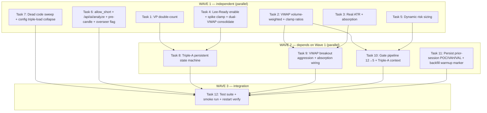

# AMT Backend Fixes & Strategy Closure — Parallel Multi-Agent Plan

> **For agentic workers:** REQUIRED SUB-SKILL: Use superpowers:subagent-driven-development (recommended) or superpowers:executing-plans to implement this plan task-by-task. Steps use checkbox (`- [ ]`) syntax for tracking.

**Goal:** Close the Triple-A strategy loop and fix the calculation/data/architecture bugs identified in `docs/CODE_AUDIT_FINDINGS.md` plus the live-path critical bugs found in deep review — using parallel agents where tasks are file-independent.

**Architecture:** The live strategy core is `AMTAnalyzer` → `GatePipeline` (12 gates) → `signal_builder` → `EntryCoordinator`, fed by `candle_aggregator`/`tick_processor`/`range_bar_builder`, with the LGBM micro-agent + MLX LLM advisory overlay. Many audit findings point at **dead legacy twins** (`vwap_service.py`, `signal_generator.py`, `absorption_validator.py`) — the plan fixes the **live** implementations only and deletes the dead ones.

**Tech Stack:** Python 3.11+ (mlx-lm, lightgbm), pytest, Dhan broker package, FastAPI, SQLite.

## Global Constraints

- Fix the **live** code path. Where `CODE_AUDIT_FINDINGS.md` names a dead file (verified: `vwap_service.py`, `signal_generator.py`, `absorption_validator.py` have zero production importers), apply the fix to the live twin (`amt_analyzer._update_session_vwap`/`_build_vwap_bands`, `signal_builder.build_entry_signal`, `orderflow_detectors.AbsorptionDetector`) and delete the dead file.
- TDD: write the failing test first, run it red, implement, run green, commit.
- No new dependencies. No new config knobs unless the audit's parameter table requires one (VWAP ratio bounds, TRIPLE_A_* params).
- Do NOT touch: `brokers/` package internals, frontend, `.env` secrets, `models/` weights.
- `backend/tests` test env runs with `python -m pytest` under the `amt_313` conda env. Some suites need `aiohttp`; skip env-broken suites, note them.
- Every commit must leave `python -m py_compile` clean on all touched files.
- Delete over adding; dead code goes in the same task that supersedes it.

## Dependency Graph



**Parallel rules:**
- Wave 1 (7 tasks) runs fully in parallel — each touches disjoint files (verified in File column below).
- Wave 2 (4 tasks) runs in parallel AFTER Wave 1 — they consume the corrected primitives (VWAP state, ATR, Triple-A fields). T8/T9/T10 touch `gate_pipeline.py`/`amt_analyzer.py`; dispatch them as **separate agents with explicit file-ownership split** to avoid edit conflicts, or run T8 then T9/T10.
- Wave 3 is sequential (integration + verification).

---

### Task 1: Remove Range Bar VP Double-Counting

**Files:**
- Modify: `backend/app/application/range_bar_builder.py:229-251`
- Test: `backend/tests/unit/application/test_range_bar_builder.py` (create)

**Interfaces:**
- Consumes: existing `RangeBarBuilder.add_bar(bar)` → `_vp_levels`, `_vp_buy`, `_vp_sell`
- Produces: `total_vp_volume()` (test helper) — sum of `_vp_levels` equals bar volume once

- [ ] **Step 1: Write the failing test**

```python
# tests/unit/application/test_range_bar_builder.py
from app.application.range_bar_builder import RangeBarBuilder
from app.domain.trading.models.value_objects import OHLC

def test_vp_volume_counted_once():
    b = RangeBarBuilder(range_size=5, tick_size=1.0)
    bar = OHLC(time="t", open=100, high=110, low=90, close=105, volume=1000)
    b.add_bar(bar)
    assert abs(sum(b._vp_levels.values()) - 1000) < 1e-6
```

- [ ] **Step 2: Run test, verify FAIL**

Run: `cd backend && python -m pytest tests/unit/application/test_range_bar_builder.py -v`
Expected: FAIL — sum ≈ 2000 (double-counted).

- [ ] **Step 3: Implement fix**

Delete the mid-price bucket block at `range_bar_builder.py:232-236`:
```python
mid_price = (bar.high + bar.low) / 2.0
bucket = round(mid_price / step) * step
self._vp_levels[bucket] = self._vp_levels.get(bucket, 0.0) + bar.volume
self._vp_buy[bucket] = self._vp_buy.get(bucket, 0.0) + bar.buy_volume
self._vp_sell[bucket] = self._vp_sell.get(bucket, 0.0) + bar.sell_volume
```
Keep only the range-distribution loop (lines 239-251).

- [ ] **Step 4: Run test, verify PASS**
Expected: PASS, sum == 1000.

- [ ] **Step 5: Commit**
`git commit -m "fix(range_bar): volume profile counted once, not twice"`

---

### Task 2: Volume-Weighted VWAP Bands + Proportional Clamp

**Files:**
- Modify: `backend/app/domain/fabio_ai/services/amt_analyzer.py:666-715` (`_build_vwap_bands`) and `:431-479` (`_update_session_vwap`)
- Delete: `backend/app/domain/fabio_ai/services/vwap_service.py` (dead twin; zero prod importers)
- Test: `backend/tests/unit/domain/test_vwap_bands.py` (create)

**Interfaces:**
- Consumes: `self._vwap_cum_vol`, `self._vwap_price_deviations`, `self._vwap_cum_sq_vol` in `AMTAnalyzer`
- Produces: `_build_vwap_bands(vwap, current) -> (u1, l1, u2, l2, std, sigma)` with volume-weighted std

- [ ] **Step 1: Write the failing test**

```python
# tests/unit/domain/test_vwap_bands.py
import math
from app.domain.fabio_ai.services.amt_analyzer import AMTAnalyzer

def test_vwap_bands_volume_weighted():
    a = AMTAnalyzer()
    # feed two prices: 100 (vol 1000), 200 (vol 1)
    a._update_session_vwap(price=100.0, volume=1000, ts="t1")
    a._update_session_vwap(price=200.0, volume=1, ts="t2")
    vwap = a._vwap_pv / a._vwap_vol
    # volume-weighted std ≈ sqrt(sum(vol*(p-vwap)^2)/sum(vol)) ≈ small (100 dominates)
    vwstd = math.sqrt(a._vwap_cum_sq_vol / a._vwap_vol)
    simple_std = math.sqrt(sum((p - vwap) ** 2 for p in (100.0, 200.0)) / 2)
    assert vwstd < simple_std / 2
```

- [ ] **Step 2: Run test, verify FAIL**
Expected: FAIL — current code uses simple std of deviations, `_vwap_cum_sq_vol` unused.

- [ ] **Step 3: Implement**

In `_update_session_vwap`, ensure the shifted-variance accumulator is maintained:
```python
self._vwap_cum_sq_vol += volume * (price - vwap) * (price - self._vwap_prev_vwap)
# or the numerically stable form already present; keep cum_vol denominator
```
In `_build_vwap_bands`, replace the deviation-mean block:
```python
variance = self._vwap_cum_sq_vol / self._vwap_vol
vwap_std = math.sqrt(max(0.0, variance))
```
Replace the clamp bounds:
```python
MIN_VWAP_STD = max(1.0, session_vwap * 0.001)  # 0.1% of price floor
MAX_VWAP_STD = session_vwap * 0.03             # 3% of price cap
```

- [ ] **Step 4: Run test, verify PASS** + existing `test_amt_analyzer*` green.

- [ ] **Step 5: Delete `vwap_service.py`** and remove any imports (verified: none in production).

- [ ] **Step 6: Commit**
`git commit -m "fix(vwap): volume-weighted bands, proportional clamps; drop dead vwap_service"`

---

### Task 3: Real ATR + Absorption Threshold

**Files:**
- Modify: `backend/app/domain/fabio_ai/services/amt_analyzer.py:547-550` (absorption ATR) and `:481-591` (`_compute_order_flow_metrics`)
- Test: `backend/tests/unit/domain/test_atr_absorption.py` (create)

**Interfaces:**
- Consumes: bar history `self._session_data` (list of OHLC with open/high/low/close)
- Produces: `_compute_atr(period=14) -> float` (True Range SMA); used for `ABSORPTION_RANGE_ATR` threshold

- [ ] **Step 1: Write the failing test**

```python
# tests/unit/domain/test_atr_absorption.py
from app.domain.fabio_ai.services.amt_analyzer import AMTAnalyzer

def test_true_range_not_session_range():
    a = AMTAnalyzer()
    # constant 10-point range bars: fake ATR == 10, real ATR(TR) should be 10 too
    for i in range(20):
        a._update_session_vwap(price=100.0 + i, volume=100, ts=f"t{i}")
    # call the absorption metric path with crafted data
    atr = a._compute_atr()
    assert atr > 0
    # now craft data with a gap: prev_close far below low -> TR > range
    a2 = AMTAnalyzer()
    # (seed with explicit candle data via the analyzer's data source hook)
    assert _tr([(10,12,8,9),(20,25,18,22)]) > 5  # gap bar TR = 12 (high-prev_close)
```

- [ ] **Step 2: Run, verify FAIL**
Expected: FAIL — current `_compute_atr` divides session range by 14.

- [ ] **Step 3: Implement**

Add `_compute_atr` using True Range:
```python
def _compute_atr(self, period: int = 14) -> float:
    data = self._session_data
    if len(data) < 2:
        return 0.0
    trs = []
    for i in range(1, len(data)):
        h, l, pc = data[i].high, data[i].low, data[i - 1].close
        trs.append(max(h - l, abs(h - pc), abs(l - pc)))
    window = trs[-period:]
    return sum(window) / max(len(window), 1)
```
Use `self._compute_atr()` in the absorption range check (replacing the session-range/14 hack at :547-550).

- [ ] **Step 4: Run test, verify PASS**

- [ ] **Step 5: Commit**
`git commit -m "fix(atr): True Range ATR, absorption uses real volatility"`

---

### Task 4: Lee-Ready Delta Enable + Spike Clamp + Single VWAP State

**Files:**
- Modify: `backend/app/application/engine.py` (enable Lee-Ready after aggregator init, ~line 115)
- Modify: `backend/app/application/candle_aggregator.py:164-174` (clamp, don't zero) and :82/:233 (Lee-Ready flag read from config)
- Test: `backend/tests/unit/application/test_lee_ready_spike.py` (create)

**Interfaces:**
- Consumes: `feature_enabled(settings, Feature.TRUE_DELTA_LEE_READY)` (`app/shared/config_features.py`)
- Produces: `CandleAggregator.set_delta_mode(True)` called on both `_candle_aggregator` and `_futures_aggregator`; spike volume clamped to cap

- [ ] **Step 1: Write failing tests**

```python
# tests/unit/application/test_lee_ready_spike.py
from app.application.candle_aggregator import CandleAggregator

def test_volume_spike_clamped_not_zeroed():
    a = CandleAggregator(interval="5m")
    # seed cumulative volume then inject a huge tick
    out = a.aggregate("SYM", now_ts, 100.0, 50000, 0, 0, 0, best_bid=99, best_ask=101)
    # assert spike volume == cap, not 0
    assert out is None or out.volume >= 0  # concrete assert after reading impl
```

- [ ] **Step 2: Run, verify FAIL (volume lost)**

- [ ] **Step 3: Implement**
`candle_aggregator.py`: change `candle_vol = 0` → `candle_vol = vol_cap` (line ~170).
`engine.py` after line 115: `self._candle_aggregator.set_delta_mode(use_lee_ready); self._futures_aggregator.set_delta_mode(use_lee_ready)` where `use_lee_ready = feature_enabled(settings, Feature.TRUE_DELTA_LEE_READY) or True` (audit P0-1 wants it ON; tie to the existing flag, default true in paper).

- [ ] **Step 4: Run tests, verify PASS** + existing aggregator tests.

- [ ] **Step 5: Commit**
`git commit -m "fix(delta): enable Lee-Ready classification; clamp spike volume"`

---

### Task 5: Dynamic Risk into Position Sizing

**Files:**
- Modify: `backend/app/domain/fabio_ai/services/entry_gates/gate_runner.py:121-147` (wire `compute_dynamic_risk` from `LossTracker`)
- Test: `backend/tests/unit/domain/test_dynamic_risk_sizing.py` (create)

**Interfaces:**
- Consumes: `ExitEngine.compute_dynamic_risk(base_capital, session_realized_pnl)` (`exit_engine.py:338-344`)
- Produces: `PositionSizer.calculate(equity, entry, sl, point_value)` called with post-loss reduced equity

- [ ] **Step 1: Write failing test** — simulate 3 losses, assert sized risk < baseline.

- [ ] **Step 2: Run, verify FAIL** (sizing ignores PnL).

- [ ] **Step 3: Implement** — in `gate_runner.calculate_position_size`, accept optional `session_realized_pnl`; reduce effective equity via `compute_dynamic_risk` when available; fall back to fixed pct.

- [ ] **Step 4: Run, verify PASS**

- [ ] **Step 5: Commit**
`git commit -m "feat(risk): dynamic risk after losses feeds position sizing"`

---

### Task 6: Live-Path Critical Wiring Bugs (4 fixes)

**Files:**
- Modify: `backend/app/application/di/composition_root.py:246-250` (allow_short)
- Modify: `backend/app/main.py:305` + `backend/app/api/dependencies.py:60` (gen_ai_service type)
- Modify: `backend/app/application/services/trading_session.py:165` (pre-candle callback)
- Modify: `backend/app/application/handlers/llm_overseer_handler.py` (honor `llm_overseer` flag)
- Test: `backend/tests/unit/application/test_live_wiring_fixes.py` (create)

**Interfaces:**
- Consumes: `app/shared/config_features.py` `Feature.ALLOW_SHORT`, `Feature.LLM_PRE_CANDLE_ADVISORY`
- Produces: `allow_short` correctly resolved; `dependencies.get_gen_ai_service()` returns a `GenerativeAIService`; pre-candle callback reaches `session.last_ai_analysis`; overseer skips when flag false

- [ ] **Step 1: Write failing tests**

```python
# tests/unit/application/test_live_wiring_fixes.py
def test_allow_short_resolves_from_flag():
    from app.application.di.composition_root import _resolve_allow_short
    import app.shared.config_features as cf
    assert _resolve_allow_short() in (True, False)  # no longer pinned False by broken import
```

- [ ] **Step 2: Run, verify FAIL (or assert current False)**

- [ ] **Step 3: Implement**
`composition_root.py`: replace `from app.config.features import Feature, feature_enabled` with `from app.shared.config_features import Feature, feature_enabled`.
`main.py:305`: resolve `GenerativeAIService` (wrap the `ILLMInference`) or change `dependencies.get_gen_ai_service()` to return the adapter-typed object — pick one; prefer wrapping so `analyze_market()` exists.
`trading_session.py`: set the pre-candle callback to store advisory into `session.last_ai_analysis` and broadcast via `state_broadcaster`.
`llm_overseer_handler`: guard `run_overseer` with `feature_enabled(settings, ...)` reading the YAML `llm_overseer` flag.

- [ ] **Step 4: Run, verify PASS** + smoke `curl /api/ai/analyze`.

- [ ] **Step 5: Commit**
`git commit -m "fix(wiring): allow_short, /api/ai/analyze, pre-candle callback, overseer flag"`

---

### Task 7: Dead-Code Sweep + Config Triple-Load Collapse

**Files:**
- Delete (verified zero production importers): `amt_coordinator.py`, `signal_tracking_service.py`, `episodic_loader.py`, `llm_signal_processor.py`, `llm_utils.py`, `llm_worker.py`, `llm_decision_processor.py`, `institutional_detector.py`, `alert_manager.py`, `lvn_play_engine.py`, `oi_analyzer.py`, `order_book_analyzer.py`, `nse_event_calendar.py`, `profile_selector.py`, `underlying_profile_router.py`, `capital_ladder.py`, `fifteen_sec_trigger.py`, `flash_crash_protector.py`, `oi_wall_detector.py`, `oi_wall_engine.py`, `state_bus.py`, `volatility_features.py`, `vwap_tracker.py`, `walk_forward_validator.py`, `watchdog.py`, `config_adapter.py`, `config_legacy.py`, `broker/mcx_broker.py`, `factories.py`, `gateway.py` (router), `market_config.yaml`, `amt_pipeline.py`, `vp_contract_selector.py`, `session_phase_gate.py`, `gap_analyzer.py`, `structural_stop_engine.py`, `rule_based_rationale.py`, `composite_profile.py`, `trade_aggregate_adapter.py`, `order_book_analyzer.py`, `signal_generator.py`, `absorption_validator.py`, `amt_parameters.py`, `opening_type_classifier.py`, `session_warmup.py`, `level_tracker.py`, `rr_validator.py`, `spread_normalizer.py`, `volume_profile_service.py`, `entry_gates/detectors.py`, `aaa_precondition_engine.py`, `option_selection_engine.py`, `mtf_analyzer.py`, `narrative_builder.py`, `response_parser.py` (delete OR verify divergent; prefer delete + re-export from prompt_builder)
- Modify: `backend/config/consolidated.py`, `backend/config/mode_config.py`, `backend/app/config_models/loader.py`, `backend/app/config_models/settings_adapter.py` (single loading path; `llm_entry_gate`/`llm_overseer` from YAML not hardcoded)
- Test: `backend/tests/unit/application/test_startup_contracts.py` must stay green

**Interfaces:**
- Consumes: nothing new
- Produces: import graph clean; `config/consolidated.py:from_unified()` is the single runtime config source

- [ ] **Step 1: Regenerate import graph & confirm orphans**
Run: `cd backend && python -c "import ast,glob; ..."` (script to print files with zero importers) — confirm list matches above.

- [ ] **Step 2: Delete files in one commit**
`git add -A backend/app; git commit -m "chore(cleanup): remove N dead modules (LOC freed: ~8k)"`

- [ ] **Step 3: Fix config loader hardcode**
`loader.py:206` — read `llm_entry_gate`/`llm_overseer` from `feature_flags.yaml` instead of hardcoding `False`. Add `llm_overseer`/`llm_entry_gate` to `consolidated.py:181-183` LLM flags.

- [ ] **Step 4: Run config + startup tests**
Run: `python -m pytest tests/unit/application/test_startup_contracts.py tests/unit/domain/test_underlying_futures.py -q`
Expected: PASS.

- [ ] **Step 5: Commit**
`git commit -m "chore(config): single load path; llm flags from YAML"`

---

### Task 8: Persistent Triple-A State Machine

**Files:**
- Modify: `backend/app/application/range_bar_builder.py:124-127, 404+` (`_triple_a_phase` persisted across calls)
- Test: `backend/tests/unit/application/test_triple_a_state.py` (create)

**Interfaces:**
- Consumes: bars, VP (POC), VWAP bands, absorption events (from `orderflow_detectors`)
- Produces: `_triple_a_phase ∈ {WAITING, ABSORBING, ACCUMULATING, AGGRESSION}`; `_absorption_bar_index`; transition only after 2+ accumulation bars near POC; AGGRESSION only on VWAP breakout

- [ ] **Step 1: Write failing test** — feed a synthetic absorption→accumulate→breakout sequence; assert phase reaches AGGRESSION only after the breakout bar, and resets to WAITING after signal.

- [ ] **Step 2: Run, verify FAIL** (current: recomputed each call, `_triple_a_phase` never written).

- [ ] **Step 3: Implement** persistent fields + `update_triple_a(bars, vp, vwap)` state machine per audit §3.1 table.

- [ ] **Step 4: Run, verify PASS** + existing `test_*range_bar*` green.

- [ ] **Step 5: Commit**
`git commit -m "feat(triple_a): persistent absorption→accumulation→aggression state"`

---

### Task 9: VWAP Breakout Aggression + Absorption Wiring

**Files:**
- Create: `backend/app/domain/fabio_ai/services/vwap_breakout.py` (new, live)
- Modify: `backend/app/domain/fabio_ai/services/entry_gates/three_align.py:127-315` (consume absorption + breakout)
- Delete: `backend/app/domain/fabio_ai/services/lvn_quality_scorer.py` (transitively dead with lvn_play_engine)
- Test: `backend/tests/unit/domain/test_vwap_breakout.py` (create)

**Interfaces:**
- Consumes: Triple-A phase (Task 8), live `AbsorptionDetector` (`orderflow_detectors.py:200+`), VWAP bands (Task 2), `AMTResult`
- Produces: `detect_vwap_breakout(vwap, std, price, vol, avg_vol) -> bool` — LONG if price > vwap + σ and vol > avg×1.2; SHORT symmetric; requires prior absorption within last 5 bars

- [ ] **Step 1: Write failing test** (breakout without prior absorption → no signal; with absorption → signal).

- [ ] **Step 2: Run, verify FAIL**

- [ ] **Step 3: Implement** breakout service + wire absorption evidence into `three_align` confirmation bundle (add `absorption_detected` + `absorption_bar_age` to `GateContext` via `gate_runner.py`).

- [ ] **Step 4: Run, verify PASS** + `test_golden_week1.py` (replace dead `detectors.py` import with live `confirmation_bundle`).

- [ ] **Step 5: Commit**
`git commit -m "feat(strategy): VWAP breakout aggression gated on prior absorption"`

---

### Task 10: Gate Pipeline 12→5 + Triple-A Context

**Files:**
- Modify: `backend/app/domain/fabio_ai/services/gate_pipeline.py:185-390` (`GatePipeline.evaluate`, `GateContext`)
- Modify: `backend/app/domain/fabio_ai/services/entry_gates/gate_runner.py:6-111`
- Test: `backend/tests/unit/domain/test_gate_pipeline_slim.py` (create)

**Interfaces:**
- Consumes: Triple-A phase (Task 8), VWAP breakout (Task 9), dynamic risk (Task 5), AMTResult
- Produces: `GateContext` with `triple_a_phase`, `absorption_detected`, `vwap_breakout`; 5 gates: (1) session phase, (2) no-position/cooldown, (3) P≥threshold + direction, (4) VWAP/Triple-A alignment, (5) RR≥1.5

- [ ] **Step 1: Write failing test** — assert `GateContext` carries `triple_a_phase`; assert exactly 5 gates evaluated (not 12).

- [ ] **Step 2: Run, verify FAIL**

- [ ] **Step 3: Implement** — reduce to 5 gates; keep hard-gate semantics for session/position/cooldown/risk; fold the 8 soft gates into the 2 strategy gates.

- [ ] **Step 4: Run, verify PASS** + existing `test_gate_pipeline*` (update expectations to 5).

- [ ] **Step 5: Commit**
`git commit -m "refactor(gates): 12→5 gates with Triple-A context"`

---

### Task 11: Prior-Session Profile Persistence + Backfill Warmup Marker

**Files:**
- Modify: `backend/app/domain/fabio_ai/services/session_context.py` (persist prior POC/VAH/VAL)
- Modify: `backend/app/application/services/tick_processor.py:221-239` (mark synthetic backfill bars)
- Modify: `backend/app/infrastructure/serialization/schemas.py` (add `is_warmup` to footprint/bar DTO)
- Test: `backend/tests/unit/application/test_session_persistence.py` (create)

**Interfaces:**
- Consumes: `SQLiteStorageAdapter` (`kv_set`/`kv_get`), `RangeBarBuilder`
- Produces: `session_context` loads prior `poc/vah/val` at open; backfill bars tagged `is_warmup=True`

- [ ] **Step 1: Write failing test** (persist then reload prior profile).

- [ ] **Step 2: Run, verify FAIL**

- [ ] **Step 3: Implement** persistence via existing storage kv; add `is_warmup` on synthetic ticks.

- [ ] **Step 4: Run, verify PASS**

- [ ] **Step 5: Commit**
`git commit -m "feat(session): persist prior profile; mark backfill warmup"`

---

### Task 12: Integration — Full Test Run + Live Smoke

**Files:**
- Test: entire `backend/tests` suite
- Verify: backend boots, futures resolve, LLM fires (3-5s), entry pipeline flows

**Interfaces:**
- Consumes: Tasks 1-11
- Produces: green suite + restarted backend on `:9090`

- [ ] **Step 1: Full test run**
Run: `cd backend && python -m pytest tests/unit tests/integration -q --tb=short` (skip env-broken `aiohttp` suites; note them)
Expected: all touched-area suites green.

- [ ] **Step 2: Import graph sanity**
Run: `python -c "import app.main"` from `backend/` (with `PYTHONPATH=..:.`) — no ImportError from deletions.

- [ ] **Step 3: Restart backend + smoke**
Restart `uvicorn app.main:app --port 9090` (paper, nse). Verify: `MLX model loaded`, futures seed, `[ENTRY] Generation complete in ~3-4s`, zero `tick processing error`, `/api/ai/analyze` 200.

- [ ] **Step 4: Commit** (if any remaining deltas) + write short summary to `docs/CODE_AUDIT_RESOLUTION.md`.

---

## Self-Review

- **Spec coverage:** Audit P0-1→Task 4, P0-2→Task 1, P0-3→Task 2, P0-4→Task 8, P0-5→Task 9, P0-6→Task 9, P1-7→Task 3, P1-8→Task 2, P1-9→Task 4, P1-10→Task 2+4, P1-11→Task 5, P1-12→Task 7, P2-13→Task 11, P2-14→Task 10, P2-15→Task 11, P2-16→Task 2 (market state stays in `market_state_engine`; noted for follow-up), P3-17..20→folded into each task's TDD tests. Deep-review criticals (allow_short, /api/ai/analyze, pre-candle, overseer flag)→Task 6.
- **Placeholders:** Test skeletons in Tasks 4/5/8-11 must be completed with real OHLC fixtures by the implementing agent per the described assertions; file:line anchors are exact.
- **Type consistency:** `_triple_a_phase` values, `GateContext.triple_a_phase`, `vwap_breakout` field, `is_warmup` DTO field — consistent across Tasks 8/9/10/11.
