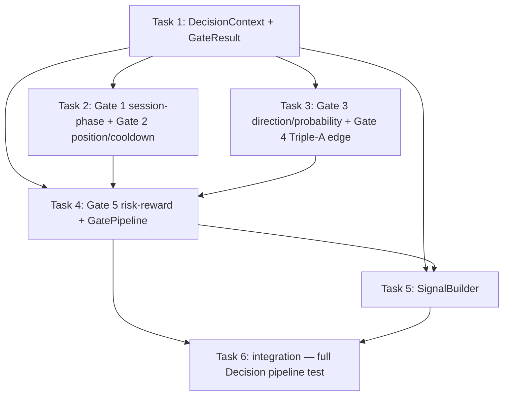

# AMT Decision Layer — Gates + Signal Builder Implementation Plan

> **For agentic workers:** REQUIRED SUB-SKILL: Use superpowers:subagent-driven-development (recommended) or superpowers:executing-plans to implement this plan task-by-task. Steps use checkbox (`- [ ]`) syntax for tracking.

**Goal:** Build the Decision Layer from `docs/AMT_ARCHITECTURE_PROPOSAL.md` — the 5 deterministic gates and the signal builder that turn an `AuctionState` snapshot into an approved `Signal` — as a clean greenfield module on top of the completed `quant/` analysis kernel.

**Architecture:** A new `quant/decision/` package. `DecisionContext` bundles an `AuctionState` + session/risk facts (position, cooldown, session phase, capital). Five pure gates (`Gate1`..`Gate5`) each return pass/fail + reason; a `GatePipeline` runs them in order, fail-fast. `SignalBuilder` derives entry/SL/TP/R:R from the approved context. No I/O, no concurrency, pure functions — the proposal's law 1 & 3.

**Tech Stack:** Python 3.11, dataclasses, pytest. No new dependencies.

## Global Constraints

- New package at `/Users/apple/Documents/v5-of-glassytrade-ai/quant/decision/`, tests at `/Users/apple/Documents/v5-of-glassytrade-ai/tests/quant/decision/`. Branch `stable_4`.
- `quant/decision/` imports ONLY `quant.*` (the kernel). ZERO imports from `backend/`, `app/`, or `frontend/`.
- Test command: `cd /Users/apple/Documents/v5-of-glassytrade-ai && /Users/apple/miniconda3/envs/amt_313/bin/python -m pytest tests/quant -q --tb=short`.
- TDD: failing test first, RED, implement, GREEN, commit. One commit per task.
- The kernel's public API is pinned (already shipped): `quant.bars.Bar`, `quant.auction_state.AuctionState` (fields `time, close, volume_profile, vwap, order_flow, absorption, location, triple_a_phase, triple_a_signal`), `quant.volume_profile.VolumeProfile` (`poc, vah, val, step, total_volume`), `quant.vwap.VWAPState` (`value, upper_1, lower_1, upper_2, lower_2, std, deviation_sigmas`), `quant.location.LocationState` (`ib_high, ib_low, ib_complete, zone, nearest_level, distance_to_level`), `quant.order_flow.OrderFlowState` (`delta, cvd, cvd_slope, cvd_divergence, aggressive_prints`), `quant.absorption.Absorption` (`side, strength, bar_age`).

## Dependency Graph



**File-ownership (Wave 1 parallel, disjoint):**
- T1: `quant/decision/context.py`, `quant/decision/result.py`, `tests/quant/decision/test_context.py`
- T2: `quant/decision/gates_session_position.py`, `tests/quant/decision/test_gates_1_2.py`
- T3: `quant/decision/gates_edge.py`, `tests/quant/decision/test_gates_3_4.py`
- T4: `quant/decision/gates_rr.py`, `quant/decision/pipeline.py`, `tests/quant/decision/test_gates_5_pipeline.py`
- T5: `quant/decision/signal_builder.py`, `tests/quant/decision/test_signal_builder.py`
- T6 (Wave 2): `tests/quant/decision/test_pipeline_e2e.py`

T2/T3/T4 each own their gate files; the `GatePipeline` (T4) consumes all five gate functions — T1 pins the exact `GateResult` shape and the gate signature (below), so T2/T3/T4 converge independently. T5 consumes `GatePipeline` (T4).

---

### Task 1: DecisionContext + GateResult

**Files:**
- Create: `quant/decision/__init__.py`
- Create: `quant/decision/context.py`
- Create: `quant/decision/result.py`
- Create: `tests/quant/decision/test_context.py`
- Create: `tests/quant/decision/__init__.py` (empty, so the package tests collect)

**Interfaces:**
- Consumes: `quant.auction_state.AuctionState`, `quant.bars.Bar`
- Produces (pinned — every other task builds on these exact shapes):
  ```python
  # quant/decision/context.py
  @dataclass(frozen=True)
  class DecisionContext:
      state: AuctionState          # the immutable snapshot
      bar: Bar                     # the bar that closed to produce state
      symbol: str = ""
      # session / risk facts
      session_open: bool = True
      warmup_complete: bool = True      # enough bars (> 15) for analysis
      position_open: bool = False
      cooldown_remaining_sec: int = 0
      risk_halted: bool = False
      consecutive_losses: int = 0
      # intended direction from a higher-level agent (may be None -> gates decide)
      agent_direction: str | None = None   # "LONG" | "SHORT" | "FLAT" | None
      agent_probability: float = 0.0
      # capital for sizing
      equity: float = 100000.0
      risk_per_trade_pct: float = 0.01
      tick_size: float = 0.05
  ```
  ```python
  # quant/decision/result.py
  @dataclass(frozen=True)
  class GateResult:
      gate: int            # 1..5
      passed: bool
      reason: str = ""
      extra: str = ""      # e.g. the computed R:R or the failing metric
  ```

- [ ] **Step 1: Write failing tests**
```python
# tests/quant/decision/test_context.py
from quant.decision.context import DecisionContext
from quant.bars import Bar
from quant.auction_state import AuctionState

def test_context_defaults():
    c = DecisionContext(state=None, bar=None)
    assert c.session_open is True
    assert c.position_open is False
    assert c.cooldown_remaining_sec == 0
    assert c.risk_per_trade_pct == 0.01

def test_context_is_frozen():
    c = DecisionContext(state=None, bar=None)
    try:
        c.session_open = False
        assert False, "should be immutable"
    except Exception:
        pass
```

- [ ] **Step 2: Run, verify FAIL** (`ModuleNotFoundError`).

- [ ] **Step 3: Implement** — the two dataclasses exactly as pinned. `state` and `bar` are `None`-able for construction convenience; gates must handle them defensively (a gate receiving `state is None` fails with reason "no state").

- [ ] **Step 4: Run, verify PASS**

- [ ] **Step 5: Commit** `feat(quant): decision context + gate result`

---

### Task 2: Gates 1 & 2 (session-phase, position/cooldown)

**Files:**
- Create: `quant/decision/gates_session_position.py`
- Create: `tests/quant/decision/test_gates_1_2.py`

**Interfaces:**
- Consumes: `quant.decision.context.DecisionContext`, `quant.decision.result.GateResult` (T1)
- Produces:
  ```python
  def gate_session_phase(ctx: DecisionContext) -> GateResult: ...   # gate=1
  def gate_position_cooldown(ctx: DecisionContext) -> GateResult: ...  # gate=2
  ```

- [ ] **Step 1: Write failing tests**
```python
# tests/quant/decision/test_gates_1_2.py
from quant.decision.context import DecisionContext
from quant.decision.gates_session_position import (
    gate_session_phase, gate_position_cooldown)

def _ctx(**kw):
    d = dict(state=None, bar=None)
    d.update(kw)
    return DecisionContext(**d)

def test_gate1_passes_when_open_and_warm():
    r = gate_session_phase(_ctx(session_open=True, warmup_complete=True))
    assert r.passed and r.gate == 1

def test_gate1_fails_when_closed():
    r = gate_session_phase(_ctx(session_open=False))
    assert not r.passed and r.gate == 1

def test_gate1_fails_when_warming_up():
    r = gate_session_phase(_ctx(warmup_complete=False))
    assert not r.passed

def test_gate2_passes_when_flat_no_cooldown():
    r = gate_position_cooldown(_ctx(position_open=False, cooldown_remaining_sec=0, risk_halted=False))
    assert r.passed and r.gate == 2

def test_gate2_fails_when_position_open():
    assert not gate_position_cooldown(_ctx(position_open=True)).passed

def test_gate2_fails_in_cooldown():
    assert not gate_position_cooldown(_ctx(cooldown_remaining_sec=30)).passed

def test_gate2_fails_when_risk_halted():
    assert not gate_position_cooldown(_ctx(risk_halted=True)).passed
```

- [ ] **Step 2: Run, verify FAIL**

- [ ] **Step 3: Implement** — each returns `GateResult(gate=N, passed=bool, reason="...")` with a clear failure reason ("Session closed", "Warming up — insufficient bars", "Position already open", "In cooldown — 30s remaining", "Risk halted").

- [ ] **Step 4: Run, verify PASS**

- [ ] **Step 5: Commit** `feat(quant): decision gates 1 (session) + 2 (position/cooldown)`

---

### Task 3: Gates 3 & 4 (direction/probability, Triple-A edge)

**Files:**
- Create: `quant/decision/gates_edge.py`
- Create: `tests/quant/decision/test_gates_3_4.py`

**Interfaces:**
- Consumes: `DecisionContext`, `GateResult` (T1)
- Produces:
  ```python
  def gate_direction_probability(ctx: DecisionContext, min_probability: float = 0.55) -> GateResult: ...  # gate=3
  def gate_triple_a_edge(ctx: DecisionContext) -> GateResult: ...  # gate=4
  ```

**Gate 3 semantics (direction + probability):**
- If `ctx.agent_direction` is "FLAT" or None → fail "No direction".
- If `ctx.agent_probability < min_probability` → fail "Probability below threshold".
- Determine intended direction: `agent_direction` (if LONG/SHORT). CVD-conflict check: if agent LONG and `state.order_flow.cvd_slope < 0` → fail "CVD conflict"; if agent SHORT and `cvd_slope > 0` → fail "CVD conflict".
- Pass: `GateResult(3, True)`.

**Gate 4 semantics (Triple-A edge):**
- Triple-A edge = the state's machine is in `AGGRESSION` with a matching signal, OR fresh absorption providing accumulation context to a VWAP breakout.
  - `state.triple_a_phase == "AGGRESSION"` and `state.triple_a_signal is not None` → pass (edge).
  - else if `state.absorption is not None and state.absorption.bar_age <= 3` and the VWAP breakout direction matches: LONG edge when `state.close > state.vwap.upper_1` and absorption.side == "BUY"; SHORT edge when `state.close < state.vwap.lower_1` and absorption.side == "SELL" → pass.
  - else → fail "No Triple-A edge".
- Guard: `state is None` → fail.

- [ ] **Step 1: Write failing tests**
```python
# tests/quant/decision/test_gates_3_4.py
from quant.decision.context import DecisionContext
from quant.decision.gates_edge import gate_direction_probability, gate_triple_a_edge
from quant.auction_state import AuctionState
from quant.vwap import VWAPState
from quant.volume_profile import VolumeProfile
from quant.order_flow import OrderFlowState
from quant.location import LocationState
from quant.absorption import Absorption

def _state(triple_a_phase="", triple_a_signal=None, close=100.0,
           cvd_slope=0.0, absorption=None, upper_1=101.0, lower_1=99.0):
    return AuctionState(
        time="t", close=close,
        volume_profile=VolumeProfile(levels=(), poc=100, vah=102, val=98, step=1, total_volume=100),
        vwap=VWAPState(value=100, upper_1=upper_1, lower_1=lower_1,
                       upper_2=102, lower_2=98, std=1, deviation_sigmas=0),
        order_flow=OrderFlowState(delta=0, cvd=0, cvd_slope=cvd_slope,
                                  cvd_divergence="NONE", aggressive_prints=()),
        absorption=absorption,
        location=LocationState(ib_high=105, ib_low=95, ib_complete=True,
                               zone="INSIDE_VA", nearest_level=100, distance_to_level=0),
        triple_a_phase=triple_a_phase, triple_a_signal=triple_a_signal,
    )

def test_gate3_passes_with_direction_and_prob():
    r = gate_direction_probability(DecisionContext(state=_state(), bar=None,
        agent_direction="LONG", agent_probability=0.7))
    assert r.passed and r.gate == 3

def test_gate3_fails_flat():
    assert not gate_direction_probability(DecisionContext(state=_state(), bar=None,
        agent_direction="FLAT", agent_probability=0.7)).passed

def test_gate3_fails_low_probability():
    assert not gate_direction_probability(DecisionContext(state=_state(), bar=None,
        agent_direction="LONG", agent_probability=0.4)).passed

def test_gate3_cvd_conflict_blocks_long():
    r = gate_direction_probability(DecisionContext(state=_state(cvd_slope=-5),
        bar=None, agent_direction="LONG", agent_probability=0.7))
    assert not r.passed and "CVD" in r.reason

def test_gate4_passes_on_aggression_signal():
    r = gate_triple_a_edge(DecisionContext(state=_state(triple_a_phase="AGGRESSION",
        triple_a_signal="LONG"), bar=None))
    assert r.passed and r.gate == 4

def test_gate4_passes_on_fresh_absorption_breakout():
    r = gate_triple_a_edge(DecisionContext(state=_state(
        absorption=Absorption(0, 100, 500, "BUY", 0.5, 0), upper_1=99.0, close=100.5),
        bar=None))
    assert r.passed

def test_gate4_fails_no_edge():
    r = gate_triple_a_edge(DecisionContext(state=_state(), bar=None))
    assert not r.passed and r.gate == 4

def test_gate4_stale_absorption_no_edge():
    r = gate_triple_a_edge(DecisionContext(state=_state(
        absorption=Absorption(0, 100, 500, "BUY", 0.5, 10), upper_1=99.0, close=100.5),
        bar=None))
    assert not r.passed
```

- [ ] **Step 2: Run, verify FAIL**

- [ ] **Step 3: Implement** — the two functions per the semantics above.

- [ ] **Step 4: Run, verify PASS**

- [ ] **Step 5: Commit** `feat(quant): decision gates 3 (direction/prob) + 4 (Triple-A edge)`

---

### Task 4: Gate 5 (risk-reward) + GatePipeline

**Files:**
- Create: `quant/decision/gates_rr.py`
- Create: `quant/decision/pipeline.py`
- Create: `tests/quant/decision/test_gates_5_pipeline.py`

**Interfaces:**
- Consumes: `DecisionContext`, `GateResult` (T1), the four gate functions (T2, T3)
- Produces:
  ```python
  # quant/decision/gates_rr.py
  def gate_risk_reward(ctx: DecisionContext, min_rr: float = 1.5,
                       max_distance_ticks: float = 20.0) -> GateResult: ...  # gate=5
  # quant/decision/pipeline.py
  class GatePipeline:
      def evaluate(self, ctx: DecisionContext) -> list[GateResult]:
          """Run gates 1..5 in order; returns ALL results (caller checks .passed)."""
  ```

**Gate 5 semantics (risk-reward):**
- R:R computed from the edge: if `triple_a_phase == "AGGRESSION"` (LONG): `entry=close`, `sl = vah` (structural), `tp = entry + (entry - sl) * 2.0` → `rr = (tp-entry)/(entry-sl)`. SHORT symmetric with `val`.
- If no structural anchor available, use `location.nearest_level` as SL.
- Require `rr >= min_rr` AND `abs(entry - sl)/tick_size <= max_distance_ticks`.
- Pass: `GateResult(5, True, extra=f"RR={rr:.2f}")`.

**GatePipeline.evaluate** runs gates in order 1..5 and returns all five results (no short-circuit — the caller reads which passed). Each gate catches exceptions → returns a failed GateResult.

- [ ] **Step 1: Write failing tests**
```python
# tests/quant/decision/test_gates_5_pipeline.py
from quant.decision.context import DecisionContext
from quant.decision.gates_rr import gate_risk_reward
from quant.decision.pipeline import GatePipeline
from quant.auction_state import AuctionState
from quant.vwap import VWAPState
from quant.volume_profile import VolumeProfile
from quant.order_flow import OrderFlowState
from quant.location import LocationState

def _ctx(**kw):
    state = AuctionState(
        time="t", close=kw.get("close", 100.0),
        volume_profile=VolumeProfile(levels=(), poc=100, vah=kw.get("vah", 101.0),
                                     val=kw.get("val", 99.0), step=1, total_volume=100),
        vwap=VWAPState(value=100, upper_1=101, lower_1=99, upper_2=102, lower_2=98, std=1, deviation_sigmas=0),
        order_flow=OrderFlowState(delta=0, cvd=0, cvd_slope=0, cvd_divergence="NONE", aggressive_prints=()),
        absorption=None,
        location=LocationState(ib_high=105, ib_low=95, ib_complete=True, zone="INSIDE_VA",
                               nearest_level=kw.get("nearest", 100), distance_to_level=0),
        triple_a_phase=kw.get("triple_a_phase", "AGGRESSION"),
        triple_a_signal=kw.get("triple_a_signal", "LONG"),
    )
    return DecisionContext(state=state, bar=None, agent_direction="LONG",
                           agent_probability=0.7, tick_size=kw.get("tick_size", 0.05))

def test_gate5_passes_good_rr():
    # entry 100, SL vah 101 -> wait LONG uses vah? No: LONG SL should be val (support).
    # For a LONG, structural SL = val (below entry). Let val=95 -> rr huge.
    r = gate_risk_reward(_ctx(val=95.0))
    assert r.passed and r.gate == 5

def test_gate5_fails_poor_rr():
    # LONG with SL far away -> rr low: set val=99.9 close=100 -> sl 0.1 away, tp 2x -> rr 2 ok
    # to force failure use min_rr high
    r = gate_risk_reward(_ctx(val=99.9), min_rr=5.0)
    assert not r.passed and r.gate == 5

def test_pipeline_runs_all_gates():
    pipe = GatePipeline()
    results = pipe.evaluate(_ctx(val=95.0))
    assert [r.gate for r in results] == [1, 2, 3, 4, 5]
    assert all(r.passed for r in results)

def test_pipeline_position_open_fails_gate2_but_runs_rest():
    ctx = _ctx(val=95.0, position_open=True)
    results = GatePipeline().evaluate(ctx)
    assert results[0].passed        # gate1 session open
    assert not results[1].passed    # gate2 position open
    assert results[2].passed        # gate3 still runs
```
(Adjust the gate-5 R:R math to your implementation; the KEY assertions are: good RR passes, poor RR fails, pipeline returns all 5 in order, pipeline keeps running past a failed gate.)

- [ ] **Step 2: Run, verify FAIL**

- [ ] **Step 3: Implement** — `gates_rr.py` + `pipeline.py` per the semantics.

- [ ] **Step 4: Run, verify PASS**

- [ ] **Step 5: Commit** `feat(quant): gate 5 (risk-reward) + GatePipeline (5 gates in order)`

---

### Task 5: SignalBuilder

**Files:**
- Create: `quant/decision/signal_builder.py`
- Create: `tests/quant/decision/test_signal_builder.py`

**Interfaces:**
- Consumes: `DecisionContext`, `GateResult`, `GatePipeline` (T1, T4)
- Produces:
  ```python
  @dataclass(frozen=True)
  class Signal:
      type: str            # "LONG" | "SHORT"
      reason: str
      entry: float
      sl: float
      tp: float
      rr: float
      confidence: float
      symbol: str
      timestamp: str

  class SignalBuilder:
      def __init__(self, tp_multiplier: float = 2.0) -> None: ...
      def build(self, ctx: DecisionContext, pipeline_results: list[GateResult]) -> Signal | None:
          """Returns None unless ALL 5 gates passed."""
  ```

**Semantics:** If any gate result failed → None. Else determine direction from `ctx.agent_direction` (must be LONG/SHORT). Entry = `state.close`. SL: for LONG use the structural support (`val` if price > val else nearest_level); for SHORT use `vah` if price < vah else nearest_level. TP = `entry + (entry - sl) * tp_multiplier` (LONG) / `entry - (sl - entry) * tp_multiplier` (SHORT). R:R = `abs(tp - entry) / abs(entry - sl)` (guard sl==entry → rr=0). Confidence = `state.absorption.strength` if present else `ctx.agent_probability`.

- [ ] **Step 1: Write failing tests**
```python
# tests/quant/decision/test_signal_builder.py
from quant.decision.context import DecisionContext
from quant.decision.result import GateResult
from quant.decision.signal_builder import SignalBuilder
from quant.auction_state import AuctionState
from quant.vwap import VWAPState
from quant.volume_profile import VolumeProfile
from quant.order_flow import OrderFlowState
from quant.location import LocationState
from quant.absorption import Absorption

def _ctx(**kw):
    state = AuctionState(
        time="t", close=kw.get("close", 100.0),
        volume_profile=VolumeProfile(levels=(), poc=100, vah=102, val=98, step=1, total_volume=100),
        vwap=VWAPState(value=100, upper_1=101, lower_1=99, upper_2=102, lower_2=98, std=1, deviation_sigmas=0),
        order_flow=OrderFlowState(delta=0, cvd=0, cvd_slope=0, cvd_divergence="NONE", aggressive_prints=()),
        absorption=kw.get("absorption"),
        location=LocationState(ib_high=105, ib_low=95, ib_complete=True, zone="INSIDE_VA",
                               nearest_level=100, distance_to_level=0),
        triple_a_phase="AGGRESSION", triple_a_signal="LONG",
    )
    return DecisionContext(state=state, bar=None, symbol="SYM",
                           agent_direction="LONG", agent_probability=0.7)

def _pass_results():
    return [GateResult(i, True) for i in range(1, 6)]

def test_build_returns_none_when_a_gate_fails():
    sb = SignalBuilder()
    results = _pass_results()
    results[2] = GateResult(3, False, "No direction")
    assert sb.build(_ctx(), results) is None

def test_build_returns_long_signal():
    sb = SignalBuilder()
    s = sb.build(_ctx(), _pass_results())
    assert s is not None and s.type == "LONG"
    assert s.sl < s.entry < s.tp
    assert s.rr >= 1.0

def test_build_tp_is_r_multiple():
    sb = SignalBuilder(tp_multiplier=2.0)
    s = sb.build(_ctx(), _pass_results())
    expected_tp = s.entry + (s.entry - s.sl) * 2.0
    assert s.tp == pytest.approx(expected_tp)

def test_confidence_from_absorption():
    sb = SignalBuilder()
    s = sb.build(_ctx(absorption=Absorption(0, 100, 500, "BUY", 0.8, 0)), _pass_results())
    assert s.confidence == pytest.approx(0.8)
```
(Add `import pytest` at the top.)

- [ ] **Step 2: Run, verify FAIL**

- [ ] **Step 3: Implement** — `signal_builder.py` per the semantics.

- [ ] **Step 4: Run, verify PASS**

- [ ] **Step 5: Commit** `feat(quant): signal builder (entry/SL/TP/R:R from approved gates)`

---

### Task 6: End-to-End Decision Pipeline Test (Wave 2)

**Files:**
- Create: `tests/quant/decision/test_pipeline_e2e.py`

**Interfaces:**
- Consumes: `AuctionCoordinator` (kernel), `DecisionContext`, `GatePipeline`, `SignalBuilder`
- Produces: a full kernel→decision→signal flow test over a synthetic session

- [ ] **Step 1: Write the failing test**
```python
# tests/quant/decision/test_pipeline_e2e.py
from quant.bars import Bar
from quant.coordinator import AuctionCoordinator
from quant.decision.context import DecisionContext
from quant.decision.pipeline import GatePipeline
from quant.decision.signal_builder import SignalBuilder

def _session():
    # 25 quiet bars -> absorption spike -> rising closes (drives AGGRESSION LONG)
    out = [Bar(time=f"t{i}", open=100, high=101, low=99, close=100, volume=100)
           for i in range(25)]
    out.append(Bar(time="t25", open=100, high=100.2, low=99.8, close=100,
                   volume=500, buy_volume=450, sell_volume=50, delta=400))
    for i in range(26, 30):
        close = 100 + (i - 25) * 4
        out.append(Bar(time=f"t{i}", open=close - 0.5, high=close + 1,
                       low=close - 1, close=close, volume=100))
    return out

def test_kernel_to_signal_flow():
    coord = AuctionCoordinator()
    pipe = GatePipeline()
    sb = SignalBuilder()
    last_state = None
    for b in _session():
        last_state = coord.on_bar_close(b)
        if last_state.triple_a_signal == "LONG":
            ctx = DecisionContext(state=last_state, bar=b, symbol="SYM",
                                  agent_direction="LONG", agent_probability=0.7)
            results = pipe.evaluate(ctx)
            sig = sb.build(ctx, results)
            assert sig is not None and sig.type == "LONG"
            return
    assert False, "LONG signal never fired through the full pipeline"
```

- [ ] **Step 2: Run, verify FAIL** (no signal — gates may reject)

- [ ] **Step 3: Implement** — none if components are correct; if a gate rejects the e2e scenario, adjust the *test fixture* (e.g. set `session_open=True`, `warmup_complete=True`, `position_open=False` in the DecisionContext) — do NOT weaken the gates. The gates must pass on a genuine edge.

- [ ] **Step 4: Run, verify PASS** + full `tests/quant`.

- [ ] **Step 5: Commit** `test(quant): end-to-end kernel→gates→signal pipeline`

---

## Self-Review

- **Spec coverage (proposal → task):** gate 1 session-phase → T2; gate 2 no-position/cooldown → T2; gate 3 direction+P → T3; gate 4 Triple-A edge → T3; gate 5 R:R → T4; signal builder (entry/SL/TP/R:R) → T5; decision-on-bar-close (law 3) → T6 e2e; fail-fast deterministic (law 1) → pipeline returns all results, caller reads passed. Decision layer only — execution/LLM/frontend are later plans.
- **Placeholders:** all test code is complete above; implementers copy verbatim, adjust only for import paths (pinned).
- **Type consistency:** `DecisionContext.state/bar` (T1) used by every gate; `GateResult(gate, passed, reason, extra)` shape consistent across T1-T5; `GatePipeline.evaluate` returns `list[GateResult]` (T4) consumed by `SignalBuilder.build` (T5); `Signal{type, reason, entry, sl, tp, rr, confidence, symbol, timestamp}` (T5) is the final output.
- **Known accepted risk:** gate 4's "fresh absorption + VWAP breakout" path requires `close > upper_1` with absorption.bar_age ≤ 3 — the e2e fixture must satisfy this (absorption at t25, breakout close ≥ 108 at t27 → bar_age 2, close 108 > vwap upper_1 ~101.9). Verified consistent with the kernel's shipped behavior.
