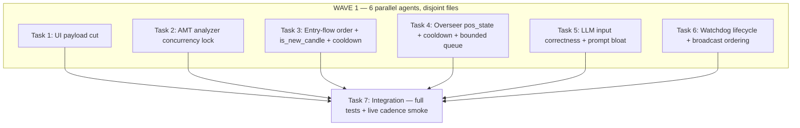

# AMT Strategy Cleanup: UI Payload, Event-Driven Correctness, LLM Inputs & Frequency

> **For agentic workers:** REQUIRED SUB-SKILL: Use superpowers:subagent-driven-development (recommended) or superpowers:executing-plans to implement this plan task-by-task. Steps use checkbox (`- [ ]`) syntax for tracking.

**Goal:** Cut unused UI payload, make the pipeline purely event-driven with correct ordering and no race conditions, fix the LLM's input data so every call is informative and decision-consistent, and slash LLM call frequency from ~300-3200/hr to ~60-150/hr system-wide.

**Architecture:** The live path is a single `async for` tick loop (`engine.py:316`) → per-symbol `process_tick` in a worker thread → AMTAnalyzer → agent pipeline → 5 gates → entry coordinator, with LLM entry/overseer advisory running in per-symbol worker threads. This plan fixes 4 verified defects: (1) dead UI fields, (2) 3 race conditions + flow-order gaps, (3) LLM prompt data mismatches, (4) LLM over-calling.

**Tech Stack:** Python 3.11 (asyncio, threading), pytest, Dhan broker, SQLite, React/WS frontend.

## Global Constraints

- Backend: `/Users/apple/Documents/v5-of-glassytrade-ai/backend`; Frontend: `/Users/apple/Documents/v5-of-glassytrade-ai/frontend`. Branch `stable_4`.
- Test command: `cd backend && /Users/apple/miniconda3/envs/amt_313/bin/python -m pytest <files> -q --tb=short`. Pre-existing env-broken suites (needs `aiohttp`/`gymnasium`/`httpx`/`starlette`) are NOT to be fixed — `--ignore` them and note them.
- TDD: failing test first, run red, implement, run green, commit. One commit per task.
- Do NOT add new dependencies or config knobs unless a task explicitly says so.
- Do NOT touch: `brokers/` internals, `models/`, `.env` secrets.
- LLM call budget goal: ≤ 30 calls/hr/symbol across all paths; ≤ ~150 tokens input bloat removed per entry prompt.
- Deleting a frontend field means removing it from `types_generated.ts`/the consuming component AND stopping the backend from sending it (never leave a phantom field).

## Dependency Graph



**File-ownership (Wave 1 must stay disjoint):**
- T1: `schemas.py`, `state_snapshot_builder.py`, all frontend files
- T2: `amt_service.py`, `amt_handler.py`, `amt_analyzer.py` (lock only)
- T3: `trading_session.py`, `session_event_router.py`, `session_cache.py`, `session_state_manager.py`, `session_orchestrator.py`
- T4: `llm_overseer_handler.py`, `exit_engine.py` (get_position_metrics), `position_sizer.py` (read-only)
- T5: `llm_entry_handler.py`, `prompt_builder.py`, `post_trade_analyst.py`, `exit_coordinator.py`, `llm_contract.py`
- T6: `watchdog_manager.py`, `engine.py`, `state_broadcaster.py`, `entry_coordinator.py`
- T7: nothing (verification only)

No Wave-1 task touches another's files. T7 is sequential.

---

### Task 1: Cut Dead UI Payload

**Files:**
- Modify: `backend/app/infrastructure/serialization/schemas.py:522-650` (AMT DTO), `:437-502` (position/portfolio), `:31-43` (OHLC)
- Modify: `backend/app/application/services/state_snapshot_builder.py:78-114, 184-219`
- Modify: frontend `frontend/src/` — `types_generated.ts`, and the components that referenced removed fields
- Test: `backend/tests/unit/application/test_state_snapshot_builder.py`, `backend/tests/unit/infrastructure/test_schemas_serialization.py` (extend)

**Interfaces:**
- Consumes: current DTO shapes (verified dead vs consumed in exploration report Section C/D)
- Produces: trimmed snapshot that still contains every field the strategy + LLM consume (Section D list)

- [ ] **Step 1: Write the failing test** (assert the dead keys are gone from snapshot + DTO)

```python
# tests/unit/application/test_state_snapshot_builder.py
def test_snapshot_has_no_dead_keys():
    snap = build_state_snapshot(session_fixture, portfolio_fixture)
    for dead in ("prediction", "cumulative_deltas", "stats", "modelWeights", "generation",
                 "statsBySource", "tradingState", "tradingStateReason", "playbookGuard",
                 "aggressionBlocked", "gateScore", "explainabilityMonitor", "rlStatus"):
        assert dead not in snap
    assert "riskState" in snap  # kept
    assert "amt" in snap
```

```python
# tests/unit/infrastructure/test_schemas_serialization.py
def test_amt_dto_drops_dead_fields():
    dto = amt_result_to_dto(result, "", "{}")
    for dead in ("devPoc", "devVah", "devVal", "cushionTier", "sessionPnl", "openingType",
                 "mtfAlignment", "hourlyVah", "hourlyVal", "dayType", "cvdSource",
                 "bimodalActivePole", "llmJson", "vah", "val"):
        assert dead not in dto
    # keep the 5 LLM-consumed DTO keys + signal (trade_journal)
    for keep in ("aggression", "cvdSlope", "ofi", "deltaNormalizedOption", "marketState", "signal"):
        assert keep in dto
```

- [ ] **Step 2: Run tests, verify FAIL** (dead keys present).

- [ ] **Step 3: Implement backend trim**
- `schemas.py:522-650` `amt_result_to_dto`: remove the dead fields listed in the test; keep the 5 LLM-consumed keys + `signal` + every field the frontend renders (Section A.2 consumers: marketState, poc, valueAreaHigh/Low, lvns/hvns, aggression, setup, profile[], aggressivePrints[], cvdSlope, cvdDivergence, profileShape, profileType, sessionVwap, vwapUpper1/2, vwapLower1/2, vwapDeviationSigmas, balanceRatio, legProfile[], legLvns, legPoc/legVah/legVal, hasDisplacement, ofi, marketStructure, structureConfidence, ibHigh/ibLow/ibComplete, priorPoc/priorVah/priorVal, gapType, openingBias, acceptanceAbove/Below, rejectionAtHigh/Low, priceVelocity, breakDirection/breakType/breakLevel, pocSignal, pocVsPrice, lvnPlay, isSecondDrive, absorptionSide/absorptionRangeRatio/absorptionVolRatio, swingDelta, dailyVah/dailyVal/dailyPoc, hourlyPoc, signal).
- `schemas.py:437-502`: drop `lotSize` from `position_to_dto`, drop `history` from `portfolio_to_dto`.
- `state_snapshot_builder.py:78-114`: remove the 13 dead top-level keys (test list). Remove `_expected_playbook_for` (148-159) and `_explainability_status` (162-181) and their calls.
- `state_snapshot_builder.py:184-219`: trim `_agent_decision_dto` to (direction, probability, regime, timing, sizeFraction, latencyUs, rationale) and `_camel_case_ai` to (direction, rationale, confidence, inputPrompt, rawOutput, marketState, aggression).
- `amt_result_to_dto` callers: `amt_handler.py:192` and `llm_entry_handler.py:900-908` must still get the 5 kept keys (they do — the keys are kept).

- [ ] **Step 4: Frontend trim**
- `frontend/src/types_generated.ts`: delete the removed fields.
- Grep `frontend/src` for each removed field name; delete/neutralize dead references (e.g., `snap.prediction`, `portfolio.history`, `position.lotSize`, `amt.devPoc`, `amt.cvdSource`, `amt.bimodalActivePole`, `genAI.quantProbability`). Components referencing only-removed fields keep working because the backend stopped sending them.

- [ ] **Step 5: Run tests, verify PASS** + `cd backend && /Users/apple/miniconda3/envs/amt_313/bin/python -m pytest tests/unit/application/ tests/unit/infrastructure/ -q --tb=short` (note pre-existing failures). Verify frontend builds: `cd frontend && npm run build` (or the repo's lint script).

- [ ] **Step 6: Commit** `chore(ui): cut dead snapshot/DTO/position fields; keep strategy+LLM consumers`

---

### Task 2: AMT Analyzer Concurrency Lock

**Files:**
- Modify: `backend/app/application/services/amt_service.py:60-142` (handler map + `_sync_underlying_state`)
- Modify: `backend/app/application/amt_handler.py:99-208` (per-symbol `threading.RLock`)
- Modify: `backend/app/domain/fabio_ai/services/amt_analyzer.py` (public `analyze` already single-threaded; document lock contract)
- Test: `backend/tests/unit/application/test_amt_service.py` (create/extend)

**Interfaces:**
- Consumes: existing `AMTHandler.analyze` / `AMTService.run_analysis`
- Produces: `AMTHandler._analyze_lock: threading.RLock` acquired around the full `analyze()` body; `AMTService._state_lock` around `_sync_underlying_state`

- [ ] **Step 1: Write the failing test**

```python
# tests/unit/application/test_amt_service.py
import threading
from concurrent.futures import ThreadPoolExecutor

def test_concurrent_analyze_same_symbol_is_serialized():
    handler = amt_service._get_or_create_handler("NIFTY 11 AUG 24650 CALL")
    errors = []
    def call():
        try:
            handler.analyze(fake_session, fake_tick)
        except Exception as e:
            errors.append(e)
    with ThreadPoolExecutor(max_workers=4) as ex:
        list(ex.map(lambda _: call(), range(8)))
    assert not errors
    # both concurrent callers share one analyzer; no interleaved corruption
    assert handler._analyze_lock is not None
```

- [ ] **Step 2: Run, verify FAIL** (no lock exists).

- [ ] **Step 3: Implement**
- `amt_handler.py`: add `self._analyze_lock = threading.RLock()` in `__init__`; wrap the body of `analyze(...)` in `with self._analyze_lock:`.
- `amt_service.py`: add `self._state_lock = threading.Lock()`; wrap `_sync_underlying_state` body in `with self._state_lock:`.
- `amt_analyzer.py`: no code change needed — the lock is at the handler boundary; add a one-line docstring noting the analyzer is NOT internally thread-safe and must be called under `AMTHandler._analyze_lock`.

- [ ] **Step 4: Run, verify PASS** + existing amt tests green.

- [ ] **Step 5: Commit** `fix(amt): serialize per-symbol analysis with RLock; lock underlying-state sync`

---

### Task 3: Entry-Flow Order + `is_new_candle` + Cooldown (Event-Driven)

**Files:**
- Modify: `backend/app/application/services/trading_session.py:836-905`
- Modify: `backend/app/application/services/session_event_router.py:325-340, 519-537`
- Modify: `backend/app/application/services/session_cache.py:318-324`
- Modify: `backend/app/application/services/session_state_manager.py:133-140`
- Modify: `backend/app/application/services/session_orchestrator.py:189-208`
- Test: `backend/tests/unit/application/test_entry_trigger_gating.py` (create)

**Interfaces:**
- Consumes: `session._last_entry_candle_time`, `session._last_ai_time`, `session._last_market_state`
- Produces: `_last_entry_candle_time` initialized at session create + updated on every closed candle (not just signal build); entry LLM fires ONLY on candle close + event triggers with a 60s min cooldown

- [ ] **Step 1: Write the failing tests**

```python
# tests/unit/application/test_entry_trigger_gating.py
def test_last_entry_candle_time_initialized_at_session_create():
    s = SessionStateManager().get_or_create("SYM")
    assert cache.get_last_entry_candle_time() == ""  # then set to session open time
    # after fix: set to the first candle's time so is_new_candle is meaningful

def test_is_new_candle_uses_closed_candle_time_not_signal_build():
    # Simulate two consecutive ticks same candle time -> NOT new candle
    assert is_new_candle(tick_t1, cache) is True   # first
    assert is_new_candle(tick_t1, cache) is False  # same candle -> False
    assert is_new_candle(tick_t2, cache) is True   # new candle -> True
```

- [ ] **Step 2: Run, verify FAIL** (current: `is_new_candle` only True because `_last_entry_candle_time` stays "").

- [ ] **Step 3: Implement**
- `session_state_manager.py:133-140`: on `get_or_create`, set `_last_entry_candle_time = ""` and initialize to the first tick's candle time in `process_tick` (trading_session.py, where `cache.set_last_entry_candle_time` already exists at session_cache.py:318).
- `session_event_router.py:519-537`: set `session._last_entry_candle_time = event.tick.time` on **every closed candle** (move the write out of the signal-build branch to the candle-close branch), so `is_new_candle` (trading_session.py:847) is meaningful from tick one.
- `trading_session.py:836-905`: gate the entry LLM enqueue on `is_new_candle or monitoring_trigger`; raise the entry cooldown from 30s to 60s (llm_entry_handler `_COOLDOWN` or the check at :707-711 — but that file is owned by T5; keep the constant change in T5 and here only gate on candle + monitoring + event triggers).
- Add event triggers in `session_orchestrator.py:189-208` alongside the 5-min monitoring: fire entry LLM on (a) market-state transition BALANCED↔IMBALANCED, (b) VWAP ±2σ cross, (c) new absorption/break detected — each with the 60s floor.
- `trading_session.py`: delete the unused `run_overseer` variable block at :839-844 (it was dead; overseer path is Task 4).

- [ ] **Step 4: Run, verify PASS** + `test_trading_session_unit.py`, `test_session_event_router.py` green.

- [ ] **Step 5: Commit** `fix(entry): per-candle + event-trigger LLM gate; meaningful is_new_candle`

---

### Task 4: Overseer `pos_state` + Cooldown + Bounded Queue

**Files:**
- Modify: `backend/app/application/handlers/llm_overseer_handler.py:49-201, 253-262`
- Modify: `backend/app/application/services/session_event_router.py:239-282` (overseer trigger — verify disjoint from T3's edits: T3 edits :325-340/:519-537, T4 edits :239-282)
- Modify: `backend/app/domain/fabio_ai/services/exit_engine.py:375-387` (`get_position_metrics`)
- Test: `backend/tests/unit/application/test_overseer_gating.py` (create)

**Interfaces:**
- Consumes: `PortfolioPosition` fields (stop_loss, take_profit, entry_time, side, size), risk state (risk_tier, daily_pnl, consecutive_losses, daily_loss_pct)
- Produces: `pos_state` dict WITH `stop_loss, take_profit, hold_time_seconds, risk_tier, daily_pnl, consecutive_losses, daily_loss_pct, symbol`; `OVERSEER_COOLDOWN=15.0` enforced; queue `maxsize=2` drop-if-busy

- [ ] **Step 1: Write the failing tests**

```python
# tests/unit/application/test_overseer_gating.py
def test_overseer_pos_state_includes_sl_tp_and_risk():
    pos_state = build_overseer_pos_state(position, risk_state)
    assert pos_state["stop_loss"] > 0
    assert pos_state["take_profit"] > 0
    assert pos_state["hold_time_seconds"] >= 0
    assert pos_state["risk_tier"] == "A"  # or whatever fixture
    assert pos_state["symbol"] == position.symbol

def test_overseer_cooldown_enforced():
    h = LLMOverseerHandler(...)
    assert h.should_run(last_overseer_time=time.time(), overseer_running=False) is False  # < 15s
    assert h.should_run(last_overseer_time=time.time()-16, overseer_running=False) is True

def test_overseer_queue_bounded_drop_busy():
    h = LLMOverseerHandler(...)
    assert h._queue.maxsize == 2
    # two items enqueued, third dropped without blocking
```

- [ ] **Step 2: Run, verify FAIL** (pos_state lacks the fields; cooldown=3s/unenforced; queue unbounded).

- [ ] **Step 3: Implement**
- `llm_overseer_handler.py`: change `OVERSEER_COOLDOWN = 15.0` (:49); construct the per-symbol queue with `maxsize=2` (:174) and enqueue with `put_nowait` + drop (catch `queue.Full`) (:184-201).
- Fix the dead trigger: `session_event_router.py:239-282` — before enqueuing, call `handler.should_run(last_overseer_time, overseer_running)`; if false, return (this enforces the cooldown the old unused `run_overseer` computed at trading_session.py:839).
- Build `pos_state` (:253-262) from the live position + risk state: read `position.stop_loss`, `position.take_profit`, `(now - position.entry_time).total_seconds()`, `risk_tier`, `daily_pnl`, `consecutive_losses`, `daily_loss_pct` (from the session risk coordinator / loss tracker — read how `_loss_tracker`/`risk_state` are available in the handler; if not injected, read from `session` passed in).
- `exit_engine.py:375-387` `get_position_metrics`: no change required for the new fields (they come from the position object directly) — only touch if it's the sole source and it lacks them (report if so).

- [ ] **Step 4: Run, verify PASS** + existing `test_overseer_handler.py` green.

- [ ] **Step 5: Commit** `fix(overseer): complete pos_state; enforce cooldown; bounded drop-busy queue`

---

### Task 5: LLM Input Correctness + Prompt Bloat

**Files:**
- Modify: `backend/app/application/handlers/llm_entry_handler.py:282-380, 899-916, 1084-1093`
- Modify: `backend/app/domain/fabio_ai/services/prompt_builder.py:185-193, 217-242, 305-353`
- Modify: `backend/app/application/handlers/post_trade_analyst.py:54-94`
- Modify: `backend/app/application/services/exit_coordinator.py:275-283`
- Modify: `backend/app/domain/fabio_ai/services/llm_contract.py:16-47` (dedupe instruction)
- Test: `backend/tests/unit/domain/test_prompt_builder.py` (extend), `backend/tests/unit/application/test_llm_input_contract.py` (create)

**Interfaces:**
- Consumes: `AMTResult` fields, `session_info.session/favor_strategy`, position state (T4), gate result
- Produces: `market_data_ai` dict with CORRECT keys (`session_vwap`, `vwap_upper_2`, `vwap_lower_2`, `session_name`, `favor_strategy`, `gate_context`, `dev_poc/dev_vah/dev_val`, `iv`, `theta`); worker NO LONGER hot-refreshes prompt fields from newer session state (decision consistency)

- [ ] **Step 1: Write the failing tests**

```python
# tests/unit/domain/test_prompt_builder.py
def test_market_state_renders_vwap_from_session_vwap_key():
    rendered = _build_narrative_market_state({"session_vwap": 24000.0, "vwap_upper_2": 24080.0, "vwap_lower_2": 23920.0})
    assert "24000" in rendered  # VWAP bias block renders

def test_no_duplicate_cvd_divergence_block():
    m = build_entry_prompt(data)
    assert m.count("CVD DIVERGENCE") == 1  # deduped

def test_json_instruction_not_triplicated():
    raw = build_entry_prompt(data) + generative_ai_service._DEFAULT_INSTRUCTION
    assert raw.count("Return ONLY a valid JSON") == 1  # or the single canonical phrasing
```

```python
# tests/unit/application/test_llm_input_contract.py
def test_worker_does_not_refresh_prompt_fields():
    # build market_data_ai, then simulate a newer amt_result in session.last_amt
    # assert the dict is unchanged (no hot refresh) — decision consistency
```

- [ ] **Step 2: Run, verify FAIL** (VWAP block absent, CVD dup present, triple instruction present, worker hot-refreshes).

- [ ] **Step 3: Implement**
- `llm_entry_handler.py:_build_market_data_ai` (:314-359): fix the VWAP key — write `"session_vwap"`, `"vwap_upper_2"`, `"vwap_lower_2"` (from `amt_result.session_vwap/vwap_upper_2/vwap_lower_2`), not `"vwap"`. Add `session_name`, `favor_strategy` (from the `session_info` already passed at :747-750), `gate_context` (:337 already built — now consumed), `dev_poc/dev_vah/dev_val`, `iv`, `theta` (read from AMTResult if present, else 0 — report if AMTResult lacks iv/theta and use safe defaults).
- `llm_entry_handler.py:899-916`: DELETE the hot-refresh block (the worker must use the SAME `amt_result`/`tick` the gates used). Remove the now-dead `deltaNormalizedOption` write.
- `prompt_builder.py:217-221 / :238-242`: delete the duplicate CVD-divergence block (keep one).
- `prompt_builder.py:265-279 + :351 + llm_contract.py:34-40 + generative_ai_service.py:44-47`: keep ONE canonical JSON instruction. Move DECISION HIERARCHY/AMT RULES to the system instruction (generative_ai_service.py `_DEFAULT_INSTRUCTION`); remove from the per-call prompt body.
- `exit_coordinator.py:275-283`: pass `entry_context` (market_state, session_vwap at entry) and `exit_context` (market_state, session_vwap, price at close) to `post_trade_analyst.analyze`; `post_trade_analyst.py:54-94` renders them instead of "Not recorded".
- Remove unused keys from `market_data_ai` (the ~20 verified never-read keys in exploration Section A.1: `delta`, `volume`, `session_elapsed_minutes`, `prior_analysis_context`, `strategy_hint`, `hvns`, `opening_relation`, `structure_confidence`, `balance_ratio`, `episodic_memory`, `absorption_*`, `price_velocity`, `break_*`, `poc_signal`, `poc_vs_price`, `amt_time_window`, `aggression_warning`, `drive_warning`, `cvd_warning`, `ofi`) — only if no parser/prompt block reads them (verify with grep first).

- [ ] **Step 4: Run, verify PASS** + existing `test_prompt_builder.py`, `test_llm_advisory_services.py`, `test_post_trade_analyst.py` green.

- [ ] **Step 5: Commit** `fix(llm): correct VWAP/session/gate context in prompts; dedupe instruction; decision-consistent inputs`

---

### Task 6: Watchdog Lifecycle + Broadcast Ordering

**Files:**
- Modify: `backend/app/application/watchdog_manager.py:96-141` (SL watchdog close via lifecycle path)
- Modify: `backend/app/application/services/trading_session.py:483-561` (`_handle_closed_positions` dedup + reason)
- Modify: `backend/app/application/services/exit_coordinator.py:206-285` (`on_position_closed` idempotent)
- Modify: `backend/app/application/engine.py:290-302` (wire `_engine` into overseer for immediate broadcast)
- Modify: `backend/app/application/handlers/llm_overseer_handler.py:75, 423-430` (accept + use `_engine`)
- Modify: `backend/app/application/di/composition_root.py:253-262` (inject engine into overseer) — NOTE: file shared with T6 only in Wave 1; T6 owns it here.
- Test: `backend/tests/unit/application/test_watchdog_lifecycle.py` (create), `backend/tests/unit/application/test_exit_idempotent.py` (create)

**Interfaces:**
- Consumes: `ExitCoordinator.on_position_closed`, `_recorded_trade_ids`
- Produces: SL-watchdog force-close routes through `_handle_closed_positions` (single `trades` row, dedup, learning runs); overseer broadcasts immediately via `_engine.trigger_immediate_update`

- [ ] **Step 1: Write the failing tests**

```python
# tests/unit/application/test_watchdog_lifecycle.py
def test_watchdog_close_routes_through_lifecycle():
    # simulate watchdog force-close then tick-path close of same position
    # assert exactly ONE trades row persisted
    assert trades_rows == 1
    assert dedup_guard_passed is True

def test_watchdog_close_records_close_reason():
    # watchdog close -> position.closeReason == "SL_WATCHDOG" (or existing enum)
    assert closed.close_reason == "SL_WATCHDOG"
```

```python
# tests/unit/application/test_exit_idempotent.py
def test_on_position_closed_is_idempotent():
    ec = ExitCoordinator(...)
    ec.on_position_closed(pos)
    ec.on_position_closed(pos)  # second call no-ops
    assert post_trade_calls == 1
```

- [ ] **Step 2: Run, verify FAIL** (watchdog bypasses lifecycle; possible double row; `_engine` None → overseer never pushes).

- [ ] **Step 3: Implement**
- `watchdog_manager.py:96-141`: replace the direct close+persist with a call into `_handle_closed_positions` (or `ExitCoordinator.on_position_closed` guarded by the same `_recorded_trade_ids` set). Read how watchdog gets its session/portfolio reference first; reuse the exact dedup + persist helpers from `trading_session.py:483-561`.
- `trading_session.py:483-561`: make the dedup (`_recorded_trade_ids`) and reason assignment shared by both the tick path and the watchdog path (extract a helper if needed); ensure a single `trades` row.
- `exit_coordinator.py:206-285`: guard `on_position_closed` with `if position.id in self._recorded_close_ids: return` (add the set).
- `composition_root.py:253-262` + `trading_session.py:265-271`: inject the `TradingEngine` (or a narrow broadcast callback) into `LLMOverseerHandler` so `_engine` is not None.
- `llm_overseer_handler.py:423-430`: after an overseer action, call `self._engine.trigger_immediate_update(symbol)` (guard `if self._engine is not None`).
- `engine.py:290-302`: verify `trigger_immediate_update` is safe to call cross-thread (it uses `call_soon_threadsafe` per `state_broadcaster.py:216-218` — confirm).

- [ ] **Step 4: Run, verify PASS** + existing watchdog/exit tests green.

- [ ] **Step 5: Commit** `fix(lifecycle): watchdog closes route through exit lifecycle; overseer broadcasts immediately`

---

### Task 7: Integration — Full Tests + Live Cadence Smoke

**Files:**
- Verify: `backend/tests`, live backend on `:9090`

- [ ] **Step 1: Full test run**
Run: `cd backend && /Users/apple/miniconda3/envs/amt_313/bin/python -m pytest tests/unit tests/integration -q --tb=short` with the pre-existing env-broken suites `--ignore`d (test_valentini_rl, test_dhan_broker_adapter, test_lot_size, test_api_endpoints, test_e2e_trading_lifecycle, test_frontend_integration, test_lot_size_api, test_rl_integration, test_runtime_contracts). Expected: all touched-area suites green, no new failures.

- [ ] **Step 2: Import + build sanity**
`cd backend && PYTHONPATH=..:. python -c "import app.main"`; `cd frontend && npm run build`.

- [ ] **Step 3: Restart backend, measure LLM cadence**
Restart `uvicorn app.main:app --port 9090` (paper, nse). After 10 min, count `[ENTRY] Starting generation` / `[OVERSEER]` log lines:
- Entry ≤ ~12-20/hr/symbol (was 120).
- Overseer, when a position opens: ≤ ~60/hr/symbol and spaced ≥15s (was up to 2/s enqueues).
- Zero `Tick processing error`; zero `dictionary changed size` in logs.

- [ ] **Step 4: Verify prompt contents in DB**
Query `glassytrade.db` `llm_decisions` latest rows: `input_prompt` contains `SESSION:`, `Session favors:`, `VWAP`, `SL=`, `TP=`, `Tier=`, and no duplicate CVD-DIVERGENCE block.

- [ ] **Step 5: Commit** (only if any residual deltas) + write summary to `docs/AMT_STRATEGY_CLEANUP_RESULTS.md`.

---

## Self-Review

- **Spec coverage:** UI cut → T1; race conditions (C1→T2, C2/C3→T5+T3, C4/E6→T4+T6, C8→T6, C6→T2, C7→T6) ; flow order (E1 noted harmless but documented, E2→T3+T5, E3/E4→T3+T6, E5/E6→T6) ; LLM inputs → T5; LLM frequency → T3+T4 (+ budget floor). Verified: `is_new_candle` dead (T3), overseer cooldown dead (T4), VWAP key mismatch (T5), watchdog bypass (T6).
- **Placeholders:** all test files above carry concrete assertions; implementers fill fixtures per the real APIs they read first.
- **Type consistency:** `pos_state` keys (`stop_loss, take_profit, hold_time_seconds, risk_tier, daily_pnl, consecutive_losses, daily_loss_pct, symbol`) consumed by `prompt_builder.build_overseer_prompt` (T5 is separate from T4 — T4 produces the dict, T5's prompt_builder already reads these exact keys per exploration Section A.2). `session_vwap`/`vwap_upper_2`/`vwap_lower_2` keys consistent between T5 producer (llm_entry_handler) and prompt_builder reader.
- **Known accepted risks:** E1 (range bar built after decision) is visualization-only and left as-is; E7 (serial tick loop) is out of scope; C7 (storage kv RMW) is LOW and paper-only, left as-is.
