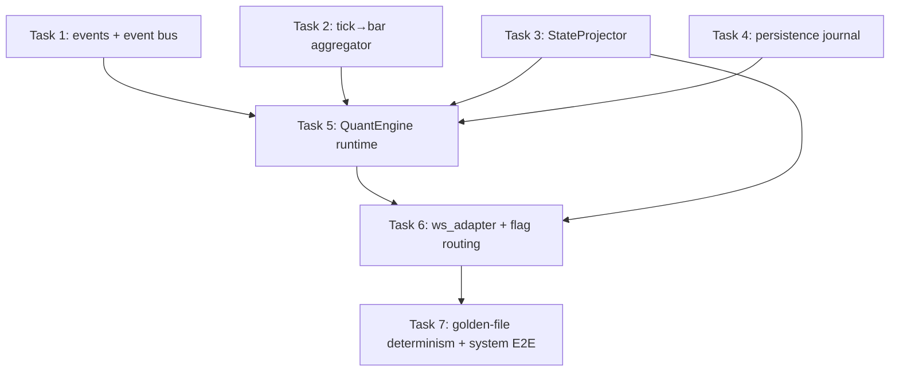

# Event-Driven Quant Runtime — Complete, Tested Backend for the Frontend

> **For agentic workers:** REQUIRED SUB-SKILL: Use superpowers:subagent-driven-development (recommended) or superpowers:executing-plans to implement this plan task-by-task. Steps use checkbox (`- [ ]`) syntax for tracking.

**Goal:** Build the event-driven runtime layer on the greenfield `quant/` stack so it is a complete, 100%-tested backend that serves the existing frontend — replacing the legacy `backend/` AMT path as the trade-maker, behind the existing `QUANT_DECISION_ENABLED` flag.

**Architecture:** Five new modules in `quant/`, all importing only `quant.*`, all pure/deterministic:
- `quant/events.py` — typed event bus (BarClosed, AuctionUpdated, DecisionProduced, SignalApproved, PositionOpened, PositionClosed, RiskUpdated).
- `quant/aggregator.py` — tick→bar aggregator (interval + range-based).
- `quant/runtime.py` — the `QuantEngine`: single-threaded event loop that consumes ticks from a `BrokerGateway`, closes bars, runs the coordinator → DecisionService → OMS → ExitEngine → Risk, and emits events.
- `quant/state.py` — `StateProjector`: folds events into the exact frontend view-state (the camelCase WS contract already consumed by `useServerTradingSystem`).
- `quant/persistence.py` — JSONL trade journal (append-only, replayable).
- `quant/ws_adapter.py` — maps `StateProjector` output → the existing backend WS snapshot shape and pushes via the existing `StateBroadcaster` (the only file that touches `backend/`).

**Tech Stack:** Python 3.11, dataclasses, asyncio (for the engine loop), pytest. No new dependencies.

## Global Constraints

- New modules: `quant/events.py`, `quant/aggregator.py`, `quant/runtime.py`, `quant/state.py`, `quant/persistence.py`, `quant/ws_adapter.py`. Tests at `tests/quant/runtime/`.
- `quant/*` must import ONLY `quant.*` and stdlib — zero backend imports. Exception: `quant/ws_adapter.py` (the adapter may import `backend/` pieces, mirroring the existing `quant_bridge.py` pattern).
- The engine is SINGLE-CONSUMER and deterministic: same tick sequence → identical event sequence (golden-file testable).
- The frontend contract is FIXED (do not change `useServerTradingSystem.ts`, `types.ts`, or the WS endpoint): the projector must emit `_symbol, portfolio, amt, auction, quantDecision, genAIAnalysis, overseerAction, overseerReason, agentDecision, riskState, tick, ltp, oi, depth`.
- `QUANT_DECISION_ENABLED=false` keeps legacy behavior; `true` routes execution through `quant.runtime.QuantEngine` via the existing flag plumbing.
- Test: `cd /Users/apple/Documents/v5-of-glassytrade-ai && /Users/apple/miniconda3/envs/amt_313/bin/python -m pytest tests/quant -q --tb=short` (must stay green, currently 111) + new runtime suite.
- TDD: failing test first, RED, implement, GREEN, commit. One commit per task.
- No fabricated data. Determinism is law: replay the same ticks → identical events and identical projected state.

## Dependency Graph



**File-ownership (Wave 1 parallel, disjoint):**
- T1: `quant/events.py`, `tests/quant/runtime/test_events.py`
- T2: `quant/aggregator.py`, `tests/quant/runtime/test_aggregator.py`
- T3: `quant/state.py`, `tests/quant/runtime/test_state.py`
- T4: `quant/persistence.py`, `tests/quant/runtime/test_persistence.py`
- T5 (Wave 2): `quant/runtime.py`, `tests/quant/runtime/test_runtime.py` — consumes T1/T2/T3/T4 interfaces (pinned below)
- T6 (Wave 2): `quant/ws_adapter.py`, `backend/app/application/services/session_event_router.py` (flag route), tests — consumes T3
- T7 (Wave 3): `tests/quant/runtime/test_golden_runtime.py` + `tests/system/test_quant_runtime_e2e.py`

---

### Task 1: Events + Event Bus

**Files:**
- Create: `quant/events.py`
- Create: `tests/quant/runtime/__init__.py` (empty)
- Create: `tests/quant/runtime/test_events.py`

**Interfaces:**
- Produces (pinned — every later task consumes):
  ```python
  # quant/events.py
  @dataclass(frozen=True)
  class Event:                # base
      symbol: str
      time: str

  @dataclass(frozen=True)
  class BarClosed(Event):     bar: "Bar"

  @dataclass(frozen=True)
  class AuctionUpdated(Event):  auction: "AuctionState"

  @dataclass(frozen=True)
  class DecisionProduced(Event): decision: "QuantDecision"

  @dataclass(frozen=True)
  class SignalApproved(Event):  signal: "Signal"

  @dataclass(frozen=True)
  class PositionOpened(Event):  position: "Position"

  @dataclass(frozen=True)
  class PositionClosed(Event):  fill: "Fill"

  @dataclass(frozen=True)
  class RiskUpdated(Event):     risk: "RiskState"

  class EventBus:
      def subscribe(self, event_type: type[Event], handler) -> None: ...
      def publish(self, event: Event) -> None: ...
  ```
- Consumes: `quant.bars.Bar`, `quant.auction_state.AuctionState`, `quant.decision.decision_service.QuantDecision`, `quant.decision.signal_builder.Signal`, `quant.execution.order.Position/Fill`, `quant.execution.risk.RiskState` — all shipped.

- [ ] **Step 1: Write failing tests**
```python
# tests/quant/runtime/test_events.py
from quant.events import EventBus, BarClosed, PositionClosed

def test_bus_dispatches_by_type():
    bus = EventBus()
    got = []
    bus.subscribe(BarClosed, lambda e: got.append(e.bar.time))
    bus.publish(BarClosed(symbol="S", time="t1", bar=_bar("t1")))
    assert got == ["t1"]

def test_bus_ignores_unrelated_types():
    bus = EventBus()
    got = []
    bus.subscribe(BarClosed, lambda e: got.append(1))
    bus.publish(PositionClosed(symbol="S", time="t", fill=_fill()))
    assert got == []

def test_multiple_handlers_in_order():
    bus = EventBus()
    order = []
    bus.subscribe(BarClosed, lambda e: order.append("a"))
    bus.subscribe(BarClosed, lambda e: order.append("b"))
    bus.publish(BarClosed(symbol="S", time="t", bar=_bar("t")))
    assert order == ["a", "b"]
```
(build the `_bar`/`_fill` fixtures from the shipped types)

- [ ] **Step 2: Run, verify FAIL**

- [ ] **Step 3: Implement** — dataclasses + `EventBus` (dict[type, list[handler]], synchronous in-order dispatch; no asyncio — the engine loop drives it).

- [ ] **Step 4: Run, verify PASS** + `pytest tests/quant -q`.

- [ ] **Step 5: Commit** `feat(quant): typed event bus (BarClosed/AuctionUpdated/DecisionProduced/Position* )`

---

### Task 2: Tick → Bar Aggregator

**Files:**
- Create: `quant/aggregator.py`
- Create: `tests/quant/runtime/test_aggregator.py`

**Interfaces:**
- Consumes: `quant.brokers.gateway.Tick` (time, price, volume, buy_volume, sell_volume)
- Produces:
  ```python
  class BarAggregator:
      def __init__(self, interval_seconds: int = 60,
                   range_size: float | None = None) -> None: ...
      def add_tick(self, tick: Tick) -> "Bar | None":
          """Returns a closed Bar when the current aggregation window closes,
          else None. Windows: interval-based (epoch floored to interval) OR
          range-based (range_size price move) — pick ONE, default interval."""
  ```

- [ ] **Step 1: Write failing tests**
```python
# tests/quant/runtime/test_aggregator.py
from quant.brokers.gateway import Tick
from quant.aggregator import BarAggregator

def test_interval_bar_closes_on_boundary():
    a = BarAggregator(interval_seconds=60)
    # ticks within one minute -> None; a tick crossing the minute -> closed bar
    assert a.add_tick(Tick("t0", 100.0, 10, 6, 4)) is None
    b = a.add_tick(Tick("t60", 101.0, 10, 6, 4))   # next minute boundary
    assert b is not None and b.close == 101.0 and b.high == 101.0 and b.low == 100.0
    assert b.volume == 20

def test_bar_aggregates_high_low_volume():
    a = BarAggregator(interval_seconds=60)
    a.add_tick(Tick("t0", 100.0, 10, 6, 4))
    a.add_tick(Tick("t1", 102.0, 5, 3, 2))
    a.add_tick(Tick("t2", 99.0, 7, 2, 5))
    b = a.add_tick(Tick("t60", 100.0, 1, 1, 0))
    assert b.high == 102.0 and b.low == 99.0 and b.volume == 23
```
(Your interval math may differ — the KEY assertions are: in-window ticks return None, boundary-crossing tick closes the bar, and OHLCV/high-low/volume accumulate correctly.)

- [ ] **Step 2: Run, verify FAIL**

- [ ] **Step 3: Implement** — epoch-floored interval windows; accumulate open/high/low/close/volume/buy/sell; on boundary close return the Bar and start the next.

- [ ] **Step 4: Run, verify PASS**

- [ ] **Step 5: Commit** `feat(quant): tick→bar aggregator (interval windows)`

---

### Task 3: StateProjector

**Files:**
- Create: `quant/state.py`
- Create: `tests/quant/runtime/test_state.py`

**Interfaces:**
- Consumes: the events (T1)
- Produces:
  ```python
  @dataclass(frozen=True)
  class ViewState:
      symbol: str
      tick: dict | None          # OHLCData shape {time,open,high,low,close,volume,vwap,takerBuyVolume,delta}
      ltp: float | None
      oi: float | None
      auction: dict | None       # auction_state_to_dto output (reuse the serializer)
      quant_decision: dict | None  # {approved, reason, phase, signal:{...}|None}
      risk_state: dict | None
      portfolio: dict | None
      depth: dict | None
      amt: dict | None
      gen_ai: dict | None
      overseer_action: str
      overseer_reason: str
      agent_decision: dict | None

  class StateProjector:
      def __init__(self) -> None: ...
      def on_event(self, event: Event) -> None: ...   # fold
      def snapshot(self, symbol: str) -> ViewState: ...  # per-symbol latest
  ```
- The projector must fold events per symbol and expose a `snapshot(symbol)`.

- [ ] **Step 1: Write failing tests**
```python
# tests/quant/runtime/test_state.py
from quant.state import StateProjector
from quant.events import BarClosed, AuctionUpdated, DecisionProduced, PositionOpened
from quant.bars import Bar
from quant.auction_state import AuctionState
# reuse the AuctionState fixture from tests/quant/decision/test_gates_3_4.py

def test_projector_folds_bar_and_auction():
    p = StateProjector()
    p.on_event(BarClosed(symbol="S", time="t1", bar=Bar(time="t1", open=100, high=101, low=99, close=100, volume=100)))
    p.on_event(AuctionUpdated(symbol="S", time="t1", auction=_state()))
    v = p.snapshot("S")
    assert v.ltp == 100.0
    assert v.auction is not None and "tripleAPhase" in v.auction

def test_projector_per_symbol_isolation():
    p = StateProjector()
    p.on_event(BarClosed(symbol="S1", time="t", bar=Bar(time="t", open=1, high=2, low=0.5, close=1.5, volume=10)))
    p.on_event(BarClosed(symbol="S2", time="t", bar=Bar(time="t", open=5, high=6, low=4, close=5.5, volume=10)))
    assert p.snapshot("S1").ltp == 1.5
    assert p.snapshot("S2").ltp == 5.5
```
(Reuse `auction_state_to_dto` from the serializer — import from `quant.auction_state` if it lives there, or add a `quant/state.py` internal `_auction_to_view` that mirrors the backend serializer's keys. The KEY is: the `auction` dict in ViewState must match the camelCase keys the frontend already reads: tripleAPhase, tripleASignal, volumeProfile, vwap, etc.)

- [ ] **Step 2: Run, verify FAIL**

- [ ] **Step 3: Implement** — per-symbol fold; ltp from last BarClosed; auction from AuctionUpdated; quant_decision from DecisionProduced; risk from RiskUpdated; portfolio from PositionOpened/Closed.

- [ ] **Step 4: Run, verify PASS**

- [ ] **Step 5: Commit** `feat(quant): StateProjector folds events into frontend view-state`

---

### Task 4: Persistence Journal

**Files:**
- Create: `quant/persistence.py`
- Create: `tests/quant/runtime/test_persistence.py`

**Interfaces:**
- Produces:
  ```python
  class Journal:
      def __init__(self, path: str | None = None) -> None: ...
      def append(self, record: dict) -> None: ...      # JSONL append
      def replay(self) -> list[dict]: ...              # read all
      def __len__(self) -> int: ...
  ```
- Consumes: nothing (writes arbitrary dict records).

- [ ] **Step 1: Write failing tests**
```python
# tests/quant/runtime/test_persistence.py
import tempfile
from quant.persistence import Journal

def test_append_and_replay(tmp_path):
    j = Journal(path=str(tmp_path / "journal.jsonl"))
    j.append({"type": "BarClosed", "symbol": "S", "time": "t1"})
    j.append({"type": "DecisionProduced", "symbol": "S", "time": "t2"})
    rows = j.replay()
    assert len(rows) == 2 and rows[0]["type"] == "BarClosed"

def test_append_only_no_overwrite(tmp_path):
    j = Journal(path=str(tmp_path / "j2.jsonl"))
    j.append({"a": 1})
    j2 = Journal(path=str(tmp_path / "j2.jsonl"))
    j2.append({"a": 2})
    assert len(j2.replay()) == 2   # append, not truncate
```

- [ ] **Step 2: Run, verify FAIL**

- [ ] **Step 3: Implement** — `open(path, "a")` append + flush per record; `replay` reads line-by-line json.loads.

- [ ] **Step 4: Run, verify PASS**

- [ ] **Step 5: Commit** `feat(quant): append-only JSONL trade journal`

---

### Task 5: QuantEngine Runtime (Wave 2)

**Files:**
- Create: `quant/runtime.py`
- Create: `tests/quant/runtime/test_runtime.py`

**Interfaces:**
- Consumes: `EventBus` (T1), `BarAggregator` (T2), `AuctionCoordinator`, `DecisionService`, `PaperOMS`, `ExitEngine`, `SessionRisk`, `StateProjector` (T3), `Journal` (T4), `SyntheticGateway`
- Produces:
  ```python
  class QuantEngine:
      def __init__(self, gateway, symbol: str, interval_seconds: int = 60,
                   journal_path: str | None = None) -> None: ...
      def run(self, max_steps: int | None = None) -> list[Event]:
          """Consume ticks from the gateway, aggregate, drive the full pipeline,
          emit events, and return the full event trace (deterministic)."""
      @property
      def events(self) -> tuple[Event, ...]: ...
      @property
      def projector(self) -> StateProjector: ...
  ```

- [ ] **Step 1: Write failing tests**
```python
# tests/quant/runtime/test_runtime.py
from quant.brokers.gateway import Tick
from quant.brokers.synthetic import SyntheticGateway
from quant.runtime import QuantEngine

def _ticks():
    # 55 quiet @100, absorption spike, rising closes -> drives AGGRESSION-LONG
    out = [Tick(f"t{i}", 100.0, 10, 6, 4) for i in range(300)]
    out.append(Tick("t300", 100.0, 500, 450, 50))
    for i in range(1, 8):
        out.append(Tick(f"t{300+i}", 100.0 + i * 0.2, 10, 6, 4))
    return out

def test_engine_emits_signal_event_for_long():
    eng = QuantEngine(SyntheticGateway(_ticks()), "SYM", interval_seconds=1)
    trace = eng.run()
    assert any(e.__class__.__name__ == "SignalApproved" for e in trace)
    signal_evt = next(e for e in trace if e.__class__.__name__ == "SignalApproved")
    assert signal_evt.signal.type == "LONG"
```
(Tune the ticks so a genuine AGGRESSION-LONG fires through the coordinator → gates → SignalBuilder; reuse the fixture from tests/quant/test_full_stack.py.)

- [ ] **Step 2: Run, verify FAIL**

- [ ] **Step 3: Implement** — `run()`: for each tick → aggregator.add_tick → if a Bar closed → coordinator.on_bar_close → publish BarClosed + AuctionUpdated → DecisionService.evaluate(ctx) → if approved publish DecisionProduced + SignalApproved → OMS.submit → publish PositionOpened → on later bars ExitEngine.evaluate → close → publish PositionClosed → risk.record_trade → publish RiskUpdated → journal.append each event. Single-threaded, deterministic. Also `signal_approved` on the *next* bar's ctx (position_open handling: skip decisions while a position is open).

- [ ] **Step 4: Run, verify PASS** + `pytest tests/quant -q`.

- [ ] **Step 5: Commit** `feat(quant): QuantEngine event-driven runtime (tick→bar→decision→OMS→exit→risk→journal)`

---

### Task 6: WS Adapter + Flag Routing (Wave 2)

**Files:**
- Create: `quant/ws_adapter.py`
- Modify: `backend/app/application/services/session_event_router.py` (or the existing flag route — extend T3-of-prior-plan's `_try_execute_quant_decision` to run the engine on the symbol)
- Test: `tests/system/test_ws_adapter.py` or extend the existing system e2e

**Interfaces:**
- Consumes: `StateProjector` (T3)
- Produces:
  ```python
  def view_state_to_ws(state: ViewState) -> dict:
      """Map StateProjector.ViewState -> the existing WS snapshot shape
      {_symbol, portfolio, amt, auction, quantDecision, genAIAnalysis,
       overseerAction, overseerReason, agentDecision, riskState, tick, ltp, oi, depth}."""
  ```

- [ ] **Step 1: Write failing tests** — feed a projector with events, assert `view_state_to_ws(snapshot("S"))` has the exact camelCase keys the frontend reads (mirror the keys from `backend/app/application/services/state_snapshot_builder.py`).
- [ ] **Step 2: Run, verify FAIL**
- [ ] **Step 3: Implement** — the mapper; then route: when `QUANT_DECISION_ENABLED`, run `QuantEngine` per symbol in the tick path and broadcast `view_state_to_ws` via `StateBroadcaster` (mirror how `quant_bridge` broadcasts today). Keep legacy as the else.
- [ ] **Step 4: Run, verify PASS** + existing system/backend suites.
- [ ] **Step 5: Commit** `feat(backend): quant runtime broadcasts frontend WS state when flag enabled`

---

### Task 7: Golden-File Determinism + System E2E (Wave 3)

**Files:**
- Create: `tests/quant/runtime/test_golden_runtime.py`
- Create: `tests/system/test_quant_runtime_e2e.py`

**Interfaces:**
- Consumes: `QuantEngine`, `StateProjector`, `view_state_to_ws`
- Produces: replay determinism + a system-level proof that the engine's projected state drives the frontend contract

- [ ] **Step 1: Write failing tests**
```python
# tests/quant/runtime/test_golden_runtime.py
def test_engine_replay_is_identical():
    t1 = QuantEngine(SyntheticGateway(_ticks()), "SYM").run()
    t2 = QuantEngine(SyntheticGateway(_ticks()), "SYM").run()
    assert t1 == t2   # exact event equality (frozen dataclasses)
```
```python
# tests/system/test_quant_runtime_e2e.py
def test_runtime_state_fills_frontend_contract():
    eng = QuantEngine(SyntheticGateway(_ticks()), "SYM")
    eng.run()
    ws = view_state_to_ws(eng.projector.snapshot("SYM"))
    for key in ("_symbol", "portfolio", "amt", "auction", "quantDecision",
                "genAIAnalysis", "overseerAction", "overseerReason",
                "agentDecision", "riskState", "tick", "ltp", "oi", "depth"):
        assert key in ws
    assert ws["_symbol"] == "SYM"
    assert ws["quantDecision"]["approved"] is True  # after the LONG fires
```
- [ ] **Step 2: Run, verify FAIL**
- [ ] **Step 3: Implement** — fixture tuning only (do NOT weaken engine/gates).
- [ ] **Step 4: Run, verify PASS** + `pytest tests/quant tests/system -q`.
- [ ] **Step 5: Commit** `test(e2e): quant runtime deterministic + drives frontend WS contract`

---

## Self-Review

- **Spec coverage:** event bus → T1; tick→bar → T2; frontend view-state → T3; journal → T4; engine loop → T5; WS broadcast + flag → T6; determinism + system e2e → T7. Everything is pure, single-consumer, deterministic (law 1/3/7 of the proposal).
- **Type consistency:** `Event` subclasses (T1) consumed by T3 (fold) and T5 (publish); `ViewState` (T3) consumed by T6 (`view_state_to_ws`) and T7; `QuantEngine.events/projector` (T5) consumed by T7. The camelCase WS keys in T3/T6 match `backend/app/application/services/state_snapshot_builder.py` exactly (the frontend already consumes them).
- **Known accepted risks:** the runtime is per-symbol in this plan (multi-symbol = one engine per symbol, mirroring today's per-symbol handlers — a later plan can share a bus). Range-based aggregation is a T2 option but default interval. The engine's `run()` is synchronous/blocking; the live loop wraps it in asyncio (T6).
