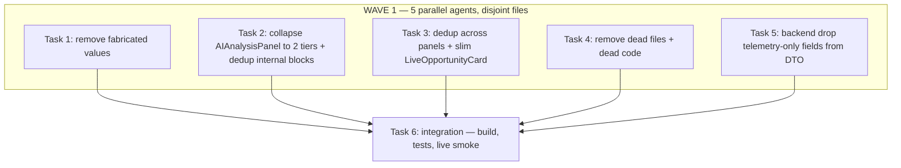

# Remove Fabricated/Dead/Duplicated UI Data — Frontend Declutter

> **For agentic workers:** REQUIRED SUB-SKILL: Use superpowers:subagent-driven-development (recommended) or superpowers:executing-plans to implement this plan task-by-task. Steps use checkbox (`- [ ]`) syntax for tracking.

**Goal:** Remove fabricated values (fake data shown as real), dead code, and cross-panel duplication from the frontend so the UI shows only truthful, decision-relevant information — once, not 2-5×.

**Architecture:** The backend contract is verified complete (`amt_result_to_dto` sends every field the UI reads; 44 AMT fields are decision-critical, 29 are telemetry-only). The problems are entirely frontend: (1) 8 fabricated renders, (2) a 1784-line AIAnalysisPanel with 3 internal duplicate blocks + ~12 collapse-able diagnostics, (3) cross-panel duplication (probability 5×, direction 4×, LTP 4×, marketState 4×), (4) 4 dead files + dead code. Fix = delete fabrications, collapse diagnostics behind a `details` toggle, keep ONE canonical render per datum, delete dead files.

**Tech Stack:** React/TS, vite, vitest.

## Global Constraints

- Frontend only: `/Users/apple/Documents/v5-of-glassytrade-ai/frontend`. Branch `stable_4`.
- Do NOT change backend contracts, do NOT add new fields.
- Do NOT touch strategy-decision data (POC/VAH/VAL, VWAP bands, IB, break, absorption, aggression, CVD, LVN play, agentDecision, genAIAnalysis, riskState, positions).
- Every datum must render in exactly ONE place after the plan (dedup rule). If a datum is genuinely useful in 2 contexts (chart line + panel), keep both ONLY if they serve different purposes (chart = spatial, panel = numeric) — otherwise one wins.
- Fabricated values (F) are REMOVED, not collapsed — fake data must not appear anywhere.
- `npm run build` + `npm test` (vitest) must pass after each task.
- TDD: where a test can assert the removal, write it RED first. For pure deletions, verify with grep + build.

## Dependency Graph



**File-ownership (Wave 1 disjoint):**
- T1: `components/AIAnalysisPanel.tsx` (fabricated blocks only), `components/ModelStateBanner.tsx`, `components/LiveOpportunityCard.tsx`, `components/ChartScene.tsx` (INSTITUTIONAL label only)
- T2: `components/AIAnalysisPanel.tsx` (structure/collapse + the 3 internal dup blocks) — NOTE: T1 and T2 both touch AIAnalysisPanel; split by line-region: T1 owns the F-blocks (147, 149-179, 401-423, 508-568, 732-751), T2 owns the C-blocks (674-753 vs 1270-1347 dup, 241-268 vs 1146-1161 dup, 926-951 vs 1422-1434 dup, and wrapping the diagnostic tiers in `<details>`)
- T3: `components/ModelStateBanner.tsx`, `components/LiveOpportunityCard.tsx`, `components/App.tsx`, `components/MarketSidebar.tsx`, `components/ChartScene.tsx` (DecisionCard overlay), `components/chart/DecisionCard.tsx`
- T4: delete `components/chart/SessionPhaseMarkers.ts`, `components/chart/ChartOverlayEngine.ts` + their tests; dead code in `LiveOpportunityCard.tsx` (Structural-Stop block), `ChartScene.tsx` (DecisionCard `timing` prop), `AIAnalysisPanel.tsx` (vwapStd const :1042), `AMTLevelsOverlay.ts` (dead exports), `ExecutionMarkersManager.ts` (dead exports)
- T5: `backend/app/infrastructure/serialization/schemas.py` (`amt_result_to_dto` only)

No Wave-1 task touches another's file regions (verify with the line anchors above).

---

### Task 1: Remove Fabricated Values

**Files:**
- Modify: `frontend/components/AIAnalysisPanel.tsx` — remove: `[ENGINE ARMED]` static badge (:147), hardcoded ₹30K/₹15K Target-vs-Circuit bar (:149-179) — replace with the real EquityPanel data or remove if EquityPanel already shows it; Delta-confidence % heuristic (:401-423); **CVD Trend sparkline** (:508-568 — explicitly simulated, `noise = Math.sin(i*1.5)*0.1*cvd`); VA-Acceptance duration estimate (:732-751 — invented duration)
- Modify: `frontend/components/ModelStateBanner.tsx` — fix the "Vol below prior session avg" claim (:21-22, :35,:45,:56,:64,:71): `aggression` is an orderflow score, NOT a volume-vs-prior ratio. Either reword to "Low aggression — edge may be thin" or remove the line (prefer reword, keep the datum useful).
- Modify: `frontend/components/LiveOpportunityCard.tsx` — remove `Est. TP = ltp × 1.002/0.998` (:39, :82-85, fabricated) and the Structural-Stop dead block (:36-38, :77-80 — `hasStructuralStop=false` forever)
- Modify: `frontend/components/ChartScene.tsx` — remove the "INSTITUTIONAL" label on large prints (:458) — trader-type attribution fabricated from volume magnitude; keep the bubble but without the false label

**Interfaces:**
- Consumes: nothing new
- Produces: zero fabricated values rendered; the EquityPanel (real) is the only P&L display

- [ ] **Step 1: Write the failing test**
```ts
// frontend/tests/components/AIAnalysisPanel.test.tsx (or the existing panel test file)
it('does not render a simulated CVD sparkline', () => {
  const { container } = render(<AIAnalysisPanel ... />);
  expect(container.querySelectorAll('svg path').length).toBe(0); // or assert no sparkline class
});
```
(Adjust to the real test setup in `tests/components/` — read the existing AIAnalysisPanel/ChartScene tests first for the render helper.)

- [ ] **Step 2: Run, verify FAIL** (sparkline renders).

- [ ] **Step 3: Implement the removals** (AIAnalysisPanel, ModelStateBanner, LiveOpportunityCard, ChartScene per the Files list). Verify each removed block has no other consumer (grep).

- [ ] **Step 4: Verify**
Run: `cd frontend && export PATH="/opt/homebrew/bin:$PATH" && npm run build && npm test` — passes.
Grep: `cd frontend && grep -rn "simulate\|noise\|Math.sin\|INSTITUTIONAL\|ENGINE ARMED\|Structural Stop\|hasStructuralStop" components/` — no hits (except unrelated strings).

- [ ] **Step 5: Commit** `fix(ui): remove fabricated values (simulated CVD sparkline, fake TP, false vol/institutional labels, static ARMED badge)`

---

### Task 2: Collapse AIAnalysisPanel to 2 Tiers + Dedup Internal Blocks

**Files:**
- Modify: `frontend/components/AIAnalysisPanel.tsx`
- Test: `frontend/tests/components/AIAnalysisPanel.test.tsx` (extend)

**Interfaces:**
- Consumes: the panel's current section structure
- Produces: panel = "Decision" tier (always visible) + "Diagnostics" tier (behind a `<details>` toggle, closed by default)

- [ ] **Step 1: Write the failing test**
```ts
it('wraps diagnostic tiers in a collapsed details element', () => {
  const { container } = render(<AIAnalysisPanel ... />);
  const details = container.querySelector('details');
  expect(details).not.toBeNull();
  expect(details!.getAttribute('open')).toBeNull(); // collapsed by default
});
```

- [ ] **Step 2: Run, verify FAIL**

- [ ] **Step 3: Implement**
- **Decision tier (always open):** Market State + Session/Leg badges (:201-270), Location bar POC/VAH/VAL + LTP + overflow (:272-381), Delta + Aggression + OFI values (:383-476, minus the removed confidence-% from T1), IB Range + Break + Failed-breakout (:755-924 minus POC-signal/POC-vs-price rows → move those to Diagnostics), Absorption + Large Prints + Swing Delta (:953-1032), VWAP value + deviation meter + extreme-deviation badge (:1046-1126), LVN Play card (:926-951).
- **Diagnostics tier (in a `<details>` "Diagnostics" wrapper, closed):** Market Structure block (:674-753), the duplicate structure block (:1270-1347 — DELETE this dup, keep the first), Gap/Opening-bias chips (:241-268 — DELETE this dup, keep the :1146-1161 row), duplicate LVN entry (:1422-1434 — DELETE, keep :926-951), Prior POC/VA rows (:1132-1145), VWAP EVENTS panel (:1169-1265), Logic Formulas (:1436-1455, already in `<details>` — leave), Rule Checklist (:1644-1747 — fix the double-count bug where :1626 and :1628 both `if (amtResult?.marketState !== 'DEAD') passedCount++`), MODEL I/O footer (:1753-1773, leave as-is).
- After deletion of the dup blocks, verify the sections still compile (they reference the same props).

- [ ] **Step 4: Verify** — `npm run build && npm test`; grep confirms the dup blocks are gone:
`cd frontend && grep -c "marketStructure" components/AIAnalysisPanel.tsx` — the value should drop (was 2 renders; now the diagnostics tier renders it once).

- [ ] **Step 5: Commit** `refactor(ui): collapse AIAnalysisPanel into Decision + Diagnostics tiers; dedup structure/gap/LVN blocks; fix rule-checklist double-count`

---

### Task 3: Dedup Across Panels + Slim LiveOpportunityCard

**Files:**
- Modify: `frontend/components/LiveOpportunityCard.tsx`
- Modify: `frontend/components/ModelStateBanner.tsx`
- Modify: `frontend/components/MarketSidebar.tsx`
- Modify: `frontend/components/ChartScene.tsx` (DecisionCard overlay)
- Modify: `frontend/components/chart/DecisionCard.tsx`
- Modify: `frontend/App.tsx`
- Test: `frontend/tests/components/MarketSidebar.test.tsx`, `frontend/tests/hooks/useServerTradingSystem.test.tsx` (extend)

**Interfaces:**
- Consumes: `agentDecision` (direction/probability/timing/rationale), `amt.marketState`, LTP
- Produces: each datum renders in exactly ONE panel + optionally ONE chart overlay; LiveOpportunityCard either removed or reduced to a single actionable line

**Context (verified duplication counts):** probability 5× (Banner, LiveCard, DecisionCard, Sidebar, AIAnalysisPanel), direction 4×, timing 4×, marketState 4×, LTP 4×, closedTrades 3×.

- [ ] **Step 1: Write the failing test**
```ts
it('does not show probability in the sidebar (canonical location is the banner)', () => {
  const { queryByText } = render(<MarketSidebar ... />);
  expect(queryByText(/Prob/i)).toBeNull();
});
```
(Decide the canonical location first — recommend: **ModelStateBanner** = the single canonical home for direction+probability+timing; sidebar shows only marketState + LTP + positions; DecisionCard stays on the chart but shows ONLY rationale + direction; LiveOpportunityCard removed entirely or reduced to "ENTER_NOW: {symbol}".)

- [ ] **Step 2: Run, verify FAIL**

- [ ] **Step 3: Implement the dedup** — pick canonical homes and remove the other renders:
- `agentDecision.direction/probability/timing` → canonical: **ModelStateBanner** (full-width, top of chart). Remove from: MarketSidebar (:62-67, :126-159), LiveOpportunityCard (:33-70), DecisionCard (:64,:70 — keep only rationale + direction if the chart needs it, else remove the overlay entirely).
- `amt.marketState` → canonical: **ModelStateBanner** + **AIAnalysisPanel** (header). Remove the colored mode badge from MarketSidebar (:64,:107-133) — keep just a text label or the DEAD badge.
- LTP → canonical: **ChartScene last-close** + **AIAnalysisPanel**. Remove from MarketSidebar (:48,:161-174) and LiveOpportunityCard (:60).
- `portfolio.closedTrades` → canonical: **JournalPage** (full table). Remove the recent-trades panel from MarketSidebar (:342-388) and AIAnalysisPanel (:1566+) — or keep ONE compact "recent exits" in the sidebar and remove from the panel; pick one.
- LiveOpportunityCard: either DELETE the component (App.tsx:305-315) or reduce to a single line "ENTER_NOW: {symbol}" gated on `bestOpportunity` — recommend DELETE (the banner already shows ENTER_NOW state).
- `bestOpportunity` memo in App.tsx (:136-148): remove if LiveOpportunityCard is deleted.

- [ ] **Step 4: Verify** — `npm run build && npm test`; grep confirms each datum once:
`cd frontend && grep -rn "agentDecision.probability\|\.probability" components/ | wc -l` — expect ≤2 (banner + panel).

- [ ] **Step 5: Commit** `refactor(ui): dedup probability/direction/timing/LTP/marketState across panels; remove LiveOpportunityCard`

---

### Task 4: Remove Dead Files + Dead Code

**Files:**
- Delete: `frontend/components/chart/SessionPhaseMarkers.ts`, `frontend/components/chart/ChartOverlayEngine.ts` + their tests (`tests/components/chart/SessionPhaseMarkers.test.ts`, `tests/components/chart/ChartOverlayEngine.test.ts` if they exist)
- Modify: `frontend/components/LiveOpportunityCard.tsx` (dead Structural-Stop block — but T1 already removes it; skip if gone)
- Modify: `frontend/components/ChartScene.tsx` (DecisionCard `timing` prop — unused: :1020)
- Modify: `frontend/components/AIAnalysisPanel.tsx` (unused `vwapStd` const :1042)
- Modify: `frontend/components/chart/AMTLevelsOverlay.ts` (dead exports `filterPriceLinesByRange`, `countPriceLinesByType`)
- Modify: `frontend/components/chart/ExecutionMarkersManager.ts` (dead exports `countMarkersByType`, `filterMarkersByTimeRange`, `validateMarkers`)
- Test: verify by grep

**Interfaces:**
- Consumes: nothing
- Produces: no production file imports a deleted module; no unused const/export

- [ ] **Step 1: Verify each dead file/export is unimported**
Run: `cd frontend && grep -rn "SessionPhaseMarkers\|ChartOverlayEngine" components/ hooks/ stores/ services/ App.tsx index.tsx tests/` — only test imports (which you delete too).
Run: `cd frontend && grep -rn "filterPriceLinesByRange\|countPriceLinesByType\|countMarkersByType\|filterMarkersByTimeRange\|validateMarkers" components/ tests/` — only the defining files + tests.

- [ ] **Step 2: Delete the dead files** (`git rm`), remove the dead const/export/prop.

- [ ] **Step 3: Verify** — `cd frontend && export PATH="/opt/homebrew/bin:$PATH" && npm run build && npm test`; grep returns nothing.

- [ ] **Step 4: Commit** `chore(ui): remove dead chart files (SessionPhaseMarkers, ChartOverlayEngine) and dead exports`

---

### Task 5: Drop Telemetry-Only Fields from the AMT DTO

**Files:**
- Modify: `backend/app/infrastructure/serialization/schemas.py:518-627` (`amt_result_to_dto` only)
- Test: `backend/tests/unit/infrastructure/test_schemas_serialization.py` (extend)

**Interfaces:**
- Consumes: the verified Section-C field list (computed but not decision-critical, chart/telemetry only)
- Produces: a slimmer `amt` DTO — remove fields the strategy never reads and the frontend no longer renders after Tasks 1-4

**Context (verified, backend/app/domain/trading/models/value_objects.py + schemas.py):** These are computed-but-not-decision-critical AND after Tasks 1-4 the frontend won't render them:
- `profile_type` (:561), `leg_profile` (:569-577) — frontend still uses `profile` (VP histogram) and `legProfile` (chart) — KEEP `profile`/`legProfile`; `profile_type`/`leg_profile` are telemetry labels
- `structureConfidence` is used by the frontend donut + structure blocks — but Tasks 2 collapses structure; verify after T2 whether the frontend still reads `structureConfidence`; if not, drop it (KEEP if the Decision tier still shows it — check)
- `swingDelta` (:624) — used by frontend absorption section (Task 2 keeps it in Decision tier) → KEEP
- `dayType`, `liquiditySweep`, `absorptionRangeRatio`, `absorptionVolRatio`, `breakType`, `breakLevel`, `pocSignal`, `pocVsPrice`, `ofi`, `cushionTier`, `sessionPnl`, `bubbleRetests`, `cvdSource`, `bimodalActivePole`, `underlyingPrice`, `optionType`, `openingType`, `dailyVah`, `dailyVal`, `dailyPoc`, `hourlyVah`, `hourlyVal` — CANDIDATES to drop IF no frontend component renders them after Tasks 1-4 (TASK 5 MUST grep the frontend first and keep any field the frontend still reads).

- [ ] **Step 1: Grep frontend for each candidate field**
Run: `cd frontend && for f in profileType legProfile swingDelta dayType liquiditySweep absorptionRangeRatio absorptionVolRatio breakType breakLevel pocSignal pocVsPrice ofi cushionTier sessionPnl bubbleRetests cvdSource bimodalActivePole underlyingPrice optionType openingType dailyVah dailyVal dailyPoc hourlyPoc hourlyVah hourlyVal structureConfidence; do echo "$f: $(grep -rn "$f" components/ | wc -l | tr -d ' ')"; done`
Keep every field the frontend still reads (count > 0). Drop only count == 0 fields.

- [ ] **Step 2: Write the failing test**
```python
# backend/tests/unit/infrastructure/test_schemas_serialization.py (extend)
def test_amt_dto_drops_telemetry_only_fields():
    dto = amt_result_to_dto(result, "", "{}")
    for dead in ("profileType", "liquiditySweep", "cushionTier", "sessionPnl", "bubbleRetests", "cvdSource", "bimodalActivePole", "underlyingPrice", "optionType", "openingType", "dayType"):
        assert dead not in dto
```
(Adjust the list to exactly the grep-zero fields from Step 1.)

- [ ] **Step 3: Run, verify FAIL**

- [ ] **Step 4: Implement** — remove the grep-zero fields from `amt_result_to_dto` in schemas.py.

- [ ] **Step 5: Verify** — `cd backend && /Users/apple/miniconda3/envs/amt_313/bin/python -m pytest tests/unit/infrastructure/test_schemas_serialization.py tests/unit/application/test_state_snapshot_builder.py -q --tb=short` (pre-existing env failures not yours); `cd frontend && npm run build && npm test`.

- [ ] **Step 6: Commit** `chore(backend): drop telemetry-only AMT fields from DTO (frontend no longer renders)`

---

### Task 6: Integration — Full Tests + Live Smoke

**Files:**
- Verify: `frontend tests + build`, `backend tests`, live frontend

- [ ] **Step 1: Frontend** — `cd frontend && export PATH="/opt/homebrew/bin:$PATH" && npm run build && npm test` — all pass.

- [ ] **Step 2: Backend** — `cd backend && /Users/apple/miniconda3/envs/amt_313/bin/python -m pytest tests/unit/ tests/integration/ -q --tb=short` with pre-existing env-broken suites `--ignore`d — no new failures.

- [ ] **Step 3: Restart + smoke** — restart backend (`:9090`, paper nse) + frontend (`:5190`). Verify: model loads, engine streams, LLM fires, 0 tick errors; frontend renders with the Decision/Diagnostics tiers, no fabricated sparkline, each datum shown once.

- [ ] **Step 4: Commit** (residual deltas only) + write `docs/UI_DECLUTTER_RESULTS.md`.

---

## Self-Review

- **Spec coverage:** fabricated → T1; panel collapse + internal dedup → T2; cross-panel dedup + LiveOpportunityCard → T3; dead files/code → T4; backend DTO telemetry drop → T5; integration → T6. Verified counts to eliminate: probability 5×, direction 4×, timing 4×, marketState 4×, LTP 4×, closedTrades 3×; 8 fabricated renders; 4 dead files.
- **Placeholders:** test snippets are starting points — implementers read the real test setup in `tests/components/` first.
- **Type consistency:** "canonical home" decision (ModelStateBanner = direction/probability/timing; ChartScene + AIAnalysisPanel = LTP; JournalPage = closedTrades) is enforced by T3 and relied on by T5's grep; T5 must re-grep the frontend after T1-T4 land (count == 0 = drop).
- **Known accepted risks:** `structureConfidence` is kept if the Decision tier still renders it (T5 re-checks); `daily/hourly` profile levels may survive in the chart's AMTLevelsOverlay (spatial context) even if the panel drops them — chart spatial + panel numeric are different purposes and allowed to both stay.
