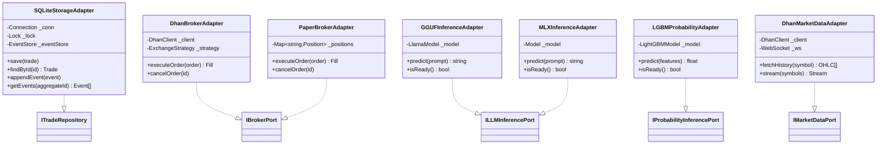
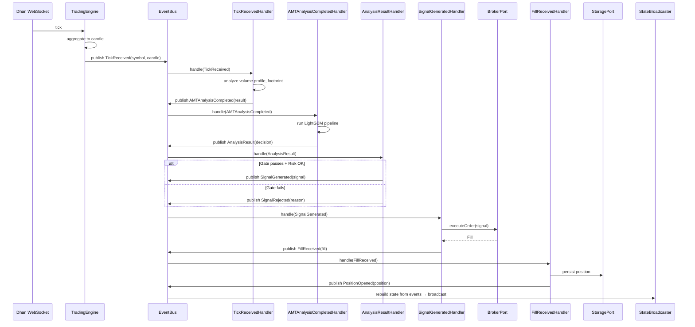

# GlassyTrade AI Backend — Comprehensive Refactoring Plan

## Target Architecture: SOLID-Compliant, Event-Driven, DI-Based

---

## Table of Contents

1. [Executive Summary](#1-executive-summary)
2. [Target Architecture Vision](#2-target-architecture-vision)
3. [Target Layer Diagram](#3-target-layer-diagram)
4. [Event-Driven Pipeline Design](#4-event-driven-pipeline-design)
5. [Dependency Injection Design](#5-dependency-injection-design)
6. [God Class Decomposition Plans](#6-god-class-decomposition-plans)
7. [SOLID Compliance Plan](#7-solid-compliance-plan)
8. [Design Pattern Applications](#8-design-pattern-applications)
9. [Duplication Elimination](#9-duplication-elimination)
10. [Complexity Reduction Plan](#10-complexity-reduction-plan)
11. [Bug Fixes](#11-bug-fixes)
12. [Config System Consolidation](#12-config-system-consolidation)
13. [Phase 1: Critical Fixes](#phase-1-critical-fixes)
14. [Phase 2: God Class Decomposition](#phase-2-god-class-decomposition)
15. [Phase 3: Event Bus & DI Container](#phase-3-event-bus--di-container)
16. [Phase 4: Cycle Breaking & Cleanup](#phase-4-cycle-breaking--cleanup)
17. [Phase 5: Quality & Testing](#phase-5-quality--testing)
18. [Migration Strategy](#migration-strategy)
19. [Testing Strategy](#testing-strategy)
20. [Risk Assessment](#risk-assessment)

---

## 1. Executive Summary

This plan refactors the GlassyTrade AI backend from its current state — a partially-implemented hexagonal architecture with god classes, bypassed event buses, OCP-violating DI, and 15+ dependency cycles — into a clean, SOLID-compliant, event-driven system with proper dependency injection.

### Current State vs Target State

| Aspect | Current | Target |
|--------|---------|--------|
| **Architecture** | Hexagonal intent, leaky layers | Clean hexagonal with strict boundaries |
| **Event Flow** | Events defined but not dispatched; direct method calls | Full event bus dispatch for all 13 domain events |
| **Dependency Injection** | Custom ServiceGraph with if/elif chain (OCP violation) | Registry-based DI container with factory functions |
| **God Classes** | 6 classes >500 lines (max 1190) | Max class size ~200 lines |
| **Max CC** | 25+ (`_tick_loop`) | All methods <15 |
| **Dependency Cycles** | 15+ (evidenced by lazy imports) | Acyclic dependency graph |
| **Config Systems** | 3 competing systems (Pydantic, YAML, SettingsAdapter) | Single unified system |
| **Code Duplication** | 5 exact patterns, 3 structural | Zero exact duplication |
| **Confirmed Bugs** | 4 (2 P0, 2 P1) | Zero |

### Guiding Principles

1. **Composition over inheritance** — prefer small, focused services composed via DI
2. **Events for cross-boundary communication** — services within a bounded context call directly; across boundaries, use events
3. **Dependency inversion at layer boundaries** — application layer depends on domain ports, not infrastructure implementations
4. **Single source of truth** — one config system, one DI container, one event bus
5. **Backward-compatible migration** — each phase works independently; system remains deployable

---

## 2. Target Architecture Vision

### 2.1 Clean Layer Boundaries

```
┌─────────────────────────────────────────────────────────────┐
│                    PRESENTATION LAYER                        │
│  FastAPI Routes │ WebSocket │ Middleware │ DTOs/Schemas     │
│  (api/routes/)  │ (websocket/) │ (middleware/) │ (serial/)  │
└───────────────────────────┬─────────────────────────────────┘
                            │ depends on Application Ports
                            ▼
┌─────────────────────────────────────────────────────────────┐
│                   APPLICATION LAYER                          │
│  Use Cases │ Coordinators │ Command Handlers │ Query Handlers│
│  (application/use_cases/)  │ (application/coordinators/)     │
└───────────────────────────┬─────────────────────────────────┘
                            │ depends on Domain Ports
                            ▼
┌─────────────────────────────────────────────────────────────┐
│                      DOMAIN LAYER                            │
│  Aggregates │ Value Objects │ Domain Events │ Domain Services│
│  Ports (interfaces) │ Domain Policies │ Specifications       │
│  (domain/trading/) │ (domain/services/) │ (domain/ports/)   │
└───────────────────────────▲─────────────────────────────────┘
                            │ implements Domain Ports
                            ▼
┌─────────────────────────────────────────────────────────────┐
│                 INFRASTRUCTURE LAYER                         │
│  Adapters │ Repositories │ Brokers │ Storage │ External APIs │
│  (infrastructure/adapters/) │ (infrastructure/storage/)      │
└─────────────────────────────────────────────────────────────┘

                    CROSS-CUTTING CONCERNS
            ┌──────────────────────────────────┐
            │  Event Bus │ DI Container │ Config│
            │  Logging  │ Error Handling│  Bus  │
            └──────────────────────────────────┘
```

### 2.2 Dependency Direction (strict)

```
Presentation → Application → Domain ← Infrastructure
                              (implements ports)
```

**Key rule**: Domain layer has ZERO imports from application or infrastructure. Infrastructure imports Domain (to implement ports). Application imports Domain (to use ports). Presentation imports Application (to invoke use cases).

### 2.3 Bounded Contexts (within Domain Layer)

```
┌──────────────────┐  ┌──────────────────┐  ┌──────────────────┐
│  Market Data     │  │  Trading         │  │  Risk Management  │
│  Context         │  │  Context         │  │  Context          │
│  ─────────────   │  │  ─────────────   │  │  ─────────────    │
│  TickReceived    │  │  Trade Aggregate │  │  Risk Policies    │
│  CandleAgg       │  │  Position        │  │  DailyLossLimit   │
│  OrderBook       │  │  Signal          │  │  PositionLimits   │
│  MarketDataPort  │  │  Fill            │  │  CircuitBreaker   │
└────────┬─────────┘  └────────┬─────────┘  └────────┬─────────┘
         │                     │                     │
         └─────────────────────┼─────────────────────┘
                               ▼
                    ┌──────────────────────┐
                    │  Analysis Context    │
                    │  ─────────────────   │
                    │  AMT Analysis        │
                    │  Volume Profile      │
                    │  Footprint           │
                    │  LLM Analysis        │
                    │  Probability         │
                    │  Feature Engineering │
                    └──────────────────────┘
```

---

## 3. Target Layer Diagram

### 3.1 Target Class Diagram — Application Layer (Use Cases)

```mermaid
classDiagram
    class ProcessTickUseCase {
        -EventBus _eventBus
        -MarketDataProvider _marketData
        +execute(tick: TickData)
    }

    class AnalyzeMarketUseCase {
        -AMTAnalysisService _amtService
        -ProbabilityEngine _probability
        -FeatureExtractor _features
        +execute(context: MarketContext) AnalysisResult
    }

    class ExecuteEntryUseCase {
        -EntryGate[] _gates
        -RiskValidator _riskValidator
        -OrderExecutor _orderExecutor
        +execute(signal: Signal) ExecutionResult
    }

    class ManageExitUseCase {
        -ExitStrategy[] _strategies
        -PositionManager _positions
        +execute(position: Position) ExitResult
    }

    class LLMAnalyzeUseCase {
        -LLMInferencePort _llm
        -PromptBuilder _promptBuilder
        -SafetyNetChecker _safetyNet
        +execute(context: AnalysisContext) LLMResult
    }

    class RunOverseerUseCase {
        -LLMInferencePort _llm
        -PositionManager _positions
        +execute(positions: Position[]) OverseerResult
    }

    class RecoverStateUseCase {
        -StoragePort _storage
        -PositionRehydrator _rehydrator
        +execute() RecoveredState
    }

    ProcessTickUseCase --> ProcessTickEvent : publishes
    AnalyzeMarketUseCase --> AnalysisResultEvent : publishes
    ExecuteEntryUseCase --> OrderPlacedEvent : publishes
    ManageExitUseCase --> PositionClosedEvent : publishes
    LLMAnalyzeUseCase --> AIAnalysisCompleted : publishes
```



### 3.2 Target Class Diagram — Domain Layer

```mermaid
classDiagram
    class Trade {
        +TradeId id
        +TradeStatus status
        +EntrySignal entrySignal
        +List~Fill~ fills
        +open(signal)
        +addFill(fill) DomainEvent[]
        +close(reason) DomainEvent[]
    }

    class Portfolio {
        +Money balance
        +List~Position~ positions
        +openPosition(signal, sizing) DomainEvent[]
        +closePosition(id, price) DomainEvent[]
        +getEquity(prices) Money
    }

    class Position {
        +TradeId tradeId
        +Side side
        +Quantity quantity
        +Money avgEntryPrice
        +getUnrealizedPnl(currentPrice) Money
    }

    class VolumeProfile {
        +Price poc
        +Price vah
        +Price val
        +Map~Price,Volume~ nodes
        +ValueAreaWidth
        +POCDistance(price)
    }

    class MarketState {
        +Trend trend
        +Volatility volatility
        +Regime regime
        +Momentum momentum
    }

    class AnalysisResult {
        +VolumeProfile volumeProfile
        +MarketState marketState
        +Signal signal
        +Probability probability
        +List~FeatureDriver~ drivers
    }

    class ITradeRepository {
        <<interface>>
        +save(trade)
        +findById(id) Trade
        +findOpenPositions() Position[]
    }

    class IMarketDataPort {
        <<interface>>
        +fetchHistory(symbol) OHLC[]
        +getLTP(symbol) Price
        +stream(symbols) Stream
    }

    class IBrokerPort {
        <<interface>>
        +executeOrder(order) Fill
        +cancelOrder(id)
        +getPositions() Position[]
    }

    class ILLMInferencePort {
        <<interface>>
        +isReady() bool
        +predict(prompt) string
    }

    class IProbabilityInferencePort {
        <<interface>>
        +isReady() bool
        +predict(features) float
    }

    Trade "1" --> "*" Fill
    Portfolio "1" --> "*" Position
    AnalysisResult --> VolumeProfile
    AnalysisResult --> MarketState
    AnalysisResult --> Signal
    AnalysisResult --> Probability
```



### 3.3 Target Class Diagram — Infrastructure Layer



---

## 4. Event-Driven Pipeline Design

### 4.1 Current Problem

The `EventBus` and `EventStore` in `event_store.py` are fully implemented but **never used in the active code path**. Instead:

```
# CURRENT (wrong):
TradingSessionService._on_tick()
    → creates TickReceived event
    → calls self._run_amt_analysis() directly
    → calls self._event_router.run_micro_agent_pipeline() directly
    → calls self._check_exits() directly
    → calls self._run_llm_entry() directly
```

This makes events "documentation-only" and creates tight coupling.

### 4.2 Target Design: Event Bus as Central Nervous System

```
# TARGET (correct):
TradingSessionService._on_tick()
    → publishes TickReceived event to EventBus
    → done

Subscribers (registered at startup):
    TickReceivedHandler         → triggers AMT analysis → publishes AMTAnalysisCompleted
    AMTAnalysisCompletedHandler → triggers pipeline → publishes AnalysisResult
    AnalysisResultHandler       → runs gates + risk → publishes SignalGenerated or SignalRejected
    SignalGeneratedHandler      → executes entry → publishes OrderPlaced
    OrderPlacedHandler          → tracks fill → publishes FillReceived
    FillReceivedHandler         → updates position → publishes PositionOpened/PositionChanged
    PositionChangedHandler      → checks exits → publishes ExitChecked
    FillReceivedHandler (exit)  → if position closed → publishes PositionClosed
    PositionClosedHandler       → triggers post-trade analysis, journaling
```

### 4.3 Event Handler Interface

```python
# app/domain/events/handlers.py

from abc import ABC, abstractmethod
from app.domain.trading.events import DomainEvent

class IEventHandler(ABC, Generic[T]):
    """Interface for all domain event handlers."""

    @property
    @abstractmethod
    def handled_event_type(self) -> type[DomainEvent]:
        """Returns the event type this handler processes."""
        ...

    @abstractmethod
    async def handle(self, event: T) -> None:
        """Handle the event. May publish additional events."""
        ...
```

### 4.4 Event Handler Registry

```python
# app/application/events/handler_registry.py

class HandlerRegistry:
    """Registers event handlers to the EventBus.

    This replaces the current hardcoded method calls in TradingSessionService.
    """

    def __init__(self, event_bus: EventBus, container: DIContainer):
        self._bus = event_bus
        self._container = container

    def register_all(self) -> None:
        self._register(TickReceived, TickReceivedHandler)
        self._register(AMTAnalysisCompleted, AMTAnalysisCompletedHandler)
        self._register(AnalysisResult, AnalysisResultHandler)
        self._register(SignalGenerated, SignalGeneratedHandler)
        self._register(SignalRejected, SignalRejectedHandler)
        self._register(OrderPlaced, OrderPlacedHandler)
        self._register(FillReceived, FillReceivedHandler)
        self._register(PositionOpened, PositionOpenedHandler)
        self._register(PositionChanged, PositionChangedHandler)
        self._register(PositionClosed, PositionClosedHandler)
        self._register(RiskCheckFailed, RiskCheckFailedHandler)
        self._register(DailyLossLimitReached, DailyLossLimitReachedHandler)

    def _register(self, event_type: type, handler_type: type) -> None:
        handler = self._container.resolve(handler_type)
        self._bus.subscribe(event_type.__name__, handler.handle)
```

### 4.5 Target Tick-to-Trade Flow (Event-Driven)



### 4.6 Event Handler Error Handling

```python
# All handlers wrap execution in a try/except that:
# 1. Logs the error with full context
# 2. Publishes a HandlerErrorEvent (for observability)
# 3. Does NOT re-raise (one handler failure shouldn't break others)

class ResilientHandlerWrapper:
    """Wraps any IEventHandler with error isolation."""

    def __init__(self, handler: IEventHandler, event_bus: EventBus):
        self._handler = handler
        self._bus = event_bus

    async def __call__(self, event: DomainEvent) -> None:
        try:
            await self._handler.handle(event)
        except Exception as exc:
            error_event = HandlerErrorEvent.create(
                handler_type=type(self._handler).__name__,
                event_type=type(event).__name__,
                error=str(exc),
            )
            logger.exception("Handler %s failed for %s",
                             type(self._handler).__name__, event)
            self._bus.publish(error_event)
```

---

## 5. Dependency Injection Design

### 5.1 Current Problem

`ServiceGraph._create_service()` is a 110-line if/elif chain that:
- Violates Open-Closed Principle (every new service requires modification)
- Has hardcoded adapter construction logic
- Mixes port registration with service instantiation
- Duplicates exchange normalization logic (3x)
- Requires lazy imports to avoid cycles

### 5.2 Target Design: Registry-Based DI Container

Replace `ServiceGraph` with a clean DI container using factory registration:

```python
# app/application/di/container.py

from typing import Type, TypeVar, Callable, Dict, Any
from contextlib import contextmanager

T = TypeVar("T")
Factory = Callable[..., T]

class DIContainer:
    """Lightweight dependency injection container.

    Usage:
        container = DIContainer()

        # Register factories
        container.register(IBroker, lambda c: DhanBrokerAdapter(c.resolve(Config)))
        container.register(IStorage, lambda c: SQLiteStorageAdapter())
        container.register(TradingSessionService, lambda c: TradingSessionService(
            broker=c.resolve(IBroker),
            storage=c.resolve(IStorage),
            ...
        ))

        # Resolve (lazy, singleton by default)
        session = container.resolve(TradingSessionService)

    Design:
        - OCP-compliant: no if/elif chains
        - Factory functions have full control over construction
        - Circular dependencies detected at registration time
        - Supports scopes (singleton, transient, request)
    """

    def __init__(self):
        self._factories: Dict[Type, Factory] = {}
        self._singletons: Dict[Type, Any] = {}
        self._building: set[Type] = set()  # cycle detection

    def register(self, interface: Type[T], factory: Factory[T]) -> None:
        """Register a factory for a type."""
        self._factories[interface] = factory

    def register_singleton(self, interface: Type[T], factory: Factory[T]) -> None:
        """Register a singleton factory (instance created once)."""
        self._factories[interface] = factory

    def resolve(self, interface: Type[T]) -> T:
        """Resolve a dependency."""
        if interface in self._singletons:
            return self._singletons[interface]

        if interface in self._building:
            raise CircularDependencyError(
                f"Circular dependency detected: {interface} is already being built"
            )

        if interface not in self._factories:
            raise DependencyNotFoundError(f"No factory registered for {interface}")

        self._building.add(interface)
        try:
            factory = self._factories[interface]
            instance = factory(self)  # pass container as 'c' to factory
            self._singletons[interface] = instance
            return instance
        finally:
            self._building.discard(interface)

    @contextmanager
    def transient_scope(self):
        """Create a transient resolution scope (no caching)."""
        old_singletons = self._singletons.copy()
        self._singletons = {}
        try:
            yield self
        finally:
            self._singletons = old_singletons


class CircularDependencyError(Exception):
    pass

class DependencyNotFoundError(Exception):
    pass
```

### 5.3 Target Composition Root

```python
# app/application/di/composition_root.py

def compose_container(config: Configuration) -> DIContainer:
    """Build the complete dependency graph.

    This is the ONLY place where concrete types are imported.
    Everything else uses ports.
    """
    container = DIContainer()

    # --- Configuration ---
    container.register_singleton(Configuration, lambda c: config)

    # --- Infrastructure Adapters ---
    container.register_singleton(IMarketDataPort, lambda c:
        DhanMarketDataAdapter(c.resolve(Configuration)))

    container.register_singleton(IBrokerPort, lambda c:
        _create_broker_adapter(c, config))

    container.register_singleton(ITradeRepository, lambda c:
        SQLiteStorageAdapter())

    container.register_singleton(IEventStore, lambda c:
        SQLiteEventStore(c.resolve(ITradeRepository)))

    container.register_singleton(IEventBus, lambda c:
        _create_event_bus(c))

    container.register_singleton(ILLMInferencePort, lambda c:
        _create_llm_adapter(c, config))

    container.register_singleton(IProbabilityInferencePort, lambda c:
        _create_probability_adapter(c, config))

    # --- Domain Services ---
    container.register_singleton(VolumeProfileService, lambda c:
        VolumeProfileService())

    container.register_singleton(AMTAnalysisService, lambda c:
        AMTAnalysisService(
            volume_profile=c.resolve(VolumeProfileService),
            lvn_analyzer=LVNAnalyzer(),
            market_classifier=MarketStateClassifier(),
            aggression_scorer=AggressionScorer(),
            signal_generator=SignalGenerator(),
        ))

    # --- Application Use Cases ---
    container.register(ProcessTickUseCase, lambda c:
        ProcessTickUseCase(
            event_bus=c.resolve(IEventBus),
            market_data=c.resolve(IMarketDataPort),
        ))

    container.register(AnalyzeMarketUseCase, lambda c:
        AnalyzeMarketUseCase(
            amt_service=c.resolve(AMTAnalysisService),
            probability=c.resolve(IProbabilityInferencePort),
            feature_extractor=FeatureExtractor(),
        ))

    container.register(ExecuteEntryUseCase, lambda c:
        ExecuteEntryUseCase(
            gates=_build_gates(c),
            risk_validator=c.resolve(RiskValidator),
            order_executor=c.resolve(OrderExecutor),
        ))

    # --- Event Handlers ---
    container.register(TickReceivedHandler, lambda c:
        TickReceivedHandler(
            amt_service=c.resolve(AMTAnalysisService),
            event_bus=c.resolve(IEventBus),
        ))

    # ... register all handlers

    return container


def _create_broker_adapter(c: DIContainer, config: Configuration) -> IBrokerPort:
    if config.trading_mode == "live":
        return DhanBrokerAdapter(c.resolve(Configuration))
    return PaperBrokerAdapter()


def _create_llm_adapter(c: DIContainer, config: Configuration) -> ILLMInferencePort:
    model_path = config.llm.model_path
    if model_path.endswith(".gguf"):
        return GGUFInferenceAdapter(model_path=model_path)
    return MLXInferenceAdapter(
        model_path=model_path,
        temperature=config.llm.temperature,
        max_new_tokens=config.llm.max_new_tokens,
    )


def _create_probability_adapter(c: DIContainer, config: Configuration) -> IProbabilityInferencePort:
    model_dir = config.paths.models_dir / "lgbm"
    try:
        return LGBMProbabilityAdapter(str(model_dir))
    except Exception:
        if config.trading_mode == "live":
            raise
        return NoOpProbabilityAdapter()


def _create_event_bus(c: DIContainer) -> IEventBus:
    bus = EventBus()
    store = c.resolve(IEventStore)
    bus.set_event_store(store)
    return bus


def _build_gates(c: DIContainer) -> list[EntryGate]:
    return [
        MarketStateGate(c.resolve(IMarketDataPort)),
        RiskGate(c.resolve(RiskValidator)),
        RegimeGate(c.resolve(RegimeDetector)),
        CooldownGate(c.resolve(CooldownTracker)),
    ]
```

### 5.4 Migration from ServiceGraph

```python
# Step 1: Keep ServiceGraph as a thin wrapper during migration
class ServiceGraph:
    """Backward-compatible wrapper around DIContainer."""

    def __init__(self, config: Configuration):
        self._container = compose_container(config)

    def get(self, service_type: Type[T]) -> T:
        return self._container.resolve(service_type)

    @property
    def trading_session(self):
        return self._container.resolve(TradingSessionService)

    @property
    def active_symbols(self) -> list:
        return self._container.resolve(ActiveSymbolsProvider).get()

    @active_symbols.setter
    def active_symbols(self, value: list):
        self._container.resolve(ActiveSymbolsProvider).set(value)

# Step 2: After all consumers are migrated, delete ServiceGraph
```

---

## 6. God Class Decomposition Plans

### 6.1 LLMEntryHandler (1190 lines → 6 services)

**Current responsibilities:**
1. LLM inference orchestration
2. Per-symbol queue management
3. Worker thread lifecycle
4. Gate checking (session phase, regime, etc.)
5. Signal building
6. Journaling
7. Input sanitization
8. Safety net enforcement
9. Regime detection
10. Quant fallback logic

**Target decomposition:**

```
app/application/services/llm/
├── llm_orchestrator.py          (~150 lines) — coordinates queue + worker
├── llm_queue_manager.py         (~80 lines)  — per-symbol queue mgmt
├── llm_worker.py                (~120 lines) — single worker thread logic
├── llm_prompt_builder.py        (~100 lines) — builds 50+ field prompt
├── llm_safety_checker.py        (~80 lines)  — safety nets (buy-only, VWAP)
├── llm_input_sanitizer.py       (~60 lines)  — strips JSON artifacts
├── llm_gate_checker.py          (~80 lines)  — session phase, regime gates
├── llm_journal_writer.py        (~70 lines)  — persists decisions to journal
└── llm_regime_detector.py       (~90 lines)  — regime detection logic
```

**Interface for LLM Orchestrator:**

```python
class LLMOrchestrator:
    """Coordinates async LLM analysis per symbol."""

    def __init__(
        self,
        queue_mgr: LLMQueueManager,
        worker_factory: Callable[[], LLMWorker],
        journal: LLMJournalWriter,
    ):
        ...

    async def submit(self, symbol: str, context: LLMContext) -> None:
        """Submit an analysis request. Non-blocking."""

    def start_workers(self, symbols: list[str]) -> None:
        """Start one worker thread per symbol."""

    def stop(self) -> None:
        """Gracefully shutdown all workers."""
```

### 6.2 TradingSessionService (1038 lines → 4 coordinators)

**Current responsibilities:**
1. Tick processing orchestration
2. AMT analysis coordination
3. Exit checking
4. LLM entry triggering
5. RL status
6. Overseer triggering
7. IB engines
8. Scalping engines
9. Pre-candle advisory
10. Session state management
11. Risk coordination
12. Event logging
13. Snapshot building
14. Underlying contract cache
15. Mobile alerts
16. Self-healing

**Target decomposition:**

```
app/application/coordinators/
├── tick_processor.py             (~120 lines) — routes ticks through pipeline
├── analysis_coordinator.py       (~100 lines) — AMT + probability + LLM
├── execution_coordinator.py      (~100 lines) — entry + exit coordination
└── session_manager.py            (~150 lines) — state, lifecycle, recovery
```

**TradingSessionService becomes a thin facade:**

```python
class TradingSessionService:
    """Thin facade that delegates to focused coordinators.

    This class is now ~50 lines — purely composition.
    """

    def __init__(
        self,
        tick_processor: TickProcessor,
        analysis_coord: AnalysisCoordinator,
        execution_coord: ExecutionCoordinator,
        session_mgr: SessionManager,
    ):
        self._tick_processor = tick_processor
        self._analysis_coord = analysis_coord
        self._execution_coord = execution_coord
        self._session_mgr = session_mgr

    async def process_tick(self, symbol: str, tick: OHLC, order_book: OrderBook) -> dict:
        return await self._tick_processor.process(symbol, tick, order_book)
```

### 6.3 SQLiteStorageAdapter (893 lines → 3 repositories)

**Current responsibilities:**
1. Schema management (DDL)
2. Tick writes with batching
3. Trade writes
4. LLM decision writes
5. Position CRUD
6. Event CRUD
7. NPOC tracking
8. KV store
9. Performance snapshots
10. Fine-tuning features

**Target decomposition:**

```
app/infrastructure/storage/
├── sqlite_connection_pool.py     (~80 lines)  — connection + lock mgmt
├── schema_manager.py             (~100 lines) — DDL, migrations
├── tick_repository.py           (~120 lines) — tick writes + batching
├── trade_repository.py          (~150 lines) — trade/position CRUD
├── kv_repository.py             (~80 lines)  — KV store (state recovery)
└── event_repository.py          (~100 lines) — event persistence
```

**Each repository implements its port:**

```python
# domain/ports/trade_repository.py
class ITradeRepository(ABC):
    @abstractmethod
    def save_trade(self, trade: Trade) -> None: ...

    @abstractmethod
    def find_trade(self, trade_id: str) -> Trade | None: ...

    @abstractmethod
    def find_open_positions(self) -> list[Position]: ...

    @abstractmethod
    def save_position(self, position: Position) -> None: ...


# domain/ports/tick_repository.py
class ITickRepository(ABC):
    @abstractmethod
    def save_tick(self, symbol: str, tick: OHLC) -> None: ...

    @abstractmethod
    def get_recent_ticks(self, symbol: str, count: int) -> list[OHLC]: ...
```

### 6.4 SessionEventRouter (653 lines → 3 handlers)

**Current responsibilities:**
1. Event routing
2. Agent pipeline execution
3. Entry execution
4. Gate pipeline (15 parameters!)
5. Exit callbacks
6. Persistence
7. Overseer triggering

**Target decomposition:**

```
app/application/handlers/
├── agent_pipeline_handler.py     (~120 lines) — runs LightGBM pipeline
├── entry_gate_handler.py         (~100 lines) — gate pipeline as data
└── entry_executor_handler.py     (~100 lines) — executes approved signals
```

**Gate pipeline takes a parameter object:**

```python
@dataclass(frozen=True)
class GateContext:
    """All context needed for gate evaluation."""
    symbol: str
    market_state: str
    drive: float
    aggression: float
    agent_direction: str
    agent_regime: str
    feature_drivers: dict
    amt_result: AMTResult
    session_state: SessionState
    position: Position | None

class GatePipeline:
    """Runs all gates against a context."""

    def __init__(self, gates: list[EntryGate]):
        self._gates = gates

    def evaluate(self, ctx: GateContext) -> GateResult:
        for gate in self._gates:
            result = gate.check(ctx)
            if not result.passed:
                return result
        return GateResult.passed()
```

### 6.5 AMTAnalyzer.analyze() (600-line method → 8 focused methods)

**Current:** Single `analyze()` method doing 15+ responsibilities.

**Target:**

```python
class AMTAnalyzer:
    def analyze(self, data: MarketData, order_book: OrderBook) -> AMTResult:
        profile = self._compute_volume_profile(data)
        initial_balance = self._compute_initial_balance(data)
        footprint = self._analyze_footprint(order_book)
        cvd = self._compute_cvd(data)
        vwap_bands = self._compute_vwap_bands(data)
        aggression = self._score_aggression(footprint)
        regime = self._detect_regime(data, profile)
        market_state = self._classify_market_state(profile, regime)

        return AMTResult(
            volume_profile=profile,
            initial_balance=initial_balance,
            footprint=footprint,
            cvd=cvd,
            vwap_bands=vwap_bands,
            aggression=aggression,
            regime=regime,
            market_state=market_state,
        )

    def _compute_volume_profile(self, data: MarketData) -> VolumeProfile: ...
    def _compute_initial_balance(self, data: MarketData) -> InitialBalance: ...
    def _analyze_footprint(self, order_book: OrderBook) -> FootprintData: ...
    def _compute_cvd(self, data: MarketData) -> CVDSlope: ...
    def _compute_vwap_bands(self, data: MarketData) -> VWAPBands: ...
    def _score_aggression(self, footprint: FootprintData) -> AggressionScore: ...
    def _detect_regime(self, data: MarketData, profile: VolumeProfile) -> Regime: ...
    def _classify_market_state(self, profile: VolumeProfile, regime: Regime) -> MarketState: ...
```

### 6.6 Engine._tick_loop() (CC 25+ → 5 methods)

**Current:** 190-line method with 6-level nesting doing stream demux, circuit breaking, OI tracking, depth building, footprint, candle aggregation, throttling, dual feed, state assembly.

**Target:**

```python
class TradingEngine:
    def _tick_loop(self) -> None:
        for packet in self._stream_manager.stream():
            self._process_tick_packet(packet)

    def _process_tick_packet(self, packet: TickPacket) -> None:
        if not self._circuit_breaker.is_safe():
            return
        if not self._market_hours.is_trading_time(packet.timestamp):
            return

        symbol = packet.symbol
        tick = self._parse_tick(packet)
        self._update_oi_tracking(symbol, packet)
        self._update_depth(symbol, packet)

        candle = self._candle_aggregator.update(symbol, tick)
        if candle is None:
            return  # Incomplete candle

        self._process_completed_candle(symbol, candle, packet.order_book)

    def _process_completed_candle(self, symbol: str, candle: OHLC, order_book: OrderBook) -> None:
        self._update_footprint(symbol, candle, order_book)
        asyncio.run_coroutine_threadsafe(
            self._session.process_tick(symbol, candle, order_book),
            self._event_loop,
        )
        self._broadcast_state(symbol)
```

---

## 7. SOLID Compliance Plan

### 7.1 Single Responsibility Principle

| Class | Current Responsibilities | Target | New Classes |
|-------|------------------------|--------|-------------|
| `LLMEntryHandler` (1190L) | 10 responsibilities | 1 each | 9 focused services |
| `TradingSessionService` (1038L) | 16 responsibilities | 1 each | 4 coordinators |
| `SQLiteStorageAdapter` (893L) | 10 responsibilities | 1 each | 5 repositories |
| `SessionEventRouter` (653L) | 7 responsibilities | 1-2 each | 3 handlers |
| `AMTAnalyzer.analyze()` (600L method) | 15 sub-tasks | 1 each | 8 private methods |
| `Engine._tick_loop()` (190L method) | 9 sub-tasks | 1 each | 5 methods |

### 7.2 Open-Closed Principle

**Current violation:** `ServiceGraph._create_service()` — 110-line if/elif chain.

**Fix:** Registry-based DI container (see Section 5.2). Adding a new service is:

```python
# Before: Modify ServiceGraph._create_service() (OCP violation)
# After:  Add one line to composition_root.py (OCP compliant)
container.register(MyNewService, lambda c: MyNewService(
    dep1=c.resolve(IDep1),
    dep2=c.resolve(IDep2),
))
```

**Current violation:** Exchange normalization duplicated in 3 places.

**Fix:** Single `Exchange.normalize()` utility:

```python
# app/domain/models/exchange.py
class Exchange(Enum):
    MCX = "MCX"
    NSE = "NSE"

    @classmethod
    def normalize(cls, name: str) -> "Exchange":
        name = str(name).upper()
        if name == "NFO":
            name = "NSE"
        return cls[name]
```

### 7.3 Liskov Substitution Principle

**Current violation:** `NoOpProbabilityAdapter` always returns 0.5 — violates the implicit contract of "valid probability from features."

**Fix:** Document the contract in the port interface and make NoOp raise a clear exception in live mode:

```python
class IProbabilityInferencePort(ABC):
    """Returns probability [0, 1] that the signal direction is correct.

    Implementations MUST:
    - Return values in [0, 1] range
    - Raise InferenceNotReadyError if model is not loaded
    - Never return magic constants (0.5 as 'unknown' is misleading)
    """

    @abstractmethod
    def predict(self, features: list[float]) -> float:
        ...


class NoOpProbabilityAdapter(IProbabilityInferencePort):
    def predict(self, features: list[float]) -> float:
        raise InferenceNotReadyError(
            "Probability model not loaded. This is a no-op adapter."
        )
```

### 7.4 Interface Segregation Principle

**Current violation:** `IMarketData` combines historical + streaming + option chain + depth + L2.

**Fix:** Split into focused ports:

```python
# BEFORE: IMarketData (15+ methods)
# AFTER:

class IHistoricalMarketDataPort(ABC):
    @abstractmethod
    def fetch_history(self, symbol: str, days: int) -> list[OHLC]: ...

class ILiveMarketDataPort(ABC):
    @abstractmethod
    def get_ltp(self, symbol: str) -> float: ...

    @abstractmethod
    def stream(self, symbols: list[str]) -> AsyncIterator[Tick]: ...

class IOptionChainPort(ABC):
    @abstractmethod
    def fetch_option_chain(self, underlying: str) -> OptionChain: ...

class IDepthMarketDataPort(ABC):
    @abstractmethod
    def stream_depth_20(self, symbol: str) -> AsyncIterator[DepthPacket]: ...

# Composite for convenience (optional)
class IMarketDataPort(
    IHistoricalMarketDataPort,
    ILiveMarketDataPort,
    IOptionChainPort,
    IDepthMarketDataPort,
):
    pass
```

**Current violation:** `IStorage` has 15+ methods.

**Fix:** Already partially done via sub-ports (`ITickStorage`, `ITradeStorage`, etc.) in `storage.py`. Complete the decomposition by having `SQLiteStorageAdapter` implement each sub-port as a separate class that shares a connection pool.

### 7.5 Dependency Inversion Principle

**Current violation:** 15+ lazy imports indicating cycles.

**Fix strategy:**

1. **Identify cycle sources:** Every `import` inside a method body is a cycle workaround.
2. **Break cycles with ports:** If A imports B and B imports A, introduce a port in the domain that both depend on.
3. **Use events for cross-boundary calls:** Instead of A calling B directly, A publishes an event, B subscribes.

**Specific cycle breaks:**

```
# Cycle: TradingSessionService ↔ EntryCoordinator ↔ TradeLifecycleHandler
# Fix: Use events instead of direct callbacks

# BEFORE (direct call, cycle):
class TradeLifecycleHandler:
    def __init__(self, on_trade_closed: Callable):  # points back to TradingSessionService
        self._on_trade_closed = on_trade_closed

    def check_exits(self):
        if position_closed:
            self._on_trade_closed(position)  # cycle!

# AFTER (event-based, no cycle):
class TradeLifecycleHandler:
    def __init__(self, event_bus: EventBus):
        self._bus = event_bus

    def check_exits(self):
        if position_closed:
            self._bus.publish(PositionClosed.create(...))  # no cycle
```

---

## 8. Design Pattern Applications

### 8.1 Patterns to Apply

| Pattern | Where | Replaces |
|---------|-------|----------|
| **Factory Method** | DI container factory functions | `ServiceGraph._create_service()` if/elif |
| **Strategy** | Entry gates, Exit strategies, Exchange strategies | Already partially used, complete it |
| **Observer** | EventBus pub/sub | Already implemented but not used — activate it |
| **Mediator** | Use case orchestrators | `TradingSessionService` god object |
| **Command** | Use case classes (`ProcessTickCommand`, `ExecuteEntryCommand`) | Direct method calls |
| **Circuit Breaker** | Already used in engine | Keep and formalize |
| **Chain of Responsibility** | Gate pipeline | Hardcoded gate checks in `run_gate_pipeline()` |
| **Decorator** | `ResilientHandlerWrapper` for error isolation | try/except in every handler |
| **Builder** | `GateContextBuilder`, `LLMContextBuilder` | 15-parameter method calls |
| **Repository** | Split `SQLiteStorageAdapter` into focused repos | Single God-class storage |
| **Unit of Work** | Transaction boundary for trade operations | Ad-hoc SQL commits |
| **Specification** | Risk policies, gate rules | Hardcoded boolean checks |

### 8.2 Chain of Responsibility — Gate Pipeline

```python
# app/application/gates/chain.py

class GateChain:
    """Chain of Responsibility for entry gates."""

    def __init__(self, gates: list[EntryGate]):
        self._gates = gates

    def evaluate(self, ctx: GateContext) -> GateResult:
        """Pass context through chain. First failure short-circuits."""
        for gate in self._gates:
            result = gate.check(ctx)
            if not result.passed:
                return GateResult.rejected(
                    gate=gate.name,
                    reason=result.reason,
                    context=ctx,
                )
        return GateResult.approved(ctx)


# Usage in composition root:
def build_gate_chain(c: DIContainer) -> GateChain:
    return GateChain([
        MarketStateGate(),
        RegimeGate(c.resolve(RegimeDetector)),
        RiskGate(c.resolve(RiskValidator)),
        CooldownGate(c.resolve(CooldownTracker)),
        AggressionGate(),
    ])
```

### 8.3 Builder Pattern — GateContext

```python
# app/application/gates/context_builder.py

class GateContextBuilder:
    """Builds immutable GateContext from scattered sources."""

    def __init__(self):
        self._data: dict = {}

    def with_symbol(self, symbol: str) -> "GateContextBuilder":
        self._data["symbol"] = symbol
        return self

    def with_amt(self, result: AMTResult) -> "GateContextBuilder":
        self._data["market_state"] = result.market_state
        self._data["drive"] = result.drive
        self._data["aggression"] = result.aggression
        self._data["amt_result"] = result
        return self

    def with_agent(self, decision: AgentDecision) -> "GateContextBuilder":
        self._data["agent_direction"] = decision.direction
        self._data["agent_regime"] = decision.regime
        self._data["feature_drivers"] = decision.feature_drivers
        return self

    def with_session(self, state: SessionState) -> "GateContextBuilder":
        self._data["session_state"] = state
        self._data["position"] = state.get_position(self._data.get("symbol"))
        return self

    def build(self) -> GateContext:
        return GateContext(**self._data)
```

---

## 9. Duplication Elimination

### 9.1 Exact Duplicate Patterns

| Pattern | Occurrences | Fix | File |
|---------|-------------|-----|------|
| Exchange normalization (NFO→NSE) | 4 | `Exchange.normalize()` | `exchange.py` |
| Enum value extraction (`side.value if hasattr`) | 6 | `PositionSide` with `__str__` | `enums.py` |
| Rejection logging block (15 lines) | 4 | `_log_rejection(RejectionContext)` | `entry_coordinator.py` |
| SQL save pattern (lock+try+execute+commit) | 4 | `_execute_write(query, params)` | `sqlite_connection.py` |
| VP computation loop | 2 | Shared `_compute_vp(prices)` | `volume_profile.py` |

### 9.2 Structural Duplication

| Pattern | Files | Fix |
|---------|-------|-----|
| Trade breakdown loops (85% similar) | `trade_journal.py` (3 methods) | Generic `_group_by(field, trades)` |
| Agent decision attribution | `entry_coordinator.py` (4x) | `RejectionContext` value object |
| Signal construction from similar params | `session_event_router.py`, `entry_gate.py` | Single `SignalBuilder` |

### 9.3 Value Objects for Data Clumps

```python
# app/domain/models/rejection_context.py

@dataclass(frozen=True)
class RejectionContext:
    """Bundles all data needed for rejection logging."""
    symbol: str
    direction: str
    agent_direction: str
    agent_regime: str
    feature_drivers: dict
    decision_source: str
    attribution: str
    gate_name: str
    reason: str

    @classmethod
    def from_session(cls, session, signal, gate_name: str, reason: str) -> "RejectionContext":
        ad = getattr(session, "_agent_decision", None)
        return cls(
            symbol=symbol,
            direction=signal.direction,
            agent_direction=ad.direction if ad else "unknown",
            agent_regime=ad.regime if ad else "unknown",
            feature_drivers=ad.feature_drivers if ad else {},
            decision_source=attribution,
            attribution=attribution,
            gate_name=gate_name,
            reason=reason,
        )


# Usage: replaces 15-line repeated blocks
ctx = RejectionContext.from_session(session, signal, "cooldown", "Still in cooldown")
logger.warning("Entry rejected [%s]: %s | %s", ctx.gate_name, ctx.reason, ctx.attribution)
```

---

## 10. Complexity Reduction Plan

### 10.1 Cyclomatic Complexity Targets

| Method | Current CC | Target CC | Strategy |
|--------|-----------|-----------|----------|
| `_tick_loop()` | 25+ | <10 each | Split into 5 methods (Section 6.6) |
| `_llm_worker_loop()` | 20+ | <10 each | Extract staleness, fallback, result processing |
| `CandleAggregator.aggregate()` | 18 | <10 | Early returns, state machine |
| `TradeJournal.assess_promotion()` | 16 | <10 | Specification pattern |
| `ServiceGraph._create_service()` | 15+ | 1 | Replace with DI container factory |
| `TradeLifecycleHandler.check_exits()` | 14 | <10 | Strategy pattern for exit types |
| `LLMEntryHandler.run_entry()` | 15+ | <10 | Split into prompt build, gate check, submit |
| `SessionEventRouter.execute_entry_path()` | 12 | <10 | Use GateContext + GateChain |

### 10.2 Cognitive Complexity Reduction Strategies

**Deep nesting (4+ levels):**
- **Guard clauses:** Return early instead of nesting
- **Extract methods:** Each `if` block that does something meaningful → named method
- **State machines:** Replace nested conditionals with explicit state transitions

**Example — before:**
```python
async def _llm_worker_loop(self):
    while self._running:
        try:
            item = await queue.get()
            if item is not None:
                try:
                    if time.time() - item.timestamp > 20:
                        logger.warning("Stale")
                    else:
                        if self._has_extreme_volatility(item):
                            # bypass LLM
                        else:
                            try:
                                result = await self._llm.predict(...)
                                if result:
                                    # process result
                            except TimeoutError:
                                # fallback
                except Exception:
                    pass
        except asyncio.CancelledError:
            break
```

**After:**
```python
async def _llm_worker_loop(self):
    while self._running:
        try:
            await self._process_queue_item()
        except asyncio.CancelledError:
            break
        except Exception as exc:
            self._handle_worker_error(exc)

async def _process_queue_item(self) -> None:
    item = await self._queue.get()
    if item is None:
        return

    if self._is_stale(item):
        self._log_stale_item(item)
        return

    if self._has_extreme_volatility(item):
        await self._apply_quant_fallback(item)
    else:
        await self._run_llm_analysis(item)

def _is_stale(self, item: LLMItem) -> bool:
    return time.time() - item.timestamp > STALENESS_THRESHOLD
```

---

## 11. Bug Fixes

### 11.1 P0 — Fix Immediately

**Bug 1: Dead code after return in `Trade.add_fill()`**

```
File: app/domain/trading/models/trade_aggregate.py:592-616
Fix: Delete lines 594-616 entirely — they are unreachable and misleading.
```

**Bug 2: `has_managed_positions()` always returns True**

```
File: app/application/handlers/trade_lifecycle_handler.py:322
Current:  return self._trade_manager.has_managed_positions(symbol) or True
Fix:      return self._trade_manager.has_managed_positions(symbol)
Impact:   Eliminates wasted LLM calls on every tick when no positions exist.
```

### 11.2 P1 — Fix in First Sprint

**Bug 3: Debug logging as ERROR in `Portfolio.close_position()`**

```
File: app/domain/trading/models/aggregates.py:477-484
Fix: Change logger.error → logger.debug
```

**Bug 4: `_flush_timer` never cancelled**

```
File: app/infrastructure/storage/database.py
Fix: Add close() method with self._flush_timer.cancel()
     Call from application shutdown lifecycle.
```

**Bug 5: GGUFInference, MLXInference singleton not thread-safe**

```
File: app/infrastructure/adapters/gguf_inference_adapter.py
Fix: Use threading.Lock around __new__ initialization,
     or better: let DI container manage singleton lifecycle.
```

---

## 12. Config System Consolidation

### 12.1 Current Problem

Three competing configuration systems:
1. **Pydantic v1** (`app/config.py` — `settings`)
2. **YAML hierarchy** (`config/consolidated.py` — `ConsolidatedConfig`)
3. **SettingsAdapter** (`app/config_models/settings_adapter.py` — migration shim)

### 12.2 Target: Single Configuration

```python
# app/config/app_config.py

from pydantic import BaseModel, Field
from pathlib import Path
import yaml
import os


class LLMConfig(BaseModel):
    model_path: str
    temperature: float = 0.7
    max_new_tokens: int = 512


class TradingConfig(BaseModel):
    mode: str = "paper"  # "live" | "paper"
    default_exchange: str = "MCX"
    dhan_symbols: list[str] = []


class RiskConfig(BaseModel):
    daily_loss_pct: float = 0.02
    max_position_size: int = 1
    risk_per_trade_pct: float = 0.01


class PathsConfig(BaseModel):
    models_dir: Path = Path("models")
    data_dir: Path = Path("data")
    db_path: Path = Path("data/trading.db")


class AppConfig(BaseModel):
    """Single source of truth for all configuration."""
    llm: LLMConfig
    trading: TradingConfig
    risk: RiskConfig
    paths: PathsConfig = Field(default_factory=PathsConfig)

    @classmethod
    def from_yaml(cls, path: Path) -> "AppConfig":
        """Load from YAML file."""
        with open(path) as f:
            data = yaml.safe_load(f)
        return cls.model_validate(data)

    @classmethod
    def from_env(cls) -> "AppConfig":
        """Load from environment variables (with sensible defaults)."""
        return cls(
            llm=LLMConfig(
                model_path=os.environ["LLM_MODEL_PATH"],
                temperature=float(os.environ.get("LLM_TEMPERATURE", "0.7")),
            ),
            trading=TradingConfig(
                mode=os.environ.get("TRADING_MODE", "paper"),
                default_exchange=os.environ.get("DEFAULT_EXCHANGE", "MCX"),
                dhan_symbols=os.environ.get("DHAN_SYMBOLS", "").split(","),
            ),
            risk=RiskConfig(
                daily_loss_pct=float(os.environ.get("DAILY_LOSS_PCT", "0.02")),
            ),
        )

    @classmethod
    def load(cls, yaml_path: Path | None = None) -> "AppConfig":
        """Load config: YAML > ENV > defaults."""
        if yaml_path and yaml_path.exists():
            return cls.from_yaml(yaml_path)
        return cls.from_env()
```

**Migration:** Keep `app/config.py` as a thin adapter during transition:

```python
# app/config.py — backward compatibility adapter
from app.config.app_config import AppConfig

config = AppConfig.load()

# Legacy aliases
settings = config  # Replace all `settings.X` with `config.trading.X` etc.
```

---

## Phase 1: Critical Fixes

**Goal:** Fix bugs and eliminate easy wins. System remains fully functional.

### Task 1.1: Fix P0 Bugs

| Step | Action | File | Lines |
|------|--------|------|-------|
| 1 | Delete dead code in `Trade.add_fill()` | `trade_aggregate.py` | 594-616 |
| 2 | Remove `or True` in `has_managed_positions()` | `trade_lifecycle_handler.py` | 322 |

### Task 1.2: Fix P1 Bugs

| Step | Action | File |
|------|--------|------|
| 1 | Change `logger.error` → `logger.debug` in `close_position()` | `aggregates.py:477` |
| 2 | Add `close()` method to `SQLiteStorageAdapter` with timer cleanup | `database.py` |
| 3 | Thread-safe singleton for GGUF adapter (or defer to DI container) | `gguf_inference_adapter.py` |

### Task 1.3: Extract Exchange Normalization

| Step | Action | Files Changed |
|------|--------|---------------|
| 1 | Create `app/domain/models/exchange.py` with `Exchange.normalize()` | New file |
| 2 | Replace 4 occurrences in `service_graph.py`, `session_event_router.py`, `llm_entry_handler.py` | 3 files |

### Task 1.4: Extract Enum Value Helper

| Step | Action | Files Changed |
|------|--------|---------------|
| 1 | Add `__str__` to `PositionSide` enum | `enums.py` |
| 2 | Replace 6 `side.value if hasattr(...)` with `str(position.side)` | 2 files |

### Task 1.5: Extract SQL Write Helper

| Step | Action | File |
|------|--------|------|
| 1 | Add `_execute_write(query, params)` to `SQLiteStorageAdapter` | `database.py` |
| 2 | Replace 4 duplicated SQL save blocks | `database.py` |

### Task 1.6: Delete Dead Code

| Step | Action | File |
|------|--------|------|
| 1 | Remove `startup_event()` and `shutdown_event()` | `main.py:189-208` |
| 2 | Move `WebSocketLogMiddleware` to module level | `main.py:150-161` |
| 3 | Remove commented-out `ScannerService` branch | `service_graph.py` |

---

## Phase 2: God Class Decomposition

**Goal:** Break up the 6 god classes. System remains functional via facades.

### Task 2.1: Decompose AMTResult Value Object

```
Current: 70+ flat fields in AMTResult dataclass
Target: 8 focused value objects
```

**Step 1: Create value objects**

```python
# app/domain/trading/models/volume_profile.py
@dataclass(frozen=True)
class VolumeProfile:
    poc: float
    vah: float
    val: float
    nodes: dict
    # ... VP-specific fields

# app/domain/trading/models/initial_balance.py
@dataclass(frozen=True)
class InitialBalance:
    ib_high: float
    ib_low: float
    ib_range: float

# app/domain/trading/models/vwap_bands.py
@dataclass(frozen=True)
class VWAPBands:
    vwap: float
    upper_1: float
    lower_1: float
    upper_2: float
    lower_2: float

# app/domain/trading/models/footprint.py
@dataclass(frozen=True)
class FootprintData:
    bid_ask_imbalance: float
    stacked_imbalances: list
    unfinished_auctions: list

# app/domain/trading/models/cvd.py
@dataclass(frozen=True)
class CVDSlope:
    slope: float
    divergence: bool

# app/domain/trading/models/aggression.py
@dataclass(frozen=True)
class AggressionScore:
    value: float
    sigma: float
    direction: str
```

**Step 2: Refactor AMTResult**

```python
@dataclass(frozen=True)
class AMTResult:
    """Composed from focused value objects instead of 70 flat fields."""
    volume_profile: VolumeProfile
    initial_balance: InitialBalance | None
    footprint: FootprintData | None
    cvd: CVDSlope
    vwap_bands: VWAPBands | None
    aggression: AggressionScore
    regime: str
    market_state: str

    # Backward-compatible property getters (during migration)
    @property
    def poc(self) -> float:
        return self.volume_profile.poc

    @property
    def vah(self) -> float:
        return self.volume_profile.vah

    @property
    def val(self) -> float:
        return self.volume_profile.val

    # ... more property getters for all 70 old fields
```

**Step 3: Update producers and consumers incrementally**

- Update `AMTAnalyzer` to produce new value objects
- Update consumers to use nested access (`result.volume_profile.poc`)
- After all consumers migrated, remove backward-compatible properties

### Task 2.2: Decompose AMTAnalyzer.analyze()

**Steps:**
1. Extract 8 sub-methods (Section 6.5)
2. Each method <80 lines
3. Add unit tests for each sub-method
4. Verify `analyze()` produces identical output

### Task 2.3: Decompose LLMEntryHandler

**Steps:**
1. Create `app/application/services/llm/` directory
2. Extract 9 focused services (Section 6.1)
3. Keep `LLMEntryHandler` as a thin facade that delegates
4. Verify behavior unchanged
5. After all callers migrated, delete `LLMEntryHandler` facade

### Task 2.4: Decompose TradingSessionService

**Steps:**
1. Create `app/application/coordinators/` directory
2. Extract 4 coordinators (Section 6.2)
3. Keep `TradingSessionService` as thin facade
4. Verify behavior unchanged

### Task 2.5: Decompose SQLiteStorageAdapter

**Steps:**
1. Create `app/infrastructure/storage/repositories/` directory
2. Extract 5 repositories (Section 6.3)
3. Create shared `SQLiteConnectionFactory` for connection pool
4. Keep `SQLiteStorageAdapter` as composite facade during migration
5. Update `IStorage` port usage in consumers

### Task 2.6: Decompose SessionEventRouter

**Steps:**
1. Extract 3 handlers (Section 6.4)
2. Replace 15-parameter `run_gate_pipeline()` with `GateChain.evaluate(GateContext)`
3. Keep `SessionEventRouter` as thin facade

### Task 2.7: Decompose Engine._tick_loop()

**Steps:**
1. Extract 5 methods (Section 6.6)
2. Each method <40 lines, CC <10
3. Verify tick processing identical

---

## Phase 3: Event Bus & DI Container

**Goal:** Activate event-driven pipeline and replace ServiceGraph.

### Task 3.1: Implement DI Container

**Steps:**
1. Create `app/application/di/container.py` (Section 5.2)
2. Create `app/application/di/composition_root.py` (Section 5.3)
3. Add cycle detection (raise `CircularDependencyError` at registration)
4. Write unit tests for container (singleton, transient, cycle detection)

### Task 3.2: Build Composition Root

**Steps:**
1. Register all existing port→adapter mappings
2. Register all domain services with their dependencies
3. Register all application services
4. Verify all resolutions work

### Task 3.3: Wrap ServiceGraph

**Steps:**
1. Make `ServiceGraph` a thin wrapper around `DIContainer` (Section 5.4)
2. Verify all existing code paths still work
3. No changes to consumers yet

### Task 3.4: Activate Event Bus

**Steps:**
1. Create `app/application/events/handler_registry.py` (Section 4.3)
2. Implement event handlers:
   - `TickReceivedHandler` → triggers AMT analysis
   - `AMTAnalysisCompletedHandler` → triggers probability pipeline
   - `AnalysisResultHandler` → runs gate pipeline
   - `SignalGeneratedHandler` → executes entry
   - `FillReceivedHandler` → updates position
   - `PositionClosedHandler` → triggers post-trade analysis
3. Initialize event bus at startup
4. Replace direct method calls in `TradingSessionService._on_tick()` with event publishing

### Task 3.5: Implement Resilient Handler Wrapper

**Steps:**
1. Create `ResilientHandlerWrapper` (Section 4.6)
2. Wrap all event handlers
3. Create `HandlerErrorEvent` for observability
4. Verify one handler failure doesn't break others

### Task 3.6: Add Event Store Persistence

**Steps:**
1. Implement `SQLiteEventStore` (extends `EventStore` ABC)
2. Add `events` table to SQLite schema
3. Connect `EventBus` to `SQLiteEventStore`
4. Verify idempotency (duplicate events skipped)

---

## Phase 4: Cycle Breaking & Cleanup

**Goal:** Eliminate all dependency cycles and backward compatibility shims.

### Task 4.1: Break Dependency Cycles

**Steps:**
1. Identify all 15+ lazy imports (grep for `import` inside method bodies)
2. For each cycle:
   a. Identify the shared concept
   b. Create a port in domain layer
   c. Both sides depend on port instead of each other
   d. Replace lazy import with port import
3. Verify zero lazy imports remain

### Task 4.2: Consolidate Config Systems

**Steps:**
1. Create `AppConfig` (Section 12.2)
2. Migrate all `settings.X` references to `config.trading.X` etc.
3. Delete `SettingsAdapter`
4. Delete old Pydantic config classes
5. Keep YAML config as primary source

### Task 4.3: Remove Backward Compatibility Shims

**Steps:**
1. Delete `entry_gate.py` re-exports (DEPRECATED module)
2. Delete `trade_manager.py` re-exports (DEPRECATED module)
3. Delete `ServiceGraph` wrapper (after all consumers migrated to DI)
4. Delete `settings.py` legacy aliases

### Task 4.4: Fix Exception Swallowing

**Steps:**
1. Find all `except: pass` and `except Exception: logger.debug("silenced")`
2. Replace with proper error handling or at minimum:
   - Log at WARNING or ERROR level
   - Include exception context
   - Publish `HandlerErrorEvent` if in event handler

### Task 4.5: Global Mutable State Elimination

| Location | Issue | Fix |
|----------|-------|-----|
| `RiskManager._global_halt` | Class-level mutable state | Instance state via DI |
| `agent_pipeline._regime_hysteresis` | Global dict, not thread-safe | Instance state with lock |
| `dependencies._service_graph` | Module-level singleton | DI container |
| `event_store` dual singleton | Global + context var confusion | Single DI-managed instance |

---

## Phase 5: Quality & Testing

**Goal:** Prevent regression, add tests, improve maintainability.

### Task 5.1: Add Complexity Linting

```
# pyproject.toml or setup.cfg
[tool.ruff]
# ...

[tool.radon]
cc_threshold = 15
cc_exclude = ["tests/*", "migrations/*"]
```

### Task 5.2: Add Integration Tests

| Test | Coverage |
|------|----------|
| Tick-to-trade pipeline | Full event bus flow |
| Gate pipeline | All gates pass/fail scenarios |
| Entry execution | Risk checks, broker execution, persistence |
| Exit management | SL, TP, time stop scenarios |
| Event replay | Deterministic state reconstruction |
| DI container | All resolutions, cycle detection |

### Task 5.3: Add Type Hints

- Add type hints to all public methods
- Run mypy in strict mode for domain layer
- Gradual typing for application and infrastructure

### Task 5.4: Performance Validation

- Benchmark tick processing throughput before and after
- Verify no regression in latency (p50, p99)
- Memory profiling for long-running sessions

---

## Migration Strategy

### Phase Execution Order

```
Phase 1 (Bug fixes, extraction)     → System fully functional
    ↓
Phase 2 (God class decomposition)   → System fully functional via facades
    ↓
Phase 3 (Event bus + DI)            → System fully functional, event-driven
    ↓
Phase 4 (Cycle breaking + cleanup)  → System fully functional, clean
    ↓
Phase 5 (Quality + testing)         → System fully functional, tested
```

### Key Migration Rules

1. **Never break the build.** Each task is independently deployable.
2. **Facade pattern for decomposition.** When breaking up a god class, keep the original class as a thin delegating facade until all callers are migrated.
3. **Feature flags for event bus.** Run event bus alongside direct calls; switch via config flag.
4. **Dual-write during config migration.** Old and new config systems coexist until all references updated.

### Rollback Plan

- Each phase is additive (no deletions until the cleanup phase)
- If event bus causes issues, fall back to direct method calls via config flag
- If DI container has issues, fall back to ServiceGraph (kept as wrapper)

---

## Testing Strategy

### Unit Tests (Domain Layer)

```
tests/unit/domain/
├── test_trade_aggregate.py      # open, add_fill, close, realized_pnl
├── test_portfolio.py            # open_position, close_position, equity
├── test_value_objects.py        # VolumeProfile, VWAPBands, etc.
├── test_events.py               # Event creation, idempotency keys
├── test_gates.py               # Each gate's check() method
└── test_services/
    ├── test_amt_analyzer.py     # Each sub-method of analyze()
    ├── test_volume_profile.py   # VP computation
    └── test_probability.py      # Feature extraction, prediction
```

### Integration Tests (Application Layer)

```
tests/integration/
├── test_tick_pipeline.py        # Full tick-to-trade via event bus
├── test_gate_chain.py          # GateChain with real gate instances
├── test_entry_execution.py      # ExecuteEntryUseCase with mock broker
├── test_exit_management.py      # ManageExitUseCase scenarios
└── test_event_replay.py        # ReplayEngine determinism
```

### Infrastructure Tests

```
tests/infrastructure/
├── test_sqlite_storage.py       # Persistence, recovery, timer cleanup
├── test_event_store.py          # Append, query, idempotency
├── test_broker_adapters.py      # Paper broker order execution
└── test_di_container.py        # Resolution, cycle detection, scopes
```

### Contract Tests (Port Compliance)

```
tests/contracts/
├── test_market_data_port.py     # All IMarketDataPort implementations
├── test_broker_port.py          # All IBrokerPort implementations
├── test_storage_port.py         # All IStoragePort implementations
└── test_inference_ports.py      # LLM and Probability inference ports
```

---

## Risk Assessment

| Risk | Probability | Impact | Mitigation |
|------|------------|--------|------------|
| Event bus introduces latency | Medium | High | Benchmark before/after; keep direct-call fallback |
| DI container circular deps | Low | Medium | Cycle detection at registration time |
| God class decomposition introduces bugs | Medium | High | Facade pattern preserves behavior; unit tests per component |
| Config migration breaks existing setups | Low | Medium | Backward-compatible adapter; YAML > ENV > defaults |
| Breaking change to AMTResult | Medium | High | Backward-compatible properties; migrate consumers incrementally |
| Event handler errors silently swallowed | Low | High | `HandlerErrorEvent` + alerting on error events |
| Thread-safety issues with concurrent handlers | Medium | High | Use asyncio for handlers (not threads) where possible; locks for shared state |

### Effort Estimate by Phase

| Phase | Complexity | Risk | Value |
|-------|-----------|------|-------|
| Phase 1: Critical fixes | Low | Low | High (bugs) |
| Phase 2: God class decomposition | High | Medium | Very High (maintainability) |
| Phase 3: Event bus + DI | High | Medium | Very High (architecture) |
| Phase 4: Cycle breaking + cleanup | Medium | Low | High (clean code) |
| Phase 5: Quality + testing | Medium | Low | High (confidence) |

---

## File Structure After Refactoring

```
backend/
├── app/
│   ├── main.py                          # FastAPI app, lifespan, DI init
│   ├── config.py                        # Legacy adapter (delete in Phase 4)
│   ├── application/
│   │   ├── di/
│   │   │   ├── container.py             # DI container
│   │   │   └── composition_root.py      # Dependency graph
│   │   ├── events/
│   │   │   ├── handler_registry.py      # Register handlers to EventBus
│   │   │   └── resilient_wrapper.py     # Error isolation decorator
│   │   ├── coordinators/
│   │   │   ├── tick_processor.py        # Tick → event bus
│   │   │   ├── analysis_coordinator.py  # AMT + probability + LLM
│   │   │   └── execution_coordinator.py # Entry + exit
│   │   ├── services/
│   │   │   ├── llm/                     # 9 focused LLM services
│   │   │   │   ├── llm_orchestrator.py
│   │   │   │   ├── llm_queue_manager.py
│   │   │   │   ├── llm_worker.py
│   │   │   │   ├── llm_prompt_builder.py
│   │   │   │   ├── llm_safety_checker.py
│   │   │   │   ├── llm_input_sanitizer.py
│   │   │   │   ├── llm_gate_checker.py
│   │   │   │   ├── llm_journal_writer.py
│   │   │   │   └── llm_regime_detector.py
│   │   │   └── trading_session.py       # Thin facade (50 lines)
│   │   ├── handlers/
│   │   │   ├── tick_received_handler.py
│   │   │   ├── amt_analysis_handler.py
│   │   │   ├── agent_pipeline_handler.py
│   │   │   ├── entry_gate_handler.py
│   │   │   ├── entry_executor_handler.py
│   │   │   ├── fill_received_handler.py
│   │   │   ├── position_closed_handler.py
│   │   │   ├── trade_lifecycle_handler.py
│   │   │   ├── llm_overseer_handler.py
│   │   │   ├── pre_candle_advisor.py
│   │   │   └── rl_handler.py
│   │   ├── gates/
│   │   │   ├── chain.py                 # Chain of Responsibility
│   │   │   ├── context_builder.py       # Builder pattern
│   │   │   ├── market_state_gate.py
│   │   │   ├── regime_gate.py
│   │   │   ├── risk_gate.py
│   │   │   ├── cooldown_gate.py
│   │   │   └── aggression_gate.py
│   │   └── use_cases/
│   │       ├── process_tick.py
│   │       ├── analyze_market.py
│   │       ├── execute_entry.py
│   │       ├── manage_exit.py
│   │       └── recover_state.py
│   ├── domain/
│   │   ├── trading/
│   │   │   ├── events.py                # 13 domain events (keep)
│   │   │   ├── event_store.py           # EventBus, EventStore (keep, extend)
│   │   │   └── models/
│   │   │       ├── trade_aggregate.py   # Clean, no dead code
│   │   │       ├── aggregates.py        # Portfolio, Position
│   │   │       ├── value_objects.py     # OHLC, Signal, OrderBook
│   │   │       ├── volume_profile.py    # New: VP value object
│   │   │       ├── initial_balance.py   # New: IB value object
│   │   │       ├── vwap_bands.py        # New: VWAP value object
│   │   │       ├── footprint.py         # New: Footprint value object
│   │   │       ├── cvd.py               # New: CVD value object
│   │   │       ├── aggression.py        # New: Aggression value object
│   │   │       ├── enums.py             # PositionSide with __str__
│   │   │       └── exchange.py          # Exchange.normalize()
│   │   ├── services/
│   │   │   ├── amt_analysis_service.py
│   │   │   ├── volume_profile_service.py
│   │   │   ├── signal_generator.py
│   │   │   └── ...
│   │   └── ports/                       # All port interfaces
│   │       ├── market_data.py
│   │       ├── broker.py
│   │       ├── storage.py
│   │       ├── llm_inference.py
│   │       ├── probability_inference.py
│   │       ├── notifications.py
│   │       ├── exchange_strategy.py
│   │       └── ...
│   ├── infrastructure/
│   │   ├── adapters/                    # Port implementations
│   │   │   ├── dhan_adapter.py
│   │   │   ├── paper_broker.py
│   │   │   ├── gguf_inference_adapter.py
│   │   │   ├── mlx_inference_adapter.py
│   │   │   ├── lgbm_probability_adapter.py
│   │   │   └── ...
│   │   ├── storage/
│   │   │   ├── sqlite_connection.py     # Connection pool + lock
│   │   │   ├── schema_manager.py        # DDL + migrations
│   │   │   ├── repositories/
│   │   │   │   ├── tick_repository.py
│   │   │   │   ├── trade_repository.py
│   │   │   │   ├── kv_repository.py
│   │   │   │   └── event_repository.py
│   │   │   └── database.py              # Composite facade (delete in Phase 4)
│   │   ├── strategies/
│   │   │   ├── mcx_strategy.py
│   │   │   └── nse_strategy.py
│   │   └── serialization/
│   │       └── schemas.py               # DTOs (reduce to focused DTOs)
│   └── api/
│       ├── routes/
│       ├── websocket/
│       └── dependencies.py              # Thin wrapper around DI container
├── config/
│   └── consolidated.yaml                # Single YAML config
├── models/                              # ML model files
├── shared/                              # Cross-cutting utilities
│   ├── error_handling.py
│   ├── timezones.py
│   └── parsing.py
└── tests/                               # Full test suite
```

---

## Summary

This plan transforms the GlassyTrade AI backend from a working-but-debt-ridden system into a clean, maintainable, event-driven architecture over 5 phases:

1. **Phase 1** — Fix 4 bugs, extract 5 duplicated patterns, delete dead code. (Low risk, immediate value)
2. **Phase 2** — Decompose 6 god classes into ~35 focused services using facades for zero-downtime migration. (High effort, highest value)
3. **Phase 3** — Activate the dormant event bus, replace ServiceGraph with DI container. (Architectural foundation)
4. **Phase 4** — Break 15+ dependency cycles, consolidate 3 config systems, remove shims. (Clean architecture)
5. **Phase 5** — Add tests, linting, type hints, performance validation. (Sustainable quality)

The target architecture enforces SOLID principles through:
- **SRP**: Max class size ~200 lines, each service has one responsibility
- **OCP**: DI container with factory registration — no if/elif chains
- **LSP**: Port contracts define behavioral guarantees; NoOp adapters raise clear errors
- **ISP**: 15+ focused ports instead of 3 fat interfaces
- **DIP**: Application depends on domain ports; infrastructure implements them
