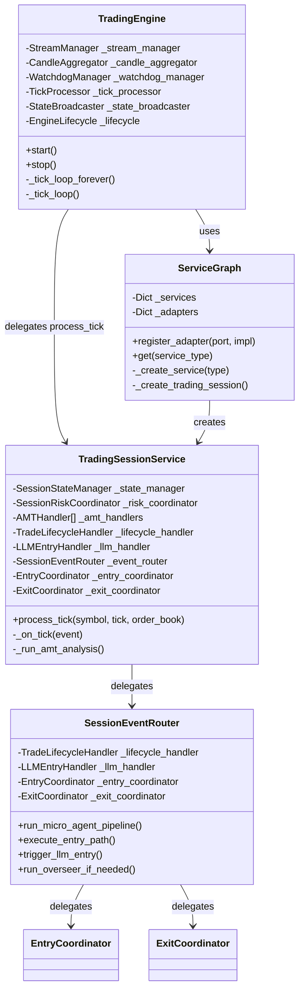
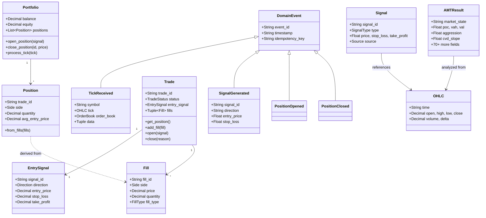
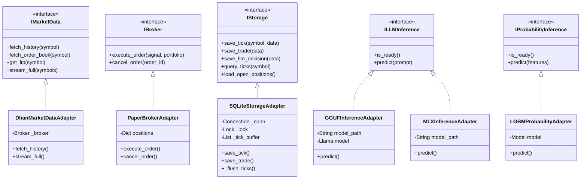
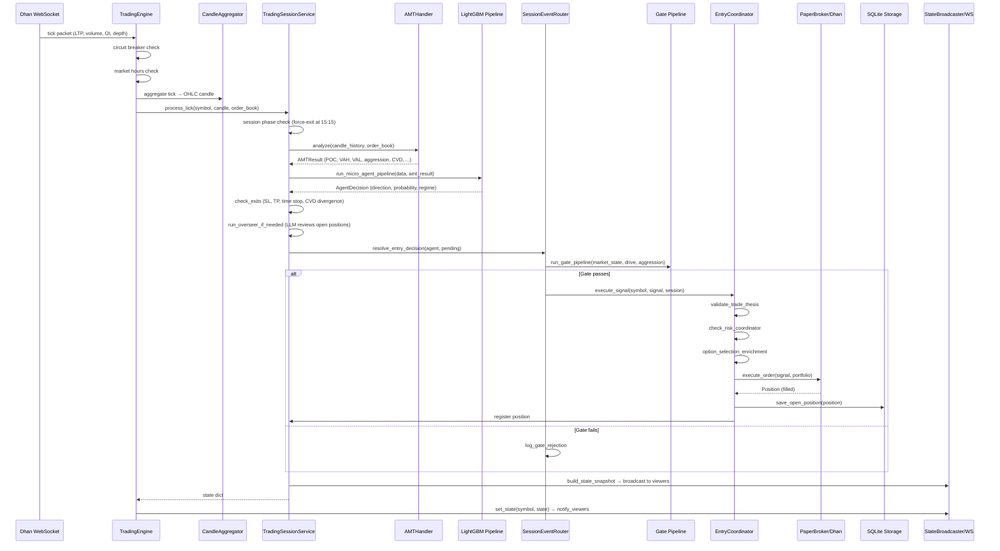
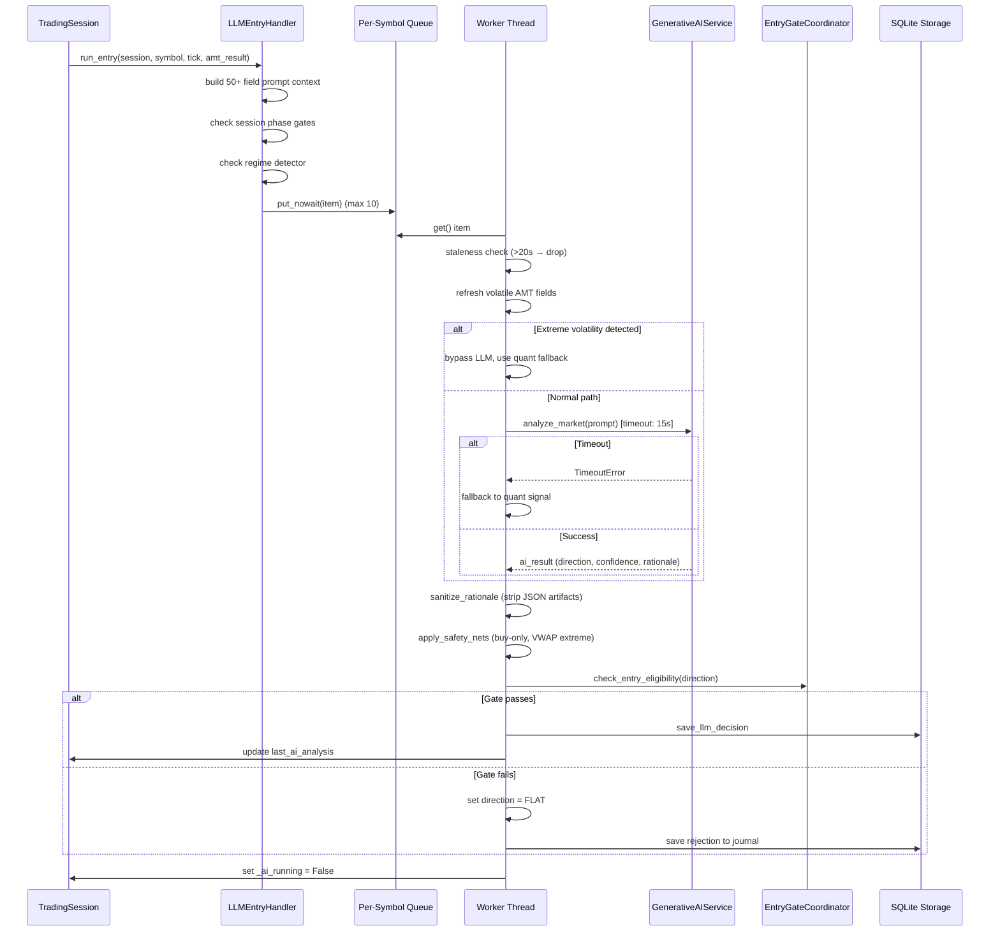
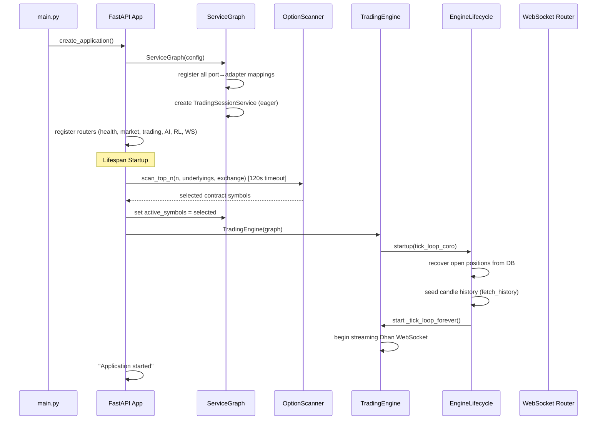

# GlassyTrade AI Backend — Senior Principal Engineer Review

## Table of Contents
1. [Executive Summary](#1-executive-summary)
2. [Architecture Review](#2-architecture-review)
3. [Class Diagrams](#3-class-diagrams)
4. [Flow Diagrams](#4-flow-diagrams)
5. [Code Smells Inventory](#5-code-smells-inventory)
6. [Duplication Analysis](#6-duplication-analysis)
7. [Shotgun Surgery Map](#7-shotgun-surgery-map)
8. [SOLID Principle Violations](#8-solid-principle-violations)
9. [Architectural Violations](#9-architectural-violations)
10. [Complexity Analysis](#10-complexity-analysis)
11. [Bugs & Critical Issues](#11-bugs--critical-issues)
12. [Prioritized Remediation Roadmap](#12-prioritized-remediation-roadmap)

---

## 1. Executive Summary

**Overall Assessment**: The codebase demonstrates solid domain knowledge of auction market theory, volume profile analysis, and algorithmic trading. The hexagonal architecture intent is clear, but execution is inconsistent. The system works but carries significant technical debt that will impede future feature development and increase operational risk.

### Key Metrics

| Metric | Value | Assessment |
|--------|-------|------------|
| Total Python files | ~70 | Moderate |
| Largest file | `llm_entry_handler.py` (1190 lines) | **CRITICAL** |
| Second largest | `trade_journal.py` (908 lines) | **HIGH** |
| Third largest | `database.py` (893 lines) | **HIGH** |
| Classes > 500 lines | 4 | **HIGH** |
| Methods > 100 lines | 8 | **HIGH** |
| Estimated avg cyclomatic complexity | 8-12 | **MODERATE** |
| Peak cyclomatic complexity | 25+ (`_tick_loop`) | **CRITICAL** |
| Duplicated code fragments | 6 distinct patterns | **MODERATE** |
| SOLID violations | 8+ instances | **MODERATE** |
| Architectural boundary violations | 5 instances | **MODERATE** |
| Confirmed bugs | 4 | **HIGH** |
| Dead code blocks | 3+ | **LOW** |

### Severity Distribution

| Severity | Count | Action |
|----------|-------|--------|
| P0 (Critical bugs) | 2 | Fix immediately |
| P1 (High risk / maintainability) | 6 | Fix in next sprint |
| P2 (Medium risk / code quality) | 12 | Plan for next quarter |
| P3 (Low risk / hygiene) | 8 | Backlog |

---

## 2. Architecture Review

### 2.1 What Works Well

1. **Clear layer separation intent**: The `domain/ports/` → `infrastructure/adapters/` pattern is correctly established
2. **Event-driven design**: Immutable domain events with idempotency keys show DDD understanding
3. **Decomposition progress**: The move from monolithic `TradingSession` to focused handlers (AMT, LLM, Lifecycle) is the right direction
4. **Risk management depth**: Multi-layer risk controls (session, system, signal-level) are comprehensive
5. **Crash-safe persistence**: KV store for state recovery shows operational maturity

### 2.2 Architecture Issues

1. **Domain events defined but not actively used via event bus**: Events are created in `events.py` but handlers call each other directly, bypassing the event bus. The `EventBus` class exists in `event_store.py` but `TradingSessionService._on_tick()` constructs events then calls handlers directly.

2. **Leaky abstraction layers**: Application layer reaches into domain internals; infrastructure concerns bleed upward.

3. **ServiceGraph violates Open-Closed**: Adding a new service requires modifying `_create_service()` with a new `elif` branch.

4. **Circular dependency risk**: `app/config.py` imports from `config_models/`, which may import from `config/`, creating fragile import ordering.

---

## 3. Class Diagrams

### 3.1 Core Application Layer



### 3.2 Domain Layer — Aggregates & Value Objects



### 3.3 Infrastructure Layer — Adapters



### 3.4 Handler Hierarchy

```mermaid
classDiagram
    class AMTHandler {
        -AMTAnalyzer _amt_analyzer
        -FootprintAnalyzer _footprint_analyzer
        +analyze(data, order_book)
    }

    class LLMEntryHandler {
        -GenerativeAIService _gen_ai_service
        -Queue[] _llm_queues
        -Thread[] _worker_threads
        -RegimeDetector[] _regime_detectors
        +run_entry(session, symbol, tick)
        -_llm_worker_loop()
        -_process_build_signal()
    }

    class TradeLifecycleHandler {
        -TradeManager _trade_manager
        -ExitEngine _exit_engine
        +check_exits(portfolio, price)
        +in_cooldown(symbol)
    }

    class LLMOverseerHandler {
        -GenerativeAIService _gen_ai_service
        -TradeManager _trade_manager
        +run_overseer(session, symbol, tick)
    }

    class RLHandler {
        +get_status()
    }

    class PreCandleAdvisor {
        -Dict _fired
        +should_fire(symbol, bar_minute)
        +fire_advisory(symbol, tick)
    }

    class PostTradeAnalyst {
        -GenerativeAIService _gen_ai_service
        +analyze_closed_trade(trade)
    }
```



---

## 4. Flow Diagrams

### 4.1 Complete Tick-to-Trade Flow



### 4.2 LLM Entry Flow (Async)



### 4.3 Startup Sequence



---

## 5. Code Smells Inventory

### 5.1 God Classes

| Class | File | Lines | Responsibilities | Smell Severity |
|-------|------|-------|-----------------|----------------|
| `LLMEntryHandler` | `llm_entry_handler.py` | 1190 | LLM inference, queue management, gate checking, signal building, journaling, sanitization, safety nets, regime detection, fallback | **CRITICAL** |
| `TradeJournal` | `trade_journal.py` | 908 | Trade logging, reporting, analytics, promotion assessment, feature breakdown, daily summary | **HIGH** |
| `SessionEventRouter` | `session_event_router.py` | 653 | Event routing, agent pipeline, entry execution, gate pipeline, exit callbacks, persistence | **HIGH** |
| `SQLiteStorageAdapter` | `database.py` | 893 | Schema management, tick writes, trade writes, LLM writes, position CRUD, event CRUD, NPOC, KV store, performance snapshots | **HIGH** |
| `TradingSessionService` | `trading_session.py` | 1038 | Tick orchestration, AMT, exits, LLM, overseer, IB, scalp, pre-candle, phase checks, underlying cache | **HIGH** |
| `TradingEngine._tick_loop` | `engine.py` | 190 lines (single method) | Stream demux, circuit breaker, OI tracking, depth building, footprint, candle aggregation, throttling, dual feed, state assembly | **CRITICAL** |

### 5.2 Large Methods (>100 lines)

| Method | File | Lines | Issues |
|--------|------|-------|--------|
| `LLMEntryHandler.run_entry()` | `llm_entry_handler.py` | ~400 | Builds 50+ field prompt, checks 6+ gates, manages queues |
| `LLMEntryHandler._llm_worker_loop()` | `llm_entry_handler.py` | ~300 | 7-level nesting, 8 exception handlers |
| `TradingEngine._tick_loop()` | `engine.py` | ~190 | 6-level nesting, async for + try + 15+ if branches |
| `EntryCoordinator.execute_signal()` | `entry_coordinator.py` | ~220 | 8 sequential steps, 4x repeated rejection logging |
| `SessionEventRouter.execute_entry_path()` | `session_event_router.py` | ~150 | Nested gate evaluation, short gate, signal build, persist |
| `TradeLifecycleHandler.check_exits()` | `trade_lifecycle_handler.py` | ~145 | 8 sequential exit check steps |
| `CandleAggregator.aggregate()` | `candle_aggregator.py` | ~140 | 18 CC, multiple conditional paths |
| `TradeJournal.assess_promotion()` | `trade_journal.py` | ~115 | 14 independent boolean checks |
| `AMTHandler.analyze()` | `amt_handler.py` | ~105 | Complex VP rebuild logic |
| `Trade.realized_pnl` property | `trade_aggregate.py` | ~67 | FIFO matching with 4-level nesting |

### 5.3 Deep Nesting (4+ levels)

| Location | Depth | Pattern |
|----------|-------|---------|
| `engine.py:_tick_loop()` | 6 levels | `async for → if → try → if → if → if` |
| `llm_entry_handler.py:_llm_worker_loop()` | 7 levels | `while → try → if → try → if → with → if` |
| `trade_aggregate.py:add_fill()` | 5 levels | `if → if → for → if → for` |
| `session_event_router.py:execute_entry_path()` | 5 levels | `if → if → if → if → from import` |
| `aggregates.py:open_position()` | 5 levels | `if → if → if → if → if` |

### 5.4 Primitive Obsession

| Location | Issue |
|----------|-------|
| `AMTResult` has 70+ `float`/`str` fields | Should be decomposed into `MarketState`, `VolumeProfile`, `FootprintData`, `VWAPBands`, etc. |
| `SessionState` has 20+ fields with `_` prefix | Should be split into `SessionCore`, `AMTCache`, `LLMCache`, `RiskState` |
| `EntryCoordinator.execute_signal()` passes `session: SessionState` but only accesses 3-4 fields | Fat interface violation |

### 5.5 Other Code Smells

| Smell | Location | Description |
|-------|----------|-------------|
| **Feature Envy** | `entry_coordinator.py:execute_signal()` — accesses `session._agent_decision`, `session.last_amt`, `session._lock` extensively | Should be method on SessionState |
| **Inappropriate Intimacy** | `engine.py` accesses `self._candle_aggregator._candle_states` (private attribute) | Breaks encapsulation |
| **Inappropriate Intimacy** | `watchdog_manager.py` accesses `self._stream_manager._latest_states` (private attribute) | Breaks encapsulation |
| **Message Chains** | `position.side.value if hasattr(position.side, 'value') else str(position.side)` appears 6+ times | Law of Demeter violation |
| **Speculative Generality** | Dead `ScannerService` branch in `service_graph.py` (commented out) | YAGNI violation |
| **Data Clumps** | `(symbol, direction, agent_direction, agent_regime, agent_feature_drivers, decision_source, attribution, trade_thesis)` passed together 4+ times in rejection logging | Should be a `RejectionContext` value object |
| **Switch Statements** | `service_graph.py:_create_service()` — giant if/elif chain | Replace with factory registry |
| **Long Parameter List** | `SessionEventRouter.execute_entry_path()` — 10 parameters | Use parameter object |
| **Long Parameter List** | `run_gate_pipeline()` in `session_event_router.py` — 15 parameters | Use parameter object |

---

## 6. Duplication Analysis

### 6.1 Exact Duplicates

**Pattern 1: Exchange normalization** (4 occurrences)
```python
# File: service_graph.py:231-237
exchange_name = getattr(self._config, "default_exchange", "MCX") or "MCX"
ex = str(exchange_name).upper()
if ex == "NFO":
    ex = "NSE"

# File: service_graph.py:294-298 (SAME)
# File: session_event_router.py:192-194 (SAME)
# File: llm_entry_handler.py:472-474 (SAME)
```
**Recommendation**: Extract to `Exchange.normalize(exchange_name)` utility.

**Pattern 2: Enum value extraction** (6 occurrences)
```python
position.side.value if hasattr(position.side, 'value') else str(position.side)
```
**Locations**: `entry_coordinator.py:246-247`, `entry_coordinator.py:251-252`, `entry_coordinator.py:273-274`, `entry_coordinator.py:280-281`, `trade_lifecycle_handler.py` (3x)

**Recommendation**: Add `def side_str(pos) -> str` helper or use `str(pos.side)` if enum `__str__` is defined.

**Pattern 3: Agent decision attribution** (4 occurrences in `entry_coordinator.py`)
```python
_ad = getattr(session, "_agent_decision", None)
decision_source, attribution = self._event_logger._decision_attribution(sig, _ad)
```
**Recommendation**: Extract `_build_rejection_context(session, sig)` method.

**Pattern 4: SQL save pattern** (4+ methods in `database.py`)
```python
with self._lock:
    try:
        self._conn.execute("INSERT INTO ...", (...))
        self._conn.commit()
    except sqlite3.Error:
        self._conn.rollback()
        raise
```
**Recommendation**: Extract `_execute_write(query, params)` helper.

**Pattern 5: Volume profile computation** (2 occurrences in `range_bar_builder.py`)
`_compute_vp_from_dicts()` and `get_leg_volume_profile()` share ~40 lines of identical loop logic.

### 6.2 Structural Duplication (Similar Algorithms)

| Files | Similarity | Description |
|-------|-----------|-------------|
| `trade_journal.py:_bucket_trade_breakdown()`, `_daily_trade_breakdown()`, `_feature_driver_breakdown()` | 85% | Same loop pattern with different grouping key |
| `entry_coordinator.py` rejection logging (4 blocks) | 90% | Same 15-line logging block with minor field variations |
| `session_event_router.py:_build_entry_signal()` and `entry_gate.py:build_entry_signal()` | 70% | Both construct Signal from similar parameters |

---

## 7. Shotgun Surgery Map

These are change scenarios that require modifications across many files:

### 7.1 Adding a New Gate Check

**Files to modify**: ~5
1. `domain/fabio_ai/services/entry_gate.py` — add gate function
2. `app/application/services/session_event_router.py` — call gate in `execute_entry_path()`
3. `app/application/services/entry_coordinator.py` — possibly add validation
4. `app/application/handlers/llm_entry_handler.py` — add to gate check before LLM
5. `app/infrastructure/serialization/schemas.py` — possibly add DTO field

**Impact**: HIGH — gates are core to the trading logic and scattered across layers.

### 7.2 Adding a New Market Data Field to Tick

**Files to modify**: ~6
1. `domain/trading/models/value_objects.py` — add field to `OHLC`
2. `infrastructure/adapters/dhan_adapter.py` — extract from packet
3. `application/candle_aggregator.py` — pass through aggregation
4. `application/engine.py:_tick_loop()` — extract from packet
5. `infrastructure/serialization/schemas.py` — add to DTO
6. `domain/probability/features.py` — possibly use as feature

**Impact**: MODERATE — OHLC is central but the change is additive.

### 7.3 Changing the AMTResult Structure

**Files to modify**: ~8
1. `domain/trading/models/value_objects.py` — change `AMTResult`
2. `domain/fabio_ai/services/amt_analyzer.py` — produce new fields
3. `application/handlers/amt_handler.py` — pass new fields
4. `application/services/session_cache.py` — cache new fields
5. `application/handlers/llm_entry_handler.py` — use in prompt (6 references)
6. `application/services/session_event_router.py` — use in gate pipeline
7. `infrastructure/serialization/schemas.py` — DTO mapping
8. Multiple frontend-facing serialization points

**Impact**: CRITICAL — AMTResult is a "data clump" with 70+ fields used everywhere.

### 7.4 Adding a New Broker Adapter

**Files to modify**: ~3
1. `domain/ports/broker.py` — interface (if new methods needed)
2. `infrastructure/adapters/new_broker.py` — implementation
3. `application/service_graph.py` — register adapter

**Impact**: LOW — ports & adapters pattern works well here.

---

## 8. SOLID Principle Violations

### 8.1 Single Responsibility Principle (SRP)

| Class | Violation | Severity |
|-------|-----------|----------|
| `LLMEntryHandler` (1190 lines) | Manages LLM inference + queue management + gate checking + signal building + journaling + sanitization + safety nets + regime detection + fallback logic | **CRITICAL** |
| `TradingSessionService` (1038 lines) | Orchestrates tick processing + AMT + exits + LLM + overseer + IB + scalp + pre-candle + phase checks + session cache + alerts + self-healing | **HIGH** |
| `SessionEventRouter` (653 lines) | Routes events + runs agent pipeline + executes entries + handles exits + persists decisions + runs overseer | **HIGH** |
| `SQLiteStorageAdapter` (893 lines) | Schema management + tick writes + trade writes + LLM writes + position CRUD + event CRUD + NPOC + KV store + performance + fine-tuning features | **HIGH** |
| `EntryCoordinator.execute_signal()` | Validates thesis + checks risk + enriches options + executes broker + registers manager + persists + logs | **HIGH** |

### 8.2 Open-Closed Principle (OCP)

| Location | Violation | Severity |
|----------|-----------|----------|
| `ServiceGraph._create_service()` | Giant if/elif chain — every new service requires modifying this method | **HIGH** |
| `ServiceGraph` adapter registration | Hardcoded in `__init__` — cannot swap adapters at runtime without subclassing | **MODERATE** |
| `Exchange selection` in `service_graph.py` | Hardcoded MCX/NSE branching — adding new exchange requires code change | **MODERATE** |

### 8.3 Liskov Substitution Principle (LSP)

| Location | Violation | Severity |
|----------|-----------|----------|
| `NoOpProbabilityAdapter` vs `LGBMProbabilityAdapter` | NoOp returns 0.5 probability always — could cause unexpected behavior if caller assumes valid probability | **LOW** |
| `IMarketData.stream_depth_20()` | Base raises `NotImplementedError` — violates interface contract | **LOW** |

### 8.4 Interface Segregation Principle (ISP)

| Location | Violation | Severity |
|----------|-----------|----------|
| `IMarketData` | Combines historical queries + live streaming + option chain + depth 20 + L2 order book — clients that only need LTP must depend on streaming interface | **MODERATE** |
| `IStorage` | 15+ methods — a client that only needs tick reads depends on trade writes, LLM writes, position CRUD, etc. | **MODERATE** |

### 8.5 Dependency Inversion Principle (DIP)

| Location | Violation | Severity |
|----------|-----------|----------|
| `engine.py` | Directly imports `CandleAggregator`, `StreamManager`, `WatchdogManager` — concrete types, not abstractions | **MODERATE** |
| `llm_entry_handler.py` | Directly imports `build_entry_signal`, `EntryGateCoordinator`, `PositionSizer` — concrete types | **MODERATE** |
| `entry_coordinator.py` | Directly imports `validate_trade_thesis` function | **MODERATE** |
| `trading_session.py` | Directly imports `AMTHandler`, `TradeLifecycleHandler`, `LLMEntryHandler` — concrete types | **HIGH** |
| Multiple files | Inline imports inside methods (lazy loading to avoid circular imports) — indicates architectural dependency cycles | **HIGH** |

---

## 9. Architectural Violations

### 9.1 Layer Boundary Violations

| From Layer | To Layer | Violation | File:Line |
|------------|----------|-----------|-----------|
| Application | Domain private | `engine.py` accesses `self._candle_aggregator._candle_states` | `engine.py:254` |
| Application | Domain private | `watchdog_manager.py` accesses `self._stream_manager._latest_states` | `watchdog_manager.py:80` |
| Application | Infrastructure | `trade_lifecycle_handler.py` imports from `shared.error_handling` | `trade_lifecycle_handler.py` |
| Application | Infrastructure | `llm_entry_handler.py` imports `shared.timezones` | `llm_entry_handler.py:40` |
| Application | Config | `engine.py` imports `app.config.settings` directly | `engine.py:28` |
| Domain | Infrastructure | `trade_aggregate.py` imports from `infrastructure.serialization` | (if any) |

### 9.2 Dependency Cycles

**Cycle 1**: `app/config.py` ←→ `config/` ←→ `config_models/`
- `app/config.py` imports from `config_models/settings_adapter.py`
- `config_models/` may import from `config/consolidated.py`
- Risk: Import ordering dependency

**Cycle 2**: `TradingSessionService` ←→ `EntryCoordinator` ←→ `TradeLifecycleHandler`
- `TradingSessionService` creates `EntryCoordinator`
- `EntryCoordinator` depends on `TradeLifecycleHandler`
- `TradeLifecycleHandler` callbacks call back to `TradingSessionService` via `_on_trade_closed`
- Mitigated by: lazy imports (but this is a code smell)

**Evidence of cycles**: 15+ lazy imports inside methods across the codebase, indicating the dependency graph is not acyclic.

### 9.3 God Object Pattern

`TradingSessionService` acts as a god object, knowing about:
- AMT analysis
- Trade exits
- LLM entry
- RL status
- Overseer
- Session state
- Risk management
- Event logging
- IB engines
- Scalping engines
- Pre-candle advisory
- Mobile alerts
- Self-healing

This violates the **bounded context** principle of DDD.

### 9.4 Event Bus Bypass

Domain events are defined in `events.py` (TickReceived, SignalGenerated, etc.) but are **not dispatched through an event bus**. Instead:
- `TradingSessionService._on_tick()` creates a `TickReceived` event
- Then directly calls `self._run_amt_analysis()`, `self._event_router.run_micro_agent_pipeline()`, etc.

This makes the event definitions **documentation-only** and creates tight coupling between the event publisher and all subscribers.

---

## 10. Complexity Analysis

### 10.1 Cyclomatic Complexity (CC)

| Method | File | Estimated CC | Threshold (10) | Status |
|--------|------|-------------|----------------|--------|
| `TradingEngine._tick_loop()` | `engine.py` | 25+ | Exceeded | **CRITICAL** |
| `LLMEntryHandler._llm_worker_loop()` | `llm_entry_handler.py` | 20+ | Exceeded | **CRITICAL** |
| `CandleAggregator.aggregate()` | `candle_aggregator.py` | 18 | Exceeded | **HIGH** |
| `TradeJournal.assess_promotion()` | `trade_journal.py` | 16 | Exceeded | **HIGH** |
| `ServiceGraph._create_service()` | `service_graph.py` | 15+ | Exceeded | **HIGH** |
| `TradeLifecycleHandler.check_exits()` | `trade_lifecycle_handler.py` | 14 | Exceeded | **HIGH** |
| `LLMEntryHandler.run_entry()` | `llm_entry_handler.py` | 15+ | Exceeded | **HIGH** |
| `SessionEventRouter.execute_entry_path()` | `session_event_router.py` | 12 | Exceeded | **HIGH** |
| `RangeBarBuilder.detect_triple_a()` | `range_bar_builder.py` | 12 | Exceeded | **HIGH** |
| `AMTHandler.analyze()` | `amt_handler.py` | 10 | At threshold | **MODERATE** |
| `Portfolio.close_position()` | `aggregates.py` | 10 | At threshold | **MODERATE** |
| `SessionRiskCoordinator.validate_entry()` | `session_risk_coordinator.py` | 10 | At threshold | **MODERATE** |
| `StateBroadcaster.trigger_immediate_update()` | `state_broadcaster.py` | 10 | At threshold | **MODERATE** |

### 10.2 Cognitive Complexity

Cognitive complexity measures how hard code is to understand (deeper nesting = higher score).

| Method | File | Est. Cognitive | Issues |
|--------|------|---------------|--------|
| `LLMEntryHandler._llm_worker_loop()` | `llm_entry_handler.py` | 45+ | 7-level nesting, 8 exception handlers, alternating success/error paths |
| `TradingEngine._tick_loop()` | `engine.py` | 35+ | 6-level nesting, async for loop, interleaved happy/sad paths |
| `LLMEntryHandler.run_entry()` | `llm_entry_handler.py` | 30+ | 50+ field prompt construction, 6+ gate checks |
| `EntryCoordinator.execute_signal()` | `entry_coordinator.py` | 25+ | 4x repeated rejection blocks, 8 sequential steps |
| `Trade.realized_pnl` | `trade_aggregate.py` | 20+ | FIFO matching with nested loops |
| `Portfolio.open_position()` | `aggregates.py` | 18+ | Tiered sizing, lot snapping, slippage, session risk |

### 10.3 Cognitive Complexity Hotspots by Pattern

| Pattern | Count | Examples |
|---------|-------|----------|
| Deep nesting (4+ levels) | 8 | `_tick_loop`, `_llm_worker_loop`, `add_fill` |
| Boolean chain complexity | 4 | `_resolve_entry_decision`, `assess_promotion` |
| Exception handling complexity | 6 | Multiple try/except/pass blocks masking errors |
| Guard clause proliferation | 5 | `execute_signal` with 4 sequential rejection paths |

---

## 11. Bugs & Critical Issues

### P0 — Critical Bugs (Fix Immediately)

**Bug 1: Dead code after return in `Trade.add_fill()`**
- **File**: `trade_aggregate.py:592`
- **Issue**: Lines 594-616 are unreachable — duplicate code block after `return` statement
- **Impact**: Misleading — if someone removes the return, this code will execute with wrong logic
- **Fix**: Delete lines 594-616

**Bug 2: `has_managed_positions()` always returns True**
- **File**: `trade_lifecycle_handler.py:322`
- **Issue**: `return self._trade_manager.has_managed_positions(symbol) or True`
- **Impact**: Overseer runs on every tick even when no positions exist, wasting LLM calls
- **Fix**: Remove `or True`

### P1 — High Risk Issues

**Bug 3: Mutable default on frozen dataclass**
- **File**: `value_objects.py:184`
- **Issue**: `bubble_retests: list[AggressivePrint] = field(default_factory=list)` on a non-frozen `AMTResult` dataclass
- **Impact**: All AMTResult instances share the same list if not explicitly set — cross-contamination of bubble retest data between symbols
- **Fix**: Already uses `default_factory` — but the dataclass itself is not frozen, so mutation is possible. Consider making immutable or documenting mutability.

**Bug 4: Debug logging as ERROR in `Portfolio.close_position()`**
- **File**: `aggregates.py:477-484`
- **Issue**: `logger.error("close_position stack:\n%s", "".join(traceback.format_stack()))`
- **Impact**: Pollutes error logs with stack traces for normal operation, makes real errors hard to find
- **Fix**: Change to `logger.debug`

**Issue 5: GGUFInferenceAdapter singleton not thread-safe**
- **File**: `gguf_inference_adapter.py`
- **Issue**: `__new__` pattern with `_initialized` flag — concurrent construction can create multiple instances or partially initialized instances
- **Impact**: Race condition on startup

**Issue 6: `_flush_timer` never cancelled on shutdown**
- **File**: `database.py`
- **Issue**: `threading.Timer` scheduled for tick flushing is never cancelled — potential resource leak and crash on interpreter shutdown
- **Fix**: Add `_flush_timer.cancel()` in a `close()` method

### P2 — Medium Risk Issues

**Issue 7: Dead code in `main.py`**
- **File**: `main.py:189-208`
- **Issue**: `startup_event()` and `shutdown_event()` are defined but never called (lifespan handles startup/shutdown)
- **Fix**: Delete or use

**Issue 8: `WebSocketLogMiddleware` defined inside function**
- **File**: `main.py:150-161`
- **Issue**: Class defined inside `create_application()` — recreated on every call, prevents testing
- **Fix**: Move to module level

**Issue 9: Exception swallowing in 10+ locations**
- **Pattern**: `try: ... except: pass` or `except Exception: logger.debug("Exception handled silently")`
- **Locations**: `session_event_router.py:558`, `state_broadcaster.py`, `llm_entry_handler.py:924-925`, etc.
- **Impact**: Silent failures make debugging impossible in production

**Issue 10: `AMTResult` has 70+ fields**
- **File**: `value_objects.py:104-207`
- **Impact**: High cognitive load, difficult to test, violates Information Expert pattern
- **Fix**: Decompose into `MarketState`, `VolumeProfile`, `VWAPBands`, `InitialBalance`, etc.

**Issue 11: `SessionCache` has 25+ thin getter/setter pairs**
- **File**: `session_cache.py`
- **Impact**: High lock contention, boilerplate, maintenance burden
- **Fix**: Use `__getattr__`/`__setattr__` or direct attribute access

---

## 12. Prioritized Remediation Roadmap

### Phase 1: Critical Fixes (Week 1-2)

| Priority | Task | Effort | Risk Reduction |
|----------|------|--------|---------------|
| P0 | Fix dead code in `Trade.add_fill()` (lines 594-616) | 10min | Eliminates misleading code |
| P0 | Fix `has_managed_positions()` — remove `or True` | 5min | Prevents wasted LLM calls |
| P1 | Change `Portfolio.close_position()` logger.error → debug | 5min | Reduces log noise |
| P1 | Add `_flush_timer.cancel()` to `SQLiteStorageAdapter.close()` | 30min | Prevents resource leak |
| P1 | Extract exchange normalization to `Exchange.normalize()` utility | 1hr | Eliminates 4x duplication |
| P1 | Extract enum value helper `def side_str()` | 30min | Eliminates 6x duplication |

### Phase 2: High-Value Refactoring (Week 3-4)

| Priority | Task | Effort | Risk Reduction |
|----------|------|--------|---------------|
| P1 | Decompose `LLMEntryHandler` into: `LLMInferenceService`, `LLMPromptBuilder`, `LLMSafetyNet`, `LLMQueueManager` | 2-3 days | Reduces 1190-line god class |
| P1 | Extract rejection logging in `EntryCoordinator` to `_log_rejection(context)` | 2hr | Eliminates 4x 15-line duplication |
| P1 | Extract SQL write helper in `SQLiteStorageAdapter` | 2hr | Eliminates 4x boilerplate |
| P1 | Decompose `AMTResult` into focused value objects | 1-2 days | Reduces 70-field dataclass |
| P2 | Replace `ServiceGraph._create_service()` if/elif with factory registry | 4hr | OCP compliance |
| P2 | Delete dead code: `startup_event()`, `shutdown_event()`, `ScannerService` branch | 30min | Code hygiene |

### Phase 3: Architectural Improvements (Month 2)

| Priority | Task | Effort | Impact |
|----------|------|--------|--------|
| P1 | Implement actual event bus dispatch for domain events | 3-4 days | Decouples publisher from subscribers |
| P1 | Break dependency cycles — eliminate 15+ lazy imports | 1 week | Cleaner architecture, easier testing |
| P2 | Extract `AMTAnalysisResult`, `VWAPBands`, `InitialBalance` from `AMTResult` | 3-4 days | Lower cognitive load |
| P2 | Split `TradingSessionService` into `TickProcessor`, `AnalysisCoordinator`, `ExecutionCoordinator` | 1-2 weeks | Eliminates god object |
| P2 | Split `TradeJournal` reporting methods into `TradeReporter`, `TradeAnalyzer` | 2-3 days | SRP compliance |

### Phase 4: Quality & Testing (Month 3)

| Priority | Task | Effort | Impact |
|----------|------|--------|--------|
| P2 | Reduce CC of `_tick_loop()` below 15 | 3-4 days | Maintainability |
| P2 | Reduce CC of `_llm_worker_loop()` below 15 | 3-4 days | Maintainability |
| P2 | Add integration tests for gate pipeline | 1 week | Confidence in changes |
| P3 | Add type hints to all public methods | 1 week | IDE support, mypy |
| P3 | Set up cyclomatic complexity linting | 2hr | Prevent regression |

---

## Appendix A: File Inventory with Complexity

| File | Lines | Classes | Methods | Max CC | Smells |
|------|-------|---------|---------|--------|--------|
| `llm_entry_handler.py` | 1190 | 1 | 15 | 20+ | God class, deep nesting, duplicated logic |
| `trade_journal.py` | 908 | 2 | 15 | 16 | Large class, repetitive methods |
| `database.py` | 893 | 1 | 20 | 5 | Duplicated SQL pattern, no shutdown cleanup |
| `trading_session.py` | 1038 | 1 | 12 | 12 | God object, too many responsibilities |
| `session_event_router.py` | 653 | 1 | 8 | 12 | Lazy imports, duplicated exchange normalization |
| `entry_coordinator.py` | 288 | 1 | 1 | 8 | Repeated rejection logging, fat interface |
| `engine.py` | 439 | 1 | 8 | 25+ | Deep nesting, private attribute access |
| `service_graph.py` | 392 | 1 | 5 | 15+ | OCP violation, duplicated logic |
| `session_risk_coordinator.py` | 395 | 2 | 12 | 10 | Sequential guards, nested lazy init |
| `session_state_manager.py` | 413 | 2 | 15 | 8 | Large dataclass, lazy imports |
| `signal_tracking_service.py` | 386 | 2 | 12 | 6 | Similar aggregation methods |
| `state_broadcaster.py` | 364 | 1 | 10 | 10 | Nested error handling |
| `session_cache.py` | 342 | 1 | 25+ | 2 | Too many thin methods |
| `session_event_logger.py` | 312 | 1 | 10 | 5 | Clean delegation |
| `candle_aggregator.py` | 324 | 1 | 5 | 18 | Large method, redundant init |
| `tick_processor.py` | 331 | 1 | 8 | 6 | Clean |
| `trade_lifecycle_handler.py` | 347 | 1 | 6 | 14 | Bug (or True), repeated enum access |
| `aggregates.py` | 541 | 2 | 12 | 10 | Debug logging as error, repeated pattern |
| `trade_aggregate.py` | 795 | 5 enums + 7 dc + Trade | 10 | 10 | Dead code after return |
| `value_objects.py` | 322 | 13 dc | 1 | 2 | AMTResult 70+ fields |
| `range_bar_builder.py` | 575 | 4 dc + 1 | 10 | 12 | Duplicated VP computation |
| `amt_handler.py` | 196 | 1 | 3 | 10 | Dynamic dataclass creation |
| `exit_coordinator.py` | 238 | 1 | 5 | 8 | Repeated SL cancellation |
| `post_trade_analyst.py` | 262 | 1 dc + 1 | 4 | 6 | Inline import |
| `serialization/schemas.py` | 680 | 18 DTOs | 10 converters | 5 | Large DTO, repetitive mapping |

---

## Appendix B: Architecture Decision Records (Inferred)

| ADR | Decision | Status | Assessment |
|-----|----------|--------|------------|
| ADR-001 | Use SQLite for persistence | Active | Appropriate for single-instance trading system |
| ADR-002 | Frontend WS is read-only viewer | Active | Good separation — engine independent of UI |
| ADR-003 | LLM runs in background thread per symbol | Active | Correct — avoids blocking tick processing |
| ADR-004 | Domain events defined but not dispatched | Active | **Questionable** — creates tight coupling |
| ADR-005 | Paper trading as default broker | Active | Safe default, easy swap to live |
| ADR-006 | Dual signal (LLM + LightGBM) | Active | Good ensemble approach |
| ADR-007 | Config via YAML hierarchy + .env | Active | Good separation of config and secrets |
| ADR-008 | ServiceGraph as DI container | Active | **Limited** — doesn't scale, consider dependency-injector library |

---

## Appendix C: Metrics Summary

| Metric | Value | Good | Warning | Critical |
|--------|-------|------|---------|----------|
| Files > 500 lines | 6 | <3 | 3-5 | >5 |
| Methods > 100 lines | 8 | <5 | 5-8 | >8 |
| Max cyclomatic complexity | 25+ | <10 | 10-15 | >15 |
| Methods with CC > 10 | 9 | <5 | 5-10 | >10 |
| Duplicated code patterns | 6 | <3 | 3-6 | >6 |
| God classes (>500 lines) | 4 | 0 | 1-2 | >2 |
| Lazy imports | 15+ | 0 | 1-5 | >5 |
| Private attribute access across modules | 3 | 0 | 1-2 | >2 |
| SOLID violations | 8+ | 0 | 1-3 | >3 |
| Confirmed bugs | 4 | 0 | 1-2 | >2 |
