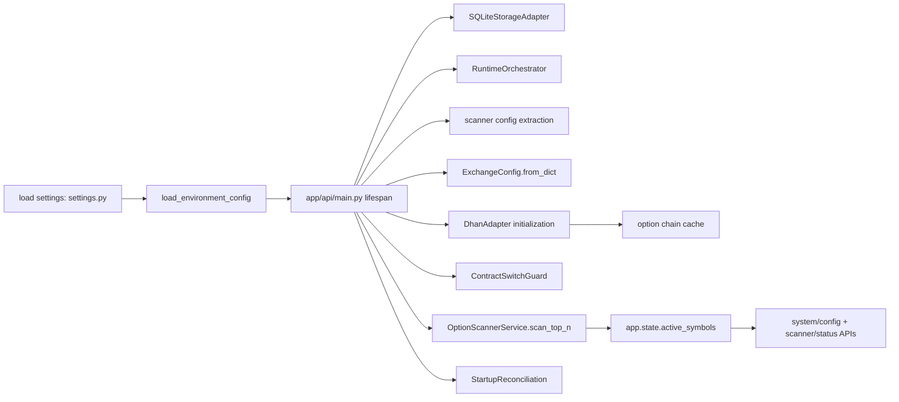
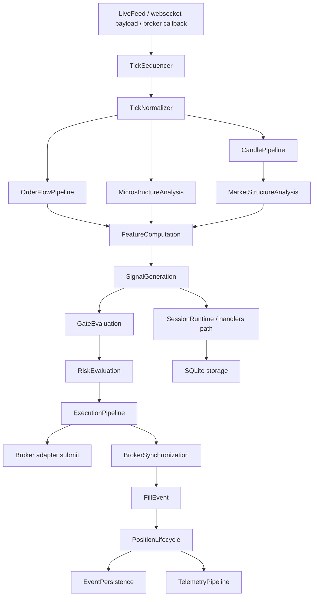
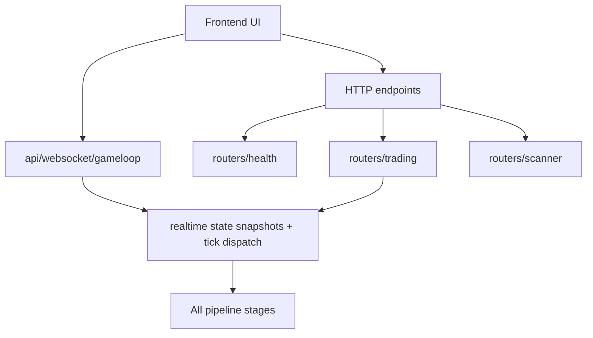
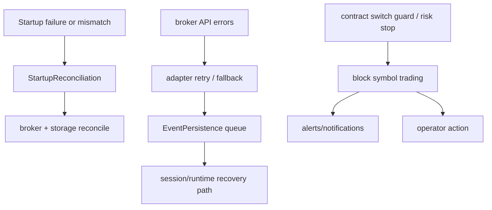

# BackendV2 End-to-End Architecture + File-to-Component Mapping + Flows

Generated from runtime code and router/adapter/domain wiring in `backendv2` as of this pass.

## Scope

- Runtime scope: `backendv2/app/**` (all Python source files)
- Validation scope: `backendv2/tests/**` (test and parity suites)
- Goal: map every file to its owning component and make execution/control/event flows explicit.

## 1) Runtime Layers and File Association

### A) Entry, Transport, and Frontend Contract

| Component | Associated Files |
|---|---|
| API application bootstrap | `app/api/main.py`, `app/api/dependencies.py` |
| HTTP router registry | `app/api/routers/__init__.py` |
| Health + config endpoints | `app/api/routers/health.py` |
| Trading control endpoints | `app/api/routers/trading.py` |
| Scanner endpoints | `app/api/routers/scanner.py` |
| AI/LLM endpoints | `app/api/routers/ai.py` |
| Market data endpoints | `app/api/routers/market.py` |
| RL endpoints | `app/api/routers/rl.py` |
| Analytics/Observability/alerts endpoints | `app/api/routers/analysis.py`, `app/api/routers/observability.py`, `app/api/routers/alerts.py`, `app/api/routers/metrics.py` |
| WebSocket real-time UI feed | `app/api/websocket/gameloop.py`, `app/api/websocket/__init__.py` |

### B) Application Composition and Legacy Command Bridge

| Component | Associated Files |
|---|---|
| Dependency injection / composition entry | `app/application/di/container.py` |
| Runtime command objects | `app/application/commands/trading_commands.py` |
| In-memory app messaging (legacy bridge) | `app/application/event_bus.py` |
| Tick preprocessing service | `app/application/service/tick_processor.py` |
| Session state service | `app/application/service/session_state_manager.py` |
| Command handlers (session/risk/trading decision path) | `app/application/handlers/__init__.py`, `app/application/handlers/check_exit_handler.py`, `app/application/handlers/evaluate_entry_handler.py`, `app/application/handlers/update_tick_handler.py`, `app/application/handlers/trade_lifecycle_handler.py`, `app/application/handlers/entry_gate_coordinator.py`, `app/application/handlers/amt_handler.py`, `app/application/handlers/pre_candle_advisor.py`, `app/application/handlers/episodic_loader.py`, `app/application/handlers/institutional_detector.py`, `app/application/handlers/post_trade_analyst.py`, `app/application/handlers/rl_handler.py` |
| LLM / assistant handlers and processors | `app/application/handlers/llm_entry_handler.py`, `app/application/handlers/llm_signal_processor.py`, `app/application/handlers/llm_decision_processor.py`, `app/application/handlers/llm_overseer_handler.py`, `app/application/handlers/llm_worker.py`, `app/application/handlers/llm_utils.py` |

### C) Runtime Orchestration Layer

| Component | Associated Files |
|---|---|
| Runtime package exports | `app/runtime/__init__.py` |
| Orchestrator container | `app/runtime/orchestrator/registry.py` |
| Per-symbol session runtime | `app/runtime/orchestrator/session.py` |
| Feed and tick ingestion entrypoint | `app/runtime/feeds/live.py`, `app/runtime/feeds/__init__.py` |

### D) Runtime Pipeline Stages and Event Types

| Component | Associated Files |
|---|---|
| Stage contract + queue + metrics | `app/runtime/pipeline/__init__.py`, `app/runtime/pipeline/events.py` |
| Tick sequencing | `app/runtime/pipeline/sequencer.py` |
| Tick normalization | `app/runtime/pipeline/normalizer.py` |
| Candle construction | `app/runtime/pipeline/candle_builder.py` |
| Order-flow analysis | `app/runtime/pipeline/orderflow.py` |
| Microstructure analysis | `app/runtime/pipeline/microstructure.py` |
| Market structure analysis | `app/runtime/pipeline/market_structure.py` |
| Feature computation | `app/runtime/pipeline/features.py` |
| Signal generation | `app/runtime/pipeline/signal.py` |
| Gate evaluation | `app/runtime/pipeline/gates.py` |
| Risk evaluation | `app/runtime/pipeline/risk.py` |
| Position lifecycle | `app/runtime/pipeline/position.py` |
| Execution stage | `app/runtime/pipeline/execution.py` |
| Broker synchronization | `app/runtime/pipeline/broker_sync.py` |
| Persistence stage | `app/runtime/pipeline/persistence.py` |
| Telemetry stage | `app/runtime/pipeline/telemetry.py` |
| Strategy multiplexer | `app/runtime/pipeline/strategy.py` |

### E) Scanner and Market Discovery

| Component | Associated Files |
|---|---|
| Scanner service ported to v2 | `app/domain/fabio_ai/services/option_scanner.py` |
| Scanner control surface / API | `app/api/routers/scanner.py` |
| Market data chain contract usage in startup | `app/domain/shared/port/market_data.py` |
| Scanner startup + active symbol priming | `app/api/main.py` |
| Scanner config extraction path | `app/infrastructure/config/settings.py`, `app/infrastructure/config/config_adapter.py` |

### F) Adapter and Infrastructure Boundary

| Component | Associated Files |
|---|---|
| Broker adapters | `app/infrastructure/adapters/dhan_adapter.py`, `app/infrastructure/adapters/mcx_broker.py`, `app/infrastructure/adapters/paper_broker.py` |
| Model/inference adapters | `app/infrastructure/adapters/mlx_inference_adapter.py`, `app/infrastructure/adapters/gguf_inference_adapter.py`, `app/infrastructure/adapters/lgbm_probability_adapter.py`, `app/infrastructure/adapters/delta_profile_adapter.py`, `app/infrastructure/adapters/npoc_adapter.py`, `app/infrastructure/adapters/telegram_adapter.py`, `app/infrastructure/adapters/null_notification_adapter.py`, `app/infrastructure/adapters/infrastructure_adapters.py`, `app/infrastructure/adapters/__init__.py` |
| Storage adapters and persistence | `app/infrastructure/storage/database.py`, `app/infrastructure/storage/__init__.py`, `app/infrastructure/serialization/schemas.py`, `app/infrastructure/serialization/__init__.py` |
| Runtime cache and event transport | `app/infrastructure/cache/redis_cache.py`, `app/infrastructure/messaging/event_bus.py` |
| Alerting and notification | `app/infrastructure/alerts/alert_manager.py` |
| Strategy shim | `app/infrastructure/strategies/nse_strategy.py`, `app/infrastructure/strategies/mcx_strategy.py`, `app/infrastructure/strategies/__init__.py` |
| Infrastructure package exports | `app/infrastructure/__init__.py` |
| Runtime configuration | `app/infrastructure/config/settings.py`, `app/infrastructure/config/config_adapter.py`, `app/infrastructure/config/__init__.py` |

### G) Domain Model, Value Objects, and Value Services

| Component | Associated Files |
|---|---|
| Shared domain base | `app/domain/__init__.py`, `app/domain/constants.py`, `app/domain/models/__init__.py`, `app/domain/models/exchange_config.py` |
| Trading domain model | `app/domain/trading/model/enums.py`, `app/domain/trading/model/value_objects.py`, `app/domain/trading/model/entities.py`, `app/domain/trading/model/aggregates.py`, `app/domain/trading/model/__init__.py`, `app/domain/trading/__init__.py`, `app/domain/trading/event_store.py`, `app/domain/trading/service/risk_manager.py` |
| AMT market analysis domain | `app/domain/amt/model/__init__.py`, `app/domain/amt/model/amt_models.py`, `app/domain/amt/service/acceptance_rejection.py`, `app/domain/amt/service/aggression_scorer.py`, `app/domain/amt/service/break_detector.py`, `app/domain/amt/service/cvd_tracker.py`, `app/domain/amt/service/displacement_detector.py`, `app/domain/amt/service/drive_decay.py`, `app/domain/amt/service/drive_tracker.py`, `app/domain/amt/service/initial_balance_engine.py`, `app/domain/amt/service/lvn_detector.py`, `app/domain/amt/service/lvn_play_engine.py`, `app/domain/amt/service/market_state_engine.py`, `app/domain/amt/service/market_structure_classifier.py`, `app/domain/amt/service/amt_analyzer.py`, `app/domain/amt/service/mtf_analyzer.py`, `app/domain/amt/service/signal_generator.py`, `app/domain/amt/service/orderflow_detectors.py`, `app/domain/amt/service/order_flow_service.py`, `app/domain/amt/service/opening_type_classifier.py`, `app/domain/amt/service/profile_classifier.py`, `app/domain/amt/service/session_context.py`, `app/domain/amt/service/volume_profile.py`, `app/domain/amt/service/vwap_service.py`, `app/domain/amt/service/oi_analyzer.py`, `app/domain/amt/service/narrative_builder.py`, `app/domain/amt/service/footprint_analyzer.py`, `app/domain/amt/service/order_book_analyzer.py`, `app/domain/amt/service/prediction_engine.py`, `app/domain/amt/service/trade_thesis.py`, `app/domain/amt/service/mlx_compute.py`, `app/domain/amt/service/rr_validator.py`, `app/domain/amt/service/spread_normalizer.py`, `app/domain/amt/service/entry_gates.py`, `app/domain/amt/service/gate_pipeline.py`, `app/domain/amt/service/npoc_tracker.py`, `app/domain/amt/service/composite_profile.py`, `app/domain/amt/service/regime_detector.py`, `app/domain/amt/service/__init__.py` |
| Fabio AI domain root | `app/domain/fabio_ai/__init__.py` |
| Fabio AI services (full list) | `app/domain/fabio_ai/services/__init__.py`, `app/domain/fabio_ai/services/absorption_validator.py`, `app/domain/fabio_ai/services/alert_manager.py`, `app/domain/fabio_ai/services/amt_parameters.py`, `app/domain/fabio_ai/services/amt_pipeline.py`, `app/domain/fabio_ai/services/generative_ai_service.py`, `app/domain/fabio_ai/services/gap_analyzer.py`, `app/domain/fabio_ai/services/llm_contract.py`, `app/domain/fabio_ai/services/llm_rationale_service.py`, `app/domain/fabio_ai/services/option_scanner.py`, `app/domain/fabio_ai/services/profile_factory.py`, `app/domain/fabio_ai/services/profile_selector.py`, `app/domain/fabio_ai/services/prompt_builder.py`, `app/domain/fabio_ai/services/response_parser.py`, `app/domain/fabio_ai/services/rule_based_rationale.py`, `app/domain/fabio_ai/services/scale_manager.py`, `app/domain/fabio_ai/services/session_context.py`, `app/domain/fabio_ai/services/session_context_factory.py`, `app/domain/fabio_ai/services/session_risk_manager.py`, `app/domain/fabio_ai/services/session_warmup.py`, `app/domain/fabio_ai/services/signal_coordinator.py`, `app/domain/fabio_ai/services/underlying_profile_router.py`, `app/domain/fabio_ai/services/vp_contract_selector.py`, `app/domain/fabio_ai/services/entry_gates/__init__.py`, `app/domain/fabio_ai/services/entry_gates/detectors.py`, `app/domain/fabio_ai/services/entry_gates/grading.py`, `app/domain/fabio_ai/services/entry_gates/three_align.py`, `app/domain/fabio_ai/services/entry_gates/confirmation_bundle.py`, `app/domain/fabio_ai/services/entry_gates/signal_builder.py`, `app/domain/fabio_ai/services/entry_gates/gate_runner.py` |

### G.1) Notes

Fabio AI services are fully mapped in the "Fabio AI services (full list)" row above; no additional files are intentionally excluded.

### H) Shared Ports, Events, and Contracts

| Component | Associated Files |
|---|---|
| Ports | `app/domain/shared/port/__init__.py`, `app/domain/shared/port/broker.py`, `app/domain/shared/port/market_data.py`, `app/domain/shared/port/delta_profile.py`, `app/domain/shared/port/npoc.py`, `app/domain/shared/port/storage.py`, `app/domain/shared/port/llm_inference.py`, `app/domain/shared/port/probability.py`, `app/domain/shared/port/notifications.py` |
| Event payload types | `app/domain/shared/event/__init__.py`, `app/domain/shared/event/base.py`, `app/domain/shared/event/analysis.py`, `app/domain/shared/event/domain_events.py`, `app/domain/shared/event/market.py`, `app/domain/shared/event/order.py`, `app/domain/shared/event/position.py`, `app/domain/shared/event/risk.py`, `app/domain/shared/event/signal.py` |
| Exchange strategy port | `app/domain/ports/__init__.py`, `app/domain/ports/exchange_strategy.py` |
| Broker domain port | `app/domain/broker/port.py` |

### L) Shared Cross-Cutting Utilities

| Component | Associated Files |
|---|---|
| Mode + timezone utilities | `app/shared/__init__.py`, `app/shared/mode.py`, `app/shared/timezones.py` |

### I) Risk & Exit Domain Services

| Component | Associated Files |
|---|---|
| Risk rules and sizing | `app/domain/risk/service/__init__.py`, `app/domain/risk/service/risk_sizing_engine.py`, `app/domain/risk/service/circuit_breakers.py`, `app/domain/risk/service/flash_crash_protector.py`, `app/domain/risk/service/position_reconciliation.py`, `app/domain/risk/service/risk_tier_engine.py`, `app/domain/risk/service/self_healing.py`, `app/domain/risk/service/startup_reconciliation.py` |
| Exit and lifecycle engines | `app/domain/exit/service/__init__.py`, `app/domain/exit/service/exit_engine.py`, `app/domain/exit/service/exit_rules.py`, `app/domain/exit/service/loss_tracker.py`, `app/domain/exit/service/position_sizer.py`, `app/domain/exit/service/pyramid_manager.py`, `app/domain/exit/service/partition_exit_manager.py`, `app/domain/exit/service/structural_stop_engine.py` |
| Exit models | `app/domain/exit/model/exit_models.py` |

### J) Service Utilities and Derived Signals

| Component | Associated Files |
|---|---|
| Core utility services | `app/domain/services/__init__.py`, `app/domain/services/aaa_precondition_engine.py`, `app/domain/services/aggressive_prints.py`, `app/domain/services/capital_ladder.py`, `app/domain/services/candle_metrics.py`, `app/domain/services/fifteen_sec_trigger.py`, `app/domain/services/gate_rejection_tracker.py`, `app/domain/services/latency_tracker.py`, `app/domain/services/option_selection_engine.py`, `app/domain/services/oi_wall_detector.py`, `app/domain/services/oi_wall_engine.py`, `app/domain/services/one_min_bar_engine.py`, `app/domain/services/scalp_gate_pipeline.py`, `app/domain/services/short_signal_gates.py`, `app/domain/services/state_bus.py`, `app/domain/services/symbol_registry.py`, `app/domain/services/tick_delta.py`, `app/domain/services/tick_utils.py`, `app/domain/services/trade_costs.py`, `app/domain/services/underlying_futures_provider.py`, `app/domain/services/vwap_tracker.py`, `app/domain/services/volatility_features.py`, `app/domain/services/watchdog.py`, `app/domain/services/mobile_alerts.py`, `app/domain/services/market_data_utils.py`, `app/domain/services/initial_balance_engine.py` |
| Market structure helpers | `app/domain/services/market_data_utils.py`, `app/domain/services/scalp_gate_pipeline.py`, `app/domain/services/session_phase_gate.py`, `app/domain/services/state_bus.py`, `app/domain/services/symbol_registry.py`, `app/domain/services/tick_delta.py`, `app/domain/services/tick_utils.py`, `app/domain/services/underlying_futures_provider.py`, `app/domain/services/vwap_tracker.py`, `app/domain/services/volatility_features.py`, `app/domain/services/oi_wall_detector.py`, `app/domain/services/oi_wall_engine.py`, `app/domain/services/short_signal_gates.py`, `app/domain/services/initial_balance_engine.py`, `app/domain/services/option_selection_engine.py`, `app/domain/services/trade_costs.py`, `app/domain/services/one_min_bar_engine.py` |

### M) AI/ML and Probability

| Component | Associated Files |
|---|---|
| AI module exports | `app/domain/ai/__init__.py`, `app/domain/ai/model/__init__.py`, `app/domain/ai/service/__init__.py` |
| RL pipeline | `app/domain/ai/rl/__init__.py`, `app/domain/ai/rl/data_loader.py`, `app/domain/ai/rl/reward_shaper.py`, `app/domain/ai/rl/trainer.py`, `app/domain/ai/rl/valentini_env.py` |
| Probability stack | `app/domain/probability/__init__.py`, `app/domain/probability/agent_pipeline.py`, `app/domain/probability/direction_timing.py`, `app/domain/probability/features.py`, `app/domain/probability/labels.py`, `app/domain/probability/playbook.py`, `app/domain/probability/regime_classifier.py`, `app/domain/probability/regime_hysteresis_store.py`, `app/domain/probability/sizing.py` |

## 2) Validation/Test Files Mapping

| Component | Associated Files |
|---|---|
| Test entry and fixtures | `backendv2/tests/conftest.py` |
| Unit tests: application handlers | `backendv2/tests/unit/application/test_check_exit_handler.py`, `backendv2/tests/unit/application/test_evaluate_entry_handler.py`, `backendv2/tests/unit/application/test_update_tick_handler.py`, `backendv2/tests/unit/application/test_event_bus.py` |
| Unit tests: core/runtime building blocks | `backendv2/tests/unit/core/test_core_components.py` |
| Unit tests: domain risk/AMT/services | `backendv2/tests/unit/domain/test_events.py`, `backendv2/tests/unit/domain/test_position.py`, `backendv2/tests/unit/domain/test_lvn_hvn.py`, `backendv2/tests/unit/domain/test_cvd_enhanced.py`, `backendv2/tests/unit/domain/test_aggression_scorer.py`, `backendv2/tests/unit/domain/test_option_selection_engine.py`, `backendv2/tests/unit/domain/test_acceptance_rejection.py`, `backendv2/tests/unit/domain/test_acceptance_rejection_enhanced.py`, `backendv2/tests/unit/domain/test_amt_analyzer.py`, `backendv2/tests/unit/domain/test_option_scanner.py`, `backendv2/tests/unit/domain/amt/test_break_detector.py`, `backendv2/tests/unit/domain/amt/test_displacement_detector.py`, `backendv2/tests/unit/domain/amt/test_drive_tracker.py`, `backendv2/tests/unit/domain/amt/test_initial_balance_engine.py`, `backendv2/tests/unit/domain/amt/test_market_state_engine.py`, `backendv2/tests/unit/domain/amt/test_mtf_analyzer.py`, `backendv2/tests/unit/domain/amt/test_orderflow_detectors.py`, `backendv2/tests/unit/domain/amt/test_profile_classifier.py`, `backendv2/tests/unit/domain/amt/test_session_context.py`, `backendv2/tests/unit/domain/amt/test_signal_generator.py` |
| Unit tests: trading model/value semantics | `backendv2/tests/unit/domain/trading/test_value_objects.py`, `backendv2/tests/unit/domain/trading/test_aggregates.py` |
| Unit tests: infrastructure | `backendv2/tests/unit/infrastructure/test_database.py`, `backendv2/tests/unit/infrastructure/test_postgresql_adapter.py`, `backendv2/tests/unit/infrastructure/test_dhan_adapter.py`, `backendv2/tests/unit/infrastructure/test_dhan_option_chain_cache.py`, `backendv2/tests/unit/infrastructure/test_cache_alerts.py`, `backendv2/tests/unit/infrastructure/test_infrastructure_adapters.py`, `backendv2/tests/unit/infrastructure/test_scanner_settings_config.py` |
| Unit tests: runtime pipeline and contracts | `backendv2/tests/unit/runtime/pipeline/test_candle_builder.py`, `backendv2/tests/unit/runtime/pipeline/test_market_structure.py`, `backendv2/tests/unit/runtime/pipeline/test_microstructure_depth_behavior.py`, `backendv2/tests/unit/runtime/pipeline/test_event_immutability.py`, `backendv2/tests/unit/runtime/pipeline/test_pipeline_order_and_coupling.py`, `backendv2/tests/unit/runtime/pipeline/test_persistence_and_telemetry_hardening.py`, `backendv2/tests/unit/runtime/pipeline/test_spsc_queue.py`, `backendv2/tests/unit/runtime/pipeline/test_sequencer.py`, `backendv2/tests/unit/runtime/pipeline/test_throughput_latency_benchmarks.py` |
| Unit tests: runtime orchestration | `backendv2/tests/unit/runtime/test_marketstructure_integration.py`, `backendv2/tests/unit/runtime/test_parity_no_history_terms.py`, `backendv2/tests/unit/runtime/test_recovery_and_failure_gates.py`, `backendv2/tests/unit/runtime/test_risk_position_execution_threading.py`, `backendv2/tests/unit/runtime/test_state_boundary_contract.py`, `backendv2/tests/unit/runtime/test_strategy_runtime.py`, `backendv2/tests/unit/runtime/test_session_strategy_runtime_integration.py`, `backendv2/tests/unit/runtime/test_rejection_cleanup_contract.py`, `backendv2/tests/unit/runtime/test_live_runtime_parity.py` |
| Integration tests | `backendv2/tests/integration/test_frontend_api_contract.py`, `backendv2/tests/integration/test_scanner_api.py`, `backendv2/tests/integration/test_scanner_startup.py` |
| E2E tests | `backendv2/tests/e2e/test_event_flow.py`, `backendv2/tests/e2e/test_live_data_ingestion.py`, `backendv2/tests/e2e/test_paper_trading_simulation.py`, `backendv2/tests/e2e/test_scanner_parity.py`, `backendv2/tests/e2e/test_triple_a_validation.py`, `backendv2/tests/e2e/test_valentini_scalper.py`, `backendv2/tests/e2e/test_rl_model_lifecycle.py` |

## 3) Flow Diagrams

### 3.1 Boot/Startup Flow (API process)

### 3.2 Real-time Market Data to Order Flow (Live Tick Path)

### 3.3 Scanner Flow

```mermaid
flowchart TD
    Startup[app.api.main: startup lifespan] --> Prime[OptionScannerService.scan_top_n]
    Prime --> OptionChain[get_option_chain via IMarketData]
    OptionChain --> Filter[score/bias/session gates]
    Filter --> Select[top symbols]
    Select --> ActiveSymbols[app.state.active_symbols]
    APICall[/ /scanner/status / /scanner/rescan /api/system/config /] --> ScannerRoute[router.scanner]
    ScannerRoute --> OptionChain
    ScannerRoute --> ActiveSymbols
```

### 3.4 Control Plane Flow (Frontend and HTTP Control)

### 3.5 Failure and Recovery Flow

## 4) Invariant Map by Flow Edge

- `app.state.active_symbols` is written by scanner startup/rescan and consumed by:
  - `app/api/routers/system.config`/`health.py`
  - `app/api/routers/scanner.py`
  - runtime orchestration start paths when no explicit symbol list is passed
- `app.state.market_data_adapter` is sourced in startup and consumed by scanner APIs and scanning routines.
- `ContractSwitchGuard` state is mutated only through scanner-driven transitions.
- `RuntimeOrchestrator` owns session lifecycle and routes events through pipeline instances from `app/runtime/orchestrator/session.py`.
- `Pipeline event contracts` are normalized and propagated through `app/runtime/pipeline/events.py`.

## 5) End-to-End System Intent (Concise)

1. Start system with deterministic configuration load.
2. Build storage and runtime orchestration state.
3. Prime symbol universe using scanner.
4. Accept and normalize live feed ticks or callbacks.
5. Convert ticks to candle/orderflow/microstructure/feature/state events.
6. Generate signals, run gates, enforce risk constraints, construct execution requests.
7. Submit to broker adapters and reconcile fills/rejections.
8. Persist events continuously and expose live state over WebSocket and REST.
9. Periodically reconcile broker and internal positions.
10. Emit alerts and telemetry for failures, risk events, and lifecycle transitions.
