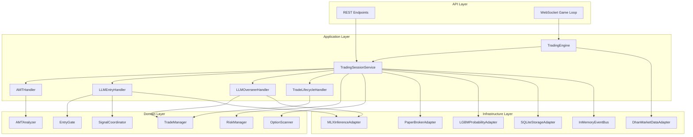
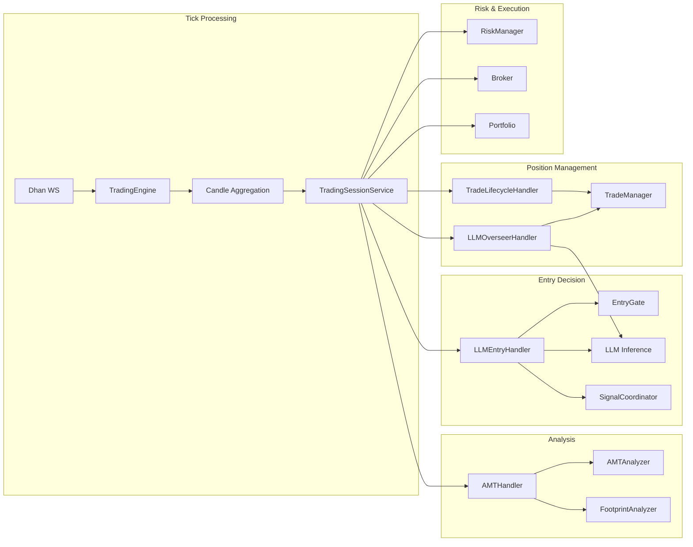
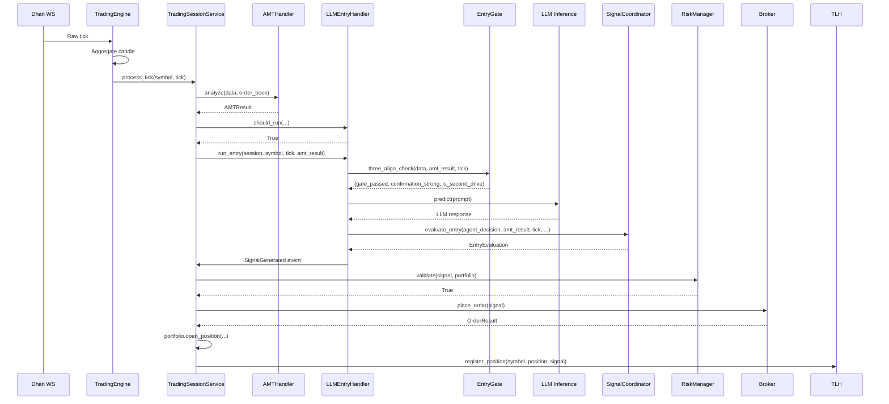
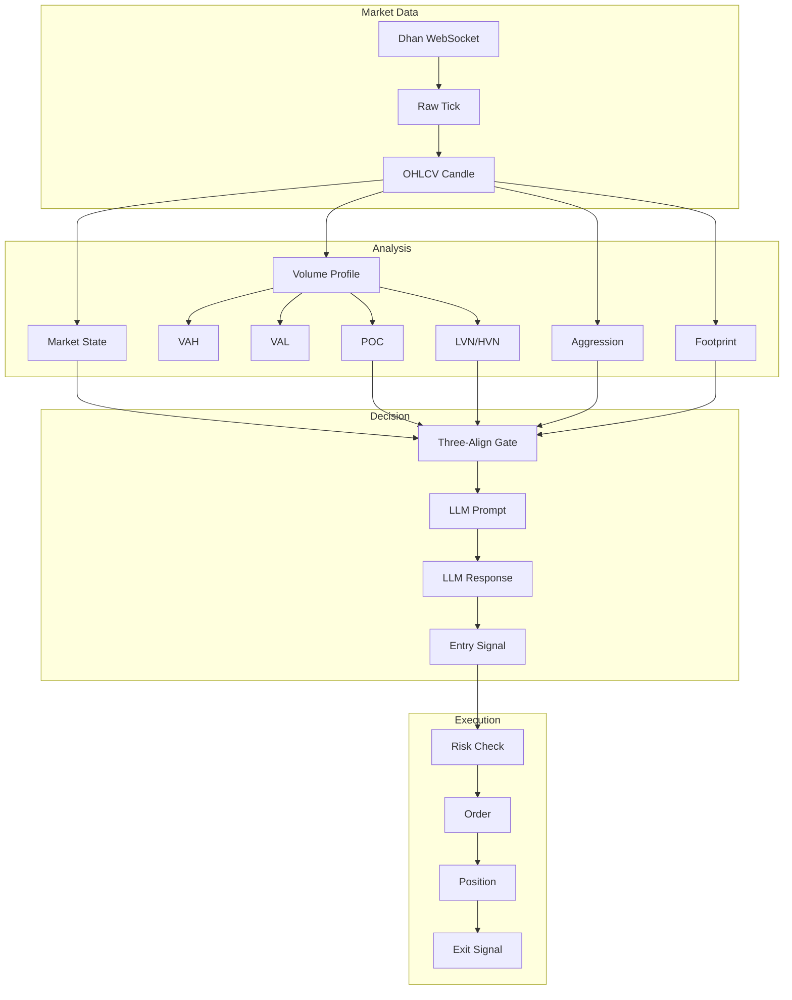

# Backend Trading Engine — Deep Architectural Analysis

**Date:** 2026-03-18  
**Scope:** Backend trading engine only (excluding frontend)  
**Lines Analyzed:** ~15,000+ across 40+ files

---

## 1. System Overview

### What This System Implements

GlassyTrade AI is an **algorithmic options trading system** for Indian derivatives markets (NSE NIFTY/BANKNIFTY options and MCX commodity options). It implements Fabio Valentini's Auction Market Theory (AMT) methodology combined with LLM-powered trade decisions.

### Architectural Style

**Domain-Driven Design (DDD) + Hexagonal Architecture + Event-Driven**

```
┌─────────────────────────────────────────────────────────────────┐
│                    API LAYER (FastAPI)                           │
│  REST endpoints + WebSocket game loop                           │
└──────────────────────────┬──────────────────────────────────────┘
                           │
┌──────────────────────────┴──────────────────────────────────────┐
│                 APPLICATION LAYER                                │
│  TradingEngine (orchestrator)                                    │
│  TradingSessionService (coordinator)                             │
│  Handlers: AMT, LLM Entry, Overseer, Trade Lifecycle, RL        │
└──────────────────────────┬──────────────────────────────────────┘
                           │
┌──────────────────────────┴──────────────────────────────────────┐
│                    DOMAIN LAYER                                  │
│  Fabio AI Services: AMTAnalyzer, EntryGate, TradeManager,       │
│  SignalCoordinator, OptionScanner, RegimeDetector, etc.         │
│  Trading Models: Portfolio, Position, Signal, OHLC, AMTResult   │
│  Ports: MarketDataPort, LLMInferencePort, StoragePort, etc.     │
└──────────────────────────┬──────────────────────────────────────┘
                           │
┌──────────────────────────┴──────────────────────────────────────┐
│                 INFRASTRUCTURE LAYER                             │
│  Adapters: DhanMarketData, PaperBroker, MLXInference,           │
│  LGBMProbability, SQLiteStorage, InMemoryEventBus               │
└─────────────────────────────────────────────────────────────────┘
```

### Key Subsystems

| Subsystem | Purpose | Key Files |
|-----------|---------|-----------|
| **Trading Engine** | Standalone orchestrator, runs independently of frontend | [`engine.py`](backend/app/application/engine.py) |
| **Session Coordinator** | Per-symbol state management, handler delegation | [`trading_session.py`](backend/app/application/services/trading_session.py) |
| **AMT Analysis** | Volume profile, market state, aggression detection | [`amt_analyzer.py`](backend/app/domain/fabio_ai/services/amt_analyzer.py) |
| **Entry Gate** | Three-Align gate (State + Location + Aggression) | [`entry_gate.py`](backend/app/domain/fabio_ai/services/entry_gate.py) |
| **LLM Entry** | AI-powered entry decisions with Fabio Playbook gates | [`llm_entry_handler.py`](backend/app/application/handlers/llm_entry_handler.py) |
| **LLM Overseer** | Active position management via LLM | [`llm_overseer_handler.py`](backend/app/application/handlers/llm_overseer_handler.py) |
| **Trade Manager** | Deterministic exit mechanics (SL/TP/Trail/Time) | [`trade_manager.py`](backend/app/domain/fabio_ai/services/trade_manager.py) |
| **Risk Manager** | Circuit breakers, position sizing, daily limits | [`risk_manager.py`](backend/app/domain/trading/services/risk_manager.py) |
| **Option Scanner** | Momentum-based contract selection | [`option_scanner.py`](backend/app/domain/fabio_ai/services/option_scanner.py) |
| **Signal Coordinator** | Entry signal evaluation and conviction assessment | [`signal_coordinator.py`](backend/app/domain/fabio_ai/services/signal_coordinator.py) |

---

## 2. Complete Component Map

### 2.1 TradingEngine ([`engine.py`](backend/app/application/engine.py))

**Responsibility:** Standalone trading loop that runs independently of frontend WebSocket connections.

**Inputs:**
- `ServiceGraph` (dependency injection container)
- Market data stream (Dhan WebSocket)
- Historical candles (Dhan REST API)

**Outputs:**
- Per-symbol latest state snapshots (read by WS viewers)
- Generation counter for change notification
- Candle data to TradingSessionService

**Dependencies:**
- `ServiceGraph` → provides all services
- `TradingSessionService` → processes ticks
- `MarketDataPort` → Dhan adapter for streaming

**Key Methods:**
- `start()` → Seeds history, starts streaming tasks
- `_tick_loop()` → Main tick processing loop
- `_aggregate_candle()` → Builds OHLCV candles from ticks
- `get_latest_state()` → Read-only access for WS viewers

**Design Patterns:**
- **Observer Pattern:** Generation counter + condition for WS viewer notification
- **Circuit Breaker:** Per-entity circuit breaker for symbol failures
- **Strategy Pattern:** Pluggable market data source (Dhan, file replay, simulation)

---

### 2.2 TradingSessionService ([`trading_session.py`](backend/app/application/services/trading_session.py))

**Responsibility:** Per-symbol state coordinator that delegates to focused handlers.

**Inputs:**
- OHLC ticks from TradingEngine
- Order book snapshots
- Portfolio state

**Outputs:**
- Updated portfolio (positions opened/closed)
- AMT analysis results
- LLM decisions
- Trade signals

**Dependencies:**
- `AMTHandler` → Market structure analysis
- `LLMEntryHandler` → AI entry decisions
- `LLMOverseerHandler` → Active position management
- `TradeLifecycleHandler` → Deterministic exits
- `RLHandler` → Reinforcement learning status
- `RiskManager` → Signal validation
- `OptionSelector` → NSE options enrichment

**Key Methods:**
- `process_tick()` → Main tick processing pipeline
- `get_or_create_session()` → Lazy session initialization
- `_handle_entry_signal()` → Execute validated signals

**Design Patterns:**
- **Facade Pattern:** Coordinates multiple handlers behind single interface
- **Mediator Pattern:** Handlers communicate through session, not directly
- **State Pattern:** SessionState tracks per-symbol mutable state

---

### 2.3 AMTHandler ([`amt_handler.py`](backend/app/application/handlers/amt_handler.py))

**Responsibility:** AMT analysis and footprint generation on every tick.

**Inputs:**
- OHLC candle data
- Order book snapshots
- Prior session POC/VAH/VAL

**Outputs:**
- `AMTResult` → Market state, POC, VAH/VAL, LVN/HVN, aggression
- `AMTResultDTO` → Serialized for frontend
- `FootprintDTO` → Order flow footprint

**Dependencies:**
- `AMTAnalyzer` → Core AMT calculations
- `FootprintAnalyzer` → Order flow analysis
- `IncrementalVolumeProfile` → Efficient VP updates

**Key Methods:**
- `analyze()` → Runs full AMT analysis pipeline
- `_filter_today_session()` → Session-aware candle filtering
- `_to_float_ohlc()` → Decimal→float conversion for analysis

---

### 2.4 LLMEntryHandler ([`llm_entry_handler.py`](backend/app/application/handlers/llm_entry_handler.py))

**Responsibility:** LLM-based entry decisions with Fabio Playbook gates.

**Inputs:**
- AMT analysis results
- Current tick data
- Session context
- Footprint data

**Outputs:**
- `Signal` → Entry signal with direction, SL, TP
- `AIAnalysisCompleted` event
- LLM decision metadata

**Dependencies:**
- `GenerativeAIService` → LLM inference
- `EventBusPort` → Event publishing
- `TradeManager` → Position management
- `RegimeDetector` → Market regime detection

**Key Methods:**
- `should_run()` → Throttling and precondition checks
- `run_entry()` → Background thread LLM inference
- `_llm_worker_loop()` → Per-symbol worker thread

**Design Patterns:**
- **Worker Thread Pattern:** Per-symbol background threads for LLM inference
- **Queue Pattern:** Bounded queues prevent regime-change storms
- **Double-Checked Locking:** RegimeDetector lazy initialization

---

### 2.5 LLMOverseerHandler ([`llm_overseer_handler.py`](backend/app/application/handlers/llm_overseer_handler.py))

**Responsibility:** Active position management via LLM every ~3-10 seconds.

**Inputs:**
- Open position state
- Current tick data
- AMT results
- Footprint data

**Outputs:**
- Overseer actions: HOLD, TIGHTEN_SL, PARTIAL_EXIT, FULL_EXIT, ADD
- Position modifications via TradeManager

**Dependencies:**
- `GenerativeAIService` → LLM inference
- `TradeManager` → Position modifications
- `ProbabilityInferencePort` → Probability scoring

**Key Methods:**
- `should_run()` → Cooldown and state checks
- `run_overseer()` → Background thread overseer analysis
- `_llm_worker_loop()` → Per-symbol worker thread

**Design Patterns:**
- **Worker Thread Pattern:** Same as LLMEntryHandler
- **Rate Limiting:** ADD cooldown (2 min), max 2 ADDs per position

---

### 2.6 TradeLifecycleHandler ([`trade_lifecycle_handler.py`](backend/app/application/handlers/trade_lifecycle_handler.py))

**Responsibility:** Deterministic position management (SL/TP/Trail/Time).

**Inputs:**
- Portfolio with open positions
- Current price
- CVD divergence signals
- AMT results

**Outputs:**
- Position closes (full or partial)
- Exit signals with reasons

**Dependencies:**
- `TradeManager` → Exit logic
- `Portfolio` → Position state

**Key Methods:**
- `check_exits()` → Check all open positions for exit conditions
- `register_position()` → Register new position with TradeManager
- `ensure_position_consistency()` → Portfolio/TradeManager sync

**Exit Conditions Checked:**
1. Spread blowout (bid-ask > 3%)
2. Scale-in triggers (Fabio 40/30/30 rule)
3. CVD kill signal
4. CVD-based breakeven
5. VWAP trailing
6. Imbalance tightening
7. Standard SL/TP/Trail/Time stops

---

### 2.7 TradeManager ([`trade_manager.py`](backend/app/domain/fabio_ai/services/trade_manager.py))

**Responsibility:** Deterministic tick-level trade management with NO LLM dependency.

**Inputs:**
- Position registration data
- Current price on each tick
- CVD signals
- VWAP bands

**Outputs:**
- `ExitSignal` → Exit reason and price
- Position metrics (MAE/MFE, R-multiple)

**Key Configuration:**
```python
TradeManagerConfig:
    stop_loss_pct: 0.005          # 0.5% hard stop
    take_profit_pct: 0.015        # 1.5% take profit
    trail_step_pct: 0.20          # Trail 20% behind peak
    max_hold_seconds: 1800        # 30 min time stop
    partial_tp_pct: 0.50          # Partial at 50% of TP
    runner_close_pct: 0.75        # Close 75% at target
    breakeven_at_1r: True         # Move SL to entry at 1R
    cvd_breakeven: True           # CVD-confirmed breakeven
```

**Exit Reasons:**
- `STOP_LOSS` — Hard stop hit
- `TAKE_PROFIT` — Target reached
- `TRAILING_STOP` — Trail triggered
- `TIME_STOP` — Max hold time exceeded
- `PARTIAL_TAKE_PROFIT` — Partial at 50% TP
- `SCRATCH` — Small profit/loss exit
- `OVERSEER_EXIT` — LLM decided to exit
- `SPREAD_BLOWOUT` — Bid-ask too wide

**Design Patterns:**
- **State Machine:** ManagedPosition tracks position lifecycle
- **Strategy Pattern:** Different trail/exit strategies per market state
- **Template Method:** check_position() orchestrates exit checks

---

### 2.8 RiskManager ([`risk_manager.py`](backend/app/domain/trading/services/risk_manager.py))

**Responsibility:** Signal validation and circuit breakers.

**Circuit Breakers:**
- `MAX_DAILY_DRAWDOWN_PCT: 0.05` — 5% from day's peak equity
- `MAX_CONSECUTIVE_LOSSES: 5` — 5 consecutive losses halts trading
- `MAX_CONCURRENT_POSITIONS: 5` — Max 5 open positions
- `MAX_PORTFOLIO_NOTIONAL_PCT: 0.60` — 60% of equity total
- `MAX_PER_SYMBOL_NOTIONAL_PCT: 0.20` — 20% per symbol

**Key Methods:**
- `validate()` → Check signal against all risk constraints
- `record_trade_result()` → Update daily state after trade closes
- `halt_trading()` / `resume_trading()` → Emergency kill switch

**Design Patterns:**
- **Circuit Breaker Pattern:** Global and per-day halt mechanisms
- **State Pattern:** DailyRiskState tracks intra-day metrics

---

### 2.9 EntryGate ([`entry_gate.py`](backend/app/domain/fabio_ai/services/entry_gate.py))

**Responsibility:** Pure quant functions for Fabio Playbook entry gates.

**Three-Align Gate:**
1. **Market State** — BALANCED or IMBALANCED
2. **Location** — Price near structural level (POC, LVN, aggressive prints)
3. **Aggression** — Volume impulse + delta + spread confirmation

**Key Functions:**
- `three_align_check()` → Main gate (ALL THREE must align)
- `min_candles_gate()` → Don't trade first 15-30 minutes
- `full_body_close_gate()` → Require full body candle close
- `cluster_aggressive_prints()` → Cluster volume bubbles
- `extract_bubble_levels_from_footprint()` → Structural levels from footprint

**Design Patterns:**
- **Pure Functions:** Stateless, side-effect-free
- **Decorator Pattern:** `@lru_cache` for repeated calculations

---

### 2.10 SignalCoordinator ([`signal_coordinator.py`](backend/app/domain/fabio_ai/services/signal_coordinator.py))

**Responsibility:** Entry signal evaluation and conviction assessment.

**Conviction Thresholds:**
- `HIGH_CONVICTION_PROB: 0.65` — Strong edge, execute regardless
- `MEDIUM_CONVICTION_PROB: 0.55` — Needs structural confirmation
- `MIN_PROB_FOR_ENTRY: 0.55` — Minimum to consider

**Key Method:**
- `evaluate_entry()` → Single decision point for all entry logic

**Returns:** `EntryEvaluation` with:
- `should_enter: bool`
- `direction: str` (LONG/SHORT/FLAT)
- `probability: float`
- `conviction: str` (HIGH/MEDIUM/LOW/NONE)
- `setup_type: str` (MEAN_REVERSION/TREND_CONTINUATION)

---

### 2.11 OptionScanner ([`option_scanner.py`](backend/app/domain/fabio_ai/services/option_scanner.py))

**Responsibility:** Momentum-based contract selection for MCX/NSE.

**Scoring:**
- ATM proximity (40 pts)
- OI liquidity (30 pts)
- Volume (20 pts)
- Delta sweet spot 0.40-0.60 (10 pts)

**Hard Filters:**
- Minimum OI per underlying
- Max spread 2.5%
- Positive LTP

---

### 2.12 Infrastructure Adapters

| Adapter | File | Purpose |
|---------|------|---------|
| `DhanMarketDataAdapter` | [`dhan_adapter.py`](backend/app/infrastructure/adapters/dhan_adapter.py) | Market data via Dhan broker API |
| `PaperBrokerAdapter` | [`paper_broker.py`](backend/app/infrastructure/adapters/paper_broker.py) | Simulated trading for backtesting |
| `MLXInferenceAdapter` | [`mlx_inference_adapter.py`](backend/app/infrastructure/adapters/mlx_inference_adapter.py) | Apple Silicon MLX LLM inference |
| `LGBMProbabilityAdapter` | [`lgbm_probability_adapter.py`](backend/app/infrastructure/adapters/lgbm_probability_adapter.py) | LightGBM probability scoring |
| `SQLiteStorageAdapter` | [`database.py`](backend/app/infrastructure/storage/database.py) | SQLite persistence |
| `InMemoryEventBus` | [`event_bus.py`](backend/app/infrastructure/event_bus.py) | In-memory pub/sub events |

---

## 3. Full Execution Flow

### 3.1 Startup Sequence

```
FastAPI Lifespan
    │
    ├─→ ServiceGraph.get_service_graph()
    │   ├─→ Create InMemoryEventBus
    │   ├─→ Create DhanMarketDataAdapter
    │   ├─→ Create PaperBrokerAdapter
    │   ├─→ Create MLXInferenceAdapter
    │   ├─→ Create LGBMProbabilityAdapter
    │   ├─→ Create SQLiteStorageAdapter → AsyncPersistenceBus
    │   ├─→ Create TradingSessionService
    │   ├─→ Pre-warm DhanBroker (instrument cache)
    │   └─→ OptionScannerService.scan_top_n()
    │       └─→ Select active_symbols[]
    │
    ├─→ LLM model loading (up to 120s)
    │   └─→ llm.wait_until_ready() → llm.validate()
    │
    └─→ TradingEngine.start()
        ├─→ _seed_history() for each symbol
        │   └─→ fetch_history() → session.data[]
        ├─→ _tick_loop_forever() [async task]
        ├─→ _sl_watchdog_loop() [async task]
        └─→ _stale_stream_watchdog() [async task]
```

### 3.2 Tick Processing Pipeline

```
Dhan WebSocket Stream
    │
    ▼
TradingEngine._tick_loop()
    │
    ├─→ Validate tick (NaN, Inf, negative checks)
    ├─→ Circuit breaker check (per-symbol)
    ├─→ OI tracking (change detection)
    ├─→ Footprint accumulation (TickFootprintAccumulator)
    │
    ├─→ _aggregate_candle()
    │   ├─→ Update OHLCV candle state
    │   ├─→ Track buy/sell volume from delta
    │   └─→ Return (candle, is_new_candle)
    │
    └─→ TradingSessionService.process_tick(symbol, tick, ...)
        │
        ├─→ get_or_create_session(symbol)
        │   └─→ Initialize SessionState, RiskManager, AMTHandler
        │
        ├─→ AMTHandler.analyze(data, order_book, ...)
        │   ├─→ IncrementalVolumeProfile.update()
        │   ├─→ AMTAnalyzer.analyze()
        │   │   ├─→ create_profile() → Volume Profile
        │   │   ├─→ find_lvns() / find_hvns()
        │   │   ├─→ detect_market_state()
        │   │   ├─→ detect_aggression()
        │   │   └─→ classify_shape()
        │   └─→ FootprintAnalyzer.generate()
        │
        ├─→ TradeLifecycleHandler.check_exits(portfolio, price, ...)
        │   ├─→ Spread blowout check
        │   ├─→ Scale-in check (40/30/30)
        │   ├─→ CVD kill signal
        │   ├─→ CVD breakeven
        │   ├─→ VWAP trail
        │   ├─→ Imbalance tighten
        │   └─→ Standard SL/TP/Trail/Time
        │
        ├─→ LLMEntryHandler.should_run(...)
        │   └─→ If True: run_entry() [background thread]
        │       ├─→ three_align_check() → Gate validation
        │       ├─→ build_prompt() → AMT context + session info
        │       ├─→ GenerativeAIService.predict() → LLM inference
        │       ├─→ parse_llm_response() → Extract decision
        │       └─→ SignalCoordinator.evaluate_entry()
        │           └─→ EntryEvaluation (should_enter, direction, probability)
        │
        ├─→ LLMOverseerHandler.should_run(...)
        │   └─→ If True: run_overseer() [background thread]
        │       ├─→ build_overseer_prompt()
        │       ├─→ GenerativeAIService.predict()
        │       ├─→ parse_overseer_response()
        │       └─→ Execute action (HOLD/TIGHTEN/EXIT/ADD)
        │
        └─→ RiskManager.validate(signal, portfolio)
            └─→ If valid: execute_trade()
                ├─→ broker.place_order()
                ├─→ portfolio.open_position()
                └─→ TradeLifecycleHandler.register_position()
```

### 3.3 Event Flow

```
TickReceived
    │
    ├─→ AMTAnalysisCompleted
    │   └─→ (triggers LLM entry check)
    │
    ├─→ AIAnalysisCompleted
    │   └─→ (triggers signal evaluation)
    │
    ├─→ SignalGenerated
    │   └─→ (triggers risk validation)
    │
    ├─→ PositionOpened
    │   └─→ (triggers TradeManager registration)
    │
    └─→ PositionClosed
        └─→ (triggers RiskManager.record_trade_result())
```

---

## 4. Data Flow Analysis

### 4.1 Market Data Flow

```
Dhan WebSocket → TradingEngine._tick_loop()
    │
    ├─→ Raw tick: {ltp, volume, oi, timestamp, ...}
    │
    ├─→ Candle aggregation: OHLCV + delta
    │
    └─→ TradingSessionService.process_tick()
        │
        ├─→ AMTHandler.analyze()
        │   ├─→ Volume Profile (200 buckets)
        │   ├─→ POC, VAH, VAL calculation
        │   ├─→ LVN/HVN detection
        │   ├─→ Market state (BALANCED/IMBALANCED)
        │   └─→ Aggression scoring (sigma-based)
        │
        └─→ FootprintAnalyzer.generate()
            └─→ Order flow footprint per candle
```

### 4.2 Signal Flow

```
AMTResult + Tick + SessionInfo
    │
    ├─→ three_align_check()
    │   ├─→ State check (BALANCED/IMBALANCED)
    │   ├─→ Location check (near structural level)
    │   └─→ Aggression check (volume impulse + delta)
    │
    ├─→ LLMEntryHandler.run_entry()
    │   ├─→ Build prompt with AMT context
    │   ├─→ LLM inference (1-2 seconds)
    │   └─→ Parse response → Signal
    │
    ├─→ SignalCoordinator.evaluate_entry()
    │   └─→ EntryEvaluation (conviction, direction, probability)
    │
    └─→ RiskManager.validate()
        └─→ If valid → execute_trade()
```

### 4.3 Position Lifecycle Flow

```
Signal Generated
    │
    ├─→ RiskManager.validate()
    │   ├─→ Kill switch check
    │   ├─→ Daily halt check
    │   ├─→ Max positions check
    │   ├─→ Portfolio notional cap
    │   └─→ Per-symbol notional cap
    │
    ├─→ broker.place_order()
    │   └─→ PaperBroker or DhanBroker
    │
    ├─→ portfolio.open_position()
    │
    ├─→ TradeLifecycleHandler.register_position()
    │   └─→ TradeManager.register_position()
    │
    ├─→ [Every tick] TradeLifecycleHandler.check_exits()
    │   ├─→ Spread blowout
    │   ├─→ Scale-in (40/30/30)
    │   ├─→ CVD kill signal
    │   ├─→ CVD breakeven
    │   ├─→ VWAP trail
    │   ├─→ Imbalance tighten
    │   └─→ Standard SL/TP/Trail/Time
    │
    ├─→ [Every 3-10s] LLMOverseerHandler.run_overseer()
    │   ├─→ HOLD / TIGHTEN_SL / PARTIAL_EXIT / FULL_EXIT / ADD
    │   └─→ Execute action via TradeManager
    │
    └─→ Position Closed
        ├─→ portfolio.close_position()
        ├─→ TradeManager.unregister_position()
        ├─→ RiskManager.record_trade_result()
        └─→ TradeJournal.log_trade()
```

---

## 5. Design Patterns Used

### 5.1 SOLID Principles

| Principle | Implementation |
|-----------|----------------|
| **Single Responsibility** | Each handler has one concern (AMT, LLM Entry, Overseer, Lifecycle) |
| **Open/Closed** | Ports/Adapters pattern allows new implementations without changing domain |
| **Liskov Substitution** | All adapters implement port interfaces correctly |
| **Interface Segregation** | StoragePort split into TickStoragePort, TradeStoragePort, etc. |
| **Dependency Inversion** | Domain depends on ports, infrastructure implements ports |

### 5.2 Design Patterns

| Pattern | Where Used |
|---------|------------|
| **Hexagonal Architecture** | Ports in `domain/ports/`, Adapters in `infrastructure/adapters/` |
| **Dependency Injection** | `ServiceGraph` factory in [`dependencies.py`](backend/app/api/dependencies.py) |
| **Observer Pattern** | `EventBusPort` for pub/sub events |
| **Strategy Pattern** | Pluggable broker (Paper/Dhan), pluggable LLM (MLX/OpenRouter) |
| **Facade Pattern** | `TradingSessionService` coordinates multiple handlers |
| **Mediator Pattern** | Handlers communicate through session, not directly |
| **State Machine** | `ManagedPosition` tracks position lifecycle states |
| **Circuit Breaker** | `PerEntityCircuitBreaker` for symbol failures |
| **Worker Thread Pattern** | Per-symbol background threads for LLM inference |
| **Queue Pattern** | Bounded queues prevent regime-change storms |
| **Pure Functions** | `entry_gate.py` — stateless, side-effect-free gate logic |
| **Template Method** | `TradeManager.check_position()` orchestrates exit checks |
| **Decorator Pattern** | `@lru_cache` for repeated calculations |

---

## 6. Concurrency Model

### 6.1 Threading Architecture

```
Main Thread (asyncio event loop)
    │
    ├─→ TradingEngine._tick_loop_forever() [async task]
    │   └─→ Streams ticks, aggregates candles, calls process_tick()
    │
    ├─→ TradingEngine._sl_watchdog_loop() [async task]
    │   └─→ Monitors stop-loss triggers
    │
    ├─→ TradingEngine._stale_stream_watchdog() [async task]
    │   └─→ Detects stale data, switches to polling mode
    │
    └─→ TradingSessionService.process_tick() [called from main thread]
        │
        ├─→ LLMEntryHandler.run_entry() [ThreadPoolExecutor, 1 worker]
        │   └─→ Per-symbol worker threads for LLM inference
        │
        └─→ LLMOverseerHandler.run_overseer() [ThreadPoolExecutor, 1 worker]
            └─→ Per-symbol worker threads for LLM inference
```

### 6.2 Thread Safety

- **SessionState._lock:** `threading.Lock` for portfolio reads/writes
- **TradeManager._lock:** `threading.RLock` for position management
- **LLM queues:** `queue.Queue` (thread-safe) per symbol
- **Double-checked locking:** RegimeDetector lazy initialization

### 6.3 Async Processing

- **FastAPI lifespan:** Async context manager for startup/shutdown
- **TradingEngine:** All streaming tasks are async
- **AsyncPersistenceBus:** Background thread for database writes
- **WebSocket game loop:** Async for real-time frontend updates

---

## 7. Weaknesses and Improvements

### 7.1 Architectural Weaknesses

| Issue | Impact | Recommendation |
|-------|--------|----------------|
| **Two parallel execution paths** | 1,946 lines of unused pipeline code | Document as future migration path or remove |
| **Duplicate market state logic** | `amt_analyzer.py` and `market_structure_classifier.py` compute different states | Pick one authoritative source |
| **Inconsistent CVD thresholds** | 50, 100, 150 in different files | Single constant `CVD_EXTREME_THRESHOLD = 100` |
| **Bare exception clauses** | 20+ silent failures | Use specific exceptions or at minimum `log.error()` |
| **Large file sizes** | `trading_session.py` (1,899 lines), `llm_entry_handler.py` (1,270 lines) | Split into smaller modules |
| **Magic numbers** | Thresholds scattered across files | Move to centralized config |

### 7.2 Performance Risks

| Risk | Mitigation |
|------|------------|
| LLM inference latency (1-2s) | Background threads, bounded queues, cooldowns |
| Volume profile rebuild on day boundary | IncrementalVolumeProfile with O(buckets) updates |
| Memory growth in long-running sessions | `MAX_CANDLES_PER_SYMBOL = 2000` cap |
| Database write contention | AsyncPersistenceBus with background thread |

### 7.3 Scalability Issues

| Issue | Current State | Improvement |
|-------|---------------|-------------|
| Single-threaded LLM inference | 1 worker per handler | Increase ThreadPoolExecutor workers |
| In-memory event bus | Single process | Replace with Redis/NATS for multi-process |
| SQLite storage | Single-writer | Migrate to PostgreSQL for production |
| Per-symbol state | Dict-based | Consider sharding for 100+ symbols |

### 7.4 Missing Functionality

| Feature | Status | Effort |
|---------|--------|--------|
| Squeeze detection | Components exist, not connected | 2-3 hours |
| VWAP trailing | Bands computed, not used for trailing | 1-2 hours |
| Cross-index correlation | BANKNIFTY/NIFTY treated independently | 3-4 hours |
| IV regime adaptation | IV tracked, not used for strike selection | 2-3 hours |
| E2E tests with real data | Only synthetic tests exist | 1-2 days |

---

## 8. Architecture Summary

### Subsystems

```
┌─────────────────────────────────────────────────────────────────┐
│                    TRADING ENGINE                                │
│  Standalone orchestrator, runs independently of frontend        │
│  Streams market data, aggregates candles, delegates to session  │
└──────────────────────────┬──────────────────────────────────────┘
                           │
┌──────────────────────────┴──────────────────────────────────────┐
│                 SESSION COORDINATOR                              │
│  Per-symbol state management, handler delegation                │
│  Manages: AMT, LLM Entry, Overseer, Lifecycle, RL               │
└──────────────────────────┬──────────────────────────────────────┘
                           │
        ┌──────────────────┼──────────────────┐
        │                  │                  │
┌───────┴───────┐  ┌───────┴───────┐  ┌───────┴───────┐
│  AMT ANALYSIS │  │  LLM DECISION │  │   EXECUTION   │
│  Volume Profile│  │  Entry Gate   │  │  Trade Manager│
│  Market State │  │  LLM Inference│  │  Risk Manager │
│  Aggression   │  │  Overseer     │  │  Broker       │
└───────────────┘  └───────────────┘  └───────────────┘
```

### Interfaces (Ports)

| Port | Purpose | Implementations |
|------|---------|-----------------|
| `MarketDataPort` | Market data streaming | `DhanMarketDataAdapter` |
| `BrokerPort` | Order execution | `PaperBrokerAdapter`, `DhanBrokerAdapter` |
| `LLMInferencePort` | LLM inference | `MLXInferenceAdapter` |
| `ProbabilityInferencePort` | Probability scoring | `LGBMProbabilityAdapter` |
| `StoragePort` | Persistence | `SQLiteStorageAdapter` |
| `EventBusPort` | Event pub/sub | `InMemoryEventBus` |

### Deployment Model

- **Single-process FastAPI application** with uvicorn
- **Async event loop** for streaming and WebSocket
- **Thread pool** for LLM inference (CPU-bound)
- **SQLite** for local persistence
- **Dhan WebSocket** for live market data
- **Apple Silicon MLX** for local LLM inference

---

## 9. Visual Diagrams

### 9.1 High-Level Architecture Diagram



### 9.2 Component Interaction Diagram



### 9.3 Sequence Diagram — Entry Flow



### 9.4 Data Flow Diagram



---

*Analysis completed: 2026-03-18*  
*Files analyzed: 40+ backend files*  
*Lines analyzed: ~15,000+*
