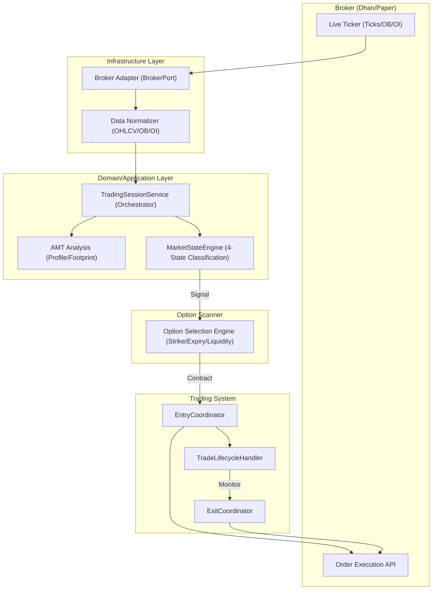

# AMT Options Scalper System: Architecture Deep-Dive

This document provides an in-depth explanation of the data flow and interaction between the **Broker**, the **Option Scanner**, and the **Trading System**.

---

## 1. High-Level Architecture Overview

The system follows an event-driven, decoupled architecture where market data ingress is separated from the analytical "brain" and the execution "hands".

---

## 2. Broker Ingress Layer & Data Normalization

The system interacts with the outside world through **Adapters** implementing the `BrokerPort`.

- **Live Data Ingress**: The `TradingSessionService.process_tick()` is the main entry point. It receives dual-feed data:
    - **Underlying Futures**: Used for high-precision AMT (Volume Profile) analysis.
    - **Option Premium**: Used for execution and PnL tracking.
- **Normalization**: Raw ticks are converted into `OHLC` value objects, ensuring a consistent format regardless of the broker (Dhan, Shoonya, or Paper).
- **Dual Feed Logic**: To avoid the "Option Lag" problem, the system uses the Underlying Futures to calculate VAH/VAL/POC, as they represent the true value area.

---

## 3. Market State & AMT Analysis

Before any trade is considered, the system analyzes the "Market Context" using Auction Market Theory (AMT).

### Volume Profile & Footprint (`AMTHandler`)
- **Volume Profile**: Builds a distribution of volume across price levels to identify **POC** (Point of Control), **VAH** (Value Area High), and **VAL** (Value Area Low).
- **Footprint**: Analyzes the bid/ask delta within each candle to detect **Aggressive Prints** and **Stacked Imbalances**.
- **CVD (Cumulative Volume Delta)**: Tracks the exhaustion or aggression of buyers vs. sellers.

### Market State Engine (4-State Classification)
The `MarketStateEngine` (FR-04) classifies the symbol based on the current price relative to the Value Area:
1.  **NO_TRADE**: Price is within the "Dead Zone" near POC (no edge).
2.  **BALANCED**: Price is inside the Value Area (Mean Reversion setups).
3.  **IMBALANCED**: Price is outside VA with Displacement + Acceptance (Trend continuation).
4.  **PROBING**: Price is outside VA without confirmation (High risk).

---

## 4. The Option Scanner (`OptionSelectionEngine`)

Once a setup (AAA, MR, or Scalp) is detected on the underlying, the **Option Scanner** selects the optimal contract. This is a deterministic, rule-based engine.

### Selection Criteria:
- **Moneyness**:
    - **Scalp / AAA Trend**: ATM (At-The-Money) for maximum Delta/Gamma response.
    - **Mean Reversion (MR)**: OTM-1 (Out-of-The-Money) to capture rotation at a cheaper premium.
- **Liquidity Filters**:
    - **Min OI**: At least 100k (Nifty) or 30k (BankNifty) to ensure easy filling.
    - **Max Spread**: Bid-Ask spread must be < 10% (ideally < 2%) of the premium.
    - **Min Volume**: Minimum volume threshold to avoid "Ghost Strikes".
- **Theta Viability**:
    - Calculate `Total Theta Cost` for the expected hold time.
    - **Rule**: If Theta cost > 20% of expected profit, the trade is rejected.
- **Expiry Logic**:
    - **Current Week**: Preferred for maximum Gamma.
    - **Gamma Trap**: On expiry day (after 14:30), the engine automatically skips to the **Next Week** expiry to avoid pin risk.

---

## 5. Trading System & Execution Loop

The execution is orchestrated by per-symbol handlers that ensure clean transitions from Signal to Order.

### Entry Coordinator
1.  **Signal Generation**: An "Aggressive Print" or "VA Breakout" generates a signal.
2.  **Contract Resolution**: Calls the Option Scanner to pick the strike.
3.  **Order Placement**: Sends a **MARKET BUY** (or SELL) to the broker adapter.
4.  **Hard Stop Loss**: Immediately places an **SL-M (Stop Loss Market)** order at the exchange. This "Handshake" ensures protection even if the internet goes down.

### Trade Lifecycle Handler
- **Monitoring**: Constant monitoring of the "Virtual SL" (trailing) and "Hard SL" (exchange-side).
- **Exits**:
    - **Take Profit (TP)**: Set based on R:R or structural levels (VAH/VAL).
    - **Trailing SL**: Moves the SL to breakeven or trail the price move.
    - **Emergency Exit**: Triggered by "Flash Crash" or "Session Close" (15:15 IST).

---

## 6. Observability & UI Projection

The system state is not just a bunch of variables; it's a **Projection** for the user.

- **State Snapshot**: Every tick processed updates a `StateSnapshot` (DTO).
- **FastAPI**: Serves this snapshot via WebSockets or REST for the web frontend.
- **Rich CLI Dashboard**: Provides a low-latency, "war-map" view of the Footprint and Volume Profile directly in the terminal, including the LLM's "Trade Thesis".

---

> [!TIP]
> The system's "Secret Sauce" is the **Dual-Feed AMT**. By analyzing the underlying futures but executing on options, it gains the precision of institucional volume profile while capturing the leverage of options.
