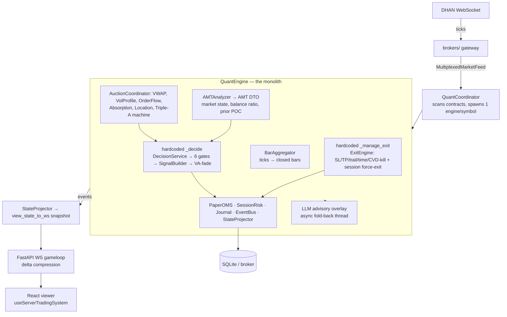
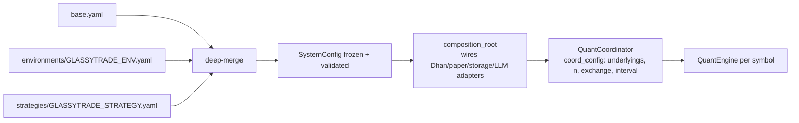
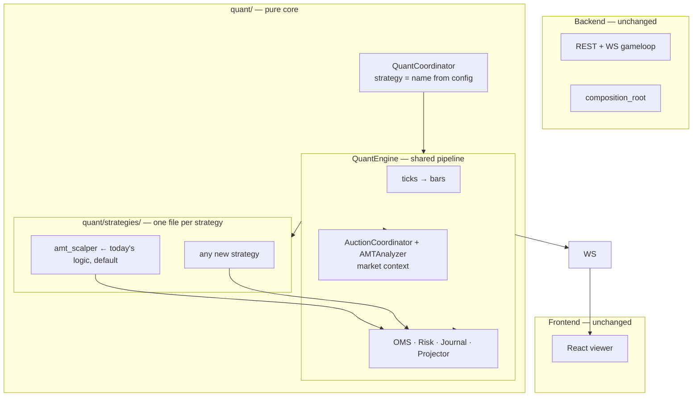

# Strategy Separation Proposal — GlassyTrade AI

> **Goal:** separate the three concerns — **frontend**, **backend**, **strategy** — so a new
> strategy is a *new file + new YAML*, not an edit to the trading engine.
> **Status:** analysis of the existing system + target design. No code changed.

---

## 1. TL;DR

| Boundary | Status today | Verdict |
|---|---|---|
| Frontend ↔ Backend | Pure WS viewer, delta-compressed snapshots, zero market math in the UI | ✅ **Done** — no work needed |
| Backend ↔ Quant core | Ports (`IMarketData`/`IBroker`/`IStorage`/`ILLMInference`) + DI composition root | ✅ **Good** — no work needed |
| **Strategy ↔ Engine** | Strategy logic is **fused into `QuantEngine`** (`quant/runtime.py`, ~1,100 lines) | ❌ **The gap** — this is the whole problem |

Today a "strategy" is **config only**: `GLASSYTRADE_STRATEGY=nse_options|mcx_options` swaps a
YAML (instruments, thresholds, flags) — but **both run the exact same hardcoded decision
logic**. There is no `Strategy` abstraction. Adding a genuinely new strategy (trend-following,
mean-reversion, breakout) means editing the engine, the gate pipeline, and the exit engine.

The fix is small and surgical: the engine already has exactly **two decision seams** —
`_decide()` (entry) and `_manage_exit()` (exit). Extract a two-method `Strategy` protocol,
move today's logic into `AmtScalperStrategy` (default), and let `QuantCoordinator` resolve the
strategy by name from a tiny registry. Everything else stays.

## 1.5 Graphify-verified evidence (2026-08-11, graph 091a0c30)

Graph: 10,934 nodes · 23,001 edges · 449 communities. Findings:

| Check | Result | Verdict |
|---|---|---|
| `god-nodes` | `OHLC` 295, `AMTAnalyzer` 219, `Instrument` 155, `DhanBroker` 142, **`QuantEngine` 119**, `build_entry_prompt()` 109… | Engine is a top-7 architectural hub |
| `explain QuantEngine` | Engine **directly instantiates** `DecisionService` (`runtime.py:L193`), `ExitEngine`, `SessionRisk`, `PaperOMS`, `AMTAnalyzer`, `AuctionCoordinator`, `StateProjector` | Strategy logic fused into the engine — no `Strategy` node exists in the graph |
| `explain DecisionService` | Only inbound edge is `QuantEngine [uses]`; it chains `GatePipeline` → `SignalBuilder` → VA-fade | The whole decision path hangs off the engine with zero indirection |
| `affected QuantEngine` | 60+ callers incl. every system/unit test; `QuantCoordinator._spawn_engine` | High blast radius — exactly why a strategy edit is expensive |
| `explain useServerTradingSystem` | **7 edges, all frontend-local**; imports only from `App.tsx` + tests | Frontend is a thin WS consumer — boundary already clean |
| `query: frontend→backend imports` | No frontend code imports backend symbols; the only seam is the WS snapshot shape | Frontend/backend separation verified in the graph |
| `explain view_state_to_ws` | 25 edges; contract-shape tests (`test_view_state_to_ws_has_frontend_snapshot_keys`, `test_ws_contract_carries_auction_and_quant_decision_on_approved_bars`) | The WS envelope is the stable contract any strategy must emit |

---

## 2. Current architecture — flows

### 2.1 Live data flow



### 2.2 Startup / config flow



### 2.3 Key files

| Layer | File | Role |
|---|---|---|
| Strategy logic | `quant/runtime.py` | `QuantEngine` — tick→bar, decide, exit, OMS, LLM, projector (the monolith) |
| Strategy logic | `quant/decision/decision_service.py` | hardcoded `GatePipeline` + VA-fade fallback |
| Strategy logic | `quant/decision/pipeline.py` | gates 1–6 hardcoded tuple |
| Strategy logic | `quant/execution/exits.py` | `ExitEngine` (parameterized but wired only here) |
| Strategy logic | `quant/coordinator.py` | `QuantCoordinator` — scanner, per-symbol engines |
| Context | `quant/amt/analyzer.py`, `quant/auction_state.py`, `quant/triple_a.py`, `quant/vwap.py`, `quant/volume_profile.py`, `quant/order_flow.py`, `quant/absorption.py`, `quant/location.py`, `quant/bars.py` | market-context builders (shared, reusable) |
| Shared infra | `quant/execution/oms.py`, `risk.py`, `order.py`; `quant/state.py`; `quant/persistence.py` | OMS/risk/journal/projector |
| Ports | `quant/contracts/ports/` | `IMarketData`, `IBroker`, `IStorage`, `ILLMInference` |
| Backend | `backend/app/main.py`, `application/di/composition_root.py` | lifespan + DI |
| Backend | `backend/app/api/websocket/gameloop.py` | thin WS transport over coordinator snapshots |
| Config | `backend/app/config_models/loader.py` + `backend/config/strategies/*.yaml` | strategy = parameters only |
| Frontend | `frontend/hooks/useServerTradingSystem.ts`, `frontend/components/*` | pure viewer |

---

## 3. Why adding a strategy is hard today

Walk through adding a **50-SMA cross** (a strategy with zero interest in absorption/order-flow):

1. **No home for it.** The decision path is `_decide()` → `DecisionService` → `GatePipeline`
   (gates 1–6) → `SignalBuilder` → VA-fade. Every step is Triple-A/AMT-specific. You would
   either bolt an `if strategy == "sma_cross":` branch into `_decide`, or edit the gate tuple.
2. **Exits are hardcoded.** `_manage_exit()` calls `ExitEngine` with session-force-exit rules.
   A trend-follower wants `time_stop`/`trail` semantics that may not exist.
3. **The engine owns the decisions' inputs.** `DecisionContext`, session gates, warmup, LLM
   consensus state, AMT DTO — all assembled *inside* the engine and shaped for the AMT gates.
4. **New state → frontend edits.** A strategy emitting new fields would need `ws_adapter.py` +
   `frontend/types.ts` + hook changes (acceptable today, but it should be optional).

Net effect: **every new strategy is an engine edit** — the opposite of pluggable.

---

## 4. Target design — a Strategy boundary

### 4.1 Principle

> **Market context is shared; decisions are pluggable.**
> The engine owns *what happened* (bars → context). The strategy owns *what we do about it*
> (entry + exit). One narrow protocol, two hooks.



### 4.2 The protocol (2 methods, not 10)

```python
# quant/strategies/base.py

class Strategy(Protocol):
    """The entire strategy surface. Entry + exit. Everything else is shared."""

    name: str

    def decide_entry(self, ctx: EntryContext) -> EntrySignal | None:
        """Called once per closed bar when flat. Return a signal to trade, else None."""
        ...

    def decide_exit(self, ctx: ExitContext) -> ExitDecision | None:
        """Called once per closed bar when in a position. Return an exit, else None."""
        ...
```

- `EntryContext` = today's `DecisionContext` (state, bar, amt_dto, session facts, warmup,
  position, risk, LLM advisory, tick_size, equity…) — **unchanged shape**, just renamed and
  enriched with the AMT DTO.
- `ExitContext` = position + state + bar + session facts + depth + entry time (all the inputs
  `_manage_exit()` already gathers).
- `ExitDecision` already exists (`quant/execution/exits.py`). Reuse it.
- `EntrySignal` = the existing `Signal` from `quant/decision/signal_builder.py`. Reuse it.

### 4.3 Registry — a dict, not a plugin system

```python
# quant/strategies/__init__.py
REGISTRY: dict[str, type[Strategy]] = {
    "amt_scalper": AmtScalperStrategy,   # today's hardcoded logic, extracted
    # "ema_cross": EmaCrossStrategy,     # add one line when a strategy lands
}

def resolve(name: str) -> Strategy:
    try:
        return REGISTRY[name]()
    except KeyError:
        raise ValueError(f"Unknown strategy {name!r}; known: {sorted(REGISTRY)}")
```

- `QuantCoordinator` gains one config key: `"strategy": "amt_scalper"` in `_DEFAULT_CONFIG`,
  overridden from the YAML `strategy: {name: ...}` block via `compose_container`.
- New strategy = **one dict line** (or the YAML name can drive resolution directly, no registry
  edit — either way it's one line).

### 4.4 What moves vs. what stays

| Moved into `AmtScalperStrategy` | Stays in `QuantEngine` (shared) |
|---|---|
| `DecisionService` + `GatePipeline` + `SignalBuilder` + VA-fade (the `quant/decision/` package) | tick→bar aggregation (`BarAggregator`) |
| `ExitEngine` *wiring* + session-force-exit policy (from `_manage_exit`) | market context: `AuctionCoordinator`, `AMTAnalyzer`, Triple-A machine (context producers) |
| Triple-A signal *interpretation* (direction, gates, sizing rules) | session helpers (`_session_allow_entry`, `_session_force_exit`), warmup — exposed via contexts |
| LLM consensus gate policy (when the advisory may drive entries) | OMS, `SessionRisk`, journal, event bus, projector |
| — | LLM advisory plumbing (async fold-back, history) |
| — | WS adapter (`view_state_to_ws`) |

Notes:

- `ExitEngine` itself stays in `quant/execution/` as a **reusable rule set** (it is already
  parameterized: `time_stop_bars`, `cvd_kill_threshold`, `trail_giveback_pct`, `spread_max_pct`).
  A strategy instantiates it with its own parameters — or ignores it and writes its own exits.
- The Triple-A machine stays a **context producer**: `AuctionState.triple_a_signal` remains in
  the snapshot any strategy can read or ignore. `AmtScalperStrategy` consumes it; an EMA
  strategy simply doesn't.
- Engine changes are ~20 lines: constructor takes `strategy: Strategy`; `_decide()` →
  `self._strategy.decide_entry(ctx)`; `_manage_exit()` → `self._strategy.decide_exit(ctx)`.

### 4.5 Frontend contract — zero changes required

The WS snapshot is already strategy-agnostic:

- `quantDecision` is a fixed envelope: `{approved, reason, phase, signal:{type, entry, sl, tp,
  rr, confidence}}`. Any strategy emits the same shape.
- New strategy extras ride in one generic `strategy: {...}` field on the snapshot (projected
  from `StateProjector`, passed through `view_state_to_ws`) — rendered by the existing decision
  card or ignored. **No per-strategy TS changes.**
- Portfolio/position/risk states are strategy-neutral already.

---

## 5. New-strategy recipe (after the change)

```text
1. quant/strategies/ema_cross.py        → class EmaCrossStrategy(Strategy): 2 methods
2. config/strategies/ema_cross.yaml     → underlyings, scanner, thresholds, flags
3. GLASSYTRADE_STRATEGY=ema_cross       → done. restart.
```

Zero edits to: `QuantEngine`, `QuantCoordinator`, backend routers, WS layer, frontend.
A strategy that only needs standard exits can even reuse `ExitEngine` unmodified.

---

## 6. What we deliberately do NOT build (ponytail)

- **No plugin/entry-point system** (setuptools `entry_points`, dynamic import chains). A dict
  registry + convention is enough for "any new strategy".
- **No lifecycle-hook base class** (on_init/on_bar/on_tick/on_position/…). Two hooks cover the
  decision boundary; the engine is the lifecycle.
- **No strategy command bus / event-sourced strategy layer.** The engine is already
  deterministic and single-threaded per symbol; adding a bus buys nothing.
- **No per-strategy frontend widgets or SDK.** The `quantDecision` envelope generalizes; a raw
  `strategy` JSON field covers the long tail.
- **No strategy hot-reload.** Restart to switch strategies (mid-day switching already exists via
  the persisted-contracts mechanism; keep it explicit).

---

## 7. Migration path (incremental, no behavior change)

1. **Extract** — move `quant/decision/` + the exit wiring out of `QuantEngine` into
   `quant/strategies/amt_scalper.py`, verbatim. Engine delegates to
   `self._strategy.decide_entry/decide_exit`. Default `amt_scalper` in the registry.
2. **Parity gate** — run the existing replay/unit tests (`tests/quant/**`); a replayed session
   must produce an identical event trace before/after the extraction. This is the acceptance
   bar; do not proceed until it passes.
3. **Config** — thread `strategy` name from YAML → `compose_container` → `coord_config`.
4. **Enrich contexts** — add the AMT DTO + depth to `EntryContext`/`ExitContext` so strategies
   don't reach into the engine.
5. **Proof by example** — land one second, trivial strategy (e.g. a config-driven SMA cross)
   to prove the recipe end-to-end without touching the engine again.

---

## 8. Risks & open questions

- **Determinism must survive extraction.** The strategy objects are per-engine singletons
  (like the engines today); keep them stateful-free across bars or document state explicitly.
  The parity gate (step 2) is the enforcement.
- **Where do session rules live?** `_session_allow_entry/_force_exit` are currently Fabio-flavored
  but exchange-generic. Proposal: keep them in the engine, exposed via `EntryContext`/`ExitContext`
  — a strategy that wants different session rules overrides them via its own checks.
- **LLM prompt per strategy.** The AMT instruction lives in YAML (`llm.instruction`); if a
  strategy needs a different prompt, allow `Strategy.prompt_override() -> str | None` later —
  YAGNI until the first strategy needs it.
- **Multiple simultaneous strategies** (different strategies per symbol) — out of scope for v1;
  the coordinator's `strategy` key is global. If needed later, move the key per-symbol.

---

## 9. Files touched by the refactor (target diff)

| File | Change |
|---|---|
| `quant/strategies/base.py` | **new** — `Strategy` protocol, `EntryContext`, `ExitContext` |
| `quant/strategies/__init__.py` | **new** — registry + `resolve()` |
| `quant/strategies/amt_scalper.py` | **new** — moved decision/exit logic (≈ today's `decision/` + exit wiring) |
| `quant/runtime.py` | ~20 lines — accept `strategy`, delegate `_decide`/`_manage_exit` |
| `quant/coordinator.py` | ~5 lines — `strategy` in `_DEFAULT_CONFIG`, pass to engines |
| `backend/app/application/di/composition_root.py` | ~3 lines — read strategy name from config |
| `backend/config/strategies/*.yaml` | add `strategy: {name: amt_scalper}` (or rely on env default) |
| `quant/ws_adapter.py` | optional `strategy` passthrough field |
| Everything else (frontend, routers, brokers, storage, LLM) | **untouched** |

---

## 10. Concurrency audit (current state, 2026-08-11)

Threading model: one `QuantEngine` thread per symbol + one `ThreadPoolExecutor(max_workers=1)`
LLM fold-back thread per engine + one shared `MultiplexedMarketFeed` producer thread + the
WS gameloop thread polling `coordinator.snapshot()`. Findings:

| # | Sev | Location | Issue | Fix |
|---|---|---|---|---|
| 1 | MED | `QuantCoordinator.stop()` (`quant/coordinator.py` L238-250) | `_stop_engines()` pops every engine before the executor-shutdown loop iterates `self._engines` — the `_llm_executor.shutdown()` loop is **dead code**. Fold threads outlive stop/rescan → lost LLM rows after storage close + leaked worker threads across rescans | Shut executors down inside `_stop_engine` before popping |
| 2 | MED | `_decisions` queue (L208, L364-365) | Unbounded queue, **no production consumer** (only a test drains it) | Delete the queue + `_on_decision` subscription, or wire it to persistence |
| 3 | LOW/MED | `StateProjector.snapshot()` (`quant/state.py` L267-284) | Written under `_emit_lock` by engine+fold threads, read **unlocked** by the WS thread → torn multi-field snapshots (GIL-safe, cosmetic) | Read under the engine's `_emit_lock` |
| 4 | LOW | `QuantCoordinator.llm_history()` (L261-266) + `_hydrate_history` (L268-281) | Unlocked copy of a list the fold thread appends to; list replacement can orphan an in-flight fold-back | Locked engine accessor |
| 5 | LOW | `_start_amt_seed` (`quant/runtime.py` L597-666) | Seed daemon thread not joined on stop — harmless timing noise | Optional join |

Already correct (verified): feed multiplexing (single producer, per-symbol queues),
`SessionLevelStore` (RLock + atomic `os.replace`), SQLite (one lock, `check_same_thread=False`),
consistent lock ordering (`_coord_lock` → `_amt_lock`) — no deadlock path. The money path
(ticks → decide → OMS → exit) is single-threaded per symbol.

**Contract the Strategy refactor must preserve:** `Strategy.decide_entry/decide_exit` run on
the engine thread with no locks held; they may read shared context but must not block on the
LLM fold thread (which holds `_llm_state_lock` while appending history) — otherwise a strategy
that waits on LLM state inverts the existing lock discipline.
