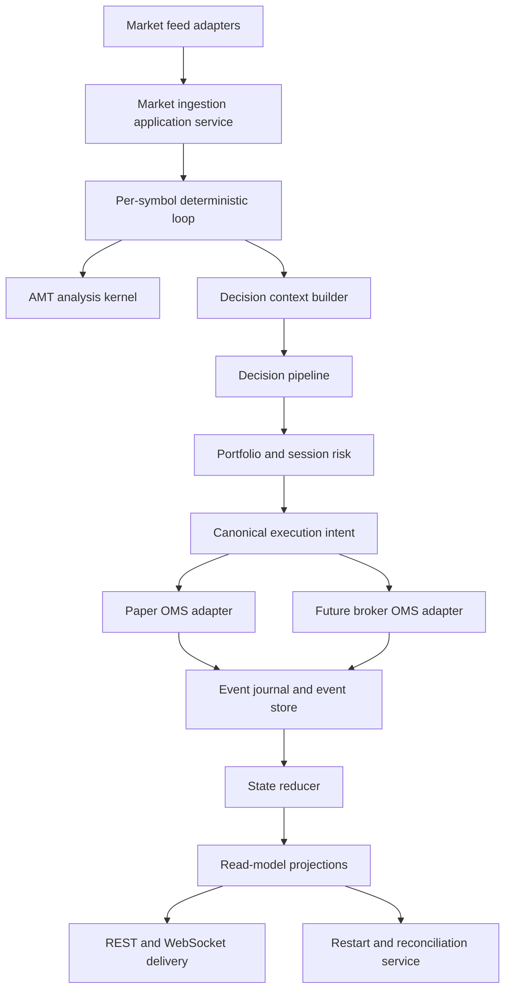

# GlassyTrade AI Design-Level Refactoring Specification

**Status:** Design only. No implementation in this phase.
**Branch:** `architecture/design-level-refactoring`
**Target:** Paper-safe, broker-ready, deterministic MCX/NSE futures and options platform.

## 1. Design intent

The system already contains strong execution safeguards, event replay foundations, AMT analysis, TimesFM observation identity, paper failure simulation, and explicit live NO-GO controls. The next objective is not a broad rewrite. It is a staged reduction of coupling and responsibility concentration while preserving observable behavior and paper safety.

The target architecture is a strict hexagonal system:

- Domain owns contracts, decisions, risk, state transitions, and deterministic calculations.
- Application owns use cases, orchestration policies, reconciliation workflows, and readiness.
- Infrastructure owns broker protocols, persistence, feeds, and transport.
- Presentation owns REST/WebSocket DTOs and frontend rendering.

No phase may introduce broker execution readiness merely by moving code.

## 2. Non-negotiable invariants

1. Live readiness remains **NO-GO** until broker partial-fill, cancel/replace, retry, reconciliation, and restart contracts are validated against a controlled broker environment.
2. Paper mode must remain fully operational throughout every migration.
3. `LiveOMS` and broker adapter execution behavior are not implemented in this design phase.
4. `symbol_mapper.py` pre-existing user changes remain untouched.
5. Domain code cannot import broker, backend, web, database, or framework modules.
6. Every execution-affecting transition has a durable identity, append-only event, and replay behavior.
7. Event persistence failure after side effects produces degraded readiness and reconciliation-required state.
8. Inferred order flow is never labeled exact L2.
9. A retry may repeat transport work, but must not repeat economic intent.
10. All public behavior changes require RED tests before implementation and acceptance-aligned tests before completion.

## 3. Target topology

The deterministic per-symbol loop is the only component allowed to sequence market observations into decisions. The coordinator schedules loops and owns portfolio-wide policies, but does not compute indicators or submit orders directly.

## 4. Refactoring workstreams

### Workstream A: Canonical execution vocabulary

Define one broker-neutral vocabulary for `ContractRef`, `OrderIntent`, `ExecutionAttempt`, `Fill`, `Position`, `ExposureState`, and `EconomicOperationId`.

`OrderIntent` describes desired economic action. `ExecutionAttempt` describes one transport attempt. `Fill` describes observed quantity and price. This separation prevents a retry from becoming a second economic order.

Boundary adapters translate legacy `Signal`, broker models, and presentation DTOs. Compatibility models remain until all callers migrate and contract tests prove parity.

Acceptance criteria:

- No duplicate semantic order identifiers across entry and close paths.
- Partial, rejected, timed-out, and restored fills map to explicit statuses.
- Decimal/float conversion occurs only at declared boundaries.
- Replay reconstructs the same position and exposure state.

### Workstream B: Execution state machine

Extract a broker-neutral execution state machine with explicit transitions:

`INTENT_CREATED -> SUBMITTING -> PARTIALLY_FILLED -> FILLED`,
`SUBMITTING -> REJECTED`,
`SUBMITTING -> UNKNOWN`,
`UNKNOWN -> RECONCILIATION_REQUIRED`,
`RECONCILIATION_REQUIRED -> RECONCILED`.

Close operations use the same machine but a distinct economic operation identity. Timeout handling is policy-driven and bounded. Fallback is allowed only when the state machine proves the original operation has not already completed.

Paper simulator becomes a deterministic implementation of the state machine. A future broker adapter must satisfy the same contract without changing domain code.

### Workstream C: QuantEngine decomposition

Split the current orchestration responsibilities into:

1. `MarketIngestionCoordinator`: tick ordering, bar aggregation, data-quality checks.
2. `AnalysisCoordinator`: AMT and structural snapshots.
3. `DecisionCoordinator`: context construction and four-gate evaluation.
4. `ExecutionCoordinator`: risk reservation, execution intent, fill handling.
5. `PositionLifecycleCoordinator`: protective stops, exits, close identity.
6. `StateProjectionCoordinator`: event emission, reducer updates, view snapshots.

The first migration should be a strangler facade. Existing `QuantEngine` remains the public composition boundary while each responsibility is delegated behind a port. No simultaneous rewrite of the runtime loop is permitted.

### Workstream D: Coordinator and portfolio control

Reduce `QuantCoordinator` to lifecycle scheduling, symbol ownership, portfolio-risk allocation, and readiness aggregation. Move scanning, seed scheduling, feed fan-out, and EOD policy into separately testable application services.

The coordinator must expose immutable public snapshots. Transport code cannot access coordinator or engine private fields.

### Workstream E: Event store and projections

Separate concerns currently concentrated around event storage:

- `EventAppender`: validation, sequence assignment, hash-chain persistence.
- `EventReader`: bounded reads and replay input.
- `StateReducer`: pure event folding.
- `ProjectionRunner`: materialized read models.
- `JournalWriter`: human/audit JSONL output.
- `PersistenceHealth`: degraded state, last successful append, failure reason.

Append failure semantics must be explicit: side effects are not erased, readiness becomes degraded, and reconciliation is required. Tests must cover failure before append, after side effect, restart, and recovery.

### Workstream F: AMT and provenance boundaries

AMT analysis returns immutable results with provenance on all flow-sensitive fields:

- exact tick footprint / exact L2
- inferred candle-derived flow
- unavailable / unknown

Decision gates may require exact provenance for strategies that depend on order flow. No fallback may silently upgrade inferred data. AMT computation remains pure with session and instrument policy injected.

### Workstream G: API, WebSocket, and frontend delivery

REST and WebSocket handlers consume projection DTOs only. Create a stable versioned snapshot contract with:

- schema version
- symbol and contract identity
- sequence or projection version
- timestamp and data freshness
- risk/readiness status
- AMT provenance
- positions and execution lifecycle

The frontend should later split `ChartScene` into renderers and interaction state, but only after snapshot contracts are stable. Canvas rendering changes must be isolated from trading correctness changes.

## 5. Lifecycle and recovery design

### Startup

1. Load configuration and construct ports.
2. Load persisted event cursor and verify hash-chain continuity.
3. Restore paper fills and unresolved execution operations.
4. Rebuild exposure state before enabling entries.
5. Run market-calendar and contract validation.
6. Start feeds and deterministic loops.
7. Publish readiness only after persistence, feed, and reconciliation checks pass.

### Runtime

Every execution-affecting action follows:

`Decision -> Risk reservation -> Economic intent -> Attempt(s) -> Fill observation -> Event append -> State fold -> Projection`.

If event append fails after an external or simulated side effect, readiness becomes degraded and new entries are blocked until reconciliation.

### Shutdown and restart

Shutdown persists cursors and simulator records, stops new entries, completes bounded close policy, and records unresolved operations. Restart replays events and unresolved operations before opening the entry gate.

## 6. Testing and verification strategy

### Contract tests

- Paper OMS must satisfy the broker-neutral OMS port.
- Every adapter must preserve economic operation identity.
- Fill quantities, costs, statuses, and timestamps must round-trip.
- Projection DTOs must satisfy the WebSocket schema.

### State-machine tests

Cover every valid transition and reject invalid transitions. Include duplicate attempts, partial fills, rejection, timeout, fallback, restart, reconciliation success, reconciliation failure, and persistence degradation.

### Determinism tests

- Same tick tape produces identical bars, AMT results, decisions, intents, events, and projections.
- Replay after restart produces identical state hash.
- TimesFM observations retain identity and temporal metadata.
- Inferred and exact flow produce distinct provenance and gate outcomes.

### Market acceptance vectors

Maintain fixture vectors for NSE and MCX futures/options covering lot size, tick size, expiry, symbol roots, session boundaries, square-off windows, spread limits, and invalid contract metadata.

### Architecture fitness

Ratchet tests should enforce:

- quant does not import brokers/backend/transport
- transport does not access engine internals
- one sizing and lot-snapping authority
- no direct EventStore mutation from adapters
- no environment branching in domain decision logic
- no inferred-flow upgrade to exact-flow provenance

### Release gates

1. Focused changed tests.
2. Paper execution suite.
3. Architecture fitness suite.
4. Replay and determinism suite.
5. WebSocket contract suite.
6. Full test suite.
7. Readiness report explicitly marking live as NO-GO.

## 7. Migration sequencing

### Stage 0: Baseline and freeze

Capture test counts, graph metrics, public contracts, and current readiness. Create characterization tests before moving code.

### Stage 1: Contracts and state machine

Introduce vocabulary and execution state-machine ports behind compatibility facades. Migrate PaperOMS first. Do not touch broker execution.

### Stage 2: Event and recovery boundaries

Separate append/read/reduce/project responsibilities. Wire paper startup reconciliation and persistence health to readiness.

### Stage 3: Runtime strangler

Delegate one QuantEngine responsibility at a time. Keep old and new paths comparable under replay tests. Remove only after parity evidence.

### Stage 4: Coordinator and API boundaries

Extract coordinator services, publish immutable snapshots, and remove transport access to internals.

### Stage 5: Frontend decomposition

Split visual renderers only after the snapshot contract is versioned and contract-tested.

### Stage 6: Broker readiness review

Run controlled broker contract validation separately. Live remains NO-GO until partial fill, unknown state, restart, reconciliation, cancel/replace, and exactly-once economic close are demonstrated.

## 8. Risks and mitigations

- **State drift during migration:** dual-run comparison and replay hashes.
- **Duplicate economic operations:** stable operation IDs and state-machine guards.
- **Hidden coupling:** architecture fitness tests and import graph ratchets.
- **Performance regression:** per-symbol latency budgets and allocation profiling.
- **Paper/live divergence:** shared contracts with separate adapters and failure-injection suites.
- **Over-refactoring:** one workstream per change set, no unrelated cleanup.

## 9. Definition of done for future implementation

A refactoring stage is complete only when its design contract, RED tests, implementation, focused tests, architecture tests, replay tests, migration notes, and rollback plan are committed. The stage must identify whether it changes paper readiness, live readiness, or neither.

This document intentionally stops at architecture and design. It does not authorize implementation or live broker activation.
