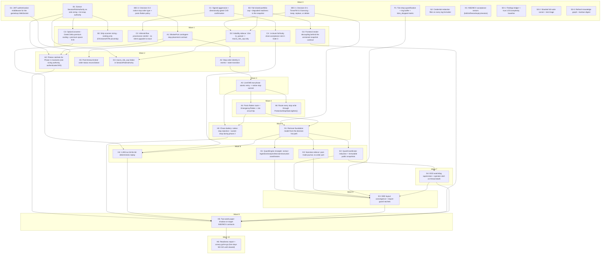

# GlassyTrade AI — v6.0 Parallel Execution Plan (Dependency Graph)

**Date:** 2026-09-11
**Graph (machine-readable):** `docs/architecture/2026-09-11-v6-execution-graph.json`
**Resolver:** `scripts/plan_waves.py` — `make plan` / `make plan-json`
**Source workplan:** `docs/architecture/2026-09-11-v6-findings-reconciliation-and-workplan.md`

This plan answers one question: **given 36 tasks, which can run at the same time, which must
wait, and who owns each?** It is generated from the graph, not hand-maintained — re-run
`make plan` after any edit to the JSON.

---

## 1. How parallelism is decided

Three independent constraints, in order of precedence:

| # | Constraint | Rule | Consequence |
|---|---|---|---|
| 1 | **Hard dependency** (`blocked_by`) | A node may not start until every edge in its `blocked_by` has merged | Forces sequence |
| 2 | **File collision** | Two nodes in the same wave may not share a file path (or a directory entry) | Forces serialization even when there is no logical dependency |
| 3 | **Agent cap** (`--cap`, default 4) | A wave is packed into batches of at most N agents, ordered by risk | Turns an unbounded fan-out into a staffable team |

Constraint 2 is the one that bites in practice, and it is why the graph is expressed with explicit
`files` footprints. The first run of the resolver **caught a real defect**: `G4` (EOD watchdog
supervision) and `E3` (DDD layout convergence) both touch `quant/multi_engine.py` and landed in the
same wave. Fixed by adding `G4 → E3`, which is the correct order anyway — the supervision change
must land before the layout move rewrites the file.

**Risk ordering** (lower runs first when packing a batch): `money-path` → `security` →
`correctness` → `perf` → `structural` → `verification` → `legal` → `docs`. Money safety and
security do not wait behind documentation.

---

## 2. Graph summary

```
nodes: 36   waves: 11   critical path: 28.5 agent-days
file collisions: none
```

**Node types:** `impl` (24) · `verify` (7) · `decision` (2) · `gate` (2) · `move` (1)
**Edge count:** 41 hard dependencies.
**Readiness split:** 16 nodes move paper readiness · 9 move live readiness · 11 move neither.
All counts are measured from the graph, not estimated.

---

## 3. The resolved schedule

Generated by `make plan`. Every node in a batch can run concurrently; batches within a wave may
run concurrently too if agent capacity allows.

### Wave 0 — 12 nodes, 15.5 agent-days, 3 batches

| Batch | Nodes | Why these together |
|---|---|---|
| 0.1 | `B1` SessionRiskAuthority · `B3` fail-closed portfolio cap · `DEC-2` native-stop policy · `G1` WS JWT auth | Highest-risk open work with no prerequisites |
| 0.2 | `G2` log redaction · `C1` signed aggression · `F1` tick-drop measurement · `H1` NSE/MCX acceptance vectors | Second tier by risk rank |
| 0.3 | `DEC-1` TimesFM licensing · `S0-1` findings ledger · `S0-2` sharded runner · `S0-3` graph refresh | Documentation/decision work, never blocks the critical path |

**Blocking note:** `DEC-2` is inside batch 0.1 because it gates `A1` (wave 1). `DEC-1` sits in
0.3 but gates `D3` (wave 1) and `D1` (wave 5) — it is the only decision with slack.

### Wave 1 — 7 nodes, 12 agent-days, 2 batches

| Batch | Node | Depends on | Files (exclusive within the batch) |
|---|---|---|---|
| 1.1 | `C3` OptionConverter · `B2` strip scanner sizing · `A1` IBrokerPort stop contract · `D3` volatility sidecar | `B1`, `B1`, `DEC-2`, `DEC-1+B3` | `quant/contracts/options_converter.py` · `quant/decision/timesfm_agents.py` · `quant/execution/ports.py` · `quant/sidecars/volatility/` |
| 1.2 | `C2` provenance ratchet · `C4` 1-min body acceptance · `G3` frontend render decoupling | `C1`, `C1`, `B3` | `quant/execution/flow_provenance.py` · `quant/decision/gates_edge.py` · `frontend/` |

### Wave 2 — 4 nodes, 5.5 agent-days, 1 batch
`A2` stop identity in events · `A5` post-timeout reconciliation · `D4` macro_risk_cap intake ·
`H2` **Phase-1 fitness ratchets** ← this is the phase gate. Nothing in Phase 1 is "done" until
`H2` is green.

### Wave 3 — 1 node, 2 agent-days
`A3` LiveOMS two-phase atomic entry → native stop. **Single-node wave by design**: the money-path
implementation is serialized behind `A2`, and nothing else may touch `live_oms.py` concurrently.

### Wave 4 — 2 nodes, 2.5 agent-days
`A4` panic-flatten + `EmergencyFlatten` · `A6` route every stop write through
`ProtectiveStopState.tighten()`. Both fan out from `A3`; disjoint files.

### Wave 5 — 2 nodes, 5 agent-days
`D1` remove the foundation model from the decision path · `H3` chaos battery for native-stop
rejection and socket drops. `H3` starts as soon as `A3`/`A4` land, in parallel with `D1`.

### Wave 6 — 4 nodes, 14 agent-days (widest implementation wave)
`D2` narrative sidecar · `E1` QuantEngine strangler (5 g) · `E2` coordinator reduction (4 g) ·
`H4` 1,000-run determinism replay (3 g).

### Waves 7–10 — the tail
| Wave | Node | Note |
|---|---|---|
| 7 | `G4` EOD watchdog supervision | Must precede `E3` (file collision, now an edge) |
| 8 | `E3` DDD layout convergence | Last structural change; blocked by `E1`, `E2`, `D2`, `F1`, `G4` |
| 9 | `H5` two-week paper shadow | 10 agent-days; waits on every phase-1..3 gate |
| 10 | `H6` readiness report + canary go/no-go | Terminal gate; live stays **NO-GO** unless cleared |

---

## 4. Critical path

```
DEC-2 -> A1 -> A2 -> A3 -> A4 -> D1 -> E2 -> G4 -> E3 -> H5 -> H6
  0.5g    1g   1.5g   2g   1.5g  2.5g   4g   1.5g   3g   10g   1g   = 28.5 agent-days
```

Read this as the **delivery floor**: no amount of extra agents shortens it, because each link is a
real dependency (or a resolved file collision). The path tells you where headcount is wasted:

- **`H5` (10 g, paper shadow) is 35% of the critical path and is pure calendar time.** Everything
  else must be done before it starts, so compressing Phases 1–3 only matters if it happens before
  `H5` begins — and it cannot shorten `H5` itself. **Start `H5` as early as its gates allow.**
- **`E2` (4 g) beats `E1` (5 g) onto the path** because `G4 → E3` adds 1.5 g to the coordinator
  branch. Compressing `E1` (the more expensive task) buys nothing.
- **`A1 → A2 → A3 → A4` is 6 g of serialized money-path work** and the least parallelizable part of
  the plan. Adding agents here is harmful; adding review rigour is not.

### Parallelism available vs. critical path

| Metric | Value |
|---|---|
| Sum of all node effort | **72 agent-days** |
| Critical path | **28.5 agent-days** |
| Maximum practical speedup | **2.5×** (72 / 28.5) |
| Ideal agents at cap=4 | 4 (minimum team to finish in critical-path time) |
| Widest wave | 12 nodes (wave 0) / 14 agent-days (wave 6) |

So: a **team of 4** finishes in roughly critical-path time; a team of 12 finishes no faster than
28.5 agent-days but clears wave 0 in a single wall-clock slot.

---

## 5. Worktree / branch protocol

The repo already provisions parallel agents this way (`.worktrees/agent/*` exists). One node, one
worktree, one branch — never two nodes in one worktree.

```bash
make plan                                   # authoritative schedule
.venv/bin/python scripts/plan_waves.py --worktrees 1   # emits the commands for wave 1
```

Example (wave 1, generated):

```bash
git worktree add .worktrees/a1 -b agent/a1 # A: IBrokerPort contingent-stop placement contract
git worktree add .worktrees/b2 -b agent/b2 # B: Strip scanner sizing — ranking only
git worktree add .worktrees/c2 -b agent/c2 # C: Inferred-flow provenance ratchet
git worktree add .worktrees/c3 -b agent/c3 # C: OptionConverter — Greek Delta premium scaling
git worktree add .worktrees/c4 -b agent/c4 # C: 1-minute full-body close acceptance rule
git worktree add .worktrees/d3 -b agent/d3 # D: Volatility sidecar
git worktree add .worktrees/g3 -b agent/g3 # G: Frontend render decoupling
```

**Merge order within a wave:** land in the order the resolver lists (risk rank), re-running the
merge gate after each. **Cleanup:** `git worktree remove .worktrees/<id> && git branch -d agent/<id>`.

### Merge gate (every node, from the graph `conventions.merge_gate`)

1. Node's own focused tests
2. `tests/architecture/`
3. `tests/quant/execution/`
4. `tests/quant/chaos/`

Baseline for "green": **365 passed, 1 skipped** (architecture + execution + chaos, measured
2026-09-11). A node that lowers this number does not merge.

---

## 6. Mermaid view

Generated from the graph with `make plan-mermaid` — **all 41 edges verified identical to the
JSON**. Do not hand-edit this block; regenerate it.



---

## 7. Working rules for parallel agents

1. **Never start a node whose `blocked_by` has not merged** — not even a "preparatory refactor".
   The graph encodes exactly the mistakes that make parallel work expensive.
2. **Never edit a file outside your node's footprint.** If you need to, the graph is wrong: add the
   file and re-run the resolver, which will surface the collision.
3. **RED test first.** The test must fail on the unpatched tree; record that failure in the node's
   PR body.
4. **Declare readiness impact.** Every node carries `readiness: paper | live | neither`. Live stays
   **NO-GO** for the entire graph; that is design-spec invariant 1, re-affirmed here.
5. **A phase gate is a node, not a feeling.** Wave 2's `H2` is the Phase-1 gate; wave 10's `H6` is
   the release gate.
6. **Re-run `make plan` after every graph edit** and commit the regenerated schedule alongside the
   change — a stale graph is worse than no graph.

---

## 8. Known limits of this plan

- **Effort units are estimates**, not measurements: `g` = agent-days at a 4-agent cap. The relative
  ordering is more trustworthy than the absolute total.
- **`H5` is calendar-bound**, not effort-bound; its 10 g is a two-week window, not 10 agent-days of
  work.
- **12 nodes in wave 0 assumes 12 worktrees.** Realistically, run batch 0.1 first; batches 0.2 and
  0.3 can trail without affecting the critical path.
- **`G3` (frontend) and `E3` (layout move) touch areas this plan did not audit in depth.** Treat
  their effort estimates as low-confidence; `G3`'s premise (P2-19) is still unverified.
- The graph models **file-level** exclusivity, not semantic coupling. Two nodes touching different
  files can still conflict logically; that is what review gates are for.
- The Mermaid diagram and every count in this document are **generated artefacts**
  (`make plan`, `make plan-mermaid`). A hand-edited diagram is exactly how this plan would start
  lying; the earlier draft invented one edge and dropped another before the generator replaced it.
