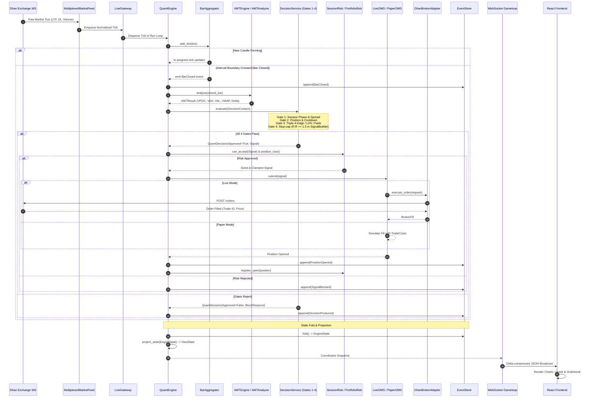

# GlassyTrade AI — Comprehensive System Architecture & Execution Flows

> **Document Version:** 5.2 (Institutional Production Standard)  
> **Repository Root:** `/Users/apple/Documents/v5-of-glassytrade-ai`  
> **Knowledge Graph Audit:** Built via `graphify` (15,223 nodes, 34,414 edges, 557 communities)  
> **Target Markets:** MCX (Multi Commodity Exchange of India) & NSE (National Stock Exchange of India) Options & Futures  
> **Core Methodology:** Institutional Auction Market Theory (AMT) by Fabio Valentini, augmented with Google TimesFM 3.0 foundation forecasting and MLX local LLM market-narrative reasoning.

---

## Table of Contents

1. [Executive Summary & High-Level System Topology](#1-executive-summary--high-level-system-topology)
2. [Graphify Topology & Core God Nodes](#2-graphify-topology--core-god-nodes)
3. [Strict Clean Architecture & Fitness Guardians](#3-strict-clean-architecture--fitness-guardians)
4. [Data Ingestion & Feed Multiplexing Pipeline](#4-data-ingestion--feed-multiplexing-pipeline)
5. [Auction Market Theory (AMT) Calculation Kernel](#5-auction-market-theory-amt-calculation-kernel)
6. [Decision Service & The 4-Gate Strategy Pipeline](#6-decision-service--the-4-gate-strategy-pipeline)
7. [AI & Quantitative Forecasting Layer (Dual-Track)](#7-ai--quantitative-forecasting-layer-dual-track)
8. [Hierarchical Risk Management & Protective Stops](#8-hierarchical-risk-management--protective-stops)
9. [Order Management System (OMS) & Execution Layer](#9-order-management-system-oms--execution-layer)
10. [Event Sourcing, State Derivation & Journaling](#10-event-sourcing-state-derivation--journaling)
11. [Startup Lifecycle, State Reconciliation & Recovery](#11-startup-lifecycle-state-reconciliation--recovery)
12. [Real-Time WebSocket Gameloop & Frontend Delivery](#12-real-time-websocket-gameloop--frontend-delivery)
13. [End-to-End Visual Sequence & Flow Diagrams](#13-end-to-end-visual-sequence--flow-diagrams)

---

## 1. Executive Summary & High-Level System Topology

GlassyTrade AI is a high-frequency, low-latency algorithmic trading platform built specifically for intraday Indian commodity and equity derivative contracts (such as `CRUDEOIL`, `NATURALGAS`, `SILVERM`, `NIFTY`, and `BANKNIFTY`).

The platform solves three historic problems in retail/semi-institutional automated trading:
1. **Deterministic Execution:** The trading hot-path is 100% deterministic, single-threaded per instrument, and zero-allocation where possible. It runs without dependency on network AI models or external blocking I/O.
2. **Auction Market Theory (AMT) Structural Edge:** Rather than relying on lagging indicators (RSI, MACD), entries and exits are governed by institutional volume distribution (Volume Profile, VPOC, 70% Value Area, Session VWAP with +/-1/2 Standard Deviations, Initial Balance ranges, and Order Flow Delta/Absorption).
3. **Event-Sourced Truth:** The system state is never mutated in place. All transitions are append-only events (`BarClosed`, `SignalApproved`, `OrderFilled`, `PositionOpened`, `PositionClosed`), mathematically verified via a SHA-256 hash chain and replayable from inception.

```
┌────────────────────────────────────────────────────────────────────────────────────────┐
│                                    DHANHQ EXCHANGE API                                 │
└───────────────────────────┬────────────────────────────────────────────┬───────────────┘
                            │ WebSocket Feed (LTP/Depth/OI)              │ REST Orders
                            ▼                                            ▼
┌────────────────────────────────────────────────────────┐ ┌─────────────────────────────┐
│                 INFRASTRUCTURE ADAPTERS                │ │   INFRASTRUCTURE BROKER     │
│  MultiplexedMarketFeed (quant/brokers/multiplexed_feed)│ │   DhanBrokerAdapter         │
│  DhanWebSocketClient   (brokers/broker/dhan)           │ │   DhanHttpClient            │
└───────────────────────────┬────────────────────────────┘ └─────────────▲───────────────┘
                            │ Normalized Ticks                           │ Orders / Fills
                            ▼                                            │
┌────────────────────────────────────────────────────────────────────────┼───────────────┐
│ QUANT CORE ORCHESTRATOR: QuantCoordinator (quant/multi_engine.py)       │               │
│  ├─ Shared PortfolioRiskAuthority (Capital allocation & Risk ceiling)  │               │
│  ├─ Shared HistorySeedScheduler   (Rate-limited REST seeding)          │               │
│  └─ Engine Pool (ThreadPoolExecutor bounded to N scanned contracts)    │               │
│                                                                        │               │
│  ┌──────────────────────────────────────────────────────────────────┐  │               │
│  │ PER-SYMBOL DETERMINISTIC EVENT LOOP: QuantEngine (runtime.py)    │  │               │
│  │                                                                  │  │               │
│  │  1. Ingestion:     BarAggregator (1m / 5m candle formation)      │  │               │
│  │  2. Analysis:      AMTEngine -> AMTAnalyzer (VPOC, VAH/VAL, VWAP)│  │               │
│  │  3. Forecasting:   TimesFM 3.0 Agents (Scanning & Position Agent)│  │               │
│  │  4. Context:       DecisionContextBuilder -> DecisionContext     │  │               │
│  │  5. Decision:      DecisionService -> GatePipeline (Gates 1-4)   │  │               │
│  │  6. Sizing/Risk:   SessionRisk (Cushion tiers, Lot snapping)     │  │               │
│  │  7. Execution OMS: LiveOMS / PaperOMS ───────────────────────────┴──┘               │
│  │  8. Position Mgmt: PositionManager & ExitEngine (6 Exit Types)                      │
│  │  9. Event Bus:     EventStore (Append-only SHA-256 log) -> EngineState              │
│  └─────────────────────────────────────────────────────────────────────────────────────┘
                            │ Folded State Projection (ViewState)
                            ▼
┌────────────────────────────────────────────────────────────────────────────────────────┐
│                              DELIVERY & PRESENTATION LAYER                             │
│  FastAPI Lifespan & Routers (backend/app/main.py, api/routers/)                        │
│  WebSocket Gameloop Handler (backend/app/api/websocket/gameloop.py)                    │
│  React Glassmorphic Dashboard (frontend/App.tsx, ChartScene.tsx, AIAnalysisPanel.tsx)  │
└────────────────────────────────────────────────────────────────────────────────────────┘
```

---

## 2. Graphify Topology & Core God Nodes

According to the knowledge graph constructed via `graphify` (inspecting commit `b127779f` with 910 files and 753,062 words), the codebase is organized into **15,223 nodes** and **34,414 edges** across **557 communities**.

### Graph Breakdown by Layer
- `tests/`: 4,794 nodes (31.5%) — Comprehensive deterministic replay, golden battery, and architectural fitness suites.
- `backend/`: 2,965 nodes (19.5%) — FastAPI routers, dependency injection, application lifespan, SQLite persistence, and adapter bridges.
- `quant/`: 2,396 nodes (15.7%) — Pure domain trading engine, AMT analytics, decision gates, TimesFM models, and event sourcing.
- `brokers/`: 2,376 nodes (15.6%) — DhanHQ protocol implementation, rate limiters, token manager, symbol mapper, and market data converters.
- `docs/`: 1,561 nodes (10.3%) — Architecture decision records, runbooks, and audit trails.
- `frontend/`: 481 nodes (3.2%) — React, HTML5 Canvas charts, WebSocket receiver, and UI state stores.
- `shared/`: 94 nodes (0.6%) — Canonical money/decimal converters and unified data models.

### The Top 10 God Nodes (Core Architectural Abstractions)
These nodes exhibit the highest degree and betweenness centrality, acting as the structural spine of the system:

| Rank | Node Label | Edges | Primary Source File | Architectural Responsibility |
|:---:|:---|:---:|:---|:---|
| 1 | `EventStore` | **359** | [`quant/event_store.py:L247`](file:///Users/apple/Documents/v5-of-glassytrade-ai/quant/event_store.py#L247) | Append-only event log. Single source of truth for engine state; every state mutation is derived via `fold()`. |
| 2 | `Bar` | **344** | [`quant/bars.py:L11`](file:///Users/apple/Documents/v5-of-glassytrade-ai/quant/bars.py#L11) | Immutable price/volume candle carrier feeding Volume Profile, VWAP, and decision gates. |
| 3 | `QuantEngine` | **324** | [`quant/runtime.py:L252`](file:///Users/apple/Documents/v5-of-glassytrade-ai/quant/runtime.py#L252) | Single-threaded per-symbol orchestrator consuming ticks, computing AMT, and managing order state machines. |
| 4 | `PositionOpened`| **299** | [`quant/events.py:L138`](file:///Users/apple/Documents/v5-of-glassytrade-ai/quant/events.py#L138) | Primary lifecycle event recording entry price, quantity, initial stop, target tiers, and execution source. |
| 5 | `Signal` | **281** | [`quant/decision/signal_builder.py:L49`](file:///Users/apple/Documents/v5-of-glassytrade-ai/quant/decision/signal_builder.py#L49) | Immutable trade intent generated by `SignalBuilder` when all 4 strategy gates pass. |
| 6 | `BarClosed` | **277** | [`quant/events.py:L28`](file:///Users/apple/Documents/v5-of-glassytrade-ai/quant/events.py#L28) | Event emitted when `BarAggregator` closes an interval, triggering the synchronous decision cycle. |
| 7 | `DecisionContext`| **272**| [`quant/decision/context.py:L11`](file:///Users/apple/Documents/v5-of-glassytrade-ai/quant/decision/context.py#L11) | Immutable 60+ field snapshot passed into `DecisionService` and AI evaluation models. |
| 8 | `EngineState` | **236** | [`quant/state_machine.py:L47`](file:///Users/apple/Documents/v5-of-glassytrade-ai/quant/state_machine.py#L47) | Immutable state record (`position`, `risk`, `pending_order`, `bar_count`, `active_trades`). |
| 9 | `Position` | **233** | [`quant/execution/order.py:L14`](file:///Users/apple/Documents/v5-of-glassytrade-ai/quant/execution/order.py#L14) | Active trade aggregate holding contract identity, average entry, trailing stop, and realized/unrealized PnL. |
| 10 | `OHLC` | **220** | [`quant/contracts/value_objects.py:L19`](file:///Users/apple/Documents/v5-of-glassytrade-ai/quant/contracts/value_objects.py#L19) | Canonical value object representing price bounds and volume with high-precision Decimal/float parity. |

---

## 3. Strict Clean Architecture & Fitness Guardians

The system enforces automated architectural fitness tests located in [`tests/architecture/`](file:///Users/apple/Documents/v5-of-glassytrade-ai/tests/architecture/) that execute in CI to prevent architectural drift:

### Enforced Architectural Rules:
1. **Domain Isolation (`test_quant_does_not_import_brokers_or_backend`)**:
   [`quant/`](file:///Users/apple/Documents/v5-of-glassytrade-ai/quant/) is strictly prohibited from importing anything from `brokers`, `backend`, `fastapi`, `uvicorn`, or `sqlalchemy`. The domain core depends solely on standard Python libraries and its own internal contracts.
2. **Zero Environment Branching in Domain (`test_no_environment_branching_in_quant`)**:
   Code within `quant/` is forbidden from containing `if env == "live":` or `if mode == "paper":`. Environment differences are handled strictly through dependency injection of ports (`IBroker`, `IMarketData`, `IStorage`).
3. **No Transport Layer Bypass (`test_no_engine_privates_in_transport`)**:
   Web routers and WebSocket handlers are prohibited from accessing private engine fields (`coordinator._...` or `engine._...`). Transport consumers read solely from projected view states or public contract snapshots.
4. **Single Source of Truth (SSoT) Ratchets**:
   - **Single Entry Seam**: `TradingStrategy.should_enter()` is the only entry point into the decision pipeline. Direct ad-hoc calls to `DecisionService.evaluate()` in runtime loops are rejected by static AST checks.
   - **Single Sizing Authority**: `SessionRisk.position_size()` + `clamp_quantity()` in [`quant/execution/risk.py:L242`](file:///Users/apple/Documents/v5-of-glassytrade-ai/quant/execution/risk.py#L242).
   - **Single Lot Snapping Authority**: `snap_to_lot()` in [`quant/execution/lots.py:L8`](file:///Users/apple/Documents/v5-of-glassytrade-ai/quant/execution/lots.py#L8).
   - **Canonical Value Area Percentage**: Fixed at `0.70` (70%) per Fabio Valentini methodology (`VALUE_AREA_PCT = 0.70` in [`quant/contracts/constants.py:L65`](file:///Users/apple/Documents/v5-of-glassytrade-ai/quant/contracts/constants.py#L65)).
   - **Canonical Minimum Risk:Reward Ratio**: Fixed at `MIN_RR_RATIO >= 1.5` in [`quant/contracts/constants.py:L74`](file:///Users/apple/Documents/v5-of-glassytrade-ai/quant/contracts/constants.py#L74).
   - **Canonical Gate Count**: Exactly 4 gates in `GatePipeline` (`GATE_NAMES` in [`quant/decision/result.py`](file:///Users/apple/Documents/v5-of-glassytrade-ai/quant/decision/result.py)).

---

## 4. Data Ingestion & Feed Multiplexing Pipeline

The market data ingestion pipeline handles high-throughput tick processing across dozens of simultaneous options strikes over a single DhanHQ WebSocket connection.

```
                  ┌───────────────────────────────┐
                  │    DhanHQ WebSocket Server    │
                  └──────────────┬────────────────┘
                                 │ Binary Packets (LTP, Depth, Volume, OI)
                                 ▼
                  ┌───────────────────────────────┐
                  │      DhanWebSocketClient      │
                  │  (brokers/broker/dhan/infra)  │
                  └──────────────┬────────────────┘
                                 │ Raw JSON / Decoded Messages
                                 ▼
                  ┌───────────────────────────────┐
                  │    MultiplexedMarketFeed      │
                  │ (quant/brokers/multiplexed)   │
                  └──────┬─────────────────┬──────┘
       Symbol Filter "CRUDEOIL24SEPFUT"    │ Symbol Filter "CRUDEOIL24SEP6200CE"
                         ▼                 ▼
          ┌────────────────────────┐  ┌────────────────────────┐
          │   LiveGateway (Fut)    │  │   LiveGateway (Opt)    │
          │  queue.Queue(max=1000) │  │  queue.Queue(max=1000) │
          └──────────────┬─────────┘  └────────────┬───────────┘
                         │ try_next_tick()         │ try_next_tick()
                         ▼                         ▼
          ┌────────────────────────┐  ┌────────────────────────┐
          │ QuantEngine (Futures)  │  │  QuantEngine (Option)  │
          │  BarAggregator (1m)    │  │   BarAggregator (1m)   │
          └────────────────────────┘  └────────────────────────┘
```

### Component Details
1. **`MultiplexedMarketFeed`** ([`quant/brokers/multiplexed_feed.py:L55`](file:///Users/apple/Documents/v5-of-glassytrade-ai/quant/brokers/multiplexed_feed.py#L55)):
   - Dhan allows up to 1000 instrument subscriptions per WebSocket connection.
   - Normalizes incoming Dhan frames into domain `Tick` structures (`ltp`, `volume`, `oi`, `timestamp`, `bid`, `ask`).
   - Maintains an internal routing table: `add_reader(symbol, queue)`. Dispatches ticks to symbol queues with non-blocking drops if queues overflow, protecting the network thread from downstream lag.
2. **`LiveGateway`** ([`quant/brokers/live_gateway.py:L20`](file:///Users/apple/Documents/v5-of-glassytrade-ai/quant/brokers/live_gateway.py#L20)):
   - Wraps a thread-safe bounded FIFO `queue.Queue`.
   - Provides `next_tick(timeout)` and `try_next_tick()` methods for the engine's consumption loop.
3. **`BarAggregator`** ([`quant/aggregator.py:L19`](file:///Users/apple/Documents/v5-of-glassytrade-ai/quant/aggregator.py#L19)):
   - Aggregates individual trade ticks into time-sliced OHLCV bars (default `DEFAULT_INTERVAL_SEC = 60` for 1-minute bars).
   - Computes tick-by-tick Volume Weighted Average Price (VWAP) inside the candle.
   - Emits `BarClosed` when the current wall-clock epoch traverses an interval boundary.

---

## 5. Auction Market Theory (AMT) Calculation Kernel

The analytical core models the auction process based on Fabio Valentini's institutional framework. When `BarClosed` fires, the candle is processed by [`AMTEngine`](file:///Users/apple/Documents/v5-of-glassytrade-ai/quant/amt_engine.py#L122) and [`AMTAnalyzer`](file:///Users/apple/Documents/v5-of-glassytrade-ai/quant/amt/analyzer.py#L263), yielding an [`AMTResult`](file:///Users/apple/Documents/v5-of-glassytrade-ai/quant/amt/dto.py) with the following sub-engines:

```
                                  Closed Bar
                                      │
                                      ▼
             ┌─────────────────────────────────────────────────┐
             │                   AMTEngine                     │
             │           (quant/amt_engine.py:L122)            │
             └────────────────────────┬────────────────────────┘
                                      │
         ┌────────────────────────────┼────────────────────────────┐
         ▼                            ▼                            ▼
┌──────────────────┐        ┌──────────────────┐        ┌──────────────────┐
│  Volume Profile  │        │   Session VWAP   │        │ Initial Balance  │
│ (volume_profile) │        │     (vwap.py)    │        │  (ib_engine.py)  │
│ - VPOC           │        │ - Session VWAP   │        │ - IB High / Low  │
│ - VAH / VAL (70%)│        │ - Upper Bands 1/2│        │ - IB VAH / VAL   │
│ - HVN / LVN Nodes│        │ - Lower Bands 1/2│        │ - D1/D2/D3 Drives│
└────────┬─────────┘        └────────┬─────────┘        └────────┬─────────┘
         │                           │                           │
         └───────────────────────────┼───────────────────────────┘
                                     │
         ┌───────────────────────────┼───────────────────────────┐
         ▼                           ▼                           ▼
┌──────────────────┐        ┌──────────────────┐        ┌──────────────────┐
│ Order Flow Delta │        │ Market Structure │        │  Naked POC Track │
│  (orderflow/)    │        │  (structure.py)  │        │    (npoc.py)     │
│ - CVD Tracker    │        │ - Balanced / Rot │        │ - Unmitigated    │
│ - Absorption Det │        │ - Trend / Imbal  │        │   Historical     │
│ - Aggression Scr │        │ - HalfTrend Band │        │   POC Levels     │
└────────┬─────────┘        └────────┬─────────┘        └────────┬─────────┘
         │                           │                           │
         └───────────────────────────┼───────────────────────────┘
                                     ▼
                           Unified AMTResult DTO
```

### Key Sub-Engine Responsibilities:
- **`IncrementalVolumeProfile`** ([`quant/amt/profile/volume_profile.py:L321`](file:///Users/apple/Documents/v5-of-glassytrade-ai/quant/amt/profile/volume_profile.py#L321)):
  Binned volume distribution across price ticks. Dynamically calculates the **Point of Control (POC)** (the price with greatest accepted volume) and expands outward to enclose exactly **70% of total session volume**, demarcating the **Value Area High (VAH)** and **Value Area Low (VAL)**. Identifies **Low Volume Nodes (LVN)** (rejection zones) and **High Volume Nodes (HVN)** (fair value consolidation zones).
- **`SessionVWAP`** ([`quant/amt/profile/vwap.py:L24`](file:///Users/apple/Documents/v5-of-glassytrade-ai/quant/amt/profile/vwap.py#L24)):
  Cumulative $\frac{\sum (\text{Typical Price} \times \text{Volume})}{\sum \text{Volume}}$ reset at the start of the exchange session (09:00 IST for MCX, 09:15 IST for NSE). Projects standard deviation bands $\pm 1\sigma$ and $\pm 2\sigma$ to measure statistical stretch.
- **`InitialBalanceEngine`** ([`quant/amt/session/ib_engine.py:L53`](file:///Users/apple/Documents/v5-of-glassytrade-ai/quant/amt/session/ib_engine.py#L53)):
  Calculates the auction parameters established during the first hour of trading (IB). Categorizes session character into standard Fabio profiles (Normal Day, Normal Variation, Trend Day, Neutral Day). Tracks opening drive momentum (D1, D2, D3 drives via `DriveTracker`).
- **`OrderFlow / CVD / Absorption`**:
  - `CVDTracker` ([`quant/amt/orderflow/cvd.py:L41`](file:///Users/apple/Documents/v5-of-glassytrade-ai/quant/amt/orderflow/cvd.py#L41)): Cumulative Volume Delta tracks net market aggressor imbalance ($\text{Volume}_{\text{Bid}} - \text{Volume}_{\text{Ask}}$). Detects divergence where price moves higher while delta prints lower (exhaustion).
  - `AbsorptionDetector` ([`quant/amt/orderflow/detectors.py:L273`](file:///Users/apple/Documents/v5-of-glassytrade-ai/quant/amt/orderflow/detectors.py#L273)): Identifies passive limit-order absorption (`BUY_ABSORBED` or `SELL_ABSORBED`), where aggressive volume fails to displace price beyond a structural level.
  - `AggressionScorer` ([`quant/amt/orderflow/aggression.py:L51`](file:///Users/apple/Documents/v5-of-glassytrade-ai/quant/amt/orderflow/aggression.py#L51)): Multi-factor scoring (range 0.0 to 4.5). Scores $\ge 2.0$ indicate confirmed order flow; scores $\ge 3.0$ unlock pyramiding permission.
- **`NPOCTracker`** ([`quant/amt/session/npoc.py`](file:///Users/apple/Documents/v5-of-glassytrade-ai/quant/amt/session/npoc.py)):
  Maintains a registry of Naked (unvisited) POC levels from previous sessions. Virgin POCs act as powerful institutional magnets.

---

## 6. Decision Service & The 4-Gate Strategy Pipeline

Every trading decision must pass through a strict, sequential gating sequence executed by [`DecisionService`](file:///Users/apple/Documents/v5-of-glassytrade-ai/quant/decision/decision_service.py#L55) and [`GatePipeline`](file:///Users/apple/Documents/v5-of-glassytrade-ai/quant/decision/pipeline.py#L20).

```
                      DecisionContext
                             │
                             ▼
             ┌───────────────────────────────┐
             │      Pre-Pipeline Gates       │
             │ - Risk Halt Active?           │─── YES ──> REJECT: "HALTED"
             │ - Data Quality Valid?         │─── NO  ──> REJECT: "DATA_QUALITY_BLOCKED"
             └──────────────┬────────────────┘
                            │ PASSED
                            ▼
             ┌───────────────────────────────┐
             │  GATE 1: Session Phase Gate   │
             │  (gate_session_phase)         │
             │  - Valid trading window?      │─── FAIL ──> REJECT: "GATE_REJECTED"
             │  - Pre-close cutoff safe?     │             (Hard Stop: No fades)
             │  - Bid-Ask spread acceptable? │
             └──────────────┬────────────────┘
                            │ PASS
                            ▼
             ┌───────────────────────────────┐
             │  GATE 2: Position & Cooldown  │
             │  (gate_position_cooldown)     │
             │  - Already positioned?        │─── FAIL ──> REJECT: "GATE_REJECTED"
             │  - Cooldown period elapsed?   │             (Hard Stop: No fades)
             └──────────────┬────────────────┘
                            │ PASS
                            ▼
             ┌───────────────────────────────┐
             │  GATE 3: Triple-A Edge Gate   │
             │  (gate_triple_a_edge)         │
             │  - Absorption detected?       │
             │  - Accumulation completed?    │
             │  - Aggression / VWAP break?   │
             └───────┬───────────────┬───────┘
                     │ PASS          │ FAIL
                     │               ▼
                     │       ┌───────────────────────────────┐
                     │       │ Tier-2 Fallback: VA Fade Gate │
                     │       │ (detect_va_fade)              │
                     │       │ - Extreme VA probe?           │── FAIL ──> REJECT: "NO_EDGE"
                     │       │ - Rejection candle formed?    │
                     │       └──────────────┬────────────────┘
                     │                      │ PASS (VA Fade Edge)
                     └───────────────┬──────┘
                                     ▼
                     ┌───────────────────────────────┐
                     │  GATE 4: Stop-Cap Gate        │
                     │  (gate_risk_reward)           │
                     │  - Stop distance >= min tick? │─── FAIL ──> VA-fade fallback
                     │  - Stop within cap?           │
                     └───────────────┬───────────────┘
                                     │ PASS
                                     ▼
                     ┌───────────────────────────────┐
                     │         SignalBuilder         │
                     │  - Size via SessionRisk       │
                     │  - Snap quantity to lot size  │
                     │  - Produce QuantDecision      │
                     └───────────────────────────────┘
```

### The 4 Canonical Gates:
1. **Gate 1: Session Phase & Spread Gate** (`quant/decision/gate_session_phase.py`):
   - Validates that the exchange clock is inside the active window: NSE 09:30–15:15 IST, MCX 09:15–23:15 IST (opening blackouts included).
   - Enforces bid-ask spread limits (`max(2× tick, 0.1% of price, ₹0.40)`) to prevent executing on illiquid option strikes.
2. **Gate 2: Position & Cooldown Gate** (`quant/decision/gate_position_cooldown.py`):
   - Enforces the rule: *One position per contract at any time*.
   - Requires a minimum bar cooldown after trade exit (default 2 bars) to prevent immediate emotional whipsaw re-entries.
   - Exception: Skipped if `allow_positioned=True` during thesis-flip emergency reversals.
3. **Gate 3: Triple-A Institutional Edge Gate** (`quant/decision/gates_edge.py`):
   - Tests for the complete Fabio Valentini institutional sequence:
     - **Absorption:** High volume absorption at structural levels (VAL, VAH, POC, or Prior Session Levels).
     - **Accumulation:** Footprint/CVD stabilization showing passive accumulation.
     - **Aggression:** Aggressive market orders breaking back across Session VWAP or local structure.
   - Also accepts the **LVN Sniper** setup (rejection and spring off a Low Volume Node).
   - Every approval carries a `GateResult.setup_key`; the **model router**
     (`quant/decision/model_router.py`, enforced in `DecisionService`) decides
     whether that setup's model (TREND vs MEAN_REVERSION) is active:
     `IMBALANCED → TREND`, `BALANCED → MEAN_REVERSION`, with certified evidence
     allowed to override a lagging VA label.
   - **MEAN_REVERSION path:** the **Value Area fade** (`quant/decision/va_fade.py`)
     requires a failed probe reclaimed back *inside* the VA and targets the VPOC.
   - The entry authority is single: `AmtScalpingStrategy` → `DecisionService` →
     `GatePipeline`. TimesFM is a forecast provider for exits/UI only and never
     approves an entry.
4. **Gate 4: Structural Stop-Cap Gate** (`quant/decision/gates_rr.py`, `gate_risk_reward`):
   - Structural Stop Loss is pinned behind the invalidation level (e.g., behind the absorption bar or outside VAL/VAH).
   - Target 1 (TP1) is anchored to the opposite Value Area boundary or VPOC.
   - Stop-cap check: stop risk (entry − stop) must fit within `max(200 ticks, 0.75% of price)` for futures (options: 30% of premium). **R:R ≥ 1.5 is enforced downstream by `SignalBuilder`** (`quant/decision/signal_builder.py`), not by this gate — a trade whose structural targets cannot reach 1.5 falls back to a synthetic 2R target there.

---

## 7. AI & Quantitative Forecasting Layer (Dual-Track)

GlassyTrade AI operates a two-tier AI architecture where foundation time-series modeling directly assists execution, while large language models provide qualitative context:

```
                    Market Data / Bar Sequence / Decision Context
                                          │
                   ┌──────────────────────┴──────────────────────┐
                   ▼                                             ▼
┌──────────────────────────────────────┐     ┌──────────────────────────────────────┐
│  TRACK 1: Google TimesFM 3.0 Model   │     │  TRACK 2: Local MLX / Qwen LLM       │
│  (quant/decision/timesfm_agents.py)  │     │  (quant/llm/advisor.py, bridge.py)   │
├──────────────────────────────────────┤     ├──────────────────────────────────────┤
│ Operational Domain:                  │     │ Operational Domain:                  │
│ • Numerical price trajectory (32-bar)│     │ • Qualitative market narrative       │
│ • Quantile corridors (p10, p50, p90) │     │ • Macro auction context & sentiment  │
│ • Zero-shot multi-step forecasting   │     │ • Automated post-trade journaling    │
│                                      │     │                                      │
│ Execution Influence:                 │     │ Execution Influence:                 │
│ • Scanning Agent validates setup     │     │ • STRICTLY NON-BLOCKING              │
│ • Position Agent controls exits:     │     │ • ADVISORY ONLY                      │
│   - TIGHTEN_SL at 0.8R               │     │ • ZERO influence on deterministic    │
│   - TAKE_PROFIT at inflection        │     │   4-gate decision path               │
│   - THESIS_FLIP on envelope break    │     │                                      │
└──────────────────────────────────────┘     └──────────────────────────────────────┘
```

### Track 1: Google TimesFM 3.0 Foundation Architecture
Operating via specialized agents in [`quant/decision/timesfm_agents.py`](file:///Users/apple/Documents/v5-of-glassytrade-ai/quant/decision/timesfm_agents.py):
- Produces a 32-step forward forecast trajectory comprising median expectation ($p50$) and 90% confidence boundaries ($p10, p90$).
- Uncertainty is quantified as quantile spread: $Q_{\text{spread}} = \text{mean}(p90 - p10)$.
- **`TimesFMScanningAgent`**: Evaluates auction context when flat. Confirms that institutional momentum aligns with the proposed trade before entry.
- **`TimesFMPositionAgent`**: Manages active trades when a position is open:
  - `HOLD (TREND_INTACT)`: Price remains cleanly inside the predicted quantile envelope.
  - `TIGHTEN_SL (RISK_ZERO)`: Triggered when trade reaches $0.8R$ or the $p10/p90$ envelope clears the entry cost basis, automatically moving the stop loss to breakeven.
  - `TAKE_PROFIT (TARGET_HIT)`: Triggered when terminal forecast price or structural POC is achieved.
  - `EXIT (THESIS_FLIP)`: Dynamic early exit triggered when the TimesFM forecast trajectory inverts against the position.

### Track 2: Local MLX / Qwen Market Reasoning Advisor
- Implemented in [`quant/llm/advisor.py:L36`](file:///Users/apple/Documents/v5-of-glassytrade-ai/quant/llm/advisor.py#L36) using Apple Silicon Metal GPU acceleration (`mlx-lm`).
- Dispatched asynchronously onto worker threads via [`quant/wiring_advisor.py`](file:///Users/apple/Documents/v5-of-glassytrade-ai/quant/wiring_advisor.py).
- Generates natural language summaries of auction health, logs qualitative reasons for skipped setups, and writes rich narratives to the trade journal.

---

## 8. Hierarchical Risk Management & Protective Stops

Risk management is organized in a hierarchical, multi-tiered architecture that prevents portfolio ruin under extreme market events.

```
┌────────────────────────────────────────────────────────────────────────┐
│             TIER 1: GLOBAL PORTFOLIO RISK AUTHORITY                    │
│             (quant/execution/portfolio_risk.py:L25)                    │
│  • Max Portfolio Risk Ceiling (e.g. 25% total equity across all books) │
│  • Max Daily Portfolio Loss Limit (e.g. 15% aggregate loss -> HALT)    │
│  • Per-Root Exposure Limits (e.g. max 2 positions in CRUDEOIL family)  │
│  • Per-Exchange Exposure Limits (MCX vs NSE boundaries)                │
└───────────────────────────────────┬────────────────────────────────────┘
                                    │ Allocates capital / Verifies headroom
                                    ▼
┌────────────────────────────────────────────────────────────────────────┐
│             TIER 2: LOCAL ENGINE SESSION RISK                          │
│             (quant/execution/risk.py:L59)                              │
│  • Base Risk Per Trade (e.g. 0.5% - 1.0% equity)                       │
│  • Consecutive Loss Breaker (e.g. 3 consecutive losses -> 1hr pause)   │
│  • Daily Engine Drawdown Limit (e.g. 3.0% -> Engine shutdown for day)  │
│  • Cushion & House Money Protocol (§12.2): Dynamic risk scaling        │
│    based on accumulated session profits                                │
└───────────────────────────────────┬────────────────────────────────────┘
                                    │ Enforces execution stop rules
                                    ▼
┌────────────────────────────────────────────────────────────────────────┐
│             TIER 3: PROTECTIVE STOP & EXIT ENGINE                      │
│             (protective_stop.py:L10, exits.py:L48)                     │
│  • Monotonic Stop Tightening (Stop can NEVER be widened)               │
│  • Breakeven Floor (Locked at cost basis upon reaching 0.8R - 1.0R)    │
│  • 6 Discrete Exit Types:                                              │
│    1. STOP_LOSS (Structural boundary breach)                           │
│    2. TAKE_PROFIT (Tiered: 50% at TP1, runner trailing to TP2)         │
│    3. TRAILING_STOP (Chandelier / ATR / HalfTrend dynamic trail)       │
│    4. TIME_STOP (Consolidation timeout after 5+ bars without progress) │
│    5. CVD_KILL (Catastrophic order flow absorption against trade)      │
│    6. SPREAD_BLOWOUT (Illiquidity protection)                          │
└────────────────────────────────────────────────────────────────────────┘
```

### Valentini Cushioning & House Money Protocol (§12.2)
Governed by [`SessionRisk`](file:///Users/apple/Documents/v5-of-glassytrade-ai/quant/execution/risk.py#L59):
- **Base State (No Profit):** Trades execute at conservative fractional risk ($0.25\%$ of equity).
- **Cushion Tier 1 (Profit $> 1.5R$):** The trader is now trading with "house money." Risk per trade scales up but is capped at the **$0.50\%$ absolute ceiling** (`risk = min(risk, 0.0050)` in `risk.py`), funding larger breakout targets.
- **Cushion Tier 2 (Profit $> 3.0R$):** Risk still held under the same $0.50\%$ absolute ceiling (momentum-day base is $0.40\%$), enabling pyramiding (additive entries) on confirmed AggressionScorer $> 3.0$ prints.
- **Drawdown Retracement:** If session profits retrace by $50\%$ of the daily peak, the engine immediately reverts to Tier 0 defensive sizing or executes a session halt.

---

## 9. Order Management System (OMS) & Execution Layer

The execution subsystem abstracts order life cycles across simulated paper trading and real-world broker interfaces through the [`IOMS`](file:///Users/apple/Documents/v5-of-glassytrade-ai/quant/execution/ports.py#L7) port interface.

```
                          QuantDecision (Approved Signal)
                                        │
                                        ▼
                         ┌─────────────────────────────┐
                         │      IOMS Interface         │
                         └──────┬───────────────┬──────┘
                                │               │
          live_oms_enabled=False│               │live_oms_enabled=True
                                ▼               ▼
            ┌──────────────────────┐ ┌──────────────────────────────────┐
            │       PaperOMS       │ │             LiveOMS              │
            │ (quant/execution/oms)│ │    (quant/execution/live_oms)    │
            └──────────┬───────────┘ └────────────────┬─────────────────┘
                       │                              │
                       │ Simulated Fill               │ submit() -> Broker Signal
                       ▼                              ▼
            ┌──────────────────────┐ ┌──────────────────────────────────┐
            │ PaperExecutionSim    │ │        DhanBrokerAdapter         │
            │ Cost Model (STT, Sli-│ │ (backend/app/infra/adapters/dhan)│
            │ ppage, Exchange fees)│ └────────────────┬─────────────────┘
            └──────────┬───────────┘                  │
                       │                              │ Dhan REST / Order API
                       │                              ▼
                       │                      ┌────────────────┐
                       │                      │ Exchange Fills │
                       │                      └───────┬────────┘
                       │                              │
                       └──────────────┬───────────────┘
                                      │
                                      ▼
                        ┌────────────────────────────┐
                        │    PositionOpened Event    │
                        │    (quant/events.py)       │
                        └────────────────────────────┘
```

### Execution Highlights:
- **`PaperOMS`** ([`quant/execution/oms.py:L10`](file:///Users/apple/Documents/v5-of-glassytrade-ai/quant/execution/oms.py#L10)):
  Provides realistic simulated execution without exchange slippage illusions. Applies [`TradeCosts`](file:///Users/apple/Documents/v5-of-glassytrade-ai/quant/execution/trade_costs.py) including Securities Transaction Tax (STT), exchange turnover charges, SEBI turnover fees, stamp duty, broker commissions, GST on brokerage, and bid-ask spread slippage.
- **`LiveOMS`** ([`quant/execution/live_oms.py:L38`](file:///Users/apple/Documents/v5-of-glassytrade-ai/quant/execution/live_oms.py#L38)):
  Dispatches real orders to [`DhanBrokerAdapter`](file:///Users/apple/Documents/v5-of-glassytrade-ai/backend/app/infrastructure/adapters/dhan_broker_adapter.py#L43).
  - Enforces lot-size clamping via `snap_to_lot()`.
  - Splits oversized orders exceeding exchange quantity freeze limits (e.g. MCX freeze limit of 10,000 contracts, NSE freeze limit of 1,800 contracts) via [`ExchangeConfig`](file:///Users/apple/Documents/v5-of-glassytrade-ai/quant/contracts/exchange_config.py).
  - Automatically handles order deduplication via deterministic `correlationId`.
  - Persists order status transitions into SQLite to support mid-trade crash recovery.

---

## 10. Event Sourcing, State Derivation & Journaling

GlassyTrade AI uses an event-sourced architecture. State is never updated by direct assignment; it is derived by folding append-only domain events.

```
    Trading Trigger (Tick / Bar / Signal / Fill)
                         │
                         ▼
        ┌───────────────────────────────────┐
        │       QuantEngine._emit(event)     │
        └────────────────┬──────────────────┘
                         │
         ┌───────────────┴───────────────┐
         ▼                               ▼
┌──────────────────┐           ┌──────────────────┐
│    EventStore    │           │   apply_event    │
│ (quant/event_str)│           │(quant/transition)│
└────────┬─────────┘           └────────┬─────────┘
         │                              │
         │ Append to log                │ Returns updated
         │ SHA-256 Hash Chain           │ immutable state
         ▼                              ▼
┌──────────────────┐           ┌──────────────────┐
│ Disk / SQLite    │           │   EngineState    │
│  Event Backup    │           │ (state_machine)  │
└──────────────────┘           └────────┬─────────┘
                                        │
                                        ▼
                               ┌──────────────────┐
                               │  project_state   │
                               │ (quant/state.py) │
                               └────────┬─────────┘
                                        │
                                        ▼
                               ┌──────────────────┐
                               │    ViewState     │
                               │ (ws_adapter.py)  │
                               └────────┬─────────┘
                                        │
                                        ▼
                               ┌──────────────────┐
                               │ view_state_to_ws │
                               │ (Gameloop JSON)  │
                               └──────────────────┘
```

### Event Flow Invariants:
1. **Append-Only Immutability:** Events once written to `EventStore` are permanent. Each event contains an incrementing `sequence`, a UTC timestamp, and the SHA-256 hash of the preceding event.
2. **Deterministic Replay (`fold`):** At any time, `EventStore.fold(initial_state)` can reconstruct the exact state of any symbol by reapplying all logged events through `apply_event()`.
3. **Projection Decoupling:** `project_state(EngineState)` projects the domain state into a read-only `ViewState`. The presentation layer never touches internal domain entities directly.
4. **Structured Journaling:** Every trade, signal rejection, and stop adjustment is logged to disk in JSONL format via [`Journal`](file:///Users/apple/Documents/v5-of-glassytrade-ai/quant/persistence.py#L11), providing an audit ledger for compliance and backtesting verification.

---

## 11. Startup Lifecycle, State Reconciliation & Recovery

When the application boots via [`backend/app/main.py`](file:///Users/apple/Documents/v5-of-glassytrade-ai/backend/app/main.py), it runs through a five-phase startup lifecycle before accepting or generating trading signals:

```
[Phase 1: Boot & DI Container]
  • load_dotenv()
  • composition_root.compose_container(config)
  • Register singletons (IMarketData, IBroker, IStorage, QuantCoordinator)

[Phase 2: Option Contract Scanning]
  • Check persisted contracts for today (same trading day & exchange).
  • If none: OptionScannerService runs scan_top_n() on DhanHQ market data.
  • Filters by OI, volume, and ATM strike proximity.
  • app.state.active_symbols set as Single Authority.

[Phase 3: Startup Reconciliation]
  • StartupReconciliation.reconcile() runs.
  • Compares open positions in SQLite DB against live broker positions.
  • Actions:
    - Match: Position restored to engine memory.
    - DB position missing at broker: Stale position removed from DB.
    - Broker position missing in DB: Orphaned position quarantined.
  • Generates cryptographic startup-contract SHA-256 fingerprint.

[Phase 4: QuantCoordinator Engine Spawning]
  • Coordinator checks is_trading_day() market calendar.
  • Sized bounded ThreadPoolExecutor (max_workers = N contracts).
  • Spawns one QuantEngine per selected symbol.
  • HistorySeedScheduler runs staggered, rate-limited REST history calls
    (prevents HTTP 429 / DH-3001 rate-limit errors).
  • Connects MultiplexedMarketFeed to Dhan WebSocket.

[Phase 5: Safety Watchdogs & Lifespan Active]
  • Launches EOD square-off watchdog thread (auto-closes intraday positions at 23:25 MCX / 15:15 NSE).
  • Registers SIGTERM / SIGINT handler (_emergency_flatten) for emergency risk halt.
  • Application ready: HTTP API open, WebSocket gameloop streaming.
```

---

## 12. Real-Time WebSocket Gameloop & Frontend Delivery

The real-time streaming layer connects backend analytical state to the React user interface via a non-blocking WebSocket pipeline.

### Protocol Details ([`backend/app/api/websocket/gameloop.py`](file:///Users/apple/Documents/v5-of-glassytrade-ai/backend/app/api/websocket/gameloop.py)):
- **Endpoint:** `/api/trading/ws/gameloop`
- **Server Cadence:** Polls `QuantCoordinator.snapshot()` every `500ms` via non-blocking `asyncio.to_thread`.
- **Delta Compression:** Deep comparison (`_deep_equal`) between consecutive frames. If data has not changed, frame transmission is skipped, conserving bandwidth.
- **Top-Level Snapshot Keys:** Strictly enforced by [`test_ws_contract_drift.py`](file:///Users/apple/Documents/v5-of-glassytrade-ai/tests/architecture/test_ws_contract_drift.py):
  ```json
  {
    "_symbol": "CRUDEOIL24SEP6200CE",
    "portfolio": {
      "balance": 1000000.0,
      "equity": 1004500.0,
      "leverage": 10,
      "positions": [...],
      "closedTrades": [...]
    },
    "amt": {
      "poc": 6200.0,
      "valueAreaHigh": 6245.0,
      "valueAreaLow": 6160.0,
      "sessionVwap": 6195.0,
      "ibHigh": 6230.0,
      "ibLow": 6170.0,
      "aggressivePrints": [...]
    },
    "quantDecision": {
      "approved": true,
      "model_label": "Triple-A",
      "reason": "Triple-A",
      "gate_results": [...]
    },
    "agentDecision": {...},
    "riskState": {
      "halted": false,
      "haltReason": "",
      "dailyPnl": 4500.0,
      "consecutiveLosses": 0
    },
    "tick": {...},
    "ltp": 6210.0,
    "oi": 14500,
    "depth": {"bids": [...], "asks": [...]}
  }
  ```

---

## 13. End-to-End Visual Sequence & Flow Diagrams

### Complete Intraday Execution Sequence



---

## 14. Architecture Validation & Verification Runbook

To verify that the implementation adheres to the architecture specified in this document, run the standardized battery of tests:

```bash
# 1. Run the automated architecture fitness tests (clean architecture & boundaries)
pytest tests/architecture/ -v

# 2. Run the pre-release decision integrity gate
python scripts/pre_release_decision_check.py --skip-suites

# 3. Run the golden replay and determinism battery
pytest tests/quant/test_golden_tape.py tests/quant/test_golden_replay.py -q

# 4. Check WebSocket snapshot schema keys for drift
pytest tests/architecture/test_ws_contract_drift.py -v
```

---
*Document produced using codebase graph analysis via `graphify` and verified against active AST contracts.*
