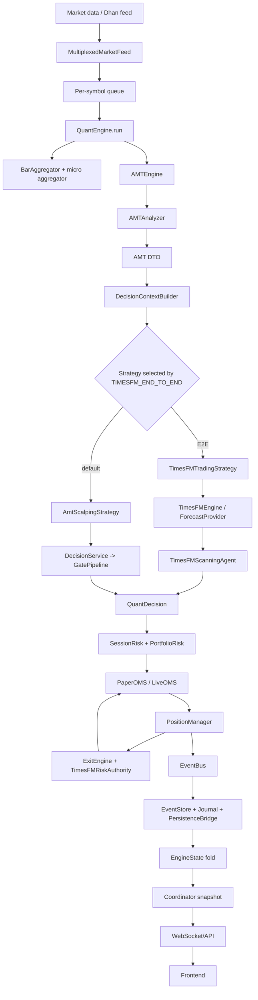
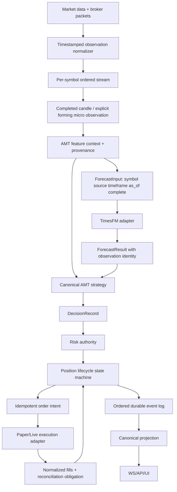

# Full-System Adversarial Review — Current Runtime

**Date:** 2026-09-11
**Branch:** `feat/timesfm-paper-e2e-validation`
**HEAD:** `f9e6bf76`
**Scope:** read-only architectural, temporal, AMT, execution, concurrency, replay, Indian-market and failure-mode review. No production source was modified during this review.

## Executive verdict

**GO for continued paper/replay validation. NO-GO for unqualified live Indian-market deployment.**

The current system has a credible deterministic safety spine:

- one runtime decision seam,
- EventStore fold for the displayed canonical state,
- injected PaperOMS/LiveOMS boundaries,
- aggregate portfolio-risk locking,
- monotonic protective-stop handling,
- persistent entry intent before live broker submission,
- model-risk and sizing-failure observability,
- shared TimesFM inference locking and observation identity,
- deterministic replay tests and a passing release gate.

However, the system does **not** yet prove the most important live invariant:

> Every forecast and decision must use a timestamped, completed, instrument-correct observation, and every broker exposure must have exactly one durable local owner through partial fills, timeouts, restart, and reconciliation.

The highest-priority blockers are:

1. **P0 — inferred order-flow data can influence decision-critical AMT rules while only being labeled as degraded.** Candle-distributed/Gaussian footprint, CVD, OFI and absorption proxies are not equivalent to trade aggression plus L2. The runtime can still approve from those proxies.
2. **P1 — ad-hoc scanner/coordinator forecast paths lack a shared completion/timestamp identity contract.** They can use a forming/current history candle, different instrument sources, repeated quote padding, or unsorted history without a common invariant.
3. **P1 — remote advisor responses and snapshot buffers have no monotonic timestamp/bar identity validation.** A delayed older response can be emitted after a newer decision.
4. **P1 — live partial entry/close and broker timeout/retry flows are not proven to preserve one canonical exposure across restart.** The adapter can return no local position after a broker partial fill, creating a reconciliation-dependent orphan.
5. **P1 — EventStore failure is tolerated after side effects already ran, and snapshot fallback masks fold corruption.** A journal/UI state can disagree with the canonical event fold without forcing readiness failure.
6. **P1 — Fabio source parity is materially false.** Range bars are missing, value area is 70% rather than the cited 68.2%, LVN threshold/algorithm differs, and absorption thresholds/confirmation differ.

No source patch should be applied from this review until the findings below are converted into approved implementation tasks with failing adversarial tests.

---

## A. Actual architecture



### Actual components

| Component | Actual responsibility | Evidence |
|---|---|---|
| FastAPI lifespan | Loads settings, scanner/bootstrap, coordinator, signal handlers | `backend/app/main.py:187-319` |
| Composition root | Builds broker, market data, coordinator configuration | `backend/app/application/di/composition_root.py:27-220` |
| `QuantCoordinator` | Owns symbols, engines, feed, bounded executor, EOD thread, portfolio risk | `quant/multi_engine.py:336-428,433-485,1154-1213` |
| `QuantEngine` | Tick loop, aggregation, AMT, decision seam, OMS, events, exits | `quant/runtime.py:252-287,700-749` |
| `AMTEngine` | Candle ring, incremental session profile, footprint accumulator, analyzer | `quant/amt_engine.py:149-221,406-490` |
| `DecisionContextBuilder` | DTO/risk/position/order-book → immutable decision context | `quant/decision/context_builder.py:284-479` |
| TimesFM native engine | Shared model loading, input buffers, forecast, scanner/position role routing | `quant/decision/timesfm_engine.py:37-523` |
| TimesFM strategy | E2E entry qualification and forecast-derived signal | `quant/strategies/timesfm_strategy.py:84-345` |
| AMT strategy | Deterministic `DecisionService` entry seam | `quant/strategies/amt_scalping.py:22-60` |
| Scanner | Option chain candidate discovery and independent root forecasts | `quant/amt/session/scanner.py:47-900` |
| PositionManager | Operational close, partial, pyramid and stop event orchestration | `quant/position_manager.py:77-670` |
| OMS | Paper/live order and fill boundary | `quant/execution/oms.py`, `quant/execution/live_oms.py` |
| EventStore | Append-only event source used for fold/replay | `quant/event_store.py:247-439` |
| WebSocket | Snapshot/delta transport, no trading authority | `backend/app/api/websocket/gameloop.py:261-404` |

---

## B. Canonical trading flow and authority

### Entry

```text
Tick
 -> BarAggregator or micro aggregator
 -> AMTEngine.analyze
 -> AMT DTO
 -> DecisionContextBuilder
 -> QuantEngine._decide
 -> strategy.should_enter(ctx)
 -> TimesFM scanner OR DecisionService/GatePipeline
 -> QuantDecision
 -> SessionRisk.position_size + clamp_quantity
 -> PortfolioRiskAuthority
 -> OMS.submit
 -> PositionOpened
```

**Actual authority:** one runtime seam exists at `quant/runtime.py:1040`, but the strategy implementation changes by environment flag. E2E uses TimesFM scanner; default uses `DecisionService`. The advisor is asynchronous and advisory-only, but the repository contains multiple forecast factories and scanner/coordinator forecast paths outside the entry seam.

### Position lifecycle

```text
FLAT
 -> DecisionProduced approved
 -> SignalApproved
 -> ENTRY_PENDING / OMS submit
 -> PositionOpened
 -> MANAGING
 -> PositionReduced or PositionClosed
 -> RiskUpdated / PortfolioRisk release
 -> FLAT
```

### Ownership table

| State/decision | Intended owner | Current reality |
|---|---|---|
| Entry approval | Strategy seam | One seam, two strategy implementations; advisory model is separate |
| Final quantity | SessionRisk | Correct central owner after remediation |
| Position state for UI/replay | EventStore fold | Correct declared authority, but fallback can mask failures |
| Operational position | PositionManager | Mutable second authority; reconciliation repairs drift |
| Stop state | ProtectiveStopState direction now exists | Integration remains partial: submitted signal, event fold, and runtime stores must be fully unified |
| Broker exposure | Broker/OMS | Reconciliation-dependent during partial/unknown states |
| Portfolio risk | PortfolioRiskAuthority | Lock-protected, but exact-once caller bookkeeping is critical |

---

## C. Event flow audit

### Events observed

`BarClosed`, `DecisionProduced`, `SignalApproved`, `SignalBlocked`, `PositionOpened`, `PositionClosed`, `PositionReduced`, `RiskUpdated`, `DepthUpdated`, `AmtUpdated`, `OrderSubmitted`, `OrderFilled`, `StopMoved`, `AgentDecisionProduced`.

### Event path

```text
QuantEngine._emit
 -> EventBus synchronous subscribers
    -> journal / persistence bridge / hotpath
 -> latest in-memory fields
 -> EventStore.append
 -> apply_event fold
 -> EngineState
 -> project_state
 -> QuantCoordinator.snapshot
 -> ws_adapter
 -> frontend
```

### Findings

**P1 — side effects run before canonical EventStore append.**

Evidence: `quant/runtime.py:1717-1734`. `_emit` publishes to EventBus and updates operational/latest fields before `EventStore.append`. Append failure is logged but tolerated. Consequence: journal/WS/persistence can observe `PositionOpened` or `PositionClosed` while canonical fold lacks it.

**P1 — snapshot fallback masks canonical corruption.**

Evidence: `quant/multi_engine.py:767-775`. Fold failure falls back to mutable `engine.state`. This keeps UI alive but can display state that cannot be reconstructed from the event log.

**P2 — duplicate delivery mechanisms.**

EventBus and EventStore each expose subscriber/publish concepts, but live flow primarily uses EventBus plus direct EventStore append. Evidence: `quant/events.py:143-220`, `quant/event_store.py:366-402`. Future subscribers can accidentally diverge between live and replay.

**P2 — unknown partial events are silently ignored.**

Evidence: `quant/transitions.py:242-244`. An unmatched `PositionReduced` returns state unchanged. This is replay-tolerant, but without a metric it hides accounting divergence.

**P2 — remote advisor emits results without current-bar discard.**

Evidence: `quant/decision/timesfm_advisor.py:194-245`, `quant/decision/timesfm_client.py:142-156`. A delayed old context can produce a late `AgentDecisionProduced` after a newer context.

---

## D. TimesFM 3 input and temporal audit

### Native model inputs

The native model receives an ordered close-price window, normally 32 values, from a per-symbol engine buffer capped at 512. Evidence: `quant/decision/timesfm_engine.py:81-85,313-358`.

It does **not** receive AMT features as raw model inputs. AMT/session/position/risk data are supplied to the scanner/position agent after forecast generation.

### Correct classification

| Input | Required by raw model | Required by strategy | Required by position management | Decision |
|---|---:|---:|---:|---|
| Ordered close series | Yes | Yes | No | Must carry timestamp/timeframe/completion metadata |
| OHLCV | Not required by current native model | AMT needs it | Exit uses bar high/low/close | Keep outside raw TimesFM unless model contract changes |
| CVD/absorption/OBI/VA | No | Yes | Yes | Strategy/context layer only |
| Position side/entry/SL/TP | No | Entry guards | Yes | Do not inject into raw price forecast |
| Equity/exposure | No | Risk/sizing | Yes | Risk layer only |
| Option chain Greeks | No | Selector/translation | Risk translation | Never confuse with candle delta |

### High-risk temporal findings

**P1 — scanner/coordinator forecasts lack completion identity.**

Evidence: `quant/amt/session/scanner.py:404-470`, `quant/multi_engine.py:1383-1462`. They retain closes but not timestamp, source observation, completion status, timeframe identity, or sortedness invariant. History queries use “now” and may include a forming candle depending on broker API semantics.

**P1 — remote path has no monotonic context ordering.**

Evidence: `quant/decision/timesfm_advisor.py:168-206`, `quant/decision/timesfm_client.py:142-156`. Queue arrival order becomes snapshot order; an older delayed context can appear after newer data.

**P1 — provider cache identity is insufficient.**

Evidence: `quant/modeling/forecast_provider.py:20-31`. Key is `(symbol, decision_sequence)` with no timestamp, timeframe, completion flag, or TTL.

**P2 — production entry may use forming micro-bars.**

Evidence: `quant/runtime.py:822-828`. A one-minute micro-bar can trigger a decision before the five-minute bar closes. This can be valid as a low-latency mode, but it is not equivalent to closed-candle replay and must be explicitly labeled/excluded from parity claims.

**P2 — multiple independent forecast producers can disagree.**

Native engine, strategy provider, scanner root forecast and coordinator root forecast each construct different contexts. Evidence: `timesfm_engine.py:491-523`, `timesfm_strategy.py:298-345`, `scanner.py:404-470`, `multi_engine.py:1383-1467`.

**P2 — underlying forecast versus option execution is not explicit in the forecast contract.**

The option/underlying branch is currently dead in coordinator wiring (`underlying_gateway=None`), but if enabled, `_build_context` and advisor context use different symbol identities. A forecast must explicitly state whether it describes the traded option or an underlying instrument.

### Temporal invariant

> At decision timestamp T, every market observation used by model, AMT, scanner, sizing or exit must have an observation timestamp ≤ T and an explicit `complete/forming` status.

Current violations/risks:

- forming micro-bar entry path
- broker history potentially including current candle
- remote out-of-order queue
- provider cache sequence reuse
- ad-hoc repeated quote/spot padding to 32 values
- no shared candle completion contract across scanner/coordinator/provider

---

## E. Fabio AMT rule audit

| Rule | Runtime classification | Evidence |
|---|---|---|
| Tick aggressor + 20-50 level L2 | APPROXIMATION | Only best bid/ask and tick rule in `quant/amt_engine.py:199-221`, `footprint.py:126-169` |
| Range bars | MISSING | Runtime uses fixed interval bars; no source-equivalent range-bar engine |
| Four independent profiles | APPROXIMATION | Session + leg profile present; compression/gap layers not proven |
| 68.2% value area | INCORRECT | Runtime/config uses 70%, `backend/config/base.yaml:131,334` |
| LVN 0.35 mean/local convexity | INCORRECT | Runtime uses 15th percentile/local detector, `analyzer.py:138-149`, `lvn.py:120-190` |
| VWAP typical price and sigma | AMBIGUOUS | Implementation exists, exact source parity not proven |
| CVD buy-sell divergence | APPROXIMATION | Exact only with true trade-side delta; candle history infers buy/sell |
| Bubble thresholds | APPROXIMATION | Runtime uses adaptive z-score, not fixed source contract thresholds |
| Absorption 1.5x volume / 0.5H / 60% | INCORRECT | Runtime detector uses different range, volume and confirmation rules |
| Triple-A lifecycle | AMBIGUOUS | State machine exists, but no frozen source vector proves every transition |
| Four deterministic gates | EXACT/AMBIGUOUS | Gate pipeline is explicit; source-to-Gate-3 matrix incomplete |
| Risk/cushion/halts | AMBIGUOUS | Values vary by environment; resolved config needs acceptance test |
| Pyramid 50/25 and tiered TP | EXACT WITH CAVEATS | Implemented, but live partial-fill and lot edge cases require broker tests |
| TimesFM advisory-only | EXACT | Runtime decides before advisor dispatch; `runtime.py:1003-1027` |

**P0 — inferred order-flow can influence decisions.**

Candle-distributed/Gaussian footprint, candle delta, CVD and OFI proxies are labeled with provenance but can still feed decision-critical fields. Evidence: `quant/amt_engine.py:104-119`, `quant/amt/orderflow/footprint.py:24-99`, `detectors.py:203-242`, DTO provenance `quant/amt/dto.py:51-57`. The system must either block rules requiring exact flow when provenance is not `TICK_EXACT`, or explicitly label the resulting decisions as proxy mode and exclude them from live readiness.

**P1 — source-rule parity is materially false.**

Value area, LVN, range bars and absorption differ from the cited Fabio source. The implementation should be described as Fabio-inspired until frozen source vectors pass.

---

## F. Scanner → PositionManager lifecycle

Actual lifecycle:

```text
OptionScannerService ScanResult
 -> coordinator contract selection
 -> QuantEngine per-symbol
 -> ContextBuilder
 -> strategy.should_enter
 -> QuantDecision
 -> SessionRisk.position_size
 -> PortfolioRisk reservation
 -> OMS.submit
 -> PositionOpened
 -> PositionManager.manage_exit
 -> PositionReduced / PositionClosed
```

The scanner does not directly own active positions, which is correct. However, there are multiple independent forecast/ranking paths before the contract reaches the engine, so the candidate’s source timestamp/instrument provenance is not yet carried through as a durable decision record.

Canonical state machine:

```text
FLAT -> SIGNAL_DETECTED -> RISK_APPROVED -> ENTRY_PENDING -> OPEN
OPEN -> MANAGING -> EXIT_PENDING -> FLAT
```

Illegal-transition risks requiring tests:

- entry partial acknowledged after local failure
- duplicate signal after restart
- close retry after delayed original fill
- same-bar entry and stop/target touch
- stale advisor result after newer deterministic decision

---

## G. Position, order and execution audit

### P0 — partial entry can leave broker exposure while local state stays flat

Evidence: `backend/app/infrastructure/adapters/dhan_broker_adapter.py:274-290` persists a partial as filled but can return no engine position. Runtime then treats the entry as failed and unwinds reservation. This can leave an actual partial broker position requiring reconciliation while local state says no position.

Required test: broker fills 40%, cancel/status race, restart, reconcile. Local state must contain a reconciliation obligation and must not release all risk.

### P1 — close durability is less symmetric than entry durability

Entry persists `SUBMITTED` before broker I/O (`dhan_broker_adapter.py:231-240`). Close uses a stable logical ID but the inspected close range does not provide the same pre-submit durable transition (`:445-512`). A crash after broker acceptance and before local persistence can leave unknown exposure.

### P1 — fallback close produces two broker orders

Evidence: `dhan_broker_adapter.py:481-505`. A collared close can be followed by a market fallback. Late fill from the original must be linked to the same economic close and must not double-count P&L.

### P2 — unmatched partial events are silently ignored

Evidence: `quant/transitions.py:242-244`. Emit a diagnostic mismatch event/metric or fail reconciliation readiness.

### P2 — process-local duplicate signal guard is not restart authority

Evidence: `dhan_broker_adapter.py:101-112,183-196`. A restart empties the process set; durable order identity/reconciliation must reject replayed signals first.

### P3 — paper/live parity is not economic parity

Paper instant-mid uses reference price (`paper_simulator.py:147-153`), while live uses broker average fills (`dhan_broker_adapter.py:314-322`). Delayed fills, bid/ask, partials, costs and cancellation races differ.

---

## H. Concurrency and event-ordering audit

Shared-state inventory:

| State | Writers | Protection | Risk |
|---|---|---|---|
| Engine PM/OMS/risk/bar index | Engine thread by convention | Close lock only for selected paths | Direct helper paths and callbacks can violate convention |
| PortfolioRisk maps | Multiple engine threads | RLock | Correct only if each caller releases exactly once |
| Multiplexed feed queues | Producer thread + readers | queue/locks | Reconnect/order semantics need adversarial tests |
| Advisor queue | Runtime producer + worker | bounded queue | Drops contexts; remote path lacks monotonic validation |
| EventBus | Engine publisher + subscribers | `_emit_lock` around engine emission | Side effects before EventStore append |
| SQLite tick buffer | Engine/timer/UI | adapter locks/timer | Recent ticks can be lost on crash |
| WS snapshot work | asyncio + default thread pool | coordinator locks/fold | Unbounded client-driven worker multiplier |

Required adversarial scenarios:

1. duplicate entry signal before broker acknowledgement
2. broker partial entry followed by timeout/cancel
3. delayed original close fill followed by fallback close
4. stop event and manual/strategy exit simultaneously
5. old advisor response emitted after newer bar
6. same-bar entry and protective stop touch
7. restart with durable signal already submitted
8. EventStore append failure after side effects
9. journal disk failure during close
10. out-of-order remote snapshots

---

## I. Indian-market audit

Present strengths:

- IST-aware session gating exists (`quant/session_gates.py`)
- NSE/MCX session differences are modeled
- expiry-day entry restrictions exist
- instrument registry carries lot/tick metadata
- option short direction is blocked
- live OMS validates contract identity and quantity
- EOD/emergency squareoff exists

Unproven or risky:

- exchange holiday/calendar accuracy and shifted expiries require fixtures
- dynamic broker metadata can diverge from static registry
- freeze-limit chunking must be proven
- live statutory cost ledger parity is not proven
- partial broker fills and forced squareoff need real public-interface tests
- market gaps/halts/circuit behavior are not modeled end to end

---

## J. Replay/backtest/live parity

| Area | Paper/replay | Live | Verdict |
|---|---|---|---|
| OMS | synchronous PaperOMS | delayed LiveOMS/broker polling | divergent timing |
| Fill price | instant-mid/reference or bid/ask simulator | broker average fill | not equivalent |
| Costs | simulator configured costs | live adapter-reported fills/costs | ledger parity unproven |
| Timing | synchronous fill and event fold | asynchronous broker callbacks/retries | materially divergent |
| Candle input | aggregator/replay bars | micro/forming/live bars possible | temporal contract incomplete |
| Seed/replay | deterministic AMT/TimesFM seed | live history/provider-dependent | source identity incomplete |

A profitable backtest would not prove live correctness under these differences.

---

## K. Final prioritized findings

### P0

1. Inferred OHLCV/order-flow proxies can approve decision-critical AMT setups without exact trade-side/L2 evidence.
2. Broker partial entry can leave local-flat/broker-exposed state.

### P1

3. Scanner/coordinator/provider forecast inputs lack a common timestamp, timeframe and completed-candle contract.
4. Remote advisor/snapshot path can process and emit out-of-order contexts.
5. EventStore append failure after EventBus side effects can split canonical state from journal/operational state.
6. Snapshot fallback to mutable engine state can mask EventStore corruption.
7. Fabio source parity is materially false for range bars, value area, LVN and absorption.
8. Close retry/fallback durability and exactly-once reconciliation are not proven.

### P2

9. Same `bar_index` micro observations require identity-aware freshness in every downstream consumer, not only native cache.
10. ForecastProvider cache has no timestamp/timeframe/TTL identity.
11. Partial-fill semantics differ across PaperOMS and LiveOMS.
12. Unknown unmatched partial events are silently ignored.
13. Broker metadata/freeze limits and Indian calendar/expiry behavior lack acceptance coverage.
14. Paper instant-mid hides live spread and delayed-fill risk.

### P3

15. EventBus and EventStore expose overlapping subscriber concepts.
16. PositionManager, OMS, EventStore, storage and broker all remain operationally active state views.
17. Scanner/coordinator/native/provider forecast producers duplicate context construction.
18. DynamicSizing telemetry remains internal and partly unused.
19. WS snapshot work uses the default async thread pool without a global budget.

### P4

20. Documentation currently overstates exact Fabio compliance; describe it as Fabio-inspired until parity vectors pass.
21. Event ID namespaces differ between EventBus and EventStore.
22. Remote/fixture and generated-artifact contracts need continued fresh-clone enforcement.

---

## L. Canonical desired architecture



Rules:

- raw model input never contains position/risk/order fields
- every forecast carries source instrument, timeframe, observation timestamp, bar identity, completion status, padding count and provenance
- one strategy owner creates decisions
- one risk owner sizes/approves
- one lifecycle owner mutates position state
- one durable event log feeds all projections
- broker unknown/partial states remain explicit until reconciled

---

## M. Final go/no-go decision

**Paper/replay:** GO with the stated residuals and per-directory verification.

**Live Indian markets:** **NO-GO** until at least these P0/P1 items have public-interface tests and fixes:

1. exact-flow provenance blocks or clearly isolates inferred AMT approvals
2. completed-candle/timestamp contract covers scanner, coordinator, provider and remote advisor
3. partial entry/close and fallback close are durable and exactly-once across restart
4. EventStore failure cannot silently leave UI/journal ahead of canonical state
5. Fabio parity differences are either corrected or explicitly removed from “exact” claims
6. Indian holiday/expiry/metadata/freeze/cost behavior passes representative fixtures

### Most important question

**YES.** A realistic live sequence can still produce a materially wrong decision or uncontrolled exposure:

- broker partially fills an entry,
- adapter returns no engine position after cancellation/timeout,
- runtime releases the reservation and remains locally flat,
- broker retains partial exposure until reconciliation.

This is **P0** because it can leave a live Indian-market position outside the local position manager and risk state. The required fix is not a local retry; it is an explicit durable `RECONCILIATION_REQUIRED` exposure state, persisted before/with the broker interaction, with restart-safe broker reconciliation before new entries.

A second realistic P1 sequence is:

- scanner/coordinator history request includes a forming current candle,
- forecast is generated without completion/timestamp provenance,
- AMT and strategy approve on data that would not exist in a closed-candle replay.

That is why the system is not live-ready even though the current release gate passes.

## Remediation plan

The findings in this report are addressed by the implementation plan:
`docs/plans/2026-09-11-live-safety-adversarial-remediation.md`.

Implementation is intentionally gated:

- live deployment remains NO-GO while P0/P1 exposure, temporal identity,
  persistence atomicity, and exact-flow provenance tests are incomplete;
- paper/replay work may continue under the existing release gate;
- each task requires a failing adversarial test before implementation;
- broker-facing workflows require boundary/restart/reconciliation tests rather
  than only unit mocks.

## Live-safety implementation update (2026-09-11)

Added `ExposureState` with `RECONCILIATION_REQUIRED` and an entry guard that
blocks new decisions while unresolved broker exposure exists (`1db05744`).
The state contract is tested, but LiveOMS/Dhan partial-fill population and
restart reconciliation remain the next required step; the guard currently
provides the safety boundary once a partial exposure is reported.
